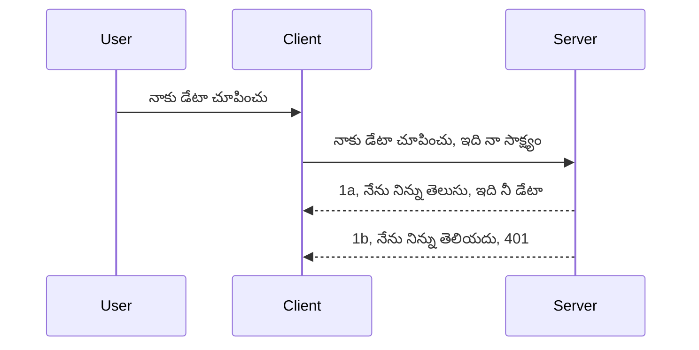

<!--
CO_OP_TRANSLATOR_METADATA:
{
  "original_hash": "5b00b8a8971a07d2d8803be4c9f138f8",
  "translation_date": "2025-12-11T12:13:23+00:00",
  "source_file": "03-GettingStarted/11-simple-auth/README.md",
  "language_code": "te"
}
-->
# సింపుల్ ఆథ్

MCP SDKలు OAuth 2.1 ఉపయోగాన్ని మద్దతు ఇస్తాయి, ఇది నిజంగా ఒక సంక్లిష్టమైన ప్రక్రియ, ఇందులో ఆథ్ సర్వర్, రిసోర్స్ సర్వర్, క్రెడెన్షియల్స్ పోస్ట్ చేయడం, కోడ్ పొందడం, కోడ్‌ను బేరర్ టోకెన్ కోసం మార్పిడి చేయడం వరకు అనేక కాన్సెప్ట్‌లు ఉంటాయి, చివరికి మీరు మీ రిసోర్స్ డేటాను పొందగలుగుతారు. మీరు OAuthకు అలవాటు కాకపోతే, ఇది అమలు చేయడానికి గొప్ప విషయం, మీరు ప్రాథమిక స్థాయి ఆథ్‌తో ప్రారంభించి మెరుగైన భద్రత వైపు అభివృద్ధి చెందడం మంచిది. అందుకే ఈ అధ్యాయం ఉంది, మీకు మరింత అభివృద్ధి చెందిన ఆథ్‌ను నిర్మించడానికి.

## ఆథ్ అంటే ఏమిటి?

ఆథ్ అనేది authentication మరియు authorization యొక్క సంక్షిప్త రూపం. మనం రెండు విషయాలు చేయాల్సి ఉంటుంది:

- **Authentication**, అంటే మన ఇంటికి ఒక వ్యక్తి ప్రవేశించడానికి అనుమతిస్తామా, వారు "ఇక్కడ" ఉండడానికి హక్కు ఉందా అంటే మన MCP సర్వర్ ఫీచర్లు ఉన్న రిసోర్స్ సర్వర్‌కు యాక్సెస్ ఉందా అని తెలుసుకోవడం.
- **Authorization**, అంటే ఒక యూజర్ అడిగిన నిర్దిష్ట వనరులకు యాక్సెస్ కలిగి ఉండాలా లేదా, ఉదాహరణకు ఆ ఆర్డర్లు లేదా ఉత్పత్తులు లేదా వారు కంటెంట్ చదవడానికి అనుమతించబడిన వారు కానీ తొలగించడానికి అనుమతించబడలేదా అని తెలుసుకోవడం.

## క్రెడెన్షియల్స్: మనం సిస్టమ్‌కు మనం ఎవరో ఎలా చెబుతాము

బహుశా, చాలా వెబ్ డెవలపర్లు సర్వర్‌కు క్రెడెన్షియల్ అందించడం గురించి ఆలోచిస్తారు, సాధారణంగా ఒక సీక్రెట్, ఇది వారు "Authentication" కోసం ఇక్కడ ఉండడానికి అనుమతించబడిన వారు అని చెబుతుంది. ఈ క్రెడెన్షియల్ సాధారణంగా యూజర్‌నేమ్ మరియు పాస్వర్డ్ యొక్క base64 ఎన్‌కోడ్ చేసిన వెర్షన్ లేదా ఒక API కీ, ఇది ఒక నిర్దిష్ట యూజర్‌ను ప్రత్యేకంగా గుర్తిస్తుంది.

ఇది "Authorization" అనే హెడర్ ద్వారా ఇలా పంపబడుతుంది:

```json
{ "Authorization": "secret123" }
```

ఇది సాధారణంగా బేసిక్ ఆథెంటికేషన్ అని పిలవబడుతుంది. మొత్తం ఫ్లో ఇలా పనిచేస్తుంది:


ఇప్పుడు ఫ్లో పరంగా ఇది ఎలా పనిచేస్తుందో అర్థం చేసుకున్నాం, దీన్ని ఎలా అమలు చేయాలి? చాలా వెబ్ సర్వర్లు మిడిల్‌వేర్ అనే కాన్సెప్ట్ కలిగి ఉంటాయి, ఇది రిక్వెస్ట్ భాగంగా నడిచే కోడ్, ఇది క్రెడెన్షియల్స్‌ను ధృవీకరించగలదు, మరియు క్రెడెన్షియల్స్ సరైనవైతే రిక్వెస్ట్‌ను అనుమతిస్తుంది. రిక్వెస్ట్ సరైన క్రెడెన్షియల్స్ లేకపోతే ఆథ్ లోపం వస్తుంది. దీన్ని ఎలా అమలు చేయాలో చూద్దాం:

**Python**

```python
class AuthMiddleware(BaseHTTPMiddleware):
    async def dispatch(self, request, call_next):

        has_header = request.headers.get("Authorization")
        if not has_header:
            print("-> Missing Authorization header!")
            return Response(status_code=401, content="Unauthorized")

        if not valid_token(has_header):
            print("-> Invalid token!")
            return Response(status_code=403, content="Forbidden")

        print("Valid token, proceeding...")
       
        response = await call_next(request)
        # ఏదైనా కస్టమర్ హెడ్డర్లు జోడించండి లేదా ప్రతిస్పందనలో ఏదైనా మార్పు చేయండి
        return response


starlette_app.add_middleware(CustomHeaderMiddleware)
```

ఇక్కడ మనం:

- `AuthMiddleware` అనే మిడిల్‌వేర్ సృష్టించాము, దీని `dispatch` మెథడ్ వెబ్ సర్వర్ ద్వారా పిలవబడుతుంది.
- మిడిల్‌వేర్‌ను వెబ్ సర్వర్‌కు జోడించాము:

    ```python
    starlette_app.add_middleware(AuthMiddleware)
    ```

- Authorization హెడర్ ఉన్నదో లేదో మరియు పంపబడిన సీక్రెట్ సరైనదో లేదో తనిఖీ చేసే వాలిడేషన్ లాజిక్ రాశాము:

    ```python
    has_header = request.headers.get("Authorization")
    if not has_header:
        print("-> Missing Authorization header!")
        return Response(status_code=401, content="Unauthorized")

    if not valid_token(has_header):
        print("-> Invalid token!")
        return Response(status_code=403, content="Forbidden")
    ```

    సీక్రెట్ ఉన్నది మరియు సరైనదైతే, `call_next` పిలిచి రిక్వెస్ట్‌ను అనుమతించి స్పందనను తిరిగి ఇస్తాము.

    ```python
    response = await call_next(request)
    # ఏదైనా కస్టమర్ హెడ్డర్లు జోడించండి లేదా ప్రతిస్పందనలో ఏదైనా మార్పు చేయండి
    return response
    ```

ఇది ఎలా పనిచేస్తుందంటే, వెబ్ రిక్వెస్ట్ సర్వర్ వైపు వస్తే మిడిల్‌వేర్ పిలవబడుతుంది మరియు దాని అమలుపై ఆధారపడి రిక్వెస్ట్‌ను అనుమతిస్తుంది లేదా క్లయింట్ కొనసాగడానికి అనుమతించబడలేదని సూచించే లోపాన్ని తిరిగి ఇస్తుంది.

**TypeScript**

ఇక్కడ మనం Express అనే ప్రాచుర్యం పొందిన ఫ్రేమ్‌వర్క్‌తో మిడిల్‌వేర్ సృష్టించి MCP సర్వర్‌కు రిక్వెస్ట్ చేరే ముందు దాన్ని ఇన్‌టర్సెప్టు చేస్తాము. కోడ్ ఇక్కడ ఉంది:

```typescript
function isValid(secret) {
    return secret === "secret123";
}

app.use((req, res, next) => {
    // 1. అనుమతి హెడ్డర్ ఉందా?
    if(!req.headers["Authorization"]) {
        res.status(401).send('Unauthorized');
    }
    
    let token = req.headers["Authorization"];

    // 2. చెల్లుబాటు తనిఖీ చేయండి.
    if(!isValid(token)) {
        res.status(403).send('Forbidden');
    }

   
    console.log('Middleware executed');
    // 3. అభ్యర్థన పైప్‌లైన్‌లో తదుపరి దశకు అభ్యర్థనను పంపండి.
    next();
});
```

ఈ కోడ్‌లో:

1. మొదట Authorization హెడర్ ఉన్నదో లేదో తనిఖీ చేస్తాము, లేకపోతే 401 లోపం పంపుతాము.
2. క్రెడెన్షియల్/టోకెన్ సరైనదో లేదో నిర్ధారిస్తాము, లేకపోతే 403 లోపం పంపుతాము.
3. చివరగా రిక్వెస్ట్‌ను రిక్వెస్ట్ పైప్‌లైన్‌లో పంపించి అడిగిన వనరును తిరిగి ఇస్తాము.

## వ్యాయామం: ఆథెంటికేషన్ అమలు చేయండి

మన జ్ఞానాన్ని తీసుకుని దీన్ని అమలు చేయడానికి ప్రయత్నిద్దాం. ప్రణాళిక ఇక్కడ ఉంది:

సర్వర్

- వెబ్ సర్వర్ మరియు MCP ఇన్స్టాన్స్ సృష్టించండి.
- సర్వర్ కోసం మిడిల్‌వేర్ అమలు చేయండి.

క్లయింట్

- క్రెడెన్షియల్‌తో వెబ్ రిక్వెస్ట్‌ను హెడర్ ద్వారా పంపండి.

### -1- వెబ్ సర్వర్ మరియు MCP ఇన్స్టాన్స్ సృష్టించండి

మొదటి దశలో, మనం వెబ్ సర్వర్ ఇన్స్టాన్స్ మరియు MCP సర్వర్ సృష్టించాలి.

**Python**

ఇక్కడ మనం MCP సర్వర్ ఇన్స్టాన్స్ సృష్టించి, starlette వెబ్ యాప్ సృష్టించి uvicorn తో హోస్ట్ చేస్తున్నాం.

```python
# MCP సర్వర్ సృష్టించడం

app = FastMCP(
    name="MCP Resource Server",
    instructions="Resource Server that validates tokens via Authorization Server introspection",
    host=settings["host"],
    port=settings["port"],
    debug=True
)

# starlette వెబ్ యాప్ సృష్టించడం
starlette_app = app.streamable_http_app()

# uvicorn ద్వారా యాప్ సేవ చేయడం
async def run(starlette_app):
    import uvicorn
    config = uvicorn.Config(
            starlette_app,
            host=app.settings.host,
            port=app.settings.port,
            log_level=app.settings.log_level.lower(),
        )
    server = uvicorn.Server(config)
    await server.serve()

run(starlette_app)
```

ఈ కోడ్‌లో:

- MCP సర్వర్ సృష్టించాము.
- MCP సర్వర్ నుండి starlette వెబ్ యాప్ నిర్మించాము, `app.streamable_http_app()`.
- uvicorn ఉపయోగించి వెబ్ యాప్‌ను హోస్ట్ చేసి సర్వ్ చేస్తున్నాము `server.serve()`.

**TypeScript**

ఇక్కడ MCP సర్వర్ ఇన్స్టాన్స్ సృష్టిస్తున్నాం.

```typescript
const server = new McpServer({
      name: "example-server",
      version: "1.0.0"
    });

    // ... సర్వర్ వనరులు, సాధనాలు, మరియు ప్రాంప్ట్‌లను సెట్ చేయండి ...
```

ఈ MCP సర్వర్ సృష్టింపు మన POST /mcp రూట్ నిర్వచనంలో జరగాలి, కాబట్టి పై కోడ్‌ను ఇలా మార్చుదాం:

```typescript
import express from "express";
import { randomUUID } from "node:crypto";
import { McpServer } from "@modelcontextprotocol/sdk/server/mcp.js";
import { StreamableHTTPServerTransport } from "@modelcontextprotocol/sdk/server/streamableHttp.js";
import { isInitializeRequest } from "@modelcontextprotocol/sdk/types.js"

const app = express();
app.use(express.json());

// సెషన్ ID ద్వారా ట్రాన్స్‌పోర్ట్‌లను నిల్వ చేయడానికి మ్యాప్
const transports: { [sessionId: string]: StreamableHTTPServerTransport } = {};

// క్లయింట్-టు-సర్వర్ కమ్యూనికేషన్ కోసం POST అభ్యర్థనలను నిర్వహించండి
app.post('/mcp', async (req, res) => {
  // ఉన్న సెషన్ ID కోసం తనిఖీ చేయండి
  const sessionId = req.headers['mcp-session-id'] as string | undefined;
  let transport: StreamableHTTPServerTransport;

  if (sessionId && transports[sessionId]) {
    // ఉన్న ట్రాన్స్‌పోర్ట్‌ను మళ్లీ ఉపయోగించండి
    transport = transports[sessionId];
  } else if (!sessionId && isInitializeRequest(req.body)) {
    // కొత్త ప్రారంభ అభ్యర్థన
    transport = new StreamableHTTPServerTransport({
      sessionIdGenerator: () => randomUUID(),
      onsessioninitialized: (sessionId) => {
        // సెషన్ ID ద్వారా ట్రాన్స్‌పోర్ట్‌ను నిల్వ చేయండి
        transports[sessionId] = transport;
      },
      // DNS రీబైండింగ్ రక్షణ డిఫాల్ట్‌గా వెనుకబడిన అనుకూలత కోసం నిలిపివేయబడింది. మీరు ఈ సర్వర్‌ను
      // లోకల్‌గా నడుపుతున్నట్లయితే, ఖచ్చితంగా సెట్ చేయండి:
      // enableDnsRebindingProtection: true,
      // allowedHosts: ['127.0.0.1'],
    });

    // మూసివేసినప్పుడు ట్రాన్స్‌పోర్ట్‌ను శుభ్రపరచండి
    transport.onclose = () => {
      if (transport.sessionId) {
        delete transports[transport.sessionId];
      }
    };
    const server = new McpServer({
      name: "example-server",
      version: "1.0.0"
    });

    // ... సర్వర్ వనరులు, సాధనాలు, మరియు ప్రాంప్ట్‌లను సెట్ చేయండి ...

    // MCP సర్వర్‌కు కనెక్ట్ అవ్వండి
    await server.connect(transport);
  } else {
    // చెల్లని అభ్యర్థన
    res.status(400).json({
      jsonrpc: '2.0',
      error: {
        code: -32000,
        message: 'Bad Request: No valid session ID provided',
      },
      id: null,
    });
    return;
  }

  // అభ్యర్థనను నిర్వహించండి
  await transport.handleRequest(req, res, req.body);
});

// GET మరియు DELETE అభ్యర్థనల కోసం మళ్లీ ఉపయోగించదగిన హ్యాండ్లర్
const handleSessionRequest = async (req: express.Request, res: express.Response) => {
  const sessionId = req.headers['mcp-session-id'] as string | undefined;
  if (!sessionId || !transports[sessionId]) {
    res.status(400).send('Invalid or missing session ID');
    return;
  }
  
  const transport = transports[sessionId];
  await transport.handleRequest(req, res);
};

// SSE ద్వారా సర్వర్-టు-క్లయింట్ నోటిఫికేషన్ల కోసం GET అభ్యర్థనలను నిర్వహించండి
app.get('/mcp', handleSessionRequest);

// సెషన్ ముగింపు కోసం DELETE అభ్యర్థనలను నిర్వహించండి
app.delete('/mcp', handleSessionRequest);

app.listen(3000);
```

ఇప్పుడు మీరు చూస్తున్నారు MCP సర్వర్ సృష్టింపు `app.post("/mcp")` లోకి మార్చబడింది.

మనం వచ్చే దశకు వెళ్దాం, మిడిల్‌వేర్ సృష్టించి వచ్చే క్రెడెన్షియల్‌ను ధృవీకరించడానికి.

### -2- సర్వర్ కోసం మిడిల్‌వేర్ అమలు చేయండి

ఇప్పుడు మిడిల్‌వేర్ భాగానికి వస్తాం. ఇక్కడ మనం `Authorization` హెడర్‌లో క్రెడెన్షియల్ కోసం చూస్తూ దాన్ని ధృవీకరించే మిడిల్‌వేర్ సృష్టిస్తాము. ఇది సరైనదైతే రిక్వెస్ట్ అవసరమైన పనిని చేయడానికి (ఉదా: టూల్స్ జాబితా, వనరు చదవడం లేదా క్లయింట్ అడిగిన MCP ఫంక్షనాలిటీ) ముందుకు వెళుతుంది.

**Python**

మిడిల్‌వేర్ సృష్టించడానికి, మనం `BaseHTTPMiddleware` నుండి వారసత్వం పొందిన క్లాస్ సృష్టించాలి. రెండు ముఖ్యమైన భాగాలు ఉన్నాయి:

- రిక్వెస్ట్ `request`, ఇది హెడర్ సమాచారం చదవడానికి.
- `call_next`, ఇది క్లయింట్ సరైన క్రెడెన్షియల్ తీసుకువచ్చినప్పుడు పిలవాల్సిన కాల్‌బ్యాక్.

మొదట, `Authorization` హెడర్ లేకపోతే ఎలా హ్యాండిల్ చేయాలో చూద్దాం:

```python
has_header = request.headers.get("Authorization")

# హెడ్డర్ లేదు, 401 తో విఫలమవుతుంది, లేకపోతే ముందుకు సాగండి.
if not has_header:
    print("-> Missing Authorization header!")
    return Response(status_code=401, content="Unauthorized")
```

ఇక్కడ క్లయింట్ ఆథెంటికేషన్ విఫలమవుతున్నందున 401 unauthorized సందేశం పంపుతాము.

తర్వాత, క్రెడెన్షియల్ సమర్పించబడితే దాని సరైనదో లేదో ఇలా తనిఖీ చేస్తాము:

```python
 if not valid_token(has_header):
    print("-> Invalid token!")
    return Response(status_code=403, content="Forbidden")
```

పై 403 forbidden సందేశం పంపడం గమనించండి. ఇప్పుడు మనం పూర్ణ మిడిల్‌వేర్‌ను చూద్దాం, పై అన్ని అంశాలను అమలు చేస్తుంది:

```python
class AuthMiddleware(BaseHTTPMiddleware):
    async def dispatch(self, request, call_next):

        has_header = request.headers.get("Authorization")
        if not has_header:
            print("-> Missing Authorization header!")
            return Response(status_code=401, content="Unauthorized")

        if not valid_token(has_header):
            print("-> Invalid token!")
            return Response(status_code=403, content="Forbidden")

        print("Valid token, proceeding...")
        print(f"-> Received {request.method} {request.url}")
        response = await call_next(request)
        response.headers['Custom'] = 'Example'
        return response

```

చాలా బాగుంది, కానీ `valid_token` ఫంక్షన్ గురించి? ఇది ఇక్కడ ఉంది:

```python
# ఉత్పత్తి కోసం ఉపయోగించవద్దు - దాన్ని మెరుగుపరచండి !!
def valid_token(token: str) -> bool:
    # "Bearer " ప్రిఫిక్స్‌ను తీసివేయండి
    if token.startswith("Bearer "):
        token = token[7:]
        return token == "secret-token"
    return False
```

ఇది స్పష్టంగా మెరుగుపరచాలి.

ముఖ్యమైనది: మీరు ఎప్పుడూ కోడ్‌లో ఇలాంటి సీక్రెట్లు ఉంచకూడదు. మీరు ideally విలువను డేటా సోర్స్ లేదా IDP (identity service provider) నుండి పొందాలి లేదా IDP ద్వారా ధృవీకరణ చేయించాలి.

**TypeScript**

Expressతో దీన్ని అమలు చేయడానికి, మిడిల్‌వేర్ ఫంక్షన్లను తీసుకునే `use` మెథడ్‌ను పిలవాలి.

మనకు అవసరం:

- రిక్వెస్ట్ వేరియబుల్‌తో ఇంటరాక్ట్ చేసి `Authorization` ప్రాపర్టీలో క్రెడెన్షియల్ తనిఖీ చేయడం.
- క్రెడెన్షియల్ ధృవీకరించి, సరైనదైతే రిక్వెస్ట్ కొనసాగించి క్లయింట్ MCP రిక్వెస్ట్ చేయాల్సిన పని చేయించాలి (ఉదా: టూల్స్ జాబితా, వనరు చదవడం లేదా ఇతర MCP సంబంధిత).

ఇక్కడ, `Authorization` హెడర్ ఉన్నదో లేదో తనిఖీ చేస్తాము, లేకపోతే రిక్వెస్ట్ ఆపేస్తాము:

```typescript
if(!req.headers["authorization"]) {
    res.status(401).send('Unauthorized');
    return;
}
```

హెడర్ మొదట్లో పంపబడకపోతే 401 వస్తుంది.

తర్వాత, క్రెడెన్షియల్ సరైనదో లేదో తనిఖీ చేస్తాము, సరైనదైతే రిక్వెస్ట్ కొనసాగుతుంది, లేకపోతే వేరే సందేశంతో ఆపేస్తాము:

```typescript
if(!isValid(token)) {
    res.status(403).send('Forbidden');
    return;
} 
```

ఇప్పుడు 403 లోపం వస్తుంది.

పూర్తి కోడ్ ఇక్కడ ఉంది:

```typescript
app.use((req, res, next) => {
    console.log('Request received:', req.method, req.url, req.headers);
    console.log('Headers:', req.headers["authorization"]);
    if(!req.headers["authorization"]) {
        res.status(401).send('Unauthorized');
        return;
    }
    
    let token = req.headers["authorization"];

    if(!isValid(token)) {
        res.status(403).send('Forbidden');
        return;
    }  

    console.log('Middleware executed');
    next();
});
```

మనం వెబ్ సర్వర్‌ను మిడిల్‌వేర్‌ను అంగీకరించేలా సెట్ చేసాము, ఇది క్లయింట్ పంపే క్రెడెన్షియల్‌ను తనిఖీ చేస్తుంది. క్లయింట్ గురించి ఏమిటి?

### -3- క్రెడెన్షియల్‌తో హెడర్ ద్వారా వెబ్ రిక్వెస్ట్ పంపండి

క్లయింట్ క్రెడెన్షియల్‌ను హెడర్ ద్వారా పంపుతున్నదని నిర్ధారించాలి. మనం MCP క్లయింట్ ఉపయోగించబోతున్నందున, అది ఎలా చేయాలో తెలుసుకోవాలి.

**Python**

క్లయింట్ కోసం, క్రెడెన్షియల్‌తో హెడర్ ఇలా పంపాలి:

```python
# విలువను హార్డ్‌కోడ్ చేయవద్దు, కనీసం ఒక ఎన్విరాన్‌మెంట్ వేరియబుల్ లేదా మరింత సురక్షిత నిల్వలో ఉంచండి
token = "secret-token"

async with streamablehttp_client(
        url = f"http://localhost:{port}/mcp",
        headers = {"Authorization": f"Bearer {token}"}
    ) as (
        read_stream,
        write_stream,
        session_callback,
    ):
        async with ClientSession(
            read_stream,
            write_stream
        ) as session:
            await session.initialize()
      
            # TODO, క్లయింట్‌లో మీరు చేయించాలనుకునే పని, ఉదా: టూల్స్ జాబితా చేయడం, టూల్స్ కాల్ చేయడం మొదలైనవి.
```

`headers` ప్రాపర్టీని ఇలా పూరించటం గమనించండి ` headers = {"Authorization": f"Bearer {token}"}`.

**TypeScript**

ఇది రెండు దశల్లో పరిష్కరించవచ్చు:

1. క్రెడెన్షియల్‌తో కాన్ఫిగరేషన్ ఆబ్జెక్ట్ పూరించండి.
2. ఆ కాన్ఫిగరేషన్ ఆబ్జెక్ట్‌ను ట్రాన్స్‌పోర్ట్‌కు పంపండి.

```typescript

// ఇక్కడ చూపినట్లుగా విలువను హార్డ్‌కోడ్ చేయవద్దు. కనీసం దాన్ని env వేరియబుల్‌గా ఉంచి dev మోడ్‌లో dotenv వంటి దాన్ని ఉపయోగించండి.
let token = "secret123"

// క్లయింట్ ట్రాన్స్‌పోర్ట్ ఆప్షన్ ఆబ్జెక్ట్‌ను నిర్వచించండి
let options: StreamableHTTPClientTransportOptions = {
  sessionId: sessionId,
  requestInit: {
    headers: {
      "Authorization": "secret123"
    }
  }
};

// ఆప్షన్స్ ఆబ్జెక్ట్‌ను ట్రాన్స్‌పోర్ట్‌కు పంపండి
async function main() {
   const transport = new StreamableHTTPClientTransport(
      new URL(serverUrl),
      options
   );
```

ఇక్కడ మీరు చూస్తున్నారు `options` ఆబ్జెక్ట్ సృష్టించి `requestInit` ప్రాపర్టీ కింద హెడర్స్ ఉంచడం.

ముఖ్యమైనది: ఇక్కడి నుండి ఎలా మెరుగుపరచాలి? ప్రస్తుత అమలు కొన్ని సమస్యలు కలిగి ఉంది. మొదట, ఇలాగే క్రెడెన్షియల్ పంపడం చాలా ప్రమాదకరం, కనీసం HTTPS లేకపోతే. అయినప్పటికీ, క్రెడెన్షియల్ దొంగిలించబడవచ్చు కాబట్టి మీరు టోకెన్‌ను సులభంగా రద్దు చేయగలిగే సిస్టమ్ అవసరం, అదనపు తనిఖీలు కూడా ఉండాలి, ఉదా: ఇది ప్రపంచంలో ఎక్కడి నుండి వస్తోంది, రిక్వెస్ట్ చాలా తరచుగా వస్తున్నదా (బాట్ లాంటి ప్రవర్తన), సంక్షిప్తంగా, అనేక ఆందోళనలు ఉన్నాయి.

అయితే, చాలా సింపుల్ APIలకు ఇది మంచి ప్రారంభం, మీరు ఎవరికీ మీ API కాల్ చేయకుండా ఉండాలనుకుంటే.

అందుకే, భద్రతను కొంచెం గట్టిగా చేయడానికి JSON వెబ్ టోకెన్ (JWT లేదా "JOT" టోకెన్లు) వంటి ప్రమాణీకృత ఫార్మాట్ ఉపయోగిద్దాం.

## JSON వెబ్ టోకెన్లు, JWT

కాబట్టి, మనం చాలా సింపుల్ క్రెడెన్షియల్స్ పంపడం నుండి మెరుగుపరచడానికి ప్రయత్నిస్తున్నాం. JWTని స్వీకరించడం ద్వారా మనకు తక్షణమే లభించే మెరుగుదలలు ఏమిటి?

- **భద్రతా మెరుగుదలలు**. బేసిక్ ఆథ్‌లో, మీరు యూజర్‌నేమ్ మరియు పాస్వర్డ్‌ను base64 ఎన్‌కోడ్ చేసిన టోకెన్ (లేదా API కీ)గా తరచూ పంపుతారు, ఇది ప్రమాదాన్ని పెంచుతుంది. JWTతో, మీరు యూజర్‌నేమ్ మరియు పాస్వర్డ్ పంపించి టోకెన్ పొందుతారు, ఇది సమయ పరిమితి కలిగి ఉంటుంది అంటే ఇది గడువు ముగుస్తుంది. JWT రోల్స్, స్కోప్స్ మరియు అనుమతులతో సున్నితమైన యాక్సెస్ నియంత్రణను సులభంగా ఉపయోగించడానికి అనుమతిస్తుంది.
- **స్టేట్‌లెస్‌నెస్ మరియు స్కేలబిలిటీ**. JWTలు స్వీయ-సంకలితమైనవి, అవి అన్ని యూజర్ సమాచారాన్ని కలిగి ఉంటాయి మరియు సర్వర్-సైడ్ సెషన్ నిల్వ అవసరాన్ని తొలగిస్తాయి. టోకెన్ స్థానికంగా కూడా ధృవీకరించవచ్చు.
- **ఇంటర్‌ఓపరబిలిటీ మరియు ఫెడరేషన్**. JWTలు Open ID Connect యొక్క కేంద్ర భాగం మరియు Entra ID, Google Identity, Auth0 వంటి గుర్తింపు ప్రొవైడర్లతో ఉపయోగిస్తారు. అవి సింగిల్ సైన్-ఆన్ మరియు మరిన్ని సౌకర్యాలను అందించి ఎంటర్ప్రైజ్-గ్రేడ్ చేస్తాయి.
- **మాడ్యులారిటీ మరియు ఫ్లెక్సిబిలిటీ**. JWTలు Azure API Management, NGINX వంటి API గేట్వేలతో కూడా ఉపయోగించవచ్చు. ఇది యూజర్ ఆథెంటికేషన్ సన్నివేశాలు మరియు సర్వర్-టు-సర్వీస్ కమ్యూనికేషన్ (ఇంపర్సనేషన్ మరియు డెలిగేషన్ సన్నివేశాలు సహా) మద్దతు ఇస్తుంది.
- **పర్ఫార్మెన్స్ మరియు క్యాచింగ్**. JWTలను డీకోడ్ చేసిన తర్వాత క్యాచింగ్ చేయవచ్చు, ఇది పార్సింగ్ అవసరాన్ని తగ్గిస్తుంది. ఇది ముఖ్యంగా హై-ట్రాఫిక్ యాప్స్‌కు సహాయపడుతుంది, ఇది throughputను మెరుగుపరుస్తుంది మరియు మీ ఇన్‌ఫ్రాస్ట్రక్చర్‌పై లోడ్‌ను తగ్గిస్తుంది.
- **అధునాతన ఫీచర్లు**. ఇది ఇంట్రోస్పెక్షన్ (సర్వర్‌పై ధృవీకరణ తనిఖీ) మరియు రివొకేషన్ (టోకెన్‌ను చెల్లనిది చేయడం) మద్దతు ఇస్తుంది.

ఈ అన్ని లాభాలతో, మన అమలును తదుపరి స్థాయికి తీసుకెళ్లడం ఎలా అనేది చూద్దాం.

## బేసిక్ ఆథ్‌ను JWTగా మార్చడం

మనం చేయాల్సిన ప్రధాన మార్పులు:

- **JWT టోకెన్ నిర్మించడం** నేర్చుకోవడం మరియు క్లయింట్ నుండి సర్వర్‌కు పంపడానికి సిద్ధం చేయడం.
- **JWT టోకెన్ ధృవీకరించడం**, సరైనదైతే క్లయింట్‌కు వనరులు అందించడం.
- **టోకెన్ భద్రతా నిల్వ**. ఈ టోకెన్‌ను ఎలా నిల్వ చేయాలి.
- **రూట్లను రక్షించడం**. మనం రూట్లను, మన సందర్భంలో MCP ఫీచర్లను రక్షించాలి.
- **రిఫ్రెష్ టోకెన్లు జోడించడం**. చిన్నకాలిక టోకెన్లు మరియు దీర్ఘకాలిక రిఫ్రెష్ టోకెన్లు సృష్టించడం, అవి గడువు ముగిసినప్పుడు కొత్త టోకెన్లు పొందడానికి ఉపయోగపడతాయి. రిఫ్రెష్ ఎండ్‌పాయింట్ మరియు రొటేషన్ వ్యూహం ఉండాలి.

### -1- JWT టోకెన్ నిర్మించండి

మొదట, JWT టోకెన్ ఈ భాగాలు కలిగి ఉంటుంది:

- **హెడర్**, ఉపయోగించిన ఆల్గోరిథం మరియు టోకెన్ రకం.
- **పేలొడ్**, క్లెయిమ్స్, ఉదా: sub (టోకెన్ సూచించే యూజర్ లేదా ఎంటిటీ, సాధారణంగా auth సందర్భంలో userid), exp (గడువు), role (పాత్ర).
- **సిగ్నేచర్**, సీక్రెట్ లేదా ప్రైవేట్ కీతో సంతకం చేయబడింది.

దీనికి, మనం హెడర్, పేలొడ్ మరియు ఎన్‌కోడ్ చేసిన టోకెన్ నిర్మించాలి.

**Python**

```python

import jwt
import jwt
from jwt.exceptions import ExpiredSignatureError, InvalidTokenError
import datetime

# JWT సంతకం చేయడానికి ఉపయోగించే రహస్య కీ
secret_key = 'your-secret-key'

header = {
    "alg": "HS256",
    "typ": "JWT"
}

# వినియోగదారు సమాచారం మరియు దాని హక్కులు మరియు గడువు సమయం
payload = {
    "sub": "1234567890",               # విషయం (వినియోగదారు ID)
    "name": "User Userson",                # అనుకూల హక్కు
    "admin": True,                     # అనుకూల హక్కు
    "iat": datetime.datetime.utcnow(),# జారీ చేసిన సమయం
    "exp": datetime.datetime.utcnow() + datetime.timedelta(hours=1)  # గడువు
}

# దాన్ని సంకేతీకరించండి
encoded_jwt = jwt.encode(payload, secret_key, algorithm="HS256", headers=header)
```

పై కోడ్‌లో:

- HS256 ఆల్గోరిథం మరియు JWT రకం ఉపయోగించి హెడర్ నిర్వచించాము.
- సబ్జెక్ట్ లేదా యూజర్ ఐడి, యూజర్‌నేమ్, పాత్ర, జారీ సమయం మరియు గడువు ముగిసే సమయం కలిగిన పేలొడ్ నిర్మించాము, ఇది సమయ పరిమితి అంశాన్ని అమలు చేస్తుంది.

**TypeScript**

ఇక్కడ మనం JWT టోకెన్ నిర్మించడానికి సహాయపడే కొన్ని డిపెండెన్సీలు అవసరం.

డిపెండెన్సీలు

```sh

npm install jsonwebtoken
npm install --save-dev @types/jsonwebtoken
```

ఇప్పుడు మనం హెడర్, పేలొడ్ సృష్టించి, దాని ద్వారా ఎన్‌కోడ్ చేసిన టోకెన్ సృష్టిద్దాం.

@@CODE_BLOCK_
తర్వాత, రోల్ ఆధారిత యాక్సెస్ కంట్రోల్ (RBAC) గురించి చూద్దాం.

## రోల్ ఆధారిత యాక్సెస్ కంట్రోల్ జోడించడం

వివిధ పాత్రలకు వివిధ అనుమతులు ఉంటాయని వ్యక్తం చేయాలనుకుంటున్నాం. ఉదాహరణకు, ఒక అడ్మిన్ అన్ని పనులు చేయగలడు, సాధారణ యూజర్లు చదవడం/రాయడం చేయగలరు, మరియు గెస్ట్ కేవలం చదవగలడు అని అనుకుంటున్నాం. అందువల్ల, కొన్ని సాధ్యమైన అనుమతి స్థాయిలు ఇవి:

- Admin.Write 
- User.Read
- Guest.Read

మిడిల్వేర్ తో ఇలాంటి నియంత్రణను ఎలా అమలు చేయవచ్చో చూద్దాం. మిడిల్వేర్ ను ప్రతి రూట్ కు లేదా అన్ని రూట్లకు జోడించవచ్చు.

**Python**

```python
from starlette.middleware.base import BaseHTTPMiddleware
from starlette.responses import JSONResponse
import jwt

# కోడ్‌లో రహస్యాన్ని ఉంచకండి, ఇది కేవలం ప్రదర్శన కోసం మాత్రమే. దాన్ని సురక్షితమైన స్థలంలో నుండి చదవండి.
SECRET_KEY = "your-secret-key" # దీన్ని env వేరియబుల్‌లో ఉంచండి
REQUIRED_PERMISSION = "User.Read"

class JWTPermissionMiddleware(BaseHTTPMiddleware):
    async def dispatch(self, request, call_next):
        auth_header = request.headers.get("Authorization")
        if not auth_header or not auth_header.startswith("Bearer "):
            return JSONResponse({"error": "Missing or invalid Authorization header"}, status_code=401)

        token = auth_header.split(" ")[1]
        try:
            decoded = jwt.decode(token, SECRET_KEY, algorithms=["HS256"])
        except jwt.ExpiredSignatureError:
            return JSONResponse({"error": "Token expired"}, status_code=401)
        except jwt.InvalidTokenError:
            return JSONResponse({"error": "Invalid token"}, status_code=401)

        permissions = decoded.get("permissions", [])
        if REQUIRED_PERMISSION not in permissions:
            return JSONResponse({"error": "Permission denied"}, status_code=403)

        request.state.user = decoded
        return await call_next(request)


```

క్రింద చూపినట్లుగా మిడిల్వేర్ జోడించడానికి కొన్ని మార్గాలు ఉన్నాయి:

```python

# Alt 1: స్టార్లెట్ యాప్ నిర్మిస్తున్నప్పుడు మిడిల్వేర్ జోడించండి
middleware = [
    Middleware(JWTPermissionMiddleware)
]

app = Starlette(routes=routes, middleware=middleware)

# Alt 2: స్టార్లెట్ యాప్ ఇప్పటికే నిర్మించబడిన తర్వాత మిడిల్వేర్ జోడించండి
starlette_app.add_middleware(JWTPermissionMiddleware)

# Alt 3: ప్రతి రూట్‌కు మిడిల్వేర్ జోడించండి
routes = [
    Route(
        "/mcp",
        endpoint=..., # హ్యాండ్లర్
        middleware=[Middleware(JWTPermissionMiddleware)]
    )
]
```

**TypeScript**

`app.use` మరియు అన్ని అభ్యర్థనలకు అమలయ్యే మిడిల్వేర్ ను ఉపయోగించవచ్చు.

```typescript
app.use((req, res, next) => {
    console.log('Request received:', req.method, req.url, req.headers);
    console.log('Headers:', req.headers["authorization"]);

    // 1. అనుమతి హెడ్డర్ పంపబడిందా అని తనిఖీ చేయండి

    if(!req.headers["authorization"]) {
        res.status(401).send('Unauthorized');
        return;
    }
    
    let token = req.headers["authorization"];

    // 2. టోకెన్ చెల్లుబాటు అయ్యిందా అని తనిఖీ చేయండి
    if(!isValid(token)) {
        res.status(403).send('Forbidden');
        return;
    }  

    // 3. టోకెన్ యూజర్ మా సిస్టంలో ఉన్నాడా అని తనిఖీ చేయండి
    if(!isExistingUser(token)) {
        res.status(403).send('Forbidden');
        console.log("User does not exist");
        return;
    }
    console.log("User exists");

    // 4. టోకెన్ సరైన అనుమతులు కలిగి ఉన్నదా అని ధృవీకరించండి
    if(!hasScopes(token, ["User.Read"])){
        res.status(403).send('Forbidden - insufficient scopes');
    }

    console.log("User has required scopes");

    console.log('Middleware executed');
    next();
});

```

మిడిల్వేర్ చేయగల మరియు చేయవలసిన కొన్ని ముఖ్యమైన పనులు ఉన్నాయి, అవి:

1. ఆథరైజేషన్ హెడ్డర్ ఉందో లేదో తనిఖీ చేయండి
2. టోకెన్ చెల్లుబాటు అయ్యిందో లేదో తనిఖీ చేయండి, `isValid` అనే మేము రాసిన పద్ధతిని పిలుస్తాము, ఇది JWT టోకెన్ యొక్క సమగ్రత మరియు చెల్లుబాటు తనిఖీ చేస్తుంది.
3. యూజర్ మా సిస్టంలో ఉన్నాడో లేదో నిర్ధారించండి, ఇది కూడా తనిఖీ చేయాలి.

   ```typescript
    // డేటాబేస్‌లో వినియోగదారులు
   const users = [
     "user1",
     "User usersson",
   ]

   function isExistingUser(token) {
     let decodedToken = verifyToken(token);

     // చేయవలసినది, వినియోగదారు డేటాబేస్‌లో ఉన్నాడో లేదో తనిఖీ చేయండి
     return users.includes(decodedToken?.name || "");
   }
   ```

   పై కోడ్ లో, మేము చాలా సులభమైన `users` జాబితాను సృష్టించాము, ఇది డేటాబేస్ లో ఉండాలి.

4. అదనంగా, టోకెన్ సరైన అనుమతులు కలిగి ఉందో కూడా తనిఖీ చేయాలి.

   ```typescript
   if(!hasScopes(token, ["User.Read"])){
        res.status(403).send('Forbidden - insufficient scopes');
   }
   ```

   పై మిడిల్వేర్ కోడ్ లో, టోకెన్ User.Read అనుమతి కలిగి ఉందో లేదో తనిఖీ చేస్తాము, లేకపోతే 403 లోపం పంపుతాము. క్రింద `hasScopes` సహాయక పద్ధతి ఉంది.

   ```typescript
   function hasScopes(scope: string, requiredScopes: string[]) {
     let decodedToken = verifyToken(scope);
    return requiredScopes.every(scope => decodedToken?.scopes.includes(scope));
  }
   ```

Have a think which additional checks you should be doing, but these are the absolute minimum of checks you should be doing.

Using Express as a web framework is a common choice. There are helpers library when you use JWT so you can write less code.

- `express-jwt`, helper library that provides a middleware that helps decode your token.
- `express-jwt-permissions`, this provides a middleware `guard` that helps check if a certain permission is on the token.

Here's what these libraries can look like when used:

```typescript
const express = require('express');
const jwt = require('express-jwt');
const guard = require('express-jwt-permissions')();

const app = express();
const secretKey = 'your-secret-key'; // put this in env variable

// Decode JWT and attach to req.user
app.use(jwt({ secret: secretKey, algorithms: ['HS256'] }));

// Check for User.Read permission
app.use(guard.check('User.Read'));

// multiple permissions
// app.use(guard.check(['User.Read', 'Admin.Access']));

app.get('/protected', (req, res) => {
  res.json({ message: `Welcome ${req.user.name}` });
});

// Error handler
app.use((err, req, res, next) => {
  if (err.code === 'permission_denied') {
    return res.status(403).send('Forbidden');
  }
  next(err);
});

```

ఇప్పుడు మీరు మిడిల్వేర్ ను ప్రామాణీకరణ మరియు ఆథరైజేషన్ కోసం ఎలా ఉపయోగించవచ్చో చూశారు, MCP విషయంలో ఎలా ఉంటుంది? auth ఎలా చేస్తామో మారుతుందా? తదుపరి విభాగంలో తెలుసుకుందాం.

### -3- MCP కు RBAC జోడించడం

ఇప్పటివరకు మిడిల్వేర్ ద్వారా RBAC ఎలా జోడించాలో చూశారు, అయితే MCP కోసం ప్రతి MCP ఫీచర్ కు RBAC సులభంగా జోడించలేము, కాబట్టి ఏమి చేయాలి? ఈ సందర్భంలో క్లయింట్ కు ఒక నిర్దిష్ట టూల్ ను పిలవడానికి హక్కులు ఉన్నాయా అని తనిఖీ చేసే కోడ్ ను జోడించాలి:

ప్రతి ఫీచర్ RBAC సాధించడానికి కొన్ని ఎంపికలు ఉన్నాయి, వాటిలో కొన్ని:

- అనుమతి స్థాయిని తనిఖీ చేయాల్సిన ప్రతి టూల్, వనరు, ప్రాంప్ట్ కోసం తనిఖీ జోడించండి.

   **python**

   ```python
   @tool()
   def delete_product(id: int):
      try:
          check_permissions(role="Admin.Write", request)
      catch:
        pass # క్లయింట్ అనుమతిని విఫలమైంది, అనుమతి లోపం ఎత్తండి
   ```

   **typescript**

   ```typescript
   server.registerTool(
    "delete-product",
    {
      title: Delete a product",
      description: "Deletes a product",
      inputSchema: { id: z.number() }
    },
    async ({ id }) => {
      
      try {
        checkPermissions("Admin.Write", request);
        // చేయవలసినది, id ని productService మరియు remote entry కి పంపండి
      } catch(Exception e) {
        console.log("Authorization error, you're not allowed");  
      }

      return {
        content: [{ type: "text", text: `Deletected product with id ${id}` }]
      };
    }
   );
   ```


- అభ్యర్థన హ్యాండ్లర్లతో అధునాతన సర్వర్ విధానాన్ని ఉపయోగించి, తనిఖీ చేయాల్సిన చోట్ల సంఖ్యను తగ్గించండి.

   **Python**

   ```python
   
   tool_permission = {
      "create_product": ["User.Write", "Admin.Write"],
      "delete_product": ["Admin.Write"]
   }

   def has_permission(user_permissions, required_permissions) -> bool:
      # user_permissions: వినియోగదారుడికి ఉన్న అనుమతుల జాబితా
      # required_permissions: టూల్ కోసం అవసరమైన అనుమతుల జాబితా
      return any(perm in user_permissions for perm in required_permissions)

   @server.call_tool()
   async def handle_call_tool(
     name: str, arguments: dict[str, str] | None
   ) -> list[types.TextContent]:
    # request.user.permissions అనేది వినియోగదారుడి అనుమతుల జాబితాగా భావించండి
     user_permissions = request.user.permissions
     required_permissions = tool_permission.get(name, [])
     if not has_permission(user_permissions, required_permissions):
        # "మీకు టూల్ {name} ను పిలవడానికి అనుమతి లేదు" అనే లోపం చూపించండి
        raise Exception(f"You don't have permission to call tool {name}")
     # కొనసాగించి టూల్‌ను పిలవండి
     # ...
   ```   
   

   **TypeScript**

   ```typescript
   function hasPermission(userPermissions: string[], requiredPermissions: string[]): boolean {
       if (!Array.isArray(userPermissions) || !Array.isArray(requiredPermissions)) return false;
       // యూజర్ కనీసం ఒక అవసరమైన అనుమతి కలిగి ఉంటే true ను తిరిగి ఇవ్వండి
       
       return requiredPermissions.some(perm => userPermissions.includes(perm));
   }
  
   server.setRequestHandler(CallToolRequestSchema, async (request) => {
      const { params: { name } } = request;
  
      let permissions = request.user.permissions;
  
      if (!hasPermission(permissions, toolPermissions[name])) {
         return new Error(`You don't have permission to call ${name}`);
      }
  
      // కొనసాగించండి..
   });
   ```

   గమనిక, మీ మిడిల్వేర్ డీకోడ్ చేసిన టోకెన్ ను అభ్యర్థన యొక్క user ప్రాపర్టీకి కేటాయించాలి, తద్వారా పై కోడ్ సులభంగా ఉంటుంది.

### సారాంశం

ఇప్పుడు మేము RBAC ను సాధారణంగా మరియు MCP కోసం ఎలా జోడించాలో చర్చించాము, మీరు అందించిన కాన్సెప్ట్ లను అర్థం చేసుకున్నారని నిర్ధారించుకోవడానికి మీ స్వంతంగా సెక్యూరిటీ అమలు చేయడానికి సమయం.

## అసైన్‌మెంట్ 1: ప్రాథమిక ప్రామాణీకరణ ఉపయోగించి mcp సర్వర్ మరియు mcp క్లయింట్ నిర్మించండి

ఇక్కడ మీరు హెడ్డర్ల ద్వారా క్రెడెన్షియల్స్ పంపడం గురించి నేర్చుకున్నది ఉపయోగిస్తారు.

## పరిష్కారం 1

[Solution 1](./code/basic/README.md)

## అసైన్‌మెంట్ 2: అసైన్‌మెంట్ 1 నుండి పరిష్కారాన్ని JWT ఉపయోగించి అప్‌గ్రేడ్ చేయండి

మొదటి పరిష్కారాన్ని తీసుకోండి కానీ ఈసారి మెరుగుపరచండి.

బేసిక్ ఆథ్ ఉపయోగించకుండా, JWT ఉపయోగిద్దాం.

## పరిష్కారం 2

[Solution 2](./solution/jwt-solution/README.md)

## సవాలు

"Add RBAC to MCP" విభాగంలో వివరించినట్లుగా ప్రతి టూల్ కు RBAC జోడించండి.

## సారాంశం

ఈ అధ్యాయంలో మీరు చాలా విషయాలు నేర్చుకున్నారని ఆశిస్తున్నాము, సెక్యూరిటీ లేకుండా మొదలుకొని, ప్రాథమిక సెక్యూరిటీ, JWT మరియు దాన్ని MCP లో ఎలా జోడించాలో.

మేము కస్టమ్ JWTలతో బలమైన పునాది నిర్మించాము, కానీ స్కేలు పెరిగేకొద్దీ, మేము ప్రమాణాల ఆధారిత ఐడెంటిటీ మోడల్ వైపు కదులుతున్నాము. Entra లేదా Keycloak వంటి IdPని స్వీకరించడం ద్వారా మేము టోకెన్ జారీ, ధృవీకరణ మరియు జీవన చక్ర నిర్వహణను నమ్మకమైన ప్లాట్‌ఫారమ్‌కు అప్పగించవచ్చు — తద్వారా యాప్ లాజిక్ మరియు యూజర్ అనుభవంపై దృష్టి పెట్టవచ్చు.

దానికి, మాకు మరింత [అధునాతన అధ్యాయం Entra పై](../../05-AdvancedTopics/mcp-security-entra/README.md) ఉంది.

---

<!-- CO-OP TRANSLATOR DISCLAIMER START -->
**అస్పష్టత**:  
ఈ పత్రాన్ని AI అనువాద సేవ [Co-op Translator](https://github.com/Azure/co-op-translator) ఉపయోగించి అనువదించబడింది. మేము ఖచ్చితత్వానికి ప్రయత్నించినప్పటికీ, ఆటోమేటెడ్ అనువాదాల్లో పొరపాట్లు లేదా తప్పిదాలు ఉండవచ్చు. మూల పత్రం దాని స్వదేశీ భాషలో అధికారిక మూలంగా పరిగణించాలి. ముఖ్యమైన సమాచారానికి, ప్రొఫెషనల్ మానవ అనువాదం సిఫార్సు చేయబడుతుంది. ఈ అనువాదం వాడకంలో ఏర్పడిన ఏవైనా అపార్థాలు లేదా తప్పుదారితీసే అర్థాలు కోసం మేము బాధ్యత వహించము.
<!-- CO-OP TRANSLATOR DISCLAIMER END -->