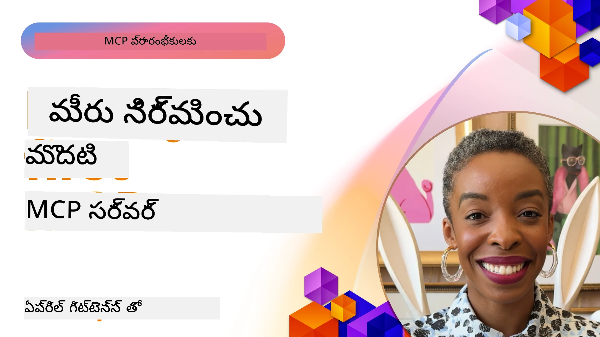

## ప్రారంభించడం  

_(ఈ పాఠాన్ని వీక్షించడానికి పై చిత్రాన్ని క్లిక్ చేయండి)_

ఈ విభాగం అనేక పాఠాల సమాహారంగా ఉంది:

- **1 మీ మొదటి సర్వర్**, ఈ మొదటి పాఠంలో, మీరు మీ మొదటి సర్వర్‌ని ఎలా సృష్టించుకోవాలో మరియు ఇంట్పెక్టర్ టూల్‌తో దాన్ని పరిశీలించుకోవడం ఎలా అనేది నేర్చుకుంటారు, ఇది సర్వర్‌ని పరీక్షించడానికి మరియు డీబగ్ చేసుకోవడానికి విలువైన పద్ధతి, [పాఠానికి](01-first-server/README.md) 

- **2 క్లయింట్**, ఈ పాఠంలో మీరు మీ సర్వర్‌కి కనెక్ట్ అయ్యే క్లయింట్‌ని ఎలా రాయాలో నేర్చుకుంటారు, [పాఠానికి](02-client/README.md) 

- **3 LLMతో క్లయింట్**, క్లయింట్‌ని రాయడానికి మరింత ఉత్తమ మార్గం LLMని చేర్చి, అది మీ సర్వర్‌తో "నెగోషియేట్" చేయగలగడం, [పాఠానికి](03-llm-client/README.md) 

- **4 Visual Studio Codeలో GitHub Copilot ఏజెంట్ మోడ్‌లో సర్వర్ వినియోగం**. ఇక్కడ, మేము Visual Studio Codeలో నుండి మా MCP సర్వర్‌ని నడపడం చూస్తున్నాము, [పాఠానికి](04-vscode/README.md) 

- **5 stdio ట్రాన్స్‌పోర్ట్ సర్వర్** stdio ట్రాన్స్‌పోర్ట్ అనేది స్థానిక MCP సర్వర్-తరఫు క్లయింట్ కమ్యూనికేషన్‌కు సిఫార్సు చేసిన ప్రమాణం, సెక్యూర్ సబ్ప్రొసెస్ ఆధారిత కమ్యూనికేషన్‌కి ప్రాసెస్ ఐసోలేషన్‌తో పాటు [పాఠానికి](05-stdio-server/README.md) 

- **6 MCPతో HTTP స్ట్రీమింగ్ (స్ట్రీమబుల్ HTTP)**. ఆధునిక HTTP స్ట్రీమింగ్ ట్రాన్స్‌పోర్ట్ గురించి (దూర MCP సర్వర్‌ల కోసం సూచించిన విధానం [MCP స్పెసిఫికేషన్ 2025-11-25](https://spec.modelcontextprotocol.io/specification/2025-11-25/basic/transports/#streamable-http)), ప్రగతి నోటిఫికేషన్లు మరియు ఎలా స్కేలబుల్, రియల్-టైమ్ MCP సర్వర్‌లు, క్లయింట్లు Streamable HTTP ఉపయోగించి అమలు చేయాలో తెలుసుకోండి. [పాఠానికి](06-http-streaming/README.md) 

- **7 VSCode కోసం AI టూల్‌కిట్ వినియోగం** MCP క్లయింట్లు మరియు సర్వర్‌లను వినియోగించి పరీక్షించడానికి [పాఠానికి](07-aitk/README.md) 

- **8 పరీక్షించడం**. ఇక్కడ మేము ముఖ్యంగా మన సర్వర్ మరియు క్లయింట్లను వివిధ విధాలుగా పరీక్షించడం ఎలా అనేది ఫోకస్ చేస్తాము, [పాఠానికి](08-testing/README.md) 

- **9 డిప్లాయ్‌మెంట్**. ఈ అధ్యాయం మీ MCP పరిష్కారాలను వివిధ మార్గాల్లో ఎలా డిప్లాయ్ చేయాలో చూస్తుంది, [పాఠానికి](09-deployment/README.md) 

- **10 అధునాతన సర్వర్ వినియోగం**. ఈ అధ్యాయం అధునాతన సర్వర్ వినియోగాన్ని కవర్ చేస్తుంది, [పాఠానికి](./10-advanced/README.md) 

- **11 ఆటూ**. ఈ అధ్యాయం సాదారణ ఆటూతో ప్రారంభించి Basic Auth నుండి JWT మరియు RBAC ఉపయోగించడం గురించి ప్రత్తిపాదిస్తుంది. మీరు ఇక్కడ ప్రారంభించి తరువాత అధ్యాయం 5లో Advanced Topics చూడడానికి, అలాగే 2వ అధ్యాయం సిఫారసుల ద్వారా అదనపు భద్రతా పెంపును చేయాలని ప్రోత్సహించబడతారు, [పాఠానికి](./11-simple-auth/README.md) 

- **12 MCP హోస్ట్లు**. ప్రముఖ MCP హోస్టు క్లయింట్లను కాన్ఫిగర్ చేసి వినియోగించండి, వాటిలో Claude Desktop, Cursor, Cline, Windsurf ఉన్నాయి. ట్రాన్స్‌పోర్ట్ రకాల గురించి మరియు సమస్యల పరిష్కారాలను తెలుసుకోండి, [పాఠానికి](./12-mcp-hosts/README.md) 

- **13 MCP ఇంట్స్పెక్టర్**. MCP ఇంట్స్పెక్టర్ టూల్ ఉపయోగించి MCP సర్వర్‌లను ఇంటరాక్టివ్‌గా డీబగ్ చేసి పరీక్షించండి. టూల్స్, వనరులు, ప్రోటోకాల్ మెసెస్ పరిష్కరించుకోవడం నేర్చుకోండి, [పాఠానికి](./13-mcp-inspector/README.md) 

మోడల్ కాంటెక్స్ట్ ప్రోటోకాల్ (MCP) అనేది ఓపెన్ ప్రోటోకాల్, ఇది యాప్లికేషన్లు ఎలా LLMsకి కాంటెక్స్ట్‌లను అందిస్తాయో ప్రమాణీకరిస్తుంది. MCPని AI యాప్లికేషన్లకు USB-C పోర్ట్‌లా ఆలోచించండి - ఇది AI మోడల్స్‌ని వివిధ డేటా వనరులు మరియు టూల్స్‌తో కనెక్ట్ చేయడానికి ప్రమాణీకరించిన మార్గాన్ని అందిస్తుంది.

## నేర్చుకోవడపు లక్ష్యాలు

ఈ పాఠం ముగిసేటప్పుడు, మీరు చేయగలుగుతారు:

- C#, Java, Python, TypeScript మరియు JavaScriptలో MCP కోసం అభివృద్ధి వాతావరణాలను సెట్ చేయడం
- సాధారణ MCP సర్వర్‌లను కస్టమ్ లక్షణాలతో (వనరులు, ప్రాంప్ట్‌లు, మరియు టూల్స్) సృష్టించి జారీ చేయడం
- MCP సర్వర్‌లకు కనెక్ట్ అయ్యే హోస్ట్ యాప్లికేషన్లను సృష్టించడం
- MCP అమలు చేస్తే పరీక్షించి డీబగ్ చేయడం
- సాధారణ సెటప్ సవాళ్లు మరియు వాటి పరిష్కారాలను అర్థం చేసుకోవడం
- మీ MCP అమలు లను ప్రముఖ LLM సేవలతో కనెక్ట్ చేయడం

## మీ MCP వాతావరణాన్ని సెట్ చేసుకోవడం

MCPతో పని చేయడం ప్రారంభించే ముందు, మీ అభివృద్ధి వాతావరణాన్ని సిద్ధం చేసుకోవడం మరియు ప్రాథమిక వర్క్‌ఫ్లోను అర్థం చేసుకోవడం ముఖ్యం. ఈ విభాగం ప్రారంభ దశల సెటప్ దశలను మార్గనిర్దేశం చేస్తుంది, దాంతో MCPతో సాఫీగా మొదలు పెట్టవచ్చు.

### ముందు అవసరాలు

MCP అభివృద్ధిలోకి జారుకునేటప్పుడు, ఈవి ఉన్నాయో నిర్ధారించుకోండి:

- **అభివృద్ధి వాతావరణం**: మీ ఎంచుకున్న భాషలో (C#, Java, Python, TypeScript, లేదా JavaScript)
- **IDE/ఎడిటర్**: Visual Studio, Visual Studio Code, IntelliJ, Eclipse, PyCharm, లేదా ఏదైనా ఆధునిక కోడ్ ఎడిటర్
- **ప్యాకేజ్ మేనేజర్లు**: NuGet, Maven/Gradle, pip, లేదా npm/yarn
- **API కీలు**: మీరు హోస్ట్ యాప్లికేషన్లలో ఉపయోగించబోయే ఏ AI సేవలకు కావలసినవి

### అధికారిక SDKs

రివిభాగాల్లో మీరు Python, TypeScript, Java మరియు .NET ఉపయోగించి నిర్మించిన పరిష్కారాలను చూడగలరు. ఇక్కడ అన్ని అధికారికంగా మద్దతు పొందిన SDKలు ఉన్నాయి.

MCP అనేక భాషలకు అధికారిక SDKలను అందిస్తుంది ([MCP స్పెసిఫికేషన్ 2025-11-25](https://spec.modelcontextprotocol.io/specification/2025-11-25/) కు అనుగుణంగా):
- [C# SDK](https://github.com/modelcontextprotocol/csharp-sdk) - Microsoft తో కలిసి నిర్వహిస్తున్నారు
- [Java SDK](https://github.com/modelcontextprotocol/java-sdk) - Spring AIతో కలిసి నిర్వహిస్తున్నారు
- [TypeScript SDK](https://github.com/modelcontextprotocol/typescript-sdk) - అధికారిక TypeScript అమలు
- [Python SDK](https://github.com/modelcontextprotocol/python-sdk) - అధికారిక Python అమలు (FastMCP)
- [Kotlin SDK](https://github.com/modelcontextprotocol/kotlin-sdk) - అధికారిక Kotlin అమలు
- [Swift SDK](https://github.com/modelcontextprotocol/swift-sdk) - Loopwork AIతో కలిసి నిర్వహిస్తున్నారు
- [Rust SDK](https://github.com/modelcontextprotocol/rust-sdk) - అధికారిక Rust అమలు
- [Go SDK](https://github.com/modelcontextprotocol/go-sdk) - అధికారిక Go అమలు

## ముఖ్యమైన అంశాలు

- MCP అభివృద్ధి వాతావరణాన్ని సెట్ చేయడం భాషా-ప్రత్యేక SDKలతో సులభమే
- MCP సర్వర్‌లను నిర్మించడం అంటే స్పష్టమైన స్కీమాలతో టూల్స్ సృష్టించి నమోదు చేయడం
- MCP క్లయింట్లు సర్వర్‌లకు మరియు మోడల్స్‌కు అనుసంధానమై విస్తరించిన లక్షణాలను ఉపయోగిస్తాయి
- MCP అమలు విశ్వసనీయంగా ఉండేందుకు పరీక్షించడం మరియు డీబగ్ చేయడం అవసరం
- డిప్లాయ్‌మెంట్ ఎంపికలు స్థానిక అభివృద్ధి నుండి క్లౌడ్ ఆధారిత పరిష్కారాల వరకు ఉంటాయి

## అనుభవం

మేము ఈ విభాగంలోని అన్ని అధ్యాయాలలో మీరు చూడబోయే వ్యాయామాలను పూర్తిగా అందించే నమూనా సెట్ కలిగి ఉన్నాము. అదనంగా ప్రతి అధ్యాయానికి వారి స్వంత వ్యాయామాలు మరియు అసైన్మెంట్లు కూడా ఉంటాయి

- [Java క్యాల్క్యులేటర్](./samples/java/calculator/README.md)
- [.Net క్యాల్క్యులేటర్](../../../03-GettingStarted/samples/csharp)
- [JavaScript క్యాల్క్యులేటర్](./samples/javascript/README.md)
- [TypeScript క్యాల్క్యులేటర్](./samples/typescript/README.md)
- [Python క్యాల్క్యులేటర్](../../../03-GettingStarted/samples/python)

## అదనపు వనరులు

- [Azureలో Model Context Protocol ఉపయోగించి ఏజెంట్లు నిర్మించండి](https://learn.microsoft.com/azure/developer/ai/intro-agents-mcp)
- [Azure కంటైనర్ యాప్స్‌తో రిమోట్ MCP (Node.js/TypeScript/JavaScript)](https://learn.microsoft.com/samples/azure-samples/mcp-container-ts/mcp-container-ts/)
- [.NET OpenAI MCP ఏజెంట్](https://learn.microsoft.com/samples/azure-samples/openai-mcp-agent-dotnet/openai-mcp-agent-dotnet/)

## తర్వాత ఏమి

మొదటి పాఠంతో ప్రారంభించండి: [మీ మొదటి MCP సర్వర్ సృష్టించడం](01-first-server/README.md)

ఈ మాడ్యూల్ పూర్తి చేసిన తరువాత, కొనసాగించండి: [మాడ్యూల్ 4: 실전 అమలు](../04-PracticalImplementation/README.md)

---

<!-- CO-OP TRANSLATOR DISCLAIMER START -->
**వ్యాఖ్య**:
ఈ పత్రాన్ని AI అనువాద సేవ అయిన [Co-op Translator](https://github.com/Azure/co-op-translator) ఉపయోగించి అనువదించారు. మేము ఖచ్చితత్వానికి ప్రయత్నించినప్పటికీ, ఆటోమేటిక్ అనువాదాల్లో తప్పులు లేదా అసమర్థతలు ఉండవచ్చు. అసలు పత్రం స్థానిక భాషలోనే అధికారం కలిగిన మూలం గా పరిగణించబడాలి. కీలకమైన సమాచారానికి, ప్రొఫెషనల్ మానవ అనువాద సేవలను ఉపయోగించడం మంచిది. ఈ అనువాదం వలన కలిగే ఎటువంటి అపనమ్మకాలు లేదా తప్పుమాట్ల గురించి మేము బాధ్యులం కాదు.
<!-- CO-OP TRANSLATOR DISCLAIMER END -->