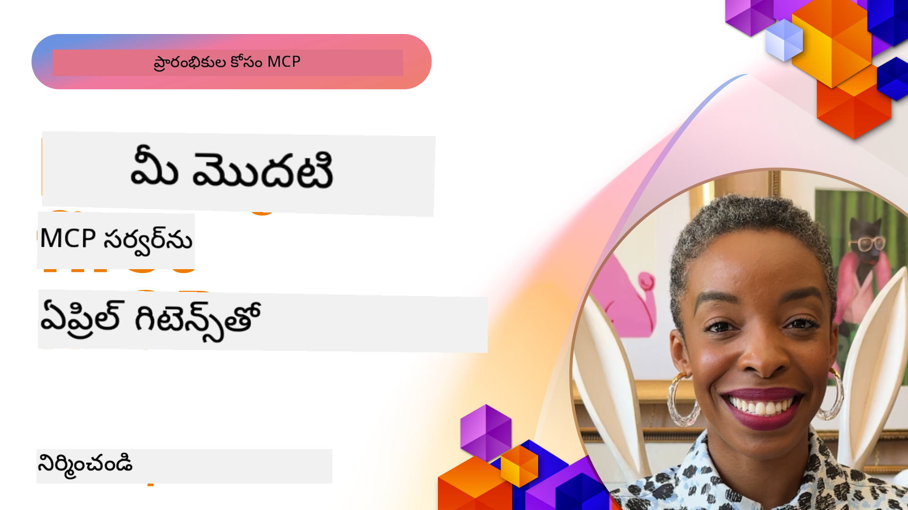

<!--
CO_OP_TRANSLATOR_METADATA:
{
  "original_hash": "f400d87053221363769113c24f117248",
  "translation_date": "2025-12-11T09:43:34+00:00",
  "source_file": "03-GettingStarted/README.md",
  "language_code": "te"
}
-->
## ప్రారంభం  

_(ఈ పాఠం వీడియోను చూడడానికి పై చిత్రాన్ని క్లిక్ చేయండి)_

ఈ విభాగం అనేక పాఠాల నుండి ఉంటుంది:

- **1 మీ మొదటి సర్వర్**, ఈ మొదటి పాఠంలో, మీరు మీ మొదటి సర్వర్‌ను ఎలా సృష్టించాలో మరియు ఇన్స్పెక్టర్ టూల్‌తో దాన్ని పరిశీలించుకోవడం నేర్చుకుంటారు, ఇది మీ సర్వర్‌ను పరీక్షించడానికి మరియు డీబగ్ చేయడానికి విలువైన మార్గం, [పాఠానికి](01-first-server/README.md)

- **2 క్లయింట్**, ఈ పాఠంలో, మీరు మీ సర్వర్‌కు కనెక్ట్ అయ్యే క్లయింట్‌ను ఎలా రాయాలో నేర్చుకుంటారు, [పాఠానికి](02-client/README.md)

- **3 LLMతో క్లయింట్**, క్లయింట్ రాయడంలో మరింత మెరుగైన మార్గం LLMని జోడించడం, తద్వారా అది మీ సర్వర్‌తో "నెగోషియేట్" చేయగలదు, [పాఠానికి](03-llm-client/README.md)

- **4 Visual Studio Codeలో GitHub Copilot ఏజెంట్ మోడ్ ఉపయోగించి సర్వర్‌ను వినియోగించడం**. ఇక్కడ, మనం Visual Studio Codeలో నుండి మన MCP సర్వర్‌ను నడపడం చూస్తున్నాము, [పాఠానికి](04-vscode/README.md)

- **5 stdio ట్రాన్స్‌పోర్ట్ సర్వర్** stdio ట్రాన్స్‌పోర్ట్ ప్రస్తుత స్పెసిఫికేషన్‌లో MCP సర్వర్-క్లయింట్ కమ్యూనికేషన్ కోసం సిఫార్సు చేయబడిన ప్రమాణం, ఇది సురక్షితమైన సబ్‌ప్రాసెస్ ఆధారిత కమ్యూనికేషన్ అందిస్తుంది [పాఠానికి](05-stdio-server/README.md)

- **6 MCPతో HTTP స్ట్రీమింగ్ (Streamable HTTP)**. ఆధునిక HTTP స్ట్రీమింగ్, ప్రోగ్రెస్ నోటిఫికేషన్లు మరియు Streamable HTTP ఉపయోగించి స్కేలబుల్, రియల్-టైమ్ MCP సర్వర్లు మరియు క్లయింట్లను ఎలా అమలు చేయాలో తెలుసుకోండి. [పాఠానికి](06-http-streaming/README.md)

- **7 VSCode కోసం AI టూల్‌కిట్ ఉపయోగించడం** మీ MCP క్లయింట్లు మరియు సర్వర్లను వినియోగించి పరీక్షించడానికి [పాఠానికి](07-aitk/README.md)

- **8 పరీక్షించడం**. ఇక్కడ మనం ముఖ్యంగా మన సర్వర్ మరియు క్లయింట్లను వివిధ మార్గాల్లో ఎలా పరీక్షించాలో దృష్టి పెడతాము, [పాఠానికి](08-testing/README.md)

- **9 డిప్లాయ్‌మెంట్**. ఈ అధ్యాయం మీ MCP పరిష్కారాలను డిప్లాయ్ చేయడానికి వివిధ మార్గాలను పరిశీలిస్తుంది, [పాఠానికి](09-deployment/README.md)

- **10 అధునాతన సర్వర్ వినియోగం**. ఈ అధ్యాయం అధునాతన సర్వర్ వినియోగాన్ని కవర్ చేస్తుంది, [పాఠానికి](./10-advanced/README.md)

- **11 ఆథ్**. ఈ అధ్యాయం సింపుల్ ఆథ్‌ను ఎలా జోడించాలో కవర్ చేస్తుంది, బేసిక్ ఆథ్ నుండి JWT మరియు RBAC ఉపయోగించడం వరకు. మీరు ఇక్కడ ప్రారంభించి తరువాత అధ్యాయం 5లో ఉన్న అధునాతన విషయాలను చూడమని మరియు అధ్యాయం 2లో సూచించిన సెక్యూరిటీ హార్డెనింగ్‌ను చేయమని ప్రోత్సహించబడుతున్నారు, [పాఠానికి](./11-simple-auth/README.md)

మోడల్ కాంటెక్స్ట్ ప్రోటోకాల్ (MCP) అనేది ఓపెన్ ప్రోటోకాల్, ఇది అప్లికేషన్లు LLMలకు కాంటెక్స్ట్ ఎలా అందిస్తాయో ప్రమాణీకరించేది. MCPని AI అప్లికేషన్ల కోసం USB-C పోర్ట్‌లాగా భావించండి - ఇది AI మోడల్స్‌ను వివిధ డేటా సోర్సులు మరియు టూల్స్‌కు కనెక్ట్ చేయడానికి ప్రమాణీకృత మార్గాన్ని అందిస్తుంది.

## నేర్చుకునే లక్ష్యాలు

ఈ పాఠం ముగిసిన తర్వాత, మీరు చేయగలుగుతారు:

- C#, Java, Python, TypeScript, మరియు JavaScriptలో MCP కోసం అభివృద్ధి వాతావరణాలను సెట్ చేయడం
- కస్టమ్ ఫీచర్లతో (వనరులు, ప్రాంప్ట్స్, మరియు టూల్స్) ప్రాథమిక MCP సర్వర్లను నిర్మించి డిప్లాయ్ చేయడం
- MCP సర్వర్లకు కనెక్ట్ అయ్యే హోస్ట్ అప్లికేషన్లను సృష్టించడం
- MCP అమలు‌లను పరీక్షించి డీబగ్ చేయడం
- సాధారణ సెటప్ సవాళ్లు మరియు వాటి పరిష్కారాలను అర్థం చేసుకోవడం
- మీ MCP అమలు‌లను ప్రముఖ LLM సేవలకు కనెక్ట్ చేయడం

## మీ MCP వాతావరణాన్ని సెట్ చేయడం

MCPతో పని ప్రారంభించే ముందు, మీ అభివృద్ధి వాతావరణాన్ని సిద్ధం చేయడం మరియు ప్రాథమిక వర్క్‌ఫ్లోను అర్థం చేసుకోవడం ముఖ్యం. ఈ విభాగం MCPతో సాఫీగా ప్రారంభం కావడానికి ప్రారంభ సెటప్ దశలను గైడ్ చేస్తుంది.

### ముందస్తు అవసరాలు

MCP అభివృద్ధిలోకి దిగేముందు, మీరు కలిగి ఉండాలి:

- **అభివృద్ధి వాతావరణం**: మీ ఎంచుకున్న భాష కోసం (C#, Java, Python, TypeScript, లేదా JavaScript)
- **IDE/ఎడిటర్**: Visual Studio, Visual Studio Code, IntelliJ, Eclipse, PyCharm, లేదా ఏ ఆధునిక కోడ్ ఎడిటర్
- **ప్యాకేజ్ మేనేజర్లు**: NuGet, Maven/Gradle, pip, లేదా npm/yarn
- **API కీలు**: మీరు మీ హోస్ట్ అప్లికేషన్లలో ఉపయోగించబోయే ఏ AI సేవల కోసం

### అధికారిక SDKలు

తదుపరి అధ్యాయాల్లో మీరు Python, TypeScript, Java మరియు .NET ఉపయోగించి నిర్మించిన పరిష్కారాలను చూడగలుగుతారు. ఇక్కడ అన్ని అధికారికంగా మద్దతు పొందిన SDKలు ఉన్నాయి.

MCP అనేక భాషల కోసం అధికారిక SDKలను అందిస్తుంది:
- [C# SDK](https://github.com/modelcontextprotocol/csharp-sdk) - Microsoftతో సహకారంలో నిర్వహించబడుతుంది
- [Java SDK](https://github.com/modelcontextprotocol/java-sdk) - Spring AIతో సహకారంలో నిర్వహించబడుతుంది
- [TypeScript SDK](https://github.com/modelcontextprotocol/typescript-sdk) - అధికారిక TypeScript అమలు
- [Python SDK](https://github.com/modelcontextprotocol/python-sdk) - అధికారిక Python అమలు
- [Kotlin SDK](https://github.com/modelcontextprotocol/kotlin-sdk) - అధికారిక Kotlin అమలు
- [Swift SDK](https://github.com/modelcontextprotocol/swift-sdk) - Loopwork AIతో సహకారంలో నిర్వహించబడుతుంది
- [Rust SDK](https://github.com/modelcontextprotocol/rust-sdk) - అధికారిక Rust అమలు

## ముఖ్యమైన విషయాలు

- MCP అభివృద్ధి వాతావరణాన్ని భాషా-ప్రత్యేక SDKలతో సులభంగా సెట్ చేయవచ్చు
- MCP సర్వర్లను నిర్మించడం స్పష్టమైన స్కీమాలతో టూల్స్ సృష్టించడం మరియు నమోదు చేయడం అవసరం
- MCP క్లయింట్లు సర్వర్లు మరియు మోడల్స్‌కు కనెక్ట్ అవుతూ విస్తృత సామర్థ్యాలను ఉపయోగిస్తాయి
- పరీక్షించడం మరియు డీబగ్ చేయడం విశ్వసనీయ MCP అమలు కోసం అవసరం
- డిప్లాయ్‌మెంట్ ఎంపికలు స్థానిక అభివృద్ధి నుండి క్లౌడ్ ఆధారిత పరిష్కారాల వరకు ఉంటాయి

## అభ్యాసం

ఈ విభాగంలోని అన్ని అధ్యాయాల్లో మీరు చూడబోయే వ్యాయామాలను పూర్తి చేసే నమూనాల సమాహారం మాకు ఉంది. అదనంగా ప్రతి అధ్యాయం కూడా వారి స్వంత వ్యాయామాలు మరియు అసైన్మెంట్లు కలిగి ఉంటాయి

- [Java క్యాల్క్యులేటర్](./samples/java/calculator/README.md)
- [.Net క్యాల్క్యులేటర్](../../../03-GettingStarted/samples/csharp)
- [JavaScript క్యాల్క్యులేటర్](./samples/javascript/README.md)
- [TypeScript క్యాల్క్యులేటర్](./samples/typescript/README.md)
- [Python క్యాల్క్యులేటర్](../../../03-GettingStarted/samples/python)

## అదనపు వనరులు

- [Azureపై Model Context Protocol ఉపయోగించి ఏజెంట్లను నిర్మించడం](https://learn.microsoft.com/azure/developer/ai/intro-agents-mcp)
- [Azure కంటైనర్ యాప్స్‌తో రిమోట్ MCP (Node.js/TypeScript/JavaScript)](https://learn.microsoft.com/samples/azure-samples/mcp-container-ts/mcp-container-ts/)
- [.NET OpenAI MCP ఏజెంట్](https://learn.microsoft.com/samples/azure-samples/openai-mcp-agent-dotnet/openai-mcp-agent-dotnet/)

## తదుపరి

తదుపరి: [మీ మొదటి MCP సర్వర్ సృష్టించడం](01-first-server/README.md)

---

<!-- CO-OP TRANSLATOR DISCLAIMER START -->
**అస్పష్టత**:  
ఈ పత్రాన్ని AI అనువాద సేవ [Co-op Translator](https://github.com/Azure/co-op-translator) ఉపయోగించి అనువదించబడింది. మేము ఖచ్చితత్వానికి ప్రయత్నించినప్పటికీ, ఆటోమేటెడ్ అనువాదాల్లో పొరపాట్లు లేదా తప్పిదాలు ఉండవచ్చు. మూల పత్రం దాని స్వదేశీ భాషలో అధికారిక మూలంగా పరిగణించాలి. ముఖ్యమైన సమాచారానికి, ప్రొఫెషనల్ మానవ అనువాదం సిఫార్సు చేయబడుతుంది. ఈ అనువాదం వాడకంలో ఏర్పడిన ఏవైనా అపార్థాలు లేదా తప్పుదారితీసే అర్థాలు కోసం మేము బాధ్యత వహించము.
<!-- CO-OP TRANSLATOR DISCLAIMER END -->