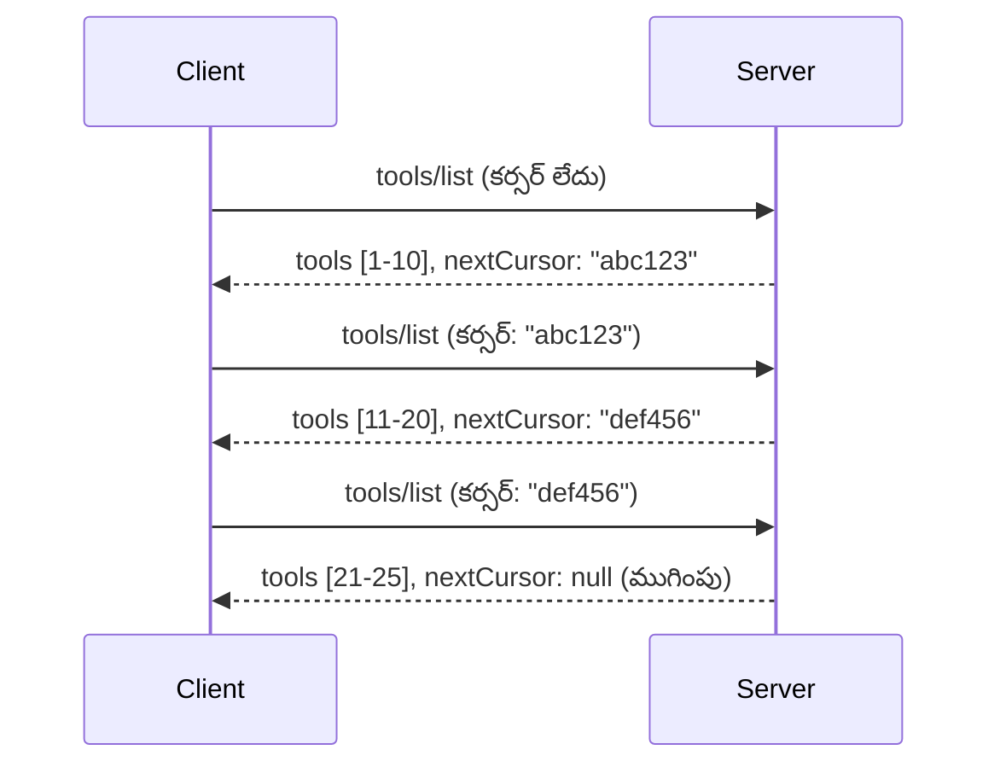

# MCPలో పేజినేషన్ మరియు పెద్ద ఫలితాలు

మీ MCP సర్వర్ పెద్ద డేటాసెట్‌లను నిర్వహించినప్పుడు - వేల్ల సంఖ్యలో ఫైళ్ళు, డేటాబేస్ రికార్డులు లేదా శోధన ఫలితాలు జాబితా చేసే సందర్భాల్లో - మీమెరీని సమర్థవంతంగా నిర్వహించడానికి మరియు స్పందనాత్మక వినియోగదారు అనుభవాలను అందించడానికి పేజినేషన్ అవసరం. ఈ గైడ్ MCPలో పేజినేషన్‌ను ఎలా అమలు చేయాలి మరియు ఉపయోగించాలో వివరిస్తుంది.

## పేజినేషన్ ఎందుకు ముఖ్యము

పేజినేషన్ లేకుండా, పెద్ద ప్రతిస్పందనల కారణంగా సంభవించగలవి:

- **స్మృతి తక్కువవడం** - ఒకేసారి మిలయన్ల రికార్డులను లోడ్ చేయడం  
- **మందగతి ప్రతిస్పందనలు** - డేటా మొత్తం లోడ్ అయ్యేవరకు వినియోగదారులు వేచి ఉండాలి  
- **టైమ్ అవుట్ పొరపాట్లు** - అభ్యర్థనలు టైమ్ అవుట్ పరిమితులు దాటి పోతాయి  
- **దుర్బల AI పనితీరు** - LLMలు భారీ కాంటెక్స్టుతో సగటు వేగంగా పనిచేయలేవు  

MCP ఫలిత సెట్‌లలో నమ్మకమున్న, స్థిరమైన పేజింగ్ కోసం **కర్సర్-ఆధారిత పేజినేషన్** ఉపయోగిస్తుంది.

---

## MCP పేజినేషన్ ఎలా పనిచేస్తుంది

### కర్సర్ భావన

**కర్సర్** అనేది ఫలిత సెట్‌లో మీ స్థానం సూచించే ఒక అపారదర్శక స్ట్రింగ్. దీన్ని పొడటి పుస్తకంలో బుక్‌మార్క్ లాగా పరిగణించండి.


### MCP పద్ధతులలో పేజినేషన్

ఈ MCP పద్ధతులు పేజినేషన్‌ను మద్దతు ఇస్తాయి:

| పద్ధతి | తిరిగి ఇస్తుంది | కర్సర్ మద్దతు |
|--------|----------------|---------------|
| `tools/list` | సాధన నిర్వచనాలు | ✅ |
| `resources/list` | వనరుల నిర్వచనాలు | ✅ |
| `prompts/list` | ప్రాంప్ట్ నిర్వచనాలు | ✅ |
| `resources/templates/list` | వనరు టెంప్లేట్లు | ✅ |

---

## సర్వర్ అమలు

### Python (FastMCP)

```python
from mcp.server import Server
from mcp.types import Tool, ListToolsResult
import math

app = Server("paginated-server")

# అనుకరించబడిన పెద్ద డేటాసెట్
ALL_TOOLS = [
    Tool(name=f"tool_{i}", description=f"Tool number {i}", inputSchema={})
    for i in range(100)
]

PAGE_SIZE = 10

@app.list_tools()
async def list_tools(cursor: str | None = None) -> ListToolsResult:
    """List tools with pagination support."""
    
    # ప్రారంభ సూచిక పొందడానికి కర్సర్ డీకోడ్ చేయండి
    start_index = 0
    if cursor:
        try:
            start_index = int(cursor)
        except ValueError:
            start_index = 0
    
    # ఫలితాల పేజీ పొందండి
    end_index = min(start_index + PAGE_SIZE, len(ALL_TOOLS))
    page_tools = ALL_TOOLS[start_index:end_index]
    
    # తదుపరి కర్సర్ లెక్కించండి
    next_cursor = None
    if end_index < len(ALL_TOOLS):
        next_cursor = str(end_index)
    
    return ListToolsResult(
        tools=page_tools,
        nextCursor=next_cursor
    )
```

### TypeScript

```typescript
import { Server } from "@modelcontextprotocol/sdk/server/index.js";
import { ListToolsResultSchema } from "@modelcontextprotocol/sdk/types.js";

const server = new Server({
  name: "paginated-server",
  version: "1.0.0"
});

// అనుకరించిన పెద్ద డేటాసెట్
const ALL_TOOLS = Array.from({ length: 100 }, (_, i) => ({
  name: `tool_${i}`,
  description: `Tool number ${i}`,
  inputSchema: { type: "object", properties: {} }
}));

const PAGE_SIZE = 10;

server.setRequestHandler(ListToolsResultSchema, async (request) => {
  // కర్సర్‌ని డీకోడు చేయండి
  let startIndex = 0;
  if (request.params?.cursor) {
    startIndex = parseInt(request.params.cursor, 10) || 0;
  }
  
  // ఫలితాల పేజీ పొందండి
  const endIndex = Math.min(startIndex + PAGE_SIZE, ALL_TOOLS.length);
  const pageTools = ALL_TOOLS.slice(startIndex, endIndex);
  
  // తదుపరి కర్సర్‌ని లెక్కించండి
  const nextCursor = endIndex < ALL_TOOLS.length ? String(endIndex) : undefined;
  
  return {
    tools: pageTools,
    nextCursor
  };
});
```

### Java (Spring MCP)

```java
@Service
public class PaginatedToolService {
    
    private static final int PAGE_SIZE = 10;
    private final List<Tool> allTools;
    
    public PaginatedToolService() {
        // పెద్ద డేటాను ప్రారంభించండి
        this.allTools = IntStream.range(0, 100)
            .mapToObj(i -> new Tool("tool_" + i, "Tool number " + i, Map.of()))
            .collect(Collectors.toList());
    }
    
    @McpMethod("tools/list")
    public ListToolsResult listTools(@Param("cursor") String cursor) {
        // కర్సర్ డీకోడ్ చెయ్యండి
        int startIndex = 0;
        if (cursor != null && !cursor.isEmpty()) {
            try {
                startIndex = Integer.parseInt(cursor);
            } catch (NumberFormatException e) {
                startIndex = 0;
            }
        }
        
        // ఫలితాల పేజీ పొందండి
        int endIndex = Math.min(startIndex + PAGE_SIZE, allTools.size());
        List<Tool> pageTools = allTools.subList(startIndex, endIndex);
        
        // తదుపరి కర్సర్ లెక్కించండి
        String nextCursor = endIndex < allTools.size() ? String.valueOf(endIndex) : null;
        
        return new ListToolsResult(pageTools, nextCursor);
    }
}
```

---

## కస్టమర్ అమలు

### Python క్లయింట్

```python
from mcp import ClientSession

async def get_all_tools(session: ClientSession) -> list:
    """Fetch all tools using pagination."""
    all_tools = []
    cursor = None
    
    while True:
        result = await session.list_tools(cursor=cursor)
        all_tools.extend(result.tools)
        
        if result.nextCursor is None:
            break
        cursor = result.nextCursor
    
    return all_tools

# ఉపయోగం
async with client_session as session:
    tools = await get_all_tools(session)
    print(f"Found {len(tools)} tools")
```

### TypeScript క్లయింట్

```typescript
import { Client } from "@modelcontextprotocol/sdk/client/index.js";

async function getAllTools(client: Client): Promise<Tool[]> {
  const allTools: Tool[] = [];
  let cursor: string | undefined = undefined;
  
  do {
    const result = await client.listTools({ cursor });
    allTools.push(...result.tools);
    cursor = result.nextCursor;
  } while (cursor);
  
  return allTools;
}

// ఉపయోగం
const tools = await getAllTools(client);
console.log(`Found ${tools.length} tools`);
```

### ఆలస్య లోడింగ్ నమూనా

చాలా పెద్ద డేటాసెట్‌ల కోసం, పేజీలను అవసరానుసారం లోడ్ చేయండి:

```python
class PaginatedToolIterator:
    """Lazily iterate through paginated tools."""
    
    def __init__(self, session: ClientSession):
        self.session = session
        self.cursor = None
        self.buffer = []
        self.exhausted = False
    
    async def __anext__(self):
        # అందుబాటులో ఉంటే బఫర్ నుండి తిరిగి వస్తుంది
        if self.buffer:
            return self.buffer.pop(0)
        
        # మనం అన్ని పేజీలను ముగించామో లేదో తనిఖీ చేయండి
        if self.exhausted:
            raise StopAsyncIteration
        
        # తదుపరి పేజీని తీసుకోండి
        result = await self.session.list_tools(cursor=self.cursor)
        self.buffer = list(result.tools)
        self.cursor = result.nextCursor
        
        if self.cursor is None:
            self.exhausted = True
        
        if not self.buffer:
            raise StopAsyncIteration
        
        return self.buffer.pop(0)
    
    def __aiter__(self):
        return self

# ఉపయోగం - పెద్ద డేటాసెట్స్‌ కోసం మెమరీ సామర్థ్యవంతమైనది
async for tool in PaginatedToolIterator(session):
    process_tool(tool)
```

---

## వనరులకు పేజినేషన్

డైరెక్టరీలు లేదా పెద్ద డేటాసెట్‌ల కోసం వనరులకు తరచుగా పేజినేషన్ అవసరం:

```python
from mcp.server import Server
from mcp.types import Resource, ListResourcesResult
import os

app = Server("file-server")

@app.list_resources()
async def list_resources(cursor: str | None = None) -> ListResourcesResult:
    """List files in directory with pagination."""
    
    directory = "/data/files"
    all_files = sorted(os.listdir(directory))
    
    # కర్సర్‌ను డీకోడ్ చేయండి (ఫైల్ సూచిక)
    start_index = int(cursor) if cursor else 0
    page_size = 20
    end_index = min(start_index + page_size, len(all_files))
    
    # ఈ పేజీ కోసం వనరుల జాబితా సృష్టించండి
    resources = []
    for filename in all_files[start_index:end_index]:
        filepath = os.path.join(directory, filename)
        resources.append(Resource(
            uri=f"file://{filepath}",
            name=filename,
            mimeType="application/octet-stream"
        ))
    
    # తదుపరి కర్సర్‌ను లెక్కించండి
    next_cursor = str(end_index) if end_index < len(all_files) else None
    
    return ListResourcesResult(
        resources=resources,
        nextCursor=next_cursor
    )
```

---

## కర్సర్ డిజైన్ వ్యూహాలు

### వ్యూహం 1: సూచిక ఆధారిత (సాధారణ)

```python
# కర్సర్ కేవలం సూచిక మాత్రమే
cursor = "50"  # ఐటమ్ 50 నుండి మొదలు పెట్టండి
```

**పోర్స్:** సరళమైనది, స్టేట్‌లెస్  
**కాన్స:** అంశాలు జతచేయబడితే/తీసివేయబడితే ఫలితాలు మారవచ్చు  

### వ్యూహం 2: ID ఆధారిత (స్థిరమైనది)

```python
# కర్సర్ చివరిసారిగా చూడబడిన ID
cursor = "item_abc123"  # ఈ అంశం తర్వాత ప్రారంభించండి
```

**పోర్స్:** అంశాలు మారినా స్థిరంగా ఉంటుంది  
**కాన్స:** క్రమబద్ధీకరించిన IDs అవసరం  

### వ్యూహం 3: సంక్లిష్ట స్థితి కోడ్ (సంక్లిష్టమైనది)

```python
import base64
import json

def encode_cursor(state: dict) -> str:
    return base64.b64encode(json.dumps(state).encode()).decode()

def decode_cursor(cursor: str) -> dict:
    return json.loads(base64.b64decode(cursor).decode())

# కర్సర్‌లో అనేక స్థితి ఫీల్డ్లు ఉన్నాయి
cursor = encode_cursor({
    "offset": 50,
    "filter": "active",
    "sort": "name"
})
```

**పోర్స్:** సంక్లిష్ట స్థితిని కోడ్ చేయవచ్చు  
**కాన్స:** మరింత సంక్లిష్టం, పెద్ద కర్సర్ స్ట్రింగులు  

---

## ఉత్తమ సాధనాలు

### 1. సరైన పేజీ పరిమాణాలను ఎంచుకోండి

```python
# డేటా పరిమాణాన్ని పరిగణనలోకి తీసుకోండి
PAGE_SIZE_SMALL_ITEMS = 100   # సాదా మెటాడేటా
PAGE_SIZE_MEDIUM_ITEMS = 20   # సంపన్నమైన ఆబ్జెక్టులు
PAGE_SIZE_LARGE_ITEMS = 5     # సంక్లిష్టమైన కంటెంట్
```

### 2. తిరగబడని కర్సర్‌లను శ్రద్ధగా హ్యాండిల్ చేయండి

```python
@app.list_tools()
async def list_tools(cursor: str | None = None) -> ListToolsResult:
    try:
        start_index = int(cursor) if cursor else 0
        if start_index < 0 or start_index >= len(ALL_TOOLS):
            start_index = 0  # ప్రారంభానికి రీసెట్ చేయండి
    except (ValueError, TypeError):
        start_index = 0  # చెల్లని కర్సర్, కొత్తదిగా ప్రారంభించండి
    # ...
```

### 3. మొత్తం సంఖ్యను చేర్చండి (ఐచ్చికం)

```python
return ListToolsResult(
    tools=page_tools,
    nextCursor=next_cursor,
    # కొంత అమలు UI ప్రగతి కోసం మొత్తం కలిగి ఉంటాయి
    _meta={"total": len(ALL_TOOLS)}
)
```

### 4. ఎడ్జ్ కేస్‌లను పరీక్షించండి

```python
async def test_pagination():
    # ఖాళీ ఫలిత సెట్
    result = await session.list_tools()
    assert result.tools == []
    assert result.nextCursor is None
    
    # ఒకే పేజీ
    result = await session.list_tools()
    assert len(result.tools) <= PAGE_SIZE
    
    # చెల్లని కర్సర్
    result = await session.list_tools(cursor="invalid")
    assert result.tools  # మొదటి పేజీని తిరిగి ఇవ్వాలి
```

---

## సాధారణ తప్పిదాలు

### ❌ అన్ని ఫలితాలను తిరిగి ఇచ్చి క్లయింట్-సైడ్‌లో పేజినేట్ చేయడం

```python
# చెడు: ప్రతీది మెమరీలో లోడ్ చేస్తుంది
@app.list_tools()
async def list_tools() -> ListToolsResult:
    all_tools = load_all_tools()  # 1 మిలియన్ టూల్స్!
    return ListToolsResult(tools=all_tools)
```

### ✅ డేటా మూలంలోనే పేజినేట్ చేయడం

```python
# మంచిది: అవసరమైన వాటిని మాత్రమే లోడ్ చేస్తుంది
@app.list_tools()
async def list_tools(cursor: str | None = None) -> ListToolsResult:
    offset = int(cursor) if cursor else 0
    tools = await db.query_tools(offset=offset, limit=PAGE_SIZE)
    return ListToolsResult(tools=tools, nextCursor=...)
```

---

## తర్వాత ఏమి ఉంది

- [మాడ్యూల్ 5.14 - కాంటెక్స్ట్ ఇంజనీరింగ్](../../05-AdvancedTopics/mcp-contextengineering/README.md)
- [మాడ్యూల్ 8 - ఉత్తమ సాధనాలు](../../08-BestPractices/README.md)
- [3.8 - మీ MCP సర్వర్‌ని పరీక్షించడం](../../03-GettingStarted/08-testing/README.md)

---

## అదనపు వనరులు

- [MCP ప్రత్యేకణ - పేజినేషన్](https://spec.modelcontextprotocol.io/specification/2025-11-25/)
- [కర్సర్-ఆధారిత పేజినేషన్ వివరాలు](https://slack.engineering/evolving-api-pagination-at-slack/)
- [Python SDK pagination tests](https://github.com/modelcontextprotocol/python-sdk/blob/main/tests/client/test_list_methods_cursor.py)

---

<!-- CO-OP TRANSLATOR DISCLAIMER START -->
**వ్యాఖ్యానము**:  
ఈ డాక్యుమెంట్‌ను AI అనువాద సర్వీస్ [Co-op Translator](https://github.com/Azure/co-op-translator) ఉపయోగించి అనువదించబడింది. మేము ఖచ్చితత్వానికి ప్రయత్నిస్తున్నప్పటికీ, ఆటోమేటెడ్ అనువాదాలలో పొరపాట్లు లేదా లోపాలు ఉండవచ్చు. ఆ బాషలో ఉన్న అసలు డాక్యుమెంట్‌ను అధికారిక మూలం గా పరిగణించాలి. ముఖ్యమైన సమాచారం కోసం, ప్రొఫెషనల్ మానవ అనువాదం సిఫార్సు చేయబడుతుంది. ఈ అనువాదం వలన కలిగే ఏవైనా అపార్థాలు లేదా తప్పుదోవ పట్టే పరిస్థితులకు మేము బాధ్యులను కాదు.
<!-- CO-OP TRANSLATOR DISCLAIMER END -->