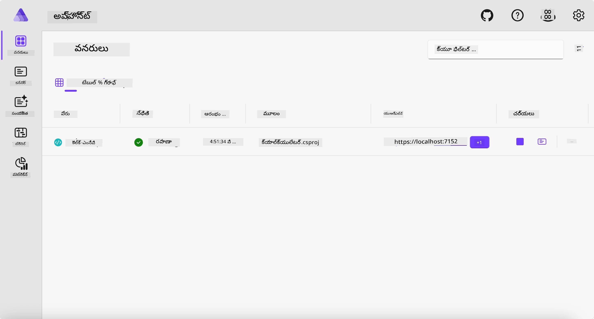
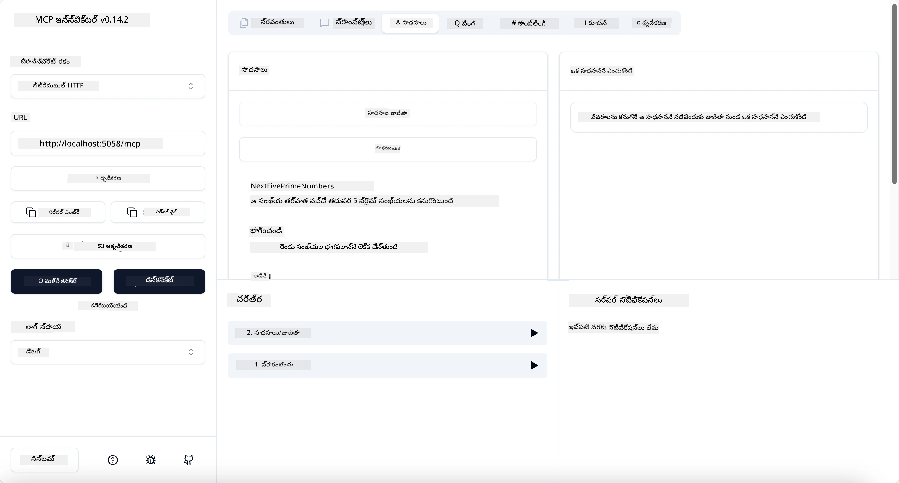
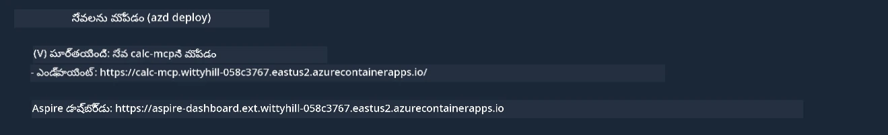

# నమూనా

మునుపటి ఉదాహరణలో `stdio` రకం తో స్థానిక .NET ప్రాజెక్టును ఎలా ఉపయోగించాలో చూపిస్తుంది. మరియు సర్వర్‌ను స్థానికంగా కంటైనర్‌లో ఎలా నడపాలో చూపిస్తుంది. ఇది అనేక పరిస్థితులలో మంచి పరిష్కారం. అయితే, సర్వర్‌ను క్లౌడ్ వాతావరణంలో లాంటి దూరంగా నడపడం ఉపయోగకరంగా ఉండవచ్చు. ఇక్కడ `http` రకం ఉపయోగపడుతుంది.

`04-PracticalImplementation` ఫోల్డర్‌లో పరిష్కారాన్ని చూస్తే, ఇది మునుపటి దానికంటే చాలా క్లిష్టంగా కనిపించవచ్చు. కానీ వాస్తవానికి, అంత కాదు. మీరు ప్రాజెక్ట్ `src/Calculator` ను జాగ్రత్తగా చూస్తే, ఇది ఎక్కువగా మునుపటి ఉదాహరణతో సమానమైన కోడ్ అని మీరు గమనిస్తారు. ఒక్క తేడా ఏమిటంటే, HTTP అభ్యర్థనలను నిర్వహించడానికి మేము వేరే లైబ్రరీ `ModelContextProtocol.AspNetCore` ను ఉపయోగిస్తున్నాము. మరియు మేము `IsPrime` పద్ధతిని ప్రైవేట్‌గా మార్చాము, ఇది మీ కోడ్‌లో ప్రైవేట్ పద్ధతులు ఉండవచ్చని చూపించడానికి. మిగతా కోడ్ మునుపటి విధంగా ఉంటుంది.

ఇతర ప్రాజెక్టులు [.NET Aspire](https://learn.microsoft.com/dotnet/aspire/get-started/aspire-overview) నుండి ఉన్నాయి. పరిష్కారంలో .NET Aspire ఉండటం అభివృద్ధి మరియు పరీక్ష సమయంలో డెవలపర్ అనుభవాన్ని మెరుగుపరుస్తుంది మరియు పరిశీలనకు సహాయపడుతుంది. సర్వర్ నడపడానికి ఇది అవసరం కాదు, కానీ మీ పరిష్కారంలో ఉండటం మంచి ఆచారం.

## సర్వర్‌ను స్థానికంగా ప్రారంభించండి

1. VS కోడ్ (C# DevKit ఎక్స్‌టెన్షన్‌తో) నుండి `04-PracticalImplementation/samples/csharp` డైరెక్టరీకి వెళ్లండి.
1. సర్వర్‌ను ప్రారంభించడానికి క్రింది కమాండ్‌ను అమలు చేయండి:

   ```bash
    dotnet watch run --project ./src/AppHost
   ```

1. ఒక వెబ్ బ్రౌజర్ .NET Aspire డాష్‌బోర్డ్‌ను తెరిచినప్పుడు, `http` URL గమనించండి. ఇది `http://localhost:5058/` లాంటి ఏదైనా ఉండాలి.

   

## MCP ఇన్స్పెక్టర్‌తో Streamable HTTP ను పరీక్షించండి

మీ వద్ద Node.js 22.7.5 లేదా అంతకంటే పై వర్షన్ ఉంటే, MCP ఇన్స్పెక్టర్‌ను ఉపయోగించి మీ సర్వర్‌ను పరీక్షించవచ్చు.

సర్వర్‌ను ప్రారంభించి టెర్మినల్‌లో క్రింది కమాండ్‌ను నడపండి:

```bash
npx @modelcontextprotocol/inspector http://localhost:5058
```



- ట్రాన్స్‌పోర్ట్ రకంగా `Streamable HTTP` ను ఎంచుకోండి.
- Url ఫీల్డ్‌లో ముందుగా గమనించిన సర్వర్ URL ను నమోదు చేసి, చివరికి `/mcp` జోడించండి. ఇది `http` (https కాదు) ఉండాలి, ఉదాహరణకు `http://localhost:5058/mcp`.
- కనెక్ట్ బటన్‌ను ఎంచుకోండి.

ఇన్స్పెక్టర్ గురించి మంచి విషయం ఏమిటంటే, ఇది జరుగుతున్న వాటిపై మంచి దృశ్యమానతను అందిస్తుంది.

- అందుబాటులో ఉన్న టూల్స్ జాబితా చేయడానికి ప్రయత్నించండి
- వాటిలో కొన్ని ప్రయత్నించండి, అవి మునుపటి లాగా పనిచేస్తాయి.

## VS కోడ్‌లో GitHub Copilot చాట్‌తో MCP సర్వర్‌ను పరీక్షించండి

Streamable HTTP ట్రాన్స్‌పోర్ట్‌ను GitHub Copilot చాట్‌తో ఉపయోగించడానికి, ముందుగా సృష్టించిన `calc-mcp` సర్వర్ కాన్ఫిగరేషన్‌ను ఇలా మార్చండి:

```jsonc
// .vscode/mcp.json
{
  "servers": {
    "calc-mcp": {
      "type": "http",
      "url": "http://localhost:5058/mcp"
    }
  }
}
```

కొన్ని పరీక్షలు చేయండి:

- "6780 తర్వాత 3 ప్రైమ్ నంబర్లు" అడగండి. Copilot కొత్త టూల్స్ `NextFivePrimeNumbers` ను ఉపయోగించి మొదటి 3 ప్రైమ్ నంబర్లను మాత్రమే తిరిగి ఇస్తుంది.
- "111 తర్వాత 7 ప్రైమ్ నంబర్లు" అడగండి, ఏమి జరుగుతుందో చూడండి.
- "జాన్ వద్ద 24 లాలీలు ఉన్నాయి మరియు అతను వాటిని తన 3 పిల్లలకు పంపిణీ చేయాలనుకుంటున్నాడు. ప్రతి పిల్లకు ఎంత లాలీలు వస్తాయి?" అడగండి, ఏమి జరుగుతుందో చూడండి.

## సర్వర్‌ను Azure కు డిప్లాయ్ చేయండి

మరింత మంది ఉపయోగించేందుకు సర్వర్‌ను Azure కు డిప్లాయ్ చేద్దాం.

టెర్మినల్ నుండి `04-PracticalImplementation/samples/csharp` ఫోల్డర్‌కు వెళ్లి క్రింది కమాండ్‌ను నడపండి:

```bash
azd up
```

డిప్లాయ్‌మెంట్ పూర్తయిన తర్వాత, మీరు ఈ విధమైన సందేశం చూడాలి:



URL ను తీసుకుని MCP ఇన్స్పెక్టర్ మరియు GitHub Copilot చాట్‌లో ఉపయోగించండి.

```jsonc
// .vscode/mcp.json
{
  "servers": {
    "calc-mcp": {
      "type": "http",
      "url": "https://calc-mcp.gentleriver-3977fbcf.australiaeast.azurecontainerapps.io/mcp"
    }
  }
}
```

## తదుపరి ఏమిటి?

మేము వివిధ ట్రాన్స్‌పోర్ట్ రకాలు మరియు పరీక్షా టూల్స్‌ను ప్రయత్నించాము. అలాగే మీ MCP సర్వర్‌ను Azure కు డిప్లాయ్ చేసాము. కానీ మన సర్వర్‌కు ప్రైవేట్ వనరులకు యాక్సెస్ అవసరమైతే? ఉదాహరణకు, డేటాబేస్ లేదా ప్రైవేట్ API? తదుపరి అధ్యాయంలో, మన సర్వర్ భద్రతను ఎలా మెరుగుపరచుకోవచ్చో చూద్దాం.

---

<!-- CO-OP TRANSLATOR DISCLAIMER START -->
**అస్పష్టత**:  
ఈ పత్రాన్ని AI అనువాద సేవ [Co-op Translator](https://github.com/Azure/co-op-translator) ఉపయోగించి అనువదించబడింది. మేము ఖచ్చితత్వానికి ప్రయత్నించినప్పటికీ, ఆటోమేటెడ్ అనువాదాల్లో పొరపాట్లు లేదా తప్పిదాలు ఉండవచ్చు. మూల పత్రం దాని స్వదేశీ భాషలో అధికారిక మూలంగా పరిగణించాలి. ముఖ్యమైన సమాచారానికి, ప్రొఫెషనల్ మానవ అనువాదం సిఫార్సు చేయబడుతుంది. ఈ అనువాదం వాడకంలో ఏర్పడిన ఏవైనా అపార్థాలు లేదా తప్పుదారితీసే అర్థాలు కోసం మేము బాధ్యత వహించము.
<!-- CO-OP TRANSLATOR DISCLAIMER END -->