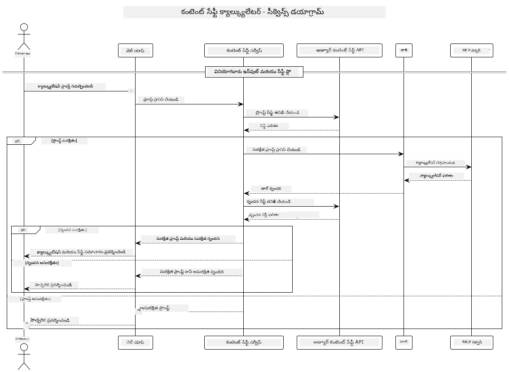

<!--
CO_OP_TRANSLATOR_METADATA:
{
  "original_hash": "e5ea5e7582f70008ea9bec3b3820f20a",
  "translation_date": "2025-12-11T16:37:55+00:00",
  "source_file": "04-PracticalImplementation/samples/java/containerapp/README.md",
  "language_code": "te"
}
-->
## సిస్టమ్ ఆర్కిటెక్చర్

ఈ ప్రాజెక్ట్ ఒక వెబ్ అప్లికేషన్‌ను ప్రదర్శిస్తుంది, ఇది యూజర్ ప్రాంప్ట్‌లను క్యాల్క్యులేటర్ సర్వీస్‌కు Model Context Protocol (MCP) ద్వారా పంపించే ముందు కంటెంట్ సేఫ్టీ తనిఖీని ఉపయోగిస్తుంది.



### ఇది ఎలా పనిచేస్తుంది

1. **యూజర్ ఇన్‌పుట్**: యూజర్ వెబ్ ఇంటర్‌ఫేస్‌లో ఒక గణన ప్రాంప్ట్‌ను నమోదు చేస్తాడు  
2. **కంటెంట్ సేఫ్టీ స్క్రీనింగ్ (ఇన్‌పుట్)**: ప్రాంప్ట్‌ను Azure Content Safety API ద్వారా విశ్లేషిస్తారు  
3. **సేఫ్టీ నిర్ణయం (ఇన్‌పుట్)**:  
   - కంటెంట్ సురక్షితంగా ఉంటే (అన్ని వర్గాలలో తీవ్రత < 2), అది క్యాల్క్యులేటర్‌కు పంపబడుతుంది  
   - కంటెంట్ ప్రమాదకరంగా గుర్తించబడితే, ప్రక్రియ ఆగిపోతుంది మరియు హెచ్చరికను తిరిగి ఇస్తుంది  
4. **క్యాల్క్యులేటర్ ఇంటిగ్రేషన్**: సురక్షిత కంటెంట్ LangChain4j ద్వారా ప్రాసెస్ చేయబడుతుంది, ఇది MCP క్యాల్క్యులేటర్ సర్వర్‌తో కమ్యూనికేట్ చేస్తుంది  
5. **కంటెంట్ సేఫ్టీ స్క్రీనింగ్ (అవుట్‌పుట్)**: బాట్ యొక్క ప్రతిస్పందన Azure Content Safety API ద్వారా విశ్లేషించబడుతుంది  
6. **సేఫ్టీ నిర్ణయం (అవుట్‌పుట్)**:  
   - బాట్ ప్రతిస్పందన సురక్షితంగా ఉంటే, అది యూజర్‌కు చూపబడుతుంది  
   - బాట్ ప్రతిస్పందన ప్రమాదకరంగా గుర్తించబడితే, అది హెచ్చరికతో మార్చబడుతుంది  
7. **ప్రతిస్పందన**: ఫలితాలు (సురక్షితమైతే) యూజర్‌కు రెండు సేఫ్టీ విశ్లేషణలతో పాటు ప్రదర్శించబడతాయి

## క్యాల్క్యులేటర్ సర్వీసులతో Model Context Protocol (MCP) ఉపయోగించడం

ఈ ప్రాజెక్ట్ LangChain4j నుండి క్యాల్క్యులేటర్ MCP సర్వీసులను పిలవడానికి Model Context Protocol (MCP) ఎలా ఉపయోగించాలో ప్రదర్శిస్తుంది. అమలు స్థానిక MCP సర్వర్‌ను పోర్ట్ 8080 లో నడుపుతూ క్యాల్క్యులేటర్ ఆపరేషన్లను అందిస్తుంది.

### Azure Content Safety సర్వీస్ సెటప్ చేయడం

కంటెంట్ సేఫ్టీ ఫీచర్లను ఉపయోగించే ముందు, మీరు Azure Content Safety సర్వీస్ రిసోర్స్‌ను సృష్టించాలి:

1. [Azure Portal](https://portal.azure.com) లో సైన్ ఇన్ అవ్వండి  
2. "Create a resource" క్లిక్ చేసి "Content Safety" కోసం శోధించండి  
3. "Content Safety" ఎంచుకుని "Create" క్లిక్ చేయండి  
4. మీ రిసోర్స్‌కు ఒక ప్రత్యేక పేరు ఇవ్వండి  
5. మీ సబ్‌స్క్రిప్షన్ మరియు రిసోర్స్ గ్రూప్ ఎంచుకోండి (లేదా కొత్తది సృష్టించండి)  
6. మద్దతు ఉన్న ప్రాంతాన్ని ఎంచుకోండి ([Region availability](https://azure.microsoft.com/en-us/global-infrastructure/services/?products=cognitive-services) వివరాలకు చూడండి)  
7. సరైన ప్రైసింగ్ టియర్ ఎంచుకోండి  
8. రిసోర్స్‌ను డిప్లాయ్ చేయడానికి "Create" క్లిక్ చేయండి  
9. డిప్లాయ్‌మెంట్ పూర్తయిన తర్వాత, "Go to resource" క్లిక్ చేయండి  
10. ఎడమ ప్యానెల్లో "Resource Management" కింద "Keys and Endpoint" ఎంచుకోండి  
11. కీలు మరియు ఎండ్‌పాయింట్ URL ను కాపీ చేసుకోండి తదుపరి దశలో ఉపయోగించడానికి

### ఎన్విరాన్‌మెంట్ వేరియబుల్స్ కాన్ఫిగర్ చేయడం

GitHub మోడల్స్ ఆథెంటికేషన్ కోసం `GITHUB_TOKEN` ఎన్విరాన్‌మెంట్ వేరియబుల్ సెట్ చేయండి:  
```sh
export GITHUB_TOKEN=<your_github_token>
```
  
కంటెంట్ సేఫ్టీ ఫీచర్ల కోసం, ఈ వేరియబుల్స్ సెట్ చేయండి:  
```sh
export CONTENT_SAFETY_ENDPOINT=<your_content_safety_endpoint>
export CONTENT_SAFETY_KEY=<your_content_safety_key>
```
  
ఈ ఎన్విరాన్‌మెంట్ వేరియబుల్స్ అప్లికేషన్ Azure Content Safety సర్వీస్‌తో ఆథెంటికేట్ కావడానికి ఉపయోగిస్తాయి. ఈ వేరియబుల్స్ సెట్ చేయకపోతే, అప్లికేషన్ డెమో కోసం ప్లేస్‌హోల్డర్ విలువలను ఉపయోగిస్తుంది, కానీ కంటెంట్ సేఫ్టీ ఫీచర్లు సరిగ్గా పనిచేయవు.

### క్యాల్క్యులేటర్ MCP సర్వర్ ప్రారంభించడం

క్లయింట్‌ను నడపడానికి ముందు, మీరు స్థానిక హోస్ట్:8080 లో SSE మోడ్‌లో క్యాల్క్యులేటర్ MCP సర్వర్‌ను ప్రారంభించాలి.

## ప్రాజెక్ట్ వివరణ

ఈ ప్రాజెక్ట్ Model Context Protocol (MCP) ను LangChain4j తో ఇంటిగ్రేట్ చేసి క్యాల్క్యులేటర్ సర్వీసులను పిలవడం ఎలా చేయాలో ప్రదర్శిస్తుంది. ముఖ్య ఫీచర్లు:

- MCP ఉపయోగించి ప్రాథమిక గణిత ఆపరేషన్ల కోసం క్యాల్క్యులేటర్ సర్వీస్‌కు కనెక్ట్ అవ్వడం  
- యూజర్ ప్రాంప్ట్‌లు మరియు బాట్ ప్రతిస్పందనలపై ద్వి-స్థాయి కంటెంట్ సేఫ్టీ తనిఖీలు  
- GitHub యొక్క gpt-4.1-nano మోడల్‌తో LangChain4j ద్వారా ఇంటిగ్రేషన్  
- MCP ట్రాన్స్‌పోర్ట్ కోసం Server-Sent Events (SSE) ఉపయోగించడం

## కంటెంట్ సేఫ్టీ ఇంటిగ్రేషన్

ఈ ప్రాజెక్ట్ యూజర్ ఇన్‌పుట్‌లు మరియు సిస్టమ్ ప్రతిస్పందనలు హానికరమైన కంటెంట్ నుండి విముక్తంగా ఉండేందుకు సమగ్ర కంటెంట్ సేఫ్టీ ఫీచర్లను కలిగి ఉంది:

1. **ఇన్‌పుట్ స్క్రీనింగ్**: అన్ని యూజర్ ప్రాంప్ట్‌లను ద్వేష ప్రసంగం, హింస, స్వీయ హాని, లైంగిక కంటెంట్ వంటి హానికరమైన కంటెంట్ వర్గాల కోసం ప్రాసెస్ చేయడానికి ముందు విశ్లేషిస్తారు.  

2. **అవుట్‌పుట్ స్క్రీనింగ్**: సంభవించగల అన్‌సెన్సర్డ్ మోడల్స్ ఉపయోగించినప్పటికీ, సిస్టమ్ అన్ని ఉత్పత్తి చేసిన ప్రతిస్పందనలను అదే కంటెంట్ సేఫ్టీ ఫిల్టర్ల ద్వారా తనిఖీ చేస్తుంది, యూజర్‌కు చూపించే ముందు.

ఈ ద్వి-స్థాయి విధానం ఏ AI మోడల్ ఉపయోగించినా సిస్టమ్ సురక్షితంగా ఉండేలా చూసుకుంటుంది, హానికరమైన ఇన్‌పుట్‌లు మరియు సమస్యాత్మక AI ఉత్పత్తులను రెండింటినీ రక్షిస్తుంది.

## వెబ్ క్లయింట్

అప్లికేషన్ యూజర్‌కు స్నేహపూర్వకమైన వెబ్ ఇంటర్‌ఫేస్‌ను అందిస్తుంది, ఇది Content Safety Calculator సిస్టమ్‌తో ఇంటరాక్ట్ చేయడానికి అనుమతిస్తుంది:

### వెబ్ ఇంటర్‌ఫేస్ ఫీచర్లు

- గణన ప్రాంప్ట్‌లను నమోదు చేయడానికి సులభమైన, సూటిగా ఉన్న ఫారం  
- ద్వి-స్థాయి కంటెంట్ సేఫ్టీ ధృవీకరణ (ఇన్‌పుట్ మరియు అవుట్‌పుట్)  
- ప్రాంప్ట్ మరియు ప్రతిస్పందన సేఫ్టీపై రియల్-టైమ్ ఫీడ్‌బ్యాక్  
- సులభంగా అర్థం చేసుకునే రంగు-కోడ్ చేసిన సేఫ్టీ సూచికలు  
- వివిధ పరికరాల్లో పనిచేసే శుభ్రమైన, స్పందనాత్మక డిజైన్  
- యూజర్‌లకు మార్గనిర్దేశం చేసే ఉదాహరణ సురక్షిత ప్రాంప్ట్‌లు

### వెబ్ క్లయింట్ ఉపయోగించడం

1. అప్లికేషన్ ప్రారంభించండి:  
   ```sh
   mvn spring-boot:run
   ```
  
2. మీ బ్రౌజర్ తెరిచి `http://localhost:8087` కు వెళ్లండి  

3. అందించిన టెక్స్ట్ ఏరియాలో గణన ప్రాంప్ట్ నమోదు చేయండి (ఉదా: "Calculate the sum of 24.5 and 17.3")  

4. మీ అభ్యర్థనను ప్రాసెస్ చేయడానికి "Submit" క్లిక్ చేయండి  

5. ఫలితాలను చూడండి, వాటిలో ఉంటాయి:  
   - మీ ప్రాంప్ట్ యొక్క కంటెంట్ సేఫ్టీ విశ్లేషణ  
   - గణన ఫలితం (ప్రాంప్ట్ సురక్షితమైతే)  
   - బాట్ ప్రతిస్పందన యొక్క కంటెంట్ సేఫ్టీ విశ్లేషణ  
   - ఇన్‌పుట్ లేదా అవుట్‌పుట్ ఏదైనా ఫ్లాగ్ అయితే సేఫ్టీ హెచ్చరికలు

వెబ్ క్లయింట్ ఆటోమేటిక్‌గా రెండు కంటెంట్ సేఫ్టీ ధృవీకరణ ప్రక్రియలను నిర్వహిస్తుంది, ఏ AI మోడల్ ఉపయోగించినా అన్ని ఇంటరాక్షన్లు సురక్షితంగా మరియు సరైనవిగా ఉంటాయని నిర్ధారిస్తుంది.

---

<!-- CO-OP TRANSLATOR DISCLAIMER START -->
**అస్పష్టత**:  
ఈ డాక్యుమెంట్‌ను AI అనువాద సేవ [Co-op Translator](https://github.com/Azure/co-op-translator) ఉపయోగించి అనువదించబడింది. మేము ఖచ్చితత్వానికి ప్రయత్నించినప్పటికీ, ఆటోమేటెడ్ అనువాదాల్లో పొరపాట్లు లేదా తప్పులు ఉండవచ్చు. అసలు డాక్యుమెంట్ దాని స్వదేశీ భాషలోనే అధికారిక మూలంగా పరిగణించాలి. ముఖ్యమైన సమాచారానికి, ప్రొఫెషనల్ మానవ అనువాదం చేయించుకోవడం మంచిది. ఈ అనువాదం వలన కలిగే ఏవైనా అపార్థాలు లేదా తప్పుదారితీసే అర్థాలు కోసం మేము బాధ్యత వహించము.
<!-- CO-OP TRANSLATOR DISCLAIMER END -->