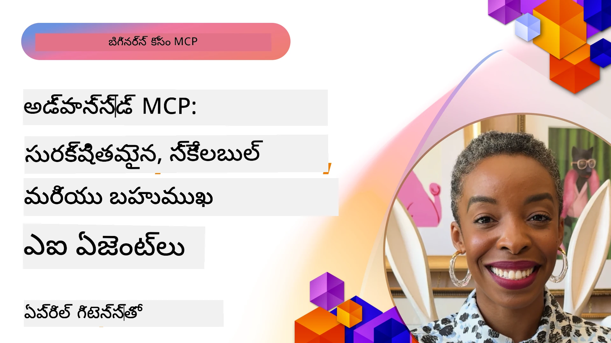

# MCPలో అధునాతన విషయాలు

_(ఈ పాఠం వీడియోను చూడడానికి పై చిత్రాన్ని క్లిక్ చేయండి)_

ఈ అధ్యాయం మోడల్ కాంటెక్స్ ప్రోటోకాల్ (MCP) అమలులో బహుముఖ అనుసంధానం, స్కేలబిలిటీ, భద్రత ఉత్తమ పద్ధతులు, మరియు సంస్థ అనుసంధానం వంటి అధునాతన విషయాలను ఆక్రమిస్తుంది. ఆధునిక AI వ్యవస్థల అవసరాలను తీర్చగల ఘన మరియు ఉత్పత్తి-సిద్ధ MCP అనువర్తనాలను నిర్మించటానికి ఈ విషయాలు కీలకమైనవి.

## అవలోకనం

ఈ పాఠం మోడల్ కాంటెక్స్ ప్రోటోకాల్ అమలులో అధునాతన భావనలను అన్వేషిస్తుంది, ప్రధానంగా బహుముఖ అనుసంధానం, స్కేలబిలిటీ, భద్రత ఉత్తమ పద్ధతులు, మరియు సంస్థ అనుసంధానంపై దృష్టి నింపుతూ. సంస్థ పరిసరాల లో సమ్మిళిత అవసరాలను నిర్వహించగల ఉత్పత్తి-గ్రేడ్ MCP అనువర్తనాలను నిర్మించడానికి ఈ అంశాలు అవసరమవుతాయి.

## నేర్చుకోవాల్సిన లక్ష్యాలు

ఈ పాఠం చివరికి, మీరు చేయగలుగుతారు:

- MCP ఫ్రేమ్‌వర్క్‌లలో బహుముఖ సామర్థ్యాలను అమలు చేయండి
- అధిక డిమాండ్ పరిస్థితుల కోసం స్కేలబుల్ MCP వాస్థవకల్పనలను రూపకల్పన చేయండి
- MCP భద్రత సూత్రాలకు అనుగుణంగా భద్రత ఉత్తమ పద్ధతులను వర్తింప చేయండి
- MCP ను సంస్థ AI సిస్టమ్స్ మరియు ఫ్రేమ్‌వర్క్‌లతో అనుసంధానం చేయండి
- ఉత్పత్తి పరిసరాలలో పనితీరు మరియు నమ్మకాన్ని గరిష్టముగా మార్చండి

## పాఠాలు మరియు నమూనా ప్రాజెక్టులు

| లింక్ | శీర్షిక | వివరణ |
|------|-------|-------------|
| [5.1 ఇంటిగ్రేషన్ విత్ ఆజర్](./mcp-integration/README.md) | ఆజర్‌తో ఇంటిగ్రేట్ చేయండి | మీ MCP సర్వర్‌ని ఆజర్‌లో ఎలా ఇంటిగ్రేట్ చేయాలో తెలుసుకోండి |
| [5.2 బహుమూల నమూనా](./mcp-multi-modality/README.md) | MCP బహుమూల నమూనాలు | ఆడియో, చిత్రం మరియు బహుమూల ప్రతిస్పందన కోసం నమూనాలు | 
| [5.3 MCP OAuth2 నమూనా](../../../05-AdvancedTopics/mcp-oauth2-demo) | MCP OAuth2 డెమో | MCP తో OAuth2 చూపించే కనిష్ట Spring Boot అప్లికేషన్, ఒథరైజేషన్ మరియు రిసోర్స్ సర్వర్ గా. భద్రత టోకన్ ఇష్యూ, రక్షిత ఎండి పాయింట్లు, ఆజర్ కంటైనర్ యాప్స్ డిప్లాయ్‌మెంట్, మరియు API మేనేజ్‌మెంట్ ఇంటిగ్రేషన్‌ను ప్రదర్శిస్తుంది. |
| [5.4 రూట్ కాంటెక్స్ట్స్](./mcp-root-contexts/README.md) | రూట్ కాంటెక్స్ట్‌లు | రూట్ కాంటెక్స్ట్ గురించి మరింత తెలుసుకోండి మరియు వాటిని ఎలా అమలు చేయాలో తెలుసుకోండి |
| [5.5 రౌటింగ్](./mcp-routing/README.md) | రౌటింగ్ | రౌటింగ్ వివిధ రకాల గురించి తెలుసుకోండి |
| [5.6 శాంప్లింగ్](./mcp-sampling/README.md) | శాంప్లింగ్ | శాంప్లింగ్‌తో ఎలా పని చేయాలో తెలుసుకోండి |
| [5.7 స్కేలింగ్](./mcp-scaling/README.md) | స్కేలింగ్ | స్కేలింగ్ గురించి తెలుసుకోండి |
| [5.8 భద్రత](./mcp-security/README.md) | భద్రత | మీ MCP సర్వర్‌ను భద్రత భద్రం చేయండి |
| [5.9 వెబ్ సెర్చ్ నమూనా](./web-search-mcp/README.md) | వెబ్ సెర్చ్ MCP | రియల్-టైమ్ వెబ్, వార్తలు, ఉత్పత్తి సర్చ్, మరియు ప్రశ్నలు & సమాధానాలు కోసం SerpAPIతో ఇంటిగ్రేట్ అయ్యే Python MCP సర్వర్ మరియు క్లయింట్. బహుళ-టూల్ కళాకారీ, బాహ్య API ఇంటిగ్రేషన్, మరియు ఖచ్చితమైన లోపాలను నిర్వహణ చూపిస్తుంది. |
| [5.10 రియల్‌టైమ్ స్ట్రీమింగ్](./mcp-realtimestreaming/README.md) | స్ట్రీమింగ్ | నేటి డేటా ఆధారిత ప్రపంచంలో వ్యాపారాలు మరియు అనువర్తనాలు తక్షణ సమాచారాన్ని అవసరం చేసుకుంటున్నందున రియల్-టైమ్ డేటా స్ట్రీమింగ్ అవసరం అయింది. |
| [5.11 రియల్‌టైమ్ వెబ్ సెర్చ్](./mcp-realtimesearch/README.md) | వెబ్ సెర్చ్ | రెయిల్-టైమ్ వెబ్ సెర్చ్ లో MCP ఎలా AI నమూనాలు, సెర్చ్ ఇంజిన్లు మరియు అనువర్తనాల కాంటెక్స్ట్ నిర్వహణకు ఒక ప్రమాణీకృత విధానాన్ని అందిస్తుంది అనే దానిని మారుస్తుంది. |
| [5.12 ఎంట్రా ID స్ర్తతీకరణ మోడల్ కాంటెక్స్ట్ ప్రోటోకాల్ సర్వర్స్ కోసం](./mcp-security-entra/README.md) | ఎంట్రా ID స్ర్తతీకరణ | Microsoft Entra ID ఒక బలమైన క్లౌడ్ ఆధారిత ఐడెంటిటీ మరియు యాక్సెస్ మేనేజ్‌మెంట్ సొల్యూషన్ అందిస్తుంది, మీ MCP సర్వర్‌తో కేవలం అనుమతించిన వినియోగదారులు మరియు అనువర్తనాలు మాత్రమే పరస్పరం చేయడానికి సహాయపడుతుంది. |
| [5.13 ఆజర్ AI ఫౌండ్రి ఏజెంట్ ఇంటిగ్రేషన్](./mcp-foundry-agent-integration/README.md) | ఆజర్ AI ఫౌండ్రి ఇంటిగ్రేషన్ | మోడల్ కాంటెక్స్ట్ ప్రోటోకాల్ సర్వర్లు, ఆజర్ AI ఫౌండ్రి ఏజెంట్‌లతో ఎలా ఇంటిగ్రేట్ చేయాలో తెలుసుకోండి, బలమైన టూల్ కళాకారీ మరియు సంస్థ AI సామర్థ్యాలను ప్రమాణాత్మక బాహ్య డేటా మూలాలు కనెక్షన్లతో సాధ్యం చేస్తుంది. |
| [5.14 కాంటెక్స్ట్ ఇంజనీరింగ్](./mcp-contextengineering/README.md) | కాంటెక్స్ట్ ఇంజనీరింగ్ | MCP సర్వర్ల కోసం కాంటెక్స్ట్ ఇంజనీరింగ్ సాంకేతికతల భవిష్యత్తు అవకాశాలు, కాంటెక్స్ట్ ఆప్టిమైజేషన్, డైనమిక్ కాంటెక్స్ట్ నిర్వహణ మరియు MCP ఫ్రేమ్‌వర్క్‌లలో సమర్థవంతమైన ప్రాంప్ట్ ఇంజనీరింగ్ కోసం వ్యూహాలు. |
| [5.15 MCP కస్టమ్ ట్రాన్స్‌పోర్ట్](./mcp-transport/README.md) | కస్టమ్ ట్రాన్స్‌పోర్ట్ | ప్రత్యేక MCP కమ్యూనికేషన్ పరిస్థితుల కోసం కస్టమ్ ట్రాన్స్‌పోర్ట్ మెకానిజమ్లను ఎలా అమలు చేయాలో తెలుసుకోండి. |
| [5.16 ప్రోటోకాల్ ఫీచర్స్ లోతైన అధ్యయనం](./mcp-protocol-features/README.md) | ప్రోటోకాల్ ఫీచర్స్ | పురోగతి నోటిఫికేషన్లు, అభ్యర్థన రద్దు, వనరుల టెంప్లేట్లు, మరియు లోపాలను నిర్వహించే నమూనాల వంటి అధునాతన ప్రోటోకాల్ ఫీచర్లలో నిపుణులవ్వండి. |

> **MCP స్పెసిఫికేషన్ 2025-11-25లో కొత్తగా**: స్పెసిఫికేషన్ ఇప్పుడు ప్రయోగాత్మక మద్దతు కలిగి ఉంది **టాస్కులు** (పురోగతి ట్రాకింగ్ ఉన్న దీర్ఘకాలిక కార్యకలాపాలు), **టూల్ అనొటేషన్లు** (భద్రత కోసం టూల్ ప్రవర్తన గురించి మెటాడేటా), **URL మోడ్ ఎలిసిటేషన్** (క్లయింట్ల నుండి నిర్దిష్ట URL కంటెంట్‌ను అభ్యర్థించడం), మరియు మెరుగైన **రూట్స్** (వర్క్‌స్పేట్ కాంటెక్స్ట్ నిర్వహణ కోసం). పూర్తి వివరాలకు [MCP స్పెసిఫికేషన్ చేంజ్‌లాగ్](https://spec.modelcontextprotocol.io/) చూడండి.

## అదనపు ఆధారాలు

అధునాతన MCP విషయాలపై తాజా సమాచారం కోసం, చూడండి:
- [MCP డాక్యుమెంటేషన్](https://modelcontextprotocol.io/)
- [MCP స్పెసిఫికేషన్ (2025-11-25)](https://spec.modelcontextprotocol.io/specification/2025-11-25/)
- [GitHub రిపోజిటరీ](https://github.com/modelcontextprotocol)
- [OWASP MCP టాప్ 10](https://microsoft.github.io/mcp-azure-security-guide/mcp/) - భద్రతా ప్రమాదాలు మరియు విడమరచి మరమ్మతులు
- [MCP భద్రతా శिखరం వర్క్‌షాప్ (షెర్పా)](https://azure-samples.github.io/sherpa/) - స్పర్శ ద్వారా భద్రతా శిక్షణ

## ముఖ్యాంశాలు

- బహుముఖ MCP అమలు టెక్స్ట్ ప్రాసెసింగ్ దాటి AI సామర్థ్యాలను విస్తరించే విధానం
- స్కేలబిలిటీ సంస్థలివి అమరికలకు ముఖ్యమైనది,ది, దీన్ని హారిజాంటల్ మరియు వెర్టికల్ స్కేలింగ్ ద్వారా పరిష్కరించవచ్చు
- విస్తృతమైన భద్రతా చర్యలు డేటాను రక్షించి సరైన ప్రాప్తి నియంత్రణను నిర్ధారిస్తాయి
- ఆజర్ ఓపెన్ AI మరియు Microsoft AI Foundry వంటి వేదికలతో సంస్థ అనుసంధానం MCP సామర్థ్యాలను పెంపొందిస్తుంది
- అధునాతన MCP అమలు అత్యుత్తమ వాస్థవకల్పనలు మరియు జాగ్రత్తగా వనరుల నిర్వహణ నుండి లాభపడతాయి

## వ్యాయామం

ఒక నిర్దిష్ట వినియోగానికి సంస్థ-గ్రేడ్ MCP అమలును రూపకల్పన చేయండి:

1. మీ వినియోగానికి బహుముఖ అవసరాలను గుర్తించండి
2. సున్నిత డేటాను రక్షించడానికి అవసరమైన భద్రత నియంత్రణలను వివరించండి
3. వేరియబుల్ లోడ్‌ని నిర్వహించగల స్కేలబుల్ వాస్థవకల్పనను రూపకల్పన చేయండి
4. సంస్థ AI సిస్టమ్స్‌తో ఇంటిగ్రేషన్ పాయింట్లను పథకం చేయండి
5. పనితీరు బ్యాటిల్‌నెక్స్ మరియు నివారణ వ్యూహాలను డాక్యుమెంట్ చేయండి

## అదనపు వనరులు

- [ఆజర్ ఓపెన్ AI డాక్యుమెంటేషన్](https://learn.microsoft.com/en-us/azure/ai-services/openai/)
- [Microsoft AI Foundry డాక్యుమెంటేషన్](https://learn.microsoft.com/en-us/ai-services/)

---

## తదుపరి ఏమిటి

ఈ మాడ్యూల్లో పాఠాలను [5.1 MCP ఇంటిగ్రేషన్](./mcp-integration/README.md) తో ప్రారంభించండి

ఈ మాడ్యూల్ను పూర్తి చేసిన తర్వాత, కొనసాగండి: [మాడ్యూల్ 6: కమ్యూనిటీ కాంట్రిబ్యూషన్స్](../06-CommunityContributions/README.md)

---

<!-- CO-OP TRANSLATOR DISCLAIMER START -->
**అస్పష్టీకరణ**:  
ఈ పత్రాన్ని AI అనువాద సేవ [Co-op Translator](https://github.com/Azure/co-op-translator) ఉపయోగించి అనువదించబడింది. ఖచ్చితత్వానికి మేము ప్రయత్నిస్తున్నప్పటికీ, ఆటోమేటెడ్ అనువాదాలలో పొరపాట్లు లేదా లోపాలు ఉండవచ్చు. మాతృభాషలో ఉన్న అసలు పత్రం అధికారిక వనరు అని పరిగణించాలి. ముఖ్యమైన సమాచారానికి, నిపుణుల చేత మానవ అనువాదం సూచించబడుతుంది. ఈ అనువాదం ఉపయోగించడం వల్ల కలిగే ఏవైనా తప్పుగా అర్థం చేసుకోవడాలు లేదా భావ విభ్రాంతులకు మేము బాధ్యత తీసుకోము.
<!-- CO-OP TRANSLATOR DISCLAIMER END -->