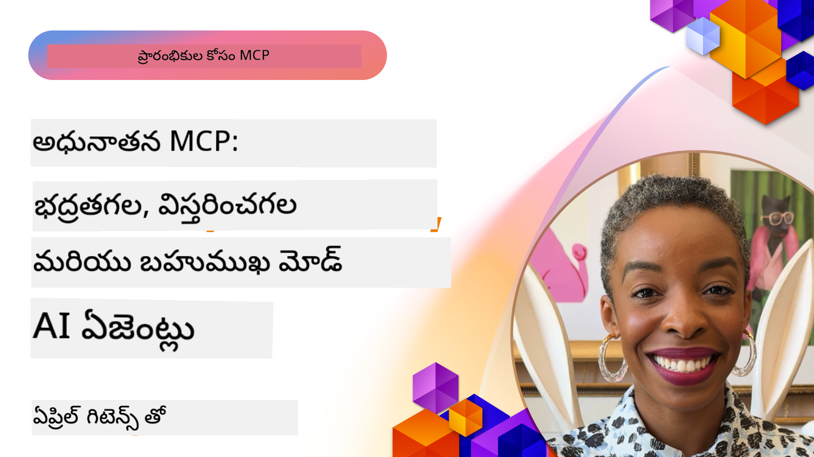

<!--
CO_OP_TRANSLATOR_METADATA:
{
  "original_hash": "d204bc94ea6027d06a703b21b711ca57",
  "translation_date": "2025-12-11T10:57:36+00:00",
  "source_file": "05-AdvancedTopics/README.md",
  "language_code": "te"
}
-->
# MCP లో అధునాతన విషయాలు

_(ఈ పాఠం వీడియోను చూడడానికి పై చిత్రాన్ని క్లిక్ చేయండి)_

ఈ అధ్యాయం మోడల్ కాంటెక్స్ట్ ప్రోటోకాల్ (MCP) అమలులో బహుముఖ సమ్మేళనం, స్కేలబిలిటీ, సెక్యూరిటీ ఉత్తమ పద్ధతులు, మరియు ఎంటర్ప్రైజ్ సమ్మేళనం వంటి అధునాతన విషయాలను కవర్ చేస్తుంది. ఈ విషయాలు ఆధునిక AI వ్యవస్థల డిమాండ్లను తీర్చగలిగే బలమైన మరియు ప్రొడక్షన్-రెడీ MCP అప్లికేషన్లను నిర్మించడానికి కీలకమైనవి.

## అవలోకనం

ఈ పాఠం మోడల్ కాంటెక్స్ట్ ప్రోటోకాల్ అమలులో అధునాతన భావనలను అన్వేషిస్తుంది, బహుముఖ సమ్మేళనం, స్కేలబిలిటీ, సెక్యూరిటీ ఉత్తమ పద్ధతులు, మరియు ఎంటర్ప్రైజ్ సమ్మేళనంపై దృష్టి సారిస్తుంది. ఈ విషయాలు ఎంటర్ప్రైజ్ వాతావరణాలలో సంక్లిష్ట అవసరాలను నిర్వహించగల ప్రొడక్షన్-గ్రేడ్ MCP అప్లికేషన్లను నిర్మించడానికి అవసరమైనవి.

## నేర్చుకునే లక్ష్యాలు

ఈ పాఠం ముగిసిన తర్వాత, మీరు చేయగలుగుతారు:

- MCP ఫ్రేమ్‌వర్క్‌లలో బహుముఖ సామర్థ్యాలను అమలు చేయడం
- అధిక డిమాండ్ పరిస్థితుల కోసం స్కేలబుల్ MCP ఆర్కిటెక్చర్లను డిజైన్ చేయడం
- MCP సెక్యూరిటీ సూత్రాలకు అనుగుణంగా సెక్యూరిటీ ఉత్తమ పద్ధతులను వర్తించడం
- MCP ను ఎంటర్ప్రైజ్ AI వ్యవస్థలు మరియు ఫ్రేమ్‌వర్క్‌లతో సమ్మిళితం చేయడం
- ప్రొడక్షన్ వాతావరణాలలో పనితీరు మరియు నమ్మకదారితనాన్ని ఆప్టిమైజ్ చేయడం

## పాఠాలు మరియు నమూనా ప్రాజెక్టులు

| లింక్ | శీర్షిక | వివరణ |
|------|-------|-------------|
| [5.1 Azure తో సమ్మేళనం](./mcp-integration/README.md) | Azure తో సమ్మేళనం | Azure పై మీ MCP సర్వర్‌ను ఎలా సమ్మిళితం చేయాలో నేర్చుకోండి |
| [5.2 బహుముఖ నమూనా](./mcp-multi-modality/README.md) | MCP బహుముఖ నమూనాలు | ఆడియో, చిత్రం మరియు బహుముఖ ప్రతిస్పందన కోసం నమూనాలు |
| [5.3 MCP OAuth2 నమూనా](../../../05-AdvancedTopics/mcp-oauth2-demo) | MCP OAuth2 డెమో | MCP తో OAuth2 చూపించే కనిష్ట స్ప్రింగ్ బూట్ యాప్, అథారైజేషన్ మరియు రిసోర్స్ సర్వర్ రెండింటిగా. సురక్షిత టోకెన్ జారీ, రక్షిత ఎండ్పాయింట్లు, Azure కంటైనర్ యాప్స్ డిప్లాయ్‌మెంట్, మరియు API మేనేజ్‌మెంట్ సమ్మేళనాన్ని ప్రదర్శిస్తుంది. |
| [5.4 రూట్ కాంటెక్స్ట్‌లు](./mcp-root-contexts/README.md) | రూట్ కాంటెక్స్ట్‌లు | రూట్ కాంటెక్స్ట్ గురించి మరింత తెలుసుకోండి మరియు వాటిని ఎలా అమలు చేయాలో నేర్చుకోండి |
| [5.5 రౌటింగ్](./mcp-routing/README.md) | రౌటింగ్ | రౌటింగ్ యొక్క వివిధ రకాల గురించి తెలుసుకోండి |
| [5.6 శాంప్లింగ్](./mcp-sampling/README.md) | శాంప్లింగ్ | శాంప్లింగ్‌తో ఎలా పని చేయాలో నేర్చుకోండి |
| [5.7 స్కేలింగ్](./mcp-scaling/README.md) | స్కేలింగ్ | స్కేలింగ్ గురించి తెలుసుకోండి |
| [5.8 సెక్యూరిటీ](./mcp-security/README.md) | సెక్యూరిటీ | మీ MCP సర్వర్‌ను సురక్షితం చేయండి |
| [5.9 వెబ్ సెర్చ్ నమూనా](./web-search-mcp/README.md) | వెబ్ సెర్చ్ MCP | Python MCP సర్వర్ మరియు క్లయింట్, SerpAPI తో సమ్మిళితం చేసి రియల్-టైమ్ వెబ్, వార్తలు, ఉత్పత్తి శోధన, మరియు ప్రశ్నోత్తరాలను నిర్వహిస్తుంది. బహుముఖ టూల్ ఆర్కెస్ట్రేషన్, బాహ్య API సమ్మేళనం, మరియు బలమైన లోపాల నిర్వహణను ప్రదర్శిస్తుంది. |
| [5.10 రియల్‌టైమ్ స్ట్రీమింగ్](./mcp-realtimestreaming/README.md) | స్ట్రీమింగ్ | రియల్-టైమ్ డేటా స్ట్రీమింగ్ ఈ రోజుల్లో డేటా ఆధారిత ప్రపంచంలో అవసరం అయింది, వ్యాపారాలు మరియు అప్లికేషన్లు సమయోచిత నిర్ణయాలు తీసుకోవడానికి తక్షణ సమాచారం అవసరం. |
| [5.11 రియల్‌టైమ్ వెబ్ సెర్చ్](./mcp-realtimesearch/README.md) | వెబ్ సెర్చ్ | రియల్-టైమ్ వెబ్ సెర్చ్ ఎలా MCP ద్వారా AI మోడల్స్, సెర్చ్ ఇంజిన్లు, మరియు అప్లికేషన్ల మధ్య కాంటెక్స్ట్ నిర్వహణకు ప్రమాణీకృత దృష్టికోణాన్ని అందిస్తుంది. |
| [5.12 మోడల్ కాంటెక్స్ట్ ప్రోటోకాల్ సర్వర్ల కోసం Entra ID ధృవీకరణ](./mcp-security-entra/README.md) | Entra ID ధృవీకరణ | Microsoft Entra ID ఒక బలమైన క్లౌడ్ ఆధారిత గుర్తింపు మరియు యాక్సెస్ నిర్వహణ పరిష్కారాన్ని అందిస్తుంది, మీ MCP సర్వర్‌తో పరిమిత యూజర్లు మరియు అప్లికేషన్లు మాత్రమే పరస్పరం చేయగలవని నిర్ధారిస్తుంది. |
| [5.13 Azure AI Foundry ఏజెంట్ సమ్మేళనం](./mcp-foundry-agent-integration/README.md) | Azure AI Foundry సమ్మేళనం | మోడల్ కాంటెక్స్ట్ ప్రోటోకాల్ సర్వర్లను Azure AI Foundry ఏజెంట్లతో ఎలా సమ్మిళితం చేయాలో నేర్చుకోండి, శక్తివంతమైన టూల్ ఆర్కెస్ట్రేషన్ మరియు ఎంటర్ప్రైజ్ AI సామర్థ్యాలను ప్రమాణీకృత బాహ్య డేటా మూలాల కనెక్షన్లతో సాధించండి. |
| [5.14 కాంటెక్స్ట్ ఇంజనీరింగ్](./mcp-contextengineering/README.md) | కాంటెక్స్ట్ ఇంజనీరింగ్ | MCP సర్వర్ల కోసం కాంటెక్స్ట్ ఇంజనీరింగ్ సాంకేతికతల భవిష్యత్తు అవకాశాలు, కాంటెక్స్ట్ ఆప్టిమైజేషన్, డైనమిక్ కాంటెక్స్ట్ నిర్వహణ, మరియు MCP ఫ్రేమ్‌వర్క్‌లలో సమర్థవంతమైన ప్రాంప్ట్ ఇంజనీరింగ్ వ్యూహాలు. |

## అదనపు సూచనలు

అధునాతన MCP విషయాలపై తాజా సమాచారం కోసం, చూడండి:
- [MCP డాక్యుమెంటేషన్](https://modelcontextprotocol.io/)
- [MCP స్పెసిఫికేషన్](https://spec.modelcontextprotocol.io/)
- [GitHub రిపోజిటరీ](https://github.com/modelcontextprotocol)

## ముఖ్యమైన విషయాలు

- బహుముఖ MCP అమలులు టెక్స్ట్ ప్రాసెసింగ్ కంటే మించి AI సామర్థ్యాలను విస్తరించాయి
- స్కేలబిలిటీ ఎంటర్ప్రైజ్ డిప్లాయ్‌మెంట్‌లకు అవసరం మరియు హారిజాంటల్ మరియు వెర్టికల్ స్కేలింగ్ ద్వారా పరిష్కరించవచ్చు
- సమగ్ర సెక్యూరిటీ చర్యలు డేటాను రక్షించి సరైన యాక్సెస్ నియంత్రణను నిర్ధారిస్తాయి
- Azure OpenAI మరియు Microsoft AI Foundry వంటి ప్లాట్‌ఫారమ్‌లతో ఎంటర్ప్రైజ్ సమ్మేళనం MCP సామర్థ్యాలను పెంచుతుంది
- అధునాతన MCP అమలులు ఆప్టిమైజ్డ్ ఆర్కిటెక్చర్లు మరియు జాగ్రత్తగా వనరుల నిర్వహణ నుండి లాభపడతాయి

## వ్యాయామం

ఒక నిర్దిష్ట ఉపయోగ కేసు కోసం ఎంటర్ప్రైజ్-గ్రేడ్ MCP అమలును డిజైన్ చేయండి:

1. మీ ఉపయోగ కేసు కోసం బహుముఖ అవసరాలను గుర్తించండి
2. సున్నితమైన డేటాను రక్షించడానికి అవసరమైన సెక్యూరిటీ నియంత్రణలను వివరించండి
3. మారుతున్న లోడ్‌ను నిర్వహించగల స్కేలబుల్ ఆర్కిటెక్చర్‌ను డిజైన్ చేయండి
4. ఎంటర్ప్రైజ్ AI వ్యవస్థలతో సమ్మేళన పాయింట్లను ప్రణాళిక చేయండి
5. సాధ్యమైన పనితీరు అడ్డంకులు మరియు పరిష్కార వ్యూహాలను డాక్యుమెంట్ చేయండి

## అదనపు వనరులు

- [Azure OpenAI డాక్యుమెంటేషన్](https://learn.microsoft.com/en-us/azure/ai-services/openai/)
- [Microsoft AI Foundry డాక్యుమెంటేషన్](https://learn.microsoft.com/en-us/ai-services/)

---

## తదుపరి ఏమిటి

- [5.1 MCP సమ్మేళనం](./mcp-integration/README.md)

---

<!-- CO-OP TRANSLATOR DISCLAIMER START -->
**అస్పష్టత**:  
ఈ పత్రాన్ని AI అనువాద సేవ [Co-op Translator](https://github.com/Azure/co-op-translator) ఉపయోగించి అనువదించబడింది. మేము ఖచ్చితత్వానికి ప్రయత్నించినప్పటికీ, ఆటోమేటెడ్ అనువాదాల్లో పొరపాట్లు లేదా తప్పిదాలు ఉండవచ్చు. మూల పత్రం దాని స్వదేశీ భాషలో అధికారిక మూలంగా పరిగణించాలి. ముఖ్యమైన సమాచారానికి, ప్రొఫెషనల్ మానవ అనువాదం సిఫార్సు చేయబడుతుంది. ఈ అనువాదం వాడకంలో ఏర్పడిన ఏవైనా అపార్థాలు లేదా తప్పుదారితీసే అర్థాలు కోసం మేము బాధ్యత వహించము.
<!-- CO-OP TRANSLATOR DISCLAIMER END -->