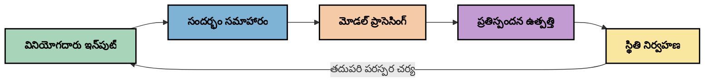
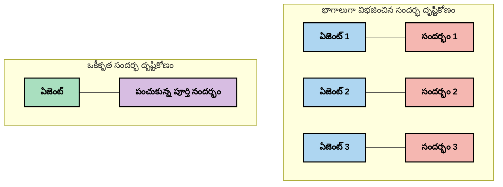
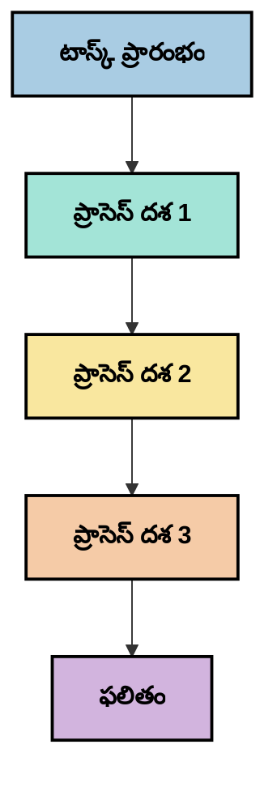
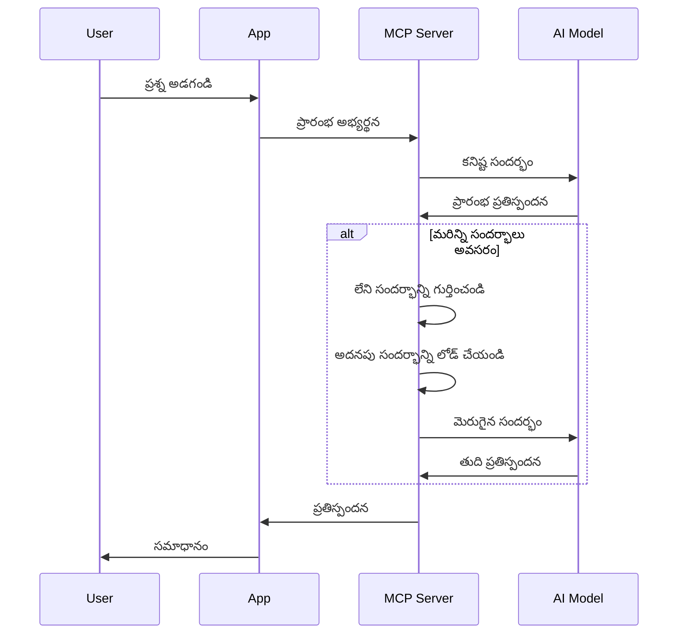
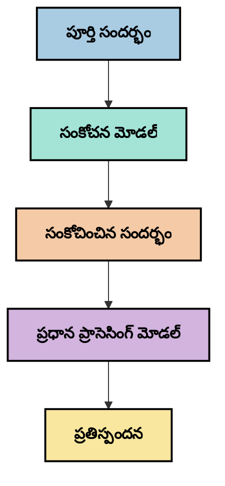

# Context Engineering: MCP ఎకోసిస్టమ్‌లో ఒక ఉదయిస్తున్న భావన

## అవలోకనం

Context engineering అనేది AI రంగంలో ఒక ఉదయిస్తున్న భావన, ఇది క్లయింట్లు మరియు AI సేవల మధ్య పరస్పర చర్యల సమయంలో సమాచారం ఎలా నిర్మించబడుతుంది, అందించబడుతుంది మరియు నిర్వహించబడుతుంది అనే దానిని పరిశీలిస్తుంది. Model Context Protocol (MCP) ఎకోసిస్టమ్ అభివృద్ధి చెందుతున్న కొద్దీ, context ను సమర్థవంతంగా నిర్వహించడం మరింత ముఖ్యమవుతుంది. ఈ మాడ్యూల్ context engineering భావనను పరిచయం చేస్తుంది మరియు MCP అమలులో దాని సాధ్యమైన అనువర్తనాలను పరిశీలిస్తుంది.

## నేర్చుకునే లక్ష్యాలు

ఈ మాడ్యూల్ ముగింపు నాటికి, మీరు చేయగలుగుతారు:

- context engineering యొక్క ఉదయిస్తున్న భావన మరియు MCP అనువర్తనాలలో దాని సాధ్యమైన పాత్రను అర్థం చేసుకోవడం
- MCP ప్రోటోకాల్ డిజైన్ పరిష్కరించే context నిర్వహణలో ప్రధాన సవాళ్లను గుర్తించడం
- మెరుగైన context నిర్వహణ ద్వారా మోడల్ పనితీరును మెరుగుపరచడానికి సాంకేతికతలను అన్వేషించడం
- context ప్రభావాన్ని కొలవడం మరియు మూల్యాంకనం చేయడానికి పద్ధతులను పరిగణించడం
- MCP ఫ్రేమ్‌వర్క్ ద్వారా AI అనుభవాలను మెరుగుపరచడానికి ఈ ఉదయిస్తున్న భావనలను వర్తింపజేయడం

## Context Engineering కు పరిచయం

Context engineering అనేది వినియోగదారులు, అనువర్తనాలు మరియు AI మోడల్స్ మధ్య సమాచార ప్రవాహాన్ని ఉద్దేశపూర్వకంగా డిజైన్ చేయడం మరియు నిర్వహించడంపై దృష్టి సారించే ఉదయిస్తున్న భావన. prompt engineering వంటి స్థాపిత రంగాల నుండి భిన్నంగా, context engineering ఇంకా నిర్వచించబడుతోంది, ఎందుకంటే ప్రాక్టిషనర్లు AI మోడల్స్‌కు సరైన సమయంలో సరైన సమాచారాన్ని అందించే ప్రత్యేక సవాళ్లను పరిష్కరించడానికి పని చేస్తున్నారు.

పెద్ద భాషా మోడల్స్ (LLMs) అభివృద్ధి చెందడంతో, context యొక్క ప్రాముఖ్యత మరింత స్పష్టమైంది. మనం అందించే context యొక్క నాణ్యత, సంబంధితత మరియు నిర్మాణం మోడల్ అవుట్పుట్లపై ప్రత్యక్ష ప్రభావం చూపుతుంది. context engineering ఈ సంబంధాన్ని పరిశీలించి సమర్థవంతమైన context నిర్వహణకు సూత్రాలను అభివృద్ధి చేయడానికి ప్రయత్నిస్తుంది.

> "2025లో, అక్కడ ఉన్న మోడల్స్ అత్యంత తెలివైనవిగా ఉంటాయి. కానీ అత్యంత తెలివైన మనిషి కూడా వారు చేయాల్సిన పనిని context లేకుండా సమర్థవంతంగా చేయలేరు... 'Context engineering' అనేది prompt engineering యొక్క తదుపరి స్థాయి. ఇది డైనమిక్ సిస్టమ్‌లో స్వయంచాలకంగా చేయడం గురించి." — Walden Yan, Cognition AI

Context engineering లో ఈ అంశాలు ఉండవచ్చు:

1. **Context ఎంపిక**: ఒక నిర్దిష్ట పనికి సంబంధిత సమాచారం నిర్ణయించడం
2. **Context నిర్మాణం**: మోడల్ అవగాహనను గరిష్టం చేయడానికి సమాచారాన్ని ఏర్పాటు చేయడం
3. **Context డెలివరీ**: సమాచారాన్ని మోడల్స్‌కు ఎప్పుడు మరియు ఎలా పంపించాలో ఆప్టిమైజ్ చేయడం
4. **Context నిర్వహణ**: కాలక్రమేణా context స్థితి మరియు పరిణామాన్ని నిర్వహించడం
5. **Context మూల్యాంకనం**: context ప్రభావాన్ని కొలవడం మరియు మెరుగుపరచడం

ఈ దృష్టికోణాలు MCP ఎకోసిస్టమ్‌కు ప్రత్యేకంగా సంబంధించి ఉంటాయి, ఇది అనువర్తనాలు LLMs కు context అందించడానికి ఒక ప్రమాణీకృత మార్గాన్ని అందిస్తుంది.

## Context ప్రయాణ దృష్టికోణం

context engineering ను దృశ్యీకరించడానికి ఒక మార్గం MCP సిస్టమ్ ద్వారా సమాచారం తీసుకునే ప్రయాణాన్ని ట్రేస్ చేయడం:


### Context ప్రయాణంలో ముఖ్య దశలు:

1. **వినియోగదారు ఇన్‌పుట్**: వినియోగదారుని నుండి రా సమాచారం (పాఠ్యం, చిత్రాలు, డాక్యుమెంట్లు)
2. **Context అసెంబ్లీ**: వినియోగదారు ఇన్‌పుట్‌ను సిస్టమ్ context, సంభాషణ చరిత్ర మరియు ఇతర పొందిన సమాచారంతో కలపడం
3. **మోడల్ ప్రాసెసింగ్**: AI మోడల్ అసెంబుల్ చేసిన context ను ప్రాసెస్ చేస్తుంది
4. **ప్రతిస్పందన ఉత్పత్తి**: అందించిన context ఆధారంగా మోడల్ అవుట్పుట్లు ఉత్పత్తి చేస్తుంది
5. **స్థితి నిర్వహణ**: పరస్పర చర్య ఆధారంగా సిస్టమ్ అంతర్గత స్థితిని నవీకరిస్తుంది

ఈ దృష్టికోణం AI సిస్టమ్స్‌లో context యొక్క డైనమిక్ స్వభావాన్ని హైలైట్ చేస్తుంది మరియు ప్రతి దశలో సమాచారాన్ని ఎలా ఉత్తమంగా నిర్వహించాలో ముఖ్యమైన ప్రశ్నలను ఉత్పత్తి చేస్తుంది.

## Context Engineering లో ఉదయిస్తున్న సూత్రాలు

context engineering రంగం రూపుదిద్దుకుంటున్న కొద్దీ, కొన్ని ప్రారంభ సూత్రాలు ప్రాక్టిషనర్ల నుండి వెలువడుతున్నాయి. ఈ సూత్రాలు MCP అమలులో ఎంపికలను సూచించవచ్చు:

### సూత్రం 1: Context ను పూర్తిగా పంచుకోండి

context ను సిస్టమ్ యొక్క అన్ని భాగాల మధ్య పూర్తిగా పంచుకోవాలి, బహుళ ఏజెంట్లు లేదా ప్రాసెస్‌ల మధ్య విభజించకూడదు. context పంపిణీ అయితే, సిస్టమ్ ఒక భాగంలో తీసుకున్న నిర్ణయాలు మరొక భాగంలో తీసుకున్న నిర్ణయాలతో విరుద్ధంగా ఉండవచ్చు.


MCP అనువర్తనాలలో, ఇది context మొత్తం పైప్లైన్ ద్వారా సజావుగా ప్రవహించేలా డిజైన్ చేయాలని సూచిస్తుంది, విభజింపబడకుండా.

### సూత్రం 2: చర్యలు అంతర్గత నిర్ణయాలను కలిగి ఉంటాయని గుర్తించండి

మోడల్ తీసుకునే ప్రతి చర్య context ను ఎలా అర్థం చేసుకోవాలో సంబంధించిన అంతర్గత నిర్ణయాలను కలిగి ఉంటుంది. బహుళ భాగాలు వేర్వేరు context లపై చర్యలు తీసుకుంటే, ఈ అంతర్గత నిర్ణయాలు విరుద్ధంగా ఉండవచ్చు, ఫలితంగా అసమంజసమైన ఫలితాలు వస్తాయి.

ఈ సూత్రం MCP అనువర్తనాలకు ముఖ్యమైన సూచనలు కలిగి ఉంది:
- విభజింపబడిన context తో సమాంతర అమలుకు బదులు సంక్లిష్ట పనుల రేఖీయ ప్రాసెసింగ్‌ను ప్రాధాన్యం ఇవ్వండి
- అన్ని నిర్ణయ బిందువులకు ఒకే context సమాచారాన్ని అందించండి
- తర్వాతి దశలు ముందరి నిర్ణయాల పూర్తి context ను చూడగలిగేలా సిస్టమ్స్ డిజైన్ చేయండి

### సూత్రం 3: context లోతు మరియు విండో పరిమితుల మధ్య సమతుల్యత

సంభాషణలు మరియు ప్రాసెస్‌లు పొడవుగా పెరిగే కొద్దీ, context విండోలు eventually overflow అవుతాయి. సమగ్ర context మరియు సాంకేతిక పరిమితుల మధ్య ఈ ఒత్తిడి నిర్వహించడానికి సమర్థవంతమైన context engineering పద్ధతులను అన్వేషిస్తుంది.

పరిశీలించబడుతున్న సాధ్యమైన పద్ధతులు:
- టోకెన్ వినియోగాన్ని తగ్గిస్తూ అవసరమైన సమాచారాన్ని నిలుపుకునే context కంప్రెషన్
- ప్రస్తుత అవసరాలకు సంబంధించి context ను ప్రోగ్రెసివ్‌గా లోడ్ చేయడం
- కీలక నిర్ణయాలు మరియు వాస్తవాలను నిలుపుకుని గత పరస్పర చర్యల సారాంశం

## Context సవాళ్లు మరియు MCP ప్రోటోకాల్ డిజైన్

Model Context Protocol (MCP) context నిర్వహణ యొక్క ప్రత్యేక సవాళ్లను అవగాహనతో డిజైన్ చేయబడింది. ఈ సవాళ్లను అర్థం చేసుకోవడం MCP ప్రోటోకాల్ డిజైన్ యొక్క ముఖ్యాంశాలను వివరించడంలో సహాయపడుతుంది:

### సవాలు 1: Context విండో పరిమితులు
అధిక భాగం AI మోడల్స్‌కు స్థిర context విండో పరిమాణాలు ఉంటాయి, ఒకేసారి ఎంత సమాచారం ప్రాసెస్ చేయగలరో పరిమితం చేస్తుంది.

**MCP డిజైన్ ప్రతిస్పందన:** 
- సమర్థవంతంగా సూచించగల నిర్మిత, వనరు ఆధారిత context ను మద్దతు ఇస్తుంది
- వనరులను పేజినేట్ చేసి ప్రోగ్రెసివ్‌గా లోడ్ చేయవచ్చు

### సవాలు 2: సంబంధితత నిర్ణయం
context లో ఏ సమాచారం అత్యంత సంబంధితమో నిర్ణయించడం కష్టం.

**MCP డిజైన్ ప్రతిస్పందన:**
- అవసరానికి అనుగుణంగా డైనమిక్ సమాచారాన్ని పొందడానికి సౌకర్యవంతమైన టూలింగ్
- సుసంపన్నమైన context ఏర్పాటు కోసం నిర్మిత ప్రాంప్ట్‌లు

### సవాలు 3: Context స్థిరత్వం
పరస్పర చర్యల మధ్య స్థితిని నిర్వహించడం context ట్రాకింగ్‌ను అవసరం చేస్తుంది.

**MCP డిజైన్ ప్రతిస్పందన:**
- ప్రమాణీకృత సెషన్ నిర్వహణ
- context పరిణామానికి స్పష్టంగా నిర్వచించిన పరస్పర చర్య నమూనాలు

### సవాలు 4: బహుముఖ context
వేర్వేరు రకాల డేటా (పాఠ్యం, చిత్రాలు, నిర్మిత డేటా) వేర్వేరు నిర్వహణ అవసరం.

**MCP డిజైన్ ప్రతిస్పందన:**
- వివిధ కంటెంట్ రకాల కోసం ప్రోటోకాల్ డిజైన్
- బహుముఖ సమాచారానికి ప్రమాణీకృత ప్రాతినిధ్యం

### సవాలు 5: భద్రత మరియు గోప్యత
context తరచుగా సున్నితమైన సమాచారాన్ని కలిగి ఉంటుంది, దాన్ని రక్షించాలి.

**MCP డిజైన్ ప్రతిస్పందన:**
- క్లయింట్ మరియు సర్వర్ బాధ్యతల మధ్య స్పష్టమైన సరిహద్దులు
- డేటా ఎక్స్‌పోజర్ తగ్గించడానికి స్థానిక ప్రాసెసింగ్ ఎంపికలు

ఈ సవాళ్లను అర్థం చేసుకోవడం మరియు MCP వాటిని ఎలా పరిష్కరిస్తుందో తెలుసుకోవడం context engineering లో మరింత అభివృద్ధి చెందడానికి పునాది అందిస్తుంది.

## ఉదయిస్తున్న Context Engineering పద్ధతులు

context engineering రంగం అభివృద్ధి చెందుతున్న కొద్దీ, కొన్ని ఆశాజనక పద్ధతులు వెలుగులోకి వస్తున్నాయి. ఇవి స్థాపిత ఉత్తమ పద్ధతులు కాకపోయినా ప్రస్తుత ఆలోచనలను ప్రతిబింబిస్తాయి మరియు MCP అమలులతో అనుభవం పెరిగే కొద్దీ అభివృద్ధి చెందుతాయి.

### 1. సింగిల్-త్రెడ్ రేఖీయ ప్రాసెసింగ్

context ను పంపిణీ చేసే బహుళ ఏజెంట్ నిర్మాణాల కంటే, కొంతమంది ప్రాక్టిషనర్లు సింగిల్-త్రెడ్ రేఖీయ ప్రాసెసింగ్ మరింత సुसంగత ఫలితాలను ఇస్తుందని కనుగొన్నారు. ఇది ఏకీకృత context నిర్వహణ సూత్రానికి అనుగుణంగా ఉంటుంది.


ఈ పద్ధతి సమాంతర ప్రాసెసింగ్ కంటే తక్కువ సమర్థవంతంగా అనిపించవచ్చు, కానీ ప్రతి దశ ముందరి నిర్ణయాల పూర్తి అవగాహనపై నిర్మించబడినందున ఇది ఎక్కువ సुस్పష్టమైన మరియు నమ్మదగిన ఫలితాలను ఇస్తుంది.

### 2. Context చంకింగ్ మరియు ప్రాధాన్యత

పెద్ద context లను నిర్వహించదగిన భాగాలుగా విభజించి, అత్యంత ముఖ్యమైన వాటిని ప్రాధాన్యం ఇవ్వడం.

```python
# భావనాత్మక ఉదాహరణ: సందర్భం భాగాలుగా విభజించడం మరియు ప్రాధాన్యత ఇవ్వడం
def process_with_chunked_context(documents, query):
    # 1. డాక్యుమెంట్లను చిన్న భాగాలుగా విభజించండి
    chunks = chunk_documents(documents)
    
    # 2. ప్రతి భాగానికి సంబంధిత స్కోర్లు లెక్కించండి
    scored_chunks = [(chunk, calculate_relevance(chunk, query)) for chunk in chunks]
    
    # 3. భాగాలను సంబంధిత స్కోరు ఆధారంగా క్రమబద్ధీకరించండి
    sorted_chunks = sorted(scored_chunks, key=lambda x: x[1], reverse=True)
    
    # 4. అత్యంత సంబంధిత భాగాలను సందర్భంగా ఉపయోగించండి
    context = create_context_from_chunks([chunk for chunk, score in sorted_chunks[:5]])
    
    # 5. ప్రాధాన్యత ఉన్న సందర్భంతో ప్రాసెస్ చేయండి
    return generate_response(context, query)
```

పై భావన పెద్ద డాక్యుమెంట్లను నిర్వహించదగిన భాగాలుగా విభజించి, context కోసం అత్యంత సంబంధిత భాగాలను మాత్రమే ఎంచుకోవడం ఎలా చేయవచ్చో చూపిస్తుంది. ఈ పద్ధతి context విండో పరిమితులలో పని చేయడంలో సహాయపడుతుంది మరియు పెద్ద జ్ఞాన ఆధారాలను ఉపయోగించగలుగుతుంది.

### 3. ప్రోగ్రెసివ్ context లోడింగ్

అన్నింటినీ ఒకేసారి లోడ్ చేయకుండా అవసరానికి అనుగుణంగా context ను ప్రోగ్రెసివ్‌గా లోడ్ చేయడం.


ప్రోగ్రెసివ్ context లోడింగ్ కనీస context తో ప్రారంభమై అవసరమైనప్పుడు మాత్రమే విస్తరించబడుతుంది. ఇది సులభమైన ప్రశ్నల కోసం టోకెన్ వినియోగాన్ని గణనీయంగా తగ్గిస్తుంది, సంక్లిష్ట ప్రశ్నలను నిర్వహించే సామర్థ్యాన్ని నిలుపుకుంటుంది.

### 4. Context కంప్రెషన్ మరియు సారాంశం

అవసరమైన సమాచారాన్ని నిలుపుకుని context పరిమాణాన్ని తగ్గించడం.


context కంప్రెషన్ పై దృష్టి:
- పునరావృత సమాచారాన్ని తొలగించడం
- పొడవైన కంటెంట్ సారాంశం
- కీలక వాస్తవాలు మరియు వివరాలు తీసుకోవడం
- ముఖ్య context అంశాలను నిలుపుకోవడం
- టోకెన్ సమర్థత కోసం ఆప్టిమైజ్ చేయడం

ఈ పద్ధతి context విండోల్లో పొడవైన సంభాషణలను నిర్వహించడానికి లేదా పెద్ద డాక్యుమెంట్లను సమర్థవంతంగా ప్రాసెస్ చేయడానికి ప్రత్యేకంగా విలువైనది. కొంతమంది ప్రాక్టిషనర్లు సంభాషణ చరిత్ర యొక్క context కంప్రెషన్ మరియు సారాంశానికి ప్రత్యేక మోడల్స్ ఉపయోగిస్తున్నారు.

## అన్వేషణాత్మక Context Engineering పరిగణనలు

context engineering రంగాన్ని అన్వేషిస్తున్నప్పుడు, MCP అమలులతో పని చేసే సమయంలో పరిగణించదగిన కొన్ని అంశాలు ఉన్నాయి. ఇవి నిర్దిష్ట ఉత్తమ పద్ధతులు కాకపోయినా, మీ ప్రత్యేక ఉపయోగంలో మెరుగుదలలకు దారితీయవచ్చు.

### మీ context లక్ష్యాలను పరిగణించండి

సంక్లిష్ట context నిర్వహణ పరిష్కారాలను అమలు చేయడానికి ముందు, మీరు సాధించదలచుకున్నది స్పష్టంగా వివరించండి:
- మోడల్ విజయవంతం కావడానికి ఏ ప్రత్యేక సమాచారం అవసరం?
- ఏ సమాచారం అవసరమైనది మరియు ఏది అనుబంధం?
- మీ పనితీరు పరిమితులు ఏమిటి (విలంబం, టోకెన్ పరిమితులు, ఖర్చులు)?

### లేయర్డ్ context పద్ధతులను అన్వేషించండి

కొంతమంది ప్రాక్టిషనర్లు భావనాత్మక లేయర్లలో context ఏర్పాటు చేయడంలో విజయాన్ని కనుగొన్నారు:
- **కోర్ లేయర్**: మోడల్ ఎప్పుడూ అవసరమయ్యే ముఖ్య సమాచారం
- **సిట్యుయేషనల్ లేయర్**: ప్రస్తుత పరస్పర చర్యకు ప్రత్యేక context
- **సపోర్టింగ్ లేయర్**: సహాయక సమాచారం
- **ఫాల్‌బ్యాక్ లేయర్**: అవసరమైనప్పుడు మాత్రమే యాక్సెస్ చేసే సమాచారం

### రిట్రీవల్ వ్యూహాలను పరిశీలించండి

మీ context ప్రభావం మీరు సమాచారాన్ని ఎలా పొందుతున్నారో ఆధారపడి ఉంటుంది:
- భావనాత్మక శోధన మరియు ఎంబెడ్డింగ్స్ సంబంధిత సమాచారాన్ని కనుగొనడానికి
- నిర్దిష్ట వాస్తవ వివరాల కోసం కీవర్డ్ ఆధారిత శోధన
- బహుళ రిట్రీవల్ పద్ధతులను కలిపిన హైబ్రిడ్ పద్ధతులు
- వర్గాలు, తేదీలు లేదా మూలాల ఆధారంగా పరిధిని తగ్గించడానికి మెటాడేటా ఫిల్టరింగ్

### Context సुसంగతిని ప్రయోగించండి

మీ context నిర్మాణం మరియు ప్రవాహం మోడల్ అవగాహనపై ప్రభావం చూపవచ్చు:
- సంబంధిత సమాచారాన్ని సమూహీకరించడం
- సुसంపన్నమైన ఫార్మాటింగ్ మరియు ఏర్పాటు
- తగిన చోట తార్కిక లేదా కాలానుక్రమ ఆర్డరింగ్ నిర్వహించడం
- విరుద్ధ సమాచారాన్ని నివారించడం

### బహుళ ఏజెంట్ నిర్మాణాల వ్యతిరేకతలను తూగండి

బహుళ ఏజెంట్ నిర్మాణాలు అనేక AI ఫ్రేమ్‌వర్క్‌లలో ప్రాచుర్యం పొందినప్పటికీ, context నిర్వహణకు గణనీయమైన సవాళ్లను తీసుకువస్తాయి:
- context విభజన ఏజెంట్ల మధ్య అసమంజస నిర్ణయాలకు దారితీస్తుంది
- సమాంతర ప్రాసెసింగ్ సవాళ్లను పరిష్కరించడం కష్టం
- ఏజెంట్ల మధ్య కమ్యూనికేషన్ ఓవర్‌హెడ్ పనితీరును తగ్గిస్తుంది
- సుసంగతిని నిలుపుకోవడానికి సంక్లిష్ట స్థితి నిర్వహణ అవసరం

చాలా సందర్భాల్లో, విభజింపబడిన context తో బహుళ ప్రత్యేక ఏజెంట్ల కంటే సమగ్ర context నిర్వహణతో ఒక ఏజెంట్ పద్ధతి మరింత నమ్మదగిన ఫలితాలను ఇస్తుంది.

### మూల్యాంకన పద్ధతులను అభివృద్ధి చేయండి

కాలక్రమేణా context engineering మెరుగుపరచడానికి, మీరు విజయాన్ని ఎలా కొలుస్తారో పరిగణించండి:
- వివిధ context నిర్మాణాల A/B పరీక్షలు
- టోకెన్ వినియోగం మరియు ప్రతిస్పందన సమయాల పర్యవేక్షణ
- వినియోగదారు సంతృప్తి మరియు పనుల పూర్తి రేట్ల ట్రాకింగ్
- context వ్యూహాలు విఫలమయ్యే సందర్భాలను విశ్లేషించడం

ఈ పరిగణనలు context engineering రంగంలో సక్రియ అన్వేషణా ప్రాంతాలను సూచిస్తాయి. రంగం అభివృద్ధి చెందుతున్న కొద్దీ మరింత స్పష్టమైన నమూనాలు మరియు పద్ధతులు వెలుగులోకి వస్తాయి.

## Context ప్రభావాన్ని కొలవడం: అభివృద్ధి చెందుతున్న ఫ్రేమ్‌వర్క్

context engineering భావనగా ఎద
- [మోడల్ కాంటెక్స్ట్ ప్రోటోకాల్ వెబ్‌సైట్](https://modelcontextprotocol.io/)
- [మోడల్ కాంటెక్స్ట్ ప్రోటోకాల్ స్పెసిఫికేషన్](https://github.com/modelcontextprotocol/modelcontextprotocol)
- [MCP డాక్యుమెంటేషన్](https://modelcontextprotocol.io/docs)
- [MCP C# SDK](https://github.com/modelcontextprotocol/csharp-sdk)
- [MCP Python SDK](https://github.com/modelcontextprotocol/python-sdk)
- [MCP TypeScript SDK](https://github.com/modelcontextprotocol/typescript-sdk)
- [MCP ఇన్స్పెక్టర్](https://github.com/modelcontextprotocol/inspector) - MCP సర్వర్ల కోసం విజువల్ టెస్టింగ్ టూల్

### కాంటెక్స్ట్ ఇంజనీరింగ్ ఆర్టికల్స్
- [మల్టీ-ఏజెంట్స్‌ను నిర్మించవద్దు: కాంటెక్స్ట్ ఇంజనీరింగ్ సూత్రాలు](https://cognition.ai/blog/dont-build-multi-agents) - వాల్డెన్ యాన్ యొక్క కాంటెక్స్ట్ ఇంజనీరింగ్ సూత్రాలపై అవగాహన
- [ఏజెంట్స్ నిర్మాణానికి ప్రాక్టికల్ గైడ్](https://cdn.openai.com/business-guides-and-resources/a-practical-guide-to-building-agents.pdf) - OpenAI యొక్క సమర్థవంతమైన ఏజెంట్ డిజైన్ గైడ్
- [సమర్థవంతమైన ఏజెంట్స్ నిర్మాణం](https://www.anthropic.com/engineering/building-effective-agents) - Anthropic యొక్క ఏజెంట్ అభివృద్ధి దృష్టికోణం

### సంబంధిత పరిశోధనలు
- [డైనమిక్ రిట్రీవల్ ఆగ్మెంటేషన్ ఫర్ లార్జ్ లాంగ్వేజ్ మోడల్స్](https://arxiv.org/abs/2310.01487) - డైనమిక్ రిట్రీవల్ పద్ధతులపై పరిశోధన
- [మధ్యలో కోల్పోవడం: భాషా మోడల్స్ ఎలా పొడవైన కాంటెక్స్ట్‌లను ఉపయోగిస్తాయి](https://arxiv.org/abs/2307.03172) - కాంటెక్స్ట్ ప్రాసెసింగ్ నమూనాలపై ముఖ్యమైన పరిశోధన
- [CLIP లాటెంట్స్‌తో హైరార్కికల్ టెక్స్ట్-కండిషన్డ్ ఇమేజ్ జనరేషన్](https://arxiv.org/abs/2204.06125) - DALL-E 2 పేపర్ కాంటెక్స్ట్ నిర్మాణంపై అవగాహనతో
- [లార్జ్ లాంగ్వేజ్ మోడల్ ఆర్కిటెక్చర్లలో కాంటెక్స్ట్ పాత్రను అన్వేషించడం](https://aclanthology.org/2023.findings-emnlp.124/) - కాంటెక్స్ట్ హ్యాండ్లింగ్‌పై తాజా పరిశోధన
- [మల్టీ-ఏజెంట్ సహకారం: ఒక సర్వే](https://arxiv.org/abs/2304.03442) - మల్టీ-ఏజెంట్ సిస్టమ్స్ మరియు వాటి సవాళ్లపై పరిశోధన

### అదనపు వనరులు
- [కాంటెక్స్ట్ విండో ఆప్టిమైజేషన్ సాంకేతికతలు](https://learn.microsoft.com/en-us/azure/ai-services/openai/concepts/context-window)
- [అడ్వాన్స్డ్ RAG సాంకేతికతలు](https://www.microsoft.com/en-us/research/blog/retrieval-augmented-generation-rag-and-frontier-models/)
- [సెమాంటిక్ కర్నెల్ డాక్యుమెంటేషన్](https://github.com/microsoft/semantic-kernel)
- [కాంటెక్స్ట్ మేనేజ్‌మెంట్ కోసం AI టూల్‌కిట్](https://github.com/microsoft/aitoolkit)

## తదుపరి ఏమిటి

- [5.15 MCP కస్టమ్ ట్రాన్స్‌పోర్ట్](../mcp-transport/README.md)

---

<!-- CO-OP TRANSLATOR DISCLAIMER START -->
**అస్పష్టత**:  
ఈ పత్రాన్ని AI అనువాద సేవ [Co-op Translator](https://github.com/Azure/co-op-translator) ఉపయోగించి అనువదించబడింది. మేము ఖచ్చితత్వానికి ప్రయత్నించినప్పటికీ, ఆటోమేటెడ్ అనువాదాల్లో పొరపాట్లు లేదా తప్పిదాలు ఉండవచ్చు. మూల పత్రం దాని స్వదేశీ భాషలోనే అధికారిక మూలంగా పరిగణించాలి. ముఖ్యమైన సమాచారానికి, ప్రొఫెషనల్ మానవ అనువాదం సిఫార్సు చేయబడుతుంది. ఈ అనువాదం వాడకం వల్ల కలిగే ఏవైనా అపార్థాలు లేదా తప్పుదారితీసే అర్థాలు కోసం మేము బాధ్యత వహించము.
<!-- CO-OP TRANSLATOR DISCLAIMER END -->