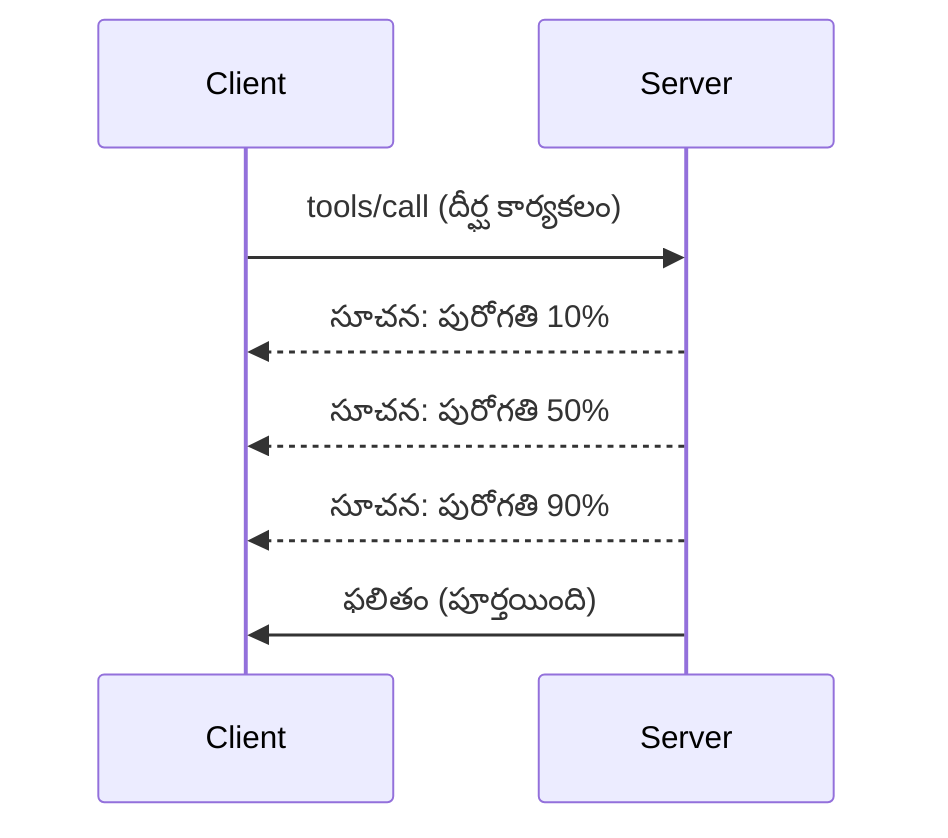

# MCP ప్రోటోకాల ఫీచర్లు లోతైన అవగాహన

ఈ గైడ్ ప్రాథమిక టూల్ మరియు వనరు హేషలింగ్ ముట్టడి వరకు కాకుండా ఉన్న ఉన్నత MCP ప్రోటోకాల లక్షణాలను పరిశీలిస్తుంది. ఈ లక్షణాలను అర్థం చేసుకోవడం మిమ్మల్ని మరింత బలమైన, వినియోగదారులకి అనుకూలమైన, మరియు ఉత్పత్తి-సిద్ధ MCP సర్వర్లను నిర్మించడంలో సహాయపడుతుంది.

## కవర్ చేసిన ఫీచర్లు

1. **ప్రోగ్రెస్ నోటిఫికేషన్లు** - దీర్ఘకాలంగా నడుచుకునే ఆపరేషన్ల కోసం పురోగతిని నివేదించండి
2. **రెక్కెస్ట్ రద్దు** - క్లయింట్లు లోపలున్న రిక్వెస్ట్‌లను రద్దు చేయగలిగేలా చేయండి
3. **రోర్స్ టెంప్లేట్లు** - పారామీటర్లతో డైనమిక్ వనరు URI లు
4. **సర్వర్ జీవచక్ర సంఘటనలు** - సరైన ప్రారంభం మరియు మరణం నిర్వహణ
5. **లాగింగ్ నియంత్రణ** - సర్వర్-పక్క లాగింగ్ అమరిక
6. **లోప నిర్వహణ నమూనాలు** - సక్రమమైన లోప స్పందనలు

---

## 1. ప్రోగ్రెస్ నోటిఫికేషన్లు

సమయాన్ని తీసుకునే ఆపరేషన్ల (డేటా ప్రాసెసింగ్, ఫైల్ డౌన్లోడ్‌లు, API కాల్స్) కొరకు, ప్రోగ్రెస్ నోటిఫికేషన్లు వినియోగదారులను సమాచారంతో ఉంచుతాయి.

### ఇది ఎలా పనిచేస్తుంది


### పైথాన్ అమలు

```python
from mcp.server import Server, NotificationOptions
from mcp.types import ProgressNotification
import asyncio

app = Server("progress-server")

@app.tool()
async def process_large_file(file_path: str, ctx) -> str:
    """Process a large file with progress updates."""
    
    # పురోగతి లెక్కింపు కోసం ఫైల్ పరిమాణాన్ని పొందండి
    file_size = os.path.getsize(file_path)
    processed = 0
    
    with open(file_path, 'rb') as f:
        while chunk := f.read(8192):
            # చంక్‌ను ప్రాసెస్ చేయండి
            await process_chunk(chunk)
            processed += len(chunk)
            
            # పురోగతి सूचना పంపండి
            progress = (processed / file_size) * 100
            await ctx.send_notification(
                ProgressNotification(
                    progressToken=ctx.request_id,
                    progress=progress,
                    total=100,
                    message=f"Processing: {progress:.1f}%"
                )
            )
    
    return f"Processed {file_size} bytes"

@app.tool()
async def batch_operation(items: list[str], ctx) -> str:
    """Process multiple items with progress."""
    
    results = []
    total = len(items)
    
    for i, item in enumerate(items):
        result = await process_item(item)
        results.append(result)
        
        # ప్రతి ఐటం తర్వాత పురోగతిని నివేదించండి
        await ctx.send_notification(
            ProgressNotification(
                progressToken=ctx.request_id,
                progress=i + 1,
                total=total,
                message=f"Processed {i + 1}/{total}: {item}"
            )
        )
    
    return f"Completed {total} items"
```

### టైప్‌స్క్రిప్ట్ అమలు

```typescript
import { Server } from "@modelcontextprotocol/sdk/server/index.js";

server.setRequestHandler(CallToolSchema, async (request, extra) => {
  const { name, arguments: args } = request.params;
  
  if (name === "process_data") {
    const items = args.items as string[];
    const results = [];
    
    for (let i = 0; i < items.length; i++) {
      const result = await processItem(items[i]);
      results.push(result);
      
      // పురోగతి సమాచారం పంపించు
      await extra.sendNotification({
        method: "notifications/progress",
        params: {
          progressToken: request.id,
          progress: i + 1,
          total: items.length,
          message: `Processing item ${i + 1}/${items.length}`
        }
      });
    }
    
    return { content: [{ type: "text", text: JSON.stringify(results) }] };
  }
});
```

### క్లయింట్ హ్యాండ్లింగ్ (పైథాన్)

```python
async def handle_progress(notification):
    """Handle progress notifications from server."""
    params = notification.params
    print(f"Progress: {params.progress}/{params.total} - {params.message}")

# హ్యాండ్లర్‌ను నమోదు చేయండి
session.on_notification("notifications/progress", handle_progress)

# టూల్‌ని కాల్ చేయండి (ప్రగతి నవీకరణలు హ్యాండ్లర్ ద్వారా వస్తాయి)
result = await session.call_tool("process_large_file", {"file_path": "/data/large.csv"})
```

---

## 2. రిక్వెస్ట్ రద్దు

ఇంకా అవసరం లేని లేదా ఎక్కువ సమయం తీసుకుంటున్న రిక్వెస్ట్‌లను క్లయింట్లు రద్దు చేయగలుగుతారు.

### పైథాన్ అమలు

```python
from mcp.server import Server
from mcp.types import CancelledError
import asyncio

app = Server("cancellable-server")

@app.tool()
async def long_running_search(query: str, ctx) -> str:
    """Search that can be cancelled."""
    
    results = []
    
    try:
        for page in range(100):  # అనేక పేజీలను శోధించండి
            # రద్దు అభ్యర్థించినదా అని తనిఖీ చేయండి
            if ctx.is_cancelled:
                raise CancelledError("Search cancelled by user")
            
            # పేజీ శోధనను అనుకరించండి
            page_results = await search_page(query, page)
            results.extend(page_results)
            
            # చిన్న ఆలస్యం రద్దు తనిఖీలను అనుమతిస్తుంది
            await asyncio.sleep(0.1)
            
    except CancelledError:
        # భాగ భాగ ఫలితాలు ఇవ్వండి
        return f"Cancelled. Found {len(results)} results before cancellation."
    
    return f"Found {len(results)} total results"

@app.tool()
async def download_file(url: str, ctx) -> str:
    """Download with cancellation support."""
    
    async with aiohttp.ClientSession() as session:
        async with session.get(url) as response:
            total_size = int(response.headers.get('content-length', 0))
            downloaded = 0
            chunks = []
            
            async for chunk in response.content.iter_chunked(8192):
                if ctx.is_cancelled:
                    return f"Download cancelled at {downloaded}/{total_size} bytes"
                
                chunks.append(chunk)
                downloaded += len(chunk)
            
            return f"Downloaded {downloaded} bytes"
```

### రద్దు సందర్భం అమలు

```python
class CancellableContext:
    """Context object that tracks cancellation state."""
    
    def __init__(self, request_id: str):
        self.request_id = request_id
        self._cancelled = asyncio.Event()
        self._cancel_reason = None
    
    @property
    def is_cancelled(self) -> bool:
        return self._cancelled.is_set()
    
    def cancel(self, reason: str = "Cancelled"):
        self._cancel_reason = reason
        self._cancelled.set()
    
    async def check_cancelled(self):
        """Raise if cancelled, otherwise continue."""
        if self.is_cancelled:
            raise CancelledError(self._cancel_reason)
    
    async def sleep_or_cancel(self, seconds: float):
        """Sleep that can be interrupted by cancellation."""
        try:
            await asyncio.wait_for(
                self._cancelled.wait(),
                timeout=seconds
            )
            raise CancelledError(self._cancel_reason)
        except asyncio.TimeoutError:
            pass  # సాధారణ టైమ్ అవుట్, కొనసాగించండి
```

### క్లయింట్-పక్క రద్దు

```python
import asyncio

async def search_with_timeout(session, query, timeout=30):
    """Search with automatic cancellation on timeout."""
    
    task = asyncio.create_task(
        session.call_tool("long_running_search", {"query": query})
    )
    
    try:
        result = await asyncio.wait_for(task, timeout=timeout)
        return result
    except asyncio.TimeoutError:
        # అభ్యర్థన రద్దు చేయడం
        await session.send_notification({
            "method": "notifications/cancelled",
            "params": {"requestId": task.request_id, "reason": "Timeout"}
        })
        return "Search timed out"
```

---

## 3. వనరు టెంప్లేట్లు

రోర్స్ టెంప్లేట్లు పారామీటర్లతో డైనమిక్ URI నిర్మాణాన్ని అనుమతిస్తాయి, ఇది API లు మరియు డేటాబేస్‌లకు ఉపయోగకరమే.

### టెంప్లేట్లు నిర్వచించడం

```python
from mcp.server import Server
from mcp.types import ResourceTemplate

app = Server("template-server")

@app.list_resource_templates()
async def list_templates() -> list[ResourceTemplate]:
    """Return available resource templates."""
    return [
        ResourceTemplate(
            uriTemplate="db://users/{user_id}",
            name="User Profile",
            description="Fetch user profile by ID",
            mimeType="application/json"
        ),
        ResourceTemplate(
            uriTemplate="api://weather/{city}/{date}",
            name="Weather Data",
            description="Historical weather for city and date",
            mimeType="application/json"
        ),
        ResourceTemplate(
            uriTemplate="file://{path}",
            name="File Content",
            description="Read file at given path",
            mimeType="text/plain"
        )
    ]

@app.read_resource()
async def read_resource(uri: str) -> str:
    """Read resource, expanding template parameters."""
    
    # పారామితులను వెలికితీయడానికి URI ని విభజించండి
    if uri.startswith("db://users/"):
        user_id = uri.split("/")[-1]
        return await fetch_user(user_id)
    
    elif uri.startswith("api://weather/"):
        parts = uri.replace("api://weather/", "").split("/")
        city, date = parts[0], parts[1]
        return await fetch_weather(city, date)
    
    elif uri.startswith("file://"):
        path = uri.replace("file://", "")
        return await read_file(path)
    
    raise ValueError(f"Unknown resource URI: {uri}")
```

### టైప్‌స్క్రిప్ట్ అమలు

```typescript
server.setRequestHandler(ListResourceTemplatesSchema, async () => {
  return {
    resourceTemplates: [
      {
        uriTemplate: "github://repos/{owner}/{repo}/issues/{issue_number}",
        name: "GitHub Issue",
        description: "Fetch a specific GitHub issue",
        mimeType: "application/json"
      },
      {
        uriTemplate: "db://tables/{table}/rows/{id}",
        name: "Database Row",
        description: "Fetch a row from a database table",
        mimeType: "application/json"
      }
    ]
  };
});

server.setRequestHandler(ReadResourceSchema, async (request) => {
  const uri = request.params.uri;
  
  // GitHub ఇష్యూ URIని పార్స్ చేయండి
  const githubMatch = uri.match(/^github:\/\/repos\/([^/]+)\/([^/]+)\/issues\/(\d+)$/);
  if (githubMatch) {
    const [_, owner, repo, issueNumber] = githubMatch;
    const issue = await fetchGitHubIssue(owner, repo, parseInt(issueNumber));
    return {
      contents: [{
        uri,
        mimeType: "application/json",
        text: JSON.stringify(issue, null, 2)
      }]
    };
  }
  
  throw new Error(`Unknown resource URI: ${uri}`);
});
```

---

## 4. సర్వర్ జీవచక్ర సంఘటనలు

సరైన ప్రారంభ మరియు షట్‌డౌన్ నిర్వహణ వనరుల సురక్షితం నిర్వహణను నిర్ధారిస్తుంది.

### పైథాన్ జీవచక్ర నిర్వహణ

```python
from mcp.server import Server
from contextlib import asynccontextmanager

app = Server("lifecycle-server")

# పంచుకున్న స్థితి
db_connection = None
cache = None

@asynccontextmanager
async def lifespan(server: Server):
    """Manage server lifecycle."""
    global db_connection, cache
    
    # స్టార్ట్ అప్
    print("🚀 Server starting...")
    db_connection = await create_database_connection()
    cache = await create_cache_client()
    print("✅ Resources initialized")
    
    yield  # సర్వర్ ఇక్కడ నడుస్తుంది
    
    # షట్ డౌన్
    print("🛑 Server shutting down...")
    await db_connection.close()
    await cache.close()
    print("✅ Resources cleaned up")

app = Server("lifecycle-server", lifespan=lifespan)

@app.tool()
async def query_database(sql: str) -> str:
    """Use the shared database connection."""
    result = await db_connection.execute(sql)
    return str(result)
```

### టైప్‌స్క్రిప్ట్ జీవచక్ర

```typescript
import { Server } from "@modelcontextprotocol/sdk/server/index.js";

class ManagedServer {
  private server: Server;
  private dbConnection: DatabaseConnection | null = null;
  
  constructor() {
    this.server = new Server({
      name: "lifecycle-server",
      version: "1.0.0"
    });
    
    this.setupHandlers();
  }
  
  async start() {
    // వనరులను ప్రారంభించండి
    console.log("🚀 Server starting...");
    this.dbConnection = await createDatabaseConnection();
    console.log("✅ Database connected");
    
    // సర్వర్ ప్రారంభించండి
    await this.server.connect(transport);
  }
  
  async stop() {
    // వనరులను శుభ్రం చేయండి
    console.log("🛑 Server shutting down...");
    if (this.dbConnection) {
      await this.dbConnection.close();
    }
    await this.server.close();
    console.log("✅ Cleanup complete");
  }
  
  private setupHandlers() {
    this.server.setRequestHandler(CallToolSchema, async (request) => {
      // this.dbConnection ను సురక్షితంగా ఉపయోగించండి
      // ...
    });
  }
}

// సౌమ్యంగా షట్‌డౌన్‌తో ఉపయోగం
const server = new ManagedServer();

process.on('SIGINT', async () => {
  await server.stop();
  process.exit(0);
});

await server.start();
```

---

## 5. లాగింగ్ నియంత్రణ

MCP సర్వర్-పక్క లాగింగ్ స్థాయిలను మద్దతు ఇస్తుంది, వీటిని క్లయింట్లు నియంత్రించగలరు.

### లాగింగ్ స్థాయిల అమలు

```python
from mcp.server import Server
from mcp.types import LoggingLevel
import logging

app = Server("logging-server")

# MCP స్థాయిలను Python లాగింగ్ స్థాయిలకు మ్యాప్ చేయండి
LEVEL_MAP = {
    LoggingLevel.DEBUG: logging.DEBUG,
    LoggingLevel.INFO: logging.INFO,
    LoggingLevel.WARNING: logging.WARNING,
    LoggingLevel.ERROR: logging.ERROR,
}

logger = logging.getLogger("mcp-server")

@app.set_logging_level()
async def set_logging_level(level: LoggingLevel) -> None:
    """Handle client request to change logging level."""
    python_level = LEVEL_MAP.get(level, logging.INFO)
    logger.setLevel(python_level)
    logger.info(f"Logging level set to {level}")

@app.tool()
async def debug_operation(data: str) -> str:
    """Tool with various logging levels."""
    logger.debug(f"Processing data: {data}")
    
    try:
        result = process(data)
        logger.info(f"Successfully processed: {result}")
        return result
    except Exception as e:
        logger.error(f"Processing failed: {e}")
        raise
```

### క్లయింట్‌కు లాగ్ సందేశాలను పంపించడం

```python
@app.tool()
async def complex_operation(input: str, ctx) -> str:
    """Operation that logs to client."""
    
    # క్లయింట్‌కు లాగ్ నోటిఫికేషన్ పంపండి
    await ctx.send_log(
        level="info",
        message=f"Starting complex operation with input: {input}"
    )
    
    # పని చేయండి...
    result = await do_work(input)
    
    await ctx.send_log(
        level="debug",
        message=f"Operation complete, result size: {len(result)}"
    )
    
    return result
```

---

## 6. లోప నిర్వహణ నమూనాలు

సక్రమమైన లోప నిర్వహణ డీబగ్గింగ్ మరియు వినియోగదారుల అనుభవం మెరుగుపరుస్తుంది.

### MCP లోప కోడ్స్

```python
from mcp.types import McpError, ErrorCode

class ToolError(McpError):
    """Base class for tool errors."""
    pass

class ValidationError(ToolError):
    """Invalid input parameters."""
    def __init__(self, message: str):
        super().__init__(ErrorCode.INVALID_PARAMS, message)

class NotFoundError(ToolError):
    """Requested resource not found."""
    def __init__(self, resource: str):
        super().__init__(ErrorCode.INVALID_REQUEST, f"Not found: {resource}")

class PermissionError(ToolError):
    """Access denied."""
    def __init__(self, action: str):
        super().__init__(ErrorCode.INVALID_REQUEST, f"Permission denied: {action}")

class InternalError(ToolError):
    """Internal server error."""
    def __init__(self, message: str):
        super().__init__(ErrorCode.INTERNAL_ERROR, message)
```

### నిర్మిత లోప స్పందనలు

```python
@app.tool()
async def safe_operation(input: str) -> str:
    """Tool with comprehensive error handling."""
    
    # ఇన్‌పుట్‌ను ధృవీకరించండి
    if not input:
        raise ValidationError("Input cannot be empty")
    
    if len(input) > 10000:
        raise ValidationError(f"Input too large: {len(input)} chars (max 10000)")
    
    try:
        # అనుమతులు తనిఖీ చేయండి
        if not await check_permission(input):
            raise PermissionError(f"read {input}")
        
        # ఆపరేషన్‌ను నిర్వహించండి
        result = await perform_operation(input)
        
        if result is None:
            raise NotFoundError(input)
        
        return result
        
    except ConnectionError as e:
        raise InternalError(f"Database connection failed: {e}")
    except TimeoutError as e:
        raise InternalError(f"Operation timed out: {e}")
    except Exception as e:
        # అప్రత్యాశిత లోపాలను లాగ్ చేయండి
        logger.exception(f"Unexpected error in safe_operation")
        raise InternalError(f"Unexpected error: {type(e).__name__}")
```

### టైప్‌స్క్రిప్ట్ లో లోప నిర్వహణ

```typescript
import { McpError, ErrorCode } from "@modelcontextprotocol/sdk/types.js";

function validateInput(data: unknown): asserts data is ValidInput {
  if (typeof data !== "object" || data === null) {
    throw new McpError(
      ErrorCode.InvalidParams,
      "Input must be an object"
    );
  }
  // మరింత ధృవీకరణ...
}

server.setRequestHandler(CallToolSchema, async (request) => {
  try {
    validateInput(request.params.arguments);
    
    const result = await performOperation(request.params.arguments);
    
    return {
      content: [{ type: "text", text: JSON.stringify(result) }]
    };
    
  } catch (error) {
    if (error instanceof McpError) {
      throw error;  // ఇప్పటికే MCP లో తప్పు
    }
    
    // ఇతర పొరపాట్లను మార్చండి
    if (error instanceof NotFoundError) {
      throw new McpError(ErrorCode.InvalidRequest, error.message);
    }
    
    // తెలియని పొరపాటు
    console.error("Unexpected error:", error);
    throw new McpError(
      ErrorCode.InternalError,
      "An unexpected error occurred"
    );
  }
});
```

---

## ప్రయోగాత్మక ఫీచర్లు (MCP 2025-11-25)

ఈ ఫీచర్లు స్పెసిఫికేషన్‌లో ప్రయోగాత్మకంగా గుర్తింపు పొందాయి:

### పనులు (దీర్ఘకాల ఆపరేషన్లు)

```python
# టాస్కులు స్థితితో పొడుగు నడిచే కార్యకలాపాలను ట్రాక్ చేయటానికి అనుమతిస్తాయి
@app.task()
async def training_task(model_id: str, data_path: str, ctx) -> str:
    """Long-running ML training task."""
    
    # టాస్క్ ప్రారంభమయింది అని నివేదించండి
    await ctx.report_status("running", "Initializing training...")
    
    # శిక్షణ లూప్
    for epoch in range(100):
        await train_epoch(model_id, data_path, epoch)
        await ctx.report_status(
            "running",
            f"Training epoch {epoch + 1}/100",
            progress=epoch + 1,
            total=100
        )
    
    await ctx.report_status("completed", "Training finished")
    return f"Model {model_id} trained successfully"
```

### టూల్ వ్యాఖ్యానాలు

```python
# annotations టూల్ ప్రవర్తన గురించి మెటాడేటాను అందిస్తాయి
@app.tool(
    annotations={
        "destructive": False,      # డేటాను మార్పు చేయదు
        "idempotent": True,        # మళ్ళీ ప్రయత్నించడంలో సురక్షితం
        "timeout_seconds": 30,     # అంచనా గరిష్ట వ్యవధి
        "requires_approval": False # యూజర్ ఆమోదం అవసరం లేదు
    }
)
async def safe_query(query: str) -> str:
    """A read-only database query tool."""
    return await execute_read_query(query)
```

---

## తదుపరి ఏమిటి

- [Module 8 - Best Practices](../../08-BestPractices/README.md)
- [5.14 - Context Engineering](../mcp-contextengineering/README.md)
- [MCP Specification Changelog](https://spec.modelcontextprotocol.io/)

---

## అదనపు వనరులు

- [MCP Specification 2025-11-25](https://spec.modelcontextprotocol.io/specification/2025-11-25/)
- [JSON-RPC 2.0 Error Codes](https://www.jsonrpc.org/specification#error_object)
- [Python SDK Examples](https://github.com/modelcontextprotocol/python-sdk/tree/main/examples)
- [TypeScript SDK Examples](https://github.com/modelcontextprotocol/typescript-sdk/tree/main/examples)

---

<!-- CO-OP TRANSLATOR DISCLAIMER START -->
**బహిష్కరణ**:  
ఈ డాక్యూమెంట్‌ను AI అనువాద సేవ [Co-op Translator](https://github.com/Azure/co-op-translator) ఉపయోగించి అనువదించబడింది. మేము సరిగ్గా అనువదించడానికి ప్రయత్నించినప్పటికీ, ఆటోమేటెడ్ అనువాదాలలో పొరపాట్లు లేదా అసత్యతలు ఉండే అవకాశం ఉంది. అసలు డాక్యూమెంట్ దాని మాతృభాషలోని ఆధికారిక మూలం గా పరిగణించాలి. ముఖ్యమైన సమాచారం కోసం, 전문 మానవ అనువాదం చేయించుకోవడం మేలుగా ఉంటుంది. ఈ అనువాదం వలన కలిగే ఏవైనా త misunderstandings లేదా తప్పుదొర్లతలకు మేము బాధ్యులేమీ కాదు.
<!-- CO-OP TRANSLATOR DISCLAIMER END -->