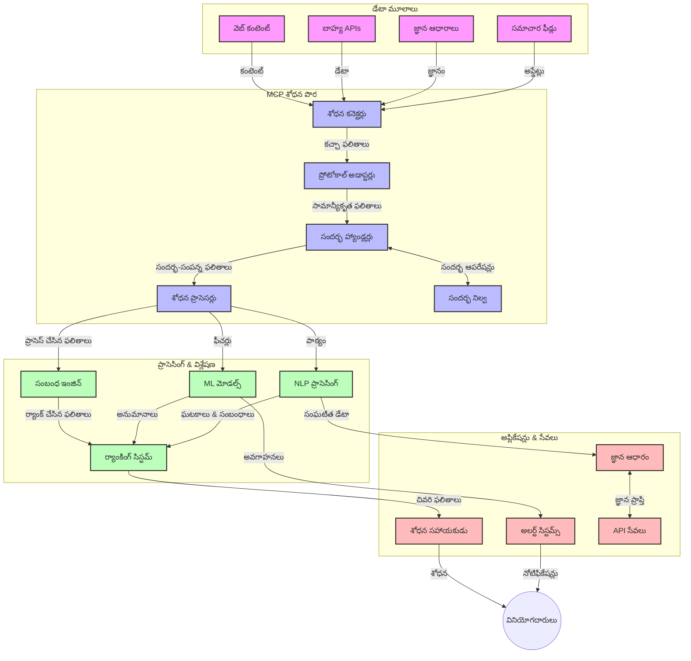

<!--
CO_OP_TRANSLATOR_METADATA:
{
  "original_hash": "333a03e51f90bdf3e6f1ba1694c73f36",
  "translation_date": "2025-12-11T16:04:22+00:00",
  "source_file": "05-AdvancedTopics/mcp-realtimesearch/README.md",
  "language_code": "te"
}
-->
# రియల్-టైమ్ వెబ్ సెర్చ్ కోసం మోడల్ కాంటెక్స్ట్ ప్రోటోకాల్

## అవలోకనం

రియల్-టైమ్ వెబ్ సెర్చ్ ఈ రోజుల్లో సమాచార-ఆధారిత వాతావరణంలో అవసరమైంది, ఇక్కడ అనువర్తనాలు ఇంటర్నెట్ అంతటా తాజా సమాచారానికి తక్షణ ప్రాప్తిని కోరుకుంటాయి, తద్వారా సంబంధిత మరియు సమయోచిత ప్రతిస్పందనలు అందించగలవు. మోడల్ కాంటెక్స్ట్ ప్రోటోకాల్ (MCP) ఈ రియల్-టైమ్ సెర్చ్ ప్రక్రియలను ఆప్టిమైజ్ చేయడంలో ఒక ముఖ్యమైన పురోగతిని సూచిస్తుంది, సెర్చ్ సామర్థ్యాన్ని మెరుగుపరుస్తుంది, కాంటెక్స్ట్ సమగ్రతను నిలుపుతుంది మరియు మొత్తం సిస్టమ్ పనితీరును పెంచుతుంది.

ఈ మాడ్యూల్ MCP ఎలా AI మోడల్స్, సెర్చ్ ఇంజిన్లు మరియు అనువర్తనాల మధ్య కాంటెక్స్ట్ నిర్వహణకు ఒక ప్రమాణీకృత దృష్టికోణాన్ని అందిస్తూ రియల్-టైమ్ వెబ్ సెర్చ్‌ను మార్చుతుందో పరిశీలిస్తుంది.

### మీరు నేర్చుకునేది

ఈ సమగ్ర గైడ్‌లో మీరు తెలుసుకుంటారు:

- MCP ఎలా AI మోడల్స్ మరియు రియల్-టైమ్ వెబ్ సెర్చ్ సామర్థ్యాల మధ్య సజావుగా అనుసంధానం చేస్తుందో
- MCPతో సమర్థవంతమైన మరియు స్కేలబుల్ సెర్చ్ పరిష్కారాలను అమలు చేసే ఆర్కిటెక్చరల్ నమూనాలు
- బహుళ ప్రశ్నలు మరియు పరస్పర చర్యలలో సెర్చ్ కాంటెక్స్ట్‌ను నిలుపుకునే సాంకేతికతలు
- వివిధ సెర్చ్ సందర్భాల కోసం Python మరియు JavaScriptలో ప్రాక్టికల్ కోడ్ అమలు
- MCP ఆధారిత సెర్చ్ సిస్టమ్స్‌లో సంబంధితత, తాజాదనం మరియు పనితీరును సమతుల్యం చేసే విధానాలు

## రియల్-టైమ్ వెబ్ సెర్చ్ పరిచయం

రియల్-టైమ్ వెబ్ సెర్చ్ అనేది ఒక సాంకేతిక విధానం, ఇది వెబ్ ఆధారిత సమాచారాన్ని ప్రచురణ లేదా నవీకరణ సమయంలోనే నిరంతరం ప్రశ్నించడం, ప్రాసెస్ చేయడం మరియు విశ్లేషించడం సాధ్యమవుతుంది, తద్వారా సిస్టమ్స్ తక్కువ ఆలస్యం తో తాజా మరియు సంబంధిత సమాచారాన్ని అందించగలవు. సంప్రదాయ సెర్చ్ సిస్టమ్స్, అవి గంటలు లేదా రోజులు పాతగా ఉండే సూచికాబద్ధ డేటాపై పనిచేస్తాయంటే భిన్నంగా, రియల్-టైమ్ సెర్చ్ వెబ్ నుండి ప్రత్యక్ష డేటాను ప్రాసెస్ చేస్తుంది, ఆన్‌లైన్ కంటెంట్ ప్రస్తుత స్థితిని ప్రతిబింబించే సమాచారాన్ని అందిస్తుంది.

### రియల్-టైమ్ వెబ్ సెర్చ్ యొక్క ప్రధాన భావనలు:

- **నిరంతర ప్రశ్న ప్రాసెసింగ్**: సెర్చ్ ప్రశ్నలు నిరంతరం నవీకరించబడుతున్న డేటా మూలాలపై ప్రాసెస్ చేయబడతాయి
- **తాజాదన ప్రాధాన్యత**: సిస్టమ్స్ తాజా సమాచారాన్ని ప్రాధాన్యం ఇస్తాయి
- **సంబంధితత సమతుల్యం**: సంబంధితత మరియు తాజాదనం మధ్య సమతుల్యాన్ని నిలుపుకోవడం
- **స్కేలబుల్ ఆర్కిటెక్చర్**: వేరియబుల్ ప్రశ్న లోడ్లు మరియు డేటా పరిమాణాలను నిర్వహించగల సిస్టమ్స్
- **కాంటెక్స్చువల్ అండర్‌స్టాండింగ్**: సెర్చ్ పునరావృతాలలో వినియోగదారు కాంటెక్స్ట్‌ను నిలుపుకోవడం అర్థవంతమైన ఫలితాల కోసం కీలకం
- **డైనమిక్ ప్రశ్న పునఃరూపకల్పన**: కాంటెక్స్ట్ మరియు గత ఫలితాల ఆధారంగా ప్రశ్నలను అనుకూలంగా మార్చడం
- **బహుళ మూలాల సమ్మేళనం**: బహుళ సెర్చ్ ప్రొవైడర్లు మరియు వెబ్ మూలాల నుండి ఫలితాలను కలపడం
- **సెమాంటిక్ అండర్‌స్టాండింగ్**: కీవర్డ్స్ కాకుండా అర్థం ఆధారంగా ప్రశ్నలు మరియు కంటెంట్‌ను ప్రాసెస్ చేయడం
- **రియల్-టైమ్ ర్యాంకింగ్**: కొత్త సమాచారం అందుబాటులోకి వచ్చినప్పుడు ఫలితాల ర్యాంకింగ్‌ను నిరంతరం సర్దుబాటు చేయడం

### మోడల్ కాంటెక్స్ట్ ప్రోటోకాల్ మరియు రియల్-టైమ్ వెబ్ సెర్చ్

మోడల్ కాంటెక్స్ట్ ప్రోటోకాల్ (MCP) రియల్-టైమ్ వెబ్ సెర్చ్ వాతావరణాలలో కొన్ని కీలక సవాళ్లను పరిష్కరిస్తుంది:

1. **సెర్చ్ కాంటెక్స్ట్ పరిరక్షణ**: MCP పంపిణీ చేయబడిన సెర్చ్ భాగాల మధ్య కాంటెక్స్ట్ ఎలా నిలుపుకోవాలో ప్రమాణీకృతం చేస్తుంది, తద్వారా AI మోడల్స్ మరియు ప్రాసెసింగ్ నోడ్స్ సంబంధిత ప్రశ్న చరిత్ర మరియు వినియోగదారు ప్రాధాన్యతలకు ప్రాప్తి కలిగి ఉంటాయి.

2. **సమర్థవంతమైన ప్రశ్న నిర్వహణ**: కాంటెక్స్ట్ ప్రసారం కోసం నిర్మితమైన యంత్రాంగాలను అందించడం ద్వారా, MCP ప్రతి సెర్చ్ పునరావృతంలో కాంటెక్స్ట్ పునరావృతం చేసే ఓవర్‌హెడ్‌ను తగ్గిస్తుంది.

3. **ఇంటరొపరబిలిటీ**: MCP విభిన్న సెర్చ్ సాంకేతికతలు మరియు AI మోడల్స్ మధ్య కాంటెక్స్ట్ పంచుకునే సాధారణ భాషను సృష్టిస్తుంది, మరింత అనువైన మరియు విస్తరించదగిన ఆర్కిటెక్చర్లను సాధ్యమవుతుంది.

4. **సెర్చ్-ఆప్టిమైజ్డ్ కాంటెక్స్ట్**: MCP అమలు చేసే విధానాలు సమర్థవంతమైన సెర్చ్ కోసం అత్యంత సంబంధిత కాంటెక్స్ట్ అంశాలను ప్రాధాన్యం ఇస్తాయి, పనితీరు మరియు ఖచ్చితత్వం రెండింటినీ ఆప్టిమైజ్ చేస్తాయి.

5. **అనుకూల సెర్చ్ ప్రాసెసింగ్**: MCP ద్వారా సరైన కాంటెక్స్ట్ నిర్వహణతో, సెర్చ్ సిస్టమ్స్ వినియోగదారు అవసరాలు మరియు సమాచార పరిసరాల ఆధారంగా ప్రాసెసింగ్‌ను డైనమిక్‌గా సర్దుబాటు చేయగలవు.

న్యూస్ అగ్రిగేషన్ నుండి పరిశోధన సహాయకుల వరకు ఆధునిక అనువర్తనాలలో, MCP మరియు వెబ్ సెర్చ్ సాంకేతికతల సమ్మేళనం మరింత తెలివైన, కాంటెక్స్ట్-అవగాహన కలిగిన సెర్చ్‌ను సాధ్యమవుతుంది, ఇది వినియోగదారు పరస్పర చర్యలు కొనసాగుతున్న కొద్దీ మరింత సంబంధిత ఫలితాలను అందిస్తుంది.

## నేర్చుకునే లక్ష్యాలు

ఈ పాఠం ముగింపు నాటికి, మీరు చేయగలుగుతారు:

- ఆధునిక అనువర్తనాలలో రియల్-టైమ్ వెబ్ సెర్చ్ మరియు దాని సవాళ్ల ప్రాథమికాలను అర్థం చేసుకోవడం
- మోడల్ కాంటెక్స్ట్ ప్రోటోకాల్ (MCP) రియల్-టైమ్ వెబ్ సెర్చ్ సామర్థ్యాలను ఎలా మెరుగుపరుస్తుందో వివరించడం
- ప్రాచుర్యం పొందిన ఫ్రేమ్‌వర్క్‌లు మరియు APIలతో MCP ఆధారిత సెర్చ్ పరిష్కారాలను అమలు చేయడం
- MCPతో స్కేలబుల్, అధిక పనితీరు సెర్చ్ ఆర్కిటెక్చర్లను రూపకల్పన మరియు అమలు చేయడం
- సెమాంటిక్ సెర్చ్, పరిశోధన సహాయం, AI-పుష్కల బ్రౌజింగ్ వంటి వివిధ వినియోగాలపై MCP భావనలను వర్తింపజేయడం
- MCP ఆధారిత సెర్చ్ సాంకేతికతలలో అభివృద్ధి చెందుతున్న ధోరణులు మరియు భవిష్యత్తు ఆవిష్కరణలను మూల్యాంకనం చేయడం
- వినియోగదారు పరస్పర చర్యల నుండి నేర్చుకునే కాంటెక్స్ట్-అవగాహన సెర్చ్ సిస్టమ్స్‌ను అభివృద్ధి చేయడం
- ప్రమాణీకృత MCP ప్రోటోకాల్‌లను ఉపయోగించి AI సహాయకులలో వెబ్ సెర్చ్ సామర్థ్యాలను సమ్మిళితం చేయడం
- కాంటెక్స్ట్ ఆధారంగా ఫలితాలను క్రమంగా మెరుగుపరచే బహుళ దశల సెర్చ్ పైప్‌లైన్లను సృష్టించడం
- సమగ్ర కాంటెక్స్ట్ అవగాహనను నిలుపుకుంటూ సెర్చ్ పనితీరును ఆప్టిమైజ్ చేయడం

### నిర్వచనం మరియు ప్రాముఖ్యత

రియల్-టైమ్ వెబ్ సెర్చ్ అనేది తక్కువ ఆలస్యం తో వెబ్ ఆధారిత సమాచారాన్ని నిరంతరం ప్రశ్నించడం, పొందడం మరియు అందించడం. సంప్రదాయ సెర్చ్ ఇంజిన్లు వెబ్‌ను కాలానుగుణంగా క్రాల్ చేసి సూచికాబద్ధం చేస్తే, రియల్-టైమ్ సెర్చ్ అందుబాటులోకి వచ్చిన వెంటనే సమాచారాన్ని ప్రదర్శించడానికి లక్ష్యంగా ఉంటుంది, అత్యంత తాజా కంటెంట్‌కు తక్షణ ప్రాప్తిని సాధిస్తుంది.

రియల్-టైమ్ వెబ్ సెర్చ్ యొక్క ముఖ్య లక్షణాలు:

- **తాజాదనం**: తాజా కంటెంట్ మరియు నవీకరణలకు ప్రాధాన్యం ఇవ్వడం
- **నిరంతర ప్రాసెసింగ్**: కొత్త సమాచారాన్ని నిరంతరం పర్యవేక్షించడం
- **ప్రశ్న అనుకూలీకరణ**: కాంటెక్స్ట్ మరియు ఫీడ్‌బ్యాక్ ఆధారంగా సెర్చ్ ప్రశ్నలను మెరుగుపరచడం
- **తక్షణ డెలివరీ**: తక్కువ ఆలస్యం తో సెర్చ్ ఫలితాలను అందించడం
- **కాంటెక్స్ట్ నిలుపుదల**: మెరుగైన సంబంధితత కోసం గత ప్రశ్నలపై ఆధారపడటం

### సంప్రదాయ వెబ్ సెర్చ్‌లో సవాళ్లు

సంప్రదాయ వెబ్ సెర్చ్ విధానాలు రియల్-టైమ్ సందర్భాలలో అనేక పరిమితులను ఎదుర్కొంటాయి:

1. **కాంటెక్స్ట్ విభజన**: బహుళ ప్రశ్నలలో సెర్చ్ కాంటెక్స్ట్‌ను నిలుపుకోవడంలో కష్టాలు
2. **సమాచార తాజాదనం**: అత్యంత తాజా సమాచారాన్ని ప్రాప్తి మరియు ప్రాధాన్యం ఇవ్వడంలో సవాళ్లు
3. **ఇంటిగ్రేషన్ సంక్లిష్టత**: సెర్చ్ సిస్టమ్స్ మరియు అనువర్తనాల మధ్య ఇంటరొపరబిలిటీ సమస్యలు
4. **ఆలస్యం సమస్యలు**: సమగ్ర సెర్చ్ మరియు ప్రతిస్పందన సమయ అవసరాల మధ్య సమతుల్యం
5. **సంబంధితత ట్యూనింగ్**: తాజాదనను ప్రాధాన్యం ఇస్తూ ఖచ్చితత్వం మరియు సంబంధితతను నిర్ధారించడం

## సెర్చ్ కోసం మోడల్ కాంటెక్స్ట్ ప్రోటోకాల్ (MCP) అర్థం చేసుకోవడం

### సెర్చ్ కాంటెక్స్ట్‌లలో MCP అంటే ఏమిటి?

మోడల్ కాంటెక్స్ట్ ప్రోటోకాల్ (MCP) అనేది AI మోడల్స్ మరియు అనువర్తనాల మధ్య సమర్థవంతమైన పరస్పర చర్యను సులభతరం చేయడానికి రూపొందించిన ప్రమాణీకృత కమ్యూనికేషన్ ప్రోటోకాల్. రియల్-టైమ్ వెబ్ సెర్చ్ సందర్భంలో, MCP ఈ క్రింది వాటికి ఒక ఫ్రేమ్‌వర్క్‌ను అందిస్తుంది:

- ప్రశ్నల సీక్వెన్స్ అంతటా సెర్చ్ కాంటెక్స్ట్‌ను నిలుపుకోవడం
- సెర్చ్ ప్రశ్న మరియు ఫలితాల ఫార్మాట్లను ప్రమాణీకరించడం
- సెర్చ్ పారామీటర్లు మరియు ఫలితాల ప్రసారాన్ని ఆప్టిమైజ్ చేయడం
- మోడల్-టు-సెర్చ్ ఇంజిన్ కమ్యూనికేషన్‌ను మెరుగుపరచడం

### ప్రధాన భాగాలు మరియు ఆర్కిటెక్చర్

రియల్-టైమ్ వెబ్ సెర్చ్ కోసం MCP ఆర్కిటెక్చర్‌లో కొన్ని ముఖ్య భాగాలు ఉంటాయి:

1. **ప్రశ్న కాంటెక్స్ట్ హ్యాండ్లర్లు**: బహుళ ప్రశ్నలలో సెర్చ్ కాంటెక్స్ట్‌ను నిర్వహించడం మరియు నిలుపుకోవడం
2. **సెర్చ్ ప్రాసెసర్లు**: కాంటెక్స్ట్-అవగాహన సాంకేతికతలతో వచ్చే సెర్చ్ అభ్యర్థనలను ప్రాసెస్ చేయడం
3. **ప్రోటోకాల్ అడాప్టర్లు**: వివిధ సెర్చ్ APIల మధ్య మార్పిడి చేయడం, కాంటెక్స్ట్‌ను నిలుపుకుంటూ
4. **కాంటెక్స్ట్ స్టోర్**: సెర్చ్ చరిత్ర మరియు ప్రాధాన్యతలను సమర్థవంతంగా నిల్వ చేయడం మరియు తిరిగి పొందడం
5. **సెర్చ్ కనెక్టర్లు**: వివిధ సెర్చ్ ఇంజిన్లు మరియు వెబ్ APIలకు కనెక్ట్ అవడం

### MCP రియల్-టైమ్ వెబ్ సెర్చ్‌ను ఎలా మెరుగుపరుస్తుంది

MCP సంప్రదాయ వెబ్ సెర్చ్ సవాళ్లను ఈ విధంగా పరిష్కరిస్తుంది:

- **కాంటెక్స్చువల్ కంటిన్యుటీ**: మొత్తం సెర్చ్ సెషన్ అంతటా ప్రశ్నల మధ్య సంబంధాలను నిలుపుకోవడం
- **ఆప్టిమైజ్డ్ ప్రసారం**: తెలివైన కాంటెక్స్ట్ నిర్వహణ ద్వారా సెర్చ్ పారామీటర్లలో పునరావృతతను తగ్గించడం
- **ప్రమాణీకృత ఇంటర్‌ఫేసులు**: సెర్చ్ భాగాల కోసం సुस్పష్టమైన APIలను అందించడం
- **తక్కువ ఆలస్యం**: సమర్థవంతమైన కాంటెక్స్ట్ హ్యాండ్లింగ్ ద్వారా ప్రాసెసింగ్ ఓవర్‌హెడ్‌ను తగ్గించడం
- **మెరుగైన సంబంధితత**: బహుళ ప్రశ్నలలో వినియోగదారు ఉద్దేశ్యాన్ని నిలుపుకోవడం ద్వారా సెర్చ్ సంబంధితతను మెరుగుపరచడం

## సమ్మేళనం మరియు అమలు

రియల్-టైమ్ వెబ్ సెర్చ్ సిస్టమ్స్ పనితీరు మరియు కాంటెక్స్ట్ సమగ్రతను రెండింటినీ నిలుపుకోవడానికి జాగ్రత్తగా ఆర్కిటెక్చరల్ రూపకల్పన మరియు అమలు అవసరం. మోడల్ కాంటెక్స్ట్ ప్రోటోకాల్ AI మోడల్స్ మరియు సెర్చ్ సాంకేతికతలను సమ్మిళితం చేయడానికి ప్రమాణీకృత దృష్టికోణాన్ని అందిస్తుంది, మరింత సున్నితమైన, కాంటెక్స్ట్-అవగాహన కలిగిన సెర్చ్ పైప్‌లైన్లను సాధ్యమవుతుంది.

### సెర్చ్ ఆర్కిటెక్చర్లలో MCP సమ్మేళనం అవలోకనం

రియల్-టైమ్ వెబ్ సెర్చ్ వాతావరణాలలో MCP అమలు చేయడంలో కొన్ని ముఖ్యమైన పాయింట్లు:

1. **సెర్చ్ కాంటెక్స్ట్ సీరియలైజేషన్**: MCP సెర్చ్ అభ్యర్థనలలో కాంటెక్స్చువల్ సమాచారాన్ని ఎంకోడ్ చేయడానికి సమర్థవంతమైన యంత్రాంగాలను అందిస్తుంది, ముఖ్యమైన కాంటెక్స్ట్ ప్రశ్న మొత్తం ప్రాసెసింగ్ పైప్‌లైన్‌లో అనుసరిస్తుందని నిర్ధారిస్తుంది. ఇందులో సెర్చ్-సంబంధిత మెటాడేటాకు ఆప్టిమైజ్ చేసిన ప్రమాణీకృత సీరియలైజేషన్ ఫార్మాట్లు ఉంటాయి.

2. **స్టేట్‌ఫుల్ సెర్చ్ ప్రాసెసింగ్**: MCP సెర్చ్ పునరావృతాలలో సुसంగత కాంటెక్స్ట్ ప్రాతినిధ్యాన్ని నిలుపుకోవడం ద్వారా మరింత తెలివైన స్టేట్‌ఫుల్ ప్రాసెసింగ్‌ను సాధ్యమవుతుంది. ఇది బహుళ దశల సెర్చ్ పైప్‌లైన్లలో ముఖ్యంగా విలువైనది, ఇక్కడ కాంటెక్స్ట్ మెరుగుదల ఫలితాలను మెరుగుపరుస్తుంది.

3. **ప్రశ్న విస్తరణ మరియు మెరుగుదల**: MCP అమలు సెర్చ్ సిస్టమ్స్‌లో సేకరించిన కాంటెక్స్ట్ ఆధారంగా సున్నితమైన ప్రశ్న విస్తరణ మరియు మెరుగుదల సులభతరం చేస్తుంది, సెర్చ్ సెషన్ పురోగమించేటప్పుడు మరింత సంబంధిత ఫలితాలను అందిస్తుంది.

4. **ఫలితాల క్యాచింగ్ మరియు ప్రాధాన్యత**: MCP కాంటెక్స్ట్ నిర్వహణను ప్రమాణీకరించడం ద్వారా ఫలితాల క్యాచింగ్ మరియు ప్రాధాన్యతను నిర్వహించడంలో సహాయపడుతుంది, భాగాలు అభివృద్ధి చెందుతున్న సెర్చ్ కాంటెక్స్ట్ ఆధారంగా అనుకూలంగా మారగలవు.

5. **సెర్చ్ ఫెడరేషన్ మరియు సమ్మేళనం**: MCP కాంటెక్స్ట్ యొక్క నిర్మిత ప్రాతినిధ్యాలను అందించడం ద్వారా బహుళ బ్యాక్‌ఎండ్లలో సెర్చ్‌ను మరింత సున్నితంగా ఫెడరేట్ చేయడానికి సహాయపడుతుంది, వివిధ మూలాల నుండి ఫలితాల అర్థవంతమైన సమ్మేళనాన్ని
ముందుకు చూస్తూ, మేము MCP ఈ క్రింది అంశాలను పరిష్కరించడానికి అభివృద్ధి చెందుతుందని ఆశిస్తున్నాము:

- **బహుముఖ శోధన**: టెక్స్ట్, చిత్రం, ఆడియో, మరియు వీడియో శోధనలను సంరక్షించబడిన సందర్భంతో సమగ్రపరచడం  
- **వికేంద్రీకృత శోధన**: పంపిణీ మరియు ఫెడరేటెడ్ శోధన వ్యవస్థలను మద్దతు ఇవ్వడం  
- **శోధన గోప్యత**: సందర్భ-అవగాహన గోప్యతను కాపాడే శోధన యంత్రాంగాలు  
- **ప్రశ్న అర్థం చేసుకోవడం**: సహజ భాష శోధన ప్రశ్నల లోతైన సారాంశ విశ్లేషణ  

### సాంకేతికతలో సంభావ్య అభివృద్ధులు

MCP శోధన భవిష్యత్తును ఆకారమిచ్చే ఉదయించే సాంకేతికతలు:

1. **న్యూరల్ శోధన నిర్మాణాలు**: MCP కోసం ఆమోదించబడిన ఎంబెడ్డింగ్-ఆధారిత శోధన వ్యవస్థలు  
2. **వ్యక్తిగతీకృత శోధన సందర్భం**: వ్యక్తిగత వినియోగదారుల శోధన నమూనాలను కాలక్రమేణా నేర్చుకోవడం  
3. **జ్ఞాన గ్రాఫ్ సమగ్రత**: డొమైన్-ప్రత్యేక జ్ఞాన గ్రాఫ్‌ల ద్వారా సందర్భాత్మక శోధన మెరుగుదల  
4. **క్రాస్-మోడల్ సందర్భం**: వేర్వేరు శోధన మోడ్‌ల మధ్య సందర్భాన్ని నిలుపుకోవడం  

## ప్రాక్టికల్ వ్యాయామాలు

### వ్యాయామం 1: ప్రాథమిక MCP శోధన పైప్‌లైన్ సెటప్ చేయడం

ఈ వ్యాయామంలో మీరు నేర్చుకుంటారు:  
- ప్రాథమిక MCP శోధన వాతావరణాన్ని కాన్ఫిగర్ చేయడం  
- వెబ్ శోధన కోసం సందర్భ హ్యాండ్లర్లను అమలు చేయడం  
- శోధన పునరావృతాల మధ్య సందర్భ సంరక్షణను పరీక్షించడం మరియు ధృవీకరించడం  

### వ్యాయామం 2: MCP శోధనతో రీసెర్చ్ అసిస్టెంట్ నిర్మించడం

క్రింది లక్షణాలు కలిగిన పూర్తి అప్లికేషన్ సృష్టించండి:  
- సహజ భాష రీసెర్చ్ ప్రశ్నలను ప్రాసెస్ చేయడం  
- సందర్భ-అవగాహన వెబ్ శోధనలను నిర్వహించడం  
- బహుళ మూలాల నుండి సమాచారాన్ని సమ్మిళితం చేయడం  
- సక్రమంగా క్రమబద్ధీకరించిన రీసెర్చ్ ఫలితాలను ప్రదర్శించడం  

### వ్యాయామం 3: MCPతో బహుళ మూల శోధన ఫెడరేషన్ అమలు చేయడం

అధునాతన వ్యాయామం కవర్ చేస్తుంది:  
- బహుళ శోధన ఇంజన్లకు సందర్భ-అవగాహన ప్రశ్న పంపిణీ  
- ఫలితాల ర్యాంకింగ్ మరియు సమ్మేళనం  
- శోధన ఫలితాల సందర్భాత్మక డూప్లికేషన్ తొలగింపు  
- మూల-ప్రత్యేక మెటాడేటా నిర్వహణ  

## అదనపు వనరులు

- [Model Context Protocol Specification](https://spec.modelcontextprotocol.io/) - అధికారిక MCP స్పెసిఫికేషన్ మరియు విస్తృత ప్రోటోకాల్ డాక్యుమెంటేషన్  
- [Model Context Protocol Documentation](https://modelcontextprotocol.io/) - విస్తృత ట్యుటోరియల్స్ మరియు అమలు మార్గదర్శకాలు  
- [MCP Python SDK](https://github.com/modelcontextprotocol/python-sdk) - MCP ప్రోటోకాల్ యొక్క అధికారిక Python అమలు  
- [MCP TypeScript SDK](https://github.com/modelcontextprotocol/typescript-sdk) - MCP ప్రోటోకాల్ యొక్క అధికారిక TypeScript అమలు  
- [MCP Reference Servers](https://github.com/modelcontextprotocol/servers) - MCP సర్వర్ల సూచిక అమలు  
- [Bing Web Search API Documentation](https://learn.microsoft.com/en-us/bing/search-apis/bing-web-search/overview) - మైక్రోసాఫ్ట్ వెబ్ శోధన API  
- [Google Custom Search JSON API](https://developers.google.com/custom-search/v1/overview) - గూగుల్ ప్రోగ్రామబుల్ శోధన ఇంజిన్  
- [SerpAPI Documentation](https://serpapi.com/search-api) - శోధన ఇంజిన్ ఫలితాల పేజీ API  
- [Meilisearch Documentation](https://www.meilisearch.com/docs) - ఓపెన్-సోర్స్ శోధన ఇంజిన్  
- [Elasticsearch Documentation](https://www.elastic.co/guide/index.html) - పంపిణీ శోధన మరియు విశ్లేషణ ఇంజిన్  
- [LangChain Documentation](https://python.langchain.com/docs/get_started/introduction) - LLMలతో అప్లికేషన్లు నిర్మించడం  

## నేర్చుకున్న ఫలితాలు

ఈ మాడ్యూల్ పూర్తి చేసిన తర్వాత, మీరు చేయగలుగుతారు:

- రియల్-టైమ్ వెబ్ శోధన మరియు దాని సవాళ్లను అర్థం చేసుకోవడం  
- Model Context Protocol (MCP) రియల్-టైమ్ వెబ్ శోధన సామర్థ్యాలను ఎలా మెరుగుపరుస్తుందో వివరించడం  
- ప్రాచుర్యం పొందిన ఫ్రేమ్‌వర్క్‌లు మరియు APIలతో MCP ఆధారిత శోధన పరిష్కారాలను అమలు చేయడం  
- MCPతో స్కేలబుల్, అధిక-ప్రదర్శన శోధన నిర్మాణాలను రూపకల్పన మరియు అమలు చేయడం  
- MCP సూత్రాలను వివిధ వినియోగాలపై వర్తింపజేయడం, అందులో సారాంశ శోధన, రీసెర్చ్ సహాయకుడు, మరియు AI-పుష్కల బ్రౌజింగ్ ఉన్నాయి  
- MCP ఆధారిత శోధన సాంకేతికతలలో ఉదయించే ధోరణులు మరియు భవిష్యత్తు ఆవిష్కరణలను మూల్యాంకనం చేయడం  

### నమ్మకం మరియు భద్రతా పరిగణనలు

MCP ఆధారిత వెబ్ శోధన పరిష్కారాలను అమలు చేసే సమయంలో, MCP స్పెసిఫికేషన్ నుండి ఈ ముఖ్యమైన సూత్రాలను గుర్తుంచుకోండి:

1. **వినియోగదారుల అనుమతి మరియు నియంత్రణ**: వినియోగదారులు అన్ని డేటా యాక్సెస్ మరియు ఆపరేషన్లకు స్పష్టంగా అనుమతి ఇవ్వాలి మరియు అవగాహన కలిగి ఉండాలి. ఇది బాహ్య డేటా మూలాలకు యాక్సెస్ చేసే వెబ్ శోధన అమలులకు ముఖ్యమైనది.  

2. **డేటా గోప్యత**: శోధన ప్రశ్నలు మరియు ఫలితాలను సరైన రీతిలో నిర్వహించండి, ముఖ్యంగా అవి సున్నితమైన సమాచారాన్ని కలిగి ఉండవచ్చు. వినియోగదారుల డేటాను రక్షించడానికి సరైన యాక్సెస్ నియంత్రణలను అమలు చేయండి.  

3. **సాధన భద్రత**: శోధన సాధనాలకు సరైన అనుమతి మరియు ధృవీకరణను అమలు చేయండి, ఎందుకంటే అవి యాదృచ్ఛిక కోడ్ అమలుతో భద్రతా ప్రమాదాలను కలిగించవచ్చు. సాధన ప్రవర్తన వివరణలను నమ్మకమైన సర్వర్ నుండి పొందకపోతే అవి నమ్మకంగా పరిగణించకూడదు.  

4. **స్పష్టమైన డాక్యుమెంటేషన్**: మీ MCP ఆధారిత శోధన అమలుకు సంబంధించిన సామర్థ్యాలు, పరిమితులు, మరియు భద్రతా పరిగణనల గురించి స్పష్టమైన డాక్యుమెంటేషన్ అందించండి, MCP స్పెసిఫికేషన్ నుండి అమలు మార్గదర్శకాలను అనుసరించండి.  

5. **దృఢమైన అనుమతి ప్రవాహాలు**: ప్రతి సాధనం ఉపయోగానికి అనుమతి ఇవ్వకముందు అది ఏమి చేస్తుందో స్పష్టంగా వివరించే దృఢమైన అనుమతి మరియు అనుమతుల ప్రవాహాలను నిర్మించండి, ముఖ్యంగా బాహ్య వెబ్ వనరులతో పరస్పర చర్య చేసే సాధనాల కోసం.  

MCP భద్రత మరియు నమ్మకం పరిగణనల పూర్తి వివరాలకు, [అధికారిక డాక్యుమెంటేషన్](https://modelcontextprotocol.io/specification/2025-03-26#security-and-trust-%26-safety) ను చూడండి.  

## తదుపరి ఏమిటి

- [5.12 Entra ID Authentication for Model Context Protocol Servers](../mcp-security-entra/README.md)

---

<!-- CO-OP TRANSLATOR DISCLAIMER START -->
**అస్పష్టత**:  
ఈ పత్రాన్ని AI అనువాద సేవ [Co-op Translator](https://github.com/Azure/co-op-translator) ఉపయోగించి అనువదించబడింది. మేము ఖచ్చితత్వానికి ప్రయత్నించినప్పటికీ, ఆటోమేటెడ్ అనువాదాల్లో పొరపాట్లు లేదా తప్పిదాలు ఉండవచ్చు. మూల పత్రం దాని స్వదేశీ భాషలోనే అధికారిక మూలంగా పరిగణించాలి. ముఖ్యమైన సమాచారానికి, ప్రొఫెషనల్ మానవ అనువాదం చేయించుకోవడం మంచిది. ఈ అనువాదం వలన కలిగే ఏవైనా అపార్థాలు లేదా తప్పుదారుల బాధ్యత మేము తీసుకోము.
<!-- CO-OP TRANSLATOR DISCLAIMER END -->