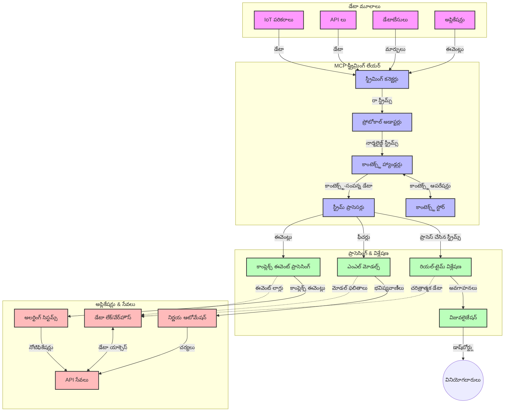

# రియల్-టైమ్ డేటా స్ట్రీమింగ్ కోసం మోడల్ కాంటెక్స్ట్ ప్రోటోకాల్

## అవలోకనం

రియల్-టైమ్ డేటా స్ట్రీమింగ్ ఈ రోజుల్లో డేటా ఆధారిత ప్రపంచంలో అత్యవసరమైనది, ఇక్కడ వ్యాపారాలు మరియు అనువర్తనాలు సమయోచిత నిర్ణయాలు తీసుకోవడానికి తక్షణ సమాచారం అవసరం. మోడల్ కాంటెక్స్ట్ ప్రోటోకాల్ (MCP) ఈ రియల్-టైమ్ స్ట్రీమింగ్ ప్రక్రియలను ఆప్టిమైజ్ చేయడంలో ఒక ముఖ్యమైన పురోగతిని సూచిస్తుంది, డేటా ప్రాసెసింగ్ సామర్థ్యాన్ని మెరుగుపరచడం, సందర్భ సంబంధిత సమగ్రతను నిలుపుకోవడం మరియు మొత్తం సిస్టమ్ పనితీరును మెరుగుపరచడం.

ఈ మాడ్యూల్ MCP ఎలా AI మోడల్స్, స్ట్రీమింగ్ ప్లాట్‌ఫారమ్‌లు మరియు అనువర్తనాల మధ్య సందర్భ నిర్వహణకు ఒక ప్రమాణీకృత దృష్టికోణాన్ని అందిస్తూ రియల్-టైమ్ డేటా స్ట్రీమింగ్‌ను మార్చుతుందో పరిశీలిస్తుంది.

## రియల్-టైమ్ డేటా స్ట్రీమింగ్ పరిచయం

రియల్-టైమ్ డేటా స్ట్రీమింగ్ అనేది ఒక సాంకేతిక పరిపాటీ, ఇది డేటా ఉత్పత్తి అవుతున్న వెంటనే నిరంతరంగా డేటాను బదిలీ చేయడం, ప్రాసెస్ చేయడం మరియు విశ్లేషించడం సాధ్యమవుతుంది, తద్వారా సిస్టమ్‌లు కొత్త సమాచారానికి తక్షణమే స్పందించగలవు. స్థిరమైన డేటాసెట్‌లపై పనిచేసే సాంప్రదాయ బ్యాచ్ ప్రాసెసింగ్‌కు భిన్నంగా, స్ట్రీమింగ్ డేటాను కదలికలో ప్రాసెస్ చేస్తుంది, కనిష్ట ఆలస్యం తో అవగాహన మరియు చర్యలను అందిస్తుంది.

### రియల్-టైమ్ డేటా స్ట్రీమింగ్ యొక్క ప్రాథమిక భావనలు:

- **నిరంతర డేటా ప్రవాహం**: డేటా ఒక నిరంతర, ఎప్పటికీ ముగియని ఈవెంట్స్ లేదా రికార్డుల స్ట్రీమ్‌గా ప్రాసెస్ చేయబడుతుంది.
- **తక్కువ ఆలస్యం ప్రాసెసింగ్**: డేటా ఉత్పత్తి మరియు ప్రాసెసింగ్ మధ్య సమయాన్ని తగ్గించడానికి సిస్టమ్‌లు రూపకల్పన చేయబడ్డాయి.
- **స్కేలబిలిటీ**: స్ట్రీమింగ్ ఆర్కిటెక్చర్లు మార్పు చెందే డేటా పరిమాణాలు మరియు వేగాన్ని నిర్వహించగలవు.
- **ఫాల్ట్ టోలరెన్స్**: డేటా ప్రవాహం నిరవధికంగా ఉండేందుకు సిస్టమ్‌లు వైఫల్యాలకు ప్రతిఘటించగలవు కావాలి.
- **స్టేట్‌ఫుల్ ప్రాసెసింగ్**: ఈవెంట్స్ మధ్య సందర్భాన్ని నిలుపుకోవడం అర్థవంతమైన విశ్లేషణకు కీలకం.

### మోడల్ కాంటెక్స్ట్ ప్రోటోకాల్ మరియు రియల్-టైమ్ స్ట్రీమింగ్

మోడల్ కాంటెక్స్ట్ ప్రోటోకాల్ (MCP) రియల్-టైమ్ స్ట్రీమింగ్ వాతావరణాలలో అనేక ముఖ్యమైన సవాళ్లను పరిష్కరిస్తుంది:

1. **సందర్భ సంబంధిత నిరంతరత్వం**: MCP పంపిణీ చేయబడిన స్ట్రీమింగ్ భాగాల మధ్య సందర్భం ఎలా నిలుపుకోవాలో ప్రమాణీకృతం చేస్తుంది, AI మోడల్స్ మరియు ప్రాసెసింగ్ నోడ్స్‌కు సంబంధిత చారిత్రక మరియు పర్యావరణ సందర్భం అందుబాటులో ఉండేలా చేస్తుంది.

2. **సమర్థవంతమైన స్టేట్ నిర్వహణ**: సందర్భ ప్రసారం కోసం నిర్మితమైన యంత్రాంగాలను అందించడం ద్వారా, MCP స్ట్రీమింగ్ పైప్లైన్లలో స్టేట్ నిర్వహణ ఓవర్‌హెడ్‌ను తగ్గిస్తుంది.

3. **ఇంటరొపరబిలిటీ**: MCP వివిధ స్ట్రీమింగ్ సాంకేతికతలు మరియు AI మోడల్స్ మధ్య సందర్భం పంచుకునే సాధారణ భాషను సృష్టిస్తుంది, మరింత సౌలభ్యమైన మరియు విస్తరించదగిన ఆర్కిటెక్చర్లను సాధ్యమవుతుంది.

4. **స్ట్రీమింగ్-ఆప్టిమైజ్డ్ కాంటెక్స్ట్**: MCP అమలు రియల్-టైమ్ నిర్ణయాల కోసం అత్యంత సంబంధితమైన సందర్భ అంశాలను ప్రాధాన్యం ఇవ్వగలవు, పనితీరు మరియు ఖచ్చితత్వం రెండింటినీ ఆప్టిమైజ్ చేస్తూ.

5. **అడాప్టివ్ ప్రాసెసింగ్**: MCP ద్వారా సరైన సందర్భ నిర్వహణతో, స్ట్రీమింగ్ సిస్టమ్‌లు డేటాలో మారుతున్న పరిస్థితులు మరియు నమూనాల ఆధారంగా ప్రాసెసింగ్‌ను డైనమిక్‌గా సర్దుబాటు చేయగలవు.

ఇంటర్నెట్ ఆఫ్ థింగ్స్ (IoT) సెన్సార్ నెట్‌వర్క్‌ల నుండి ఆర్థిక ట్రేడింగ్ ప్లాట్‌ఫారమ్‌ల వరకు ఆధునిక అనువర్తనాలలో, MCPని స్ట్రీమింగ్ సాంకేతికతలతో సమ్మిళితం చేయడం మరింత తెలివైన, సందర్భ-అవగాహన కలిగిన ప్రాసెసింగ్‌ను సాధ్యమవుతుంది, ఇది రియల్-టైమ్‌లో సంక్లిష్ట, అభివృద్ధి చెందుతున్న పరిస్థితులకు తగిన విధంగా స్పందించగలదు.

## నేర్చుకునే లక్ష్యాలు

ఈ పాఠం ముగిసిన తర్వాత, మీరు చేయగలుగుతారు:

- రియల్-టైమ్ డేటా స్ట్రీమింగ్ మరియు దాని సవాళ్ల ప్రాథమికాలను అర్థం చేసుకోవడం
- మోడల్ కాంటెక్స్ట్ ప్రోటోకాల్ (MCP) రియల్-టైమ్ డేటా స్ట్రీమింగ్‌ను ఎలా మెరుగుపరుస్తుందో వివరించడం
- Kafka మరియు Pulsar వంటి ప్రముఖ ఫ్రేమ్‌వర్క్‌లను ఉపయోగించి MCP ఆధారిత స్ట్రీమింగ్ పరిష్కారాలను అమలు చేయడం
- MCPతో ఫాల్ట్-టోలరెంట్, అధిక పనితీరు స్ట్రీమింగ్ ఆర్కిటెక్చర్లను రూపకల్పన చేసి అమలు చేయడం
- MCP భావనలను IoT, ఆర్థిక ట్రేడింగ్ మరియు AI ఆధారిత విశ్లేషణ ఉపయోగాలపై వర్తింపజేయడం
- MCP ఆధారిత స్ట్రీమింగ్ సాంకేతికతలలో కొత్త ధోరణులు మరియు భవిష్యత్తు ఆవిష్కరణలను మూల్యాంకనం చేయడం

### నిర్వచనం మరియు ప్రాముఖ్యత

రియల్-టైమ్ డేటా స్ట్రీమింగ్ అనేది కనిష్ట ఆలస్యం తో డేటాను నిరంతరం ఉత్పత్తి, ప్రాసెస్ మరియు డెలివరీ చేయడం. బ్యాచ్ ప్రాసెసింగ్‌తో భిన్నంగా, అక్కడ డేటాను సమూహాలుగా సేకరించి ప్రాసెస్ చేస్తారు, స్ట్రీమింగ్ డేటాను వచ్చిన వెంటనే దశలవారీగా ప్రాసెస్ చేస్తారు, తక్షణ అవగాహన మరియు చర్యలను సాధ్యమవుతుంది.

రియల్-టైమ్ డేటా స్ట్రీమింగ్ యొక్క ముఖ్య లక్షణాలు:

- **తక్కువ ఆలస్యం**: మిల్లీసెకన్ల నుండి సెకన్లలో డేటాను ప్రాసెస్ చేసి విశ్లేషించడం
- **నిరంతర ప్రవాహం**: వివిధ మూలాల నుండి నిరవధిక డేటా స్ట్రీమ్స్
- **తక్షణ ప్రాసెసింగ్**: బ్యాచ్‌లలో కాకుండా డేటా వచ్చిన వెంటనే విశ్లేషించడం
- **ఈవెంట్-డ్రివెన్ ఆర్కిటెక్చర్**: ఈవెంట్స్ సంభవించిన వెంటనే స్పందించడం

### సాంప్రదాయ డేటా స్ట్రీమింగ్‌లో సవాళ్లు

సాంప్రదాయ డేటా స్ట్రీమింగ్ విధానాలు కొన్ని పరిమితులను ఎదుర్కొంటున్నాయి:

1. **సందర్భం కోల్పోవడం**: పంపిణీ చేయబడిన సిస్టమ్‌లలో సందర్భాన్ని నిలుపుకోవడంలో కష్టాలు
2. **స్కేలబిలిటీ సమస్యలు**: అధిక పరిమాణం, అధిక వేగం డేటాను నిర్వహించడంలో సవాళ్లు
3. **ఇంటిగ్రేషన్ క్లిష్టత**: వేర్వేరు సిస్టమ్‌ల మధ్య ఇంటరొపరబిలిటీ సమస్యలు
4. **ఆలస్యం నిర్వహణ**: ప్రాసెసింగ్ సమయంతో థ్రూపుట్‌ను సమతుల్యం చేయడం
5. **డేటా సुसంగతత**: స్ట్రీమ్ అంతటా డేటా ఖచ్చితత్వం మరియు సంపూర్ణతను నిర్ధారించడం

## మోడల్ కాంటెక్స్ట్ ప్రోటోకాల్ (MCP) అర్థం చేసుకోవడం

### MCP అంటే ఏమిటి?

మోడల్ కాంటెక్స్ట్ ప్రోటోకాల్ (MCP) అనేది AI మోడల్స్ మరియు అనువర్తనాల మధ్య సమర్థవంతమైన పరస్పర చర్యను సులభతరం చేయడానికి రూపొందించిన ప్రమాణీకృత కమ్యూనికేషన్ ప్రోటోకాల్. రియల్-టైమ్ డేటా స్ట్రీమింగ్ సందర్భంలో, MCP ఈ క్రింది వాటికి ఒక ఫ్రేమ్‌వర్క్‌ను అందిస్తుంది:

- డేటా పైప్లైన్ అంతటా సందర్భాన్ని నిలుపుకోవడం
- డేటా మార్పిడి ఫార్మాట్లను ప్రమాణీకరించడం
- పెద్ద డేటాసెట్‌ల ప్రసారాన్ని ఆప్టిమైజ్ చేయడం
- మోడల్-టు-మోడల్ మరియు మోడల్-టు-అనువర్తనం కమ్యూనికేషన్‌ను మెరుగుపరచడం

### ప్రాథమిక భాగాలు మరియు ఆర్కిటెక్చర్

రియల్-టైమ్ స్ట్రీమింగ్ కోసం MCP ఆర్కిటెక్చర్‌లో కొన్ని ముఖ్య భాగాలు ఉంటాయి:

1. **కాంటెక్స్ట్ హ్యాండ్లర్స్**: స్ట్రీమింగ్ పైప్లైన్ అంతటా సందర్భ సమాచారాన్ని నిర్వహించడం మరియు నిలుపుకోవడం
2. **స్ట్రీమ్ ప్రాసెసర్లు**: సందర్భ-అవగాహన కలిగిన సాంకేతికతలతో వచ్చే డేటా స్ట్రీమ్స్‌ను ప్రాసెస్ చేయడం
3. **ప్రోటోకాల్ అడాప్టర్లు**: వివిధ స్ట్రీమింగ్ ప్రోటోకాల్‌ల మధ్య సందర్భాన్ని నిలుపుకుని మార్పిడి చేయడం
4. **కాంటెక్స్ట్ స్టోర్**: సందర్భ సమాచారాన్ని సమర్థవంతంగా నిల్వ చేసి తిరిగి పొందడం
5. **స్ట్రీమింగ్ కనెక్టర్లు**: వివిధ స్ట్రీమింగ్ ప్లాట్‌ఫారమ్‌లకు (Kafka, Pulsar, Kinesis, మొదలైనవి) కనెక్ట్ అవడం


### MCP రియల్-టైమ్ డేటా హ్యాండ్లింగ్‌ను ఎలా మెరుగుపరుస్తుంది

MCP సాంప్రదాయ స్ట్రీమింగ్ సవాళ్లను ఈ విధంగా పరిష్కరిస్తుంది:

- **సందర్భ సంబంధిత సమగ్రత**: మొత్తం పైప్లైన్ అంతటా డేటా పాయింట్ల మధ్య సంబంధాలను నిలుపుకోవడం
- **ఆప్టిమైజ్డ్ ప్రసారం**: తెలివైన సందర్భ నిర్వహణ ద్వారా డేటా మార్పిడిలో పునరావృతత తగ్గించడం
- **ప్రమాణీకృత ఇంటర్‌ఫేస్‌లు**: స్ట్రీమింగ్ భాగాల కోసం సुसంగత APIs అందించడం
- **తక్కువ ఆలస్యం**: సమర్థవంతమైన సందర్భ నిర్వహణ ద్వారా ప్రాసెసింగ్ ఓవర్‌హెడ్‌ను తగ్గించడం
- **మెరుగైన స్కేలబిలిటీ**: సందర్భాన్ని నిలుపుకుని హారిజాంటల్ స్కేలింగ్‌కు మద్దతు ఇవ్వడం

## సమ్మిళితం మరియు అమలు

రియల్-టైమ్ డేటా స్ట్రీమింగ్ సిస్టమ్‌లు పనితీరు మరియు సందర్భ సంబంధిత సమగ్రత రెండింటినీ నిలుపుకోవడానికి జాగ్రత్తగా ఆర్కిటెక్చర్ రూపకల్పన మరియు అమలు అవసరం. మోడల్ కాంటెక్స్ట్ ప్రోటోకాల్ AI మోడల్స్ మరియు స్ట్రీమింగ్ సాంకేతికతలను సమ్మిళితం చేయడానికి ఒక ప్రమాణీకృత దృష్టికోణాన్ని అందిస్తుంది, మరింత సున్నితమైన, సందర్భ-అవగాహన కలిగిన ప్రాసెసింగ్ పైప్లైన్లను సాధ్యమవుతుంది.

### స్ట్రీమింగ్ ఆర్కిటెక్చర్లలో MCP సమ్మిళితం అవలోకనం

రియల్-టైమ్ స్ట్రీమింగ్ వాతావరణాలలో MCP అమలు చేయడంలో కొన్ని ముఖ్యమైన పాయింట్లు:

1. **సందర్భ సీరియలైజేషన్ మరియు ట్రాన్స్‌పోర్ట్**: MCP స్ట్రీమింగ్ డేటా ప్యాకెట్లలో సందర్భ సమాచారాన్ని ఎంకోడ్ చేయడానికి సమర్థవంతమైన యంత్రాంగాలను అందిస్తుంది, ముఖ్యమైన సందర్భం డేటా ప్రాసెసింగ్ పైప్లైన్ అంతటా అనుసరిస్తుంది. ఇందులో స్ట్రీమింగ్ ట్రాన్స్‌పోర్ట్‌కు ఆప్టిమైజ్ చేసిన ప్రమాణీకృత సీరియలైజేషన్ ఫార్మాట్లు ఉంటాయి.

2. **స్టేట్‌ఫుల్ స్ట్రీమ్ ప్రాసెసింగ్**: MCP ప్రాసెసింగ్ నోడ్స్ అంతటా సुसంగతమైన సందర్భ ప్రాతినిధ్యాన్ని నిలుపుకోవడం ద్వారా మరింత తెలివైన స్టేట్‌ఫుల్ ప్రాసెసింగ్‌ను సాధ్యమవుతుంది. ఇది పంపిణీ చేయబడిన స్ట్రీమింగ్ ఆర్కిటెక్చర్లలో స్టేట్ నిర్వహణ సాంప్రదాయంగా కష్టమైనప్పుడు ముఖ్యంగా విలువైనది.

3. **ఈవెంట్-టైమ్ వర్సెస్ ప్రాసెసింగ్-టైమ్**: స్ట్రీమింగ్ సిస్టమ్‌లలో ఈవెంట్స్ ఎప్పుడు సంభవించాయో మరియు అవి ఎప్పుడు ప్రాసెస్ అవుతున్నాయో మధ్య తేడాను MCP అమలు చేయాల్సి ఉంటుంది. ప్రోటోకాల్ ఈవెంట్ టైమ్ సేమాంటిక్స్‌ను నిలుపుకునే కాలాత్మక సందర్భాన్ని చేర్చవచ్చు.

4. **బ్యాక్‌ప్రెషర్ నిర్వహణ**: సందర్భ నిర్వహణను ప్రమాణీకరించడం ద్వారా, MCP స్ట్రీమింగ్ సిస్టమ్‌లలో బ్యాక్‌ప్రెషర్‌ను నిర్వహించడంలో సహాయపడుతుంది, భాగాలు తమ ప్రాసెసింగ్ సామర్థ్యాలను కమ్యూనికేట్ చేసి ప్రవాహాన్ని సర్దుబాటు చేసుకోవచ్చు.

5. **కాంటెక్స్ట్ విండోయింగ్ మరియు సమాహారం**: MCP కాలాత్మక మరియు సంబంధిత సందర్భాల నిర్మిత ప్రాతినిధ్యాలను అందించడం ద్వారా మరింత సున్నితమైన విండోయింగ్ ఆపరేషన్లను సులభతరం చేస్తుంది, ఈవెంట్ స్ట్రీమ్స్ అంతటా అర్థవంతమైన సమాహారాలను సాధ్యమవుతుంది.

6. **ఖచ్చితంగా-ఒకసారి ప్రాసెసింగ్**: ఖచ్చితంగా-ఒకసారి సేమాంటిక్స్ అవసరమయ్యే స్ట్రీమింగ్ సిస్టమ్‌లలో, MCP ప్రాసెసింగ్ మెటాడేటాను చేర్చవచ్చు, పంపిణీ భాగాల అంతటా ప్రాసెసింగ్ స్థితిని ట్రాక్ చేసి ధృవీకరించడంలో సహాయపడుతుంది.

వివిధ స్ట్రీమింగ్ సాంకేతికతలలో MCP అమలు సందర్భ నిర్వహణకు ఏకీకృత దృష్టికోణాన్ని సృష్టిస్తుంది, కస్టమ్ ఇంటిగ్రేషన్ కోడ్ అవసరాన్ని తగ్గిస్తూ డేటా పైప్లైన్ ద్వారా ప్రవహించే సందర్భాన్ని అర్థవంతంగా నిలుపుకోవడంలో సిస్టమ్ సామర్థ్యాన్ని పెంచుతుంది.

### వివిధ డేటా స్ట్రీమింగ్ ఫ్రేమ్‌వర్క్‌లలో MCP

ఈ ఉదాహరణలు ప్రస్తుత MCP స్పెసిఫికేషన్‌ను అనుసరిస్తాయి, ఇది JSON-RPC ఆధారిత ప్రోటోకాల్ మరియు ప్రత్యేక ట్రాన్స్‌పోర్ట్ యంత్రాంగాలతో ఉంటుంది. కోడ్ Kafka మరియు Pulsar వంటి స్ట్రీమింగ్ ప్లాట్‌ఫారమ్‌లను MCP ప్రోటోకాల్‌తో పూర్తి అనుకూలతతో ఎలా అనుసంధానించవచ్చో చూపిస్తుంది.

ఈ ఉదాహరణలు స్ట్రీమింగ్ ప్లాట్‌ఫారమ్‌లను MCPతో ఎలా సమ్మిళితం చేయవచ్చో, మరియు MCPకి కేంద్రమైన సందర్భ అవగాహనను ఎలా నిలుపుకోవచ్చో చూపించడానికి రూపొందించబడ్డాయి. ఈ దృష్టికోణం జూన్ 2025 నాటికి MCP స్పెసిఫికేషన్ ప్రస్తుత స్థితిని ఖచ్చితంగా ప్రతిబింబిస్తుంది.

MCPని ప్రముఖ స్ట్రీమింగ్ ఫ్రేమ్‌వర్క్‌లతో సమ్మిళితం చేయవచ్చు, వాటిలో:

#### Apache Kafka సమ్మిళితం

```python
import asyncio
import json
from typing import Dict, Any, Optional
from confluent_kafka import Consumer, Producer, KafkaError
from mcp.client import Client, ClientCapabilities
from mcp.core.message import JsonRpcMessage
from mcp.core.transports import Transport

# MCP ని Kafka తో కలపడానికి కస్టమ్ ట్రాన్స్‌పోర్ట్ క్లాస్
class KafkaMCPTransport(Transport):
    def __init__(self, bootstrap_servers: str, input_topic: str, output_topic: str):
        self.bootstrap_servers = bootstrap_servers
        self.input_topic = input_topic
        self.output_topic = output_topic
        self.producer = Producer({'bootstrap.servers': bootstrap_servers})
        self.consumer = Consumer({
            'bootstrap.servers': bootstrap_servers,
            'group.id': 'mcp-client-group',
            'auto.offset.reset': 'earliest'
        })
        self.message_queue = asyncio.Queue()
        self.running = False
        self.consumer_task = None
        
    async def connect(self):
        """Connect to Kafka and start consuming messages"""
        self.consumer.subscribe([self.input_topic])
        self.running = True
        self.consumer_task = asyncio.create_task(self._consume_messages())
        return self
        
    async def _consume_messages(self):
        """Background task to consume messages from Kafka and queue them for processing"""
        while self.running:
            try:
                msg = self.consumer.poll(1.0)
                if msg is None:
                    await asyncio.sleep(0.1)
                    continue
                
                if msg.error():
                    if msg.error().code() == KafkaError._PARTITION_EOF:
                        continue
                    print(f"Consumer error: {msg.error()}")
                    continue
                
                # సందేశ విలువను JSON-RPC గా పార్స్ చేయండి
                try:
                    message_str = msg.value().decode('utf-8')
                    message_data = json.loads(message_str)
                    mcp_message = JsonRpcMessage.from_dict(message_data)
                    await self.message_queue.put(mcp_message)
                except Exception as e:
                    print(f"Error parsing message: {e}")
            except Exception as e:
                print(f"Error in consumer loop: {e}")
                await asyncio.sleep(1)
    
    async def read(self) -> Optional[JsonRpcMessage]:
        """Read the next message from the queue"""
        try:
            message = await self.message_queue.get()
            return message
        except Exception as e:
            print(f"Error reading message: {e}")
            return None
    
    async def write(self, message: JsonRpcMessage) -> None:
        """Write a message to the Kafka output topic"""
        try:
            message_json = json.dumps(message.to_dict())
            self.producer.produce(
                self.output_topic,
                message_json.encode('utf-8'),
                callback=self._delivery_report
            )
            self.producer.poll(0)  # కాల్‌బ్యాక్‌లను ట్రిగ్గర్ చేయండి
        except Exception as e:
            print(f"Error writing message: {e}")
    
    def _delivery_report(self, err, msg):
        """Kafka producer delivery callback"""
        if err is not None:
            print(f'Message delivery failed: {err}')
        else:
            print(f'Message delivered to {msg.topic()} [{msg.partition()}]')
    
    async def close(self) -> None:
        """Close the transport"""
        self.running = False
        if self.consumer_task:
            self.consumer_task.cancel()
            try:
                await self.consumer_task
            except asyncio.CancelledError:
                pass
        self.consumer.close()
        self.producer.flush()

# Kafka MCP ట్రాన్స్‌పోర్ట్ యొక్క ఉదాహరణ ఉపయోగం
async def kafka_mcp_example():
    # Kafka ట్రాన్స్‌పోర్ట్‌తో MCP క్లయింట్ సృష్టించండి
    client = Client(
        {"name": "kafka-mcp-client", "version": "1.0.0"},
        ClientCapabilities({})
    )
    
    # Kafka ట్రాన్స్‌పోర్ట్‌ను సృష్టించి కనెక్ట్ చేయండి
    transport = KafkaMCPTransport(
        bootstrap_servers="localhost:9092",
        input_topic="mcp-responses",
        output_topic="mcp-requests"
    )
    
    await client.connect(transport)
    
    try:
        # MCP సెషన్‌ను ప్రారంభించండి
        await client.initialize()
        
        # MCP ద్వారా టూల్‌ను అమలు చేసే ఉదాహరణ
        response = await client.execute_tool(
            "process_data",
            {
                "data": "sample data",
                "metadata": {
                    "source": "sensor-1",
                    "timestamp": "2025-06-12T10:30:00Z"
                }
            }
        )
        
        print(f"Tool execution response: {response}")
        
        # శుభ్రంగా షట్‌డౌన్ చేయండి
        await client.shutdown()
    finally:
        await transport.close()

# ఉదాహరణను నడపండి
if __name__ == "__main__":
    asyncio.run(kafka_mcp_example())
```

#### Apache Pulsar అమలు

```python
import asyncio
import json
import pulsar
from typing import Dict, Any, Optional
from mcp.core.message import JsonRpcMessage
from mcp.core.transports import Transport
from mcp.server import Server, ServerOptions
from mcp.server.tools import Tool, ToolExecutionContext, ToolMetadata

# పుల్సార్ ఉపయోగించే కస్టమ్ MCP ట్రాన్స్‌పోర్ట్ సృష్టించండి
class PulsarMCPTransport(Transport):
    def __init__(self, service_url: str, request_topic: str, response_topic: str):
        self.service_url = service_url
        self.request_topic = request_topic
        self.response_topic = response_topic
        self.client = pulsar.Client(service_url)
        self.producer = self.client.create_producer(response_topic)
        self.consumer = self.client.subscribe(
            request_topic,
            "mcp-server-subscription",
            consumer_type=pulsar.ConsumerType.Shared
        )
        self.message_queue = asyncio.Queue()
        self.running = False
        self.consumer_task = None
    
    async def connect(self):
        """Connect to Pulsar and start consuming messages"""
        self.running = True
        self.consumer_task = asyncio.create_task(self._consume_messages())
        return self
    
    async def _consume_messages(self):
        """Background task to consume messages from Pulsar and queue them for processing"""
        while self.running:
            try:
                # టైమ్‌ఔట్‌తో నాన్-బ్లాకింగ్ రిసీవ్
                msg = self.consumer.receive(timeout_millis=500)
                
                # సందేశాన్ని ప్రాసెస్ చేయండి
                try:
                    message_str = msg.data().decode('utf-8')
                    message_data = json.loads(message_str)
                    mcp_message = JsonRpcMessage.from_dict(message_data)
                    await self.message_queue.put(mcp_message)
                    
                    # సందేశాన్ని అంగీకరించండి
                    self.consumer.acknowledge(msg)
                except Exception as e:
                    print(f"Error processing message: {e}")
                    # లోపం ఉంటే నెగటివ్ అంగీకారం ఇవ్వండి
                    self.consumer.negative_acknowledge(msg)
            except Exception as e:
                # టైమ్‌ఔట్ లేదా ఇతర తప్పిదాలను నిర్వహించండి
                await asyncio.sleep(0.1)
    
    async def read(self) -> Optional[JsonRpcMessage]:
        """Read the next message from the queue"""
        try:
            message = await self.message_queue.get()
            return message
        except Exception as e:
            print(f"Error reading message: {e}")
            return None
    
    async def write(self, message: JsonRpcMessage) -> None:
        """Write a message to the Pulsar output topic"""
        try:
            message_json = json.dumps(message.to_dict())
            self.producer.send(message_json.encode('utf-8'))
        except Exception as e:
            print(f"Error writing message: {e}")
    
    async def close(self) -> None:
        """Close the transport"""
        self.running = False
        if self.consumer_task:
            self.consumer_task.cancel()
            try:
                await self.consumer_task
            except asyncio.CancelledError:
                pass
        self.consumer.close()
        self.producer.close()
        self.client.close()

# స్ట్రీమింగ్ డేటాను ప్రాసెస్ చేసే నమూనా MCP టూల్ నిర్వచించండి
@Tool(
    name="process_streaming_data",
    description="Process streaming data with context preservation",
    metadata=ToolMetadata(
        required_capabilities=["streaming"]
    )
)
async def process_streaming_data(
    ctx: ToolExecutionContext,
    data: str,
    source: str,
    priority: str = "medium"
) -> Dict[str, Any]:
    """
    Process streaming data while preserving context
    
    Args:
        ctx: Tool execution context
        data: The data to process
        source: The source of the data
        priority: Priority level (low, medium, high)
        
    Returns:
        Dict containing processed results and context information
    """
    # MCP కాంటెక్స్ట్‌ను ఉపయోగించే ఉదాహరణ ప్రాసెసింగ్
    print(f"Processing data from {source} with priority {priority}")
    
    # MCP నుండి సంభాషణ కాంటెక్స్ట్‌ను యాక్సెస్ చేయండి
    conversation_id = ctx.conversation_id if hasattr(ctx, 'conversation_id') else "unknown"
    
    # మెరుగైన కాంటెక్స్ట్‌తో ఫలితాలను తిరిగి ఇవ్వండి
    return {
        "processed_data": f"Processed: {data}",
        "context": {
            "conversation_id": conversation_id,
            "source": source,
            "priority": priority,
            "processing_timestamp": ctx.get_current_time_iso()
        }
    }

# పుల్సార్ ట్రాన్స్‌పోర్ట్ ఉపయోగించి MCP సర్వర్ అమలు ఉదాహరణ
async def run_mcp_server_with_pulsar():
    # MCP సర్వర్ సృష్టించండి
    server = Server(
        {"name": "pulsar-mcp-server", "version": "1.0.0"},
        ServerOptions(
            capabilities={"streaming": True}
        )
    )
    
    # మా టూల్‌ను నమోదు చేయండి
    server.register_tool(process_streaming_data)
    
    # పుల్సార్ ట్రాన్స్‌పోర్ట్ సృష్టించి కనెక్ట్ చేయండి
    transport = PulsarMCPTransport(
        service_url="pulsar://localhost:6650",
        request_topic="mcp-requests",
        response_topic="mcp-responses"
    )
    
    try:
        # పుల్సార్ ట్రాన్స్‌పోర్ట్‌తో సర్వర్ ప్రారంభించండి
        await server.run(transport)
    finally:
        await transport.close()

# సర్వర్‌ను నడపండి
if __name__ == "__main__":
    asyncio.run(run_mcp_server_with_pulsar())
```

### అమలుకు ఉత్తమ పద్ధతులు

రియల్-టైమ్ స్ట్రీమింగ్ కోసం MCP అమలు చేస్తూ:

1. **ఫాల్ట్ టోలరెన్స్ కోసం రూపకల్పన చేయండి**:
   - సరైన లోప నిర్వహణను అమలు చేయండి
   - విఫలమైన సందేశాల కోసం డెడ్-లెటర్ క్యూలను ఉపయోగించండి
   - ఐడంపోటెంట్ ప్రాసెసర్లను రూపకల్పన చేయండి

2. **పనితీరు కోసం ఆప్టిమైజ్ చేయండి**:
   - సరైన బఫర్ పరిమాణాలను కాన్ఫిగర్ చేయండి
   - అవసరమైన చోట బ్యాచింగ్ ఉపయోగించండి
   - బ్యాక్‌ప్రెషర్ యంత్రాంగాలను అమలు చేయండి

3. **మానిటర్ మరియు పరిశీలించండి**:
   - స్ట్రీమ్ ప్రాసెసింగ్ మెట్రిక్స్‌ను ట్రాక్ చేయండి
   - సందర్భ ప్రసారాన్ని పర్యవేక్షించండి
   - అసాధారణత

---

<!-- CO-OP TRANSLATOR DISCLAIMER START -->
**అస్పష్టత**:  
ఈ పత్రాన్ని AI అనువాద సేవ [Co-op Translator](https://github.com/Azure/co-op-translator) ఉపయోగించి అనువదించబడింది. మేము ఖచ్చితత్వానికి ప్రయత్నించినప్పటికీ, ఆటోమేటెడ్ అనువాదాల్లో పొరపాట్లు లేదా తప్పిదాలు ఉండవచ్చు. మూల పత్రం దాని స్వదేశీ భాషలో అధికారిక మూలంగా పరిగణించాలి. ముఖ్యమైన సమాచారానికి, ప్రొఫెషనల్ మానవ అనువాదం సిఫార్సు చేయబడుతుంది. ఈ అనువాదం వాడకంలో ఏర్పడిన ఏవైనా అపార్థాలు లేదా తప్పుదారితీసే అర్థాలు కోసం మేము బాధ్యత వహించము.
<!-- CO-OP TRANSLATOR DISCLAIMER END -->