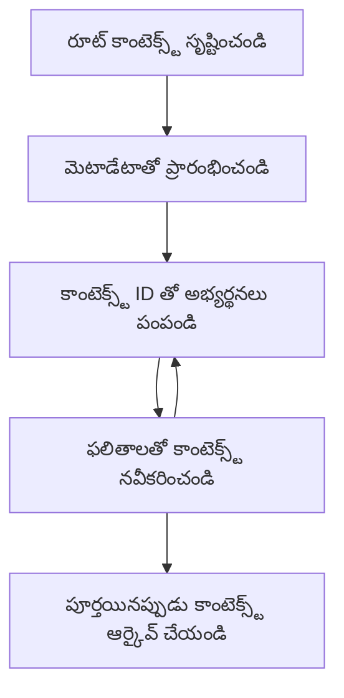

# MCP రూట్ కాంటెక్స్ట్‌లు

రూట్ కాంటెక్స్ట్‌లు మోడల్ కాంటెక్స్ట్ ప్రోటోకాల్‌లో ఒక ప్రాథమిక భావన, ఇవి అనేక అభ్యర్థనలు మరియు సెషన్లలో సంభాషణ చరిత్ర మరియు పంచుకున్న స్థితిని నిలుపుకునేందుకు ఒక స్థిరమైన పొరను అందిస్తాయి.

## పరిచయం

ఈ పాఠంలో, మేము MCPలో రూట్ కాంటెక్స్ట్‌లను ఎలా సృష్టించాలో, నిర్వహించాలో, మరియు ఉపయోగించాలో పరిశీలిస్తాము.

## నేర్చుకునే లక్ష్యాలు

ఈ పాఠం ముగిసిన తర్వాత, మీరు చేయగలుగుతారు:

- రూట్ కాంటెక్స్ట్‌ల ఉద్దేశ్యం మరియు నిర్మాణాన్ని అర్థం చేసుకోవడం
- MCP క్లయింట్ లైబ్రరీలను ఉపయోగించి రూట్ కాంటెక్స్ట్‌లను సృష్టించడం మరియు నిర్వహించడం
- .NET, జావా, జావాస్క్రిప్ట్, మరియు పైథాన్ అప్లికేషన్లలో రూట్ కాంటెక్స్ట్‌లను అమలు చేయడం
- బహుళ-తిరుగుబాటు సంభాషణలు మరియు స్థితి నిర్వహణ కోసం రూట్ కాంటెక్స్ట్‌లను ఉపయోగించడం
- రూట్ కాంటెక్స్ట్ నిర్వహణకు ఉత్తమ పద్ధతులను అమలు చేయడం

## రూట్ కాంటెక్స్ట్‌ల అర్థం చేసుకోవడం

రూట్ కాంటెక్స్ట్‌లు సంబంధిత పరస్పర చర్యల శ్రేణికి చరిత్ర మరియు స్థితిని కలిగి ఉండే కంటైనర్‌లుగా పనిచేస్తాయి. అవి వీటిని సాధ్యమవుతాయి:

- **సంభాషణ స్థిరత్వం**: సुसంపన్నమైన బహుళ-తిరుగుబాటు సంభాషణలను నిర్వహించడం
- **మెమరీ నిర్వహణ**: పరస్పర చర్యల మధ్య సమాచారాన్ని నిల్వ చేయడం మరియు తిరిగి పొందడం
- **స్థితి నిర్వహణ**: సంక్లిష్ట వర్క్‌ఫ్లోలలో పురోగతిని ట్రాక్ చేయడం
- **కాంటెక్స్ట్ పంచుకోవడం**: అనేక క్లయింట్లు ఒకే సంభాషణ స్థితిని యాక్సెస్ చేయగలగడం

MCPలో, రూట్ కాంటెక్స్ట్‌లకు ఈ ముఖ్య లక్షణాలు ఉన్నాయి:

- ప్రతి రూట్ కాంటెక్స్ట్‌కు ఒక ప్రత్యేక గుర్తింపు ఉంటుంది.
- అవి సంభాషణ చరిత్ర, వినియోగదారు ప్రాధాన్యతలు, మరియు ఇతర మెటాడేటాను కలిగి ఉండవచ్చు.
- అవి అవసరమైతే సృష్టించబడవచ్చు, యాక్సెస్ చేయబడవచ్చు, మరియు ఆర్కైవ్ చేయబడవచ్చు.
- అవి సూక్ష్మ-గ్రేడ్ యాక్సెస్ నియంత్రణ మరియు అనుమతులను మద్దతు ఇస్తాయి.

## రూట్ కాంటెక్స్ట్ జీవన చక్రం


## రూట్ కాంటెక్స్ట్‌లతో పని చేయడం

ఇక్కడ రూట్ కాంటెక్స్ట్‌లను ఎలా సృష్టించాలో మరియు నిర్వహించాలో ఒక ఉదాహరణ ఉంది.

### C# అమలు

```csharp
// .NET Example: Root Context Management
using Microsoft.Mcp.Client;
using System;
using System.Threading.Tasks;
using System.Collections.Generic;

public class RootContextExample
{
    private readonly IMcpClient _client;
    private readonly IRootContextManager _contextManager;
    
    public RootContextExample(IMcpClient client, IRootContextManager contextManager)
    {
        _client = client;
        _contextManager = contextManager;
    }
    
    public async Task DemonstrateRootContextAsync()
    {
        // 1. Create a new root context
        var contextResult = await _contextManager.CreateRootContextAsync(new RootContextCreateOptions
        {
            Name = "Customer Support Session",
            Metadata = new Dictionary<string, string>
            {
                ["CustomerName"] = "Acme Corporation",
                ["PriorityLevel"] = "High",
                ["Domain"] = "Cloud Services"
            }
        });
        
        string contextId = contextResult.ContextId;
        Console.WriteLine($"Created root context with ID: {contextId}");
        
        // 2. First interaction using the context
        var response1 = await _client.SendPromptAsync(
            "I'm having issues scaling my web service deployment in the cloud.", 
            new SendPromptOptions { RootContextId = contextId }
        );
        
        Console.WriteLine($"First response: {response1.GeneratedText}");
        
        // Second interaction - the model will have access to the previous conversation
        var response2 = await _client.SendPromptAsync(
            "Yes, we're using containerized deployments with Kubernetes.", 
            new SendPromptOptions { RootContextId = contextId }
        );
        
        Console.WriteLine($"Second response: {response2.GeneratedText}");
        
        // 3. Add metadata to the context based on conversation
        await _contextManager.UpdateContextMetadataAsync(contextId, new Dictionary<string, string>
        {
            ["TechnicalEnvironment"] = "Kubernetes",
            ["IssueType"] = "Scaling"
        });
        
        // 4. Get context information
        var contextInfo = await _contextManager.GetRootContextInfoAsync(contextId);
        
        Console.WriteLine("Context Information:");
        Console.WriteLine($"- Name: {contextInfo.Name}");
        Console.WriteLine($"- Created: {contextInfo.CreatedAt}");
        Console.WriteLine($"- Messages: {contextInfo.MessageCount}");
        
        // 5. When the conversation is complete, archive the context
        await _contextManager.ArchiveRootContextAsync(contextId);
        Console.WriteLine($"Archived context {contextId}");
    }
}
```

ముందటి కోడ్‌లో మేము:

1. కస్టమర్ సపోర్ట్ సెషన్ కోసం ఒక రూట్ కాంటెక్స్ట్ సృష్టించాము.
1. ఆ కాంటెక్స్ట్‌లో అనేక సందేశాలను పంపించి, మోడల్ స్థితిని నిర్వహించడానికి అనుమతించాము.
1. సంభాషణ ఆధారంగా సంబంధిత మెటాడేటాతో కాంటెక్స్ట్‌ను నవీకరించాము.
1. సంభాషణ చరిత్రను అర్థం చేసుకోవడానికి కాంటెక్స్ట్ సమాచారాన్ని పొందాము.
1. సంభాషణ పూర్తయినప్పుడు కాంటెక్స్ట్‌ను ఆర్కైవ్ చేసాము.

## ఉదాహరణ: ఆర్థిక విశ్లేషణ కోసం రూట్ కాంటెక్స్ట్ అమలు

ఈ ఉదాహరణలో, మేము ఆర్థిక విశ్లేషణ సెషన్ కోసం ఒక రూట్ కాంటెక్స్ట్ సృష్టించి, అనేక పరస్పర చర్యలలో స్థితిని ఎలా నిర్వహించాలో చూపిస్తాము.

### జావా అమలు

```java
// జావా ఉదాహరణ: రూట్ కాంటెక్స్ట్ అమలు
package com.example.mcp.contexts;

import com.mcp.client.McpClient;
import com.mcp.client.ContextManager;
import com.mcp.models.RootContext;
import com.mcp.models.McpResponse;

import java.util.HashMap;
import java.util.Map;
import java.util.UUID;

public class RootContextsDemo {
    private final McpClient client;
    private final ContextManager contextManager;
    
    public RootContextsDemo(String serverUrl) {
        this.client = new McpClient.Builder()
            .setServerUrl(serverUrl)
            .build();
            
        this.contextManager = new ContextManager(client);
    }
    
    public void demonstrateRootContext() throws Exception {
        // కాంటెక్స్ట్ మెటాడేటా సృష్టించండి
        Map<String, String> metadata = new HashMap<>();
        metadata.put("projectName", "Financial Analysis");
        metadata.put("userRole", "Financial Analyst");
        metadata.put("dataSource", "Q1 2025 Financial Reports");
        
        // 1. కొత్త రూట్ కాంటెక్స్ట్ సృష్టించండి
        RootContext context = contextManager.createRootContext("Financial Analysis Session", metadata);
        String contextId = context.getId();
        
        System.out.println("Created context: " + contextId);
        
        // 2. మొదటి పరస్పర చర్య
        McpResponse response1 = client.sendPrompt(
            "Analyze the trends in Q1 financial data for our technology division",
            contextId
        );
        
        System.out.println("First response: " + response1.getGeneratedText());
        
        // 3. ప్రతిస్పందన నుండి పొందిన ముఖ్యమైన సమాచారంతో కాంటెక్స్ట్‌ను నవీకరించండి
        contextManager.addContextMetadata(contextId, 
            Map.of("identifiedTrend", "Increasing cloud infrastructure costs"));
        
        // రెండవ పరస్పర చర్య - అదే కాంటెక్స్ట్ ఉపయోగించడం
        McpResponse response2 = client.sendPrompt(
            "What's driving the increase in cloud infrastructure costs?",
            contextId
        );
        
        System.out.println("Second response: " + response2.getGeneratedText());
        
        // 4. విశ్లేషణ సెషన్ యొక్క సారాంశాన్ని రూపొందించండి
        McpResponse summaryResponse = client.sendPrompt(
            "Summarize our analysis of the technology division financials in 3-5 key points",
            contextId
        );
        
        // సారాంశాన్ని కాంటెక్స్ట్ మెటాడేటాలో నిల్వ చేయండి
        contextManager.addContextMetadata(contextId, 
            Map.of("analysisSummary", summaryResponse.getGeneratedText()));
            
        // నవీకరించిన కాంటెక్స్ట్ సమాచారాన్ని పొందండి
        RootContext updatedContext = contextManager.getRootContext(contextId);
        
        System.out.println("Context Information:");
        System.out.println("- Created: " + updatedContext.getCreatedAt());
        System.out.println("- Last Updated: " + updatedContext.getLastUpdatedAt());
        System.out.println("- Analysis Summary: " + 
            updatedContext.getMetadata().get("analysisSummary"));
            
        // 5. పూర్తయినప్పుడు కాంటెక్స్ట్‌ను ఆర్కైవ్ చేయండి
        contextManager.archiveContext(contextId);
        System.out.println("Context archived");
    }
}
```

ముందటి కోడ్‌లో మేము:

1. ఆర్థిక విశ్లేషణ సెషన్ కోసం ఒక రూట్ కాంటెక్స్ట్ సృష్టించాము.
2. ఆ కాంటెక్స్ట్‌లో అనేక సందేశాలను పంపించి, మోడల్ స్థితిని నిర్వహించడానికి అనుమతించాము.
3. సంభాషణ ఆధారంగా సంబంధిత మెటాడేటాతో కాంటెక్స్ట్‌ను నవీకరించాము.
4. విశ్లేషణ సెషన్ యొక్క సారాంశాన్ని రూపొందించి, దాన్ని కాంటెక్స్ట్ మెటాడేటాలో నిల్వ చేసాము.
5. సంభాషణ పూర్తయినప్పుడు కాంటెక్స్ట్‌ను ఆర్కైవ్ చేసాము.

## ఉదాహరణ: రూట్ కాంటెక్స్ట్ నిర్వహణ

సంభాషణ చరిత్ర మరియు స్థితిని నిర్వహించడానికి రూట్ కాంటెక్స్ట్‌లను సమర్థవంతంగా నిర్వహించడం చాలా ముఖ్యం. క్రింద రూట్ కాంటెక్స్ట్ నిర్వహణను ఎలా అమలు చేయాలో ఒక ఉదాహరణ ఉంది.

### జావాస్క్రిప్ట్ అమలు

```javascript
// జావాస్క్రిప్ట్ ఉదాహరణ: MCP రూట్ కాంటెక్స్ట్‌లను నిర్వహించడం
const { McpClient, RootContextManager } = require('@mcp/client');

class ContextSession {
  constructor(serverUrl, apiKey = null) {
    // MCP క్లయింట్‌ను ప్రారంభించండి
    this.client = new McpClient({
      serverUrl,
      apiKey
    });
    
    // కాంటెక్స్ట్ మేనేజర్‌ను ప్రారంభించండి
    this.contextManager = new RootContextManager(this.client);
  }
  
  /**
   * Create a new conversation context
   * @param {string} sessionName - Name of the conversation session
   * @param {Object} metadata - Additional metadata for the context
   * @returns {Promise<string>} - Context ID
   */
  async createConversationContext(sessionName, metadata = {}) {
    try {
      const contextResult = await this.contextManager.createRootContext({
        name: sessionName,
        metadata: {
          ...metadata,
          createdAt: new Date().toISOString(),
          status: 'active'
        }
      });
      
      console.log(`Created root context '${sessionName}' with ID: ${contextResult.id}`);
      return contextResult.id;
    } catch (error) {
      console.error('Error creating root context:', error);
      throw error;
    }
  }
  
  /**
   * Send a message in an existing context
   * @param {string} contextId - The root context ID
   * @param {string} message - The user's message
   * @param {Object} options - Additional options
   * @returns {Promise<Object>} - Response data
   */
  async sendMessage(contextId, message, options = {}) {
    try {
      // నిర్దిష్ట కాంటెక్స్ట్ ఉపయోగించి సందేశాన్ని పంపండి
      const response = await this.client.sendPrompt(message, {
        rootContextId: contextId,
        temperature: options.temperature || 0.7,
        allowedTools: options.allowedTools || []
      });
      
      // సంభాషణ నుండి ముఖ్యమైన అవగాహనలను ఐచ్ఛికంగా నిల్వ చేయండి
      if (options.storeInsights) {
        await this.storeConversationInsights(contextId, message, response.generatedText);
      }
      
      return {
        message: response.generatedText,
        toolCalls: response.toolCalls || [],
        contextId
      };
    } catch (error) {
      console.error(`Error sending message in context ${contextId}:`, error);
      throw error;
    }
  }
  
  /**
   * Store important insights from a conversation
   * @param {string} contextId - The root context ID
   * @param {string} userMessage - User's message
   * @param {string} aiResponse - AI's response
   */
  async storeConversationInsights(contextId, userMessage, aiResponse) {
    try {
      // సంభావ్య అవగాహనలను తీసుకోండి (నిజమైన యాప్‌లో ఇది మరింత సున్నితంగా ఉంటుంది)
      const combinedText = userMessage + "\n" + aiResponse;
      
      // సంభావ్య అవగాహనలను గుర్తించడానికి సాదా నియమం
      const insightWords = ["important", "key point", "remember", "significant", "crucial"];
      
      const potentialInsights = combinedText
        .split(".")
        .filter(sentence => 
          insightWords.some(word => sentence.toLowerCase().includes(word))
        )
        .map(sentence => sentence.trim())
        .filter(sentence => sentence.length > 10);
      
      // అవగాహనలను కాంటెక్స్ట్ మెటాడేటాలో నిల్వ చేయండి
      if (potentialInsights.length > 0) {
        const insights = {};
        potentialInsights.forEach((insight, index) => {
          insights[`insight_${Date.now()}_${index}`] = insight;
        });
        
        await this.contextManager.updateContextMetadata(contextId, insights);
        console.log(`Stored ${potentialInsights.length} insights in context ${contextId}`);
      }
    } catch (error) {
      console.warn('Error storing conversation insights:', error);
      // అత్యవసరమైన తప్పిదం కాదు, కాబట్టి కేవలం హెచ్చరికను లాగ్ చేయండి
    }
  }
  
  /**
   * Get summary information about a context
   * @param {string} contextId - The root context ID
   * @returns {Promise<Object>} - Context information
   */
  async getContextInfo(contextId) {
    try {
      const contextInfo = await this.contextManager.getContextInfo(contextId);
      
      return {
        id: contextInfo.id,
        name: contextInfo.name,
        created: new Date(contextInfo.createdAt).toLocaleString(),
        lastUpdated: new Date(contextInfo.lastUpdatedAt).toLocaleString(),
        messageCount: contextInfo.messageCount,
        metadata: contextInfo.metadata,
        status: contextInfo.status
      };
    } catch (error) {
      console.error(`Error getting context info for ${contextId}:`, error);
      throw error;
    }
  }
  
  /**
   * Generate a summary of the conversation in a context
   * @param {string} contextId - The root context ID
   * @returns {Promise<string>} - Generated summary
   */
  async generateContextSummary(contextId) {
    try {
      // ఇప్పటి వరకు సంభాషణ యొక్క సారాంశాన్ని రూపొందించమని మోడల్‌ను అడగండి
      const response = await this.client.sendPrompt(
        "Please summarize our conversation so far in 3-4 sentences, highlighting the main points discussed.",
        { rootContextId: contextId, temperature: 0.3 }
      );
      
      // సారాంశాన్ని కాంటెక్స్ట్ మెటాడేటాలో నిల్వ చేయండి
      await this.contextManager.updateContextMetadata(contextId, {
        conversationSummary: response.generatedText,
        summarizedAt: new Date().toISOString()
      });
      
      return response.generatedText;
    } catch (error) {
      console.error(`Error generating context summary for ${contextId}:`, error);
      throw error;
    }
  }
  
  /**
   * Archive a context when it's no longer needed
   * @param {string} contextId - The root context ID
   * @returns {Promise<Object>} - Result of the archive operation
   */
  async archiveContext(contextId) {
    try {
      // ఆర్కైవ్ చేయడానికి ముందు తుది సారాంశాన్ని రూపొందించండి
      const summary = await this.generateContextSummary(contextId);
      
      // కాంటెక్స్ట్‌ను ఆర్కైవ్ చేయండి
      await this.contextManager.archiveContext(contextId);
      
      return {
        status: "archived",
        contextId,
        summary
      };
    } catch (error) {
      console.error(`Error archiving context ${contextId}:`, error);
      throw error;
    }
  }
}

// ఉదాహరణ ఉపయోగం
async function demonstrateContextSession() {
  const session = new ContextSession('https://mcp-server-example.com');
  
  try {
    // 1. ఉత్పత్తి మద్దతు సంభాషణ కోసం కొత్త కాంటెక్స్ట్ సృష్టించండి
    const contextId = await session.createConversationContext(
      'Product Support - Database Performance',
      {
        customer: 'Globex Corporation',
        product: 'Enterprise Database',
        severity: 'Medium',
        supportAgent: 'AI Assistant'
      }
    );
    
    // 2. సంభాషణలో మొదటి సందేశం
    const response1 = await session.sendMessage(
      contextId,
      "I'm experiencing slow query performance on our database cluster after the latest update.",
      { storeInsights: true }
    );
    console.log('Response 1:', response1.message);
    
    // అదే కాంటెక్స్ట్‌లో అనుసరణ సందేశం
    const response2 = await session.sendMessage(
      contextId,
      "Yes, we've already checked the indexes and they seem to be properly configured.",
      { storeInsights: true }
    );
    console.log('Response 2:', response2.message);
    
    // 3. కాంటెక్స్ట్ గురించి సమాచారం పొందండి
    const contextInfo = await session.getContextInfo(contextId);
    console.log('Context Information:', contextInfo);
    
    // 4. సంభాషణ సారాంశాన్ని రూపొందించి ప్రదర్శించండి
    const summary = await session.generateContextSummary(contextId);
    console.log('Conversation Summary:', summary);
    
    // 5. పూర్తయిన తర్వాత కాంటెక్స్ట్‌ను ఆర్కైవ్ చేయండి
    const archiveResult = await session.archiveContext(contextId);
    console.log('Archive Result:', archiveResult);
    
    // 6. ఏదైనా తప్పిదాలను సున్నితంగా నిర్వహించండి
  } catch (error) {
    console.error('Error in context session demonstration:', error);
  }
}

demonstrateContextSession();
```

ముందటి కోడ్‌లో మేము:

1. `createConversationContext` ఫంక్షన్‌తో ఒక ఉత్పత్తి సపోర్ట్ సంభాషణ కోసం రూట్ కాంటెక్స్ట్ సృష్టించాము. ఈ సందర్భంలో, కాంటెక్స్ట్ డేటాబేస్ పనితీరు సమస్యల గురించి ఉంది.

1. ఆ కాంటెక్స్ట్‌లో అనేక సందేశాలను `sendMessage` ఫంక్షన్‌తో పంపించి, మోడల్ స్థితిని నిర్వహించడానికి అనుమతించాము. పంపిన సందేశాలు నెమ్మదిగా క్వెరీ పనితీరు మరియు సూచిక కాన్ఫిగరేషన్ గురించి ఉన్నాయి.

1. సంభాషణ ఆధారంగా సంబంధిత మెటాడేటాతో కాంటెక్స్ట్‌ను నవీకరించాము.

1. `generateContextSummary` ఫంక్షన్‌తో సంభాషణ సారాంశాన్ని రూపొందించి, దాన్ని కాంటెక్స్ట్ మెటాడేటాలో నిల్వ చేసాము.

1. సంభాషణ పూర్తయినప్పుడు `archiveContext` ఫంక్షన్‌తో కాంటెక్స్ట్‌ను ఆర్కైవ్ చేసాము.

1. దృఢత్వాన్ని నిర్ధారించడానికి లోపాలను సున్నితంగా నిర్వహించాము.

## బహుళ-తిరుగుబాటు సహాయానికి రూట్ కాంటెక్స్ట్

ఈ ఉదాహరణలో, మేము బహుళ-తిరుగుబాటు సహాయ సెషన్ కోసం ఒక రూట్ కాంటెక్స్ట్ సృష్టించి, అనేక పరస్పర చర్యలలో స్థితిని ఎలా నిర్వహించాలో చూపిస్తాము.

### పైథాన్ అమలు

```python
# Python ఉదాహరణ: బహుళ-తిరుగుడు సహాయానికి రూట్ కాంటెక్స్ట్
import asyncio
from datetime import datetime
from mcp_client import McpClient, RootContextManager

class AssistantSession:
    def __init__(self, server_url, api_key=None):
        self.client = McpClient(server_url=server_url, api_key=api_key)
        self.context_manager = RootContextManager(self.client)
    
    async def create_session(self, name, user_info=None):
        """Create a new root context for an assistant session"""
        metadata = {
            "session_type": "assistant",
            "created_at": datetime.now().isoformat(),
        }
        
        # అందించినట్లయితే వినియోగదారు సమాచారాన్ని జోడించండి
        if user_info:
            metadata.update({f"user_{k}": v for k, v in user_info.items()})
            
        # రూట్ కాంటెక్స్ట్ సృష్టించండి
        context = await self.context_manager.create_root_context(name, metadata)
        return context.id
    
    async def send_message(self, context_id, message, tools=None):
        """Send a message within a root context"""
        # కాంటెక్స్ట్ ID తో ఎంపికలను సృష్టించండి
        options = {
            "root_context_id": context_id
        }
        
        # పేర్కొన్నట్లయితే టూల్స్ జోడించండి
        if tools:
            options["allowed_tools"] = tools
        
        # కాంటెక్స్ట్ లో ప్రాంప్ట్ పంపండి
        response = await self.client.send_prompt(message, options)
        
        # సంభాషణ పురోగతితో కాంటెక్స్ట్ మెటాడేటాను నవీకరించండి
        await self.context_manager.update_context_metadata(
            context_id,
            {
                f"message_{datetime.now().timestamp()}": message[:50] + "...",
                "last_interaction": datetime.now().isoformat()
            }
        )
        
        return response
    
    async def get_conversation_history(self, context_id):
        """Retrieve conversation history from a context"""
        context_info = await self.context_manager.get_context_info(context_id)
        messages = await self.client.get_context_messages(context_id)
        
        return {
            "context_info": context_info,
            "messages": messages
        }
    
    async def end_session(self, context_id):
        """End an assistant session by archiving the context"""
        # మొదట సారాంశ ప్రాంప్ట్ రూపొందించండి
        summary_response = await self.client.send_prompt(
            "Please summarize our conversation and any key points or decisions made.",
            {"root_context_id": context_id}
        )
        
        # మెటాడేటాలో సారాంశాన్ని నిల్వ చేయండి
        await self.context_manager.update_context_metadata(
            context_id,
            {
                "summary": summary_response.generated_text,
                "ended_at": datetime.now().isoformat(),
                "status": "completed"
            }
        )
        
        # కాంటెక్స్ట్ ను ఆర్కైవ్ చేయండి
        await self.context_manager.archive_context(context_id)
        
        return {
            "status": "completed",
            "summary": summary_response.generated_text
        }

# ఉదాహరణ ఉపయోగం
async def demo_assistant_session():
    assistant = AssistantSession("https://mcp-server-example.com")
    
    # 1. సెషన్ సృష్టించండి
    context_id = await assistant.create_session(
        "Technical Support Session",
        {"name": "Alex", "technical_level": "advanced", "product": "Cloud Services"}
    )
    print(f"Created session with context ID: {context_id}")
    
    # 2. మొదటి పరస్పర చర్య
    response1 = await assistant.send_message(
        context_id, 
        "I'm having trouble with the auto-scaling feature in your cloud platform.",
        ["documentation_search", "diagnostic_tool"]
    )
    print(f"Response 1: {response1.generated_text}")
    
    # అదే కాంటెక్స్ట్ లో రెండవ పరస్పర చర్య
    response2 = await assistant.send_message(
        context_id,
        "Yes, I've already checked the configuration settings you mentioned, but it's still not working."
    )
    print(f"Response 2: {response2.generated_text}")
    
    # 3. చరిత్ర పొందండి
    history = await assistant.get_conversation_history(context_id)
    print(f"Session has {len(history['messages'])} messages")
    
    # 4. సెషన్ ముగించండి
    end_result = await assistant.end_session(context_id)
    print(f"Session ended with summary: {end_result['summary']}")

if __name__ == "__main__":
    asyncio.run(demo_assistant_session())
```

ముందటి కోడ్‌లో మేము:

1. `create_session` ఫంక్షన్‌తో ఒక సాంకేతిక సపోర్ట్ సెషన్ కోసం రూట్ కాంటెక్స్ట్ సృష్టించాము. కాంటెక్స్ట్‌లో పేరు మరియు సాంకేతిక స్థాయి వంటి వినియోగదారు సమాచారం ఉంది.

1. ఆ కాంటెక్స్ట్‌లో అనేక సందేశాలను `send_message` ఫంక్షన్‌తో పంపించి, మోడల్ స్థితిని నిర్వహించడానికి అనుమతించాము. పంపిన సందేశాలు ఆటో-స్కేలింగ్ ఫీచర్ సమస్యల గురించి ఉన్నాయి.

1. `get_conversation_history` ఫంక్షన్ ఉపయోగించి సంభాషణ చరిత్రను పొందాము, ఇది కాంటెక్స్ట్ సమాచారం మరియు సందేశాలను అందిస్తుంది.

1. `end_session` ఫంక్షన్‌తో కాంటెక్స్ట్‌ను ఆర్కైవ్ చేసి, సారాంశాన్ని రూపొందించి సెషన్‌ను ముగించాము. సారాంశం సంభాషణ నుండి ముఖ్యమైన అంశాలను పట్టుకుంటుంది.

## రూట్ కాంటెక్స్ట్ ఉత్తమ పద్ధతులు

రూట్ కాంటెక్స్ట్‌లను సమర్థవంతంగా నిర్వహించడానికి కొన్ని ఉత్తమ పద్ధతులు:

- **కేంద్రీకృత కాంటెక్స్ట్‌లను సృష్టించండి**: వివిధ సంభాషణ ఉద్దేశాలు లేదా డొమైన్‌ల కోసం వేర్వేరు రూట్ కాంటెక్స్ట్‌లను సృష్టించి స్పష్టతను నిలుపుకోండి.

- **కాలపరిమితి విధానాలను అమలు చేయండి**: నిల్వను నిర్వహించడానికి మరియు డేటా నిల్వ విధానాలకు అనుగుణంగా పాత కాంటెక్స్ట్‌లను ఆర్కైవ్ లేదా తొలగించే విధానాలను అమలు చేయండి.

- **సంబంధిత మెటాడేటాను నిల్వ చేయండి**: సంభాషణ గురించి తరువాత ఉపయోగపడే ముఖ్యమైన సమాచారాన్ని నిల్వ చేయడానికి కాంటెక్స్ట్ మెటాడేటాను ఉపయోగించండి.

- **కాంటెక్స్ట్ IDలను సక్రమంగా ఉపయోగించండి**: ఒకసారి కాంటెక్స్ట్ సృష్టించిన తర్వాత, అన్ని సంబంధిత అభ్యర్థనలకు దాని IDని సక్రమంగా ఉపయోగించి నిరంతరత్వాన్ని నిలుపుకోండి.

- **సారాంశాలను రూపొందించండి**: కాంటెక్స్ట్ పెద్దదిగా పెరిగినప్పుడు, ముఖ్యమైన సమాచారాన్ని పట్టుకోవడానికి సారాంశాలను రూపొందించడం పరిగణించండి.

- **యాక్సెస్ నియంత్రణను అమలు చేయండి**: బహుళ-వినియోగదారు వ్యవస్థల కోసం, సంభాషణ కాంటెక్స్ట్‌ల గోప్యత మరియు భద్రతను నిర్ధారించడానికి సరైన యాక్సెస్ నియంత్రణలను అమలు చేయండి.

- **కాంటెక్స్ట్ పరిమితులను నిర్వహించండి**: కాంటెక్స్ట్ పరిమాణ పరిమితులను తెలుసుకుని, చాలా పొడవైన సంభాషణలను నిర్వహించడానికి వ్యూహాలను అమలు చేయండి.

- **పూర్తయినప్పుడు ఆర్కైవ్ చేయండి**: సంభాషణలు పూర్తయినప్పుడు కాంటెక్స్ట్‌లను ఆర్కైవ్ చేసి, వనరులను విడుదల చేయండి మరియు సంభాషణ చరిత్రను నిలుపుకోండి.

## తదుపరి ఏమిటి

- [5.5 Routing](../mcp-routing/README.md)

---

<!-- CO-OP TRANSLATOR DISCLAIMER START -->
**అస్పష్టత**:  
ఈ పత్రాన్ని AI అనువాద సేవ [Co-op Translator](https://github.com/Azure/co-op-translator) ఉపయోగించి అనువదించబడింది. మేము ఖచ్చితత్వానికి ప్రయత్నించినప్పటికీ, ఆటోమేటెడ్ అనువాదాల్లో పొరపాట్లు లేదా తప్పిదాలు ఉండవచ్చు. మూల పత్రం దాని స్వదేశీ భాషలో అధికారిక మూలంగా పరిగణించాలి. ముఖ్యమైన సమాచారానికి, ప్రొఫెషనల్ మానవ అనువాదం సిఫార్సు చేయబడుతుంది. ఈ అనువాదం వాడకంలో ఏర్పడిన ఏవైనా అపార్థాలు లేదా తప్పుదారులు కోసం మేము బాధ్యత వహించము.
<!-- CO-OP TRANSLATOR DISCLAIMER END -->