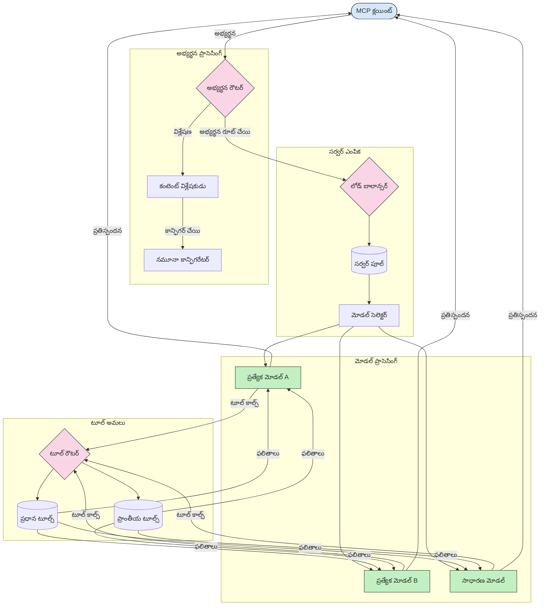

<!--
CO_OP_TRANSLATOR_METADATA:
{
  "original_hash": "2f1b473818b5a6cc9a9bbf777fffa6d4",
  "translation_date": "2025-12-11T16:28:40+00:00",
  "source_file": "05-AdvancedTopics/mcp-routing/README.md",
  "language_code": "te"
}
-->
# మోడల్ కాంటెక్స్ట్ ప్రోటోకాల్‌లో రౌటింగ్

రౌటింగ్ అనేది MCP ఎకోసిస్టమ్‌లో సరైన మోడల్స్, టూల్స్ లేదా సర్వీసులకు అభ్యర్థనలను దారితీయడానికి అవసరం.

## పరిచయం

మోడల్ కాంటెక్స్ట్ ప్రోటోకాల్ (MCP)లో రౌటింగ్ అనేది వివిధ ప్రమాణాల ఆధారంగా, ఉదాహరణకు కంటెంట్ రకం, యూజర్ కాంటెక్స్ట్, మరియు సిస్టమ్ లోడ్ వంటి వాటిని పరిగణనలోకి తీసుకుని, అభ్యర్థనలను అత్యంత అనుకూలమైన మోడల్స్ లేదా సర్వీసులకు దారితీయడం. ఇది సమర్థవంతమైన ప్రాసెసింగ్ మరియు ఉత్తమ వనరుల వినియోగాన్ని నిర్ధారిస్తుంది.

## నేర్చుకునే లక్ష్యాలు

ఈ పాఠం ముగిసిన తర్వాత, మీరు చేయగలుగుతారు:

- MCPలో రౌటింగ్ సూత్రాలను అర్థం చేసుకోవడం.
- కంటెంట్ ఆధారిత రౌటింగ్‌ను అమలు చేసి, అభ్యర్థనలను ప్రత్యేక సర్వీసులకు దారితీయడం.
- వనరుల వినియోగాన్ని మెరుగుపరచడానికి తెలివైన లోడ్ బ్యాలెన్సింగ్ వ్యూహాలను వర్తింపజేయడం.
- అభ్యర్థన కాంటెక్స్ట్ ఆధారంగా డైనమిక్ టూల్ రౌటింగ్‌ను అమలు చేయడం.

## కంటెంట్ ఆధారిత రౌటింగ్

కంటెంట్ ఆధారిత రౌటింగ్ అనేది అభ్యర్థన కంటెంట్ ఆధారంగా ప్రత్యేక సర్వీసులకు అభ్యర్థనలను దారితీయడం. ఉదాహరణకు, కోడ్ జనరేషన్‌కు సంబంధించిన అభ్యర్థనలను ప్రత్యేక కోడ్ మోడల్‌కు రౌట్ చేయవచ్చు, మరియు సృజనాత్మక రచన అభ్యర్థనలను సృజనాత్మక రచనా మోడల్‌కు పంపవచ్చు.

విభిన్న ప్రోగ్రామింగ్ భాషలలో ఒక ఉదాహరణ అమలును చూద్దాం.

<details>
<summary>.NET</summary>

```csharp
// .NET Example: Content-based routing in MCP
public class ContentBasedRouter
{
    private readonly Dictionary<string, McpClient> _specializedClients;
    private readonly RoutingClassifier _classifier;
    
    public ContentBasedRouter()
    {
        // Initialize specialized clients for different domains
        _specializedClients = new Dictionary<string, McpClient>
        {
            ["code"] = new McpClient("https://code-specialized-mcp.com"),
            ["creative"] = new McpClient("https://creative-specialized-mcp.com"),
            ["scientific"] = new McpClient("https://scientific-specialized-mcp.com"),
            ["general"] = new McpClient("https://general-mcp.com")
        };
        
        // Initialize content classifier
        _classifier = new RoutingClassifier();
    }
    
    public async Task<McpResponse> RouteAndProcessAsync(string prompt, IDictionary<string, object> parameters = null)
    {
        // Classify the prompt to determine the best specialized service
        string category = await _classifier.ClassifyPromptAsync(prompt);
        
        // Get the appropriate client or fall back to general
        var client = _specializedClients.ContainsKey(category) 
            ? _specializedClients[category] 
            : _specializedClients["general"];
            
        Console.WriteLine($"Routing request to {category} specialized service");
        
        // Send request to the selected service
        return await client.SendPromptAsync(prompt, parameters);
    }
    
    // Simple classifier for routing decisions
    private class RoutingClassifier
    {
        public Task<string> ClassifyPromptAsync(string prompt)
        {
            prompt = prompt.ToLowerInvariant();
            
            if (prompt.Contains("code") || prompt.Contains("function") || 
                prompt.Contains("program") || prompt.Contains("algorithm"))
            {
                return Task.FromResult("code");
            }
            
            if (prompt.Contains("story") || prompt.Contains("creative") || 
                prompt.Contains("imagine") || prompt.Contains("design"))
            {
                return Task.FromResult("creative");
            }
            
            if (prompt.Contains("science") || prompt.Contains("research") || 
                prompt.Contains("analyze") || prompt.Contains("study"))
            {
                return Task.FromResult("scientific");
            }
            
            return Task.FromResult("general");
        }
    }
}
```

ముందటి కోడ్‌లో, మేము:

- ప్రాంప్ట్ కంటెంట్ ఆధారంగా అభ్యర్థనలను రౌట్ చేసే `ContentBasedRouter` క్లాస్‌ను సృష్టించాము.
- వివిధ డొమైన్‌ల కోసం ప్రత్యేక క్లయింట్లను (కోడ్, సృజనాత్మక, శాస్త్రీయ, సాధారణ) ప్రారంభించాము.
- ప్రాంప్ట్ వర్గాన్ని నిర్ణయించి, దానిని సరైన ప్రత్యేక సర్వీసుకు రౌట్ చేసే సాదా క్లాసిఫయర్‌ను అమలు చేసాము.
- ప్రత్యేక సర్వీస్ అందుబాటులో లేకపోతే అభ్యర్థనలను సాధారణ సర్వీసుకు రౌట్ చేసే ఫాల్‌బ్యాక్ మెకానిజాన్ని ఉపయోగించాము.
- అభ్యర్థనలను సమర్థవంతంగా నిర్వహించడానికి అసింక్రోనస్ ప్రాసెసింగ్‌ను అమలు చేసాము.
- కంటెంట్ వర్గాలను ప్రత్యేక MCP క్లయింట్లకు మ్యాప్ చేయడానికి డిక్షనరీని ఉపయోగించాము.
- ప్రాంప్ట్‌ను విశ్లేషించి సరైన వర్గాన్ని తిరిగి ఇచ్చే సాదా క్లాసిఫయర్‌ను అమలు చేసాము.
- అభ్యర్థనను పంపడానికి మరియు స్పందనను స్వీకరించడానికి ప్రత్యేక క్లయింట్‌ను ఉపయోగించాము.
- ప్రాంప్ట్ ఏ ప్రత్యేక వర్గానికి సరిపోకపోతే సాధారణ సర్వీసుకు రౌట్ చేసే సందర్భాలను నిర్వహించాము.

</details>

## తెలివైన లోడ్ బ్యాలెన్సింగ్

లోడ్ బ్యాలెన్సింగ్ వనరుల వినియోగాన్ని మెరుగుపరచి MCP సర్వీసుల కోసం అధిక లభ్యతను నిర్ధారిస్తుంది. రౌండ్-రోబిన్, వెయిటెడ్ రెస్పాన్స్ టైమ్, లేదా కంటెంట్-అవేర్ వ్యూహాలు వంటి వివిధ విధానాలు ఉన్నాయి.

క్రింద ఇచ్చిన ఉదాహరణ అమలు ఈ క్రింది వ్యూహాలను ఉపయోగిస్తుంది:

- **రౌండ్ రాబిన్**: అందుబాటులో ఉన్న సర్వర్ల మధ్య అభ్యర్థనలను సమానంగా పంపిణీ చేస్తుంది.
- **వెయిటెడ్ రెస్పాన్స్ టైమ్**: సర్వర్ల సగటు స్పందన సమయాన్ని ఆధారంగా అభ్యర్థనలను రౌట్ చేస్తుంది.
- **కంటెంట్-అవేర్**: అభ్యర్థన కంటెంట్ ఆధారంగా ప్రత్యేక సర్వర్లకు అభ్యర్థనలను రౌట్ చేస్తుంది.

<details>
<summary>Java</summary>

```java
// జావా ఉదాహరణ: MCP సర్వర్ల కోసం తెలివైన లోడ్ బ్యాలెన్సింగ్
public class McpLoadBalancer {
    private final List<McpServerNode> serverNodes;
    private final LoadBalancingStrategy strategy;
    
    public McpLoadBalancer(List<McpServerNode> nodes, LoadBalancingStrategy strategy) {
        this.serverNodes = new ArrayList<>(nodes);
        this.strategy = strategy;
    }
    
    public McpResponse processRequest(McpRequest request) {
        // వ్యూహం ఆధారంగా ఉత్తమ సర్వర్‌ను ఎంచుకోండి
        McpServerNode selectedNode = strategy.selectNode(serverNodes, request);
        
        try {
            // అభ్యర్థనను ఎంచుకున్న నోడ్‌కు మార్గదర్శనం చేయండి
            return selectedNode.processRequest(request);
        } catch (Exception e) {
            // వైఫల్యం నిర్వహించండి - రీట్రై లేదా ఫాల్‌బ్యాక్ లాజిక్ అమలు చేయండి
            System.err.println("Error processing request on node " + selectedNode.getId() + ": " + e.getMessage());
            
            // నోడ్‌ను సంభావ్యంగా ఆరోగ్యహీనంగా గుర్తించండి
            selectedNode.recordFailure();
            
            // ఫాల్‌బ్యాక్‌గా తదుపరి ఉత్తమ నోడ్‌ను ప్రయత్నించండి
            List<McpServerNode> remainingNodes = new ArrayList<>(serverNodes);
            remainingNodes.remove(selectedNode);
            
            if (!remainingNodes.isEmpty()) {
                McpServerNode fallbackNode = strategy.selectNode(remainingNodes, request);
                return fallbackNode.processRequest(request);
            } else {
                throw new RuntimeException("All MCP server nodes failed to process the request");
            }
        }
    }
    
    // నోడ్ ఆరోగ్య తనిఖీ పని
    public void startHealthChecks(Duration interval) {
        ScheduledExecutorService scheduler = Executors.newScheduledThreadPool(1);
        scheduler.scheduleAtFixedRate(() -> {
            for (McpServerNode node : serverNodes) {
                try {
                    boolean isHealthy = node.checkHealth();
                    System.out.println("Node " + node.getId() + " health status: " + 
                                      (isHealthy ? "HEALTHY" : "UNHEALTHY"));
                } catch (Exception e) {
                    System.err.println("Health check failed for node " + node.getId());
                    node.setHealthy(false);
                }
            }
        }, 0, interval.toMillis(), TimeUnit.MILLISECONDS);
    }
    
    // లోడ్ బ్యాలెన్సింగ్ వ్యూహాల కోసం ఇంటర్‌ఫేస్
    public interface LoadBalancingStrategy {
        McpServerNode selectNode(List<McpServerNode> nodes, McpRequest request);
    }
    
    // రౌండ్-రోబిన్ వ్యూహం
    public static class RoundRobinStrategy implements LoadBalancingStrategy {
        private AtomicInteger counter = new AtomicInteger(0);
        
        @Override
        public McpServerNode selectNode(List<McpServerNode> nodes, McpRequest request) {
            List<McpServerNode> healthyNodes = nodes.stream()
                .filter(McpServerNode::isHealthy)
                .collect(Collectors.toList());
            
            if (healthyNodes.isEmpty()) {
                throw new RuntimeException("No healthy nodes available");
            }
            
            int index = counter.getAndIncrement() % healthyNodes.size();
            return healthyNodes.get(index);
        }
    }
    
    // బరువు ఉన్న స్పందన సమయ వ్యూహం
    public static class ResponseTimeStrategy implements LoadBalancingStrategy {
        @Override
        public McpServerNode selectNode(List<McpServerNode> nodes, McpRequest request) {
            return nodes.stream()
                .filter(McpServerNode::isHealthy)
                .min(Comparator.comparing(McpServerNode::getAverageResponseTime))
                .orElseThrow(() -> new RuntimeException("No healthy nodes available"));
        }
    }
    
    // కంటెంట్-అవేర్ వ్యూహం
    public static class ContentAwareStrategy implements LoadBalancingStrategy {
        @Override
        public McpServerNode selectNode(List<McpServerNode> nodes, McpRequest request) {
            // అభ్యర్థన లక్షణాలను నిర్ణయించండి
            boolean isCodeRequest = request.getPrompt().contains("code") || 
                                   request.getAllowedTools().contains("codeInterpreter");
            
            boolean isCreativeRequest = request.getPrompt().contains("creative") || 
                                       request.getPrompt().contains("story");
            
            // ప్రత్యేక నోడ్‌లను కనుగొనండి
            Optional<McpServerNode> specializedNode = nodes.stream()
                .filter(McpServerNode::isHealthy)
                .filter(node -> {
                    if (isCodeRequest && node.getSpecialization().equals("code")) {
                        return true;
                    }
                    if (isCreativeRequest && node.getSpecialization().equals("creative")) {
                        return true;
                    }
                    return false;
                })
                .findFirst();
            
            // ప్రత్యేక నోడ్ లేదా తక్కువ లోడ్ ఉన్న నోడ్‌ను తిరిగి ఇవ్వండి
            return specializedNode.orElse(
                nodes.stream()
                    .filter(McpServerNode::isHealthy)
                    .min(Comparator.comparing(McpServerNode::getCurrentLoad))
                    .orElseThrow(() -> new RuntimeException("No healthy nodes available"))
            );
        }
    }
}
```

ముందటి కోడ్‌లో, మేము:

- MCP సర్వర్ నోడ్ల జాబితాను నిర్వహించి, ఎంచుకున్న లోడ్ బ్యాలెన్సింగ్ వ్యూహం ఆధారంగా అభ్యర్థనలను రౌట్ చేసే `McpLoadBalancer` క్లాస్‌ను సృష్టించాము.
- వివిధ లోడ్ బ్యాలెన్సింగ్ వ్యూహాలను అమలు చేసాము: `RoundRobinStrategy`, `ResponseTimeStrategy`, మరియు `ContentAwareStrategy`.
- సర్వర్ నోడ్ల ఆరోగ్యాన్ని పీరియాడిక్‌గా తనిఖీ చేయడానికి `ScheduledExecutorService`ని ఉపయోగించాము.
- ఆరోగ్య తనిఖీలకు స్పందన ఆధారంగా నోడ్లను ఆరోగ్యవంతంగా లేదా ఆరోగ్య రహితంగా గుర్తించే ఆరోగ్య తనిఖీ మెకానిజాన్ని అమలు చేసాము.
- అధిక లభ్యతను నిర్ధారించడానికి లోపాల నిర్వహణ మరియు ఫాల్‌బ్యాక్ లాజిక్‌తో అభ్యర్థన ప్రాసెసింగ్‌ను నిర్వహించాము.
- వ్యక్తిగత MCP సర్వర్ నోడ్లను ప్రాతినిధ్యం వహించే `McpServerNode` క్లాస్‌ను ఉపయోగించాము, ఇందులో వారి ఆరోగ్య స్థితి, సగటు స్పందన సమయం, మరియు ప్రస్తుత లోడ్ ఉన్నాయి.
- అభ్యర్థన వివరాలను (ప్రాంప్ట్ మరియు అనుమతించబడిన టూల్స్) కప్పే `McpRequest` క్లాస్‌ను అమలు చేసాము.
- ఆరోగ్య స్థితి మరియు ప్రత్యేకత ఆధారంగా నోడ్లను ఫిల్టర్ చేసి ఎంచుకోవడానికి Java Streams ను ఉపయోగించాము.

</details>

## డైనమిక్ టూల్ రౌటింగ్

టూల్ రౌటింగ్ అనేది టూల్ కాల్స్‌ను కాంటెక్స్ట్ ఆధారంగా అత్యంత అనుకూలమైన సర్వీసుకు దారితీయడం. ఉదాహరణకు, వాతావరణ టూల్ కాల్ యూజర్ యొక్క ప్రాంతీయ స్థానం ఆధారంగా ప్రాంతీయ ఎండ్‌పాయింట్‌కు రౌట్ కావచ్చు, లేదా కాలిక్యులేటర్ టూల్ ఒక నిర్దిష్ట API వెర్షన్‌ను ఉపయోగించవలసి ఉండవచ్చు.

అభ్యర్థన విశ్లేషణ, ప్రాంతీయ ఎండ్‌పాయింట్లు, మరియు వెర్షనింగ్ మద్దతు ఆధారంగా డైనమిక్ టూల్ రౌటింగ్‌ను చూపించే ఉదాహరణ అమలును చూద్దాం.

<details>
<summary>Python</summary>

```python
# పైథాన్ ఉదాహరణ: అభ్యర్థన విశ్లేషణ ఆధారంగా డైనమిక్ టూల్ రౌటింగ్
class McpToolRouter:
    def __init__(self):
        # అందుబాటులో ఉన్న టూల్ ఎండ్‌పాయింట్లను నమోదు చేయండి
        self.tool_endpoints = {
            "weatherTool": "https://weather-service.example.com/api",
            "calculatorTool": "https://calculator-service.example.com/compute",
            "databaseTool": "https://database-service.example.com/query",
            "searchTool": "https://search-service.example.com/search"
        }
        
        # గ్లోబల్ పంపిణీ కోసం ప్రాంతీయ ఎండ్‌పాయింట్లు
        self.regional_endpoints = {
            "us": {
                "weatherTool": "https://us-west.weather-service.example.com/api",
                "searchTool": "https://us.search-service.example.com/search"
            },
            "europe": {
                "weatherTool": "https://eu.weather-service.example.com/api",
                "searchTool": "https://eu.search-service.example.com/search"
            },
            "asia": {
                "weatherTool": "https://asia.weather-service.example.com/api",
                "searchTool": "https://asia.search-service.example.com/search"
            }
        }
        
        # టూల్ వెర్షనింగ్ మద్దతు
        self.tool_versions = {
            "weatherTool": {
                "default": "v2",
                "v1": "https://weather-service.example.com/api/v1",
                "v2": "https://weather-service.example.com/api/v2",
                "beta": "https://weather-service.example.com/api/beta"
            }
        }
    
    async def route_tool_request(self, tool_name, parameters, user_context=None):
        """Route a tool request to the appropriate endpoint based on context"""
        endpoint = self._select_endpoint(tool_name, parameters, user_context)
        
        if not endpoint:
            raise ValueError(f"No endpoint available for tool: {tool_name}")
        
        # ఎంపిక చేసిన ఎండ్‌పాయింట్‌కు వాస్తవ అభ్యర్థనను నిర్వహించండి
        return await self._execute_tool_request(endpoint, tool_name, parameters)
    
    def _select_endpoint(self, tool_name, parameters, user_context=None):
        """Select the most appropriate endpoint based on context"""
        # రిజిస్ట్రీ నుండి బేస్ ఎండ్‌పాయింట్
        if tool_name not in self.tool_endpoints:
            return None
            
        base_endpoint = self.tool_endpoints[tool_name]
        
        # నిర్దిష్ట టూల్ వెర్షన్ ఉపయోగించాల్సిన అవసరం ఉందో లేదో తనిఖీ చేయండి
        if tool_name in self.tool_versions:
            version_info = self.tool_versions[tool_name]
            
            # నిర్దిష్ట వెర్షన్ లేదా డిఫాల్ట్ ఉపయోగించండి
            requested_version = parameters.get("_version", version_info["default"])
            if requested_version in version_info:
                base_endpoint = version_info[requested_version]
        
        # వినియోగదారు ప్రాంతం తెలిసినట్లయితే ప్రాంతీయ రౌటింగ్ కోసం తనిఖీ చేయండి
        if user_context and "region" in user_context:
            user_region = user_context["region"]
            
            if user_region in self.regional_endpoints:
                regional_tools = self.regional_endpoints[user_region]
                
                if tool_name in regional_tools:
                    # ప్రాంతానికి ప్రత్యేకమైన ఎండ్‌పాయింట్ ఉపయోగించండి
                    return regional_tools[tool_name]
        
        # డేటా నివాస అవసరాల కోసం తనిఖీ చేయండి
        if user_context and "data_residency" in user_context:
            # డేటా నిర్దిష్ట అధికార పరిధిలోనే ఉండేలా నిర్ధారించడానికి ఇది లాజిక్ అమలు చేస్తుంది
            pass
        
        # లేటెన్సీ ఆధారిత రౌటింగ్ కోసం తనిఖీ చేయండి
        if user_context and "latency_sensitive" in user_context and user_context["latency_sensitive"]:
            # కనిష్ట లేటెన్సీ ఎండ్‌పాయింట్‌ను ఎంచుకోవడానికి ఇది లాజిక్ అమలు చేస్తుంది
            pass
            
        return base_endpoint
        
    async def _execute_tool_request(self, endpoint, tool_name, parameters):
        """Execute the actual tool request to the selected endpoint"""
        try:
            async with aiohttp.ClientSession() as session:
                async with session.post(
                    endpoint,
                    json={"toolName": tool_name, "parameters": parameters},
                    headers={"Content-Type": "application/json"}
                ) as response:
                    if response.status == 200:
                        result = await response.json()
                        return result
                    else:
                        error_text = await response.text()
                        raise Exception(f"Tool execution failed: {error_text}")
        except Exception as e:
            # రీట్రై లాజిక్ లేదా ఫాల్‌బ్యాక్ వ్యూహాన్ని అమలు చేయండి
            print(f"Error executing tool {tool_name} at {endpoint}: {str(e)}")
            raise
```

ముందటి కోడ్‌లో, మేము:

- అభ్యర్థన విశ్లేషణ, ప్రాంతీయ ఎండ్‌పాయింట్లు, మరియు వెర్షనింగ్ మద్దతు ఆధారంగా టూల్ రౌటింగ్‌ను నిర్వహించే `McpToolRouter` క్లాస్‌ను సృష్టించాము.
- అందుబాటులో ఉన్న టూల్ ఎండ్‌పాయింట్లు మరియు గ్లోబల్ పంపిణీ కోసం ప్రాంతీయ ఎండ్‌పాయింట్లను నమోదు చేసాము.
- యూజర్ కాంటెక్స్ట్ (ప్రాంతం మరియు డేటా రెసిడెన్సీ అవసరాలు) ఆధారంగా సరైన ఎండ్‌పాయింట్‌ను ఎంచుకునే డైనమిక్ రౌటింగ్ లాజిక్‌ను అమలు చేసాము.
- టూల్స్ కోసం వెర్షనింగ్ మద్దతును అమలు చేసి, యూజర్లు ఉపయోగించదలచిన టూల్ వెర్షన్‌ను పేర్కొనగలిగేలా చేసాము.
- టూల్ కాల్స్‌ను అమలు చేయడానికి మరియు స్పందనలను నిర్వహించడానికి అసింక్రోనస్ HTTP అభ్యర్థనలను ఉపయోగించాము.

</details>

## MCPలో శాంప్లింగ్ మరియు రౌటింగ్ ఆర్కిటెక్చర్

శాంప్లింగ్ అనేది మోడల్ కాంటెక్స్ట్ ప్రోటోకాల్ (MCP)లో ఒక కీలక భాగం, ఇది సమర్థవంతమైన అభ్యర్థన ప్రాసెసింగ్ మరియు రౌటింగ్‌ను అనుమతిస్తుంది. ఇది వివిధ ప్రమాణాల ఆధారంగా, ఉదాహరణకు కంటెంట్ రకం, యూజర్ కాంటెక్స్ట్, మరియు సిస్టమ్ లోడ్ వంటి వాటిని పరిగణనలోకి తీసుకుని, అత్యంత అనుకూలమైన మోడల్ లేదా సర్వీసును నిర్ణయించడానికి వచ్చే అభ్యర్థనలను విశ్లేషిస్తుంది.

శాంప్లింగ్ మరియు రౌటింగ్‌ను కలిపి వనరుల వినియోగాన్ని మెరుగుపరచి అధిక లభ్యతను నిర్ధారించే బలమైన ఆర్కిటెక్చర్‌ను సృష్టించవచ్చు. శాంప్లింగ్ ప్రక్రియ అభ్యర్థనలను వర్గీకరించడానికి ఉపయోగించబడుతుంది, మరియు రౌటింగ్ వాటిని సరైన మోడల్స్ లేదా సర్వీసులకు దారితీయుతుంది.

క్రింద ఉన్న డయాగ్రామ్ MCPలో శాంప్లింగ్ మరియు రౌటింగ్ ఎలా కలిసి పనిచేస్తాయో వివరించును:


## తదుపరి ఏమిటి

- [5.6 శాంప్లింగ్](../mcp-sampling/README.md)

---

<!-- CO-OP TRANSLATOR DISCLAIMER START -->
**అస్పష్టత**:  
ఈ పత్రాన్ని AI అనువాద సేవ [Co-op Translator](https://github.com/Azure/co-op-translator) ఉపయోగించి అనువదించబడింది. మేము ఖచ్చితత్వానికి ప్రయత్నించినప్పటికీ, ఆటోమేటెడ్ అనువాదాల్లో పొరపాట్లు లేదా తప్పిదాలు ఉండవచ్చు. మూల పత్రం దాని స్వదేశీ భాషలో అధికారిక మూలంగా పరిగణించాలి. ముఖ్యమైన సమాచారానికి, ప్రొఫెషనల్ మానవ అనువాదం సిఫార్సు చేయబడుతుంది. ఈ అనువాదం వాడకంలో ఏర్పడిన ఏవైనా అపార్థాలు లేదా తప్పుదారుల కోసం మేము బాధ్యత వహించము.
<!-- CO-OP TRANSLATOR DISCLAIMER END -->