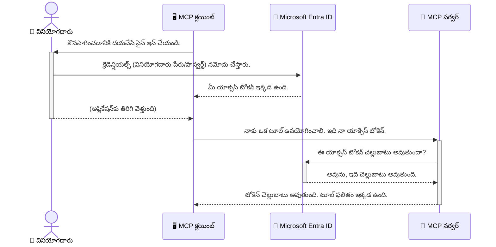

# AI వర్క్‌ఫ్లోలను సురక్షితం చేయడం: మోడల్ కాంటెక్స్ట్ ప్రోటోకాల్ సర్వర్ల కోసం Entra ID ప్రామాణీకరణ

## పరిచయం
మీ మోడల్ కాంటెక్స్ట్ ప్రోటోకాల్ (MCP) సర్వర్‌ను సురక్షితం చేయడం మీ ఇంటి ముందు తలుపును తాళం వేసుకోవడం ఎంత ముఖ్యమో అంతే. మీ MCP సర్వర్‌ను తెరిచి వదిలితే, మీ టూల్స్ మరియు డేటా అనధికార ప్రాప్తికి గురవుతాయి, ఇది భద్రతా ఉల్లంఘనలకు దారితీస్తుంది. Microsoft Entra ID ఒక బలమైన క్లౌడ్ ఆధారిత గుర్తింపు మరియు ప్రాప్తి నిర్వహణ పరిష్కారాన్ని అందిస్తుంది, ఇది కేవలం అనధికార రహిత వినియోగదారులు మరియు అప్లికేషన్లు మాత్రమే మీ MCP సర్వర్‌తో పరస్పరం చేయగలవని నిర్ధారిస్తుంది. ఈ విభాగంలో, మీరు Entra ID ప్రామాణీకరణ ఉపయోగించి మీ AI వర్క్‌ఫ్లోలను ఎలా రక్షించాలో నేర్చుకుంటారు.

## నేర్చుకునే లక్ష్యాలు
ఈ విభాగం ముగిసే వరకు, మీరు చేయగలుగుతారు:

- MCP సర్వర్లను సురక్షితం చేయడం ఎందుకు ముఖ్యమో అర్థం చేసుకోవడం.
- Microsoft Entra ID మరియు OAuth 2.0 ప్రామాణీకరణ యొక్క ప్రాథమికాలను వివరించడం.
- పబ్లిక్ మరియు కాన్ఫిడెన్షియల్ క్లయింట్ల మధ్య తేడాను గుర్తించడం.
- స్థానిక (పబ్లిక్ క్లయింట్) మరియు రిమోట్ (కాన్ఫిడెన్షియల్ క్లయింట్) MCP సర్వర్ సందర్భాలలో Entra ID ప్రామాణీకరణను అమలు చేయడం.
- AI వర్క్‌ఫ్లోలను అభివృద్ధి చేసే సమయంలో భద్రతా ఉత్తమ పద్ధతులను వర్తింపజేయడం.

## భద్రత మరియు MCP

మీ ఇంటి ముందు తలుపును తాళం వేసి వదలకపోయే విధంగా, మీ MCP సర్వర్‌ను ఎవరికైనా ప్రాప్తి కోసం తెరిచి వదలకూడదు. మీ AI వర్క్‌ఫ్లోలను సురక్షితం చేయడం బలమైన, నమ్మదగిన, మరియు సురక్షితమైన అప్లికేషన్లను నిర్మించడానికి అవసరం. ఈ అధ్యాయం Microsoft Entra ID ఉపయోగించి మీ MCP సర్వర్లను సురక్షితం చేయడం ఎలా అనేది పరిచయం చేస్తుంది, తద్వారా కేవలం అనధికార రహిత వినియోగదారులు మరియు అప్లికేషన్లు మాత్రమే మీ టూల్స్ మరియు డేటాతో పరస్పరం చేయగలవు.

## MCP సర్వర్ల కోసం భద్రత ఎందుకు ముఖ్యం

మీ MCP సర్వర్‌లో ఇమెయిల్స్ పంపగలిగే లేదా కస్టమర్ డేటాబేస్‌ను యాక్సెస్ చేయగల టూల్ ఉందని ఊహించుకోండి. ఒక సురక్షితం కాని సర్వర్ అంటే ఎవరికైనా ఆ టూల్ ఉపయోగించుకునే అవకాశం ఉంటుంది, ఇది అనధికార డేటా ప్రాప్తి, స్పామ్ లేదా ఇతర దుష్ట కార్యకలాపాలకు దారితీస్తుంది.

ప్రామాణీకరణను అమలు చేయడం ద్వారా, మీరు ప్రతి అభ్యర్థనను ధృవీకరిస్తారు, అభ్యర్థన చేస్తున్న వినియోగదారు లేదా అప్లికేషన్ యొక్క గుర్తింపును నిర్ధారిస్తారు. ఇది మీ AI వర్క్‌ఫ్లోలను సురక్షితం చేయడంలో మొదటి మరియు అత్యంత కీలకమైన దశ.

## Microsoft Entra ID పరిచయం

[**Microsoft Entra ID**](https://adoption.microsoft.com/microsoft-security/entra/) ఒక క్లౌడ్ ఆధారిత గుర్తింపు మరియు ప్రాప్తి నిర్వహణ సేవ. దీన్ని మీ అప్లికేషన్ల కోసం ఒక విశ్వవ్యాప్త భద్రతా గార్డ్‌గా భావించండి. ఇది వినియోగదారుల గుర్తింపులను ధృవీకరించడం (ప్రామాణీకరణ) మరియు వారు ఏమి చేయగలరో నిర్ణయించడం (అధికారీకరణ) అనే క్లిష్టమైన ప్రక్రియను నిర్వహిస్తుంది.

Entra ID ఉపయోగించడం ద్వారా మీరు:

- వినియోగదారులకు సురక్షిత సైన్-ఇన్‌ను సక్రియం చేయవచ్చు.
- APIs మరియు సేవలను రక్షించవచ్చు.
- ప్రాప్తి విధానాలను ఒక కేంద్ర స్థలంలో నిర్వహించవచ్చు.

MCP సర్వర్ల కోసం, Entra ID మీ సర్వర్ సామర్థ్యాలకు ఎవరు ప్రాప్తి పొందగలరో నిర్వహించడానికి బలమైన మరియు విశ్వసనీయ పరిష్కారాన్ని అందిస్తుంది.

---

## మాయాజాలం అర్థం చేసుకోవడం: Entra ID ప్రామాణీకరణ ఎలా పనిచేస్తుంది

Entra ID ప్రామాణీకరణను నిర్వహించడానికి **OAuth 2.0** వంటి ఓపెన్ స్టాండర్డ్స్‌ను ఉపయోగిస్తుంది. వివరాలు క్లిష్టంగా ఉండవచ్చు, కానీ ప్రాథమిక భావన సులభంగా అర్థం చేసుకోవచ్చు.

### OAuth 2.0 కు సున్నితమైన పరిచయం: వాలెట్ కీ

OAuth 2.0 ను మీ కారు కోసం వాలెట్ సేవగా భావించండి. మీరు రెస్టారెంట్‌కు చేరినప్పుడు, మీరు వాలెట్‌కు మీ మాస్టర్ కీ ఇవ్వరు. బదులుగా, మీరు ఒక **వాలెట్ కీ** ఇస్తారు, ఇది పరిమిత అనుమతులు కలిగి ఉంటుంది—కారు స్టార్ట్ చేయగలదు మరియు తలుపులు తాళం వేయగలదు, కానీ ట్రంక్ లేదా గ్లవ్ కంపార్ట్‌మెంట్ తెరవలదు.

ఈ ఉపమానంలో:

- **మీరు** అనేది **వినియోగదారు**.
- **మీ కారు** అనేది విలువైన టూల్స్ మరియు డేటాతో కూడిన **MCP సర్వర్**.
- **వాలెట్** అనేది **Microsoft Entra ID**.
- **పార్కింగ్ అటెండెంట్** అనేది **MCP క్లయింట్** (సర్వర్‌ను యాక్సెస్ చేయడానికి ప్రయత్నించే అప్లికేషన్).
- **వాలెట్ కీ** అనేది **ప్రాప్తి టోకెన్**.

ప్రాప్తి టోకెన్ అనేది Entra ID నుండి మీరు సైన్ ఇన్ చేసిన తర్వాత MCP క్లయింట్ అందుకునే సురక్షిత టెక్స్ట్ స్ట్రింగ్. క్లయింట్ ఆ టోకెన్‌ను ప్రతి అభ్యర్థనతో MCP సర్వర్‌కు అందిస్తుంది. సర్వర్ ఆ టోకెన్‌ను ధృవీకరించి అభ్యర్థన చట్టబద్ధమని నిర్ధారిస్తుంది మరియు క్లయింట్‌కు అవసరమైన అనుమతులు ఉన్నాయని నిర్ధారిస్తుంది, మీ అసలు క్రెడెన్షియల్స్ (పాస్వర్డ్ వంటి) ను ఎప్పుడూ హ్యాండిల్ చేయకుండా.

### ప్రామాణీకరణ ప్రవాహం

ప్రక్రియ ఎలా పనిచేస్తుందో ఇక్కడ ఉంది:


### Microsoft Authentication Library (MSAL) పరిచయం

కోడ్‌లోకి వెళ్లేముందు, మీరు ఉదాహరణల్లో చూడబోయే ఒక ముఖ్య భాగం: **Microsoft Authentication Library (MSAL)** ను పరిచయం చేయడం ముఖ్యం.

MSAL అనేది Microsoft అభివృద్ధి చేసిన లైబ్రరీ, ఇది డెవలపర్లకు ప్రామాణీకరణ నిర్వహణను చాలా సులభతరం చేస్తుంది. మీరు భద్రతా టోకెన్లను నిర్వహించడం, సైన్-ఇన్‌లను నిర్వహించడం, సెషన్లను రిఫ్రెష్ చేయడం వంటి క్లిష్టమైన కోడ్ రాయాల్సిన అవసరం లేకుండా MSAL ఈ పనులను నిర్వహిస్తుంది.

MSAL లైబ్రరీ ఉపయోగించడం చాలా సిఫార్సు చేయబడుతుంది ఎందుకంటే:

- **ఇది సురక్షితం:** ఇది పరిశ్రమ ప్రమాణాల ప్రోటోకాల్స్ మరియు భద్రతా ఉత్తమ పద్ధతులను అమలు చేస్తుంది, మీ కోడ్‌లో లోపాల ప్రమాదాన్ని తగ్గిస్తుంది.
- **అభివృద్ధిని సులభతరం చేస్తుంది:** OAuth 2.0 మరియు OpenID Connect ప్రోటోకాల్స్ యొక్క క్లిష్టతను దూరం చేస్తుంది, కేవలం కొన్ని కోడ్ లైన్లతో బలమైన ప్రామాణీకరణను మీ అప్లికేషన్‌లో చేర్చవచ్చు.
- **ఇది నిర్వహించబడుతుంది:** Microsoft MSAL ను సక్రియంగా నిర్వహించి, కొత్త భద్రతా ముప్పులు మరియు ప్లాట్‌ఫారమ్ మార్పులకు అనుగుణంగా నవీకరిస్తుంది.

MSAL అనేక భాషలు మరియు అప్లికేషన్ ఫ్రేమ్‌వర్క్‌లను మద్దతు ఇస్తుంది, .NET, JavaScript/TypeScript, Python, Java, Go, మరియు iOS, Android వంటి మొబైల్ ప్లాట్‌ఫారమ్‌లను కూడా. అంటే మీరు మీ మొత్తం టెక్నాలజీ స్టాక్‌లో ఒకే విధమైన ప్రామాణీకరణ నమూనాలను ఉపయోగించవచ్చు.

MSAL గురించి మరింత తెలుసుకోవడానికి, అధికారిక [MSAL అవలోకన డాక్యుమెంటేషన్](https://learn.microsoft.com/entra/identity-platform/msal-overview) చూడండి.

---

## Entra ID తో మీ MCP సర్వర్‌ను సురక్షితం చేయడం: దశల వారీ గైడ్

ఇప్పుడు, Entra ID ఉపయోగించి స్థానిక MCP సర్వర్ (stdio ద్వారా కమ్యూనికేట్ చేసే) ను ఎలా సురక్షితం చేయాలో చూద్దాం. ఈ ఉదాహరణలో **పబ్లిక్ క్లయింట్** ఉపయోగించబడుతుంది, ఇది వినియోగదారుల యంత్రంలో నడిచే అప్లికేషన్లకు, ఉదాహరణకు డెస్క్‌టాప్ యాప్ లేదా స్థానిక అభివృద్ధి సర్వర్‌కు అనుకూలం.

### సందర్భం 1: స్థానిక MCP సర్వర్‌ను సురక్షితం చేయడం (పబ్లిక్ క్లయింట్‌తో)

ఈ సందర్భంలో, మేము స్థానికంగా నడిచే MCP సర్వర్‌ను చూస్తాము, ఇది `stdio` ద్వారా కమ్యూనికేట్ చేస్తుంది మరియు యూజర్‌ను ప్రామాణీకరించడానికి Entra ID ఉపయోగిస్తుంది, తద్వారా టూల్స్‌కు ప్రాప్తి ఇవ్వబడుతుంది. సర్వర్‌లో ఒకే ఒక టూల్ ఉంటుంది, ఇది Microsoft Graph API నుండి యూజర్ ప్రొఫైల్ సమాచారాన్ని తెస్తుంది.

#### 1. Entra ID లో అప్లికేషన్ సెటప్ చేయడం

ఏ కోడ్ రాయకముందు, మీరు Microsoft Entra ID లో మీ అప్లికేషన్‌ను నమోదు చేయాలి. ఇది Entra ID కి మీ అప్లికేషన్ గురించి తెలియజేస్తుంది మరియు ప్రామాణీకరణ సేవను ఉపయోగించడానికి అనుమతి ఇస్తుంది.

1. **[Microsoft Entra పోర్టల్](https://entra.microsoft.com/)** కు వెళ్లండి.
2. **App registrations** కి వెళ్లి **New registration** క్లిక్ చేయండి.
3. మీ అప్లికేషన్‌కు పేరు ఇవ్వండి (ఉదా: "My Local MCP Server").
4. **Supported account types** కోసం **Accounts in this organizational directory only** ఎంచుకోండి.
5. ఈ ఉదాహరణకు **Redirect URI** ఖాళీగా వదిలేయండి.
6. **Register** క్లిక్ చేయండి.

నమోదు అయిన తర్వాత, **Application (client) ID** మరియు **Directory (tenant) ID** గమనించుకోండి. ఇవి మీ కోడ్‌లో అవసరం.

#### 2. కోడ్: విభజన

ప్రామాణీకరణను నిర్వహించే కోడ్ ముఖ్య భాగాలను చూద్దాం. ఈ ఉదాహరణకు పూర్తి కోడ్ [Entra ID - Local - WAM](https://github.com/Azure-Samples/mcp-auth-servers/tree/main/src/entra-id-local-wam) ఫోల్డర్‌లో [mcp-auth-servers GitHub రిపోజిటరీ](https://github.com/Azure-Samples/mcp-auth-servers) లో అందుబాటులో ఉంది.

**`AuthenticationService.cs`**

ఈ క్లాస్ Entra ID తో పరస్పర చర్య నిర్వహించడానికి బాధ్యత వహిస్తుంది.

- **`CreateAsync`**: ఈ మెథడ్ MSAL (Microsoft Authentication Library) నుండి `PublicClientApplication` ను ప్రారంభిస్తుంది. ఇది మీ అప్లికేషన్ యొక్క `clientId` మరియు `tenantId` తో కాన్ఫిగర్ చేయబడింది.
- **`WithBroker`**: ఇది బ్రోకర్ (విండోస్ వెబ్ అకౌంట్ మేనేజర్ వంటి) ఉపయోగాన్ని సక్రియం చేస్తుంది, ఇది మరింత సురక్షితమైన మరియు సులభమైన సింగిల్ సైన్-ఆన్ అనుభవాన్ని అందిస్తుంది.
- **`AcquireTokenAsync`**: ఇది ప్రధాన మెథడ్. మొదట ఇది సైలెంట్‌గా టోకెన్ పొందడానికి ప్రయత్నిస్తుంది (అంటే వినియోగదారు ఇప్పటికే చెల్లుబాటు అయ్యే సెషన్ ఉంటే మళ్లీ సైన్ ఇన్ కావాల్సిన అవసరం లేదు). సైలెంట్ టోకెన్ పొందలేకపోతే, ఇది వినియోగదారుని ఇంటరాక్టివ్‌గా సైన్ ఇన్ చేయమని ప్రాంప్ట్ చేస్తుంది.

```csharp
// Simplified for clarity
public static async Task<AuthenticationService> CreateAsync(ILogger<AuthenticationService> logger)
{
    var msalClient = PublicClientApplicationBuilder
        .Create(_clientId) // Your Application (client) ID
        .WithAuthority(AadAuthorityAudience.AzureAdMyOrg)
        .WithTenantId(_tenantId) // Your Directory (tenant) ID
        .WithBroker(new BrokerOptions(BrokerOptions.OperatingSystems.Windows))
        .Build();

    // ... cache registration ...

    return new AuthenticationService(logger, msalClient);
}

public async Task<string> AcquireTokenAsync()
{
    try
    {
        // Try silent authentication first
        var accounts = await _msalClient.GetAccountsAsync();
        var account = accounts.FirstOrDefault();

        AuthenticationResult? result = null;

        if (account != null)
        {
            result = await _msalClient.AcquireTokenSilent(_scopes, account).ExecuteAsync();
        }
        else
        {
            // If no account, or silent fails, go interactive
            result = await _msalClient.AcquireTokenInteractive(_scopes).ExecuteAsync();
        }

        return result.AccessToken;
    }
    catch (Exception ex)
    {
        _logger.LogError(ex, "An error occurred while acquiring the token.");
        throw; // Optionally rethrow the exception for higher-level handling
    }
}
```

**`Program.cs`**

ఇక్కడ MCP సర్వర్ సెటప్ చేయబడుతుంది మరియు ప్రామాణీకరణ సేవను ఇంటిగ్రేట్ చేస్తుంది.

- **`AddSingleton<AuthenticationService>`**: ఇది `AuthenticationService` ను డిపెండెన్సీ ఇంజెక్షన్ కంటైనర్‌లో నమోదు చేస్తుంది, తద్వారా అప్లికేషన్ ఇతర భాగాలు (మా టూల్ వంటి) దీనిని ఉపయోగించగలవు.
- **`GetUserDetailsFromGraph` టూల్**: ఈ టూల్‌కు `AuthenticationService` యొక్క ఇన్స్టాన్స్ అవసరం. ఏదైనా చేయకముందు, ఇది `authService.AcquireTokenAsync()` ను పిలుస్తుంది చెల్లుబాటు అయ్యే ప్రాప్తి టోకెన్ పొందడానికి. ప్రామాణీకరణ విజయవంతమైతే, టోకెన్ ఉపయోగించి Microsoft Graph API ను పిలిచి యూజర్ వివరాలను తెస్తుంది.

```csharp
// Simplified for clarity
[McpServerTool(Name = "GetUserDetailsFromGraph")]
public static async Task<string> GetUserDetailsFromGraph(
    AuthenticationService authService)
{
    try
    {
        // This will trigger the authentication flow
        var accessToken = await authService.AcquireTokenAsync();

        // Use the token to create a GraphServiceClient
        var graphClient = new GraphServiceClient(
            new BaseBearerTokenAuthenticationProvider(new TokenProvider(authService)));

        var user = await graphClient.Me.GetAsync();

        return System.Text.Json.JsonSerializer.Serialize(user);
    }
    catch (Exception ex)
    {
        return $"Error: {ex.Message}";
    }
}
```

#### 3. మొత్తం ప్రక్రియ ఎలా పనిచేస్తుంది

1. MCP క్లయింట్ `GetUserDetailsFromGraph` టూల్ ఉపయోగించడానికి ప్రయత్నించినప్పుడు, టూల్ మొదట `AcquireTokenAsync` ను పిలుస్తుంది.
2. `AcquireTokenAsync` MSAL లైబ్రరీని చెల్లుబాటు అయ్యే టోకెన్ కోసం తనిఖీ చేయమని ప్రేరేపిస్తుంది.
3. టోకెన్ కనుగొనబడకపోతే, MSAL బ్రోకర్ ద్వారా వినియోగదారుని Entra ID అకౌంట్‌తో సైన్ ఇన్ చేయమని ప్రాంప్ట్ చేస్తుంది.
4. వినియోగదారు సైన్ ఇన్ చేసిన తర్వాత, Entra ID ప్రాప్తి టోకెన్ జారీ చేస్తుంది.
5. టూల్ ఆ టోకెన్‌ను అందుకుని Microsoft Graph API కు సురక్షిత కాల్ చేస్తుంది.
6. యూజర్ వివరాలు MCP క్లయింట్‌కు తిరిగి వస్తాయి.

ఈ ప్రక్రియ ద్వారా కేవలం ప్రామాణీకరించిన వినియోగదారులు మాత్రమే టూల్ ఉపయోగించగలరు, తద్వారా మీ స్థానిక MCP సర్వర్ సురక్షితం అవుతుంది.

### సందర్భం 2: రిమోట్ MCP సర్వర్‌ను సురక్షితం చేయడం (కాన్ఫిడెన్షియల్ క్లయింట్‌తో)

మీ MCP సర్వర్ రిమోట్ యంత్రంలో (క్లౌడ్ సర్వర్ వంటి) నడుస్తున్నప్పుడు మరియు HTTP స్ట్రీమింగ్ వంటి ప్రోటోకాల్ ద్వారా కమ్యూనికేట్ చేస్తున్నప్పుడు, భద్రతా అవసరాలు వేరుగా ఉంటాయి. ఈ సందర్భంలో, మీరు **కాన్ఫిడెన్షియల్ క్లయింట్** మరియు **Authorization Code Flow** ఉపయోగించాలి. ఇది మరింత సురక్షితమైన పద్ధతి, ఎందుకంటే అప్లికేషన్ రహస్యాలు బ్రౌజర్‌కు ఎప్పుడూ వెల్లడించబడవు.

ఈ ఉదాహరణ TypeScript ఆధారిత MCP సర్వర్‌ను ఉపయోగిస్తుంది, ఇది Express.js ద్వారా HTTP అభ్యర్థనలను నిర్వహిస్తుంది.

#### 1. Entra ID లో అప్లికేషన్ సెటప్ చేయడం

Entra ID లో సెటప్ పబ్లిక్ క్లయింట్‌కు సమానంగా ఉంటుంది, కానీ ఒక ముఖ్య తేడాతో: మీరు **క్లయింట్ సీక్రెట్** సృష్టించాలి.

1. **[Microsoft Entra పోర్టల్](https://entra.microsoft.com/)** కు వెళ్లండి.
2. మీ అప్లికేషన్ రిజిస్ట్రేషన్‌లో **Certificates & secrets** ట్యాబ్‌కు వెళ్లండి.
3. **New client secret** క్లిక్ చేసి, వివరణ ఇవ్వండి, మరియు **Add** క్లిక్ చేయండి.
4. **ముఖ్యమైనది:** సీక్రెట్ విలువను వెంటనే కాపీ చేసుకోండి. మీరు దీన్ని మళ్లీ చూడలేరు.
5. మీరు **Redirect URI** కూడా కాన్ఫిగర్ చేయాలి. **Authentication** ట్యాబ్‌కు వెళ్లి, **Add a platform** క్లిక్ చేసి, **Web** ఎంచుకుని, మీ అప్లికేషన్ కోసం రీడైరెక్ట్ URI (ఉదా: `http://localhost:3001/auth/callback`) నమోదు చేయండి.

> **⚠️ ముఖ్య భద్రతా గమనిక:** ప్రొడక్షన్ అప్లికేషన్ల కోసం, Microsoft క్లయింట్ సీక్రెట్ల స్థానంలో **సీక్రెట్‌లేని ప్రామాణీకరణ** పద్ధతులు, ఉదాహరణకు **Managed Identity** లేదా **Workload Identity Federation** ఉపయోగించమని బలంగా సిఫార్సు చేస్తుంది. క్లయింట్ సీక్రెట్లు భద్రతా ప్రమాదాలను కలిగిస్తాయి, అవి బయటపడవచ్చు లేదా దుర్వినియోగం కావచ్చు. మేనేజ్డ్ ఐడెంటిటీల ద్వారా మీ కోడ్ లేదా కాన్ఫిగరేషన్‌లో క్రెడెన్షియల్స్ నిల్వ చేయాల్సిన అవసరం లేకుండా మరింత సురక్షితమైన పద్ధతి అందుతుంది.
>
> మేనేజ్డ్ ఐడెంటిటీల గురించి మరియు వాటిని ఎలా అమలు చేయాలో తెలుసుకోవడానికి, [Managed identities for Azure resources overview](https://learn.microsoft.com/entra/identity/managed-identities-azure-resources/overview) చూడండి.

#### 2. కోడ్: విభజన

ఈ ఉదాహరణ సెష
2. వినియోగదారు తన Entra ID ఖాతాతో సైన్ ఇన్ అవుతాడు.
3. Entra ID వినియోగదారుని `/auth/callback` ఎండ్‌పాయింట్‌కు అనుమతి కోడ్‌తో తిరిగి రీడైరెక్ట్ చేస్తుంది.
4. సర్వర్ ఆ కోడ్‌ను యాక్సెస్ టోకెన్ మరియు రిఫ్రెష్ టోకెన్ కోసం మారుస్తుంది, వాటిని నిల్వ చేస్తుంది, మరియు క్లయింట్‌కు పంపే సెషన్ టోకెన్‌ను సృష్టిస్తుంది.
5. క్లయింట్ ఇప్పుడు ఈ సెషన్ టోకెన్‌ను MCP సర్వర్‌కు భవిష్యత్తులో చేసే అన్ని అభ్యర్థనల కోసం `Authorization` హెడ్డర్‌లో ఉపయోగించవచ్చు.
6. `getUserDetails` టూల్ పిలవబడినప్పుడు, అది సెషన్ టోకెన్ ఉపయోగించి Entra ID యాక్సెస్ టోకెన్‌ను వెతుకుతుంది మరియు ఆ టోకెన్ ఉపయోగించి Microsoft Graph APIని పిలుస్తుంది.

ఈ ప్రవాహం పబ్లిక్ క్లయింట్ ప్రవాహం కంటే క్లిష్టమైనది, కానీ ఇంటర్నెట్-ముఖ్యమైన ఎండ్‌పాయింట్ల కోసం అవసరం. రిమోట్ MCP సర్వర్లు పబ్లిక్ ఇంటర్నెట్ ద్వారా యాక్సెస్ చేయబడతాయి కాబట్టి, అవి అనధికార ప్రాప్తి మరియు సంభావ్య దాడుల నుండి రక్షించడానికి బలమైన భద్రతా చర్యలు అవసరం.


## భద్రతా ఉత్తమ ఆచారాలు

- **ఎప్పుడూ HTTPS ఉపయోగించండి**: టోకెన్లను దొంగిలించకుండా రక్షించడానికి క్లయింట్ మరియు సర్వర్ మధ్య కమ్యూనికేషన్‌ను ఎన్‌క్రిప్ట్ చేయండి.
- **పాత్ర ఆధారిత ప్రాప్తి నియంత్రణ (RBAC) అమలు చేయండి**: వినియోగదారు ధృవీకరించబడినదా అని మాత్రమే కాకుండా, వారు ఏం చేయడానికి అనుమతించబడ్డారో కూడా తనిఖీ చేయండి. మీరు Entra IDలో పాత్రలను నిర్వచించి, వాటిని మీ MCP సర్వర్‌లో తనిఖీ చేయవచ్చు.
- **నిరీక్షణ మరియు ఆడిట్ చేయండి**: అనుమానాస్పద కార్యకలాపాలను గుర్తించడానికి మరియు స్పందించడానికి అన్ని ధృవీకరణ సంఘటనలను లాగ్ చేయండి.
- **రేటు పరిమితి మరియు థ్రాట్లింగ్‌ను నిర్వహించండి**: Microsoft Graph మరియు ఇతర APIలు దుర్వినియోగం నివారించడానికి రేటు పరిమితిని అమలు చేస్తాయి. HTTP 429 (చాలా అభ్యర్థనలు) ప్రతిస్పందనలను సాఫీగా నిర్వహించడానికి మీ MCP సర్వర్‌లో ఎక్స్‌పోనెన్షియల్ బ్యాక్ ఆఫ్ మరియు రీట్రై లాజిక్‌ను అమలు చేయండి. API కాల్స్‌ను తగ్గించడానికి తరచుగా యాక్సెస్ అయ్యే డేటాను క్యాష్ చేయడం పరిగణించండి.
- **టోకెన్ నిల్వను భద్రపరచండి**: యాక్సెస్ టోకెన్లు మరియు రిఫ్రెష్ టోకెన్లను సురక్షితంగా నిల్వ చేయండి. స్థానిక అనువర్తనాల కోసం, సిస్టమ్ యొక్క సురక్షిత నిల్వ యంత్రాంగాలను ఉపయోగించండి. సర్వర్ అనువర్తనాల కోసం, ఎన్‌క్రిప్టెడ్ నిల్వ లేదా Azure Key Vault వంటి సురక్షిత కీ నిర్వహణ సేవలను ఉపయోగించండి.
- **టోకెన్ గడువు నిర్వహణ**: యాక్సెస్ టోకెన్లకు పరిమిత కాలం ఉంటుంది. రిఫ్రెష్ టోకెన్లను ఉపయోగించి ఆటోమేటిక్ టోకెన్ రిఫ్రెష్‌ను అమలు చేయండి, తద్వారా వినియోగదారులు మళ్లీ ధృవీకరణ అవసరం లేకుండా సజావుగా అనుభవించగలుగుతారు.
- **Azure API Management ఉపయోగించడాన్ని పరిగణించండి**: మీ MCP సర్వర్‌లో భద్రతను నేరుగా అమలు చేయడం ద్వారా మీరు సున్నితమైన నియంత్రణ పొందగలుగుతారు, కానీ Azure API Management వంటి API గేట్వేలు ధృవీకరణ, అనుమతి, రేటు పరిమితి, మరియు నిరీక్షణ వంటి అనేక భద్రతా సమస్యలను ఆటోమేటిక్‌గా నిర్వహించగలవు. ఇవి మీ క్లయింట్లు మరియు MCP సర్వర్ల మధ్య కేంద్ర భద్రతా పొరగా పనిచేస్తాయి. MCPతో API గేట్వేలను ఉపయోగించడంపై మరిన్ని వివరాలకు, మా [Azure API Management Your Auth Gateway For MCP Servers](https://techcommunity.microsoft.com/blog/integrationsonazureblog/azure-api-management-your-auth-gateway-for-mcp-servers/4402690) చూడండి.


## ముఖ్యమైన పాఠాలు

- మీ MCP సర్వర్‌ను భద్రపరచడం మీ డేటా మరియు టూల్స్ రక్షణకు అత్యంత ముఖ్యమైనది.
- Microsoft Entra ID ధృవీకరణ మరియు అనుమతికి బలమైన మరియు స్కేలబుల్ పరిష్కారాన్ని అందిస్తుంది.
- స్థానిక అనువర్తనాల కోసం **పబ్లిక్ క్లయింట్** మరియు రిమోట్ సర్వర్ల కోసం **గోప్యమైన క్లయింట్** ఉపయోగించండి.
- **అనుమతి కోడ్ ఫ్లో** వెబ్ అనువర్తనాల కోసం అత్యంత భద్రతా ఎంపిక.


## వ్యాయామం

1. మీరు నిర్మించవచ్చు అనుకున్న MCP సర్వర్ గురించి ఆలోచించండి. అది స్థానిక సర్వర్ అవుతుందా లేదా రిమోట్ సర్వర్?
2. మీ సమాధానం ఆధారంగా, మీరు పబ్లిక్ లేదా గోప్యమైన క్లయింట్‌ను ఉపయోగిస్తారా?
3. Microsoft Graphపై చర్యలు నిర్వహించడానికి మీ MCP సర్వర్ ఏ అనుమతిని కోరుతుంది?


## ప్రాక్టికల్ వ్యాయామాలు

### వ్యాయామం 1: Entra IDలో అనువర్తనం నమోదు చేయండి
Microsoft Entra పోర్టల్‌కు వెళ్లండి.
మీ MCP సర్వర్ కోసం కొత్త అనువర్తనాన్ని నమోదు చేయండి.
అనువర్తనం (క్లయింట్) ID మరియు డైరెక్టరీ (టెనెంట్) IDను నమోదు చేసుకోండి.

### వ్యాయామం 2: స్థానిక MCP సర్వర్‌ను భద్రపరచండి (పబ్లిక్ క్లయింట్)
- వినియోగదారు ధృవీకరణ కోసం MSAL (Microsoft Authentication Library)ని ఇంటిగ్రేట్ చేయడానికి కోడ్ ఉదాహరణను అనుసరించండి.
- Microsoft Graph నుండి వినియోగదారు వివరాలను తీసుకునే MCP టూల్‌ను పిలవడం ద్వారా ధృవీకరణ ప్రవాహాన్ని పరీక్షించండి.

### వ్యాయామం 3: రిమోట్ MCP సర్వర్‌ను భద్రపరచండి (గోప్యమైన క్లయింట్)
- Entra IDలో గోప్యమైన క్లయింట్‌ను నమోదు చేసి క్లయింట్ సీక్రెట్ సృష్టించండి.
- మీ Express.js MCP సర్వర్‌ను అనుమతి కోడ్ ఫ్లో ఉపయోగించ도록 కాన్ఫిగర్ చేయండి.
- రక్షిత ఎండ్‌పాయింట్లను పరీక్షించి టోకెన్ ఆధారిత ప్రాప్తిని నిర్ధారించండి.

### వ్యాయామం 4: భద్రతా ఉత్తమ ఆచారాలు అమలు చేయండి
- మీ స్థానిక లేదా రిమోట్ సర్వర్ కోసం HTTPSను ఎనేబుల్ చేయండి.
- మీ సర్వర్ లాజిక్‌లో పాత్ర ఆధారిత ప్రాప్తి నియంత్రణ (RBAC)ను అమలు చేయండి.
- టోకెన్ గడువు నిర్వహణ మరియు సురక్షిత టోకెన్ నిల్వను జోడించండి.

## వనరులు

1. **MSAL అవలోకన డాక్యుమెంటేషన్**  
   Microsoft Authentication Library (MSAL) ఎలా ప్లాట్‌ఫారమ్‌లలో సురక్షిత టోకెన్ పొందడాన్ని సులభతరం చేస్తుందో తెలుసుకోండి:  
   [MSAL Overview on Microsoft Learn](https://learn.microsoft.com/en-gb/entra/msal/overview)

2. **Azure-Samples/mcp-auth-servers GitHub రిపోజిటరీ**  
   ధృవీకరణ ప్రవాహాలను చూపించే MCP సర్వర్ల సూచన అమలు:  
   [Azure-Samples/mcp-auth-servers on GitHub](https://github.com/Azure-Samples/mcp-auth-servers)

3. **Azure వనరుల కోసం నిర్వహించబడిన గుర్తింపుల అవలోకనం**  
   సిస్టమ్ లేదా వినియోగదారు-నిర్దేశిత నిర్వహించబడిన గుర్తింపులను ఉపయోగించి సీక్రెట్లను ఎలా తొలగించాలో తెలుసుకోండి:  
   [Managed Identities Overview on Microsoft Learn](https://learn.microsoft.com/en-us/entra/identity/managed-identities-azure-resources/)

4. **Azure API Management: MCP సర్వర్ల కోసం మీ ధృవీకరణ గేట్వే**  
   MCP సర్వర్ల కోసం APIMని సురక్షిత OAuth2 గేట్వేగా ఉపయోగించడంపై లోతైన అవగాహన:  
   [Azure API Management Your Auth Gateway For MCP Servers](https://techcommunity.microsoft.com/blog/integrationsonazureblog/azure-api-management-your-auth-gateway-for-mcp-servers/4402690)

5. **Microsoft Graph అనుమతుల సూచిక**  
   Microsoft Graph కోసం ప్రతినిధి మరియు అనువర్తన అనుమతుల సమగ్ర జాబితా:  
   [Microsoft Graph Permissions Reference](https://learn.microsoft.com/zh-tw/graph/permissions-reference)


## నేర్చుకున్న ఫలితాలు
ఈ విభాగాన్ని పూర్తి చేసిన తర్వాత, మీరు:

- MCP సర్వర్లు మరియు AI వర్క్‌ఫ్లోల కోసం ధృవీకరణ ఎందుకు కీలకమో వివరించగలుగుతారు.
- స్థానిక మరియు రిమోట్ MCP సర్వర్ సన్నివేశాల కోసం Entra ID ధృవీకరణను సెట్ అప్ చేసి కాన్ఫిగర్ చేయగలుగుతారు.
- మీ సర్వర్ అమరిక ఆధారంగా సరైన క్లయింట్ రకాన్ని (పబ్లిక్ లేదా గోప్యమైన) ఎంచుకోగలుగుతారు.
- టోకెన్ నిల్వ మరియు పాత్ర ఆధారిత అనుమతిని సహా సురక్షిత కోడింగ్ ఆచారాలను అమలు చేయగలుగుతారు.
- అనధికార ప్రాప్తి నుండి మీ MCP సర్వర్ మరియు దాని టూల్స్‌ను ధృవంగా రక్షించగలుగుతారు.

## తదుపరి ఏమిటి

- [5.13 మోడల్ కాంటెక్స్ట్ ప్రోటోకాల్ (MCP) Azure AI Foundryతో ఇంటిగ్రేషన్](../mcp-foundry-agent-integration/README.md)

---

<!-- CO-OP TRANSLATOR DISCLAIMER START -->
**అస్పష్టత**:  
ఈ పత్రాన్ని AI అనువాద సేవ [Co-op Translator](https://github.com/Azure/co-op-translator) ఉపయోగించి అనువదించబడింది. మేము ఖచ్చితత్వానికి ప్రయత్నించినప్పటికీ, ఆటోమేటెడ్ అనువాదాల్లో పొరపాట్లు లేదా తప్పిదాలు ఉండవచ్చు. మూల పత్రం దాని స్వదేశీ భాషలో అధికారిక మూలంగా పరిగణించాలి. ముఖ్యమైన సమాచారానికి, ప్రొఫెషనల్ మానవ అనువాదం సిఫార్సు చేయబడుతుంది. ఈ అనువాదం వాడకంలో ఏర్పడిన ఏవైనా అపార్థాలు లేదా తప్పుదారితీసే అర్థాలు కోసం మేము బాధ్యత వహించము.
<!-- CO-OP TRANSLATOR DISCLAIMER END -->