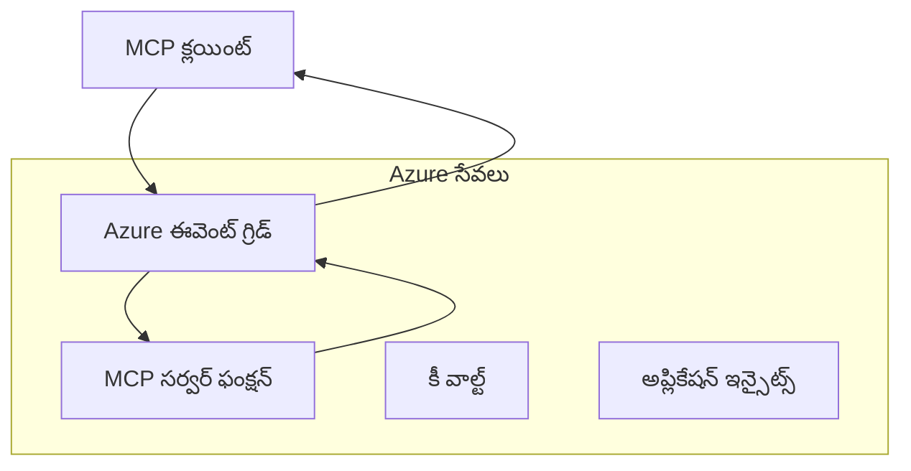
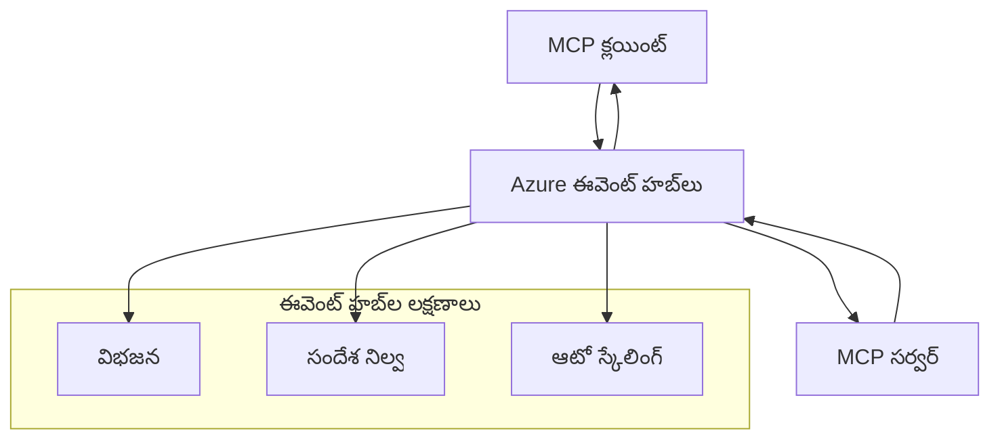

# MCP కస్టమ్ ట్రాన్స్‌పోర్ట్స్ - అధునాతన అమలు గైడ్

మోడల్ కాంటెక్స్ట్ ప్రోటోకాల్ (MCP) ట్రాన్స్‌పోర్ట్ మెకానిజంలలో సౌలభ్యాన్ని అందిస్తుంది, ప్రత్యేక ఎంటర్ప్రైజ్ వాతావరణాల కోసం కస్టమ్ అమలులను అనుమతిస్తుంది. ఈ అధునాతన గైడ్ Azure ఈవెంట్ గ్రిడ్ మరియు Azure ఈవెంట్ హబ్‌లను ఉపయోగించి కస్టమ్ ట్రాన్స్‌పోర్ట్ అమలులను పరిశీలిస్తుంది, స్కేలబుల్, క్లౌడ్-నేటివ్ MCP పరిష్కారాలను నిర్మించడానికి ప్రాక్టికల్ ఉదాహరణలుగా.

## పరిచయం

MCP యొక్క ప్రామాణిక ట్రాన్స్‌పోర్ట్స్ (stdio మరియు HTTP స్ట్రీమింగ్) ఎక్కువ భాగం ఉపయోగాల కోసం సరిపోతున్నప్పటికీ, ఎంటర్ప్రైజ్ వాతావరణాలు మెరుగైన స్కేలబిలిటీ, నమ్మకదారితనం మరియు ఉన్న క్లౌడ్ మౌలిక సదుపాయాలతో సమగ్రత కోసం ప్రత్యేక ట్రాన్స్‌పోర్ట్ మెకానిజంలను తరచుగా అవసరం పడతాయి. కస్టమ్ ట్రాన్స్‌పోర్ట్స్ MCPకు అసింక్రోనస్ కమ్యూనికేషన్, ఈవెంట్-డ్రివెన్ ఆర్కిటెక్చర్స్ మరియు పంపిణీ ప్రాసెసింగ్ కోసం క్లౌడ్-నేటివ్ మెసేజింగ్ సేవలను ఉపయోగించడానికి వీలు కల్పిస్తాయి.

ఈ పాఠం తాజా MCP స్పెసిఫికేషన్ (2025-11-25), Azure మెసేజింగ్ సేవలు మరియు స్థాపిత ఎంటర్ప్రైజ్ ఇంటిగ్రేషన్ నమూనాల ఆధారంగా అధునాతన ట్రాన్స్‌పోర్ట్ అమలులను పరిశీలిస్తుంది.

### **MCP ట్రాన్స్‌పోర్ట్ ఆర్కిటెక్చర్**

**MCP స్పెసిఫికేషన్ (2025-11-25) నుండి:**

- **ప్రామాణిక ట్రాన్స్‌పోర్ట్స్**: stdio (సిఫార్సు చేయబడింది), HTTP స్ట్రీమింగ్ (దూరస్థ పరిస్థితుల కోసం)
- **కస్టమ్ ట్రాన్స్‌పోర్ట్స్**: MCP మెసేజ్ ఎక్స్చేంజ్ ప్రోటోకాల్‌ను అమలు చేసే ఏదైనా ట్రాన్స్‌పోర్ట్
- **మెసేజ్ ఫార్మాట్**: MCP-స్పెసిఫిక్ విస్తరణలతో JSON-RPC 2.0
- **బైడైరెక్షనల్ కమ్యూనికేషన్**: నోటిఫికేషన్లు మరియు ప్రతిస్పందనల కోసం పూర్తి డుప్లెక్స్ కమ్యూనికేషన్ అవసరం

## నేర్చుకునే లక్ష్యాలు

ఈ అధునాతన పాఠం ముగింపు నాటికి, మీరు చేయగలుగుతారు:

- **కస్టమ్ ట్రాన్స్‌పోర్ట్ అవసరాలను అర్థం చేసుకోవడం**: MCP ప్రోటోకాల్‌ను ఏదైనా ట్రాన్స్‌పోర్ట్ లేయర్‌పై అమలు చేయడం, అనుగుణతను కాపాడుకుంటూ
- **Azure ఈవెంట్ గ్రిడ్ ట్రాన్స్‌పోర్ట్ నిర్మించడం**: సర్వర్‌లెస్ స్కేలబిలిటీ కోసం Azure ఈవెంట్ గ్రిడ్ ఉపయోగించి ఈవెంట్-డ్రివెన్ MCP సర్వర్లను సృష్టించడం
- **Azure ఈవెంట్ హబ్ ట్రాన్స్‌పోర్ట్ అమలు చేయడం**: రియల్-టైమ్ స్ట్రీమింగ్ కోసం Azure ఈవెంట్ హబ్‌లను ఉపయోగించి అధిక-థ్రూపుట్ MCP పరిష్కారాలను డిజైన్ చేయడం
- **ఎంటర్ప్రైజ్ నమూనాలను వర్తింపజేయడం**: ఉన్న Azure మౌలిక సదుపాయాలు మరియు భద్రతా నమూనాలతో కస్టమ్ ట్రాన్స్‌పోర్ట్స్‌ను సమగ్రపరచడం
- **ట్రాన్స్‌పోర్ట్ నమ్మకదారితనాన్ని నిర్వహించడం**: ఎంటర్ప్రైజ్ పరిస్థితుల కోసం మెసేజ్ దృఢత్వం, ఆర్డరింగ్ మరియు లోపాల నిర్వహణను అమలు చేయడం
- **పనితీరు ఆప్టిమైజ్ చేయడం**: స్కేల్, లేటెన్సీ మరియు థ్రూపుట్ అవసరాలకు అనుగుణంగా ట్రాన్స్‌పోర్ట్ పరిష్కారాలను డిజైన్ చేయడం

## **ట్రాన్స్‌పోర్ట్ అవసరాలు**

### **MCP స్పెసిఫికేషన్ (2025-11-25) నుండి ప్రాథమిక అవసరాలు:**

```yaml
Message Protocol:
  format: "JSON-RPC 2.0 with MCP extensions"
  bidirectional: "Full duplex communication required"
  ordering: "Message ordering must be preserved per session"
  
Transport Layer:
  reliability: "Transport MUST handle connection failures gracefully"
  security: "Transport MUST support secure communication"
  identification: "Each session MUST have unique identifier"
  
Custom Transport:
  compliance: "MUST implement complete MCP message exchange"
  extensibility: "MAY add transport-specific features"
  interoperability: "MUST maintain protocol compatibility"
```

## **Azure ఈవెంట్ గ్రిడ్ ట్రాన్స్‌పోర్ట్ అమలు**

Azure ఈవెంట్ గ్రిడ్ ఈవెంట్-డ్రివెన్ MCP ఆర్కిటెక్చర్ల కోసం సర్వర్‌లెస్ ఈవెంట్ రౌటింగ్ సేవను అందిస్తుంది. ఈ అమలు స్కేలబుల్, సడలిన MCP సిస్టమ్స్‌ను ఎలా నిర్మించాలో చూపిస్తుంది.

### **ఆర్కిటెక్చర్ అవలోకనం**


### **C# అమలు - ఈవెంట్ గ్రిడ్ ట్రాన్స్‌పోర్ట్**

```csharp
using Azure.Messaging.EventGrid;
using Microsoft.Extensions.Azure;
using System.Text.Json;

public class EventGridMcpTransport : IMcpTransport
{
    private readonly EventGridPublisherClient _publisher;
    private readonly string _topicEndpoint;
    private readonly string _clientId;
    
    public EventGridMcpTransport(string topicEndpoint, string accessKey, string clientId)
    {
        _publisher = new EventGridPublisherClient(
            new Uri(topicEndpoint), 
            new AzureKeyCredential(accessKey));
        _topicEndpoint = topicEndpoint;
        _clientId = clientId;
    }
    
    public async Task SendMessageAsync(McpMessage message)
    {
        var eventGridEvent = new EventGridEvent(
            subject: $"mcp/{_clientId}",
            eventType: "MCP.MessageReceived",
            dataVersion: "1.0",
            data: JsonSerializer.Serialize(message))
        {
            Id = Guid.NewGuid().ToString(),
            EventTime = DateTimeOffset.UtcNow
        };
        
        await _publisher.SendEventAsync(eventGridEvent);
    }
    
    public async Task<McpMessage> ReceiveMessageAsync(CancellationToken cancellationToken)
    {
        // Event Grid is push-based, so implement webhook receiver
        // This would typically be handled by Azure Functions trigger
        throw new NotImplementedException("Use EventGridTrigger in Azure Functions");
    }
}

// Azure Function for receiving Event Grid events
[FunctionName("McpEventGridReceiver")]
public async Task<IActionResult> HandleEventGridMessage(
    [EventGridTrigger] EventGridEvent eventGridEvent,
    ILogger log)
{
    try
    {
        var mcpMessage = JsonSerializer.Deserialize<McpMessage>(
            eventGridEvent.Data.ToString());
        
        // Process MCP message
        var response = await _mcpServer.ProcessMessageAsync(mcpMessage);
        
        // Send response back via Event Grid
        await _transport.SendMessageAsync(response);
        
        return new OkResult();
    }
    catch (Exception ex)
    {
        log.LogError(ex, "Error processing Event Grid MCP message");
        return new BadRequestResult();
    }
}
```

### **TypeScript అమలు - ఈవెంట్ గ్రిడ్ ట్రాన్స్‌పోర్ట్**

```typescript
import { EventGridPublisherClient, AzureKeyCredential } from "@azure/eventgrid";
import { McpTransport, McpMessage } from "./mcp-types";

export class EventGridMcpTransport implements McpTransport {
    private publisher: EventGridPublisherClient;
    private clientId: string;
    
    constructor(
        private topicEndpoint: string,
        private accessKey: string,
        clientId: string
    ) {
        this.publisher = new EventGridPublisherClient(
            topicEndpoint,
            new AzureKeyCredential(accessKey)
        );
        this.clientId = clientId;
    }
    
    async sendMessage(message: McpMessage): Promise<void> {
        const event = {
            id: crypto.randomUUID(),
            source: `mcp-client-${this.clientId}`,
            type: "MCP.MessageReceived",
            time: new Date(),
            data: message
        };
        
        await this.publisher.sendEvents([event]);
    }
    
    // ఈవెంట్-డ్రైవెన్ స్వీకరణ Azure Functions ద్వారా
    onMessage(handler: (message: McpMessage) => Promise<void>): void {
        // అమలు Azure Functions ఈవెంట్ గ్రిడ్ ట్రిగ్గర్ ఉపయోగిస్తుంది
        // ఇది webhook రిసీవర్ కోసం ఒక భావనాత్మక ఇంటర్‌ఫేస్
    }
}

// Azure Functions అమలు
import { app, InvocationContext, EventGridEvent } from "@azure/functions";

app.eventGrid("mcpEventGridHandler", {
    handler: async (event: EventGridEvent, context: InvocationContext) => {
        try {
            const mcpMessage = event.data as McpMessage;
            
            // MCP సందేశాన్ని ప్రాసెస్ చేయండి
            const response = await mcpServer.processMessage(mcpMessage);
            
            // ఈవెంట్ గ్రిడ్ ద్వారా ప్రతిస్పందన పంపండి
            await transport.sendMessage(response);
            
        } catch (error) {
            context.error("Error processing MCP message:", error);
            throw error;
        }
    }
});
```

### **Python అమలు - ఈవెంట్ గ్రిడ్ ట్రాన్స్‌పోర్ట్**

```python
from azure.eventgrid import EventGridPublisherClient, EventGridEvent
from azure.core.credentials import AzureKeyCredential
import asyncio
import json
from typing import Callable, Optional
import uuid
from datetime import datetime

class EventGridMcpTransport:
    def __init__(self, topic_endpoint: str, access_key: str, client_id: str):
        self.client = EventGridPublisherClient(
            topic_endpoint, 
            AzureKeyCredential(access_key)
        )
        self.client_id = client_id
        self.message_handler: Optional[Callable] = None
    
    async def send_message(self, message: dict) -> None:
        """Send MCP message via Event Grid"""
        event = EventGridEvent(
            data=message,
            subject=f"mcp/{self.client_id}",
            event_type="MCP.MessageReceived",
            data_version="1.0"
        )
        
        await self.client.send(event)
    
    def on_message(self, handler: Callable[[dict], None]) -> None:
        """Register message handler for incoming events"""
        self.message_handler = handler

# అజ్యూర్ ఫంక్షన్స్ అమలు
import azure.functions as func
import logging

def main(event: func.EventGridEvent) -> None:
    """Azure Functions Event Grid trigger for MCP messages"""
    try:
        # ఈవెంట్ గ్రిడ్ ఈవెంట్ నుండి MCP సందేశాన్ని పార్స్ చేయండి
        mcp_message = json.loads(event.get_body().decode('utf-8'))
        
        # MCP సందేశాన్ని ప్రాసెస్ చేయండి
        response = process_mcp_message(mcp_message)
        
        # ఈవెంట్ గ్రిడ్ ద్వారా ప్రతిస్పందనను తిరిగి పంపండి
        # (అమలు కొత్త ఈవెంట్ గ్రిడ్ క్లయింట్‌ను సృష్టిస్తుంది)
        
    except Exception as e:
        logging.error(f"Error processing MCP Event Grid message: {e}")
        raise
```

## **Azure ఈవెంట్ హబ్ ట్రాన్స్‌పోర్ట్ అమలు**

Azure ఈవెంట్ హబ్‌లు తక్కువ లేటెన్సీ మరియు అధిక మెసేజ్ వాల్యూమ్ అవసరమయ్యే MCP పరిస్థితుల కోసం అధిక-థ్రూపుట్, రియల్-టైమ్ స్ట్రీమింగ్ సామర్థ్యాలను అందిస్తాయి.

### **ఆర్కిటెక్చర్ అవలోకనం**


### **C# అమలు - ఈవెంట్ హబ్ ట్రాన్స్‌పోర్ట్**

```csharp
using Azure.Messaging.EventHubs;
using Azure.Messaging.EventHubs.Producer;
using Azure.Messaging.EventHubs.Consumer;
using System.Text;

public class EventHubsMcpTransport : IMcpTransport, IDisposable
{
    private readonly EventHubProducerClient _producer;
    private readonly EventHubConsumerClient _consumer;
    private readonly string _consumerGroup;
    private readonly CancellationTokenSource _cancellationTokenSource;
    
    public EventHubsMcpTransport(
        string connectionString, 
        string eventHubName,
        string consumerGroup = "$Default")
    {
        _producer = new EventHubProducerClient(connectionString, eventHubName);
        _consumer = new EventHubConsumerClient(
            consumerGroup, 
            connectionString, 
            eventHubName);
        _consumerGroup = consumerGroup;
        _cancellationTokenSource = new CancellationTokenSource();
    }
    
    public async Task SendMessageAsync(McpMessage message)
    {
        var messageBody = JsonSerializer.Serialize(message);
        var eventData = new EventData(Encoding.UTF8.GetBytes(messageBody));
        
        // Add MCP-specific properties
        eventData.Properties.Add("MessageType", message.Method ?? "response");
        eventData.Properties.Add("MessageId", message.Id);
        eventData.Properties.Add("Timestamp", DateTimeOffset.UtcNow);
        
        await _producer.SendAsync(new[] { eventData });
    }
    
    public async Task StartReceivingAsync(
        Func<McpMessage, Task> messageHandler)
    {
        await foreach (PartitionEvent partitionEvent in _consumer.ReadEventsAsync(
            _cancellationTokenSource.Token))
        {
            try
            {
                var messageBody = Encoding.UTF8.GetString(
                    partitionEvent.Data.EventBody.ToArray());
                var mcpMessage = JsonSerializer.Deserialize<McpMessage>(messageBody);
                
                await messageHandler(mcpMessage);
            }
            catch (Exception ex)
            {
                // Handle deserialization or processing errors
                Console.WriteLine($"Error processing message: {ex.Message}");
            }
        }
    }
    
    public void Dispose()
    {
        _cancellationTokenSource?.Cancel();
        _producer?.DisposeAsync().AsTask().Wait();
        _consumer?.DisposeAsync().AsTask().Wait();
        _cancellationTokenSource?.Dispose();
    }
}
```

### **TypeScript అమలు - ఈవెంట్ హబ్ ట్రాన్స్‌పోర్ట్**

```typescript
import { 
    EventHubProducerClient, 
    EventHubConsumerClient, 
    EventData 
} from "@azure/event-hubs";

export class EventHubsMcpTransport implements McpTransport {
    private producer: EventHubProducerClient;
    private consumer: EventHubConsumerClient;
    private isReceiving = false;
    
    constructor(
        private connectionString: string,
        private eventHubName: string,
        private consumerGroup: string = "$Default"
    ) {
        this.producer = new EventHubProducerClient(
            connectionString, 
            eventHubName
        );
        this.consumer = new EventHubConsumerClient(
            consumerGroup,
            connectionString,
            eventHubName
        );
    }
    
    async sendMessage(message: McpMessage): Promise<void> {
        const eventData: EventData = {
            body: JSON.stringify(message),
            properties: {
                messageType: message.method || "response",
                messageId: message.id,
                timestamp: new Date().toISOString()
            }
        };
        
        await this.producer.sendBatch([eventData]);
    }
    
    async startReceiving(
        messageHandler: (message: McpMessage) => Promise<void>
    ): Promise<void> {
        if (this.isReceiving) return;
        
        this.isReceiving = true;
        
        const subscription = this.consumer.subscribe({
            processEvents: async (events, context) => {
                for (const event of events) {
                    try {
                        const messageBody = event.body as string;
                        const mcpMessage: McpMessage = JSON.parse(messageBody);
                        
                        await messageHandler(mcpMessage);
                        
                        // కనీసం ఒకసారి డెలివరీ కోసం చెక్పాయింట్‌ను నవీకరించండి
                        await context.updateCheckpoint(event);
                    } catch (error) {
                        console.error("Error processing Event Hubs message:", error);
                    }
                }
            },
            processError: async (err, context) => {
                console.error("Event Hubs error:", err);
            }
        });
    }
    
    async close(): Promise<void> {
        this.isReceiving = false;
        await this.producer.close();
        await this.consumer.close();
    }
}
```

### **Python అమలు - ఈవెంట్ హబ్ ట్రాన్స్‌పోర్ట్**

```python
from azure.eventhub import EventHubProducerClient, EventHubConsumerClient
from azure.eventhub import EventData
import json
import asyncio
from typing import Callable, Dict, Any
import logging

class EventHubsMcpTransport:
    def __init__(
        self, 
        connection_string: str, 
        eventhub_name: str,
        consumer_group: str = "$Default"
    ):
        self.producer = EventHubProducerClient.from_connection_string(
            connection_string, 
            eventhub_name=eventhub_name
        )
        self.consumer = EventHubConsumerClient.from_connection_string(
            connection_string,
            consumer_group=consumer_group,
            eventhub_name=eventhub_name
        )
        self.is_receiving = False
    
    async def send_message(self, message: Dict[str, Any]) -> None:
        """Send MCP message via Event Hubs"""
        event_data = EventData(json.dumps(message))
        
        # MCP-స్పెసిఫిక్ లక్షణాలను జోడించండి
        event_data.properties = {
            "messageType": message.get("method", "response"),
            "messageId": message.get("id"),
            "timestamp": "2025-01-14T10:30:00Z"  # వాస్తవ టైమ్‌స్టాంప్ ఉపయోగించండి
        }
        
        async with self.producer:
            event_data_batch = await self.producer.create_batch()
            event_data_batch.add(event_data)
            await self.producer.send_batch(event_data_batch)
    
    async def start_receiving(
        self, 
        message_handler: Callable[[Dict[str, Any]], None]
    ) -> None:
        """Start receiving MCP messages from Event Hubs"""
        if self.is_receiving:
            return
        
        self.is_receiving = True
        
        async with self.consumer:
            await self.consumer.receive(
                on_event=self._on_event_received(message_handler),
                starting_position="-1"  # ప్రారంభం నుండి ప్రారంభించండి
            )
    
    def _on_event_received(self, handler: Callable):
        """Internal event handler wrapper"""
        async def handle_event(partition_context, event):
            try:
                # ఈవెంట్ హబ్ ఈవెంట్ నుండి MCP సందేశాన్ని పార్స్ చేయండి
                message_body = event.body_as_str(encoding='UTF-8')
                mcp_message = json.loads(message_body)
                
                # MCP సందేశాన్ని ప్రాసెస్ చేయండి
                await handler(mcp_message)
                
                # కనీసం ఒకసారి డెలివరీ కోసం చెక్పాయింట్‌ను నవీకరించండి
                await partition_context.update_checkpoint(event)
                
            except Exception as e:
                logging.error(f"Error processing Event Hubs message: {e}")
        
        return handle_event
    
    async def close(self) -> None:
        """Clean up transport resources"""
        self.is_receiving = False
        await self.producer.close()
        await self.consumer.close()
```

## **అధునాతన ట్రాన్స్‌పోర్ట్ నమూనాలు**

### **మెసేజ్ దృఢత్వం మరియు నమ్మకదారితనం**

```csharp
// Implementing message durability with retry logic
public class ReliableTransportWrapper : IMcpTransport
{
    private readonly IMcpTransport _innerTransport;
    private readonly RetryPolicy _retryPolicy;
    
    public async Task SendMessageAsync(McpMessage message)
    {
        await _retryPolicy.ExecuteAsync(async () =>
        {
            try
            {
                await _innerTransport.SendMessageAsync(message);
            }
            catch (TransportException ex) when (ex.IsRetryable)
            {
                // Log and retry
                throw;
            }
        });
    }
}
```

### **ట్రాన్స్‌పోర్ట్ భద్రతా సమగ్రత**

```csharp
// Integrating Azure Key Vault for transport security
public class SecureTransportFactory
{
    private readonly SecretClient _keyVaultClient;
    
    public async Task<IMcpTransport> CreateEventGridTransportAsync()
    {
        var accessKey = await _keyVaultClient.GetSecretAsync("EventGridAccessKey");
        var topicEndpoint = await _keyVaultClient.GetSecretAsync("EventGridTopic");
        
        return new EventGridMcpTransport(
            topicEndpoint.Value.Value,
            accessKey.Value.Value,
            Environment.MachineName
        );
    }
}
```

### **ట్రాన్స్‌పోర్ట్ మానిటరింగ్ మరియు ఆబ్జర్వబిలిటీ**

```csharp
// Adding telemetry to custom transports
public class ObservableTransport : IMcpTransport
{
    private readonly IMcpTransport _transport;
    private readonly ILogger _logger;
    private readonly TelemetryClient _telemetryClient;
    
    public async Task SendMessageAsync(McpMessage message)
    {
        using var activity = Activity.StartActivity("MCP.Transport.Send");
        activity?.SetTag("transport.type", "EventGrid");
        activity?.SetTag("message.method", message.Method);
        
        var stopwatch = Stopwatch.StartNew();
        
        try
        {
            await _transport.SendMessageAsync(message);
            
            _telemetryClient.TrackDependency(
                "EventGrid",
                "SendMessage",
                DateTime.UtcNow.Subtract(stopwatch.Elapsed),
                stopwatch.Elapsed,
                true
            );
        }
        catch (Exception ex)
        {
            _telemetryClient.TrackException(ex);
            throw;
        }
    }
}
```

## **ఎంటర్ప్రైజ్ ఇంటిగ్రేషన్ పరిస్థితులు**

### **సన్నివేశం 1: పంపిణీ చేసిన MCP ప్రాసెసింగ్**

బహుళ ప్రాసెసింగ్ నోడ్లలో MCP అభ్యర్థనలను పంపిణీ చేయడానికి Azure ఈవెంట్ గ్రిడ్ ఉపయోగించడం:

```yaml
Architecture:
  - MCP Client sends requests to Event Grid topic
  - Multiple Azure Functions subscribe to process different tool types
  - Results aggregated and returned via separate response topic
  
Benefits:
  - Horizontal scaling based on message volume
  - Fault tolerance through redundant processors
  - Cost optimization with serverless compute
```

### **సన్నివేశం 2: రియల్-టైమ్ MCP స్ట్రీమింగ్**

అధిక-ఫ్రీక్వెన్సీ MCP ఇంటరాక్షన్ల కోసం Azure ఈవెంట్ హబ్‌లను ఉపయోగించడం:

```yaml
Architecture:
  - MCP Client streams continuous requests via Event Hubs
  - Stream Analytics processes and routes messages
  - Multiple consumers handle different aspect of processing
  
Benefits:
  - Low latency for real-time scenarios
  - High throughput for batch processing
  - Built-in partitioning for parallel processing
```

### **సన్నివేశం 3: హైబ్రిడ్ ట్రాన్స్‌పోర్ట్ ఆర్కిటెక్చర్**

వివిధ ఉపయోగాల కోసం బహుళ ట్రాన్స్‌పోర్ట్స్‌ను కలపడం:

```csharp
public class HybridMcpTransport : IMcpTransport
{
    private readonly IMcpTransport _realtimeTransport; // Event Hubs
    private readonly IMcpTransport _batchTransport;    // Event Grid
    private readonly IMcpTransport _fallbackTransport; // HTTP Streaming
    
    public async Task SendMessageAsync(McpMessage message)
    {
        // Route based on message characteristics
        var transport = message.Method switch
        {
            "tools/call" when IsRealtime(message) => _realtimeTransport,
            "resources/read" when IsBatch(message) => _batchTransport,
            _ => _fallbackTransport
        };
        
        await transport.SendMessageAsync(message);
    }
}
```

## **పనితీరు ఆప్టిమైజేషన్**

### **ఈవెంట్ గ్రిడ్ కోసం మెసేజ్ బ్యాచింగ్**

```csharp
public class BatchingEventGridTransport : IMcpTransport
{
    private readonly List<McpMessage> _messageBuffer = new();
    private readonly Timer _flushTimer;
    private const int MaxBatchSize = 100;
    
    public async Task SendMessageAsync(McpMessage message)
    {
        lock (_messageBuffer)
        {
            _messageBuffer.Add(message);
            
            if (_messageBuffer.Count >= MaxBatchSize)
            {
                _ = Task.Run(FlushMessages);
            }
        }
    }
    
    private async Task FlushMessages()
    {
        List<McpMessage> toSend;
        lock (_messageBuffer)
        {
            toSend = new List<McpMessage>(_messageBuffer);
            _messageBuffer.Clear();
        }
        
        if (toSend.Any())
        {
            var events = toSend.Select(CreateEventGridEvent);
            await _publisher.SendEventsAsync(events);
        }
    }
}
```

### **ఈవెంట్ హబ్‌ల కోసం పార్టిషనింగ్ వ్యూహం**

```csharp
public class PartitionedEventHubsTransport : IMcpTransport
{
    public async Task SendMessageAsync(McpMessage message)
    {
        // Partition by client ID for session affinity
        var partitionKey = ExtractClientId(message);
        
        var eventData = new EventData(JsonSerializer.SerializeToUtf8Bytes(message))
        {
            PartitionKey = partitionKey
        };
        
        await _producer.SendAsync(new[] { eventData });
    }
}
```

## **కస్టమ్ ట్రాన్స్‌పోర్ట్స్ పరీక్షించడం**

### **టెస్ట్ డబుల్స్‌తో యూనిట్ టెస్టింగ్**

```csharp
[Test]
public async Task EventGridTransport_SendMessage_PublishesCorrectEvent()
{
    // Arrange
    var mockPublisher = new Mock<EventGridPublisherClient>();
    var transport = new EventGridMcpTransport(mockPublisher.Object);
    var message = new McpMessage { Method = "tools/list", Id = "test-123" };
    
    // Act
    await transport.SendMessageAsync(message);
    
    // Assert
    mockPublisher.Verify(
        x => x.SendEventAsync(
            It.Is<EventGridEvent>(e => 
                e.EventType == "MCP.MessageReceived" &&
                e.Subject == "mcp/test-client"
            )
        ),
        Times.Once
    );
}
```

### **Azure టెస్ట్ కంటైనర్లతో ఇంటిగ్రేషన్ టెస్టింగ్**

```csharp
[Test]
public async Task EventHubsTransport_IntegrationTest()
{
    // Using Testcontainers for integration testing
    var eventHubsContainer = new EventHubsContainer()
        .WithEventHub("test-hub");
    
    await eventHubsContainer.StartAsync();
    
    var transport = new EventHubsMcpTransport(
        eventHubsContainer.GetConnectionString(),
        "test-hub"
    );
    
    // Test message round-trip
    var sentMessage = new McpMessage { Method = "test", Id = "123" };
    McpMessage receivedMessage = null;
    
    await transport.StartReceivingAsync(msg => {
        receivedMessage = msg;
        return Task.CompletedTask;
    });
    
    await transport.SendMessageAsync(sentMessage);
    await Task.Delay(1000); // Allow for message processing
    
    Assert.That(receivedMessage?.Id, Is.EqualTo("123"));
}
```

## **ఉత్తమ ఆచారాలు మరియు మార్గదర్శకాలు**

### **ట్రాన్స్‌పోర్ట్ డిజైన్ సూత్రాలు**

1. **ఐడంపోటెన్సీ**: డూప్లికేట్లను నిర్వహించడానికి మెసేజ్ ప్రాసెసింగ్ ఐడంపోటెంట్‌గా ఉండాలి
2. **లోపాల నిర్వహణ**: సమగ్ర లోపాల నిర్వహణ మరియు డెడ్ లెటర్ క్యూలను అమలు చేయండి
3. **మానిటరింగ్**: వివరమైన టెలిమెట్రీ మరియు ఆరోగ్య తనిఖీలను జోడించండి
4. **భద్రత**: మేనేజ్‌డ్ ఐడెంటిటీలను మరియు కనిష్ట ప్రివిలేజ్ యాక్సెస్‌ను ఉపయోగించండి
5. **పనితీరు**: మీ నిర్దిష్ట లేటెన్సీ మరియు థ్రూపుట్ అవసరాలకు అనుగుణంగా డిజైన్ చేయండి

### **Azure-స్పెసిఫిక్ సిఫార్సులు**

1. **మేనేజ్‌డ్ ఐడెంటిటీ ఉపయోగించండి**: ప్రొడక్షన్‌లో కనెక్షన్ స్ట్రింగ్స్‌ను నివారించండి
2. **సర్క్యూట్ బ్రేకర్స్ అమలు చేయండి**: Azure సేవ అవుటేజీల నుండి రక్షించండి
3. **ఖర్చులను మానిటర్ చేయండి**: మెసేజ్ వాల్యూమ్ మరియు ప్రాసెసింగ్ ఖర్చులను ట్రాక్ చేయండి
4. **స్కేల్ కోసం ప్రణాళిక చేయండి**: పార్టిషనింగ్ మరియు స్కేలింగ్ వ్యూహాలను ముందుగానే డిజైన్ చేయండి
5. **పూర్తిగా పరీక్షించండి**: సమగ్ర పరీక్ష కోసం Azure DevTest Labs ఉపయోగించండి

## **సంక్షేపం**

కస్టమ్ MCP ట్రాన్స్‌పోర్ట్స్ Azure మెసేజింగ్ సేవలను ఉపయోగించి శక్తివంతమైన ఎంటర్ప్రైజ్ పరిస్థితులను సాధ్యమవుతాయి. ఈవెంట్ గ్రిడ్ లేదా ఈవెంట్ హబ్ ట్రాన్స్‌పోర్ట్స్‌ను అమలు చేయడం ద్వారా, మీరు స్కేలబుల్, నమ్మకదారమైన MCP పరిష్కారాలను నిర్మించవచ్చు, అవి ఉన్న Azure మౌలిక సదుపాయాలతో సజావుగా సమగ్రమవుతాయి.

ఇక్కడ ఇచ్చిన ఉదాహరణలు MCP ప్రోటోకాల్ అనుగుణత మరియు Azure ఉత్తమ ఆచారాలను పాటిస్తూ కస్టమ్ ట్రాన్స్‌పోర్ట్స్ అమలుకు ప్రొడక్షన్-రెడీ నమూనాలను చూపిస్తాయి.

## **అదనపు వనరులు**

- [MCP Specification 2025-06-18](https://spec.modelcontextprotocol.io/specification/2025-06-18/)
- [Azure Event Grid Documentation](https://docs.microsoft.com/azure/event-grid/)
- [Azure Event Hubs Documentation](https://docs.microsoft.com/azure/event-hubs/)
- [Azure Functions Event Grid Trigger](https://docs.microsoft.com/azure/azure-functions/functions-bindings-event-grid)
- [Azure SDK for .NET](https://github.com/Azure/azure-sdk-for-net)
- [Azure SDK for TypeScript](https://github.com/Azure/azure-sdk-for-js)
- [Azure SDK for Python](https://github.com/Azure/azure-sdk-for-python)

---

> *ఈ గైడ్ ప్రొడక్షన్ MCP సిస్టమ్స్ కోసం ప్రాక్టికల్ అమలు నమూనాలపై దృష్టి సారిస్తుంది. మీ నిర్దిష్ట అవసరాలు మరియు Azure సేవ పరిమితులపై ట్రాన్స్‌పోర్ట్ అమలులను ఎప్పుడూ ధృవీకరించండి.*
> **ప్రస్తుత ప్రామాణికం**: ఈ గైడ్ [MCP Specification 2025-06-18](https://spec.modelcontextprotocol.io/specification/2025-06-18/) ట్రాన్స్‌పోర్ట్ అవసరాలు మరియు ఎంటర్ప్రైజ్ వాతావరణాల కోసం అధునాతన ట్రాన్స్‌పోర్ట్ నమూనాలను ప్రతిబింబిస్తుంది.


## తదుపరి ఏమిటి
- [6. కమ్యూనిటీ కాంట్రిబ్యూషన్స్](../../06-CommunityContributions/README.md)

---

<!-- CO-OP TRANSLATOR DISCLAIMER START -->
**అస్పష్టత**:  
ఈ పత్రాన్ని AI అనువాద సేవ [Co-op Translator](https://github.com/Azure/co-op-translator) ఉపయోగించి అనువదించబడింది. మేము ఖచ్చితత్వానికి ప్రయత్నించినప్పటికీ, ఆటోమేటెడ్ అనువాదాల్లో పొరపాట్లు లేదా తప్పిదాలు ఉండవచ్చు. మూల పత్రం దాని స్వదేశీ భాషలోనే అధికారిక మూలంగా పరిగణించాలి. ముఖ్యమైన సమాచారానికి, ప్రొఫెషనల్ మానవ అనువాదం సిఫార్సు చేయబడుతుంది. ఈ అనువాదం వాడకంలో ఏర్పడిన ఏవైనా అపార్థాలు లేదా తప్పుదారుల కోసం మేము బాధ్యత వహించము.
<!-- CO-OP TRANSLATOR DISCLAIMER END -->