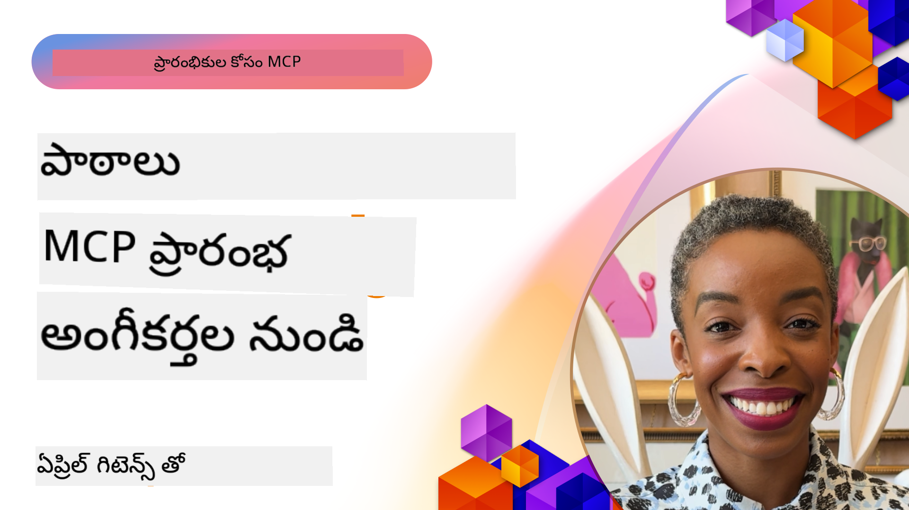

<!--
CO_OP_TRANSLATOR_METADATA:
{
  "original_hash": "41f16dac486d2086a53bc644a01cbe42",
  "translation_date": "2025-12-11T09:51:36+00:00",
  "source_file": "07-LessonsfromEarlyAdoption/README.md",
  "language_code": "te"
}
-->
# 🌟 ప్రారంభ దత్తతదారుల నుండి పాఠాలు

[](https://youtu.be/jds7dSmNptE)

_(ఈ పాఠం వీడియోను చూడడానికి పై చిత్రాన్ని క్లిక్ చేయండి)_

## 🎯 ఈ మాడ్యూల్ ఏమి కవర్ చేస్తుంది

ఈ మాడ్యూల్ నిజమైన సంస్థలు మరియు డెవలపర్లు మోడల్ కాంటెక్స్ట్ ప్రోటోకాల్ (MCP) ను ఎలా ఉపయోగించి వాస్తవ సవాళ్లను పరిష్కరించుకుంటున్నారో మరియు ఆవిష్కరణను ఎలా నడిపిస్తున్నారో పరిశీలిస్తుంది. వివరమైన కేసు స్టడీలు, ప్రాక్టికల్ ఉదాహరణల ద్వారా, మీరు MCP భద్రతతో, స్కేలబుల్ AI ఇంటిగ్రేషన్‌ను ఎలా సాధించవచ్చో తెలుసుకుంటారు, ఇది భాషా మోడల్స్, టూల్స్ మరియు ఎంటర్ప్రైజ్ డేటాను కలుపుతుంది.

### 📚 MCP ను చర్యలో చూడండి

ఈ సూత్రాలను ప్రొడక్షన్-రెడీ టూల్స్‌లో ఎలా వర్తింపజేస్తున్నారో చూడాలనుకుంటున్నారా? మా [**10 Microsoft MCP Servers That Are Transforming Developer Productivity**](microsoft-mcp-servers.md) ను చూడండి, ఇది మీరు ఈ రోజు ఉపయోగించగల నిజమైన Microsoft MCP సర్వర్లను ప్రదర్శిస్తుంది.

## అవలోకనం

ఈ పాఠం ప్రారంభ దత్తతదారులు మోడల్ కాంటెక్స్ట్ ప్రోటోకాల్ (MCP) ను వాస్తవ ప్రపంచ సవాళ్లను పరిష్కరించడానికి మరియు పరిశ్రమలలో ఆవిష్కరణను నడిపించడానికి ఎలా ఉపయోగించారో పరిశీలిస్తుంది. వివరమైన కేసు స్టడీలు మరియు ప్రాక్టికల్ ప్రాజెక్టుల ద్వారా, మీరు MCP ఎలా ప్రమాణీకృత, భద్రతతో కూడిన, స్కేలబుల్ AI ఇంటిగ్రేషన్‌ను సాధించగలదో చూడగలుగుతారు—పెద్ద భాషా మోడల్స్, టూల్స్ మరియు ఎంటర్ప్రైజ్ డేటాను ఒక ఏకీకృత ఫ్రేమ్‌వర్క్‌లో కలుపుతుంది. మీరు MCP ఆధారిత పరిష్కారాలను డిజైన్ చేసి నిర్మించడంలో ప్రాక్టికల్ అనుభవం పొందుతారు, నిరూపిత అమలు నమూనాల నుండి నేర్చుకుంటారు, మరియు ప్రొడక్షన్ వాతావరణాలలో MCP ను అమలు చేయడానికి ఉత్తమ పద్ధతులను కనుగొంటారు. ఈ పాఠం MCP సాంకేతికత మరియు దాని అభివృద్ధి చెందుతున్న ఎకోసిస్టమ్‌లో ముందంజలో ఉండేందుకు సహాయపడే కొత్త ధోరణులు, భవిష్యత్తు దిశలు మరియు ఓపెన్-సోర్స్ వనరులను కూడా హైలైట్ చేస్తుంది.

## నేర్చుకునే లక్ష్యాలు

- వివిధ పరిశ్రమలలో వాస్తవ MCP అమలులను విశ్లేషించండి
- పూర్తి MCP ఆధారిత అప్లికేషన్లను డిజైన్ చేసి నిర్మించండి
- MCP సాంకేతికతలో కొత్త ధోరణులు మరియు భవిష్యత్తు దిశలను అన్వేషించండి
- వాస్తవ అభివృద్ధి సందర్భాలలో ఉత్తమ పద్ధతులను వర్తింపజేయండి

## వాస్తవ MCP అమలులు

### కేసు స్టడీ 1: ఎంటర్ప్రైజ్ కస్టమర్ సపోర్ట్ ఆటోమేషన్

ఒక బహుళజాతీయ సంస్థ MCP ఆధారిత పరిష్కారాన్ని అమలు చేసి వారి కస్టమర్ సపోర్ట్ సిస్టమ్స్‌లో AI ఇంటరాక్షన్లను ప్రమాణీకృతం చేసింది. దీని ద్వారా వారు:

- బహుళ LLM ప్రొవైడర్ల కోసం ఏకీకృత ఇంటర్‌ఫేస్ సృష్టించారు
- విభాగాల మధ్య సజావుగా ప్రాంప్ట్ నిర్వహణను నిర్వహించారు
- బలమైన భద్రత మరియు అనుగుణత నియంత్రణలను అమలు చేశారు
- నిర్దిష్ట అవసరాల ఆధారంగా వివిధ AI మోడల్స్ మధ్య సులభంగా మార్పిడి చేసుకున్నారు

**సాంకేతిక అమలు:**

```python
# కస్టమర్ సపోర్ట్ కోసం Python MCP సర్వర్ అమలు
import logging
import asyncio
from modelcontextprotocol import create_server, ServerConfig
from modelcontextprotocol.server import MCPServer
from modelcontextprotocol.transports import create_http_transport
from modelcontextprotocol.resources import ResourceDefinition
from modelcontextprotocol.prompts import PromptDefinition
from modelcontextprotocol.tool import ToolDefinition

# లాగింగ్‌ను కాన్ఫిగర్ చేయండి
logging.basicConfig(level=logging.INFO)

async def main():
    # సర్వర్ కాన్ఫిగరేషన్ సృష్టించండి
    config = ServerConfig(
        name="Enterprise Customer Support Server",
        version="1.0.0",
        description="MCP server for handling customer support inquiries"
    )
    
    # MCP సర్వర్‌ను ప్రారంభించండి
    server = create_server(config)
    
    # జ్ఞాన ఆధార వనరులను నమోదు చేయండి
    server.resources.register(
        ResourceDefinition(
            name="customer_kb",
            description="Customer knowledge base documentation"
        ),
        lambda params: get_customer_documentation(params)
    )
    
    # ప్రాంప్ట్ టెంప్లేట్లను నమోదు చేయండి
    server.prompts.register(
        PromptDefinition(
            name="support_template",
            description="Templates for customer support responses"
        ),
        lambda params: get_support_templates(params)
    )
    
    # సపోర్ట్ టూల్స్‌ను నమోదు చేయండి
    server.tools.register(
        ToolDefinition(
            name="ticketing",
            description="Create and update support tickets"
        ),
        handle_ticketing_operations
    )
    
    # HTTP ట్రాన్స్‌పోర్ట్‌తో సర్వర్‌ను ప్రారంభించండి
    transport = create_http_transport(port=8080)
    await server.run(transport)

if __name__ == "__main__":
    asyncio.run(main())
```
  
**ఫలితాలు:** మోడల్ ఖర్చులు 30% తగ్గింపు, స్పందన సజావుగా ఉండటం 45% మెరుగుదల, మరియు గ్లోబల్ ఆపరేషన్లలో అనుగుణత పెరుగుదల.

### కేసు స్టడీ 2: హెల్త్‌కేర్ డయాగ్నోస్టిక్ అసిస్టెంట్

ఒక హెల్త్‌కేర్ ప్రొవైడర్ MCP మౌలిక సదుపాయాన్ని అభివృద్ధి చేసి అనేక ప్రత్యేక వైద్య AI మోడల్స్‌ను ఇంటిగ్రేట్ చేయగా, సున్నితమైన రోగి డేటా రక్షణను నిర్ధారించాడు:

- సాధారణ మరియు ప్రత్యేక వైద్య మోడల్స్ మధ్య సజావుగా మార్పిడి
- కఠిన గోప్యత నియంత్రణలు మరియు ఆడిట్ ట్రైల్స్
- ఉన్న ఎలక్ట్రానిక్ హెల్త్ రికార్డ్ (EHR) సిస్టమ్స్‌తో ఇంటిగ్రేషన్
- వైద్య పదజాలం కోసం సజావుగా ప్రాంప్ట్ ఇంజనీరింగ్

**సాంకేతిక అమలు:**

```csharp
// C# MCP host application implementation in healthcare application
using Microsoft.Extensions.DependencyInjection;
using ModelContextProtocol.SDK.Client;
using ModelContextProtocol.SDK.Security;
using ModelContextProtocol.SDK.Resources;

public class DiagnosticAssistant
{
    private readonly MCPHostClient _mcpClient;
    private readonly PatientContext _patientContext;
    
    public DiagnosticAssistant(PatientContext patientContext)
    {
        _patientContext = patientContext;
        
        // Configure MCP client with healthcare-specific settings
        var clientOptions = new ClientOptions
        {
            Name = "Healthcare Diagnostic Assistant",
            Version = "1.0.0",
            Security = new SecurityOptions
            {
                Encryption = EncryptionLevel.Medical,
                AuditEnabled = true
            }
        };
        
        _mcpClient = new MCPHostClientBuilder()
            .WithOptions(clientOptions)
            .WithTransport(new HttpTransport("https://healthcare-mcp.example.org"))
            .WithAuthentication(new HIPAACompliantAuthProvider())
            .Build();
    }
    
    public async Task<DiagnosticSuggestion> GetDiagnosticAssistance(
        string symptoms, string patientHistory)
    {
        // Create request with appropriate resources and tool access
        var resourceRequest = new ResourceRequest
        {
            Name = "patient_records",
            Parameters = new Dictionary<string, object>
            {
                ["patientId"] = _patientContext.PatientId,
                ["requestingProvider"] = _patientContext.ProviderId
            }
        };
        
        // Request diagnostic assistance using appropriate prompt
        var response = await _mcpClient.SendPromptRequestAsync(
            promptName: "diagnostic_assistance",
            parameters: new Dictionary<string, object>
            {
                ["symptoms"] = symptoms,
                patientHistory = patientHistory,
                relevantGuidelines = _patientContext.GetRelevantGuidelines()
            });
            
        return DiagnosticSuggestion.FromMCPResponse(response);
    }
}
```
  
**ఫలితాలు:** వైద్యులకు మెరుగైన డయాగ్నోస్టిక్ సూచనలు, పూర్తి HIPAA అనుగుణతతో పాటు సిస్టమ్స్ మధ్య కాంటెక్స్ట్-స్విచింగ్ గణనీయమైన తగ్గింపు.

### కేసు స్టడీ 3: ఫైనాన్షియల్ సర్వీసెస్ రిస్క్ అనాలిసిస్

ఒక ఆర్థిక సంస్థ MCP ను అమలు చేసి వివిధ విభాగాలలో వారి రిస్క్ అనాలిసిస్ ప్రక్రియలను ప్రమాణీకృతం చేసింది:

- క్రెడిట్ రిస్క్, ఫ్రాడ్ డిటెక్షన్, మరియు ఇన్వెస్ట్‌మెంట్ రిస్క్ మోడల్స్ కోసం ఏకీకృత ఇంటర్‌ఫేస్ సృష్టించింది
- కఠిన యాక్సెస్ నియంత్రణలు మరియు మోడల్ వెర్షనింగ్ అమలు చేసింది
- అన్ని AI సిఫారసుల ఆడిటబిలిటీని నిర్ధారించింది
- విభిన్న సిస్టమ్స్‌లో డేటా ఫార్మాటింగ్ సజావుగా నిర్వహించింది

**సాంకేతిక అమలు:**

```java
// ఆర్థిక ప్రమాద అంచనాకు జావా MCP సర్వర్
import org.mcp.server.*;
import org.mcp.security.*;

public class FinancialRiskMCPServer {
    public static void main(String[] args) {
        // ఆర్థిక అనుగుణత లక్షణాలతో MCP సర్వర్ సృష్టించండి
        MCPServer server = new MCPServerBuilder()
            .withModelProviders(
                new ModelProvider("risk-assessment-primary", new AzureOpenAIProvider()),
                new ModelProvider("risk-assessment-audit", new LocalLlamaProvider())
            )
            .withPromptTemplateDirectory("./compliance/templates")
            .withAccessControls(new SOCCompliantAccessControl())
            .withDataEncryption(EncryptionStandard.FINANCIAL_GRADE)
            .withVersionControl(true)
            .withAuditLogging(new DatabaseAuditLogger())
            .build();
            
        server.addRequestValidator(new FinancialDataValidator());
        server.addResponseFilter(new PII_RedactionFilter());
        
        server.start(9000);
        
        System.out.println("Financial Risk MCP Server running on port 9000");
    }
}
```
  
**ఫలితాలు:** నియంత్రణ అనుగుణత మెరుగుదల, 40% వేగవంతమైన మోడల్ డిప్లాయ్‌మెంట్ సైకిల్స్, మరియు విభాగాల మధ్య రిస్క్ అంచనా సజావుగా ఉండటం.

### కేసు స్టడీ 4: Microsoft Playwright MCP సర్వర్ బ్రౌజర్ ఆటోమేషన్ కోసం

Microsoft [Playwright MCP సర్వర్](https://github.com/microsoft/playwright-mcp) ను అభివృద్ధి చేసి మోడల్ కాంటెక్స్ట్ ప్రోటోకాల్ ద్వారా భద్రతతో కూడిన, ప్రమాణీకృత బ్రౌజర్ ఆటోమేషన్‌ను సాధించింది. ఈ ప్రొడక్షన్-రెడీ సర్వర్ AI ఏజెంట్లు మరియు LLM లకు వెబ్ బ్రౌజర్లతో నియంత్రిత, ఆడిటబుల్, మరియు విస్తరించదగిన విధంగా ఇంటరాక్ట్ అవ్వడానికి అనుమతిస్తుంది—ఆటోమేటెడ్ వెబ్ టెస్టింగ్, డేటా ఎక్స్‌ట్రాక్షన్, మరియు ఎండ్-టు-ఎండ్ వర్క్‌ఫ్లోల వంటి వినియోగాల కోసం.

> **🎯 ప్రొడక్షన్ రెడీ టూల్**  
>  
> ఈ కేసు స్టడీ మీరు ఈ రోజు ఉపయోగించగల నిజమైన MCP సర్వర్‌ను ప్రదర్శిస్తుంది! Playwright MCP సర్వర్ మరియు ఇతర 9 ప్రొడక్షన్-రెడీ Microsoft MCP సర్వర్ల గురించి మా [**Microsoft MCP Servers Guide**](microsoft-mcp-servers.md#8--playwright-mcp-server) లో తెలుసుకోండి.

**ప్రధాన లక్షణాలు:**  
- బ్రౌజర్ ఆటోమేషన్ సామర్థ్యాలను (నావిగేషన్, ఫారం పూరణ, స్క్రీన్‌షాట్ క్యాప్చర్ మొదలైనవి) MCP టూల్స్‌గా అందిస్తుంది  
- అనధికార చర్యలను నివారించడానికి కఠిన యాక్సెస్ నియంత్రణలు మరియు సాండ్‌బాక్సింగ్ అమలు చేస్తుంది  
- అన్ని బ్రౌజర్ ఇంటరాక్షన్లకు వివరమైన ఆడిట్ లాగ్స్ అందిస్తుంది  
- ఏజెంట్-డ్రైవన్ ఆటోమేషన్ కోసం Azure OpenAI మరియు ఇతర LLM ప్రొవైడర్లతో ఇంటిగ్రేషన్‌ను మద్దతు ఇస్తుంది  
- GitHub Copilot యొక్క కోడింగ్ ఏజెంట్‌కు వెబ్ బ్రౌజింగ్ సామర్థ్యాలను అందిస్తుంది  

**సాంకేతిక అమలు:**

```typescript
// TypeScript: MCP సర్వర్‌లో Playwright బ్రౌజర్ ఆటోమేషన్ టూల్స్‌ను నమోదు చేయడం
import { createServer, ToolDefinition } from 'modelcontextprotocol';
import { launch } from 'playwright';

const server = createServer({
  name: 'Playwright MCP Server',
  version: '1.0.0',
  description: 'MCP server for browser automation using Playwright'
});

// URLకి నావిగేట్ చేయడానికి మరియు స్క్రీన్‌షాట్ తీసుకోవడానికి ఒక టూల్‌ను నమోదు చేయండి
server.tools.register(
  new ToolDefinition({
    name: 'navigate_and_screenshot',
    description: 'Navigate to a URL and capture a screenshot',
    parameters: {
      url: { type: 'string', description: 'The URL to visit' }
    }
  }),
  async ({ url }) => {
    const browser = await launch();
    const page = await browser.newPage();
    await page.goto(url);
    const screenshot = await page.screenshot();
    await browser.close();
    return { screenshot };
  }
);

// MCP సర్వర్‌ను ప్రారంభించండి
server.listen(8080);
```
  
**ఫలితాలు:**  

- AI ఏజెంట్లు మరియు LLM ల కోసం భద్రతతో కూడిన ప్రోగ్రామాటిక్ బ్రౌజర్ ఆటోమేషన్ సాధ్యం  
- మాన్యువల్ టెస్టింగ్ శ్రమ తగ్గింపు మరియు వెబ్ అప్లికేషన్ల కోసం మెరుగైన టెస్ట్ కవరేజ్  
- ఎంటర్ప్రైజ్ వాతావరణాలలో బ్రౌజర్ ఆధారిత టూల్ ఇంటిగ్రేషన్ కోసం పునర్వినియోగపరచదగిన, విస్తరించదగిన ఫ్రేమ్‌వర్క్ అందించింది  
- GitHub Copilot యొక్క వెబ్ బ్రౌజింగ్ సామర్థ్యాలను శక్తివంతం చేసింది  

**సూచనలు:**  

- [Playwright MCP Server GitHub Repository](https://github.com/microsoft/playwright-mcp)  
- [Microsoft AI and Automation Solutions](https://azure.microsoft.com/en-us/products/ai-services/)  

### కేసు స్టడీ 5: Azure MCP – ఎంటర్ప్రైజ్-గ్రేడ్ మోడల్ కాంటెక్స్ట్ ప్రోటోకాల్ సర్వీస్‌గా

Azure MCP ([https://aka.ms/azmcp](https://aka.ms/azmcp)) Microsoft యొక్క నిర్వహించబడే, ఎంటర్ప్రైజ్-గ్రేడ్ మోడల్ కాంటెక్స్ట్ ప్రోటోకాల్ అమలు, ఇది స్కేలబుల్, భద్రతతో కూడిన, మరియు అనుగుణమైన MCP సర్వర్ సామర్థ్యాలను క్లౌడ్ సర్వీస్‌గా అందిస్తుంది. ఈ సమగ్ర సూట్ వివిధ Azure సేవలు మరియు సందర్భాల కోసం ప్రత్యేక MCP సర్వర్లను కలిగి ఉంది.

[Microsoft MCP Center](https://mcp.azure.com) Azure API సెంటర్‌తో మీ స్కేలబుల్, ఎంటర్ప్రైజ్-రెడీ MCP రిజిస్ట్రీని నిర్మించండి; ఇది అందుబాటులో ఉన్న Microsoft MCP సర్వర్ల క్యాటలాగ్.

> **🎯 ప్రొడక్షన్ రెడీ టూల్స్**  
>  
> ఈ కేసు స్టడీ అనేక ప్రొడక్షన్-రెడీ MCP సర్వర్లను సూచిస్తుంది! Azure MCP సర్వర్ మరియు ఇతర Azure-ఇంటిగ్రేటెడ్ సర్వర్ల గురించి మా [**Microsoft MCP Servers Guide**](microsoft-mcp-servers.md#2--azure-mcp-server) లో తెలుసుకోండి.

**ప్రధాన లక్షణాలు:**  
- అంతర్గత స్కేలింగ్, మానిటరింగ్, మరియు భద్రతతో పూర్తిగా నిర్వహించబడే MCP సర్వర్ హోస్టింగ్  
- Azure OpenAI, Azure AI Search, మరియు ఇతర Azure సేవలతో స్వదేశీ ఇంటిగ్రేషన్  
- Microsoft Entra ID ద్వారా ఎంటర్ప్రైజ్ ఆథెంటికేషన్ మరియు ఆథరైజేషన్  
- కస్టమ్ టూల్స్, ప్రాంప్ట్ టెంప్లేట్స్, మరియు రిసోర్స్ కనెక్టర్లకు మద్దతు  
- ఎంటర్ప్రైజ్ భద్రత మరియు నియంత్రణ అవసరాలకు అనుగుణత  
- డేటాబేస్, మానిటరింగ్, మరియు స్టోరేజ్ సహా 15+ ప్రత్యేక Azure సేవ కనెక్టర్లు  

**Azure MCP సర్వర్ సామర్థ్యాలు:**  
- **రిసోర్స్ మేనేజ్‌మెంట్**: పూర్తి Azure రిసోర్స్ లైఫ్‌సైకిల్ మేనేజ్‌మెంట్  
- **డేటాబేస్ కనెక్టర్లు**: Azure Database for PostgreSQL మరియు SQL Server కు ప్రత్యక్ష ప్రాప్తి  
- **Azure Monitor**: KQL ఆధారిత లాగ్ విశ్లేషణ మరియు ఆపరేషనల్ ఇన్‌సైట్స్  
- **ఆథెంటికేషన్**: DefaultAzureCredential మరియు మేనేజ్డ్ ఐడెంటిటీ నమూనాలు  
- **స్టోరేజ్ సర్వీసులు**: బ్లాబ్ స్టోరేజ్, క్యూయూ స్టోరేజ్, మరియు టేబుల్ స్టోరేజ్ ఆపరేషన్లు  
- **కంటైనర్ సర్వీసులు**: Azure Container Apps, Container Instances, మరియు AKS మేనేజ్‌మెంట్  

**సాంకేతిక అమలు:**

```yaml
# Example: Azure MCP server deployment configuration (YAML)
apiVersion: mcp.microsoft.com/v1
kind: McpServer
metadata:
  name: enterprise-mcp-server
spec:
  modelProviders:
    - name: azure-openai
      type: AzureOpenAI
      endpoint: https://<your-openai-resource>.openai.azure.com/
      apiKeySecret: <your-azure-keyvault-secret>
  tools:
    - name: document_search
      type: AzureAISearch
      endpoint: https://<your-search-resource>.search.windows.net/
      apiKeySecret: <your-azure-keyvault-secret>
  authentication:
    type: EntraID
    tenantId: <your-tenant-id>
  monitoring:
    enabled: true
    logAnalyticsWorkspace: <your-log-analytics-id>
```
  
**ఫలితాలు:**  
- ఎంటర్ప్రైజ్ AI ప్రాజెక్టుల కోసం రెడీ-టు-యూజ్, అనుగుణమైన MCP సర్వర్ ప్లాట్‌ఫారమ్ అందించడం ద్వారా విలువకు సమయం తగ్గింపు  
- LLM లు, టూల్స్, మరియు ఎంటర్ప్రైజ్ డేటా సోర్సుల సులభమైన ఇంటిగ్రేషన్  
- MCP వర్క్‌లోడ్స్ కోసం మెరుగైన భద్రత, ఆబ్జర్వబిలిటీ, మరియు ఆపరేషనల్ సామర్థ్యం  
- Azure SDK ఉత్తమ పద్ధతులు మరియు ప్రస్తుత ఆథెంటికేషన్ నమూనాలతో మెరుగైన కోడ్ నాణ్యత  

**సూచనలు:**  
- [Azure MCP Documentation](https://aka.ms/azmcp)  
- [Azure MCP Server GitHub Repository](https://github.com/Azure/azure-mcp)  
- [Azure AI Services](https://azure.microsoft.com/en-us/products/ai-services/)  
- [Microsoft MCP Center](https://mcp.azure.com)  

## కేసు స్టడీ 6: NLWeb  
MCP (Model Context Protocol) టూల్స్‌తో చాట్‌బాట్స్ మరియు AI అసిస్టెంట్స్ ఇంటరాక్ట్ అయ్యేందుకు ఒక అభివృద్ధి చెందుతున్న ప్రోటోకాల్. ప్రతి NLWeb ఉదాహరణ కూడా ఒక MCP సర్వర్, ఇది ఒక కోర్ మెథడ్, ask, ను మద్దతు ఇస్తుంది, ఇది ఒక వెబ్‌సైట్‌ను సహజ భాషలో ప్రశ్న అడగడానికి ఉపయోగిస్తారు. తిరిగి వచ్చే స్పందన schema.org ను ఉపయోగిస్తుంది, ఇది వెబ్ డేటాను వివరించడానికి విస్తృతంగా ఉపయోగించే పదజాలం. సులభంగా చెప్పాలంటే, MCP అనేది NLWeb కు Http లాంటిది HTML కు. NLWeb ప్రోటోకాల్‌లు, Schema.org ఫార్మాట్లు, మరియు నమూనా కోడ్‌లను కలిపి సైట్లకు ఈ ఎండ్పాయింట్లను వేగంగా సృష్టించడంలో సహాయపడుతుంది, ఇది మానవులకు సంభాషణాత్మక ఇంటర్‌ఫేస్‌ల ద్వారా మరియు యంత్రాలకు సహజ ఏజెంట్-టు-ఏజెంట్ ఇంటరాక్షన్ ద్వారా లాభదాయకం.

NLWeb కు రెండు ప్రత్యేక భాగాలు ఉన్నాయి.  
- ఒక ప్రోటోకాల్, చాలా సులభంగా ప్రారంభించడానికి, సహజ భాషలో సైట్‌తో ఇంటరాక్ట్ చేయడానికి మరియు తిరిగి వచ్చే సమాధానానికి json మరియు schema.org ను ఉపయోగించే ఫార్మాట్. REST API పై డాక్యుమెంటేషన్ చూడండి.  
- (1) యొక్క సరళమైన అమలు, ఇప్పటికే ఉన్న మార్కప్‌ను ఉపయోగించి, జాబితాలుగా (ఉత్పత్తులు, రెసిపీలు, ఆకర్షణలు, సమీక్షలు మొదలైనవి) సైట్లను సారాంశం చేయగలిగే సైట్ల కోసం. యూజర్ ఇంటర్‌ఫేస్ విడ్జెట్లతో కలిసి, సైట్లు తమ కంటెంట్‌కు సంభాషణాత్మక ఇంటర్‌ఫేస్‌లను సులభంగా అందించగలవు. ఇది ఎలా పనిచేస్తుందో Life of a chat query డాక్యుమెంటేషన్ చూడండి.

**సూచనలు:**  
- [Azure MCP Documentation](https://aka.ms/azmcp)  
- [NLWeb](https://github.com/microsoft/NlWeb)  

### కేసు స్టడీ 7: Azure AI Foundry MCP సర్వర్ – ఎంటర్ప్రైజ్ AI ఏజెంట్ ఇంటిగ్రేషన్

Azure AI Foundry MCP సర్వర్లు MCP ను ఉపయోగించి ఎంటర్ప్రైజ్ వాతావరణాలలో AI ఏజెంట్లు మరియు వర్క్‌ఫ్లోలను ఎలా ఆర్కెస్ట్రేట్ చేసి నిర్వహించవచ్చో చూపిస్తాయి. MCP ను Azure AI Foundry తో ఇంటిగ్రేట్ చేయడం ద్వారా, సంస్థలు ఏజెంట్ ఇంటరాక్షన్లను ప్రమాణీకృతం చేయగలవు, Foundry యొక్క వర్క్‌ఫ్లో మేనేజ్‌మెంట్‌ను ఉపయోగించగలవు, మరియు భద్రతతో కూడిన, స్కేలబుల్ డిప్లాయ్‌మెంట్‌లను నిర్ధారించగలవు.

> **🎯 ప్రొడక్షన్ రెడీ టూల్**  
>  
> ఇది మీరు ఈ రోజు ఉపయోగించగల నిజమైన MCP సర్వర్! Azure AI Foundry MCP సర్వర్ గురించి మా [**Microsoft MCP Servers Guide**](microsoft-mcp-servers.md#9--azure-ai-foundry-mcp-server) లో తెలుసుకోండి.

**ప్రధాన లక్షణాలు:**  
- Azure యొక్క AI ఎకోసిస్టమ్‌కు సమగ్ర ప్రాప్తి, మోడల్ క్యాటలాగ్లు మరియు డిప్లాయ్‌మెంట్ మేనేజ్‌మెంట్ సహా  
- RAG అప్లికేషన్ల కోసం Azure AI Search తో జ్ఞాన సూచిక  
- AI మోడల్ పనితీరు మరియు నాణ్యత హామీ కోసం మూల్యాంకన టూల్స్  
- Azure AI Foundry క్యాటలాగ్ మరియు ల్యాబ్స్‌తో ఆధునిక పరిశోధన మోడల్స్ ఇంటిగ్రేషన్  
- ప్రొడక్షన్ సందర్భాల కోసం ఏజెంట్ మేనేజ్‌మెంట్ మరియు మూల
**ఎందుకు ఇది కీలకం:**
- మైక్రోసాఫ్ట్ సాంకేతికతలకు "పాతతనమైన AI జ్ఞానం" సమస్యను పరిష్కరిస్తుంది
- AI సహాయకులకు తాజా .NET, C#, Azure, మరియు Microsoft 365 ఫీచర్లకు ప్రాప్తిని నిర్ధారిస్తుంది
- ఖచ్చితమైన కోడ్ ఉత్పత్తికి అధికారిక, మొదటి-పక్ష సమాచారం అందిస్తుంది
- వేగంగా అభివృద్ధి చెందుతున్న మైక్రోసాఫ్ట్ సాంకేతికతలతో పని చేసే డెవలపర్లకు అవసరం

**ఫలితాలు:**
- మైక్రోసాఫ్ట్ సాంకేతికతల కోసం AI-సృష్టించిన కోడ్ ఖచ్చితత్వం గణనీయంగా మెరుగుపడింది
- ప్రస్తుత డాక్యుమెంటేషన్ మరియు ఉత్తమ పద్ధతుల కోసం వెతకడంలో ఖర్చు అయ్యే సమయం తగ్గింది
- సందర్భాన్ని అర్థం చేసుకునే డాక్యుమెంటేషన్ రిట్రీవల్ తో డెవలపర్ ఉత్పాదకత పెరిగింది
- IDE నుండి బయటకు వెళ్లకుండా అభివృద్ధి వర్క్‌ఫ్లోలతో సజావుగా సమ్మిళితం

**సూచనలు:**
- [Microsoft Learn Docs MCP Server GitHub Repository](https://github.com/MicrosoftDocs/mcp)
- [Microsoft Learn Documentation](https://learn.microsoft.com/)

## హ్యాండ్స్-ఆన్ ప్రాజెక్టులు

### ప్రాజెక్ట్ 1: బహుళ-ప్రొవైడర్ MCP సర్వర్ నిర్మాణం

**లక్ష్యం:** నిర్దిష్ట ప్రమాణాల ఆధారంగా అనేక AI మోడల్ ప్రొవైడర్లకు అభ్యర్థనలను రూట్ చేయగల MCP సర్వర్ సృష్టించండి.

**అవసరాలు:**

- కనీసం మూడు వేర్వేరు మోడల్ ప్రొవైడర్లకు మద్దతు (ఉదా: OpenAI, Anthropic, లోకల్ మోడల్స్)
- అభ్యర్థన మెటాడేటా ఆధారంగా రూటింగ్ మెకానిజం అమలు చేయండి
- ప్రొవైడర్ క్రెడెన్షియల్స్ నిర్వహణ కోసం కాన్ఫిగరేషన్ సిస్టమ్ సృష్టించండి
- పనితీరు మరియు ఖర్చులను మెరుగుపరచడానికి క్యాషింగ్ జోడించండి
- వినియోగాన్ని పర్యవేక్షించడానికి సులభమైన డాష్‌బోర్డ్ నిర్మించండి

**అమలు దశలు:**

1. ప్రాథమిక MCP సర్వర్ మౌలిక సదుపాయాలను ఏర్పాటు చేయండి
2. ప్రతి AI మోడల్ సేవ కోసం ప్రొవైడర్ అడాప్టర్లను అమలు చేయండి
3. అభ్యర్థన లక్షణాల ఆధారంగా రూటింగ్ లాజిక్ సృష్టించండి
4. తరచుగా వచ్చే అభ్యర్థనలకు క్యాషింగ్ మెకానిజంలను జోడించండి
5. పర్యవేక్షణ డాష్‌బోర్డ్ అభివృద్ధి చేయండి
6. వివిధ అభ్యర్థన నమూనాలతో పరీక్షించండి

**సాంకేతికతలు:** మీ ఇష్టానుసారం Python (.NET/Java/Python), క్యాషింగ్ కోసం Redis, మరియు డాష్‌బోర్డ్ కోసం సులభమైన వెబ్ ఫ్రేమ్‌వర్క్.

### ప్రాజెక్ట్ 2: ఎంటర్ప్రైజ్ ప్రాంప్ట్ నిర్వహణ వ్యవస్థ

**లక్ష్యం:** సంస్థ అంతటా ప్రాంప్ట్ టెంప్లేట్లను నిర్వహించడానికి, వెర్షనింగ్ చేయడానికి, మరియు డిప్లాయ్ చేయడానికి MCP ఆధారిత వ్యవస్థ అభివృద్ధి చేయండి.

**అవసరాలు:**

- ప్రాంప్ట్ టెంప్లేట్ల కోసం కేంద్రీకృత రిపాజిటరీ సృష్టించండి
- వెర్షనింగ్ మరియు ఆమోద వర్క్‌ఫ్లోలను అమలు చేయండి
- నమూనా ఇన్‌పుట్‌లతో టెంప్లేట్ పరీక్షా సామర్థ్యాలను నిర్మించండి
- పాత్ర ఆధారిత యాక్సెస్ నియంత్రణలను అభివృద్ధి చేయండి
- టెంప్లేట్ రిట్రీవల్ మరియు డిప్లాయ్‌మెంట్ కోసం API సృష్టించండి

**అమలు దశలు:**

1. టెంప్లేట్ నిల్వ కోసం డేటాబేస్ స్కీమాను డిజైన్ చేయండి
2. టెంప్లేట్ CRUD ఆపరేషన్ల కోసం కోర్ API సృష్టించండి
3. వెర్షనింగ్ సిస్టమ్ అమలు చేయండి
4. ఆమోద వర్క్‌ఫ్లో నిర్మించండి
5. పరీక్షా ఫ్రేమ్‌వర్క్ అభివృద్ధి చేయండి
6. నిర్వహణ కోసం సులభమైన వెబ్ ఇంటర్‌ఫేస్ సృష్టించండి
7. MCP సర్వర్‌తో సమ్మిళితం చేయండి

**సాంకేతికతలు:** మీ ఇష్టమైన బ్యాక్‌ఎండ్ ఫ్రేమ్‌వర్క్, SQL లేదా NoSQL డేటాబేస్, మరియు ఫ్రంట్‌ఎండ్ ఫ్రేమ్‌వర్క్.

### ప్రాజెక్ట్ 3: MCP ఆధారిత కంటెంట్ ఉత్పత్తి వేదిక

**లక్ష్యం:** వివిధ కంటెంట్ రకాలపై సुसంగత ఫలితాలను అందించడానికి MCP ఉపయోగించే కంటెంట్ ఉత్పత్తి వేదికను నిర్మించండి.

**అవసరాలు:**

- బ్లాగ్ పోస్టులు, సోషల్ మీడియా, మార్కెటింగ్ కాపీ వంటి బహుళ కంటెంట్ ఫార్మాట్లకు మద్దతు
- అనుకూలీకరణ ఎంపికలతో టెంప్లేట్ ఆధారిత ఉత్పత్తి అమలు చేయండి
- కంటెంట్ సమీక్ష మరియు అభిప్రాయం వ్యవస్థ సృష్టించండి
- కంటెంట్ పనితీరు మెట్రిక్స్ ట్రాక్ చేయండి
- కంటెంట్ వెర్షనింగ్ మరియు పునరావృతానికి మద్దతు ఇవ్వండి

**అమలు దశలు:**

1. MCP క్లయింట్ మౌలిక సదుపాయాలను ఏర్పాటు చేయండి
2. వివిధ కంటెంట్ రకాల కోసం టెంప్లేట్లను సృష్టించండి
3. కంటెంట్ ఉత్పత్తి పైప్‌లైన్ నిర్మించండి
4. సమీక్ష వ్యవస్థను అమలు చేయండి
5. మెట్రిక్స్ ట్రాకింగ్ సిస్టమ్ అభివృద్ధి చేయండి
6. టెంప్లేట్ నిర్వహణ మరియు కంటెంట్ ఉత్పత్తి కోసం యూజర్ ఇంటర్‌ఫేస్ సృష్టించండి

**సాంకేతికతలు:** మీ ఇష్టమైన ప్రోగ్రామింగ్ భాష, వెబ్ ఫ్రేమ్‌వర్క్, మరియు డేటాబేస్ సిస్టమ్.

## MCP సాంకేతికతకు భవిష్యత్తు దిశలు

### ఉద్భవిస్తున్న ధోరణులు

1. **బహుముఖ MCP**
   - చిత్రాలు, ఆడియో, మరియు వీడియో మోడల్స్‌తో పరస్పర చర్యలను ప్రమాణీకరించడానికి MCP విస్తరణ
   - క్రాస్-మోడల్ రీజనింగ్ సామర్థ్యాల అభివృద్ధి
   - వివిధ మోడాలిటీల కోసం ప్రమాణీకృత ప్రాంప్ట్ ఫార్మాట్లు

2. **ఫెడరేటెడ్ MCP మౌలిక సదుపాయాలు**
   - సంస్థల మధ్య వనరులను పంచుకునే పంపిణీచేసిన MCP నెట్‌వర్క్లు
   - సురక్షిత మోడల్ పంచుకునే ప్రమాణీకృత ప్రోటోకాల్స్
   - గోప్యతను కాపాడే కంప్యూటింగ్ సాంకేతికతలు

3. **MCP మార్కెట్‌ప్లేస్‌లు**
   - MCP టెంప్లేట్లు మరియు ప్లగిన్లను పంచుకునే మరియు ఆదాయం పొందే ఎకోసిస్టమ్స్
   - నాణ్యత హామీ మరియు సర్టిఫికేషన్ ప్రక్రియలు
   - మోడల్ మార్కెట్‌ప్లేస్‌లతో సమ్మిళితం

4. **ఎడ్జ్ కంప్యూటింగ్ కోసం MCP**
   - వనరుల పరిమితి ఉన్న ఎడ్జ్ పరికరాల కోసం MCP ప్రమాణాల అనుకూలీకరణ
   - తక్కువ బ్యాండ్‌విడ్త్ వాతావరణాల కోసం ఆప్టిమైజ్డ్ ప్రోటోకాల్స్
   - IoT ఎకోసిస్టమ్స్ కోసం ప్రత్యేక MCP అమలు

5. **నియంత్రణ ఫ్రేమ్‌వర్క్‌లు**
   - నియంత్రణ అనుగుణత కోసం MCP విస్తరణల అభివృద్ధి
   - ప్రమాణీకృత ఆడిట్ ట్రైల్స్ మరియు వివరణాత్మక ఇంటర్‌ఫేస్‌లు
   - అభివృద్ధి చెందుతున్న AI పాలన ఫ్రేమ్‌వర్క్‌లతో సమ్మిళితం

### మైక్రోసాఫ్ట్ నుండి MCP పరిష్కారాలు

మైక్రోసాఫ్ట్ మరియు Azure డెవలపర్లకు వివిధ సందర్భాలలో MCP అమలు చేయడానికి సహాయపడే అనేక ఓపెన్-సోర్స్ రిపాజిటరీలను అభివృద్ధి చేశారు:

#### Microsoft Organization

1. [playwright-mcp](https://github.com/microsoft/playwright-mcp) - బ్రౌజర్ ఆటోమేషన్ మరియు పరీక్షల కోసం Playwright MCP సర్వర్
2. [files-mcp-server](https://github.com/microsoft/files-mcp-server) - లోకల్ పరీక్ష మరియు కమ్యూనిటీ సహకారానికి OneDrive MCP సర్వర్ అమలు
3. [NLWeb](https://github.com/microsoft/NlWeb) - NLWeb అనేది ఓపెన్ ప్రోటోకాల్స్ మరియు సంబంధిత ఓపెన్ సోర్స్ టూల్స్ సేకరణ. దీని ప్రధాన లక్ష్యం AI వెబ్ కోసం ప్రాథమిక స్థాయి ఏర్పాటు చేయడం

#### Azure-Samples Organization

1. [mcp](https://github.com/Azure-Samples/mcp) - Azureపై MCP సర్వర్లను నిర్మించడానికి మరియు సమ్మిళితం చేయడానికి నమూనాలు, టూల్స్, వనరుల లింకులు
2. [mcp-auth-servers](https://github.com/Azure-Samples/mcp-auth-servers) - ప్రస్తుత Model Context Protocol స్పెసిఫికేషన్‌తో ప్రామాణీకరణను చూపించే MCP సర్వర్ ఉదాహరణలు
3. [remote-mcp-functions](https://github.com/Azure-Samples/remote-mcp-functions) - Azure Functionsలో రిమోట్ MCP సర్వర్ అమలుల కోసం ల్యాండింగ్ పేజీ, భాషా-ప్రత్యేక రిపో లింకులతో
4. [remote-mcp-functions-python](https://github.com/Azure-Samples/remote-mcp-functions-python) - Pythonతో Azure Functions ఉపయోగించి కస్టమ్ రిమోట్ MCP సర్వర్లను నిర్మించడానికి మరియు డిప్లాయ్ చేయడానికి క్విక్‌స్టార్ట్ టెంప్లేట్
5. [remote-mcp-functions-dotnet](https://github.com/Azure-Samples/remote-mcp-functions-dotnet) - .NET/C#తో Azure Functions ఉపయోగించి కస్టమ్ రిమోట్ MCP సర్వర్లను నిర్మించడానికి మరియు డిప్లాయ్ చేయడానికి క్విక్‌స్టార్ట్ టెంప్లేట్
6. [remote-mcp-functions-typescript](https://github.com/Azure-Samples/remote-mcp-functions-typescript) - TypeScriptతో Azure Functions ఉపయోగించి కస్టమ్ రిమోట్ MCP సర్వర్లను నిర్మించడానికి మరియు డిప్లాయ్ చేయడానికి క్విక్‌స్టార్ట్ టెంప్లేట్
7. [remote-mcp-apim-functions-python](https://github.com/Azure-Samples/remote-mcp-apim-functions-python) - Python ఉపయోగించి రిమోట్ MCP సర్వర్లకు Azure API మేనేజ్‌మెంట్ AI గేట్వే
8. [AI-Gateway](https://github.com/Azure-Samples/AI-Gateway) - MCP సామర్థ్యాలతో Azure OpenAI మరియు AI Foundryతో సమ్మిళితం చేసే APIM ❤️ AI ప్రయోగాలు

ఈ రిపాజిటరీలు వివిధ ప్రోగ్రామింగ్ భాషలు మరియు Azure సేవలలో Model Context Protocolతో పని చేయడానికి వివిధ అమలు, టెంప్లేట్లు, వనరులను అందిస్తాయి. అవి ప్రాథమిక సర్వర్ అమలు నుండి ప్రామాణీకరణ, క్లౌడ్ డిప్లాయ్‌మెంట్, మరియు ఎంటర్ప్రైజ్ సమ్మిళితం దశల వరకు విస్తృత ఉపయోగాలను కవర్ చేస్తాయి.

#### MCP వనరుల డైరెక్టరీ

అధికారిక Microsoft MCP రిపాజిటరీలోని [MCP Resources directory](https://github.com/microsoft/mcp/tree/main/Resources) Model Context Protocol సర్వర్లతో ఉపయోగించడానికి నమూనా వనరులు, ప్రాంప్ట్ టెంప్లేట్లు, మరియు టూల్ నిర్వచనాల సేకరణను అందిస్తుంది. ఈ డైరెక్టరీ డెవలపర్లకు MCPతో త్వరగా ప్రారంభించడానికి పునర్వినియోగించదగిన నిర్మాణ భాగాలు మరియు ఉత్తమ పద్ధతుల ఉదాహరణలను అందిస్తుంది:

- **ప్రాంప్ట్ టెంప్లేట్లు:** సాధారణ AI పనులు మరియు సందర్భాల కోసం సిద్ధంగా ఉన్న ప్రాంప్ట్ టెంప్లేట్లు, మీ స్వంత MCP సర్వర్ అమలులకు అనుకూలీకరించవచ్చు.
- **టూల్ నిర్వచనాలు:** వివిధ MCP సర్వర్లలో టూల్ సమ్మిళితం మరియు పిలుపును ప్రమాణీకరించడానికి ఉదాహరణ టూల్ స్కీమాలు మరియు మెటాడేటా.
- **వనరు నమూనాలు:** MCP ఫ్రేమ్‌వర్క్‌లో డేటా మూలాలు, APIలు, మరియు బాహ్య సేవలతో కనెక్ట్ కావడానికి ఉదాహరణ వనరు నిర్వచనాలు.
- **సూచన అమలు:** వాస్తవ ప్రపంచ MCP ప్రాజెక్టుల్లో వనరులు, ప్రాంప్ట్‌లు, మరియు టూల్స్ ఎలా నిర్మించాలో మరియు ఏర్పాటు చేయాలో చూపించే ప్రాక్టికల్ నమూనాలు.

ఈ వనరులు అభివృద్ధిని వేగవంతం చేస్తాయి, ప్రమాణీకరణను ప్రోత్సహిస్తాయి, మరియు MCP ఆధారిత పరిష్కారాలను నిర్మించేటప్పుడు ఉత్తమ పద్ధతులను నిర్ధారించడంలో సహాయపడతాయి.

#### MCP వనరుల డైరెక్టరీ

- [MCP Resources (Sample Prompts, Tools, and Resource Definitions)](https://github.com/microsoft/mcp/tree/main/Resources)

### పరిశోధన అవకాశాలు

- MCP ఫ్రేమ్‌వర్క్‌లలో సమర్థవంతమైన ప్రాంప్ట్ ఆప్టిమైజేషన్ సాంకేతికతలు
- బహుళ-టెనెంట్ MCP డిప్లాయ్‌మెంట్‌ల కోసం భద్రతా నమూనాలు
- వివిధ MCP అమలులలో పనితీరు బెంచ్‌మార్కింగ్
- MCP సర్వర్ల కోసం ఫార్మల్ వెరిఫికేషన్ పద్ధతులు

## ముగింపు

Model Context Protocol (MCP) పరిశ్రమలలో ప్రమాణీకృత, సురక్షిత, మరియు పరస్పర క్రియాశీల AI సమ్మిళితాన్ని వేగవంతం చేస్తూ భవిష్యత్తును ఆకారంలోకి తెస్తోంది. ఈ పాఠంలో ఉన్న కేస్ స్టడీలు మరియు హ్యాండ్స్-ఆన్ ప్రాజెక్టుల ద్వారా, మీరు మైక్రోసాఫ్ట్ మరియు Azure సహా ప్రారంభ దశలో ఉన్నవారు MCPను ఎలా ఉపయోగించి వాస్తవ ప్రపంచ సవాళ్లను పరిష్కరించుకుంటున్నారో, AI ఆమోదాన్ని వేగవంతం చేస్తున్నారో, మరియు అనుగుణత, భద్రత, మరియు స్కేలబిలిటీని నిర్ధారిస్తున్నారో చూశారు. MCP యొక్క మాడ్యులర్ దృష్టికోణం సంస్థలకు పెద్ద భాషా మోడల్స్, టూల్స్, మరియు ఎంటర్ప్రైజ్ డేటాను ఏకీకృత, ఆడిటబుల్ ఫ్రేమ్‌వర్క్‌లో కనెక్ట్ చేయడానికి సహాయపడుతుంది. MCP అభివృద్ధి చెందుతూనే ఉన్నందున, కమ్యూనిటీతో చురుకుగా ఉండటం, ఓపెన్-సోర్స్ వనరులను అన్వేషించడం, మరియు ఉత్తమ పద్ధతులను అనుసరించడం బలమైన, భవిష్యత్తుకు సిద్ధమైన AI పరిష్కారాలను నిర్మించడంలో కీలకం.

## అదనపు వనరులు

- [MCP Foundry GitHub Repository](https://github.com/azure-ai-foundry/mcp-foundry)
- [Foundry MCP Playground](https://github.com/azure-ai-foundry/foundry-mcp-playground)
- [Integrating Azure AI Agents with MCP (Microsoft Foundry Blog)](https://devblogs.microsoft.com/foundry/integrating-azure-ai-agents-mcp/)
- [MCP GitHub Repository (Microsoft)](https://github.com/microsoft/mcp)
- [MCP Resources Directory (Sample Prompts, Tools, and Resource Definitions)](https://github.com/microsoft/mcp/tree/main/Resources)
- [MCP Community & Documentation](https://modelcontextprotocol.io/introduction)
- [Azure MCP Documentation](https://aka.ms/azmcp)
- [Playwright MCP Server GitHub Repository](https://github.com/microsoft/playwright-mcp)
- [Files MCP Server (OneDrive)](https://github.com/microsoft/files-mcp-server)
- [Azure-Samples MCP](https://github.com/Azure-Samples/mcp)
- [MCP Auth Servers (Azure-Samples)](https://github.com/Azure-Samples/mcp-auth-servers)
- [Remote MCP Functions (Azure-Samples)](https://github.com/Azure-Samples/remote-mcp-functions)
- [Remote MCP Functions Python (Azure-Samples)](https://github.com/Azure-Samples/remote-mcp-functions-python)
- [Remote MCP Functions .NET (Azure-Samples)](https://github.com/Azure-Samples/remote-mcp-functions-dotnet)
- [Remote MCP Functions TypeScript (Azure-Samples)](https://github.com/Azure-Samples/remote-mcp-functions-typescript)
- [Remote MCP APIM Functions Python (Azure-Samples)](https://github.com/Azure-Samples/remote-mcp-apim-functions-python)
- [AI-Gateway (Azure-Samples)](https://github.com/Azure-Samples/AI-Gateway)
- [Microsoft AI

---

<!-- CO-OP TRANSLATOR DISCLAIMER START -->
**అస్పష్టత**:  
ఈ పత్రాన్ని AI అనువాద సేవ [Co-op Translator](https://github.com/Azure/co-op-translator) ఉపయోగించి అనువదించబడింది. మేము ఖచ్చితత్వానికి ప్రయత్నించినప్పటికీ, ఆటోమేటెడ్ అనువాదాల్లో పొరపాట్లు లేదా తప్పిదాలు ఉండవచ్చు. మూల పత్రం దాని స్వదేశీ భాషలోనే అధికారిక మూలంగా పరిగణించాలి. ముఖ్యమైన సమాచారానికి, ప్రొఫెషనల్ మానవ అనువాదం సిఫార్సు చేయబడుతుంది. ఈ అనువాదం వాడకంలో ఏర్పడిన ఏవైనా అపార్థాలు లేదా తప్పుదారుల కోసం మేము బాధ్యత వహించము.
<!-- CO-OP TRANSLATOR DISCLAIMER END -->