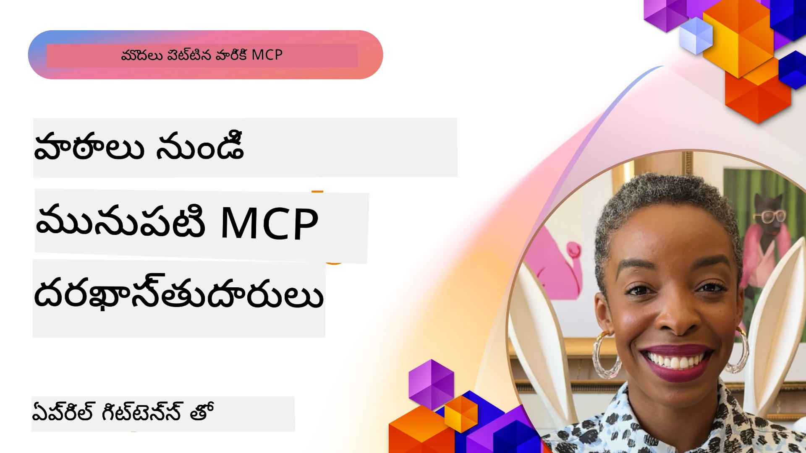

# 🌟 తొలిసారిగా అంగీకరించినవారి నుండి పాఠాలు

[](https://youtu.be/jds7dSmNptE)

_(ఈ పాఠం వీడియో చూడటానికి పైన ఉన్న చిత్రాన్ని క్లిక్ చేయండి)_

## 🎯 ఈ మాడ్యూల్ ఏమి కవర్ చేస్తుంది

ఈ మాడ్యూల్ వాస్తవ సంస్థలు మరియు అభివృద్దిపరులు మోడల్ కాంటెక్స్ట్ ప్రోటోకాల్ (MCP)ని ఉపయోగించి అసలు సవాళ్ళను ఎలా పరిష్కరిస్తున్నారు మరియు వృద్ధిని ఎలా నడిపిస్తున్నారు అనేది అర్ధం చేసుకుంటుంది. వివరణాత్మక కేస్ స్టడీస్, హ్యాండ్-ఆన్ ప్రాజెక్ట్స్, మరియు პრაქტికల్ ఉదాహరణల ద్వారా, మీరు MCP భద్రమైన, స్కేలబుల్ AI సమగ్రీకరణను ఎలా సాధిస్తుంది అని తెలుసుకుంటారు, ఇది భాషా మోడల్స్, టూల్స్ మరియు ఎంటర్ప్రైజ్ డేటాను అనుసంధానిస్తుంది.

### 📚 MCP అమలులో చూడండి

ఈ ప్రమాణాలకు ఉత్పత్తి-సిద్ధమైన టూల్స్‌లో ఎలా ప్రయోగించబడ్డాయో చూడాలనుకుంటున్నారా? మా [**10 Microsoft MCP సర్వర్లు డెవలపర్ ఉత్పాదకతను పరివర్తన చేస్తున్నాయి**](microsoft-mcp-servers.md) చూడండి, ఇవి మీరు ఈ రోజు ఉపయోగించగల నిజమైన Microsoft MCP సర్వర్లను ప్రదర్శిస్తాయి.

## అవలోకనం

ఈ పాఠం తొలిసారిగా అంగీకరించినవారు ఎలా మోడల్ కాంటెక్స్ట్ ప్రోటోకాల్ (MCP)ని ఉపయోగించి నిజ జీవిత సవాళ్ళను పరిష్కరించి పరిశ్రమలలో వినూత్నతను నడిపించారు అనేది పరిశీలిస్తుంది. వివరణాత్మక కేస్ స్టడీస్ మరియు హ్యాండ్-ఆన్ ప్రాజెక్ట్స్ ద్వారా, MCP ఎలా ప్రమాణీకృత, సురక్షిత, మరియు స్కేలబుల్ AI సమగ్రీకరణను సాధించడంలో సహాయపడుతుందో మీరు చూడగలరు — పెద్ద భాషా మోడల్స్, టూల్స్, మరియు ఎంటర్ప్రైజ్ డేటాను ఏకైక ఫ్రేమ్‌వర్క్‌లో అనుసంధానం చేయటం. మీరు MCP ఆధారిత పరిష్కారాలను రూపకల్పన చేసి నిర్మించే ప్రాక్టికల్ అనుభవం పొందవచ్చు, సాధించిన అమలు నమూనాల నుండి నేర్చుకుంటారు, మరియు ఉత్పత్తి వాతావరణాలలో MCPని ప్రయోగించే ఉత్తమ పద్ధతులు తెలుసుకుంటారు. ఈ పాఠం పెరుగుతున్న ధోరణులు, భవిష్యత్తు దిశలను మరియు తెరుస్తున్న మూలంగా పొందవలసిన వనరులను కూడా హైలైట్ చేస్తుంది, మీకు MCP సాంకేతికత మరియు దాని అభివృద్ధి జాబితాలో ముందంజలో ఉండటానికి సహాయపడుతుంది.

## నేర్చుకునే లక్ష్యాలు

- వాస్తవ ప్రపంచ MCP అమలుల విశ్లేషణ పోల్చడం వివిధ పరిశ్రమల్లో  
- పూర్తి MCP ఆధారిత అప్లికేషన్ల రూపకల్పన చేసి నిర్మించడం  
- MCP సాంకేతికతలో పెరుగుతున్న ధోరణులు మరియు భవిష్యత్తు దిశల అన్వేషణ  
- వాస్తవ అభివృద్ది పరిస్థితులలో ఉత్తమ పద్ధతులు అన్వయించడం  

## వాస్తవ ప్రపంచ MCP అమలు

### కేసు స్టడి 1: ఎంటర్ప్రైజ్ కస్టమర్ సపోర్ట్ ఆటోమేషన్

ఒక బహుళజాతీయ సంస్థ తమ కస్టమర్ సపోర్ట్ వ్యవస్థలన్నిటిలో AI పరస్పర చర్యలను ప్రమాణీకృతం చేయడానికి MCP ఆధారిత పరిష్కారాన్ని అమలు చేసింది. దీనివల్ల వారు:

- బహుళ LLM సర్వీస్ ప్రొవైడర్లకు ఏకీకృత ఇంటర్‌ఫేస్ సృష్టించగలిగారు  
- విభాగాలవ్యాప్తంగా ఒకరూప_PROMPT నిర్వహణ నిర్వహించారు  
- బలమైన భద్రత మరియు అనుగుణత నియంత్రణలను అమలు చేశారు  
- నిర్దిష్ట అవసరాల ఆధారంగా వేరు వేరు AI మోడల్స్ మధ్య సులభంగా మార్పిడి చేసుకున్నారు  

**సాంకేతిక అమలు:**

```python
# కస్టమర్ సపోర్ట్ కోసం Python MCP సర్వర్ అమలు
import logging
import asyncio
from modelcontextprotocol import create_server, ServerConfig
from modelcontextprotocol.server import MCPServer
from modelcontextprotocol.transports import create_http_transport
from modelcontextprotocol.resources import ResourceDefinition
from modelcontextprotocol.prompts import PromptDefinition
from modelcontextprotocol.tool import ToolDefinition

# లాగింగ్ కాన్ఫిగర్ చేయండి
logging.basicConfig(level=logging.INFO)

async def main():
    # సర్వర్ కాన్ఫిగరేషన్ సృష్టించండి
    config = ServerConfig(
        name="Enterprise Customer Support Server",
        version="1.0.0",
        description="MCP server for handling customer support inquiries"
    )
    
    # MCP సర్వర్ ప్రారంభించండి
    server = create_server(config)
    
    # జ్ఞానాధార వనరులను నమోదు చేయండి
    server.resources.register(
        ResourceDefinition(
            name="customer_kb",
            description="Customer knowledge base documentation"
        ),
        lambda params: get_customer_documentation(params)
    )
    
    # ప్రాంప్ట్ టెంప్లేట్లను నమోదు చేయండి
    server.prompts.register(
        PromptDefinition(
            name="support_template",
            description="Templates for customer support responses"
        ),
        lambda params: get_support_templates(params)
    )
    
    # సపోర్టు సాధనాలను నమోదు చేయండి
    server.tools.register(
        ToolDefinition(
            name="ticketing",
            description="Create and update support tickets"
        ),
        handle_ticketing_operations
    )
    
    # HTTP ట్రాన్స్పోర్ట్‌తో సర్వర్ ప్రారంభించండి
    transport = create_http_transport(port=8080)
    await server.run(transport)

if __name__ == "__main__":
    asyncio.run(main())
```
  
**ఫలితాలు:** మోడల్ ఖర్చుల్లో 30% తగ్గుదల, ప్రతిస్పందన స్థిరత్వంలో 45% మెరుగుదల, మరియు గ్లోబల్ ఆపరేషన్లపైన పెరుగిన అనుగుణత.

### కేసు స్టడి 2: హెల్త్‌కేర్ డయాగ్నోస్టిక్ అసిస్టెంట్

ఒక ఆరోగ్య సంరక్షణ సంస్థ సున్నితమైన రోగి డేటా రక్షణను ఖచ్చితంగా చూసుకుంటూ వివిధ ప్రత్యేక వైద్య AI మోడల్స్‌ను అనుసంధానించడానికి MCP ఇన్‌ఫ్రాస్ట్రక్చర్ రూపొందించింది:

- సాధారణ వైద్య మోడల్స్ మరియు నిపుణులు వైద్య మోడల్స్ మధ్య సతత మార్పిడి  
- కఠినమైన గోప్యత్వ నియంత్రణలు మరియు ఆడిట్ ట్రైల్స్  
- ఇప్పటికే ఉన్న ఎలక్ట్రానిక్ హెల్త్ రికార్డు (EHR) వ్యవస్థలతో అనుసంధానం  
- వైద్య పదజాలం కొరకు స్థిరమైన ప్రస్పందన ఇంజనీరింగ్  

**సాంకేతిక అమలు:**

```csharp
// C# MCP host application implementation in healthcare application
using Microsoft.Extensions.DependencyInjection;
using ModelContextProtocol.SDK.Client;
using ModelContextProtocol.SDK.Security;
using ModelContextProtocol.SDK.Resources;

public class DiagnosticAssistant
{
    private readonly MCPHostClient _mcpClient;
    private readonly PatientContext _patientContext;
    
    public DiagnosticAssistant(PatientContext patientContext)
    {
        _patientContext = patientContext;
        
        // Configure MCP client with healthcare-specific settings
        var clientOptions = new ClientOptions
        {
            Name = "Healthcare Diagnostic Assistant",
            Version = "1.0.0",
            Security = new SecurityOptions
            {
                Encryption = EncryptionLevel.Medical,
                AuditEnabled = true
            }
        };
        
        _mcpClient = new MCPHostClientBuilder()
            .WithOptions(clientOptions)
            .WithTransport(new HttpTransport("https://healthcare-mcp.example.org"))
            .WithAuthentication(new HIPAACompliantAuthProvider())
            .Build();
    }
    
    public async Task<DiagnosticSuggestion> GetDiagnosticAssistance(
        string symptoms, string patientHistory)
    {
        // Create request with appropriate resources and tool access
        var resourceRequest = new ResourceRequest
        {
            Name = "patient_records",
            Parameters = new Dictionary<string, object>
            {
                ["patientId"] = _patientContext.PatientId,
                ["requestingProvider"] = _patientContext.ProviderId
            }
        };
        
        // Request diagnostic assistance using appropriate prompt
        var response = await _mcpClient.SendPromptRequestAsync(
            promptName: "diagnostic_assistance",
            parameters: new Dictionary<string, object>
            {
                ["symptoms"] = symptoms,
                patientHistory = patientHistory,
                relevantGuidelines = _patientContext.GetRelevantGuidelines()
            });
            
        return DiagnosticSuggestion.FromMCPResponse(response);
    }
}
```
  
**ఫలితాలు:** వైద్యులకు మెరుగైన డయాగ్నోస్టిక్ సూచనలతో పాటు పూర్తి HIPAA అనుగుణతను నిర్వహించి, వ్యవస్థల మధ్య సూత్రబద్ధ మార్పిడి గణనీయంగా తగ్గించబడింది.

### కేసు స్టడి 3: ఫైనాన్షియల్ సర్వీసెస్ రిస్క్ విశ్లేషణ

ఒక ఆర్థిక సంస్థ తమ వివిధ విభాగాల్లో రిస్క్ విశ్లేషణ ప్రక్రియలను MCP సాయంతో ప్రమాణీకృతం చేసింది:

- క్రెడిట్ రిస్క్, మోసం గుర్తింపు, మరియు పెట్టుబడి రిస్క్ మోడల్స్ ల కోసం ఏకీకృత ఇంటర్‌ఫేస్ సృష్టించినది  
- కఠినమైన యాక్సెస్ నియంత్రణలు మరియు మోడల్ సంస్కరణ నిర్వహణను అమలు చేసింది  
- అన్ని AI సిఫారసుల ఆడిటబిలిటీని నిర్ధారించింది  
- విభిన్న వ్యవస్థల మధ్య ఒకరూప డేటా ఫార్మాటింగ్ నిర్వహించింది  

**సాంకేతిక అమలు:**

```java
// ఆర్ధిక రిస్క్ అంచనాకు జావా MCP సర్వర్
import org.mcp.server.*;
import org.mcp.security.*;

public class FinancialRiskMCPServer {
    public static void main(String[] args) {
        // ఆర్ధిక అనుగుణతా లక్షణాలతో MCP సర్వర్ సృష్టించండి
        MCPServer server = new MCPServerBuilder()
            .withModelProviders(
                new ModelProvider("risk-assessment-primary", new AzureOpenAIProvider()),
                new ModelProvider("risk-assessment-audit", new LocalLlamaProvider())
            )
            .withPromptTemplateDirectory("./compliance/templates")
            .withAccessControls(new SOCCompliantAccessControl())
            .withDataEncryption(EncryptionStandard.FINANCIAL_GRADE)
            .withVersionControl(true)
            .withAuditLogging(new DatabaseAuditLogger())
            .build();
            
        server.addRequestValidator(new FinancialDataValidator());
        server.addResponseFilter(new PII_RedactionFilter());
        
        server.start(9000);
        
        System.out.println("Financial Risk MCP Server running on port 9000");
    }
}
```
  
**ఫలితాలు:** నియంత్రణ అనుగుణత పెరగడం, 40% వేగంగా మోడల్ డిప్లాయ్‌మెంట్ చక్రాలు, మరియు విభాగాల్లో మెరుగైన రిస్క్ అంచనా స్థిరత్వం.

### కేసు స్టడి 4: మైక్రోసాఫ్ట్ ప్లెవ్రైట్ MCP సర్వర్ బ్రౌజర్ ఆటోమేషన్ కోసం

మైక్రోసాఫ్ట్ [Playwright MCP సర్వర్](https://github.com/microsoft/playwright-mcp)ను మోడల్ కాంటెక్స్ట్ ప్రోటోకాల్ ద్వారా సురక్షిత, ప్రమాణీకృత బ్రౌజర్ ఆటోమేషన్ అందించడానికి అభివృద్ధి చేసింది. ఈ ఉత్పత్తి-సిద్ధ సర్వర్ AI ఏజెంట్లు మరియు LLM లకు వెబ్ బ్రౌజర్లతో నియంత్రిత, ఆడిట్ చేయదగిన, మరియు విస్తరించదగిన విధంగా పరస్పర చర్యలు చేయడానికి అనుమతిస్తుంది — ఆటోమేటెడ్ వెబ్ టెస్టింగ్, డేటా యాప్‌లికేషన్, మరియు సంపూర్ణ వర్క్‌ఫ్లోల వంటి వినియోగాలు సాధ్యం.

> **🎯 ఉత్పత్తి సిద్ధమైన టూల్**  
>  
> మీరు ఈ రోజే ఉపయోగించగల నిజమైన MCP సర్వర్ దీనితోనే! [**Microsoft MCP Servers Guide**](microsoft-mcp-servers.md#8--playwright-mcp-server)లో ప్లెవ్రైట్ MCP సర్వర్ మరియు 9 ఇతర MCP సర్వర్ల గురించి మరింత తెలుసుకోండి.

**ముఖ్య ఫీచర్లు:**  
- బ్రౌజర్ ఆటోమేషన్ సామర్థ్యాలను (నావిగేషన్, ఫారం పూరణ, స్క్రీన్‌షాట్ క్యాప్చర్ మొదలైనవి) MCP టూల్స్‌గా అందిస్తుంది  
- అనవసర చర్యలను నిరోధించడానికి కఠిన యాక్సెస్ నియంత్రణలు మరియు సాండ్‌బాక్సింగ్ అమలు  
- అన్ని బ్రౌజర్ పరస్పర మిళిత క్రియలకు వివరమయిన ఆడిట్ లాగులు అందిస్తుంది  
- ఏజెంట్ ఆధారిత ఆటోమేషన్ కోసం Azure OpenAI మరియు ఇతర LLM ప్రొవైడర్లతో అనుసంధానం మద్దతు  
- GitHub కోపైలట్ యొక్క కోడింగ్ ఏజెంట్‌కు వెబ్ బ్రౌజింగ్ సామర్థ్యాన్ని అందిస్తుంది  

**సాంకేతిక అమలు:**

```typescript
// టైప్‌స్క్రిప్ట్: MCP సర్వర్‌లో ప్లే రైటర్ బ్రౌజర్ ఆటోమేషన్ టూల్స్‌ను నమోదు చేస్తున్నాము
import { createServer, ToolDefinition } from 'modelcontextprotocol';
import { launch } from 'playwright';

const server = createServer({
  name: 'Playwright MCP Server',
  version: '1.0.0',
  description: 'MCP server for browser automation using Playwright'
});

// URLకి నేవిగేట్ చేసి స్క్రీన్‌షాట్‌ను అందుకునే టూల్‌ను నమోదు చేయండి
server.tools.register(
  new ToolDefinition({
    name: 'navigate_and_screenshot',
    description: 'Navigate to a URL and capture a screenshot',
    parameters: {
      url: { type: 'string', description: 'The URL to visit' }
    }
  }),
  async ({ url }) => {
    const browser = await launch();
    const page = await browser.newPage();
    await page.goto(url);
    const screenshot = await page.screenshot();
    await browser.close();
    return { screenshot };
  }
);

// MCP సర్వర్‌ను ప్రారంభించండి
server.listen(8080);
```
  
**ఫలితాలు:**  

- AI ఏజెంట్లు మరియు LLM ల కోసం సురక్షిత, ప్రోగ్రామ్మబుల్ బ్రౌజర్ ఆటోమేషన్ సాధ్యం చేయబడింది  
- మాన్యువల్ పరీక్షా శ్రమ తగ్గించి వెబ్ అప్లికేషన్లకు పరీక్షా కవరేజ్ మెరుగుపడింది  
- ఎంటర్ప్రైజ్ వాతావరణాల్లో బ్రౌజర్ ఆధారిత టూల్ అనుసంధానానికి పునః ఉపయోగమయ్యే, విస్తరించదగిన ఫ్రేమ్‌వర్క్ అందింది  
- GitHub కోపైలట్ వెబ్ బ్రౌజింగ్ సామర్థ్యాలు ప్రదర్శించబడినవి  

**సూచనలు:**  

- [Playwright MCP Server GitHub రిపాజిటరీ](https://github.com/microsoft/playwright-mcp)  
- [Microsoft AI మరియు ఆటోమేషన్ పరిష్కారాలు](https://azure.microsoft.com/en-us/products/ai-services/)

### కేసు స్టడి 5: Azure MCP – ఎంటర్ప్రైజ్-గ్రేడ్ మోడల్ కాంటెక్స్ట్ ప్రోటోకాల్ ఆఫ్ సర్వీస్

Azure MCP Server ([https://aka.ms/azmcp](https://aka.ms/azmcp)) మైక్రోసాఫ్ట్ యొక్క నిర్వహించబడే, ఎంటర్ప్రైజ్-గ్రేడ్ మోడల్ కాంటెక్స్ట్ ప్రోటోకాల్ అమలు, ఇది క్లౌడ్ సేవగా స్కేలబుల్, సురక్షిత, మరియు అనుగుణ MCP సర్వర్ సామర్థ్యాలను అందిస్తుంది. Azure MCP సంస్థలకు వేగంగా MCP సర్వర్లను ప్రదర్శించడానికి, నిర్వహించడానికి మరియు Azure AI, డేటా, భద్రత సేవలతో అనుసంధానించడానికి సహాయపడుతుంది, ఆపరేషనల్ భారాన్ని తగ్గించి AI స్వీకరణను వేగవంతం చేస్తుంది.

> **🎯 ఉత్పత్తి సిద్ధమైన టూల్**  
>  
> మీరు ఈ రోజే ఉపయోగించగల నిజమైన MCP సర్వర్ ఇది! [**Microsoft MCP Servers Guide**](microsoft-mcp-servers.md)లో Azure AI Foundry MCP సర్వర్ గురించి మరింత తెలుసుకోండి.

- అంతర్గత స్కేలింగ్, మానిటరింగ్, మరియు భద్రతతో పూర్తి నిర్వహించబడే MCP సర్వర్  
- Azure OpenAI, Azure AI Search మరియు ఇతర Azure సేవలతో తెలివైన అనుసంధానం  
- Microsoft Entra ID ద్వారా ఎంటర్ప్రైజ్ ధృవీకరణ మరియు అనుమతి  
- కస్టమ్ టూల్స్, ప్రాంప్ట్ టెంప్లేట్లు మరియు వనరు కనెక్టర్లు మద్దతు  
- ఎంటర్ప్రైజ్ భద్రత మరియు నియంత్రణ అవసరాలకు అనుగుణంగా ఉండటం  

**సాంకేతిక అమలు:**

```yaml
# Example: Azure MCP server deployment configuration (YAML)
apiVersion: mcp.microsoft.com/v1
kind: McpServer
metadata:
  name: enterprise-mcp-server
spec:
  modelProviders:
    - name: azure-openai
      type: AzureOpenAI
      endpoint: https://<your-openai-resource>.openai.azure.com/
      apiKeySecret: <your-azure-keyvault-secret>
  tools:
    - name: document_search
      type: AzureAISearch
      endpoint: https://<your-search-resource>.search.windows.net/
      apiKeySecret: <your-azure-keyvault-secret>
  authentication:
    type: EntraID
    tenantId: <your-tenant-id>
  monitoring:
    enabled: true
    logAnalyticsWorkspace: <your-log-analytics-id>
```
  
**ఫలితాలు:**  
- తయారైన, అనుగుణ MCP సర్వర్ ప్లాట్‌ఫామ్ అందించడం ద్వారా ఎంటర్ప్రైజ్ AI ప్రాజెక్టుల కోసం టైం-టు-విలువ తగ్గింది  
- LLMలు, టూల్స్ మరియు ఎంటర్ప్రైజ్ డేటా వనరుల సమగ్రీకరణ అందించడాన్ని సులభతరం చేసింది  
- MCP వర్క్‌లోడ్ల కోసం భద్రత, పరిశీలన మరియు ఆపరేషనల్ సామర్ధ్యాన్ని మెరుగుపరచింది  
- Azure SDK ఉత్తమ పద్ధతులతో మరియు ప్రస్తుత ధృవీకరణ నమూనాలతో కోడ్ నాణ్యత మెరుగుపడింది  

**సూచనలు:**  
- [Azure MCP డాక్యుమెంటేషన్](https://aka.ms/azmcp)  
- [Azure MCP Server GitHub రిపాజిటరీ](https://github.com/Azure/azure-mcp)  
- [Azure AI సేవలు](https://azure.microsoft.com/en-us/products/ai-services/)  
- [Microsoft MCP సెంటర్](https://mcp.azure.com)

## కేసు స్టడి 6: NLWeb  
MCP (Model Context Protocol) టూల్స్‌తో ఇంటరాక్ట్ అయ్యే చాట్‌బాట్లకు మరియు AI సహాయకులకు కొత్తగా వస్తున్న ప్రోటోకాల్. ప్రతి NLWeb ఉదాహరణ కూడా MCP సర్వర్, ఇది ఒక కోర్ పద్ధతి ask ఆపక్కువ చేసింది, ఇది వేస్ట్ వెబ్‌సైట్‌ను సహజ భాషలో అడగడానికి ఉపయోగిస్తారు. తిరిగి వచ్చే ప్రతిస్పందన schema.orgను ఉపయోగిస్తుంది, ఇది వెబ్ డేటా వర్ణన కోసం విస్తృతంగా ఉపయోగించే శబ్దకోశం. సూటిగా చెప్పాలంటే, MCP అనేది NLWeb కి Http ఒకటే ఎలా అని అంటారు. NLWeb ప్రోటోకాల్‌లు, schema.org ఫార్మాట్‌లు మరియు నమూనా కోడ్‌లను కలిపి సైట్లతో త్వరితపరిస్థితులలో ఈ ఎండ్పాయింట్లను సృష్టించడంలో సహాయపడుతుంది, ఇది మానవులకు సంభాషణ ఇంటర్‌ఫేసులు మరియు యంత్రములకు సహజ ఏజెంట్-టు-ఏజెంట్ ఇంటరాక్షన్ ద్వారా ఉపయోగపడుతుంది.

NLWebకి రెండు ప్రత్యేక భాగాలు ఉన్నాయి:  
- ఒక ప్రోటోకాల్, చాలా సులభంగా మొదలు పెట్టడానికి, సైట్‌తో సహజ భాషలో ఇంటరాక్ట్ అయ్యేందుకు మరియు తిరిగి వచ్చే సమాధానానికి json మరియు schema.org ను ఆధారపడి ఉన్న ఫార్మాట్. REST API డాక్యుమెంటేషన్ లో మరిన్ని వివరాలు చూడండి.  
- (1) యొక్క సరళమైన అమలు, ఇప్పటికే ఉన్న మార్కప్‌ను ఉపయోగించి, జాబితా రూపంలో (ఉత్పత్తులు, వంటకాలు, ఆకర్షణలు, సమీక్షలు మొదలైనవి) సైట్లకు అనువైనవి. యూజర్ ఇంటర్‌ఫేస్ విడ్జెట్‌లతో కలిసి, సైట్లు సులభంగా వారి కంటెంట్ కు సంభాషణాత్మక ఇంటర్‌ఫేస్‌లు అందించగలవు. Life of a chat query డాక్యుమెంటేషన్ లో ఇది ఎలా పనిచేస్తుందో మరింత తెలుసుకోండి.

**సూచనలు:**  
- [Azure MCP డాక్యుమెంటేషన్](https://aka.ms/azmcp)  
- [NLWeb](https://github.com/microsoft/NlWeb)

### కేసు స్టడి 7: Azure AI Foundry MCP Server – ఎంటర్ప్రైజ్ AI ఏజెంట్ సమగ్రీకరణ

Azure AI Foundry MCP సర్వర్లు MCP ఎలా AI ఏజెంట్లు మరియు వర్క్‌ఫ్లోలను ఎంటర్ప్రైజ్ వాతావరణాల్లో వ్యవస్థీకృతం చేసి నిర్వహించవచ్చో చూపుతాయి. MCPని Azure AI Foundryతో అనుసంధానం చేసి, సంస్థలు ఏజెంట్ పరస్పర చర్యల్ని ప్రమాణీకృతం చేయగలుగుతాయి, Foundry వర్క్‌ఫ్లో నిర్వహణను వినియోగించవచ్చు, మరియు భద్రత, స్కేలబులిటీ మెరుగులను నిర్ధారించగలుగుతాయి.

> **🎯 ఉత్పత్తి సిద్ధమైన టూల్**  
>  
> మీరు ఈ రోజే ఉపయోగించగల నిజమైన MCP సర్వర్ ఇది! [**Microsoft MCP Servers Guide**](microsoft-mcp-servers.md#9--azure-ai-foundry-mcp-server)లో Azure AI Foundry MCP Server గురించి మరింత తెలుసుకోండి.

**ముఖ్య ఫీచర్లు:**  
- Azure AI ఎకోసిస్టమ్‌కు సమగ్ర యాక్సెస్, మోడల్ క్యాటలాగ్లు మరియు డిప్లాయ్‌మెంట్ నిర్వహణతో సహా  
- RAG అప్లికేషన్‌ల కోసం Azure AI Searchతో జ్ఞానం సూచికా చేయడం  
- AI మోడల్ పనితీరు మరియు నాణ్యత నిర్ధారణకు మూల్యాంకన టూల్స్  
- Azure AI Foundry క్యాటలాగ్ మరియు ప్రయోగశాలలతో ఆధునిక పరిశోధన మోడల్స్ అనుసంధానం  
- ఉత్పత్తి దృశ్యాల కోసం ఏజెంట్ నిర్వహణ మరియు మూల్యాంకనం  

**ఫలితాలు:**  
- AI ఏజెంట్ వర్క్‌ఫ్లోల వేగవంతమైన నమూనా మరియు బలమైన మానిటరింగ్  
- Azure AI సేవలతో సమగ్ర అనుసంధానం, అభివృద్ధి చెందిన దృశ్యాల కోసం  
- ఏజెంట్ పైప్లైన్ల నిర్మాణం, డిప్లాయ్‌మెంట్, మరియు మానిటరింగ్ కొరకు ఏకైక ఇంటర్‌ఫేస్  
- సంస్థల కోసం మెరుగైన భద్రత, అనుగుణత మరియు ఆపరేషనల్ సామర్ధ్యాలు  
- సంక్లిష్ట ఏజెంట్ ఆధారిత చర్యలపై నియంత్రణ ఉంచుతూ AI స్వీకరణను వేగవంతం చేయడం  

**సూచనలు:**  
- [Azure AI Foundry MCP Server GitHub రిపాజిటరీ](https://github.com/azure-ai-foundry/mcp-foundry)  
- [MCPతో Azure AI ఏజెంట్ల అనుసంధానం (Microsoft Foundry బ్లాగ్)](https://devblogs.microsoft.com/foundry/integrating-azure-ai-agents-mcp/)

### కేసు స్టడి 8: Foundry MCP ప్లేగ్రౌండ్ – ప్రయోగాలు మరియు నమూనా సృష్టి

Foundry MCP ప్లేగ్రౌండ్ MCP సర్వర్స్ మరియు Azure AI Foundry అనుసంధానాలతో ప్రయోగాలు చేయడానికి ఇప్పుడు సిద్ధమైన వాతావరణం అందిస్తుంది. అభివృద్ధిపరులు త్వరగా నమూనాలు, పరీక్షలు మరియు AI మోడల్స్, ఏజెంట్ వర్క్‌ఫ్లోలను Azure AI Foundry క్యాటలాగ్ మరియు ప్రయోగశాల వనరులను ఉపయోగించి మూల్యాంకనం చేయవచ్చు. ప్లేగ్రౌండ్ సెటప్‌ను సరళతరం చేస్తుంది, నమూనా ప్రాజెక్టులను అందిస్తుంది, మరియు సహకార అభివృద్ది కోసం మద్దతు ఇస్తుంది, తద్వారా కనీస ఆధారంతో ఉత్తమ పద్ధతులు మరియు కొత్త దృశ్యాలను అన్వేషించడం సులభం. ఇది సంక్లిష్ట ఇన్‌ఫ్రాస్ట్రక్చర్ అవసరం లేకుండా ఆలోచనలు ధృవీకరించడం, ప్రయోగాలు పంచుకోవడం, మరియు నేర్చుకోవడం వేగవంతం చేయాలనుకునేవారికి అత్యంత ఉపయోగపడుతుంది. ప్రవేశ బారియర్ తగ్గించడం ద్వారా, ప్లేగ్రౌండ్ MCP మరియు Azure AI Foundry నేపథ్యంలో నూతనదృష్టి మరియు కమ్యూనిటీ భాగస్వామ్యాలను ప్రోత్సహిస్తుంది.

**సూచనలు:**

- [Foundry MCP ప్లేగ్రౌండ్ GitHub రిపాజిటరీ](https://github.com/azure-ai-foundry/foundry-mcp-playground)

### కేసు స్టడి 9: Microsoft Learn Docs MCP Server – AI ఆధారిత డాక్యుమెంటేషన్ యాక్సెస్

Microsoft Learn Docs MCP సర్వర్ మోడల్ కాంటెక్స్ట్ ప్రోటోకాల్ ద్వారా అధికారిక Microsoft డాక్యుమెంటేషన్‌కు AI సహాయకులను ప్రత్యక్ష యాక్సెస్ అందించే క్లౌడ్-హోస్ట్ చేయబడిన సేవ. ఈ ఉత్పత్తి-సిద్ధ సర్వర్ విస్తృతమైన Microsoft Learn ఎకోసిస్టమ్‌కు కనెక్ట్ అయి అన్ని అధికారిక Microsoft మూలాలపై సేమాంటిక్ శోధనను సాధ్యమవుతుంది.

> **🎯 ఉత్పత్తి సిద్ధమైన టూల్**  
>  
> మీరు ఈ రోజే ఉపయోగించగల నిజమైన MCP సర్వర్ ఇది! [**Microsoft MCP Servers Guide**](microsoft-mcp-servers.md#1--microsoft-learn-docs-mcp-server)లో Microsoft Learn Docs MCP Server గురించి మరింత తెలుసుకోండి.

**ముఖ్య ఫీచర్లు:**  
- అధికారిక Microsoft డాక్యుమెంటేషన్, Azure డాక్స్, మరియు Microsoft 365 డాక్యుమెంటేషన్ కు ప్రత్యక్ష యాక్సెస్  
- సందర్భం మరియు ఉద్దేశ్యం అర్థం చేసుకునే అభివృద్ధి చెందిన సేమాంటిక్ శోధన సామర్థ్యం  
- Microsoft Learn కంటెంట్ ప్రచురించినప్పుడు ఎప్పుడూ తాజా సమాచారం  
- Microsoft Learn, Azure డాక్యుమెంటేషన్, మరియు Microsoft 365 మూలాలపై సమగ్ర కవచం  
- 10 వరకు ఉన్నత-నాణ్యత వ్యవహారిక భాగాలు మరియు ఆర్టికల్ శీర్షికలు, URLలతో తిరిగి ఇస్తుంది  

**ఎందుకు ఇది కీలకమైనది:**  
- Microsoft సాంకేతికతలకు సంబంధించిన "పాతకాల AI జ్ఞానం" సమస్యని పరిష్కరిస్తుంది  
- AI సహాయకులకు తాజా .NET, C#, Azure, మరియు Microsoft 365 ఫీచర్ల యాక్సెస్ కల్పిస్తుంది  
- ఖచ్చితమైన కోడ్ నిర్మాణం కొరకు అధికారిక, తొలి పార్టీ సమాచారం అందిస్తుంది  
- వేగంగా అభివృద్ధి చెందుతున్న Microsoft సాంకేతికతలతో పని చేసే డెవలపర్ల కొరకు అవశ్యకమైనది  

**ఫలితాలు:**  
- Microsoft సాంకేతికతల కోసం AI-సృష్టించబడిన కోడ్ యొక్క ఖచ్చితత్వం గణనీయంగా మెరుగుపడింది  
- తాజా డాక్యుమెంటేషన్ మరియు ఉత్తమ పద్ధతుల కోసం వెతకేవారికి ఖర్చు తగ్గింది  
- సందర్భ-తెలిసే డాక్యుమెంటేషన్ రిట్రీవల్ తో అభివృద్ది సామర్థ్యం పెరిగింది  
- IDE వదులకుండా అభివృద్ది వర్క్‌ఫ్లోలతో సమగ్ర అనుసంధానం

**సూచనలు:**  
- [Microsoft Learn Docs MCP Server GitHub రిపాజిటరీ](https://github.com/MicrosoftDocs/mcp)  
- [Microsoft Learn డాక్యుమెంటేషన్](https://learn.microsoft.com/)

## హ్యాండ్-ఆన్ ప్రాజెక్ట్స్

### ప్రాజెక్ట్ 1: బహుళ ప్రొవైడర్ MCP సర్వర్ నిర్మించండి

**లక్ష్యం:** నిర్దిష్ట ప్రమాణాల ఆధారంగా అనేక AI మోడల్ ప్రొవైడర్లకు అభ్యర్థనలు రూట్ చేయగల MCP సర్వర్ సృష్టించండి.

**అవసరాలు:**  

- కనీసం మూడు వేర్వేరు మోడల్ ప్రొవైడర్ల (ఉదా: OpenAI, Anthropic, స్థానిక మోడల్స్) మద్దతు ఇవ్వాలి  
- అభ్యర్థన మెటాడేటా ఆధారంగా రూటింగ్ చర్యని అమలు చేయాలి  
- ప్రొవైడర్ క్రెడెన్షియల్స్ నిర్వహణ కోసం కాన్ఫిగరేషన్ సిస్టమ్ సృష్టించాలి  
- పనితీరు మరియు ఖర్చు ఆప్టిమైజ్ కోసం కాచింగ్ కలపాలి  
- వాడకం పరిశీలన కొరకు సరళమైన డ్యాష్‌బోర్డ్ నిర్మించాలి  

**అమలు దశలు:**  

1. ప్రాథమిక MCP సర్వర్ ఇన్‌ఫ్రాస్ట్రక్చర్ ఏర్పాటుచేయండి  
2. ప్రతి AI మోడల్ సేవ కొరకు ప్రొవైడర్ అడాప్టర్లను అమలు చేయండి  
3. అభ్యర్థన లక్షణాల ఆధారంగా రూటింగ్ లాజిక్ రూపొందించండి  
4. తరచూ వచ్చే అభ్యర్థనల కోసం కాచింగ్ మెకానిజంలను జోడించండి  
5. మానిటరింగ్ డ్యాష్‌బోర్డ్ అభివృద్ధి చేయండి  
6. వివిధ అభ్యర్థన నమూనాలతో పరీక్షించండి  

**సాంకేతికతలు:** మీ ఇష్టానికి అనుగుణంగా Python (.NET/Java/Python), కాచింగ్ కోసం Redis, మరియు డ్యాష్‌బోర్డ్ కోసం సరళమైన వెబ్ ఫ్రేమ్‌వర్క్ ఎంచుకోండి.

### ప్రాజెక్ట్ 2: ఎంటర్ప్రైజ్ ప్రాంప్ట్ నిర్వహణ వ్యవస్థ  

**ఉద్దేశ్యం:** సంస్థలో మంచి విధంగా ప్రాంప్ట్ టెంప్లేట్లను నిర్వహించడం, వార్షికరణ చేయడం మరియు పంపిణీ చేయడానికి MCP ఆధారిత వ్యవస్థను అభివృద్ధి చేయడం.

**అవసరాలు:**

- ప్రాంప్ట్ టెంప్లేట్ల కోసం కేంద్రీకృత రిపోజిటరీ సృష్టించండి  
- వార్షికరణ మరియు ఆమోద workflowలను అమలు చేయండి  
- నమూనా ఇన్పుట్‌లతో టెంప్లేట్ పరీక్ష సామర్థ్యాలను నిర్మించండి  
- పాత్ర ఆధారిత ప్రవేశ నియంత్రణలను అభివృద్ధి చేయండి  
- టెంప్లేట్ పొందడం మరియు పంపిణీకి API సృష్టించండి  

**అమలు దశలు:**

1. టెంప్లేట్ నిల్వ కోసం డేటాబేస్ స్కీమాను డిజైన్ చేయండి  
2. టెంప్లేట్ CRUD ఆపరేషన్ల కోసం కీలక APIని సృష్టించండి  
3. వార్షికరణ వ్యవస్థను అమలు చేయండి  
4. ఆమోద workflowను నిర్మించండి  
5. పరీక్షా ఫ్రేమ్‌వర్క్‌ను అభివృద్ధి చేయండి  
6. నిర్వహణ కోసం సులభమైన వెబ్ ఇంటర్‌ఫేస్ సృష్టించండి  
7. MCP సర్వర్‌తో ఏకీకృతం చేయండి  

**సాంకేతికతలు:** మీకు ఇష్టమైన బ్యాకెండ్ ఫ్రేమ్‌వర్క్, SQL లేదా NoSQL డేటాబేస్, మరియు నిర్వహణ ఇంటర్‌ఫేస్‌ కోసం ఫ్రంట్‌ఎండ్ ఫ్రేమ్‌వర్క్.

### ప్రాజెక్ట్ 3: MCP ఆధారిత కంటెంట్ సృష్టి వేదిక

**ఉద్దేశ్యం:** వేరే వేరే కంటెంట్ రకాలపై సారూప్య ఫలితాలను అందించడానికి MCPను ఉపయోగించే కంటెంట్ సృష్టి వేదికను రూపొందించండి.

**అవసరాలు:**

- బ్లాగ్ పోస్టులు, సోషల్ మీడియా, మార్కెటింగ్ కాపీ వంటి వివిధ కంటెంట్ ఫార్మాట్‌లకు మద్దతు  
- అనుకూలీకరణ ఎంపికలతో టెంప్లేట్ ఆధారిత సృష్టి అమలు చేయడం  
- కంటెంట్ సమీక్ష మరియు అభిప్రాయం వ్యవస్థను సృష్టించడం  
- కంటెంట్ పనితీరు గణాంకాలను ట్రాక్ చేయడం  
- కంటెంట్ వెర్షనింగ్ మరియు పునఃసమీక్షకు మద్దతు  

**అమలు దశలు:**

1. MCP క్లయింట్ మౌలిక వేదికను సెట్ చేయండి  
2. వివిధ కంటెంట్ రకాల కోసం టెంప్లేట్లను సృష్టించండి  
3. కంటెంట్ సృష్టి పైప్లైన్‌ను నిర్మించండి  
4. సమీక్షా వ్యవస్థను అమలు చేయండి  
5. గణాంకాల ట్రాకింగ్ వ్యవస్థను అభివృద్ధి చేయండి  
6. టెంప్లేట్ నిర్వహణ మరియు కంటెంట్ సృష్టి కోసం యూజర్ ఇంటర్‌ఫేస్ సృష్టించండి  

**సాంకేతికతలు:** మీ ఇష్టమైన ప్రోగ్రామింగ్ భాష, వెబ్ ఫ్రేమ్‌వర్క్, మరియు డేటాబేస్ సిస్టమ్.

## MCP సాంకేతికతకు భవిష్యత్ దిశలు

### కొత్తగా వెలుగులోకి వస్తున్న ధోరణులు

1. **మల్టీ-మోడ్ MCP**  
   - చిత్రాలు, ఆడియో, మరియు వీడియో మోడళ్లతో MCP పరస్పర చర్యలను సామాన్యపరిచడం  
   - క్రాస్-మోడ్ కారణాలను అభివృద్ధి చేయడం  
   - వేర్వేరు మోడాలిటీల కోసం ప్రామాణిక ప్రాంప్ట్ ఫార్మాట్‌లు  

2. **ఫెడరేటెడ్ MCP మౌలిక వేదిక**  
   - సంస్థల మధ్య వనరులను పంచుకునే పంపిణీచేసిన MCP నెట్‌వర్క్లు  
   - భద్రతా ప్రోటోకాల్‌లను ఉపయోగించి మోడల్ భాగస్వామ్యం  
   - గోప్యతా పరిరక్షణ గణన సాంకేతికతలు  

3. **MCP మార్కెట్‌ప్లేస్‌లు**  
   - MCP టెంప్లేట్లు మరియు ప్లగిన్లను పంచుకోవడం మరియు ఆదాయం సృష్టించడానికి పరిసరాలు  
   - నాణ్యత నిర్ధారణ మరియు సర్టిఫికేషన్ ప్రక్రియలు  
   - మోడల్ మార్కెట్‌ప్లేస్‌లతో ఏకీకరణ  

4. **ఎడ్జ్ కంప్యూటింగ్ కోసం MCP**  
   - వనరుల పరిమిత ఎడ్జ్ పరికరాలకు MCP ప్రమాణాల అనుకూలీకరణ  
   - తక్కువ బ్యాండ్‌విడ్త్ పరిస్థితులకు సరికొత్త ప్రోటోకాల్‌లు  
   - IoT పరిసరాల కోసం ప్రత్యేక MCP అమలు  

5. **నియంత్రణ ఫ్రేమ్‌వర్క్‌లు**  
   - నియంత్రణ అనుగుణానికి MCP విస్తరణలను అభివృద్ధి  
   - ప్రామాణిక ఆడిట్ ట్రేళ్‌లు మరియు వివరణాత్మక ఇంటర్‌ఫేస్‌లు  
   - కొత్తగా వెలుగులోకి వచ్చే AI పాలనా ఫ్రేమ్‌వర్క్‌లతో ఏకీకరణ  

### Microsoft నుండి MCP పరిష్కారాలు

Microsoft మరియు Azure అభివృద్ది చేసిన బహుళ ఓపెన్-సోర్స్ రిపోజిటరీలు, వివిధ సందర్భాల్లో MCPని అమలు చేయడంలో డెవలపర్లకు సహాయం అందిస్తాయి:

#### Microsoft సంస్థ

1. [playwright-mcp](https://github.com/microsoft/playwright-mcp) - బ్రౌజర్ ఆటోమేషన్ మరియు టెస్టింగ్ కోసం Playwright MCP సర్వర్  
2. [files-mcp-server](https://github.com/microsoft/files-mcp-server) - OneDrive MCP సర్వర్ అమలు స్థానిక పరీక్ష మరియు కమ్యూనిటీ సహకారం కోసం  
3. [NLWeb](https://github.com/microsoft/NlWeb) - NLWeb అనేది ఓపెన్ ప్రోటోకాల్‌లు మరియు సంబంధిత ఓపెన్ సోర్స్ సాధనాల సేకరణ. దీని ప్రధాన లక్ష్యం AI వెబ్ కోసం మౌలిక స్థాయిని ఏర్పరచడం  

#### Azure-Samples సంస్థ

1. [mcp](https://github.com/Azure-Samples/mcp) - Azureపై బహుళ భాషలలో MCP సర్వర్లేనూ నిర్మించడం మరియు ఏకీకరిస్తే సాంపిల్‌లు, సాధనాలు, వనరులు  
2. [mcp-auth-servers](https://github.com/Azure-Samples/mcp-auth-servers) - ప్రస్తుత Model Context Protocol స్పెసిఫికేషన్‌తో ఆథेन्टికేషన్ చూపించే MCP సర్వర్ల ఉదాహరణలు  
3. [remote-mcp-functions](https://github.com/Azure-Samples/remote-mcp-functions) - Azure Functionsలో రిమొట్ MCP సర్వర్ అమలుకు ల్యాండింగ్ పేజ్, భాషా-ప్రత్యేక రిపోలకు లింకులు  
4. [remote-mcp-functions-python](https://github.com/Azure-Samples/remote-mcp-functions-python) - Pythonతో Azure Functions ఉపయోగించి అనుకూల రిమోట్ MCP సర్వర్లను నిర్మించి పంపిణీ చేసే త్వరితప్రారంభ టెంప్లేట్  
5. [remote-mcp-functions-dotnet](https://github.com/Azure-Samples/remote-mcp-functions-dotnet) - .NET/C# ఉపయోగించి అనుకూల రిమోట్ MCP సర్వర్లు నిర్మించి పంపిణీ చేసే త్వరితప్రారంభ టెంప్లేట్  
6. [remote-mcp-functions-typescript](https://github.com/Azure-Samples/remote-mcp-functions-typescript) - TypeScript తో Azure Functions ఉపయోగించి అనుకూల రిమోట్ MCP సర్వర్లు నిర్మించడానికి టెంప్లేట్  
7. [remote-mcp-apim-functions-python](https://github.com/Azure-Samples/remote-mcp-apim-functions-python) - Python తో Remote MCP సర్వర్‌లకు Azure API Management AI గేట్వేగా  
8. [AI-Gateway](https://github.com/Azure-Samples/AI-Gateway) - APIM ❤️ AI ప్రయోగాలు, MCP సామర్థ్యాలతో Azure OpenAI మరియు AI Foundryతో ఏకీకరణ  

ఈ రిపోజిటరీలు Model Context Protocolతో పని చేయడానికి వివిధ ప్రోగ్రామింగ్ భాషలు మరియు Azure సేవలపై అమలులు, టెంప్లేట్లు మరియు వనరులను అందిస్తాయి. ఇవి బేసిక్ సర్వర్ అమలుల నుండి ఆథెంటికేషన్, క్లౌడ్ పంపిణీ మరియు ఎంటర్ప్రైజ్ ఏకీకరణ వరకు విస్తృత ఉపయోగాలను కవర్ చేస్తాయి.

#### MCP వనరుల డైరెక్టరీ

అధికారిక Microsoft MCP రిపోజిటరీలోని [MCP Resources డైరెక్టరీ](https://github.com/microsoft/mcp/tree/main/Resources) Model Context Protocol సర్వర్లతో ఉపయోగించేందుకు సాంపిల్లు వనరులు, ప్రాంప్ట్ టెంప్లేట్లు, సాధన నిర్వచనలు వంటి సేకరణ అందిస్తుంది. ఈ డైరెక్టరీ అభివృద్ది కి త్వరితగతిన ప్రారంభం కావడానికి మరియు ఉత్తమ ఆచారాలు పాటించడానికి సహాయపడుతుంది:

- **ప్రాంప్ట్ టెంప్లేట్లు:** సాధారణ AI పనులు మరియు సందర్భాల కోసం సన్నాహకంగా తయారు చేసిన ప్రాంప్ట్ టెంప్లేట్లు, మీ స్వంత MCP సర్వర్ అమలుకు అనుకూలీకరించవచ్చు  
- **సాధన నిర్వచనలు:** సాధన సమాహారాన్ని ఏకీకృతం చేసి పిలిచే విధానాలను ప్రామాణికంగా రూపొందించడానికి సూచనలు  
- **వనరు నమూనాలు:** MCP ఫ్రేమ్‌వర్క్‌లో డేటా సోర్స్‌లు, APIలు మరియు బాహ్య సేవలతో కనెక్ట్ అయ్యే వనరుల గురించి నమూనాలు  
- **రెఫరెన్స్ అమలులు:** వాస్తవ ప్రపంచ MCP ప్రాజెక్టుల్లో వనరులు, ప్రాంప్ట్‌లు, సాధనాలు ఎలా నిర్మించాలో ప్రదర్శించే ప్రాక్టికల్ ఉదాహరణలు  

ఈ వనరులు అభివృద్ది వేగాన్ని పెంచి, ప్రమాణీకరణను ప్రోత్సహించి MCP ఆధారిత పరిష్కారాలను నిర్మించేటప్పుడు ఉత్తమ ఆచారాలు పాటించడంలో సహాయపడతాయి.

#### MCP వనరుల డైరెక్టరీ

- [MCP వనరులు (సాంపిల్ ప్రాంప్ట్‌లు, సాధనాలు, వనరు నిర్వచనలు)](https://github.com/microsoft/mcp/tree/main/Resources)

### పరిశోధనా అవకాశాలు

- MCP ఫ్రేమ్‌వర్క్‌లలో సమర్థవంతమైన ప్రాంప్ట్ ఆప్టిమైజేషన్ సాంకేతికతలు  
- బహుళ-అభ్యంతరకరిం MCP పంపిణీలకు భద్రతా మోడల్స్  
- వివిధ MCP అమలులలో పనితీరు బెంచ్‌మార్కింగ్  
- MCP సర్వర్లకు సాంప్రదాయ నిర్ధారణ పద్ధతులు  

## ముగింపు

Model Context Protocol (MCP) పరిశ్రమల వేగంగా ప్రామాణీకృత, భద్రతాపరంగా, మరియు పరస్పరం అమర్చదగిన AI ఏకీకరణ భవిష్యత్తును ఆకృతీకరిస్తోంది. ఈ పాఠంలో వచ్చిన కేస్ స్టడీలు మరియు ప్రాక్టికల్ ప్రాజెక్ట్స్ ద్వారా మీరు చూశారు Microsoft మరియు Azure లాంటి ప్రాథమిక దత్తాంశకర్తలు MCP ద్వారా నిజ జీవన సమస్యలను ఎలా పరిష్కరిస్తున్నారో, AI స్వీకరణను వేగవంతం చేస్తున్నారో మరియు అనుగుణత, భద్రత మరియు స్కేలబిలిటీని ఎలా నిర్ధారిస్తున్నారు అన్నది. MCP యొక్క మాడ్యూలర్ దృష్టికోణం సంస్థలకు పెద్ద భాషా మోడళ్లు, సాధనాలు మరియు ఎంటర్ప్రైజ్ డేటాను సమగ్ర, ఆడిటబుల్ ఫ్రేమ్‌వర్క్‌లో కనెక్ట్ చేసేందుకు సాధ్యం చేస్తుంది. MCP అభివృద్ధి చెందుతున్న కొద్దీ, కమ్యూనిటీతో సంబంధించినట్లు, ఓపెన్-సోర్స్ వనరులను అన్వేషించటం మరియు ఉత్తమ ఆచారాలు వర్తించటం వ్యాసంగాడిన, భవిష్యత్‌కు సిద్ధమైన AI పరిష్కారాలను అభివృద్ధి చేయడానికి కీలకంగా ఉంటుంది.

## అదనపు వనరులు

- [MCP Foundry GitHub రిపోజిటరీ](https://github.com/azure-ai-foundry/mcp-foundry)  
- [Foundry MCP ప్లేగ్రౌండ్](https://github.com/azure-ai-foundry/foundry-mcp-playground)  
- [Azure AI ఏజెంట్లను MCPతో ఏకీకరించడం (Microsoft Foundry బ్లాగ్)](https://devblogs.microsoft.com/foundry/integrating-azure-ai-agents-mcp/)  
- [MCP GitHub రిపోజిటరీ (Microsoft)](https://github.com/microsoft/mcp)  
- [MCP వనరుల డైరెక్టరీ (సాంపిల్ ప్రాంప్ట్‌లు, సాధనాలు, వనరు నిర్వచనలు)](https://github.com/microsoft/mcp/tree/main/Resources)  
- [MCP కమ్యూనిటీ & డాక్యుమెంటేషన్](https://modelcontextprotocol.io/introduction)  
- [MCP స్పెసిఫికేషన్ (2025-11-25)](https://spec.modelcontextprotocol.io/specification/2025-11-25/)  
- [Azure MCP డాక్యుమెంటేషన్](https://aka.ms/azmcp)  
- [OWASP MCP టాప్ 10](https://microsoft.github.io/mcp-azure-security-guide/mcp/) - భద్రతా ఉత్తమ ఆచారాలు  
- [Playwright MCP సర్వర్ GitHub రిపోజిటరీ](https://github.com/microsoft/playwright-mcp)  
- [Files MCP సర్వర్ (OneDrive)](https://github.com/microsoft/files-mcp-server)  
- [Azure-Samples MCP](https://github.com/Azure-Samples/mcp)  
- [MCP ఆథ్ సర్వర్లు (Azure-Samples)](https://github.com/Azure-Samples/mcp-auth-servers)  
- [Remote MCP Functions (Azure-Samples)](https://github.com/Azure-Samples/remote-mcp-functions)  
- [Remote MCP Functions Python (Azure-Samples)](https://github.com/Azure-Samples/remote-mcp-functions-python)  
- [Remote MCP Functions .NET (Azure-Samples)](https://github.com/Azure-Samples/remote-mcp-functions-dotnet)  
- [Remote MCP Functions TypeScript (Azure-Samples)](https://github.com/Azure-Samples/remote-mcp-functions-typescript)  
- [Remote MCP APIM Functions Python (Azure-Samples)](https://github.com/Azure-Samples/remote-mcp-apim-functions-python)  
- [AI-Gateway (Azure-Samples)](https://github.com/Azure-Samples/AI-Gateway)  
- [Microsoft AI మరియు ఆటోమేషన్ పరిష్కారాలు](https://azure.microsoft.com/en-us/products/ai-services/)

## అభ్యాసాలు

1. ఒక కేస్ స్టడీని విశ్లేషించి ప్రత్యామ్నాయ అమలు దృష్టిని ప్రతిపాదించండి.  
2. ఒక ప్రాజెక్ట్ ఆలోచనను ఎంచుకుని వివరమైన సాంకేతిక స్పెసిఫికేషన్ రూపొందించండి.  
3. కేస్ స్టడీలలో కవర్ కాని పరిశ్రమను పరిశోధించి, ఆ పరిశ్రమ ప్రత్యేక సవాళ్లను MCP ఎలా పరిష్కరిస్తుందో వివరించండి.  
4. ఒక భవిష్యత్తు దిశను ఎంచుకుని దానికి మద్దతు ఇచ్చే కొత్త MCP విస్తరణకు ఒక ఆలోచన రూపకల్పన చేయండి.  

## తదుపరి

ఇంకా శోధించండి: [Microsoft MCP Servers](./microsoft-mcp-servers.md)

కొనసాగింపు: [Module 8: Best Practices](../08-BestPractices/README.md)

---

<!-- CO-OP TRANSLATOR DISCLAIMER START -->
**దగ్గరింపు**:  
ఈ డాక్యుమెంట్‌ను AI అనువాద సేవ [Co-op Translator](https://github.com/Azure/co-op-translator) ద్వారా అనువదించబడింది. మేము ఖచ్చితత్వానికి ప్రయత్నించినప్పటికి, ఆటోమెటెడ్ అనువాదాలలో పొరపాట్లు లేదా తప్పుడు వివరాలు ఉండవచ్చు. మూల డాక్యుమెంట్ దాని స్వదేశీ భాషలో అంగీకృత సోర్స్‌గా పరిగణించాలి. ముఖ్యమైన సమాచారానికి, నిపుణుల చేతి అనువాదం చేయించుకోవడం సలహాఇస్తుంది. ఈ అనువాదం వాడటంవల్ల కలిగే తప్పుదోషాలు లేదా తప్పుగా అర్థం చేసుకోవడం కోసం మేము బాధ్యులు కాదు.
<!-- CO-OP TRANSLATOR DISCLAIMER END -->