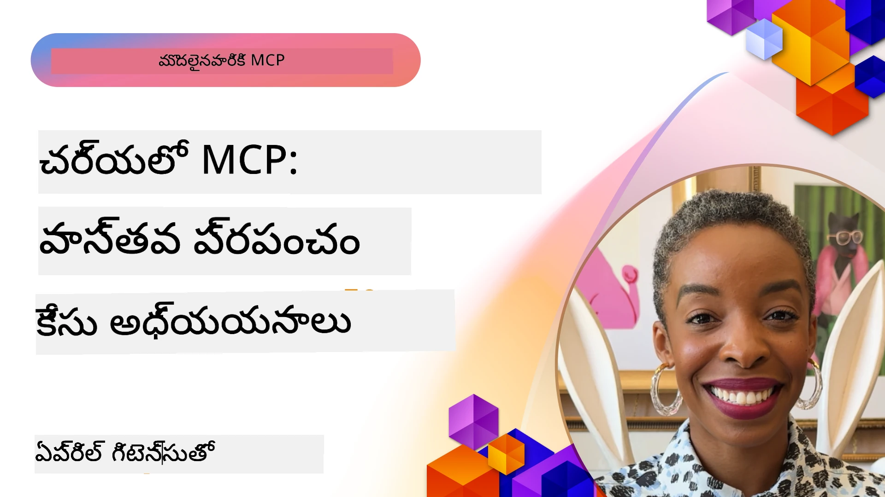

# MCP చర్యలో: నిజజీవిత కేసు స్టడీస్

_(ఈ పాఠం వీడియోను వీక్షించడానికి పై చిత్రంపై క్లిక్ చేయండి)_

మోడల్ కాంటెక్స్ట్ ప్రోటోకాల్ (MCP) AI అనువర్తనాలు డేటా, టూల్స్, మరియు సేవలతో ఎలా పరస్పరం చేసుకోవాలో మార్చేస్తోంది. ఈ విభాగం వివిధ సంస్థలు ఉపయోగించే MCP యొక్క ఉపయోగకరమైన అప్లికేషన్లను చూపించే నిజజీవిత కేసు స్టడీస్ ని అందిస్తుంది.

## అవలోకనం

ఈ విభాగం MCP అమలు ఉదాహరణలను ప్రదర్శిస్తుంది, సంస్థలు ఈ ప్రోటోకాల్‌ను ఎలా ఉపయోగించి కఠిన వ్యాపార సవాళ్ళను పరిష్కరిస్తున్నాయో హైలైట్ చేస్తుంది. ఈ కేసు స్టడీస్‌ని పరిశీలించడం ద్వారా, మీరు MCP యొక్క విస్తృతత, స్కేలబిలిటీ, మరియు నిజజీవిత సందర్భాలలో ఉపయోగకరత గురించి అవగాహన పొందుతారు.

## ముఖ్యమైన నేర్చుకోవాల్సిన అంశాలు

ఈ కేసు స్టడీస్ లో పరిశోధన ద్వారా మీరు:

- MCPను నిర్దిష్ట వ్యాపార సమస్యలను పరిష్కరించడానికి ఎలా ఉపయోగించాలో అర్థం చేసుకోగలరు
- విభిన్న సమీకరణ నమూనాలు మరియు వాస్తవిక రూపకల్పన విధానాల గురించి తెలుసుకోగలరు
- సంస్థా వాతావరణాలలో MCP అమలు చేయడానికి ఉత్తమ ఆచరణలను గుర్తించగలరు
- నిజజీవిత అమలులో ఎదురయ్యే సవాళ్ళు మరియు పరిష్కారాలపై అవగాహన పొందగలరు
- మీ స్వంత ప్రాజెక్టులలో ఇదే విధమైన నమూనాలను అన్వయించేందుకు అవకాశాలు గుర్తించగలరు

## లక్ష్యమైన కేసు స్టడీస్

### 1. [Azure AI ట్రావెల్ ఏజెంట్స్ – సూచన అమలు](./travelagentsample.md)

ఈ కేసు స్టడీ Microsoft యొక్క సమగ్ర సూచన పరిష్కారం ఎలా MCP, Azure OpenAI, మరియు Azure AI Search ఉపయోగించి బహుళ ఏజెంట్, AI శక్తిసంపন্ন ప్రయాణం ప్లానింగ్ అప్లికేషన్‌ని నిర్మించాలో చూపిస్తుంది. ప్రాజెక్ట్ చూపిస్తుంది:

- MCP ద్వారా బహుళ ఏజెంట్ ఒర్చెస్ట్రేషన్
- Azure AI Searchతో సంస్థ డేటా సమీకరణ
- Azure సేవలతో సురక్షిత మరియు వ్యాప్తికరమైన నిర్మాణం
- తిరిగి ఉపయోగించదగిన MCP భాగాలతో విస్తరించదగిన టూలింగ్
- Azure OpenAI ఆధారంగా సంభాషణాత్మక వినియోగదారు అనుభవం

ఆర్కిటెక్చర్ మరియు అమలు వివరాలు MCPని సమన్వయ పర్యతన లేయర్‌గా ఉపయోగించి కఠిన, బహుళ ఏజెంట్ సిస్టమ్‌లను నిర్మించడంలో విలువైన అవగాహనలని అందిస్తాయి.

### 2. [YouTube డేటా నుండి Azure DevOps అంశాలను నవీకరించడం](./UpdateADOItemsFromYT.md)

ఈ కేసు స్టడీ MCPని వర్క్‌ఫ్లో ప్రక్రియలను ఆటోమేటు చేయడానికి ఉపయోగించే ప్రాక్టికల్ అప్లికేషన్‌ను చూపిస్తుంది. ఇది MCP టూల్స్‌ను ఎలా ఉపయోగించాలో చూపిస్తుంది:

- ఆన్‌లైన్ ప్లాట్‌ఫారమ్‌లు (YouTube) నుంచి డేటాను సేకరించడం
- Azure DevOps సిస్టమ్‌లలో వర్క్ ఐటెమ్‌లను నవీకరించడం
- పునరావృత ఆటోమేషన్ వర్క్‌ఫ్లోలను సృష్టించడం
- విభిన్న సిస్టమ్‌ల మధ్య డేటాను సమీకరించడం

ఈ ఉదాహరణ సులభమైన MCP అమలుకలిగిన విధంగా సాంప్రదాయ పనులను ఆటోమేటు చేసి మరియు డేటా ఒకరూపతను మెరుగుపరిచినప్పుడు సాధించగల ముఖ్యమైన సామర్థ్యాన్ని చూపుతుంది.

### 3. [MCP తో రియల్-టైమ్ డాక్యుమెంటేషన్ రిట్రీవల్](./docs-mcp/README.md)

ఈ కేసు స్టడీ Python కన్సోల్ క్లయింట్‌ను మోడల్ కాంటెక్స్ట్ ప్రోటోకాల్ (MCP) సర్వర్‌తో కనెక్ట్ చేసి Microsoft డాక్యుమెంటేషన్‌ని రియల్-టైమ్, సాందర్భికంగా పొందడం మరియు లాగ్ చేయడం ఎలా చేయాలో మార్గదర్శనం చేస్తుంది. మీరు నేర్చుకుంటారు:

- Python క్లయింట్ మరియు నా MCP SDK ఉపయోగించి MCP సర్వర్‌కు కనెక్ట్ కావడం
- సమర్థవంతమైన రియల్-టైమ్ డేటా రిట్రీవల్ కోసం స్ట్రీమింగ్ HTTP క్లయింట్లు ఉపయోగించడం
- సర్వర్‌పై డాక్యుమెంటేషన్ టూల్స్‌ను కాల్ చేసి ప్రతిస్పందనలను కన్సోల్‌కు నేరుగా లాగ్ చేయడం
- టెర్మినల్ నుండి బయటకు వెళ్లకుండా తాజా Microsoft డాక్యుమెంటేషన్‌ని వర్క్‌ఫ్లోలో విలీనపరచడం

ఈ అధ్యాయం ఒక హ్యాండ్స్-ఆన్ అసైన్‌మెంట్, చిన్న వర్కింగ్ కోడ్ నమూనా మరియు లోతైన అధ్యయనానికి అదనపు వనరుల లింకులను కలిగి ఉంటుంది. MCP డాక్యుమెంటేషన్ యాక్సెస్ మరియు డెవలపర్ ఉత్పాదకతని మార్చగల దిశలో పూర్తి వాక్‌త్రూ మరియు కోడ్ పై లింక్ ఆసక్తికరంగ ఉంటుంది.

### 4. [MCP తో ఇంటరాక్టివ్ స్టడీ ప్లాన్ జనరేటర్ వెబ్ యాప్](./docs-mcp/README.md)

ఈ కేసు స్టడీ ఛైన్‌లిట్ మరియు మోడల్ కాంటెక్స్ట్ ప్రోటోకాల్ (MCP) ఉపయోగించి ఏ అంశానికి అయినా వ్యక్తిగతీకరించిన అధ్యయన ప్రణాళికలని రూపొందించే ఇంటరాక్టివ్ వెబ్ అప్లికేషన్ ఎలా తయారుచేయాలో చూపిస్తుంది. వినియోగదారులు ఒక విషయం (ఉదా: "AI-900 సర్టిఫికేషన్") మరియు అధ్యయన కాలం (ఉదా: 8 వారాలు) ను పేర్కొనగలరు, యాప్ వారానికి వారానికి సిఫారసు కంటెంట్ ఇవ్వగలదు. ఛైన్‌లిట్ సంభాషణాత్మక చాట్ ఇంటర్‌ఫేస్ అందిస్తుంది, అనుభవాన్ని ఆకర్షణీయంగా మరియు ఆడాప్టివ్ గా చేస్తుంది.

- ఛైన్‌లిట్ ఆధారిత సంభాషణాత్మక వెబ్ యాప్
- విషయము మరియు కాలం కోసం వినియోగదారు ప్రాంప్ట్‌లు
- MCP ద్వారా వారానికి వారీగా కంటెంట్ సిఫారసులు
- సంభాషణ చాట్ ఇంటర్‌ఫేస్ లో రియల్-టైమ్, ఆడాప్టివ్ ప్రతిస్పందనలు

ప్రాజెక్ట్ చూపిస్తుంది సంభాషణ AI మరియు MCPను సమకాలీనంగా కలిపి ఆధునిక వెబ్ వాతావరణంలో సజీవ, వినియోగదారు ఆధారిత విద్యా సాధనాలుగా రూపొందించగలనని.

### 5. [VS Code లో MCP సర్వర్ తో ఎడిటర్‌లో డాక్స్](./docs-mcp/README.md)

ఈ కేసు స్టడీ మీ VS Code వాతావరణంలో Microsoft Learn డాక్స్‌ను నేరుగా MCP సర్వర్ ద్వారా ఎలా తీసుకురావాలో చూపిస్తుంది— ఇంకా బ్రౌజర్ టాబ్‌లను మార్చాల్సిన అవసరం లేదు! మీరు చూడగలరు:

- MCP ప్యానెల్ లేదా కమాండ్ ప్యాలెట్ ద్వారా VS Code లో తక్షణం docs ను శోధించి చదవడం
- డాక్యుమెంటేషన్ సూచనలు మరియు README లేదా కోర్స్ మార్క్డౌన్ ఫైల్స్‌లో లింకులు చేర్చడం
- GitHub Copilot మరియు MCPని కలిసి AI ఆధారిత డాక్ మరియు కోడ్ వర్క్‌ఫ్లోల కోసం ఉపయోగించడం
- రియల్ టైమ్ ఫీడ్‌బ్యాక్ మరియు Microsoft ఆధారిత ఖచ్చితత్వంతో మీ డాక్‌ను చెల్లింపుగా మరియు మెరుగుపరచడం
- MCPని GitHub వర్క్‌ఫ్లోలతో సమీకరించి నిరంతర డాక్యుమెంటేషన్ ధ్రువీకరణ

అమలు ప్రధానాంశాలు:

- సులభ సెటప్ కోసం `.vscode/mcp.json` ఉదాహరణ కుంఫిగరేషన్
- ఎడిటర్‌లో అనుభవం యొక్క స్క్రీన్‌షాట్ ఆధారిత వాక్‌త్రూ
- గరిష్ట ఉత్పాదకత కోసం Copilot మరియు MCP కలపడానికి చిట్కాలు

ఇది కోర్స్ రచయితలు, డాక్యుమెంటేషన్ రచయితలు మరియు docs, Copilot, ధృవీకరణ టూల్స్‌తో పనిచేస్తున్న డెవలపర్లకు సూత్రవాద్యమైనది.

### 6. [APIM MCP సర్వర్ సృష్టి](./apimsample.md)

ఈ కేసు స్టడీ Azure API మేనేజ్‌మెంట్ (APIM) ఉపయోగించి MCP సర్వర్ సృష్టించడానికి దశల వారీ మార్గదర్శకాన్ని అందిస్తుంది. ఇది కవర్ చేస్తుంది:

- Azure API మేనేజ్‌మెంట్‌లో MCP సర్వర్ సెటప్
- API ఆపరేషన్లను MCP టూల్స్‌గా ప్రదర్శించడం
- రేటు పరిమితి మరియు భద్రత కోసం పాలసీల కంఫిగరేషన్
- Visual Studio Code మరియు GitHub Copilot ఉపయోగించి MCP సర్వర్ టెస్టింగ్

ఈ ఉదాహరణ Azure సామర్థ్యాలను వాడుకుని శక్తివంతమైన MCP సర్వర్‌ని సృష్టించి, వివిధ అప్లికేషన్లలో AI సిస్టమ్‌ల సమీకరణని మెరుగుపరచడం ఎలా చేయాలో చూపిస్తుంది.

### 7. [GitHub MCP రిజిస్ట్రీ — ఏజెంటిక్ సమీకరణ వేగవంతం](https://github.com/mcp)

ఈ కేసు స్టడీ GitHub యొక్క MCP రిజిస్ట్రీ, సెప్టెంబర్ 2025లో ప్రారంభించబడినది, AI ఈకోసిస్టమ్‌లో ముఖ్య సవాలు అయిన మోడల్ కాంటెక్స్ట్ ప్రోటోకాల్ (MCP) సర్వర్‌ల విభజిత గుర్తింపు మరియు అమలును ఎలా పరిష్కరించిందో పరిశీలిస్తుంది.

#### అవలోకనం
**MCP రిజిస్ట్రీ** వివిధ రిపోజిటరీలు మరియు రిజిస్ట్రీలలో విస్తృతంగా ఉన్న MCP సర్వర్‌ల సమస్యను పరిష్కరిస్తుంది, దీనివల్ల సమీకరణ నెమ్మదిగా మరియు పొరపాట్లతో నిండినదిగా మారింది. ఈ సర్వర్లు AI ఏజెంట్లకు APIs, డేటాబేసులు, డాక్యుమెంటేషన్ వనరులతో పరస్పర చర్య చేయడానికి వీలు కల్పిస్తాయి.

#### సమస్య ప్రకటన
ఏజెంటిక్ వర్క్‌ఫ్లోల అభివృద్ధి చేస్తున్న డెవలపర్లు అనేక సవాళ్ళను ఎదుర్కొన్నారు:
- వేర్వేరు ప్లాట్‌ఫారమ్‌లలో MCP సర్వర్లు తగిన గుర్తింపు లేకపోవడం
- ఫోరములు మరియు డాక్యుమెంటేషన్‌లో విస్తరించిన పునరావృత సెటప్ ప్రశ్నలు
- అప్రమాణిక మరియు అప్రమాణిత మూలాల నుంచి భద్రతా ప్రమాదాలు
- సర్వర్ నాణ్యత మరియు అనుకూలతలో ప్రమాణాల లేకపోవడం

#### పరిష్కార నిర్మాణం
GitHub MCP రిజిస్ట్రీ నమ్మకముగా ఉన్న MCP సర్వర్‌లను కేంద్రీకృతంగా ఉంచుతూ ముఖ్య లక్షణాలను కలిగి ఉంది:
- సులభ సెటప్ కోసం VS Code ద్వారా ఒక క్లిక్ ఇన్స్టాల్ సమీకరణ
- స్టార్‌లు, చురుకైన చర్య, మరియు కమ్యూనిటీ ధ్రువీకరణ ఆధారంగా సమాచారం వడగట్టి చూపించటం
- GitHub Copilot మరియు ఇతర MCP అనుకూల టూల్స్‌తో నేరుగా సమీకరణ
- కమ్యూనిటీ మరియు సంస్థ భాగస్వాములు ఫలస్వరూపంగా సహకారానికి ఓపెన్ మోడల్

#### వ్యాపార ప్రభావం
రిజిస్ట్రీ కొంత కొలిచే మెరుగుదలలను అందించింది:
- Microsoft Learn MCP Server వంటి టూల్స్ ద్వారా డెవలపర్లకు వేగవంతమైన ఆన్‌బోర్డు
- `github-mcp-server` వంటి ప్రత్యేక సర్వర్లతో మెరుగైన ఉత్పాదకత, వాటితో సహా సహజ భాష GitHub ఆటోమేషన్ (PR సృష్టి, CI మళ్ళీ పరుగులు, కోడ్ స్కానింగ్)
- క్యూయేటెడ్ జాబితాలు మరియు స్పష్టమైన కంఫిగరేషన్ ప్రమాణాల ద్వారా పటిష్టమైన ఈకోసిస్టమ్ నమ్మకం

#### వ్యూహాత్మక విలువ
ఏజెంట్ లైఫ్‌సైకిల్ మేనేజ్‌మెంట్ మరియు పునః ఉత్పాదక వర్క్‌ఫ్లోలలో నిపుణులు కోసం MCP రిజిస్ట్రీ అందిస్తున్నది:
- ప్రమాణీకృత భాగాలతో మాడ్యులర్ ఏజెంట్ అమరిక పనితీరు
- సజావుగా టెస్టింగ్ మరియు ధ్రువీకరణకు రిజిస్ట్రీ ఆధారిత మూల్యాంకన పైప్లైన్లు
- విభిన్న AI వేదికల మధ్య సజావుగా సమీకరణ కోసం క్రాస్-టూల్ అంతర్ముఖ్యత

ఈ కేసు స్టడీ MCP రిజిస్ట్రీ సాక్షాత్తూ కేవలం డైరెక్టరీ మాత్రమే కాని, విస్తరించదగిన, నిజజీవిత మోడల్ సమీకరణ మరియు ఏజెంటిక్ సిస్టమ్ డిప్లాయ్‌మెంట్ కోసం మౌలిక వేదికగా ఉన్నట్లుగాను చూపిస్తుంది.

## ముగింపు

ఈ ఏడుగు సమగ్ర కేసు స్టడీస్ మోడల్ కాంటెక్స్ట్ ప్రోటోకాల్ యొక్క అసాధారణ విస్తృతతను మరియు నిజజీవిత సందర్భాలలో ఉపయోగకర అప్లికేషన్లను ప్రదర్శిస్తాయి. కఠిన బహుళ ఏజెంట్ ప్రయాణ ప్రణాళికా సిస్టమ్‌ల నుండి సంస్థ API నిర్వహణ వరకు, సులభతర డాక్యుమెంటేషన్ వర్క్‌ఫ్లోలు మరియు విప్లవాత్మక GitHub MCP రిజిస్ట్రీ వరకు, ఈ ఉదాహరణలు MCPని AI సిస్టమ్‌లను అవసరమైన టూల్స్, డేటా మరియు సేవలతో కనెక్ట్ చేయడానికి ప్రమాణీకృత, స్కేలబుల్ మార్గంగా ఎలా అందించగలదో చూపిస్తాయి.

కేసు స్టడీలు MCP అమలులో బహుళ కొలతలను కవర్ చేస్తాయి:
- **సంస్థా సమీకరణ**: Azure API మేనేజ్‌మెంట్ మరియు Azure DevOps ఆటోమేషన్
- **బహుళ ఏజెంట్ ఒర్చెస్ట్రేషన్**: సమన్వయమైన AI ఏజెంట్‌లతో ప్రయాణ ప్రణాళిక
- **డెవలపర్ ఉత్పాదకత**: VS Code సమీకరణ మరియు రియల్-టైమ్ డాక్యుమెంటేషన్ యాక్సెస్
- **ఈకోసిస్టమ్ అభివృద్ధి**: GitHub MCP రిజిస్ట్రీ మౌలిక వేదికగా
- **విద్యా అప్లికేషన్లు**: ఇంటరాక్టివ్ స్టడీ ప్లాన్ జనరేటర్‌లు మరియు సంభాషణాత్మక ఇంటర్‌ఫేస్‌లు

ఈ అమలులను అధ్యయనం చేయడం ద్వారా మీరు కీలక అవగాహనలు పొందుతారు:
- విభిన్న మాపుదలల కోసం **వాస్తవిక రూపకల్పన నమూనాలు**
- ఫంక్షనాలిటీ మరియు నిర్వహణ మధ్య సంతులనం జాగ్రత్తగా ఉంచడం కోసం **అమలు వ్యూహాలు**
- ఉత్పత్తి పరిసరాల కోసం **భద్రత మరియు స్కేలబిలిటీ** పరిగణనలు
- MCP సర్వర్ అభివృద్ధి మరియు క్లయింట్ సమీకరణకు **ఉత్తమ ఆచరణలు**
- ఇంటర్‌కనెక్టెడ్ AI-ఆధారిత పరిష్కారాల నిర్మాణం కోసం **ఈకోసిస్టమ్ ఆలోచనలు**

ఈ ఉదాహరణలు సమష్టిగా MCP కేవలం సైద్ధాంతిక ఫ్రేమ్‌వర్క్ కాదని, కఠిన వ్యాపార సమస్యలకు ప్రాయోగిక పరిష్కారాలను సాధించగల మేచుర్డ్, ఉత్పత్తి-సిద్ధ ప్రోటోకాల్ అని నిరూపిస్తున్నాయి. మీరు సులభమైన ఆటోమేషన్ టూల్స్ లేదా అతిగా నైపుణ్యం గల బహుళ ఏజెంట్ సిస్టమ్‌లు నిర్మిస్తున్నా, ఇక్కడ చూపిన నమూనాలు మరియు విధానాలు మీ స్వంత MCP ప్రాజెక్టులకు బలమైన పునాది అందిస్తాయి.

## అదనపు వనరులు

- [Azure AI ట్రావెల్ ఏజెంట్స్ GitHub రిపోజిటీ](https://github.com/Azure-Samples/azure-ai-travel-agents)
- [Azure DevOps MCP Tool](https://github.com/microsoft/azure-devops-mcp)
- [Playwright MCP Tool](https://github.com/microsoft/playwright-mcp)
- [Microsoft Docs MCP సర్వర్](https://github.com/MicrosoftDocs/mcp)
- [GitHub MCP రిజిస్ట్రీ — ఏజెంటిక్ సమీకరణ వేగవంతం](https://github.com/mcp)
- [MCP కమ్యూనిటీ ఉదాహరణలు](https://github.com/microsoft/mcp)

## తదుపరి ఏమిటి

- ముందటి: [మాడ్యూల్ 8: ఉత్తమ ఆచరణలు](../08-BestPractices/README.md)
- తరువాత: [మాడ్యూల్ 10: AI వర్క్‌ఫ్లోలను సులభతరం చేయడం: AI టూల్‌కిట్‌తో MCP సర్వర్ నిర్మాణం](../10-StreamliningAIWorkflowsBuildingAnMCPServerWithAIToolkit/README.md)

---

<!-- CO-OP TRANSLATOR DISCLAIMER START -->
**అస్పష్టం**:
ఈ డాక్యుమెంట్ [Co-op Translator](https://github.com/Azure/co-op-translator) అనే AI అనువాద సేవ ఉపయోగించి అనువదించబడింది. మేము ఖచ్చితత్వం కోసం ప్రయత్నిస్తున్నప్పటికీ, ఆటోమేటెడ్ అనువాదాలలో తప్పులు లేదా లోపాలు ఉండవచ్చు అని దయచేసి గమనించండి. అసలు డాక్యుమెంట్ native (స్థానిక) భాషలోనే అధికారిక మూలంగా తీసుకోవాలి. కీలకమైన సమాచారం కోసం ప్రొఫెషనల్ మనుష్య అనువాదం సిఫార్సు చేయబడుతుంది. ఈ అనువాదం వలన కలిగే ఏ రకమైన అపార్థాలు లేదా తప్పుడు అర్థాలు కోసం మేము బాధ్యత వహించము.
<!-- CO-OP TRANSLATOR DISCLAIMER END -->