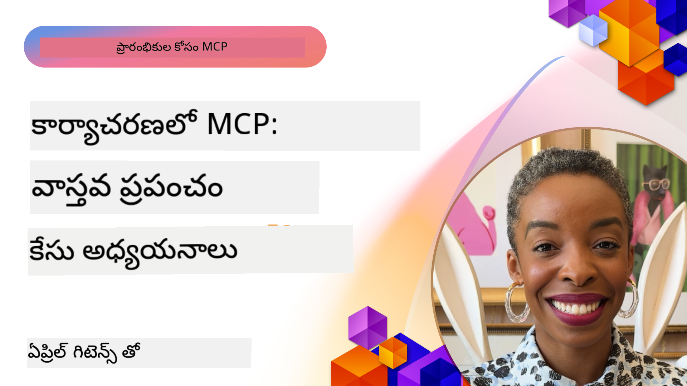

<!--
CO_OP_TRANSLATOR_METADATA:
{
  "original_hash": "1611dc5f6a2a35a789fc4c95fc5bfbe8",
  "translation_date": "2025-12-11T10:28:28+00:00",
  "source_file": "09-CaseStudy/README.md",
  "language_code": "te"
}
-->
# MCP చర్యలో: వాస్తవ ప్రపంచ కేసు అధ్యయనాలు

_(ఈ పాఠం వీడియోను చూడడానికి పై చిత్రాన్ని క్లిక్ చేయండి)_

మోడల్ కాంటెక్స్ట్ ప్రోటోకాల్ (MCP) AI అనువర్తనాలు డేటా, టూల్స్ మరియు సేవలతో ఎలా ఇంటరాక్ట్ అవుతాయో మార్చేస్తోంది. ఈ విభాగం వివిధ సంస్థల సందర్భాలలో MCP యొక్క ప్రాక్టికల్ అప్లికేషన్లను చూపించే వాస్తవ ప్రపంచ కేసు అధ్యయనాలను అందిస్తుంది.

## అవలోకనం

ఈ విభాగం MCP అమలు యొక్క స్పష్టమైన ఉదాహరణలను ప్రదర్శిస్తుంది, సంస్థలు ఈ ప్రోటోకాల్‌ను ఎలా ఉపయోగించి క్లిష్ట వ్యాపార సవాళ్లను పరిష్కరిస్తున్నాయో హైలైట్ చేస్తుంది. ఈ కేసు అధ్యయనాలను పరిశీలించడం ద్వారా, మీరు MCP యొక్క బహుముఖత, స్కేలబిలిటీ మరియు వాస్తవ ప్రపంచ సందర్భాలలో ప్రాక్టికల్ లాభాలపై అవగాహన పొందుతారు.

## ముఖ్యమైన నేర్చుకునే లక్ష్యాలు

ఈ కేసు అధ్యయనాలను అన్వేషించడం ద్వారా, మీరు:

- MCP ను నిర్దిష్ట వ్యాపార సమస్యలను పరిష్కరించడానికి ఎలా ఉపయోగించవచ్చో అర్థం చేసుకోగలరు
- వివిధ ఇంటిగ్రేషన్ నమూనాలు మరియు ఆర్కిటెక్చరల్ దృక్పథాల గురించి తెలుసుకోగలరు
- సంస్థల వాతావరణాలలో MCP అమలుకు ఉత్తమ ఆచారాలను గుర్తించగలరు
- వాస్తవ ప్రపంచ అమలులో ఎదురైన సవాళ్లు మరియు పరిష్కారాలపై అవగాహన పొందగలరు
- మీ స్వంత ప్రాజెక్టుల్లో సమాన నమూనాలను వర్తింపజేసే అవకాశాలను గుర్తించగలరు

## ముఖ్యమైన కేసు అధ్యయనాలు

### 1. [Azure AI ట్రావెల్ ఏజెంట్స్ – రిఫరెన్స్ అమలు](./travelagentsample.md)

ఈ కేసు అధ్యయనం Microsoft యొక్క సమగ్ర రిఫరెన్స్ సొల్యూషన్‌ను పరిశీలిస్తుంది, ఇది MCP, Azure OpenAI మరియు Azure AI Search ఉపయోగించి బహుళ ఏజెంట్, AI ఆధారిత ట్రావెల్ ప్లానింగ్ అనువర్తనాన్ని ఎలా నిర్మించాలో చూపిస్తుంది. ప్రాజెక్ట్ ఈ అంశాలను ప్రదర్శిస్తుంది:

- MCP ద్వారా బహుళ ఏజెంట్ సమన్వయం
- Azure AI Search తో సంస్థ డేటా ఇంటిగ్రేషన్
- Azure సేవలతో సురక్షిత, స్కేలబుల్ ఆర్కిటెక్చర్
- పునర్వినియోగపరచదగిన MCP భాగాలతో విస్తరించదగిన టూలింగ్
- Azure OpenAI ఆధారిత సంభాషణాత్మక వినియోగదారు అనుభవం

ఆర్కిటెక్చర్ మరియు అమలు వివరాలు MCP ను సమన్వయ పొరగా ఉపయోగించి క్లిష్టమైన బహుళ ఏజెంట్ వ్యవస్థలను నిర్మించడంలో విలువైన అవగాహనలను అందిస్తాయి.

### 2. [YouTube డేటా నుండి Azure DevOps అంశాలను నవీకరించడం](./UpdateADOItemsFromYT.md)

ఈ కేసు అధ్యయనం MCP ను వర్క్‌ఫ్లో ప్రక్రియలను ఆటోమేటింగ్ చేయడానికి ప్రాక్టికల్ అప్లికేషన్‌గా చూపిస్తుంది. ఇది MCP టూల్స్ ఉపయోగించి చేయగల పనులను చూపిస్తుంది:

- ఆన్‌లైన్ ప్లాట్‌ఫారమ్‌ల నుండి డేటా తీసుకోవడం (YouTube)
- Azure DevOps వ్యవస్థలలో వర్క్ ఐటమ్స్‌ను నవీకరించడం
- పునరావృత ఆటోమేషన్ వర్క్‌ఫ్లోలను సృష్టించడం
- విభిన్న వ్యవస్థల మధ్య డేటా ఇంటిగ్రేషన్

ఈ ఉదాహరణ సాదారణ MCP అమలులు కూడా రొటీన్ పనులను ఆటోమేటింగ్ చేసి, వ్యవస్థల మధ్య డేటా సారూప్యతను మెరుగుపరచడం ద్వారా గణనీయమైన సామర్థ్యాన్ని అందించగలవని చూపిస్తుంది.

### 3. [MCP తో రియల్-టైమ్ డాక్యుమెంటేషన్ రిట్రీవల్](./docs-mcp/README.md)

ఈ కేసు అధ్యయనం Python కన్సోల్ క్లయింట్‌ను Model Context Protocol (MCP) సర్వర్‌కు కనెక్ట్ చేసి Microsoft డాక్యుమెంటేషన్‌ను రియల్-టైమ్, కాంటెక్స్ట్-అవేర్‌గా పొందడం మరియు లాగ్ చేయడం ఎలా చేయాలో చూపిస్తుంది. మీరు నేర్చుకుంటారు:

- Python క్లయింట్ మరియు అధికారిక MCP SDK ఉపయోగించి MCP సర్వర్‌కు కనెక్ట్ కావడం
- సమర్థవంతమైన, రియల్-టైమ్ డేటా రిట్రీవల్ కోసం స్ట్రీమింగ్ HTTP క్లయింట్లను ఉపయోగించడం
- సర్వర్‌పై డాక్యుమెంటేషన్ టూల్స్‌ను కాల్ చేసి ప్రత్యక్షంగా కన్సోల్‌కు స్పందనలను లాగ్ చేయడం
- టెర్మినల్ విడిచి వెళ్లకుండా తాజా Microsoft డాక్యుమెంటేషన్‌ను మీ వర్క్‌ఫ్లోలో ఇంటిగ్రేట్ చేయడం

ఈ అధ్యాయం హ్యాండ్స్-ఆన్ అసైన్‌మెంట్, కనిష్ట పని కోడ్ నమూనా మరియు లోతైన నేర్చుకునే అదనపు వనరుల లింకులను కలిగి ఉంది. MCP డాక్యుమెంటేషన్ యాక్సెస్ మరియు డెవలపర్ ఉత్పాదకతను కన్సోల్-ఆధారిత వాతావరణాలలో ఎలా మార్చగలదో పూర్తి వాక్‌థ్రూ మరియు కోడ్‌ను లింక్ చేసిన అధ్యాయంలో చూడండి.

### 4. [MCP తో ఇంటరాక్టివ్ స్టడీ ప్లాన్ జనరేటర్ వెబ్ యాప్](./docs-mcp/README.md)

ఈ కేసు అధ్యయనం Chainlit మరియు Model Context Protocol (MCP) ఉపయోగించి ఏదైనా అంశానికి వ్యక్తిగతీకరించిన స్టడీ ప్లాన్లను సృష్టించే ఇంటరాక్టివ్ వెబ్ అనువర్తనం ఎలా నిర్మించాలో చూపిస్తుంది. వినియోగదారులు ఒక విషయం (ఉదా: "AI-900 సర్టిఫికేషన్") మరియు అధ్యయన వ్యవధి (ఉదా: 8 వారాలు) ను పేర్కొనగలరు, యాప్ వారానికి వారీగా సిఫార్సు చేసిన కంటెంట్‌ను అందిస్తుంది. Chainlit సంభాషణాత్మక చాట్ ఇంటర్‌ఫేస్‌ను సక్రియం చేస్తుంది, అనుభవాన్ని ఆకర్షణీయంగా మరియు అనుకూలంగా చేస్తుంది.

- Chainlit ఆధారిత సంభాషణాత్మక వెబ్ యాప్
- విషయం మరియు వ్యవధి కోసం వినియోగదారు ప్రాంప్ట్‌లు
- MCP ఉపయోగించి వారానికి వారీగా కంటెంట్ సిఫార్సులు
- చాట్ ఇంటర్‌ఫేస్‌లో రియల్-టైమ్, అనుకూల స్పందనలు

ఈ ప్రాజెక్ట్ సంభాషణాత్మక AI మరియు MCP ను కలిపి ఆధునిక వెబ్ వాతావరణంలో డైనమిక్, వినియోగదారు-నడిపే విద్యా టూల్స్ సృష్టించగలదని చూపిస్తుంది.

### 5. [VS Code లో MCP సర్వర్‌తో ఇన్-ఎడిటర్ డాక్స్](./docs-mcp/README.md)

ఈ కేసు అధ్యయనం MCP సర్వర్ ఉపయోగించి Microsoft Learn Docs ను నేరుగా మీ VS Code వాతావరణంలో ఎలా తీసుకురావాలో చూపిస్తుంది—మరింత బ్రౌజర్ టాబ్స్ మార్చాల్సిన అవసరం లేదు! మీరు చూడగలరు:

- MCP ప్యానెల్ లేదా కమాండ్ ప్యాలెట్ ఉపయోగించి VS Code లో డాక్స్‌ను తక్షణం శోధించి చదవడం
- README లేదా కోర్సు మార్క్డౌన్ ఫైళ్లలో నేరుగా డాక్యుమెంటేషన్ సూచనలు మరియు లింకులను చేర్చడం
- GitHub Copilot మరియు MCP ను కలిసి ఉపయోగించి సజావుగా AI ఆధారిత డాక్యుమెంటేషన్ మరియు కోడ్ వర్క్‌ఫ్లోలు
- రియల్-టైమ్ ఫీడ్‌బ్యాక్ మరియు Microsoft మూలాల ఖచ్చితత్వంతో మీ డాక్యుమెంటేషన్‌ను ధృవీకరించడం మరియు మెరుగుపరచడం
- నిరంతర డాక్యుమెంటేషన్ ధృవీకరణ కోసం MCP ను GitHub వర్క్‌ఫ్లోలతో ఇంటిగ్రేట్ చేయడం

అమలు:

- సులభమైన సెటప్ కోసం ఉదాహరణ `.vscode/mcp.json` కాన్ఫిగరేషన్
- ఇన్-ఎడిటర్ అనుభవం యొక్క స్క్రీన్‌షాట్ ఆధారిత వాక్‌థ్రూలు
- గరిష్ట ఉత్పాదకత కోసం Copilot మరియు MCP కలిపి ఉపయోగించే సూచనలు

ఈ సందర్భం కోర్సు రచయితలు, డాక్యుమెంటేషన్ రచయితలు మరియు డెవలపర్లు తమ ఎడిటర్‌లో ఫోకస్‌గా ఉండి docs, Copilot మరియు ధృవీకరణ టూల్స్‌తో పని చేయాలనుకునే వారికి అనుకూలం—అన్నీ MCP ద్వారా శక్తివంతం చేయబడ్డాయి.

### 6. [APIM MCP సర్వర్ సృష్టి](./apimsample.md)

ఈ కేసు అధ్యయనం Azure API Management (APIM) ఉపయోగించి MCP సర్వర్‌ను ఎలా సృష్టించాలో దశల వారీ గైడ్ అందిస్తుంది. ఇది కవర్ చేస్తుంది:

- Azure API Management లో MCP సర్వర్ సెటప్ చేయడం
- MCP టూల్స్‌గా API ఆపరేషన్లను ఎక్స్‌పోజ్ చేయడం
- రేట్ లిమిటింగ్ మరియు సెక్యూరిటీ కోసం పాలసీలను కాన్ఫిగర్ చేయడం
- Visual Studio Code మరియు GitHub Copilot ఉపయోగించి MCP సర్వర్‌ను పరీక్షించడం

ఈ ఉదాహరణ Azure సామర్థ్యాలను ఉపయోగించి బలమైన MCP సర్వర్‌ను సృష్టించడం ఎలా అనేది చూపిస్తుంది, ఇది వివిధ అనువర్తనాలలో ఉపయోగించవచ్చు, AI వ్యవస్థలతో సంస్థ APIs ఇంటిగ్రేషన్‌ను మెరుగుపరుస్తుంది.

### 7. [GitHub MCP రిజిస్ట్రీ — ఏజెంటిక్ ఇంటిగ్రేషన్ వేగవంతం](https://github.com/mcp)

ఈ కేసు అధ్యయనం సెప్టెంబర్ 2025 లో ప్రారంభమైన GitHub యొక్క MCP రిజిస్ట్రీ AI ఎకోసిస్టమ్‌లో ఒక కీలక సవాలు ఎలా పరిష్కరిస్తుందో పరిశీలిస్తుంది: Model Context Protocol (MCP) సర్వర్ల విభజితమైన కనుగొనడం మరియు డిప్లాయ్‌మెంట్.

#### అవలోకనం
**MCP రిజిస్ట్రీ** విభిన్న రిపోజిటరీలు మరియు రిజిస్ట్రీలలో విస్తరించిన MCP సర్వర్ల సమస్యను పరిష్కరిస్తుంది, ఇది ఇంతకుముందు ఇంటిగ్రేషన్‌ను నెమ్మదిగా మరియు లోపభూయిష్టంగా చేసింది. ఈ సర్వర్లు AI ఏజెంట్లు APIs, డేటాబేసులు మరియు డాక్యుమెంటేషన్ మూలాలతో ఇంటరాక్ట్ అవ్వడానికి అనుమతిస్తాయి.

#### సమస్య వివరణ
ఏజెంటిక్ వర్క్‌ఫ్లోలను నిర్మిస్తున్న డెవలపర్లు అనేక సవాళ్లను ఎదుర్కొన్నారు:
- వివిధ ప్లాట్‌ఫారమ్‌లలో MCP సర్వర్ల తక్కువ కనుగొనగలగడం
- ఫోరమ్స్ మరియు డాక్యుమెంటేషన్‌లో పునరావృత సెటప్ ప్రశ్నలు
- నిర్ధారించని మరియు నమ్మకంలేని మూలాల నుండి సెక్యూరిటీ ప్రమాదాలు
- సర్వర్ నాణ్యత మరియు అనుకూలతలో ప్రమాణీకరణ లోపం

#### పరిష్కార ఆర్కిటెక్చర్
GitHub యొక్క MCP రిజిస్ట్రీ నమ్మకమైన MCP సర్వర్లను కేంద్రీకృతం చేస్తుంది, ముఖ్య లక్షణాలు:
- VS Code ద్వారా ఒక క్లిక్ ఇన్‌స్టాల్ ఇంటిగ్రేషన్ సులభమైన సెటప్ కోసం
- స్టార్‌లు, కార్యకలాపం మరియు కమ్యూనిటీ ధృవీకరణ ద్వారా సిగ్నల్-ఓవర్-నాయిస్ సార్టింగ్
- GitHub Copilot మరియు ఇతర MCP-అనుకూల టూల్స్‌తో ప్రత్యక్ష ఇంటిగ్రేషన్
- కమ్యూనిటీ మరియు సంస్థ భాగస్వాములు రెండూ సహకరించగల ఓపెన్ కాంట్రిబ్యూషన్ మోడల్

#### వ్యాపార ప్రభావం
రిజిస్ట్రీ కొలవదగిన మెరుగుదలలను అందించింది:
- Microsoft Learn MCP సర్వర్ వంటి టూల్స్ ఉపయోగించే డెవలపర్లకు వేగవంతమైన ఆన్‌బోర్డింగ్, ఇది అధికారిక డాక్యుమెంటేషన్‌ను ఏజెంట్లకు నేరుగా స్ట్రీమ్ చేస్తుంది
- `github-mcp-server` వంటి ప్రత్యేక సర్వర్ల ద్వారా మెరుగైన ఉత్పాదకత, ఇది సహజ భాష GitHub ఆటోమేషన్ (PR సృష్టి, CI రీరన్స్, కోడ్ స్కానింగ్) ను సాధ్యమవుతుంది
- కూర్చున్న జాబితాలు మరియు పారదర్శక కాన్ఫిగరేషన్ ప్రమాణాల ద్వారా బలమైన ఎకోసిస్టమ్ నమ్మకం

#### వ్యూహాత్మక విలువ
ఏజెంట్ లైఫ్‌సైకిల్ మేనేజ్‌మెంట్ మరియు పునరుత్పాదక వర్క్‌ఫ్లోలలో నిపుణుల కోసం MCP రిజిస్ట్రీ అందిస్తుంది:
- ప్రమాణీకృత భాగాలతో మాడ్యులర్ ఏజెంట్ డిప్లాయ్‌మెంట్ సామర్థ్యాలు
- స్థిరమైన పరీక్ష మరియు ధృవీకరణ కోసం రిజిస్ట్రీ-ఆధారిత మూల్యాంకన పైప్లైన్లు
- వివిధ AI ప్లాట్‌ఫారమ్‌ల మధ్య సజావుగా ఇంటిగ్రేషన్ కోసం క్రాస్-టూల్ ఇంటరొపరబిలిటీ

ఈ కేసు అధ్యయనం MCP రిజిస్ట్రీ కేవలం డైరెక్టరీ మాత్రమే కాకుండా, స్కేలబుల్, వాస్తవ ప్రపంచ మోడల్ ఇంటిగ్రేషన్ మరియు ఏజెంటిక్ సిస్టమ్ డిప్లాయ్‌మెంట్ కోసం ఒక మౌలిక వేదిక అని చూపిస్తుంది.

## ముగింపు

ఈ ఏడు సమగ్ర కేసు అధ్యయనాలు Model Context Protocol యొక్క అద్భుతమైన బహుముఖత మరియు వాస్తవ ప్రపంచ సందర్భాలలో ప్రాక్టికల్ అప్లికేషన్లను ప్రదర్శిస్తాయి. క్లిష్టమైన బహుళ ఏజెంట్ ట్రావెల్ ప్లానింగ్ వ్యవస్థలు మరియు సంస్థ API నిర్వహణ నుండి సులభమైన డాక్యుమెంటేషన్ వర్క్‌ఫ్లోలు మరియు విప్లవాత్మక GitHub MCP రిజిస్ట్రీ వరకు, ఈ ఉదాహరణలు MCP AI వ్యవస్థలను అవసరమైన టూల్స్, డేటా మరియు సేవలతో కనెక్ట్ చేయడానికి ప్రమాణీకృత, స్కేలబుల్ మార్గాన్ని ఎలా అందిస్తుందో చూపిస్తాయి.

కేసు అధ్యయనాలు MCP అమలులో అనేక పరిమాణాలను కవర్ చేస్తాయి:
- **సంస్థల ఇంటిగ్రేషన్**: Azure API Management మరియు Azure DevOps ఆటోమేషన్
- **బహుళ ఏజెంట్ సమన్వయం**: సమన్వయ AI ఏజెంట్లతో ట్రావెల్ ప్లానింగ్
- **డెవలపర్ ఉత్పాదకత**: VS Code ఇంటిగ్రేషన్ మరియు రియల్-టైమ్ డాక్యుమెంటేషన్ యాక్సెస్
- **ఎకోసిస్టమ్ అభివృద్ధి**: GitHub MCP రిజిస్ట్రీ మౌలిక వేదికగా
- **విద్యా అప్లికేషన్లు**: ఇంటరాక్టివ్ స్టడీ ప్లాన్ జనరేటర్లు మరియు సంభాషణాత్మక ఇంటర్‌ఫేస్‌లు

ఈ అమలులను అధ్యయనం చేయడం ద్వారా మీరు కీలక అవగాహనలను పొందుతారు:
- వివిధ పరిమాణాలు మరియు ఉపయోగాల కోసం ఆర్కిటెక్చరల్ నమూనాలు
- ఫంక్షనాలిటీ మరియు నిర్వహణ సామర్థ్యాన్ని సమతుల్యం చేసే అమలు వ్యూహాలు
- ఉత్పత్తి డిప్లాయ్‌మెంట్‌ల కోసం సెక్యూరిటీ మరియు స్కేలబిలిటీ పరిగణనలు
- MCP సర్వర్ అభివృద్ధి మరియు క్లయింట్ ఇంటిగ్రేషన్ కోసం ఉత్తమ ఆచారాలు
- పరస్పర సంబంధ AI-శక్తివంతమైన పరిష్కారాలను నిర్మించడానికి ఎకోసిస్టమ్ ఆలోచన

ఈ ఉదాహరణలు కలిపి MCP కేవలం సిద్దాంతాత్మక ఫ్రేమ్‌వర్క్ మాత్రమే కాకుండా క్లిష్ట వ్యాపార సవాళ్లకు ప్రాక్టికల్ పరిష్కారాలను అందించే పరిపక్వ, ఉత్పత్తి-సిద్ధ ప్రోటోకాల్ అని నిరూపిస్తాయి. మీరు సులభ ఆటోమేషన్ టూల్స్ లేదా సున్నితమైన బహుళ ఏజెంట్ వ్యవస్థలను నిర్మిస్తున్నా, ఇక్కడ చూపించిన నమూనాలు మరియు దృక్పథాలు మీ స్వంత MCP ప్రాజెక్టులకు బలమైన పునాది అందిస్తాయి.

## అదనపు వనరులు

- [Azure AI ట్రావెల్ ఏజెంట్స్ GitHub రిపోజిటరీ](https://github.com/Azure-Samples/azure-ai-travel-agents)
- [Azure DevOps MCP టూల్](https://github.com/microsoft/azure-devops-mcp)
- [Playwright MCP టూల్](https://github.com/microsoft/playwright-mcp)
- [Microsoft Docs MCP సర్వర్](https://github.com/MicrosoftDocs/mcp)
- [GitHub MCP రిజిస్ట్రీ — ఏజెంటిక్ ఇంటిగ్రేషన్ వేగవంతం](https://github.com/mcp)
- [MCP కమ్యూనిటీ ఉదాహరణలు](https://github.com/microsoft/mcp)

తర్వాత: హ్యాండ్స్ ఆన్ ల్యాబ్ [AI వర్క్‌ఫ్లోలను సులభతరం చేయడం: AI టూల్‌కిట్‌తో MCP సర్వర్ నిర్మించడం](../10-StreamliningAIWorkflowsBuildingAnMCPServerWithAIToolkit

---

<!-- CO-OP TRANSLATOR DISCLAIMER START -->
**అస్పష్టత**:  
ఈ పత్రాన్ని AI అనువాద సేవ [Co-op Translator](https://github.com/Azure/co-op-translator) ఉపయోగించి అనువదించబడింది. మేము ఖచ్చితత్వానికి ప్రయత్నించినప్పటికీ, ఆటోమేటెడ్ అనువాదాల్లో పొరపాట్లు లేదా తప్పిదాలు ఉండవచ్చు. మూల పత్రం దాని స్వదేశీ భాషలో అధికారిక మూలంగా పరిగణించాలి. ముఖ్యమైన సమాచారానికి, ప్రొఫెషనల్ మానవ అనువాదం సిఫార్సు చేయబడుతుంది. ఈ అనువాదం వాడకంలో ఏర్పడిన ఏవైనా అపార్థాలు లేదా తప్పుదారితీసే అర్థాలు కోసం మేము బాధ్యత వహించము.
<!-- CO-OP TRANSLATOR DISCLAIMER END -->