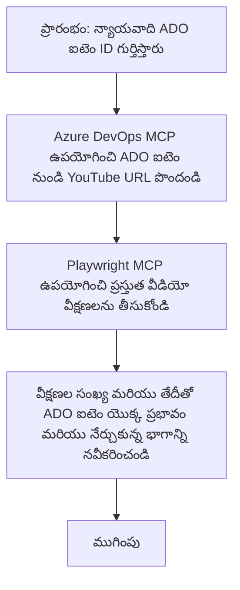

<!--
CO_OP_TRANSLATOR_METADATA:
{
  "original_hash": "14a2dfbea55ef735660a06bd6bdfe5f3",
  "translation_date": "2025-12-11T10:37:42+00:00",
  "source_file": "09-CaseStudy/UpdateADOItemsFromYT.md",
  "language_code": "te"
}
-->
# కేస్ స్టడీ: YouTube డేటాతో Azure DevOps అంశాలను MCP ద్వారా నవీకరించడం

> **అస్పష్టత:** YouTube వంటి ప్లాట్‌ఫారమ్‌ల నుండి డేటాతో Azure DevOps అంశాలను నవీకరించే ప్రక్రియను ఆటోమేట్ చేయగల ఇప్పటికే ఉన్న ఆన్‌లైన్ టూల్స్ మరియు నివేదికలు ఉన్నాయి. క్రింది సన్నివేశం MCP టూల్స్‌ను ఆటోమేషన్ మరియు ఇంటిగ్రేషన్ పనుల కోసం ఎలా ఉపయోగించవచ్చో చూపించడానికి నమూనా ఉపయోగం కేసుగా మాత్రమే అందించబడింది.

## అవలోకనం

ఈ కేస్ స్టడీ Model Context Protocol (MCP) మరియు దాని టూల్స్‌ను ఉపయోగించి Azure DevOps (ADO) వర్క్ ఐటమ్స్‌ను YouTube వంటి ఆన్‌లైన్ ప్లాట్‌ఫారమ్‌ల నుండి పొందిన సమాచారంతో ఆటోమేటిక్‌గా నవీకరించే ఒక ఉదాహరణను చూపిస్తుంది. వివరించిన సన్నివేశం ఈ టూల్స్ యొక్క విస్తృత సామర్థ్యాలలో ఒకటి మాత్రమే, ఇవి అనేక సమాన ఆటోమేషన్ అవసరాలకు అనుకూలంగా మార్చుకోవచ్చు.

ఈ ఉదాహరణలో, ఒక అడ్వకేట్ ADO అంశాలను ఉపయోగించి ఆన్‌లైన్ సెషన్లను ట్రాక్ చేస్తాడు, ప్రతి అంశంలో YouTube వీడియో URL ఉంటుంది. MCP టూల్స్‌ను ఉపయోగించి, అడ్వకేట్ ADO అంశాలను తాజా వీడియో మెట్రిక్స్, ఉదాహరణకు వీక్షణల సంఖ్యతో, పునరావృతంగా మరియు ఆటోమేటిక్‌గా నవీకరించవచ్చు. ఈ విధానం ఆన్‌లైన్ మూలాల నుండి సమాచారం ADO లేదా ఇతర సిస్టమ్స్‌లోకి ఇంటిగ్రేట్ చేయాల్సిన ఇతర ఉపయోగాలకూ సాధారణీకరించవచ్చు.

## సన్నివేశం

ఒక అడ్వకేట్ ఆన్‌లైన్ సెషన్ల మరియు కమ్యూనిటీ ఎంగేజ్‌మెంట్ల ప్రభావాన్ని ట్రాక్ చేయడానికి బాధ్యత వహిస్తాడు. ప్రతి సెషన్ 'DevRel' ప్రాజెక్టులో ADO వర్క్ ఐటమ్‌గా లాగ్ చేయబడుతుంది, మరియు వర్క్ ఐటమ్‌లో YouTube వీడియో URL కోసం ఒక ఫీల్డ్ ఉంటుంది. సెషన్ యొక్క చేరువను సరిగ్గా నివేదించడానికి, అడ్వకేట్ ADO అంశాన్ని తాజా వీడియో వీక్షణల సంఖ్య మరియు ఈ సమాచారం పొందిన తేదీతో నవీకరించాలి.

## ఉపయోగించిన టూల్స్

- [Azure DevOps MCP](https://github.com/microsoft/azure-devops-mcp): MCP ద్వారా ADO వర్క్ ఐటమ్స్‌కు ప్రోగ్రామాటిక్ యాక్సెస్ మరియు నవీకరణలను సులభతరం చేస్తుంది.
- [Playwright MCP](https://github.com/microsoft/playwright-mcp): YouTube వీడియో గణాంకాలు వంటి వెబ్ పేజీల నుండి ప్రత్యక్ష డేటాను తీసుకోవడానికి బ్రౌజర్ చర్యలను ఆటోమేట్ చేస్తుంది.

## దశల వారీ వర్క్‌ఫ్లో

1. **ADO అంశాన్ని గుర్తించండి**: 'DevRel' ప్రాజెక్టులో ADO వర్క్ ఐటమ్ ID (ఉదా: 1234) తో ప్రారంభించండి.
2. **YouTube URL పొందండి**: ADO వర్క్ ఐటమ్ నుండి YouTube URL పొందడానికి Azure DevOps MCP టూల్‌ను ఉపయోగించండి.
3. **వీడియో వీక్షణలను తీసుకోండి**: Playwright MCP టూల్‌ను ఉపయోగించి YouTube URLకి వెళ్లి ప్రస్తుత వీక్షణల సంఖ్యను తీసుకోండి.
4. **ADO అంశాన్ని నవీకరించండి**: తాజా వీక్షణల సంఖ్య మరియు పొందిన తేదీని Azure DevOps MCP టూల్ ఉపయోగించి ADO వర్క్ ఐటమ్‌లో 'Impact and Learnings' విభాగంలో రాయండి.

## ఉదాహరణ ప్రాంప్ట్

```bash
- Work with the ADO Item ID: 1234
- The project is '2025-Awesome'
- Get the YouTube URL for the ADO item
- Use Playwright to get the current views from the YouTube video
- Update the ADO item with the current video views and the updated date of the information
```

## Mermaid Flowchart


## సాంకేతిక అమలు

- **MCP ఆర్కెస్ట్రేషన్**: వర్క్‌ఫ్లో MCP సర్వర్ ద్వారా ఆర్కెస్ట్రేట్ చేయబడుతుంది, ఇది Azure DevOps MCP మరియు Playwright MCP టూల్స్ రెండింటి వినియోగాన్ని సమన్వయపరుస్తుంది.
- **ఆటోమేషన్**: ప్రక్రియను మాన్యువల్‌గా ప్రారంభించవచ్చు లేదా ADO అంశాలను తాజా ఉంచడానికి నియమిత అంతరాల వద్ద షెడ్యూల్ చేయవచ్చు.
- **విస్తరణ సామర్థ్యం**: అదే నమూనాను ఇతర ఆన్‌లైన్ మెట్రిక్స్ (ఉదా: లైక్స్, కామెంట్స్) లేదా ఇతర ప్లాట్‌ఫారమ్‌ల నుండి ADO అంశాలను నవీకరించడానికి విస్తరించవచ్చు.

## ఫలితాలు మరియు ప్రభావం

- **దక్షత**: వీడియో మెట్రిక్స్‌ను పొందడం మరియు నవీకరించడం ఆటోమేట్ చేయడం ద్వారా అడ్వకేట్ల మాన్యువల్ శ్రమను తగ్గిస్తుంది.
- **ఖచ్చితత్వం**: ADO అంశాలు ఆన్‌లైన్ మూలాల నుండి అందుబాటులో ఉన్న తాజా డేటాను ప్రతిబింబిస్తాయని నిర్ధారిస్తుంది.
- **పునరావృతత**: ఇతర డేటా మూలాలు లేదా మెట్రిక్స్‌తో సంబంధిత సమాన సన్నివేశాల కోసం పునర్వినియోగించదగిన వర్క్‌ఫ్లోని అందిస్తుంది.

## సూచనలు

- [Azure DevOps MCP](https://github.com/microsoft/azure-devops-mcp)
- [Playwright MCP](https://github.com/microsoft/playwright-mcp)
- [Model Context Protocol (MCP)](https://modelcontextprotocol.io/)

---

<!-- CO-OP TRANSLATOR DISCLAIMER START -->
**అస్పష్టత**:  
ఈ పత్రాన్ని AI అనువాద సేవ [Co-op Translator](https://github.com/Azure/co-op-translator) ఉపయోగించి అనువదించబడింది. మేము ఖచ్చితత్వానికి ప్రయత్నించినప్పటికీ, ఆటోమేటెడ్ అనువాదాల్లో పొరపాట్లు లేదా తప్పిదాలు ఉండవచ్చు. మూల పత్రం దాని స్వదేశీ భాషలో అధికారిక మూలంగా పరిగణించాలి. ముఖ్యమైన సమాచారానికి, ప్రొఫెషనల్ మానవ అనువాదం సిఫార్సు చేయబడుతుంది. ఈ అనువాదం వాడకంలో ఏర్పడిన ఏవైనా అపార్థాలు లేదా తప్పుదారుల కోసం మేము బాధ్యత వహించము.
<!-- CO-OP TRANSLATOR DISCLAIMER END -->