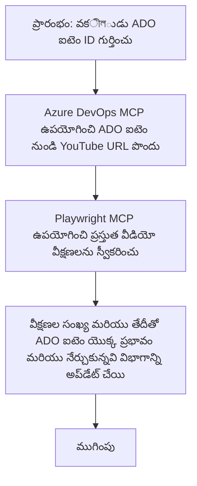

# కేస్ స్టడీ: MCP తో YouTube డేటా ఉపయోగించి Azure DevOps అంశాలను అప్‌డేట్ చేయడం

> **అసవిడి:** YouTube వంటి ప్లాట్‌ఫామ్‌ల నుండి డేటాతో Azure DevOps అంశాల అప్‌డేట్ ప్రక్రియను ఆటోమేట్ చేయగల ప్రస్తుత ఆన్‌లైన్ టూల్స్ మరియు నివేదికలు ఉన్నాయి. క్రింద ఇవ్వబడిన పరిస్తिथि MCP టూల్స్ ఆటోమేషన్ మరియు ఇంటిగ్రేషన్ పనిదైనట్లుగా ఎలా ఉపయోగించవచ్చును అనే ఉదాహరణగా మాత్రమే అందించబడింది.

## అవలోకనం

ఈ కేస్ స్టడీ మోడల్ కాంటెక్స్ట్ ప్రోటోకాల్ (MCP) మరియు దాని టూల్స్ ను ఉపయోగించి Azure DevOps (ADO) వర్క్ ఐటమ్స్ ను YouTube వంటివి ఆన్‌లైన్ ప్లాట్‌ఫారమ్‌ల నుంచి సేకరించిన సమాచారంతో ఆటోమేటి చేయడం ఎలా జరుగుతుందో ఒక ఉదాహరణ చూపిస్తుంది. వివరించిన పరిస్తితి ఈ టూల్స్ యొక్క విస్తృత సామర్ధ్యాల్లో ఒకటి మాత్రమే, ఇవి ఇలాంటి అనేక ఆటోమేషన్ అవసరాలకు అనుకూలంగా మార్చుకోవచ్చు.

ఈ ఉదాహరణలో, ఒక అడ్వకేట్ ఆన్‌లైన్ సెషన్స్ ను ADO అంశాలు ఉపయోగించి ట్రాక్ చేస్తాడు, ప్రతీ అంశంలో YouTube వీడియో URL ఉంటుంది. MCP టూల్స్ ద్వారా అడ్వకేట్ ADO అంశాలను తాజా వీడియో వ్యూవర్ లెక్కలు వంటి వీడియో మెట్రిక్‌లు ఆటోమేటిక్‌గా మరియు పునరావృతంగా అప్‌డేట్ చేయవచ్చు. ఈ విధానం ఇతర సందర్భాలలో కూడా ఉపయోగించవచ్చు, ఎక్కడ ఆన్‌లైన్ మూలాల నుండి సమాచారం ADO లేదా ఇతర సిస్టమ్స్‌లోకి ఇంటిగ్రేట్ చేయాల్సి ఉంటే.

## పరిస్తితి

ఒక అడ్వకేట్ ఆన్‌లైన్ సెషన్స్ మరియు కమ్యూనిటీ ఎంగేజ్‌మెంట్‌ల ప్రభావాన్ని ట్రాక్ చేయడానికి బాధ్యుడు. ప్రతి సెషన్ 'DevRel' ప్రాజెక్ట్‌లో ఒక ADO వర్క్ ఐటమ్‌గా నమోదవుతుంది, ఆ వర్క్ ఐటమ్‌లో YouTube వీడియో URL కోసం ఒక ఫీల్డ్ ఉంటుంది. సెషన్ యొక్క pru��తిని ఖచ్చితంగా నివేదించడానికి, అడ్వకేట్ ఇది ప్రస్తుత వీడియో వ్యూస్ సంఖ్య మరియు ఈ సమాచారం ఎప్పుడూ పొందబడిందో తేదీతో ADO అంశాన్ని అప్‌డేట్ చేయాలి.

## ఉపయోగించిన టూల్స్

- [Azure DevOps MCP](https://github.com/microsoft/azure-devops-mcp): MCP ద్వారా ADO వర్క్ ఐటమ్స్ ప్రోగ్రామాటిక్ యాక్సెస్ మరియు అప్‌డేట్లను అనుమతిస్తుంది.
- [Playwright MCP](https://github.com/microsoft/playwright-mcp): YouTube వీడియో గణాంకాలను వంటి వెబ్ పేజీల నుండి డేటాను సేకరించడానికి బ్రౌజర్ చర్యలను ఆటోమేట్ చేస్తుంది.

## దశల వారీ పనివిధానం

1. **ADO ఐటమ్‌ను గుర్తించండి**: 'DevRel' ప్రాజెక్ట్‌లో ADO వర్క్ ఐటమ్ ID (ఉదా: 1234) తో ప్రారంభించండి.
2. **YouTube URL పొందండి**: ADO వర్క్ ఐటమ్ నుండి YouTube URL పొందటానికి Azure DevOps MCP టూల్‌ను ఉపయోగించండి.
3. **వీడియో వ్యూస్ తీసుకోండి**: Playwright MCP టూల్ ద్వారా YouTube URL కి వెళ్లి ప్రస్తుత వ్యూ కౌంట్‌ను సేకరించండి.
4. **ADO ఐటమ్ అప్‌డేట్ చేయండి**: తాజా వ్యూ కౌంట్ మరియు పొందిన తేదీని Azure DevOps MCP టూల్ ఉపయోగించి ADO వర్క్ ఐటమ్‌లో 'Impact and Learnings' సెక్షన్‌లో వ్రాయండి.

## ఉదాహరణ ప్రాంప్ట్

```bash
- Work with the ADO Item ID: 1234
- The project is '2025-Awesome'
- Get the YouTube URL for the ADO item
- Use Playwright to get the current views from the YouTube video
- Update the ADO item with the current video views and the updated date of the information
```

## Mermaid Flowchart


## పరిణామాత్మక అమలు

- **MCP ఆర్కెస్ట్రేషన్**: వర్క్‌ఫ్లో MCP సర్వర్ ద్వారా ఆర్కెస్ట్రేట్ చేయబడుతుంది, ఇది Azure DevOps MCP మరియు Playwright MCP టూల్స్ ఉపయోగాన్ని సమన్వయ పరుస్తుంది.
- **ఆటోమేషన్**: ప్రక్రియ మాన్యువల్‌గా ప్రారంభించవచ్చు లేదా ADO అంశాలను తాజా ఉంచడానికి క్రమం తప్పకుండా నడిపించడానికి షెడ్యూల్ చేయవచ్చు.
- **విస్తరణీయత**: ఇదే పద్ధతి ఇతర ఆన్‌లైన్ మెట్రిక్‌ల (ఉదా: లైక్స్, కామెంట్లు) లేదా ఇతర ప్లాట్‌ఫారమ్‌ల నుంచి ADO అంశాలను అప్‌డేట్ చేయడానికి ఉపయోగించవచ్చు.

## ఫలితాలు మరియు ప్రభావం

- **దక్షత**: అడ్వకేట్లకు వీడియో మెట్రిక్స్ సేకరణ మరియు అప్‌డేట్ చేయడం మాన్యువల్ ప్రయత్నాన్ని గణనీయంగా తగ్గిస్తుంది.
- **ఖచ్చితత్వం**: ADO అంశాలు ఆన్‌లైన్ మూలాల నుండి అందుబాటులో ఉన్న తాజా డేటాను ప్రతిబింబిస్తాయని నిర్ధారిస్తుంది.
- **పునర్వినియోగం**: ఇతర డేటా మూలాలు లేదా మెట్రిక్స్‌ను ఉపయోగించే అపారమైన పరిస్తితుల కోసం తిరిగి ఉపయోగించుకునే వర్క్‌ఫ్లో అందిస్తుంది.

## రిఫరెన్సులు

- [Azure DevOps MCP](https://github.com/microsoft/azure-devops-mcp)
- [Playwright MCP](https://github.com/microsoft/playwright-mcp)
- [Model Context Protocol (MCP)](https://modelcontextprotocol.io/)

## తదుపరి ఏది

- వెనుకికి: [Case Studies Overview](./README.md)
- తదుపరి: [కంటిన్యూస్ - MCP తో రియల్-టైమ్ డాక్యుమెంటేషన్ రిట్రీవల్](./docs-mcp/README.md)

---

<!-- CO-OP TRANSLATOR DISCLAIMER START -->
**తగ్గింపు**:  
ఈ పత్రం AI అనువాద సేవ [Co-op Translator](https://github.com/Azure/co-op-translator) ఉపయోగించి అనువదించబడింది. మనం ఖచ్చితత్వానికి ప్రయత్నించినప్పటికీ, ఆటోమేటెడ్ అనువాదాల్లో తప్పులూ లేదా అసత్యతలు ఉండవచ్చు. అసలు పత్రం దాని స్థానిక భాషలో ఉన్న పూర్తి, ప్రామాణిక మూలం అని పరిగణించాలి. ముఖ్యమైన సమాచారం కోసం, ప్రొఫెషనల్ మానవ అనువాదం అవసరం. ఈ అనువాదం వలన కలిగే ఏవైనా అవగాహనా తప్పులు లేదా అర్థం తప్పు పరిస్థితులకు మేము బాధ్యత వహించము.
<!-- CO-OP TRANSLATOR DISCLAIMER END -->