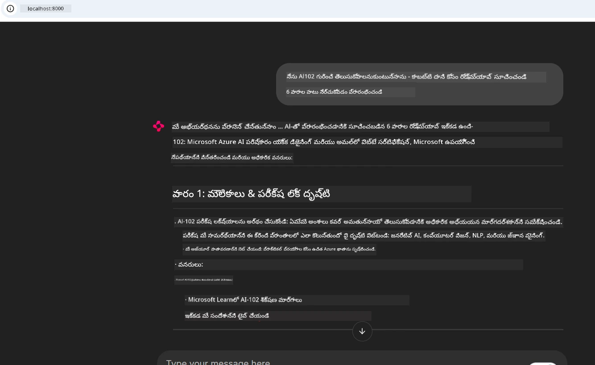
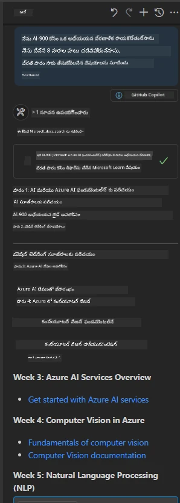

# కేస్ స్టడీ: క్లయింట్ నుండి Microsoft Learn Docs MCP సర్వర్‌కు కలిసే విధానం

మీరు ఎప్పుడైనా డాక్యుమెంటేషన్ సైట్స్, Stack Overflow, మరియు ఎండ లేని సెర్చ్ ఇంజిన్ టాబ్ల మధ్య జాగ్రత్తగా చురుగ్గా తిరుగుతూ ఉండి మీ కోడ్ లో సమస్యను పరిష్కరించడంలో కష్టపడుతున్నారా? మీరు_docs కోసం రెండవ మానిటర్ పెట్టుకున్నవారు కాదా, లేదా మీ IDE మరియు బ్రౌజర్ మధ్య ఎల్లప్పుడూaltetab చేస్తూ ఉంటారా? డాక్యుమెంటేషన్ ని నేరుగా మీ వర్క్‌ఫ్లో లోకి తెచ్చుకునే అవకాశం ఉంటే ఎంత బాగుండేది - మీ యాప్స్, IDE, లేదా మీ స్వంత ప్రత్యేక టూల్స్ లో సంయోజింపబడినదిగా? ఈ కేస్ స్టడీలో, మీ స్వంత క్లయింట్ అప్లికేషన్ నుండి Microsoft Learn Docs MCP సర్వర్ కు నేరుగా కలసే విధానాన్ని పరిశీలిస్తాము. 

## అవలోకనం

ఆధునిక డెవలప్‌మెంట్ అనేది కేవలం కోడ్ రాయడమే కాకుండా, సరైన సమయానికి సరైన సమాచారాన్ని కనుగొనడం. డాక్యుమెంటేషన్ ఎక్కడికక్కడా ఉన్నా కదా, కానీ అది మీరు ఎక్కువగా అవసరం పడే చోట — మీ టూల్స్ మరియు వర్క్‌ఫ్లోలలో కాదు. డాక్యుమెంటేషన్‌ను ప్రత్యక్షంగా మీ అప్లికేషన్లలో పొందుపర్చటం ద్వారా మీరు సమయాన్ని ఆదా చేసుకోవచ్చు, సన్నివేశ మార్పును తగ్గించవచ్చు మరియు ఉత్పాదకత్వం పెంచవచ్చు. ఈ విభాగంలో, Microsoft Learn Docs MCP సర్వర్‌తో క్లయింట్‌ను ఎలా కలిసిపెట్టుకోవాలో చూపిస్తాము, అందువల్ల మీరు ఎప్పుడూ మీ యాప్ నుండి బయటకు లేకు ఆ ధారాళమైన, సందర్భ అవగాహన ఉన్న డాక్యుమెంటేషన్‌ను పొందవచ్చు.

మేము కలయిక ఏర్పరచటం, అభ్యర్థన పంపటం, మరియు స్ట్రీమింగ్ ప్రతిస్పందనలను సమర్థవంతంగా హ్యాండిల్ చేయటానికి ప్రక్రియను చూపిస్తాము. ఈ విధానమూ కేవలం మీ వర్క్‌ఫ్లోను సులభతరం చేయడమే కాక, మరింత తెలివైన, సహాయకమైన డెవలపర్ టూల్స్ అభివృద్ధికి ద్వారం తెరుస్తుంది.

## నేర్చుకోవాల్సిన లక్ష్యాలు

మనం ఎందుకు చేస్తున్నాం? ఉత్తమ డెవలపర్ అనుభవాలు friction ను తొలగించే ఏవైనవే. ఊహించుకోండి ఒక ప్రపంచం లో మీ కోడ్ ఎడిటర్, చాట్బాట్, లేదా వెబ్ యాప్ మీ డాక్యుమెంటేషన్ ప్రశ్నలకు వెంటనే Microsoft Learn నుండి తాజా కంటెంట్ ఉపయోగించి సమాధానం చెప్పగలిగే దరువు. ఈ అధ్యాయం ముగింపు క్షణానికి, మీరు:

- డాక్యుమెంటేషన్ కోసం MCP సర్వర్-క్లయింట్ కమ్యూనికేషన్ యొక్క ప్రాథమికాలు అర్థం చేసుకోవడం
- Microsoft Learn Docs MCP సర్వర్‌కి కనెక్ట్ అయ్యే కన్సోల్ లేదా వెబ్ అప్లికేషన్ అమలు చేయడం
- సజీవ డాక్యుమెంటేషన్ పొందేందుకు స్ట్రీమింగ్ HTTP క్లయింట్‌లను ఉపయోగించడం
- మీ అప్లికేషన్‌లో డాక్యుమెంటేషన్ ప్రత్యుత్తరాలను లాగ్ చేసి సమీక్షించడం

ఇది మీరు రెస్పాన్సివ్ మాత్రమే కాకుండా నిజమైన ఇంటరాక్టివ్ మరియు సందర్భ అవగాహన గల టూల్స్ ను నిర్మించడంలో సహాయపడుతుంది.

## సన్నివేశం 1 - MCP తో రియల్-టైమ్ డాక్యుమెంటేషన్ రిట్రీవల్

ఈ సన్నివేశంలో, Microsoft Learn Docs MCP సర్వర్‌కు క్లయింట్‌ను ఎలా కలుపుకోవాలో చూపిస్తాం, అప్పుడు మీరు ఎప్పుడూ మీ యాప్ నుండి బయటకు లేని సజీవ, సందర్భ-అవగాహన ఉన్న డాక్యుమెంటేషన్ ను పొందవచ్చు.

దీనిని ప్రాక్టిస్ చేయండి. Microsoft Learn Docs MCP సర్వర్‌కు కనెక్ట్ అయ్యే, `microsoft_docs_search` టూల్ ను పిలిచే, మరియు స్ట్రీమింగ్ ప్రతిస్పందనను కన్సోల్‌లో లాగ్ చేసే యాప్ రాయడం మీ పని.

### ఈ విధానం ఎందుకు?
ఇది మరింత అభివృద్ధి చెందిన సమగ్రతలకు ఆధారమైనది - మీరు చాట్‌బాట్, IDE ఎక్స్‌టెన్షన్ లేదా వెబ్ డాష్‌బోర్డ్ పవర్ చేయాలనుకున్నా సరే.

ఈ సన్నివేశానికి సంబంధించిన కోడ్ మరియు సూచనలు ఈ కేస్ స్టడీ లోని [`solution`](./solution/README.md) ఫోల్డర్‌లో ఉన్నాయి. ఈ దశలు మీకు కనెక్షన్ సెటప్ చేయడంలో సహాయపడతాయి:
- అధికారిక MCP SDK మరియు స్ట్రీమబుల్ HTTP క్లయింట్ ఉపయోగించి కనెక్షన్‌ సెట్ అప్ చేయండి
- డాక్యుమెంటేషన్ పొందేందుకు క్వెరీ పారామీటర్ తో `microsoft_docs_search` టూల్ ను పిలవండి
- సరైన లాగింగ్ మరియు లోపాల నిర్వహణను అమలు చేయండి
- యూజర్లకు బహుళ శోధన పర్యాయ పదాలు ఇచ్చేటటువంటి ఇంటరాక్టివ్ కన్సోల్ ఇంటర్‌ఫేస్ సృష్టించండి

ఈ సన్నివేశం చూపిస్తుంది:
- Docs MCP సర్వర్‌కు కనెక్ట్ అవడం
- క్వెరీ పంపడం
- ఫలితాలను పఠించడం మరియు ముద్రించడం

సొల్యూషన్ నడిపితే ఎలా కనిపించొచ్చో ఇది:

```
Prompt> What is Azure Key Vault?
Answer> Azure Key Vault is a cloud service for securely storing and accessing secrets. ...
```

క్రింది విధంగా కనిష్ట నమూనా సొల్యూషన్ ఉంది. పూర్తి కోడ్ మరియు వివరాలు సొల్యూషన్ ఫోల్డర్ లో అందుబాటులో ఉన్నాయి.

<details>
<summary>Python</summary>

```python
import asyncio
from mcp.client.streamable_http import streamablehttp_client
from mcp import ClientSession

async def main():
    async with streamablehttp_client("https://learn.microsoft.com/api/mcp") as (read_stream, write_stream, _):
        async with ClientSession(read_stream, write_stream) as session:
            await session.initialize()
            result = await session.call_tool("microsoft_docs_search", {"query": "Azure Functions best practices"})
            print(result.content)

if __name__ == "__main__":
    asyncio.run(main())
```

- పూర్తి అమలుకు మరియు లాగింగ్‌కు [`scenario1.py`](../../../../09-CaseStudy/docs-mcp/solution/python/scenario1.py) చూడండి.
- ఇన్‌స్టాలేషన్ మరియు ఉపయోగ సూచనల కోసం అదే ఫోల్డర్లోని [`README.md`](./solution/python/README.md) చూడండి.
</details>


## సన్నివేశం 2 - MCP తో ఇంటరాక్టివ్ స్టడీ ప్లాన్ జనరేటర్ వెబ్ యాప్

ఈ సన్నివేశంలో, మీరు Docs MCPని వెబ్ డెవలప్‌మెంట్ ప్రాజెక్ట్‌లో ఎలా కలుపుకోవాలో నేర్చుకుంటారు. లక్ష్యం యూజర్లు Microsoft Learn డాక్యుమెంటేషన్‌ను నేరుగా వెబ్ ఇంటర్‌ఫేస్ నుండి శోధించగలగడం, డాక్యుమెంటేషన్ ను మీ యాప్ లేదా సైట్ లో తక్షణమే అందుబాటులో ఉంచడం.

మీరు తెలుసుకుంటారు:
- వెబ్ యాప్ సెటప్ చేయడం
- Docs MCP సర్వర్‌ కు కనెక్ట్ కావడం
- యూజర్ ఇన్‌పుట్ ను హ్యాండిల్ చేసి ఫలితాలు చూపించడం

సొల్యూషన్ నడిపితే ఇలా ఉంటుంది:

```
User> I want to learn about AI102 - so suggest the roadmap to get it started from learn for 6 weeks

Assistant> Here’s a detailed 6-week roadmap to start your preparation for the AI-102: Designing and Implementing a Microsoft Azure AI Solution certification, using official Microsoft resources and focusing on exam skills areas:

---
## Week 1: Introduction & Fundamentals
- **Understand the Exam**: Review the [AI-102 exam skills outline](https://learn.microsoft.com/en-us/credentials/certifications/exams/ai-102/).
- **Set up Azure**: Sign up for a free Azure account if you don't have one.
- **Learning Path**: [Introduction to Azure AI services](https://learn.microsoft.com/en-us/training/modules/intro-to-azure-ai/)
- **Focus**: Get familiar with Azure portal, AI capabilities, and necessary tools.

....more weeks of the roadmap...

Let me know if you want module-specific recommendations or need more customized weekly tasks!
```

క్రింది కనిష్ట నమూనా సొల్యూషన్ ఉంది. పూర్తి కోడ్ మరియు వివరాలు సొల్యూషన్ ఫోల్డర్ లో అందుబాటులో ఉన్నాయి.



<details>
<summary>Python (Chainlit)</summary>

Chainlit అనేది సంభాషణాత్మక AI వెబ్ యాప్స్ సృష్టించేందుకు ఉపయోగించే ఫ్రేమ్‌వర్క్. ఇది MCP టూల్స్‌ను పిలవగలిగే, ఫలితాలను సజీవంగా ప్రదర్శించగల చాట్‌బోట్లను సులభంగా సృష్టించడానికి ఉపయోగపడుతుంది. ఇది వేగవంతమైన ప్రోటోటైపింగ్ మరియు వినియోగదారుకు స్నేహపూర్వక ఇంటర్‌ఫేస్‌లకు అనుకూలం.

```python
import chainlit as cl
import requests

MCP_URL = "https://learn.microsoft.com/api/mcp"

@cl.on_message
def handle_message(message):
    query = {"question": message}
    response = requests.post(MCP_URL, json=query)
    if response.ok:
        result = response.json()
        cl.Message(content=result.get("answer", "No answer found.")).send()
    else:
        cl.Message(content="Error: " + response.text).send()
```

- పూర్తి అమలుకు [`scenario2.py`](../../../../09-CaseStudy/docs-mcp/solution/python/scenario2.py) చూడండి.
- సెటప్ మరియు నడిపించడానికి [`README.md`](./solution/python/README.md) చూడండి.
</details>


## సన్నివేశం 3: VS Code లో MCP సర్వర్ తో ఎడిటర్ లో డాక్స్

మీరు మైక్రోసాఫ్ట్ లెర్న్ డాక్స్ ను నేరుగా VS Code లో పొందాలనుకుంటే (బ్రౌజర్ టాబ్స్ మార్చుకోకుండా), మీ ఎడిటర్‌లో MCP సర్వర్‌ను ఉపయోగించవచ్చు. దీని ద్వారా మీరు:
- కోడ్ రాస్తున్న వాతావరణం నుంచి బయటకు లేకుండా VS Code లో డాక్యుమెంటేషన్ శోధించి చదవవచ్చు.
- README లేదా కోర్సు ఫైళ్ళలో నేరుగా డాక్యుమెంటేషన్, లింకులను సూచించండి.
- GitHub Copilot మరియు MCP కాంబినేషన్ తో ఒక సాగే, AI-శక్తివంతమైన డాక్యుమెంటేషన్ వర్క్‌ఫ్లోను ఉపయోగించండి.

**మీరు నేర్చుకోబోయేది:**
- మీరు పనిచేస్తున్న వర్క్‌స్పేస్ రూట్ లో చెల్లుబాటు అయ్యే `.vscode/mcp.json` ఫైల్ చేర్చడం (క్రింది ఉదాహరణ చూడండి).
- MCP ప్యానెల్‌ని తెరిచి లేదా VS Code లో కమాండ్ పలెట్ ఉపయోగించి డాక్స్ శోధించడం మరియు చేర్చడం.
- మీరు పని చేస్తున్న మార్క్‌డౌన్ ఫైళ్లలో నేరుగా డాక్యుమెంటేషన్ సూచించడం.
- ఈ వర్క్‌ఫ్లోను GitHub Copilot తో కలుపుకుని మరింత ఉత్పాదకత అందుకోవడం.

ఇదిగో VS Code లో MCP సర్వర్ సెటప్ చేసే ఉదాహరణ:

```json
{
  "servers": {
    "LearnDocsMCP": {
      "url": "https://learn.microsoft.com/api/mcp"
    }
  }
}
```

</details>

> స్క్రీన్‌షాట్‌లు మరియు దశల వారీ మార్గదర్శకం కోసం [`README.md`](./solution/scenario3/README.md) చూడండి.



ఈ విధానం సాంకేతిక కోర్సులు నిర్మించడం, డాక్యుమెంటేషన్ రాయటం, లేదా తరచుగా సూచనలతో కోడ్ అభివృద్ధి చేస్తున్నవారికి అనుకూలం.

## ప్రధాన గ్రహణీయాంశాలు

డాక్యుమెంటేషన్‌ని ప్రత్యక్షంగా మీ టూల్స్‌లో సంయోజించటం కేవలం సౌకర్యంగా కాక, ఉత్పాదకత కోసం గేమ్ చేంజర్. మీ క్లయింట్ నుండి Microsoft Learn Docs MCP సర్వర్‌కి కనెక్ట్ అయ్యే ప్రతిఫలాలు:

- మీ కోడ్ మరియు డాక్యుమెంటేషన్ మధ్య సన్నివేశ మార్పును తొలగించండి
- సజీవ, సందర్భ-అవగాహన ఉన్న తాజా డాక్స్ పొందండి
- మరింత తెలివైన, ఇంటరాక్టివ్ డెవలపర్ టూల్స్ ను అభివృద్ధి చేయండి

ఈ నైపుణ్యాలు మీరు సృష్టించే పరిష్కారాలను సమర్థవంతమైనదిగా కాక, వినియోగానికి ఆనందదాయకంగా కూడా చేస్తాయి.

## అదనపు వనరులు

మీ అవగాహన ను గాఢం చేయడానికి ఈ అధికారిక వనరులను అన్వేషించండి:

- [Microsoft Learn Docs MCP Server (GitHub)](https://github.com/MicrosoftDocs/mcp)
- [Azure MCP Server మొదలు పెట్టడం (mcp-python)](https://learn.microsoft.com/en-us/azure/developer/azure-mcp-server/get-started#create-the-python-app)
- [Azure MCP Server అంటే ఏమిటి?](https://learn.microsoft.com/en-us/azure/developer/azure-mcp-server/)
- [మోడల్ కాంటెక్స్ట్ ప్రోటోకాల్ (MCP) పరిచయం](https://modelcontextprotocol.io/introduction)
- [MCP సర్వర్ నుండి ప్లగిన్లు జోడించడం (Python)](https://learn.microsoft.com/en-us/semantic-kernel/concepts/plugins/adding-mcp-plugins)

## తదుపరి

- తిరిగి వెళ్లండి: [కేస్ స్టడీస్ అవలోకనం](../README.md)
- కొనసాగించండి: [మాడ్యూల్ 10: AI టూల్ కిట్ తో AI వర్క్‌ఫ్లోల సులభతరం](../../10-StreamliningAIWorkflowsBuildingAnMCPServerWithAIToolkit/README.md)

---

<!-- CO-OP TRANSLATOR DISCLAIMER START -->
**డిస్క్లైమర్**:  
ఈ పత్రాన్ని AI అనువాద సేవ [Co-op Translator](https://github.com/Azure/co-op-translator) ఉపయోగించి అనువదించడం జరిగింది. మేము సరిగ్గా అనువదించేందుకు ప్రయత్నించుకున్నప్పటికీ, స్వయంచాలక అనువాదాలలో పొరపాట్లు లేదా అపరిశుద్ధతలు ఉండొచ్చు. మౌలిక భాషలో ఉన్న అసలు పత్రాన్ని అధికారిక మూలంగా తీసుకోవాలి. అవసరమైన సమాచారానికి, ప్రొఫెషనల్ మానవ అనువాదం సిఫారసు చేయబడింది. ఈ అనువాదం ఉపయోగంవల్ల ఏర్పడగల భ్రమలు లేదా తప్పు అర్థాలను కారణంగా మేము బాధ్యత వహించమూ.
<!-- CO-OP TRANSLATOR DISCLAIMER END -->