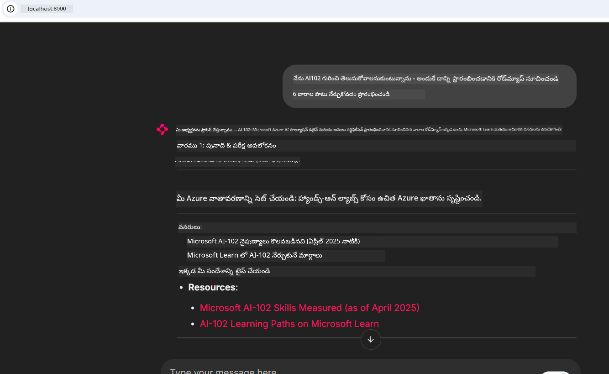
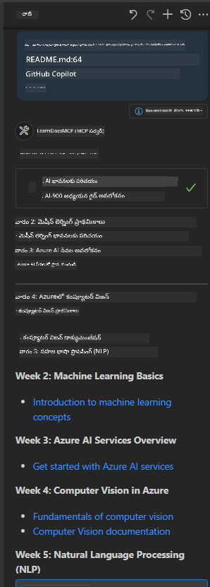

<!--
CO_OP_TRANSLATOR_METADATA:
{
  "original_hash": "4319d291c9d124ecafea52b3d04bfa0e",
  "translation_date": "2025-12-11T13:40:27+00:00",
  "source_file": "09-CaseStudy/docs-mcp/README.md",
  "language_code": "te"
}
-->
# కేసు అధ్యయనం: క్లయింట్ నుండి Microsoft Learn Docs MCP సర్వర్‌కు కనెక్ట్ అవడం

మీరు ఎప్పుడైనా డాక్యుమెంటేషన్ సైట్ల, Stack Overflow, మరియు అంతులేని సెర్చ్ ఇంజిన్ ట్యాబ్ల మధ్య జాగ్రత్తగా మారుతూ, మీ కోడ్‌లో సమస్యను పరిష్కరించడానికి ప్రయత్నిస్తున్నారా? మీరు డాక్స్ కోసం రెండవ మానిటర్‌ను ఉంచుకున్నారా, లేదా మీ IDE మరియు బ్రౌజర్ మధ్య ఎల్లప్పుడూ అల్ట్-టాబ్ చేస్తున్నారా? డాక్యుమెంటేషన్‌ను నేరుగా మీ వర్క్‌ఫ్లోలోకి తీసుకురావడం—మీ యాప్స్, IDE, లేదా మీ స్వంత కస్టమ్ టూల్స్‌లో సమగ్రపరచడం—మంచిదే కాదా? ఈ కేసు అధ్యయనంలో, మీ స్వంత క్లయింట్ అప్లికేషన్ నుండి Microsoft Learn Docs MCP సర్వర్‌కు నేరుగా కనెక్ట్ అవ్వడం ఎలా చేయాలో మనం పరిశీలిస్తాము.

## అవలోకనం

ఆధునిక అభివృద్ధి కేవలం కోడ్ రాయడం మాత్రమే కాదు—సరైన సమయంలో సరైన సమాచారాన్ని కనుగొనడం కూడా. డాక్యుమెంటేషన్ ఎక్కడా ఉంటుంది, కానీ అది మీరు ఎక్కువగా అవసరం ఉన్న చోట ఉండదు: మీ టూల్స్ మరియు వర్క్‌ఫ్లోలో. డాక్యుమెంటేషన్ రిట్రీవల్‌ను నేరుగా మీ అప్లికేషన్లలో సమగ్రపరచడం ద్వారా, మీరు సమయం ఆదా చేసుకోవచ్చు, కాంటెక్స్ట్ స్విచ్చింగ్ తగ్గించుకోవచ్చు, మరియు ఉత్పాదకత పెంచుకోవచ్చు. ఈ విభాగంలో, Microsoft Learn Docs MCP సర్వర్‌కు క్లయింట్‌ను ఎలా కనెక్ట్ చేయాలో చూపిస్తాము, తద్వారా మీరు మీ యాప్‌ను వదిలి వెళ్లకుండా రియల్-టైమ్, కాంటెక్స్ట్-అవేర్ డాక్యుమెంటేషన్‌ను యాక్సెస్ చేసుకోవచ్చు.

మనం కనెక్షన్ స్థాపించడం, అభ్యర్థన పంపడం, మరియు స్ట్రీమింగ్ ప్రతిస్పందనలను సమర్థవంతంగా నిర్వహించడం ప్రక్రియను దశలవారీగా చూద్దాము. ఈ విధానం మీ వర్క్‌ఫ్లోను సులభతరం చేయడమే కాక, మరింత తెలివైన, సహాయకరమైన డెవలపర్ టూల్స్ నిర్మించడానికి ద్వారం తెరుస్తుంది.

## నేర్చుకునే లక్ష్యాలు

మనం ఇది ఎందుకు చేస్తున్నాం? ఎందుకంటే ఉత్తమ డెవలపర్ అనుభవాలు అవి అవరోధాలను తొలగిస్తాయి. మీ కోడ్ ఎడిటర్, చాట్‌బాట్, లేదా వెబ్ యాప్ Microsoft Learn నుండి తాజా కంటెంట్ ఉపయోగించి మీ డాక్యుమెంటేషన్ ప్రశ్నలకు తక్షణమే సమాధానం చెప్పగలిగితే ఎలా ఉంటుంది? ఈ అధ్యాయం చివరికి, మీరు తెలుసుకుంటారు:

- డాక్యుమెంటేషన్ కోసం MCP సర్వర్-క్లయింట్ కమ్యూనికేషన్ యొక్క ప్రాథమికాలు
- Microsoft Learn Docs MCP సర్వర్‌కు కనెక్ట్ అయ్యే కన్సోల్ లేదా వెబ్ అప్లికేషన్‌ను అమలు చేయడం
- రియల్-టైమ్ డాక్యుమెంటేషన్ రిట్రీవల్ కోసం స్ట్రీమింగ్ HTTP క్లయింట్లను ఉపయోగించడం
- మీ అప్లికేషన్‌లో డాక్యుమెంటేషన్ ప్రతిస్పందనలను లాగ్ చేసి విశ్లేషించడం

ఈ నైపుణ్యాలు మీరు ప్రతిస్పందించే కాకుండా నిజంగా ఇంటరాక్టివ్ మరియు కాంటెక్స్ట్-అవేర్ టూల్స్‌ను నిర్మించడంలో సహాయపడతాయి.

## సన్నివేశం 1 - MCP తో రియల్-టైమ్ డాక్యుమెంటేషన్ రిట్రీవల్

ఈ సన్నివేశంలో, Microsoft Learn Docs MCP సర్వర్‌కు క్లయింట్‌ను కనెక్ట్ చేయడం ఎలా చేయాలో చూపిస్తాము, తద్వారా మీరు మీ యాప్‌ను వదిలి వెళ్లకుండా రియల్-టైమ్, కాంటెక్స్ట్-అవేర్ డాక్యుమెంటేషన్‌ను యాక్సెస్ చేసుకోవచ్చు.

దీనిని ప్రాక్టీస్‌లో పెట్టుకుందాం. మీ పని Microsoft Learn Docs MCP సర్వర్‌కు కనెక్ట్ అయ్యే యాప్‌ను రాయడం, `microsoft_docs_search` టూల్‌ను పిలవడం, మరియు స్ట్రీమింగ్ ప్రతిస్పందనను కన్సోల్‌లో లాగ్ చేయడం.

### ఈ విధానం ఎందుకు?
ఇది మరింత అభివృద్ధి చెందిన సమగ్రపరచల కోసం పునాది—మీరు చాట్‌బాట్, IDE ఎక్స్‌టెన్షన్, లేదా వెబ్ డాష్‌బోర్డ్‌ను పవర్ చేయాలనుకుంటే.

ఈ సన్నివేశానికి సంబంధించిన కోడ్ మరియు సూచనలు ఈ కేసు అధ్యయనంలోని [`solution`](./solution/README.md) ఫోల్డర్‌లో ఉన్నాయి. ఈ దశలు కనెక్షన్ సెటప్ చేయడంలో మీకు మార్గనిర్దేశం చేస్తాయి:
- కనెక్షన్ కోసం అధికారిక MCP SDK మరియు స్ట్రీమబుల్ HTTP క్లయింట్ ఉపయోగించండి
- డాక్యుమెంటేషన్ రిట్రీవల్ కోసం క్వెరీ పారామీటర్‌తో `microsoft_docs_search` టూల్‌ను పిలవండి
- సరైన లాగింగ్ మరియు లోపాల నిర్వహణను అమలు చేయండి
- వినియోగదారులు బహుళ సెర్చ్ క్వెరీలను నమోదు చేయడానికి ఇంటరాక్టివ్ కన్సోల్ ఇంటర్‌ఫేస్ సృష్టించండి

ఈ సన్నివేశం ఎలా చేయాలో చూపిస్తుంది:
- Docs MCP సర్వర్‌కు కనెక్ట్ అవ్వడం
- క్వెరీ పంపడం
- ఫలితాలను పార్స్ చేసి ప్రింట్ చేయడం

సొల్యూషన్ నడుస్తున్న విధానం ఇలా ఉండవచ్చు:

```
Prompt> What is Azure Key Vault?
Answer> Azure Key Vault is a cloud service for securely storing and accessing secrets. ...
```

క్రింద ఒక కనిష్ట నమూనా సొల్యూషన్ ఉంది. పూర్తి కోడ్ మరియు వివరాలు సొల్యూషన్ ఫోల్డర్‌లో అందుబాటులో ఉన్నాయి.

<details>
<summary>Python</summary>

```python
import asyncio
from mcp.client.streamable_http import streamablehttp_client
from mcp import ClientSession

async def main():
    async with streamablehttp_client("https://learn.microsoft.com/api/mcp") as (read_stream, write_stream, _):
        async with ClientSession(read_stream, write_stream) as session:
            await session.initialize()
            result = await session.call_tool("microsoft_docs_search", {"query": "Azure Functions best practices"})
            print(result.content)

if __name__ == "__main__":
    asyncio.run(main())
```

- పూర్తి అమలు మరియు లాగింగ్ కోసం, [`scenario1.py`](../../../../09-CaseStudy/docs-mcp/solution/python/scenario1.py) చూడండి.
- ఇన్‌స్టాలేషన్ మరియు ఉపయోగ సూచనల కోసం, అదే ఫోల్డర్‌లోని [`README.md`](./solution/python/README.md) ఫైల్ చూడండి.
</details>


## సన్నివేశం 2 - MCP తో ఇంటరాక్టివ్ స్టడీ ప్లాన్ జనరేటర్ వెబ్ యాప్

ఈ సన్నివేశంలో, Docs MCP ను వెబ్ అభివృద్ధి ప్రాజెక్టులో ఎలా సమగ్రపరచాలో నేర్చుకుంటారు. లక్ష్యం వినియోగదారులు Microsoft Learn డాక్యుమెంటేషన్‌ను నేరుగా వెబ్ ఇంటర్‌ఫేస్ నుండి శోధించగలగడం, తద్వారా డాక్యుమెంటేషన్‌ను మీ యాప్ లేదా సైట్‌లో తక్షణమే అందుబాటులో ఉంచడం.

మీరు ఎలా చేయాలో చూడబోతున్నారు:
- వెబ్ యాప్ సెటప్ చేయడం
- Docs MCP సర్వర్‌కు కనెక్ట్ అవ్వడం
- వినియోగదారుల ఇన్‌పుట్‌ను నిర్వహించడం మరియు ఫలితాలను ప్రదర్శించడం

సొల్యూషన్ నడుస్తున్న విధానం ఇలా ఉండవచ్చు:

```
User> I want to learn about AI102 - so suggest the roadmap to get it started from learn for 6 weeks

Assistant> Here’s a detailed 6-week roadmap to start your preparation for the AI-102: Designing and Implementing a Microsoft Azure AI Solution certification, using official Microsoft resources and focusing on exam skills areas:

---
## Week 1: Introduction & Fundamentals
- **Understand the Exam**: Review the [AI-102 exam skills outline](https://learn.microsoft.com/en-us/credentials/certifications/exams/ai-102/).
- **Set up Azure**: Sign up for a free Azure account if you don't have one.
- **Learning Path**: [Introduction to Azure AI services](https://learn.microsoft.com/en-us/training/modules/intro-to-azure-ai/)
- **Focus**: Get familiar with Azure portal, AI capabilities, and necessary tools.

....more weeks of the roadmap...

Let me know if you want module-specific recommendations or need more customized weekly tasks!
```

క్రింద ఒక కనిష్ట నమూనా సొల్యూషన్ ఉంది. పూర్తి కోడ్ మరియు వివరాలు సొల్యూషన్ ఫోల్డర్‌లో అందుబాటులో ఉన్నాయి.



<details>
<summary>Python (Chainlit)</summary>

Chainlit అనేది సంభాషణాత్మక AI వెబ్ యాప్స్ నిర్మాణానికి ఫ్రేమ్‌వర్క్. ఇది MCP టూల్స్‌ను పిలవగలిగే, ఫలితాలను రియల్ టైమ్‌లో ప్రదర్శించగలిగే ఇంటరాక్టివ్ చాట్‌బాట్స్ మరియు అసిస్టెంట్లను సులభంగా సృష్టిస్తుంది. ఇది వేగవంతమైన ప్రోటోటైపింగ్ మరియు వినియోగదారులకు అనుకూలమైన ఇంటర్‌ఫేస్‌లకు అనుకూలం.

```python
import chainlit as cl
import requests

MCP_URL = "https://learn.microsoft.com/api/mcp"

@cl.on_message
def handle_message(message):
    query = {"question": message}
    response = requests.post(MCP_URL, json=query)
    if response.ok:
        result = response.json()
        cl.Message(content=result.get("answer", "No answer found.")).send()
    else:
        cl.Message(content="Error: " + response.text).send()
```

- పూర్తి అమలుకు, [`scenario2.py`](../../../../09-CaseStudy/docs-mcp/solution/python/scenario2.py) చూడండి.
- సెటప్ మరియు నడిపే సూచనల కోసం, [`README.md`](./solution/python/README.md) చూడండి.
</details>


## సన్నివేశం 3: VS Code లో MCP సర్వర్‌తో ఇన్-ఎడిటర్ డాక్స్

మీరు Microsoft Learn Docs ను నేరుగా VS Code లో పొందాలనుకుంటే (బ్రౌజర్ ట్యాబ్లను మార్చకుండా), మీరు మీ ఎడిటర్‌లో MCP సర్వర్‌ను ఉపయోగించవచ్చు. ఇది మీరు చేయగలిగేది:
- VS Code లో కోడింగ్ వాతావరణం వదిలి వెళ్లకుండా డాక్స్ శోధించండి మరియు చదవండి.
- README లేదా కోర్సు ఫైళ్లలో నేరుగా డాక్యుమెంటేషన్‌ను సూచించండి మరియు లింకులను చేర్చండి.
- GitHub Copilot మరియు MCP ను కలిసి ఉపయోగించి సజావుగా, AI-శక్తితో కూడిన డాక్యుమెంటేషన్ వర్క్‌ఫ్లోని పొందండి.

**మీరు ఎలా చేయాలో చూడబోతున్నారు:**
- మీ వర్క్‌స్పేస్ రూట్‌లో సరైన `.vscode/mcp.json` ఫైల్‌ను జోడించండి (కింద ఉదాహరణ చూడండి).
- MCP ప్యానెల్‌ను తెరవండి లేదా VS Code లో కమాండ్ ప్యాలెట్ ఉపయోగించి డాక్స్ శోధించి చేర్చండి.
- మీరు పని చేస్తున్నప్పుడు మీ మార్క్డౌన్ ఫైళ్లలో నేరుగా డాక్యుమెంటేషన్‌ను సూచించండి.
- ఈ వర్క్‌ఫ్లోను GitHub Copilot తో కలిపి మరింత ఉత్పాదకత పొందండి.

VS Code లో MCP సర్వర్‌ను సెటప్ చేయడం ఎలా అనేది ఇక్కడ ఉంది:

```json
{
  "servers": {
    "LearnDocsMCP": {
      "url": "https://learn.microsoft.com/api/mcp"
    }
  }
}
```

</details>

> స్క్రీన్‌షాట్లు మరియు దశలవారీ మార్గదర్శకంతో విస్తృత వివరణ కోసం, [`README.md`](./solution/scenario3/README.md) చూడండి.



ఈ విధానం సాంకేతిక కోర్సులు నిర్మించడం, డాక్యుమెంటేషన్ రాయడం, లేదా తరచుగా సూచనలు అవసరమయ్యే కోడ్ అభివృద్ధి చేస్తున్నవారికి అనుకూలం.

## ముఖ్యమైన పాఠాలు

డాక్యుమెంటేషన్‌ను నేరుగా మీ టూల్స్‌లో సమగ్రపరచడం కేవలం సౌకర్యం మాత్రమే కాదు—ఉత్పాదకత కోసం ఒక గేమ్ చేంజర్. Microsoft Learn Docs MCP సర్వర్‌కు మీ క్లయింట్ నుండి కనెక్ట్ అవ్వడం ద్వారా, మీరు:

- మీ కోడ్ మరియు డాక్యుమెంటేషన్ మధ్య కాంటెక్స్ట్ స్విచ్చింగ్‌ను తొలగించవచ్చు
- రియల్ టైమ్‌లో తాజా, కాంటెక్స్ట్-అవేర్ డాక్స్‌ను పొందవచ్చు
- మరింత తెలివైన, ఇంటరాక్టివ్ డెవలపర్ టూల్స్‌ను నిర్మించవచ్చు

ఈ నైపుణ్యాలు మీరు కేవలం సమర్థవంతమైన కాకుండా, ఉపయోగించడానికి ఆనందకరమైన పరిష్కారాలను సృష్టించడంలో సహాయపడతాయి.

## అదనపు వనరులు

మీ అవగాహనను లోతుగా చేసుకోవడానికి, ఈ అధికారిక వనరులను అన్వేషించండి:

- [Microsoft Learn Docs MCP Server (GitHub)](https://github.com/MicrosoftDocs/mcp)
- [Azure MCP Server తో ప్రారంభించండి (mcp-python)](https://learn.microsoft.com/en-us/azure/developer/azure-mcp-server/get-started#create-the-python-app)
- [Azure MCP Server అంటే ఏమిటి?](https://learn.microsoft.com/en-us/azure/developer/azure-mcp-server/)
- [మోడల్ కాంటెక్స్ట్ ప్రోటోకాల్ (MCP) పరిచయం](https://modelcontextprotocol.io/introduction)
- [MCP సర్వర్ నుండి ప్లగిన్లు జోడించడం (Python)](https://learn.microsoft.com/en-us/semantic-kernel/concepts/plugins/adding-mcp-plugins)

---

<!-- CO-OP TRANSLATOR DISCLAIMER START -->
**అస్పష్టత**:  
ఈ పత్రాన్ని AI అనువాద సేవ [Co-op Translator](https://github.com/Azure/co-op-translator) ఉపయోగించి అనువదించబడింది. మేము ఖచ్చితత్వానికి ప్రయత్నించినప్పటికీ, ఆటోమేటెడ్ అనువాదాల్లో పొరపాట్లు లేదా తప్పిదాలు ఉండవచ్చు. మూల పత్రం దాని స్వదేశీ భాషలో అధికారిక మూలంగా పరిగణించాలి. ముఖ్యమైన సమాచారానికి, ప్రొఫెషనల్ మానవ అనువాదం సిఫార్సు చేయబడుతుంది. ఈ అనువాదం వాడకంలో ఏర్పడిన ఏవైనా అపార్థాలు లేదా తప్పుదారితీసే అర్థాలు కోసం మేము బాధ్యత వహించము.
<!-- CO-OP TRANSLATOR DISCLAIMER END -->