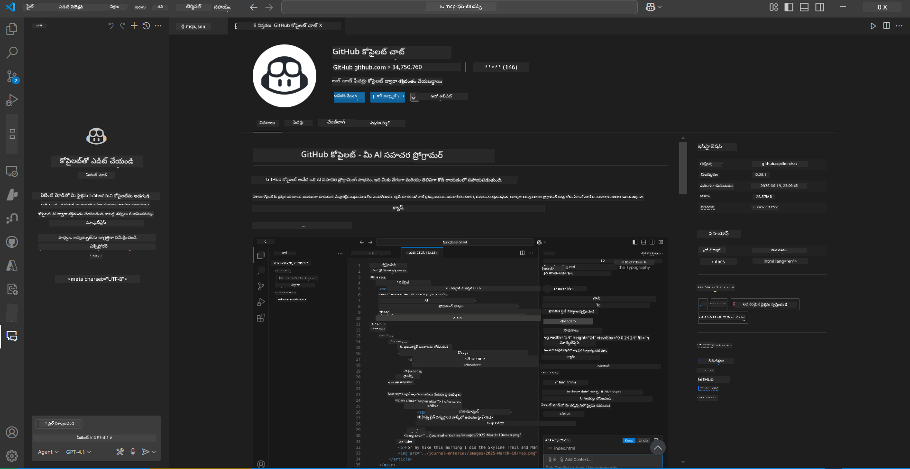
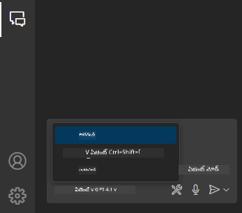
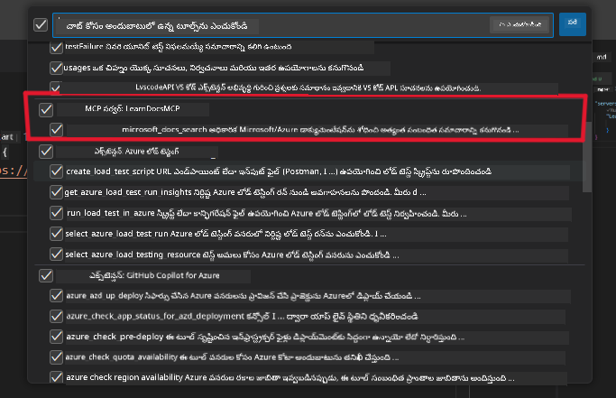
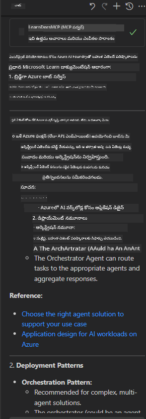

<!--
CO_OP_TRANSLATOR_METADATA:
{
  "original_hash": "db532b1ec386c9ce38c791653dc3c881",
  "translation_date": "2025-12-11T13:46:58+00:00",
  "source_file": "09-CaseStudy/docs-mcp/solution/scenario3/README.md",
  "language_code": "te"
}
-->
# సన్నివేశం 3: VS కోడ్‌లో MCP సర్వర్‌తో ఇన్-ఎడిటర్ డాక్స్

## అవలోకనం

ఈ సన్నివేశంలో, మీరు MCP సర్వర్ ఉపయోగించి Microsoft Learn Docs ను నేరుగా మీ Visual Studio Code వాతావరణంలో ఎలా తీసుకురావాలో నేర్చుకుంటారు. డాక్యుమెంటేషన్ కోసం బ్రౌజర్ టాబ్స్‌ను నిరంతరం మార్చుకోవడం బదులు, మీరు మీ ఎడిటర్‌లోనే అధికారిక డాక్స్‌ను యాక్సెస్ చేయవచ్చు, శోధించవచ్చు మరియు సూచించవచ్చు. ఈ విధానం మీ వర్క్‌ఫ్లోను సులభతరం చేస్తుంది, మీరు ఫోకస్‌లో ఉండటానికి సహాయపడుతుంది మరియు GitHub Copilot వంటి టూల్స్‌తో సజావుగా ఇంటిగ్రేట్ అవుతుంది.

- VS కోడ్‌లోనే డాక్స్‌ను శోధించి చదవండి, మీ కోడింగ్ వాతావరణం విడిచి వెళ్లకుండా.
- డాక్యుమెంటేషన్‌ను సూచించండి మరియు లింకులను నేరుగా మీ README లేదా కోర్సు ఫైళ్లలో చేర్చండి.
- GitHub Copilot మరియు MCP ను కలిసి ఉపయోగించి సజావుగా, AI-శక్తితో కూడిన డాక్యుమెంటేషన్ వర్క్‌ఫ్లోను పొందండి.

## నేర్చుకునే లక్ష్యాలు

ఈ అధ్యాయం ముగిసిన తర్వాత, మీరు VS కోడ్‌లో MCP సర్వర్‌ను సెటప్ చేసి ఉపయోగించడం ద్వారా మీ డాక్యుమెంటేషన్ మరియు అభివృద్ధి వర్క్‌ఫ్లోను మెరుగుపరచడం ఎలా చేయాలో అర్థం చేసుకుంటారు. మీరు చేయగలుగుతారు:

- డాక్యుమెంటేషన్ లుకప్ కోసం MCP సర్వర్ ఉపయోగించడానికి మీ వర్క్‌స్పేస్‌ను కాన్ఫిగర్ చేయండి.
- VS కోడ్‌లోనే డాక్యుమెంటేషన్‌ను శోధించి చేర్చండి.
- GitHub Copilot మరియు MCP శక్తిని కలిపి మరింత ఉత్పాదక, AI-పుష్కల వర్క్‌ఫ్లో కోసం ఉపయోగించండి.

ఈ నైపుణ్యాలు మీకు ఫోకస్‌లో ఉండటానికి, డాక్యుమెంటేషన్ నాణ్యతను మెరుగుపరచడానికి మరియు డెవలపర్ లేదా సాంకేతిక రచయితగా మీ ఉత్పాదకతను పెంచడానికి సహాయపడతాయి.

## పరిష్కారం

ఇన్-ఎడిటర్ డాక్యుమెంటేషన్ యాక్సెస్ సాధించడానికి, మీరు MCP సర్వర్‌ను VS కోడ్ మరియు GitHub Copilot‌తో ఇంటిగ్రేట్ చేసే ఒక సిరీస్ స్టెప్స్‌ను అనుసరిస్తారు. ఈ పరిష్కారం కోర్సు రచయితలు, డాక్యుమెంటేషన్ రచయితలు మరియు డెవలపర్లు తమ ఫోకస్‌ను ఎడిటర్‌లోనే ఉంచుకుని docs మరియు Copilot‌తో పని చేయాలనుకునే వారికి అనుకూలంగా ఉంటుంది.

- కోర్సు లేదా ప్రాజెక్ట్ డాక్యుమెంటేషన్ రాయేటప్పుడు READMEకి త్వరగా సూచన లింకులను జోడించండి.
- కోడ్‌ను సృష్టించడానికి Copilot ఉపయోగించండి మరియు సంబంధిత docs‌ను వెంటనే కనుగొని సూచించడానికి MCP ఉపయోగించండి.
- మీ ఎడిటర్‌లో ఫోకస్‌గా ఉండి ఉత్పాదకతను పెంచుకోండి.

### దశల వారీ గైడ్

ప్రారంభించడానికి, ఈ దశలను అనుసరించండి. ప్రతి దశకు, మీరు ఆస్తుల ఫోల్డర్ నుండి స్క్రీన్‌షాట్‌ను జోడించి ప్రక్రియను దృశ్యంగా చూపించవచ్చు.

1. **MCP కాన్ఫిగరేషన్ జోడించండి:**
   మీ ప్రాజెక్ట్ రూట్‌లో `.vscode/mcp.json` ఫైల్ సృష్టించి క్రింది కాన్ఫిగరేషన్‌ను జోడించండి:
   ```json
   {
     "servers": {
       "LearnDocsMCP": {
         "url": "https://learn.microsoft.com/api/mcp"
       }
     }
   }
   ```
   ఈ కాన్ఫిగరేషన్ VS కోడ్‌కు [`Microsoft Learn Docs MCP server`](https://github.com/MicrosoftDocs/mcp)తో ఎలా కనెక్ట్ కావాలో చెబుతుంది.
   
   
    
2. **GitHub Copilot చాట్ ప్యానెల్‌ను తెరవండి:**
   మీరు ఇప్పటికే GitHub Copilot ఎక్స్‌టెన్షన్ ఇన్‌స్టాల్ చేయకపోతే, VS కోడ్‌లో ఎక్స్‌టెన్షన్స్ వీక్షణకు వెళ్లి దాన్ని ఇన్‌స్టాల్ చేయండి. మీరు దాన్ని నేరుగా [Visual Studio Code Marketplace](https://marketplace.visualstudio.com/items?itemName=GitHub.copilot-chat) నుండి డౌన్లోడ్ చేసుకోవచ్చు. ఆపై, సైడ్‌బార్ నుండి Copilot చాట్ ప్యానెల్‌ను తెరవండి.

   

3. **ఏజెంట్ మోడ్‌ను ఎనేబుల్ చేసి టూల్స్‌ను ధృవీకరించండి:**
   Copilot చాట్ ప్యానెల్‌లో ఏజెంట్ మోడ్‌ను ఎనేబుల్ చేయండి.

   

   ఏజెంట్ మోడ్ ఎనేబుల్ చేసిన తర్వాత, MCP సర్వర్ అందుబాటులో ఉన్న టూల్స్‌లో ఒకటిగా ఉన్నదని ధృవీకరించండి. ఇది Copilot ఏజెంట్‌కు సంబంధిత సమాచారాన్ని పొందడానికి డాక్యుమెంటేషన్ సర్వర్‌ను యాక్సెస్ చేయడానికి సహాయపడుతుంది.
   
   
4. **కొత్త చాట్ ప్రారంభించి ఏజెంట్‌ను ప్రాంప్ట్ చేయండి:**
   Copilot చాట్ ప్యానెల్‌లో కొత్త చాట్ తెరవండి. ఇప్పుడు మీరు మీ డాక్యుమెంటేషన్ ప్రశ్నలతో ఏజెంట్‌ను ప్రాంప్ట్ చేయవచ్చు. ఏజెంట్ MCP సర్వర్‌ను ఉపయోగించి సంబంధిత Microsoft Learn డాక్యుమెంటేషన్‌ను నేరుగా మీ ఎడిటర్‌లో తీసుకురావడం మరియు ప్రదర్శించడం చేస్తుంది.

   - *"నేను టాపిక్ X కోసం స్టడీ ప్లాన్ రాయడానికి ప్రయత్నిస్తున్నాను. నేను దీన్ని 8 వారాల పాటు చదువుతాను, ప్రతి వారం కోసం నేను తీసుకోవలసిన కంటెంట్‌ను సూచించండి."*

   

5. **లైవ్ క్వెరీ:**

   > Azure AI Foundry Discordలోని [#get-help](https://discord.gg/D6cRhjHWSC) విభాగం నుండి ఒక లైవ్ క్వెరీ తీసుకుందాం ([మూల సందేశం చూడండి](https://discord.com/channels/1113626258182504448/1385498306720829572)):
   
   *"నేను Azure AI Foundryలో అభివృద్ధి చేసిన AI ఏజెంట్లతో బహుళ ఏజెంట్ పరిష్కారాన్ని ఎలా డిప్లాయ్ చేయాలో సమాధానాలు వెతుకుతున్నాను. Copilot స్టూడియో ఛానల్స్ వంటి ప్రత్యక్ష డిప్లాయ్‌మెంట్ పద్ధతి లేదు. కాబట్టి, ఎంటర్‌ప్రైజ్ వినియోగదారులు పరస్పరం సంభాషించి పని చేయడానికి ఈ డిప్లాయ్‌మెంట్‌ను చేయడానికి వేర్వేరు మార్గాలు ఏమిటి?
MS టీమ్స్ మరియు Azure AI Foundry ఏజెంట్ల మధ్య బ్రిడ్జ్‌గా పనిచేసే Azure బాట్ సర్వీస్ ఉపయోగించవచ్చని అనేక ఆర్టికల్స్/బ్లాగ్స్ ఉన్నాయి, నేను Azure బాట్‌ను సెటప్ చేసి Azure ఫంక్షన్ ద్వారా Azure AI Foundryలోని ఆర్కెస్ట్రేటర్ ఏజెంట్‌కు కనెక్ట్ చేస్తే ఇది పనిచేస్తుందా లేదా బాట్ ఫ్రేమ్‌వర్క్‌లో ఆర్కెస్ట్రేషన్ చేయడానికి బహుళ ఏజెంట్ పరిష్కారంలోని ప్రతి AI ఏజెంట్ కోసం Azure ఫంక్షన్ సృష్టించాల్సి వస్తుందా? ఇతర సూచనలు స్వాగతం."*

   

   ఏజెంట్ సంబంధిత డాక్యుమెంటేషన్ లింకులు మరియు సారాంశాలతో స్పందిస్తుంది, మీరు వాటిని నేరుగా మీ మార్క్డౌన్ ఫైళ్లలో చేర్చవచ్చు లేదా కోడ్‌లో సూచనలుగా ఉపయోగించవచ్చు.
   
### నమూనా ప్రశ్నలు

ఇక్కడ మీరు ప్రయత్నించగల కొన్ని ఉదాహరణ ప్రశ్నలు ఉన్నాయి. ఈ ప్రశ్నలు MCP సర్వర్ మరియు Copilot కలిసి ఎలా పనిచేస్తాయో, VS కోడ్ విడిచి వెళ్లకుండా తక్షణ, సందర్భానుగుణ డాక్యుమెంటేషన్ మరియు సూచనలను ఎలా అందిస్తాయో చూపిస్తాయి:

- "Azure Functions ట్రిగ్గర్స్‌ను ఎలా ఉపయోగించాలో చూపించండి."
- "Azure Key Vault అధికారిక డాక్యుమెంటేషన్‌కు లింక్ చేర్చండి."
- "Azure వనరులను సురక్షితం చేయడానికి ఉత్తమ పద్ధతులు ఏమిటి?"
- "Azure AI సేవల కోసం క్విక్‌స్టార్ట్ కనుగొనండి."

ఈ ప్రశ్నలు MCP సర్వర్ మరియు Copilot కలిసి ఎలా పనిచేస్తాయో, VS కోడ్ విడిచి వెళ్లకుండా తక్షణ, సందర్భానుగుణ డాక్యుమెంటేషన్ మరియు సూచనలను ఎలా అందిస్తాయో చూపిస్తాయి.

---

---

<!-- CO-OP TRANSLATOR DISCLAIMER START -->
**అస్పష్టత**:  
ఈ పత్రాన్ని AI అనువాద సేవ [Co-op Translator](https://github.com/Azure/co-op-translator) ఉపయోగించి అనువదించబడింది. మేము ఖచ్చితత్వానికి ప్రయత్నించినప్పటికీ, ఆటోమేటెడ్ అనువాదాల్లో పొరపాట్లు లేదా తప్పిదాలు ఉండవచ్చు. మూల పత్రం దాని స్వదేశీ భాషలో అధికారిక మూలంగా పరిగణించాలి. ముఖ్యమైన సమాచారానికి, ప్రొఫెషనల్ మానవ అనువాదం సిఫార్సు చేయబడుతుంది. ఈ అనువాదం వాడకంలో ఏర్పడిన ఏవైనా అపార్థాలు లేదా తప్పుదారులు కోసం మేము బాధ్యత వహించము.
<!-- CO-OP TRANSLATOR DISCLAIMER END -->