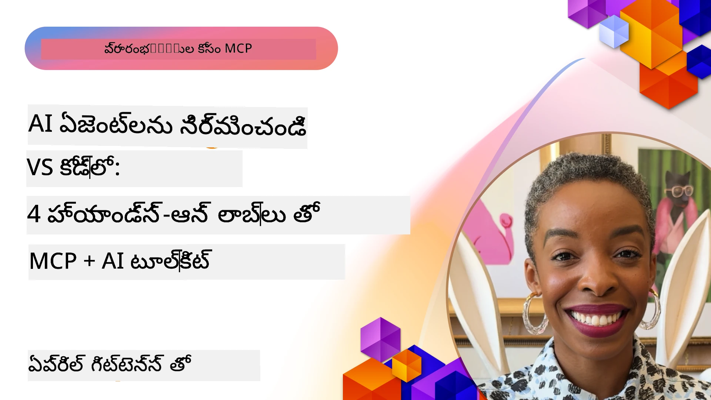

# AI పని ప్రవాహాలను సరళీకరించడం: AI టూల్‌కిట్‌తో MCP సర్వర్ రూపొందింపు

## 🎯 అవలోకనం

_(ఈ పాఠం వీడియో చూడటానికి పై చిత్రం మీద క్లిక్ చేయండి)_

**Model Context Protocol (MCP) వర్క్‌షాప్**కు స్వాగతం! ఈ సమగ్ర హ్యాండ్స్-ఆన్ వర్క్‌షాప్ రెండు ఆధునిక సాంకేతికతలను కలిపి AI అనువర్తన అభివృద్ధిని విప్లవాత్మకంగా మార్చుతుంది:

- **🔗 Model Context Protocol (MCP)**: సాఫీగా AI-పరికర విలీనం కోసం ఓపెన్ స్టాండర్డు
- **🛠️ Visual Studio Code కోసం AI Toolkit (AITK)**: Microsoft యొక్క శక్తివంతమైన AI అభివృద్ధి విస్తరణ

### 🎓 మీరు నేర్చుకొనే దాని గురించి

ఈ వర్క్‌షాప్ చివరికి, మీరు AI నమూనాలను వాస్తవ ప్రపంచ పరికరాలు మరియు సేవలతో కలుపుకొని అర్థవంతమైన అనువర్తనాలు నిర్మించడాన్ని నేర్చుకుంటారు. ఆటోమేటెడ్ టెస్టింగ్ నుండి కస్టమ్ API విలీనం వరకు, మీరు సంక్లిష్ట వ్యాపార సవాళ్లను పరిష్కరించడానికి ప్రత्यक्ष నైపుణ్యాలు పొందుతారు.

## 🏗️ సాంకేతిక స్థిథి

### 🔌 Model Context Protocol (MCP)

MCP అనేది **"AI కోసం USB-C"** - ఇది AI నమూనాలను బాహ్య పరికరాలు మరియు డేటా మూలాలతో అనుసంధానించే విశ్వవ్యాప్తంగా ప్రామాణికం.

**✨ ముఖ్య లక్షణాలు:**

- 🔄 **ప్రామాణిక విలీనం**: AI-పరికర కనెక్షన్లకు యూనివర్సల్ ఇంటర్ఫేస్
- 🏛️ **సరళమైన నిర్మాణం**: స్థానిక & రిమోట్ సర్వర్లు stdio/SSE రవాణా ద్వారా
- 🧰 **సంపన్నమైన ఎకోసిస్టమ్**: ఒక ప్రోటోకాల్లో పరికరాలు, ప్రాంప్ట్‌లు, వనరులు
- 🔒 **ఎంటర్ప్రైజ్-రెడి**: అంతర్లీన భద్రత మరియు నమ్మకత

**🎯 MCP ఎందుకు ముఖ్యం:**
USB-C కేబుల్ అవ్యవస్థని అల్లించినట్లే, MCP AI విలీనం యొక్క క్లిష్టతని తొలగిస్తుంది. ఒక ప్రోటోకాల్, అనంత అవకాశాలు.

### 🤖 Visual Studio Code కోసం AI Toolkit (AITK)

Microsoft యొక్క ప్రధాన AI అభివృద్ధి ఎక్స్‌టెన్షన్, VS Code ని AI శక్తిస్థానంగా మార్చుతుంది.

**🚀 ప్రాథమిక సామర్థ్యాలు:**

- 📦 **మోడల్ కాటలాగ్**: Azure AI, GitHub, Hugging Face, Ollama నుండి నమూనాలు పొందు
- ⚡ **స్థానిక ఇన్ఫరెన్స్**: ONNX ఉత్తమ CPU/GPU/NPU అమలు
- 🏗️ **ఏజెంట్ బిల్డర్**: MCP విలీనం ద్వారా విజువల్ AI ఏజెంట్ అభివృద్ధి
- 🎭 **బహుముఖ మోడ్**: టెక్స్ట్, విజన్, మరియు సమర్ధిత అవుట్పుట్ మద్దతు

**💡 అభివృద్ధి ప్రయోజనాలు:**

- జీరో-కాన్ఫిగ్ మోడల్ అమలు
- దృశ్య ప్రాంప్ట్ ఇంజనీరింగ్
- రియల్-టైం టెస్టింగ్ ప్లేగ్రౌండ్
- సజావుగా MCP సర్వర్ విలీనం

## 📚 నేర్చుకునే ప్రయాణం

### [🚀 మాడ్యూల్ 1: AI Toolkit పునాదులు](./lab1/README.md)

**కాలవ్యవధి**: 15 నిమిషాలు

- 🛠️ VS Code కోసం AI Toolkit ఇన్‌స్టాల్ చేసి కాన్ఫిగర్ చేయండి
- 🗂️ మోడల్ కాటలాగ్‌ను పరిగణించండి (GitHub, ONNX, OpenAI, Anthropic, Google నుండి 100+ నమూనాలు)
- 🎮 రియల్-టైం మోడల్ టెస్టింగ్ కోసం ఇంటరాక్టివ్ ప్లేగ్రౌండ్ లో పనిచేయండి
- 🤖 Agent Builder తో మీ మొదటి AI ఏజెంట్ ను నిర్మించండి
- 📊 F1, సంబంధిత, సాదృశ్య, సుష్టు అంచనాలతో మోడల్ పనితీరు మూల్యాంకనం చేయండి
- ⚡ బ్యాచ్ ప్రాసెసింగ్ మరియు బహుముఖ మద్దతు విధులను నేర్చుకోండి

**🎯 నేర్చుకున్న ఫలితం**: AITK సామర్థ్యాల సమగ్ర అవగాహనతో ఫంక్షనల్ AI ఏజెంట్ సృష్టించుట

### [🌐 మాడ్యూల్ 2: AI Toolkit తో MCP పునాదులు](./lab2/README.md)

**కాలవ్యవధి**: 20 నిమిషాలు

- 🧠 Model Context Protocol (MCP) నిర్మాణం మరియు భావనలు లోపల ఆచరించండి
- 🌐 Microsoft యొక్క MCP సర్వర్ ఎకోసిస్టమ్ అన్వేషించండి
- 🤖 Playwright MCP సర్వర్ ఉపయోగించి బ్రౌజర్ ఆటోమేషన్ ఏజెంట్ రూపొందించండి
- 🔧 MCP సర్వర్లను AI Toolkit Agent Builder తో విలీనం చేయండి
- 📊 మీ ఏజెంట్లలో MCP పరికరాలను కాన్ఫిగర్ చేసి పరీక్షించండి
- 🚀 MCP ఆధారిత ఏజెంట్లను ఎగుమతి చేసి ఉత్పత్తిలో అమలు చేయండి

**🎯 నేర్చుకున్న ఫలితం**: బాహ్య పరికరాలతో సుపర్చి AI ఏజెంట్ ను అమలు చేయడం

### [🔧 మాడ్యూల్ 3: AI Toolkit తో అధునాతన MCP అభివృద్ధి](./lab3/README.md)

**కాలవ్యవధి**: 20 నిమిషాలు

- 💻 AI Toolkit ఉపయోగించి కస్టమ్ MCP సర్వర్లు సృష్టించండి
- 🐍 తాజా MCP Python SDK (v1.9.3)ని కాన్ఫిగర్ చేసి ఉపయోగించండి
- 🔍 డీబగ్గింగ్ కోసం MCP ఇన్‌స్పెక్టర్ సెట్ అప్ చేయండి మరియు ఉపయోగించండి
- 🛠️ వృత్తిపరమైన డీబగింగ్ పనితనాలతో వాతావరణం MCP సర్వర్ నిర్మాణం చేయండి
- 🧪 Agent Builder మరియు ఇన్‌స్పెక్టర్ పర్యావరణాల్లో MCP సర్వర్లను డీబగ్గ్ చేయండి

**🎯 నేర్చుకున్న ఫలితం**: ఆధునిక టూలింగ్‌తో కస్టమ్ MCP సర్వర్లను అభివృద్ధి చేసి డీబగ్ చేయడం

### [🐙 మాడ్యూల్ 4: ప్రాక్టికల్ MCP అభివృద్ధి - కస్టమ్ GitHub క్లోన్ సర్వర్](./lab4/README.md)

**కాలవ్యవధి**: 30 నిమిషాలు

- 🏗️ అభివృద్ధి పని ప్రవాహాల కోసం వాస్తవ GitHub క్లోన్ MCP సర్వర్ నిర్మించండి
- 🔄 ధ్రువీకరణ మరియు లోప నిర్వహణతో స్మార్ట్ రిపోజిటరీ క్లోనింగ్ అమలు చేయండి
- 📁 బుద్ధిమంతమైన డైరెక్టరీ నిర్వహణ మరియు VS Code అనుసంధానాన్ని సృష్టించండి
- 🤖 GitHub Copilot Agent మోడ్‌ను కస్టమ్ MCP పరికరాలతో ఉపయోగించండి
- 🛡️ ఉత్పత్తి-సిద్ధమైన నమ్మకత మరియు క్రాస్-ప్లాట్‌ఫారమ్ అనుకూలతను వర్తింపజేయండి

**🎯 నేర్చుకున్న ఫలితం**: అసలు అభివృద్ధి పని ప్రవాహాలను సరళీకరించే ఉత్పత్తి-సిద్ధ MCP సర్వర్‌ను అమలు చేయడం

## 💡 వాస్తవ-ప్రపంచ అనువర్తనాలు & ప్రభావం

### 🏢 ఎంటర్ప్రైజ్ వినియోగ కేసులు

#### 🔄 DevOps ఆటోమేషన్

మీ అభివృద్ధి పని ప్రవాహాలను తెలివైన ఆటోమేషన్‌తో మార్చండి:

- **స్మార్ట్ రిపోజిటరీ నిర్వహణ**: AI ఆధారిత కోడ్ సమీక్ష మరియు విలీనం నిర్ణయాలు
- **తెలివైన CI/CD**: కోడ్ మార్పుల ఆధారంగా ఆటోమేటెడ్ పైప్‌లైన్ మెరుగుదల
- **ఇష్యూ ట్రైయాజ్**: ఆటోమేటిక్ బగ్ వర్గీకరణ మరియు నియామకం

#### 🧪 నాణ్యత హామీ విప్లవం

AI-శక్తివంతమైన ఆటోమేషన్‌తో పరీక్షని ఎత్తగించండి:

- **తెలివైన పరీక్షా తియ్యడం**: సమగ్ర టెస్ట్ సూట్‌లు ఆటోమేటెడ్ గా సృష్టించండి
- **దృశ్య పునరావృత పరీక్ష**: AI ఆధారిత UI మార్పుల గుర్తింపు
- **పనితీరు పర్యవేక్షణ**: ముందస్తుగా సమస్యలను గుర్తించి పరిష్కరించటం

#### 📊 డేటా పైప్‌లైన్ జ్ఞానం

తెలివిగా డేటా ప్రాసెసింగ్ పని ప్రవాహాలను నిర్మించండి:

- **అనుకూల ETL ప్రక్రియలు**: స్వయంచాలక డేటా మార్పులు
- **అసాధారణత గుర్తింపు**: రియల్-టైం డేటా నాణ్యత పర్యవేక్షణ
- **తెలివైన మార్గనిర్దేశనం**: స్మార్ట్ డేటా ప్రవాహ నిర్వహణ

#### 🎧 వినియోగదారు అనుభవం మెరుగుదల

అత్యుత్తమ వినియోగదారు ఇంటరాక్షన్లను సృష్టించండి:

- **ప్రాతిపదికన్న సపోర్ట్**: వినియోగదారు చరిత్ర యాక్సెస్ కలిగిన AI ఏజెంట్లు
- **ప్రయోజనకర సమస్య పరిష్కారం**: ముందస్తుగా ఊహించే కస్టమర్ సేవ
- **బహు-చానెల్ విలీనం**: వేదికలలో ఏకీకృత AI అనుభవం

## 🛠️ ముందు అవసరాలు & సెటప్

### 💻 సిస్టమ్ అవసరాలు

| భాగం | అవసరం | గమనికలు |
|-----------|-------------|-------|
| **ఆపరేటింగ్ సిస్టమ్** | Windows 10+, macOS 10.15+, Linux | ఏ ఆధునిక OS కూడా సరిపోతుంది |
| **Visual Studio Code** | తాజా స్థిరమైన సంస్కరణ | AITK కోసం అవసరం |
| **Node.js** | v18.0+ మరియు npm | MCP సర్వర్ అభివృద్ధికి |
| **Python** | 3.10+ | Python MCP సర్వర్ల కోసం ఐచ్ఛికం |
| **మెమరీ** | కనీసం 8GB RAM | స్థానిక నమూనాల కోసం 16GB సిఫార్సు |

### 🔧 అభివృద్ధి పరికరాల పర్యావరణం

#### సూచనీయ VS Code ఎక్స్‌టెన్షన్లు

- **AI Toolkit** (ms-windows-ai-studio.windows-ai-studio)
- **Python** (ms-python.python)
- **Python డీబగ్గర్** (ms-python.debugpy)
- **GitHub Copilot** (GitHub.copilot) - ఐచ్ఛికము కానీ సహాయకం

#### ఐచ్ఛిక పరికరాలు

- **uv**: ఆధునిక Python ప్యాకేజ్ మేనేజర్
- **MCP Inspector**: MCP సర్వర్లకు దృశ్య డీబగ్గింగ్ సాధనం
- **Playwright**: వెబ్ ఆటోమెషన్ ఉదాహరణల కోసం

## 🎖️ నేర్చుకున్న ఫలితాలు & సర్టిఫికేషన్ మార్గం

### 🏆 నైపుణ్య నైపుణ్యం చెక్లిస్ట్

ఈ వర్క్‌షాప్ పూర్తి చేయడంతో, మీరు కింది వాటిలో ప్రావీణ్యం పొందుతారు:

#### 🎯 కేంద్రీయ నైపుణ్యాలు

- [ ] **MCP ప్రోటోకాల్ ప్రావీణ్యం**: నిర్మాణం మరియు అమలు నమూనాలలో లోతైన అవగాహన
- [ ] **AITK నైపుణ్యం**: AI Toolkit ను వేగవంతమైన అభివృద్ధికి నైపుణ్యం
- [ ] **కస్టమ్ సర్వర్ అభివృద్ధి**: ఉత్పత్తి MCP సర్వర్లను నిర్మించటం, అమలు చేయటం మరియు నిర్వహణ
- [ ] **పరికర విలీనం ఉత్తమత**: AI ను ఉన్న అభివృద్ధి పని ప్రవాహాలకు సజావుగా అనుసంధానం చేయడం
- [ ] **సమస్య పరిష్కార అన్వయము**: నేర్చుకున్న నైపుణ్యాలను వాస్తవ వ్యాపార సవాళ్లకు వర్తించడం

#### 🔧 సాంకేతిక నైపుణ్యాలు

- [ ] VS Code లో AI Toolkit ను సెట్ అప్ చేసి కన్ఫిగర్ చేయడం
- [ ] కస్టమ్ MCP సర్వర్లు రూపకల్పన చేసి అమలు చేయడం
- [ ] MCP నిర్మాణంతో GitHub మోడల్స్‌ను విలీనం చేయడం
- [ ] Playwright తో ఆటోమేటెడ్ టెస్టింగ్ పని ప్రవాహాలు నిర్మించడం
- [ ] ఉత్పత్తి కోసం AI ఏజెంట్లను అమలు చేయడం
- [ ] MCP సర్వర్ పనితీరు డీబగ్ చేసి మెరుగుపరచడం

#### 🚀 అధునాతన సామర్థ్యాలు

- [ ] ఎంటర్ప్రైజ్-స్థాయి AI విలీనాల ఆర్కిటెక్చర్ రూపకల్పన
- [ ] AI అనువర్తనాల భద్రత ఉత్తమ అభ్యాసాలను అమలు చేయడం
- [ ] స్కేలబుల్ MCP సర్వర్ నిర్మాణాలను రూపకల్పన
- [ ] నిర్దిష్ట డొమైన్‌లకోసం కస్టమ్ పరికర శ్రేణులు రూపొందించడం
- [ ] AI-దేశీయ అభివృద్ధిలో మరొకరికి మార్గదర్శకత్వం ఇవ్వడం

## 📖 అదనపు వనరులు

- [MCP స్పెసిఫికేషన్ (2025-11-25)](https://spec.modelcontextprotocol.io/specification/2025-11-25/)
- [AI Toolkit GitHub రిపోజిటరీ](https://github.com/microsoft/vscode-ai-toolkit)
- [నమూనా MCP సర్వర్లు సంకలనం](https://github.com/modelcontextprotocol/servers)
- [ఉత్తమ అభ్యాసాల గైడ్](https://modelcontextprotocol.io/docs/best-practices)
- [OWASP MCP టాప్ 10](https://microsoft.github.io/mcp-azure-security-guide/mcp/) - భద్రత ఉత్తమ అభ్యాసాలు

---

**🚀 మీ AI అభివృద్ధి పని ప్రవాహాన్ని విప్లవాత్మకంగా మార్చడానికి సిద్ధమా?**

ముందుకు రావాలి, MCP మరియు AI Toolkit తో తెలివైన అనువర్తన భవిష్యత్తును కలసికట్టుగా నిర్ముద్దాం!

## తదుపరి

కొనసాగించండి: [మాడ్యూల్ 11: MCP సర్వర్ హ్యాండ్స్-ఆన్ ల్యాబ్స్](../11-MCPServerHandsOnLabs/README.md)

---

<!-- CO-OP TRANSLATOR DISCLAIMER START -->
**అస్పష్టత**:  
ఈ పత్రాన్ని AI అనువాద సేవ [Co-op Translator](https://github.com/Azure/co-op-translator) ఉపయోగించి అనువదించబడింది. మేము ఖచ్చితత్వానికి ప్రయత్నించినప్పటికీ, స్వయంచాలక అనువాదాల్లో పొరపాట్లు లేదా లోపాలు ఉండొచ్చు అని దయచేసి గమనించండి. అసలు పత్రం native భాషలోనే అధికారిక మూలంగా పరిగణించబడాలి. ముఖ్యమైన సమాచారానికి, నిపుణుల చేతులైన అనువాదం చేయించడం మంచిది. ఈ అనువాదం ఉపయోగానికి సంబందించిన ఏవైనా అపార్థాలు లేదా తప్పుగా అర్థం చేసుకునతలకు మేము బాధ్యువులేమం కాదని సూచిస్తున్నాము.
<!-- CO-OP TRANSLATOR DISCLAIMER END -->