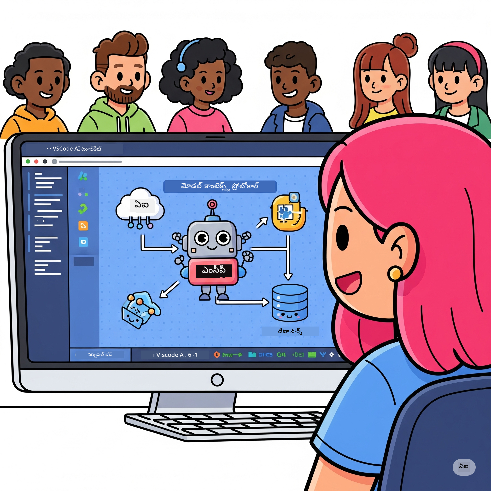
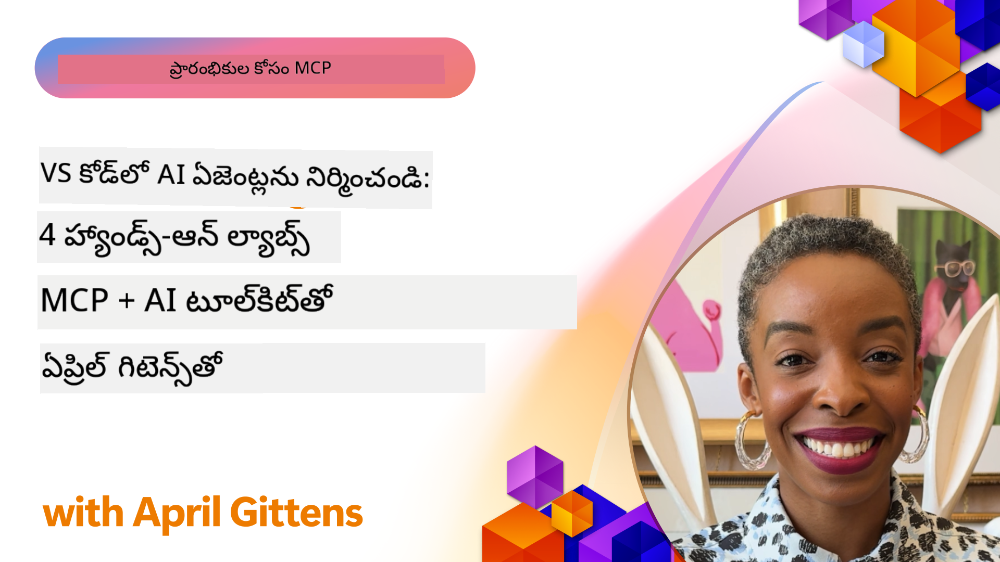

<!--
CO_OP_TRANSLATOR_METADATA:
{
  "original_hash": "1b000fd6e1b04c047578bfc5d07d54eb",
  "translation_date": "2025-12-11T11:38:25+00:00",
  "source_file": "10-StreamliningAIWorkflowsBuildingAnMCPServerWithAIToolkit/README.md",
  "language_code": "te"
}
-->
# AI వర్క్‌ఫ్లోలను సులభతరం చేయడం: AI టూల్‌కిట్‌తో MCP సర్వర్ నిర్మాణం

## 🎯 అవలోకనం

_(ఈ పాఠం వీడియోను చూడడానికి పై చిత్రాన్ని క్లిక్ చేయండి)_

**Model Context Protocol (MCP) వర్క్‌షాప్**కి స్వాగతం! ఈ సమగ్ర హ్యాండ్స్-ఆన్ వర్క్‌షాప్ రెండు ఆధునిక సాంకేతికతలను కలిపి AI అప్లికేషన్ అభివృద్ధిని విప్లవాత్మకంగా మార్చుతుంది:

- **🔗 Model Context Protocol (MCP)**: సులభమైన AI-టూల్ ఇంటిగ్రేషన్ కోసం ఓపెన్ స్టాండర్డ్
- **🛠️ Visual Studio Code కోసం AI Toolkit (AITK)**: మైక్రోసాఫ్ట్ యొక్క శక్తివంతమైన AI అభివృద్ధి విస్తరణ

### 🎓 మీరు నేర్చుకునేది

ఈ వర్క్‌షాప్ ముగింపు వరకు, మీరు AI మోడల్స్‌ను వాస్తవ ప్రపంచ టూల్స్ మరియు సేవలతో అనుసంధానించే తెలివైన అప్లికేషన్లు నిర్మించడంలో నైపుణ్యం పొందుతారు. ఆటోమేటెడ్ టెస్టింగ్ నుండి కస్టమ్ API ఇంటిగ్రేషన్ల వరకు, మీరు క్లిష్ట వ్యాపార సవాళ్లను పరిష్కరించడానికి ప్రాక్టికల్ నైపుణ్యాలు పొందుతారు.

## 🏗️ సాంకేతిక స్టాక్

### 🔌 Model Context Protocol (MCP)

MCP అనేది **"AI కోసం USB-C"** - AI మోడల్స్‌ను బాహ్య టూల్స్ మరియు డేటా మూలాలతో కనెక్ట్ చేసే యూనివర్సల్ స్టాండర్డ్.

**✨ ముఖ్య లక్షణాలు:**

- 🔄 **స్టాండర్డైజ్డ్ ఇంటిగ్రేషన్**: AI-టూల్ కనెక్షన్ల కోసం యూనివర్సల్ ఇంటర్‌ఫేస్
- 🏛️ **ఫ్లెక్సిబుల్ ఆర్కిటెక్చర్**: stdio/SSE ట్రాన్స్‌పోర్ట్ ద్వారా లోకల్ & రిమోట్ సర్వర్లు
- 🧰 **సంపన్నమైన ఎకోసిస్టమ్**: ఒకే ప్రోటోకాల్‌లో టూల్స్, ప్రాంప్ట్స్, వనరులు
- 🔒 **ఎంటర్ప్రైజ్-రెడీ**: బిల్ట్-ఇన్ సెక్యూరిటీ మరియు నమ్మకదారితనం

**🎯 MCP ఎందుకు ముఖ్యం:**
USB-C కేబుల్ గందరగోళాన్ని తొలగించినట్లే, MCP AI ఇంటిగ్రేషన్ల క్లిష్టతను తొలగిస్తుంది. ఒక ప్రోటోకాల్, అనంత అవకాశాలు.

### 🤖 Visual Studio Code కోసం AI Toolkit (AITK)

మైక్రోసాఫ్ట్ యొక్క ఫ్లాగ్‌షిప్ AI అభివృద్ధి విస్తరణ, VS Codeని AI శక్తివంతమైన వేదికగా మార్చుతుంది.

**🚀 ప్రధాన సామర్థ్యాలు:**

- 📦 **మోడల్ క్యాటలాగ్**: Azure AI, GitHub, Hugging Face, Ollama నుండి మోడల్స్ యాక్సెస్
- ⚡ **లోకల్ ఇన్ఫరెన్స్**: ONNX-ఆప్టిమైజ్డ్ CPU/GPU/NPU ఎగ్జిక్యూషన్
- 🏗️ **ఏజెంట్ బిల్డర్**: MCP ఇంటిగ్రేషన్‌తో విజువల్ AI ఏజెంట్ అభివృద్ధి
- 🎭 **మల్టీ-మోడల్**: టెక్స్ట్, విజన్, మరియు స్ట్రక్చర్డ్ అవుట్‌పుట్ మద్దతు

**💡 అభివృద్ధి లాభాలు:**

- జీరో-కాన్ఫిగ్ మోడల్ డిప్లాయ్‌మెంట్
- విజువల్ ప్రాంప్ట్ ఇంజనీరింగ్
- రియల్-టైమ్ టెస్టింగ్ ప్లేగ్రౌండ్
- సులభమైన MCP సర్వర్ ఇంటిగ్రేషన్

## 📚 నేర్చుకునే ప్రయాణం

### [🚀 మాడ్యూల్ 1: AI Toolkit ప్రాథమికాలు](./lab1/README.md)

**కాలవ్యవధి**: 15 నిమిషాలు

- 🛠️ VS Code కోసం AI Toolkit ఇన్‌స్టాల్ చేసి కాన్ఫిగర్ చేయండి
- 🗂️ మోడల్ క్యాటలాగ్‌ను అన్వేషించండి (GitHub, ONNX, OpenAI, Anthropic, Google నుండి 100+ మోడల్స్)
- 🎮 రియల్-టైమ్ మోడల్ టెస్టింగ్ కోసం ఇంటరాక్టివ్ ప్లేగ్రౌండ్‌లో నైపుణ్యం పొందండి
- 🤖 Agent Builder తో మీ మొదటి AI ఏజెంట్‌ను నిర్మించండి
- 📊 బిల్ట్-ఇన్ మెట్రిక్స్ (F1, సంబంధం, సారూప్యం, సారూప్యత) తో మోడల్ పనితీరు అంచనా వేయండి
- ⚡ బ్యాచ్ ప్రాసెసింగ్ మరియు మల్టీ-మోడల్ మద్దతు సామర్థ్యాలు నేర్చుకోండి

**🎯 నేర్చుకునే ఫలితం**: AITK సామర్థ్యాల సమగ్ర అవగాహనతో ఒక ఫంక్షనల్ AI ఏజెంట్ సృష్టించండి

### [🌐 మాడ్యూల్ 2: MCP తో AI Toolkit ప్రాథమికాలు](./lab2/README.md)

**కాలవ్యవధి**: 20 నిమిషాలు

- 🧠 Model Context Protocol (MCP) ఆర్కిటెక్చర్ మరియు కాన్సెప్ట్‌లలో నైపుణ్యం పొందండి
- 🌐 మైక్రోసాఫ్ట్ MCP సర్వర్ ఎకోసిస్టమ్‌ను అన్వేషించండి
- 🤖 Playwright MCP సర్వర్ ఉపయోగించి బ్రౌజర్ ఆటోమేషన్ ఏజెంట్‌ను నిర్మించండి
- 🔧 MCP సర్వర్లను AI Toolkit Agent Builderతో ఇంటిగ్రేట్ చేయండి
- 📊 మీ ఏజెంట్లలో MCP టూల్స్‌ను కాన్ఫిగర్ చేసి పరీక్షించండి
- 🚀 MCP-పవర్డ్ ఏజెంట్లను ఎగుమతి చేసి ప్రొడక్షన్‌లో డిప్లాయ్ చేయండి

**🎯 నేర్చుకునే ఫలితం**: బాహ్య టూల్స్‌తో శక్తివంతమైన AI ఏజెంట్‌ను MCP ద్వారా డిప్లాయ్ చేయండి

### [🔧 మాడ్యూల్ 3: AI Toolkit తో అధునాతన MCP అభివృద్ధి](./lab3/README.md)

**కాలవ్యవధి**: 20 నిమిషాలు

- 💻 AI Toolkit ఉపయోగించి కస్టమ్ MCP సర్వర్లను సృష్టించండి
- 🐍 తాజా MCP Python SDK (v1.9.3)ని కాన్ఫిగర్ చేసి ఉపయోగించండి
- 🔍 డీబగ్గింగ్ కోసం MCP ఇన్స్పెక్టర్‌ను సెటప్ చేసి ఉపయోగించండి
- 🛠️ ప్రొఫెషనల్ డీబగ్గింగ్ వర్క్‌ఫ్లోలతో వాతావరణ MCP సర్వర్ నిర్మాణం
- 🧪 Agent Builder మరియు Inspector వాతావరణాల్లో MCP సర్వర్లను డీబగ్ చేయండి

**🎯 నేర్చుకునే ఫలితం**: ఆధునిక టూలింగ్‌తో కస్టమ్ MCP సర్వర్లను అభివృద్ధి చేసి డీబగ్ చేయండి

### [🐙 మాడ్యూల్ 4: ప్రాక్టికల్ MCP అభివృద్ధి - కస్టమ్ GitHub క్లోన్ సర్వర్](./lab4/README.md)

**కాలవ్యవధి**: 30 నిమిషాలు

- 🏗️ అభివృద్ధి వర్క్‌ఫ్లోల కోసం వాస్తవ GitHub క్లోన్ MCP సర్వర్ నిర్మించండి
- 🔄 ధృవీకరణ మరియు లోపాల నిర్వహణతో స్మార్ట్ రిపాజిటరీ క్లోనింగ్ అమలు చేయండి
- 📁 తెలివైన డైరెక్టరీ నిర్వహణ మరియు VS Code ఇంటిగ్రేషన్ సృష్టించండి
- 🤖 కస్టమ్ MCP టూల్స్‌తో GitHub Copilot Agent మోడ్ ఉపయోగించండి
- 🛡️ ప్రొడక్షన్-రెడీ నమ్మకదారితనం మరియు క్రాస్-ప్లాట్‌ఫారమ్ అనుకూలతను వర్తింపజేయండి

**🎯 నేర్చుకునే ఫలితం**: వాస్తవ అభివృద్ధి వర్క్‌ఫ్లోలను సులభతరం చేసే ప్రొడక్షన్-రెడీ MCP సర్వర్‌ను డిప్లాయ్ చేయండి

## 💡 వాస్తవ ప్రపంచ అప్లికేషన్లు & ప్రభావం

### 🏢 ఎంటర్ప్రైజ్ వినియోగ కేసులు

#### 🔄 DevOps ఆటోమేషన్

మీ అభివృద్ధి వర్క్‌ఫ్లోను తెలివైన ఆటోమేషన్‌తో మార్చండి:

- **స్మార్ట్ రిపాజిటరీ నిర్వహణ**: AI ఆధారిత కోడ్ సమీక్ష మరియు విలీనం నిర్ణయాలు
- **తెలివైన CI/CD**: కోడ్ మార్పుల ఆధారంగా ఆటోమేటెడ్ పైప్‌లైన్ ఆప్టిమైజేషన్
- **ఇష్యూ ట్రయాజ్**: ఆటోమేటిక్ బగ్ వర్గీకరణ మరియు కేటాయింపు

#### 🧪 క్వాలిటీ అష్యూరెన్స్ విప్లవం

AI-శక్తివంతమైన ఆటోమేషన్‌తో టెస్టింగ్‌ను మెరుగుపరచండి:

- **తెలివైన టెస్ట్ జనరేషన్**: సమగ్ర టెస్ట్ సూట్లను ఆటోమేటిగ్గా సృష్టించండి
- **విజువల్ రిగ్రెషన్ టెస్టింగ్**: AI ఆధారిత UI మార్పుల గుర్తింపు
- **పర్ఫార్మెన్స్ మానిటరింగ్**: ముందస్తు సమస్య గుర్తింపు మరియు పరిష్కారం

#### 📊 డేటా పైప్‌లైన్ ఇంటెలిజెన్స్

తెలివైన డేటా ప్రాసెసింగ్ వర్క్‌ఫ్లోలను నిర్మించండి:

- **అడాప్టివ్ ETL ప్రాసెస్‌లు**: స్వీయ ఆప్టిమైజింగ్ డేటా ట్రాన్స్‌ఫర్మేషన్లు
- **అనామలీ డిటెక్షన్**: రియల్-టైమ్ డేటా నాణ్యత మానిటరింగ్
- **తెలివైన రౌటింగ్**: స్మార్ట్ డేటా ఫ్లో నిర్వహణ

#### 🎧 కస్టమర్ అనుభవం మెరుగుదల

అత్యుత్తమ కస్టమర్ ఇంటరాక్షన్లను సృష్టించండి:

- **సందర్భ-అవగాహన సపోర్ట్**: కస్టమర్ చరిత్రకు యాక్సెస్ ఉన్న AI ఏజెంట్లు
- **ప్రోఆక్టివ్ ఇష్యూ పరిష్కారం**: ముందస్తు కస్టమర్ సర్వీస్
- **మల్టీ-చానల్ ఇంటిగ్రేషన్**: ప్లాట్‌ఫారమ్‌లలో ఏకీకృత AI అనుభవం

## 🛠️ ముందస్తు అవసరాలు & సెటప్

### 💻 సిస్టమ్ అవసరాలు

| భాగం | అవసరం | గమనికలు |
|-----------|-------------|-------|
| **ఆపరేటింగ్ సిస్టమ్** | Windows 10+, macOS 10.15+, Linux | ఏ ఆధునిక OS అయినా సరే |
| **Visual Studio Code** | తాజా స్థిరమైన వెర్షన్ | AITK కోసం అవసరం |
| **Node.js** | v18.0+ మరియు npm | MCP సర్వర్ అభివృద్ధికి |
| **Python** | 3.10+ | Python MCP సర్వర్ల కోసం ఐచ్ఛికం |
| **మెమరీ** | కనీసం 8GB RAM | లోకల్ మోడల్స్ కోసం 16GB సిఫార్సు |

### 🔧 అభివృద్ధి వాతావరణం

#### సిఫార్సు చేసిన VS Code విస్తరణలు

- **AI Toolkit** (ms-windows-ai-studio.windows-ai-studio)
- **Python** (ms-python.python)
- **Python Debugger** (ms-python.debugpy)
- **GitHub Copilot** (GitHub.copilot) - ఐచ్ఛికం కానీ సహాయకం

#### ఐచ్ఛిక టూల్స్

- **uv**: ఆధునిక Python ప్యాకేజ్ మేనేజర్
- **MCP Inspector**: MCP సర్వర్ల కోసం విజువల్ డీబగ్గింగ్ టూల్
- **Playwright**: వెబ్ ఆటోమేషన్ ఉదాహరణల కోసం

## 🎖️ నేర్చుకునే ఫలితాలు & సర్టిఫికేషన్ మార్గం

### 🏆 నైపుణ్య మాస్టరీ చెక్లిస్ట్

ఈ వర్క్‌షాప్ పూర్తి చేయడం ద్వారా, మీరు ఈ నైపుణ్యాలలో మాస్టరీ సాధిస్తారు:

#### 🎯 ప్రాథమిక సామర్థ్యాలు

- [ ] **MCP ప్రోటోకాల్ మాస్టరీ**: ఆర్కిటెక్చర్ మరియు అమలు నమూనాల లోతైన అవగాహన
- [ ] **AITK ప్రావీణ్యం**: వేగవంతమైన అభివృద్ధికి AI Toolkit నిపుణత
- [ ] **కస్టమ్ సర్వర్ అభివృద్ధి**: ప్రొడక్షన్ MCP సర్వర్లను నిర్మించడం, డిప్లాయ్ చేయడం, నిర్వహించడం
- [ ] **టూల్ ఇంటిగ్రేషన్ నైపుణ్యం**: AIని ఉన్న అభివృద్ధి వర్క్‌ఫ్లోలతో సులభంగా అనుసంధానం చేయడం
- [ ] **సమస్య పరిష్కార అన్వయము**: నేర్చుకున్న నైపుణ్యాలను వాస్తవ వ్యాపార సవాళ్లకు వర్తింపజేయడం

#### 🔧 సాంకేతిక నైపుణ్యాలు

- [ ] VS Codeలో AI Toolkit సెటప్ చేసి కాన్ఫిగర్ చేయడం
- [ ] కస్టమ్ MCP సర్వర్లను డిజైన్ చేసి అమలు చేయడం
- [ ] GitHub మోడల్స్‌ను MCP ఆర్కిటెక్చర్‌తో ఇంటిగ్రేట్ చేయడం
- [ ] Playwrightతో ఆటోమేటెడ్ టెస్టింగ్ వర్క్‌ఫ్లోలను నిర్మించడం
- [ ] ప్రొడక్షన్ ఉపయోగానికి AI ఏజెంట్లను డిప్లాయ్ చేయడం
- [ ] MCP సర్వర్ పనితీరును డీబగ్ చేసి ఆప్టిమైజ్ చేయడం

#### 🚀 అధునాతన సామర్థ్యాలు

- [ ] ఎంటర్ప్రైజ్-స్థాయి AI ఇంటిగ్రేషన్ల ఆర్కిటెక్చర్ రూపొందించడం
- [ ] AI అప్లికేషన్ల కోసం సెక్యూరిటీ ఉత్తమ పద్ధతులను అమలు చేయడం
- [ ] స్కేలబుల్ MCP సర్వర్ ఆర్కిటెక్చర్లను డిజైన్ చేయడం
- [ ] నిర్దిష్ట డొమైన్‌ల కోసం కస్టమ్ టూల్ చైన్లను సృష్టించడం
- [ ] AI-నేటివ్ అభివృద్ధిలో ఇతరులను మార్గనిర్దేశం చేయడం

## 📖 అదనపు వనరులు

- [MCP స్పెసిఫికేషన్](https://modelcontextprotocol.io/docs)
- [AI Toolkit GitHub రిపోజిటరీ](https://github.com/microsoft/vscode-ai-toolkit)
- [సాంపిల్ MCP సర్వర్లు సేకరణ](https://github.com/modelcontextprotocol/servers)
- [ఉత్తమ పద్ధతుల గైడ్](https://modelcontextprotocol.io/docs/best-practices)

---

**🚀 మీ AI అభివృద్ధి వర్క్‌ఫ్లోను విప్లవాత్మకంగా మార్చడానికి సిద్ధమా?**

MCP మరియు AI Toolkit తో తెలివైన అప్లికేషన్ల భవిష్యత్తును కలిసి నిర్మిద్దాం!

---

<!-- CO-OP TRANSLATOR DISCLAIMER START -->
**అస్పష్టత**:  
ఈ పత్రాన్ని AI అనువాద సేవ [Co-op Translator](https://github.com/Azure/co-op-translator) ఉపయోగించి అనువదించబడింది. మేము ఖచ్చితత్వానికి ప్రయత్నించినప్పటికీ, ఆటోమేటెడ్ అనువాదాల్లో పొరపాట్లు లేదా తప్పిదాలు ఉండవచ్చు. మూల పత్రం దాని స్వదేశీ భాషలోనే అధికారిక మూలంగా పరిగణించాలి. ముఖ్యమైన సమాచారానికి, ప్రొఫెషనల్ మానవ అనువాదం సిఫార్సు చేయబడుతుంది. ఈ అనువాదం వాడకం వల్ల కలిగే ఏవైనా అపార్థాలు లేదా తప్పుదారుల బాధ్యత మేము తీసుకోము.
<!-- CO-OP TRANSLATOR DISCLAIMER END -->