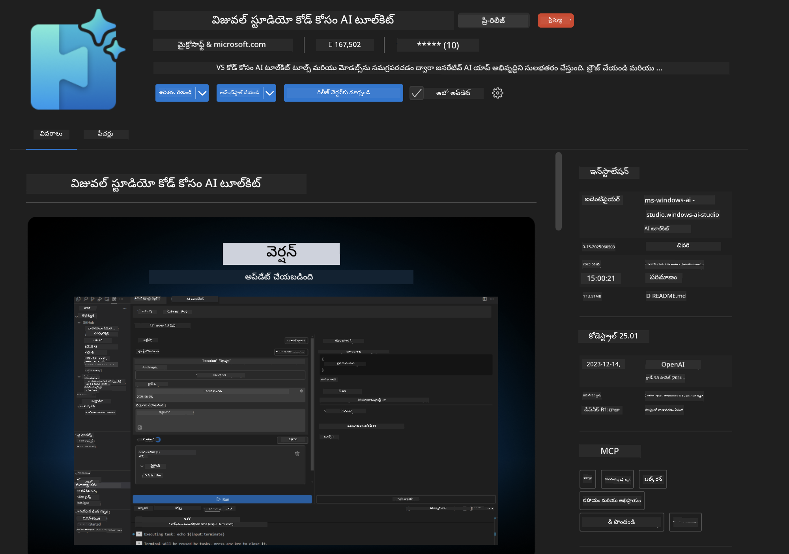
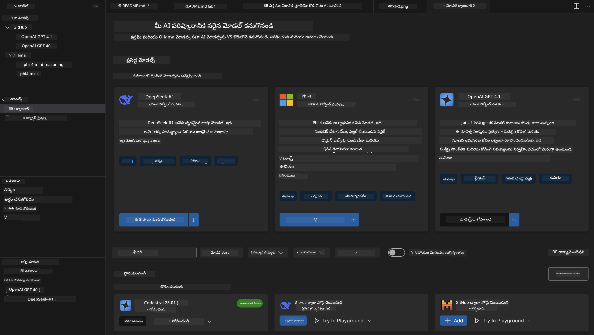
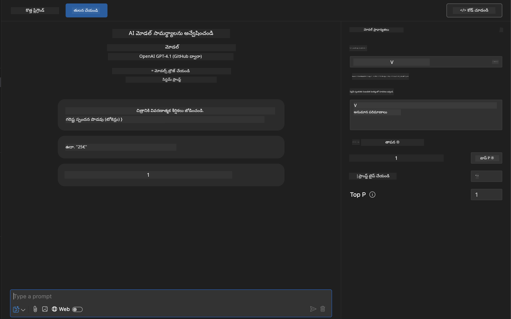
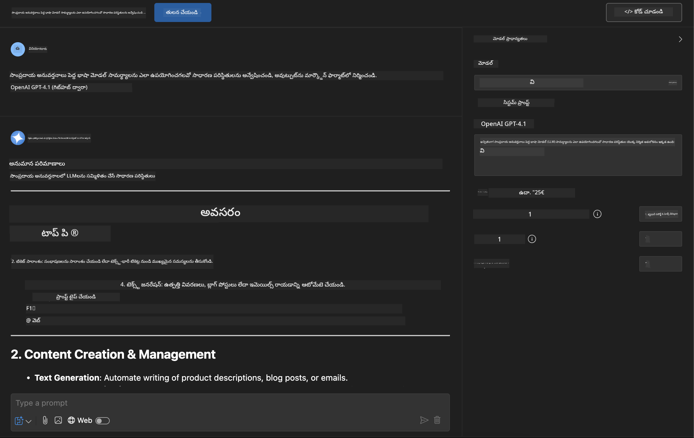
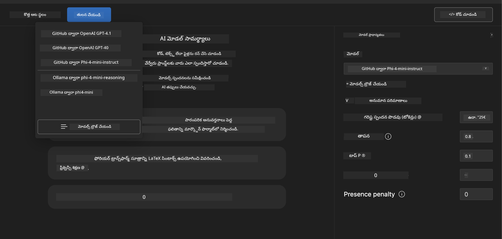
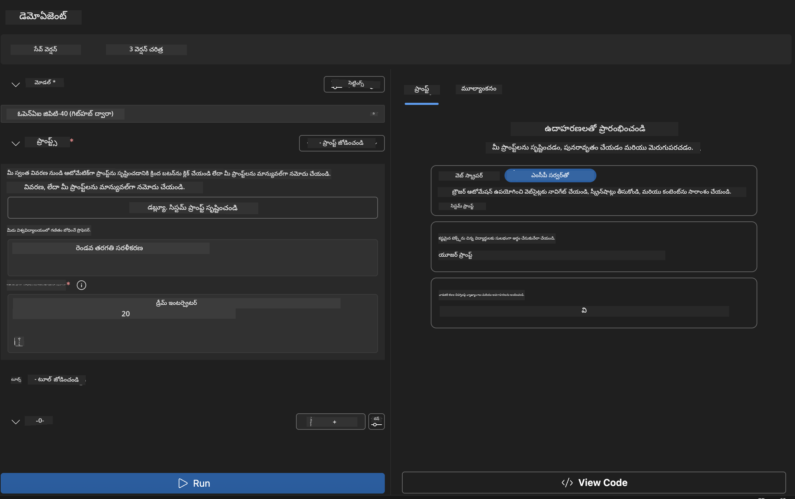
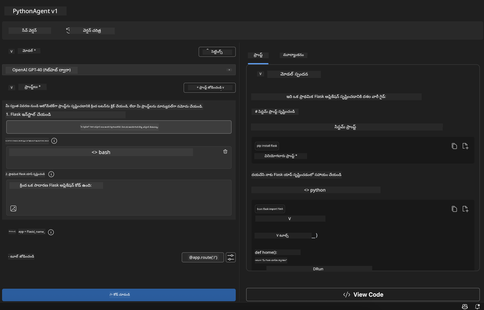

<!--
CO_OP_TRANSLATOR_METADATA:
{
  "original_hash": "2aa9dbc165e104764fa57e8a0d3f1c73",
  "translation_date": "2025-12-11T16:42:39+00:00",
  "source_file": "10-StreamliningAIWorkflowsBuildingAnMCPServerWithAIToolkit/lab1/README.md",
  "language_code": "te"
}
-->
# 🚀 మాడ్యూల్ 1: AI టూల్‌కిట్ ప్రాథమికాలు

[]()
[]()
[]()

## 📋 నేర్చుకునే లక్ష్యాలు

ఈ మాడ్యూల్ ముగిసే సమయానికి, మీరు చేయగలుగుతారు:
- ✅ Visual Studio Code కోసం AI టూల్‌కిట్‌ను ఇన్‌స్టాల్ చేసి కాన్ఫిగర్ చేయడం
- ✅ మోడల్ క్యాటలాగ్‌ను నావిగేట్ చేసి వివిధ మోడల్ మూలాలను అర్థం చేసుకోవడం
- ✅ మోడల్ పరీక్ష మరియు ప్రయోగం కోసం ప్లేగ్రౌండ్ ఉపయోగించడం
- ✅ ఏజెంట్ బిల్డర్ ఉపయోగించి కస్టమ్ AI ఏజెంట్లను సృష్టించడం
- ✅ వివిధ ప్రొవైడర్ల మధ్య మోడల్ పనితీరును పోల్చడం
- ✅ ప్రాంప్ట్ ఇంజనీరింగ్ కోసం ఉత్తమ పద్ధతులను వర్తించడం

## 🧠 AI టూల్‌కిట్ (AITK) పరిచయం

**Visual Studio Code కోసం AI టూల్‌కిట్** మైక్రోసాఫ్ట్ యొక్క ప్రధాన ఎక్స్‌టెన్షన్, ఇది VS కోడ్‌ను సమగ్ర AI అభివృద్ధి వాతావరణంగా మార్చుతుంది. ఇది AI పరిశోధన మరియు ప్రాక్టికల్ అప్లికేషన్ అభివృద్ధి మధ్య గ్యాప్‌ను భర్తీ చేస్తుంది, జనరేటివ్ AIని అన్ని నైపుణ్య స్థాయిల డెవలపర్లకు అందుబాటులో ఉంచుతుంది.

### 🌟 ముఖ్య సామర్థ్యాలు

| ఫీచర్ | వివరణ | ఉపయోగం |
|---------|-------------|----------|
| **🗂️ మోడల్ క్యాటలాగ్** | GitHub, ONNX, OpenAI, Anthropic, Google నుండి 100+ మోడల్స్‌కి యాక్సెస్ | మోడల్ కనుగొనడం మరియు ఎంపిక |
| **🔌 BYOM సపోర్ట్** | మీ స్వంత మోడల్స్ (లోకల్/రిమోట్) ఇంటిగ్రేట్ చేయండి | కస్టమ్ మోడల్ డిప్లాయ్‌మెంట్ |
| **🎮 ఇంటరాక్టివ్ ప్లేగ్రౌండ్** | చాట్ ఇంటర్‌ఫేస్‌తో రియల్-టైమ్ మోడల్ పరీక్ష | వేగవంతమైన ప్రోటోటైపింగ్ మరియు పరీక్ష |
| **📎 మల్టీ-మోడల్ సపోర్ట్** | టెక్స్ట్, చిత్రాలు, అటాచ్మెంట్లు నిర్వహించండి | సంక్లిష్ట AI అప్లికేషన్లు |
| **⚡ బ్యాచ్ ప్రాసెసింగ్** | బహుళ ప్రాంప్ట్‌లను ఒకేసారి నడపండి | సమర్థవంతమైన పరీక్ష వర్క్‌ఫ్లోలు |
| **📊 మోడల్ మూల్యాంకనం** | బిల్ట్-ఇన్ మెట్రిక్స్ (F1, సంబంధం, సారూప్యం, సారూప్యత) | పనితీరు అంచనా |

### 🎯 AI టూల్‌కిట్ ఎందుకు ముఖ్యం

- **🚀 వేగవంతమైన అభివృద్ధి**: ఆలోచన నుండి ప్రోటోటైప్ వరకు నిమిషాల్లో
- **🔄 ఏకీకృత వర్క్‌ఫ్లో**: బహుళ AI ప్రొవైడర్ల కోసం ఒకే ఇంటర్‌ఫేస్
- **🧪 సులభ ప్రయోగం**: క్లిష్టమైన సెటప్ లేకుండా మోడల్స్‌ను పోల్చండి
- **📈 ప్రొడక్షన్ రెడీ**: ప్రోటోటైప్ నుండి డిప్లాయ్‌మెంట్‌కు సజావుగా మార్పు

## 🛠️ ముందస్తు అవసరాలు & సెటప్

### 📦 AI టూల్‌కిట్ ఎక్స్‌టెన్షన్ ఇన్‌స్టాల్ చేయండి

**దశ 1: ఎక్స్‌టెన్షన్స్ మార్కెట్‌ప్లేస్ యాక్సెస్ చేయండి**
1. Visual Studio Code ఓపెన్ చేయండి
2. ఎక్స్‌టెన్షన్స్ వీక్షణకు వెళ్లండి (`Ctrl+Shift+X` లేదా `Cmd+Shift+X`)
3. "AI Toolkit" కోసం శోధించండి

**దశ 2: మీ వెర్షన్ ఎంచుకోండి**
- **🟢 విడుదల**: ప్రొడక్షన్ ఉపయోగానికి సిఫార్సు చేయబడింది
- **🔶 ప్రీ-రిలీజ్**: ఆధునిక ఫీచర్లకు ముందస్తు యాక్సెస్

**దశ 3: ఇన్‌స్టాల్ చేసి యాక్టివేట్ చేయండి**



### ✅ ధృవీకరణ చెక్లిస్ట్
- [ ] AI టూల్‌కిట్ ఐకాన్ VS కోడ్ సైడ్‌బార్‌లో కనిపిస్తుంది
- [ ] ఎక్స్‌టెన్షన్ ఎనేబుల్ చేసి యాక్టివేట్ చేయబడింది
- [ ] అవుట్‌పుట్ ప్యానెల్‌లో ఇన్‌స్టాలేషన్ లోపాలు లేవు

## 🧪 హ్యాండ్స్-ఆన్ వ్యాయామం 1: GitHub మోడల్స్ అన్వేషణ

**🎯 లక్ష్యం**: మోడల్ క్యాటలాగ్‌ను నిపుణులుగా ఉపయోగించి మీ మొదటి AI మోడల్‌ను పరీక్షించండి

### 📊 దశ 1: మోడల్ క్యాటలాగ్ నావిగేట్ చేయండి

మోడల్ క్యాటలాగ్ మీ AI ఎకోసిస్టమ్‌కు గేట్వే. ఇది బహుళ ప్రొవైడర్ల నుండి మోడల్స్‌ను సమీకరిస్తుంది, ఎంపికలను కనుగొనడం మరియు పోల్చడం సులభం చేస్తుంది.

**🔍 నావిగేషన్ గైడ్:**

AI టూల్‌కిట్ సైడ్‌బార్‌లో **MODELS - Catalog** పై క్లిక్ చేయండి



**💡 ప్రో టిప్**: మీ ఉపయోగానికి సరిపోయే ప్రత్యేక సామర్థ్యాలు ఉన్న మోడల్స్ కోసం చూడండి (ఉదా: కోడ్ జనరేషన్, సృజనాత్మక రచన, విశ్లేషణ).

**⚠️ గమనిక**: GitHub-హోస్టెడ్ మోడల్స్ (అంటే GitHub మోడల్స్) ఉచితంగా ఉపయోగించవచ్చు కానీ అభ్యర్థనలు మరియు టోకెన్లపై రేట్ పరిమితులకు లోబడి ఉంటాయి. మీరు GitHub కాని మోడల్స్ (అంటే Azure AI లేదా ఇతర ఎండ్‌పాయింట్ల ద్వారా హోస్టెడ్ బాహ్య మోడల్స్) యాక్సెస్ చేయాలనుకుంటే, సరైన API కీ లేదా ఆథెంటికేషన్ అందించాలి.

### 🚀 దశ 2: మీ మొదటి మోడల్‌ను జోడించి కాన్ఫిగర్ చేయండి

**మోడల్ ఎంపిక వ్యూహం:**
- **GPT-4.1**: సంక్లిష్ట తర్కం మరియు విశ్లేషణకు ఉత్తమం
- **Phi-4-mini**: సులభ పనుల కోసం తేలికపాటి, వేగవంతమైన ప్రతిస్పందనలు

**🔧 కాన్ఫిగరేషన్ ప్రక్రియ:**
1. క్యాటలాగ్ నుండి **OpenAI GPT-4.1** ఎంచుకోండి
2. **Add to My Models** క్లిక్ చేయండి - ఇది మోడల్‌ను ఉపయోగానికి నమోదు చేస్తుంది
3. **Try in Playground** ఎంచుకుని పరీక్ష వాతావరణాన్ని ప్రారంభించండి
4. మోడల్ ప్రారంభం కోసం వేచి ఉండండి (మొదటి సారి సెటప్ కొంత సమయం తీసుకోవచ్చు)



**⚙️ మోడల్ పారామితులు అర్థం చేసుకోవడం:**
- **Temperature**: సృజనాత్మకత నియంత్రణ (0 = నిర్దిష్ట, 1 = సృజనాత్మక)
- **Max Tokens**: గరిష్ట ప్రతిస్పందన పొడవు
- **Top-p**: ప్రతిస్పందన వైవిధ్యానికి న్యూక్లియస్ శాంప్లింగ్

### 🎯 దశ 3: ప్లేగ్రౌండ్ ఇంటర్‌ఫేస్‌లో నిపుణులు అవ్వండి

ప్లేగ్రౌండ్ మీ AI ప్రయోగశాల. దీని సామర్థ్యాన్ని గరిష్టం చేయడానికి ఇలా చేయండి:

**🎨 ప్రాంప్ట్ ఇంజనీరింగ్ ఉత్తమ పద్ధతులు:**
1. **స్పష్టంగా ఉండండి**: స్పష్టమైన, వివరమైన సూచనలు మెరుగైన ఫలితాలు ఇస్తాయి
2. **సందర్భం ఇవ్వండి**: సంబంధిత నేపథ్య సమాచారాన్ని చేర్చండి
3. **ఉదాహరణలు ఉపయోగించండి**: మోడల్‌కు మీరు కోరుకునే దానిని ఉదాహరణలతో చూపించండి
4. **పునరావృతం చేయండి**: ప్రారంభ ఫలితాల ఆధారంగా ప్రాంప్ట్‌లను మెరుగుపరచండి

**🧪 పరీక్షా సన్నివేశాలు:**
```markdown
# Example 1: Code Generation
"Write a Python function that calculates the factorial of a number using recursion. Include error handling and docstrings."

# Example 2: Creative Writing
"Write a professional email to a client explaining a project delay, maintaining a positive tone while being transparent about challenges."

# Example 3: Data Analysis
"Analyze this sales data and provide insights: [paste your data]. Focus on trends, anomalies, and actionable recommendations."
```



### 🏆 ఛాలెంజ్ వ్యాయామం: మోడల్ పనితీరు పోలిక

**🎯 లక్ష్యం**: ఒకే ప్రాంప్ట్‌లను ఉపయోగించి వివిధ మోడల్స్‌ను పోల్చి వాటి బలాలను అర్థం చేసుకోండి

**📋 సూచనలు:**
1. **Phi-4-mini**ని మీ వర్క్‌స్పేస్‌లో జోడించండి
2. GPT-4.1 మరియు Phi-4-mini రెండింటికీ అదే ప్రాంప్ట్ ఉపయోగించండి



3. ప్రతిస్పందన నాణ్యత, వేగం, ఖచ్చితత్వం పోల్చండి
4. మీ కనుగొనిన విషయాలను ఫలితాల విభాగంలో డాక్యుమెంట్ చేయండి


**💡 కనుగొనాల్సిన ముఖ్య విషయాలు:**
- ఎప్పుడు LLM వాడాలి vs SLM
- ఖర్చు vs పనితీరు వ్యాపారాలు
- వివిధ మోడల్స్ ప్రత్యేక సామర్థ్యాలు

## 🤖 హ్యాండ్స్-ఆన్ వ్యాయామం 2: ఏజెంట్ బిల్డర్‌తో కస్టమ్ ఏజెంట్ల నిర్మాణం

**🎯 లక్ష్యం**: నిర్దిష్ట పనులు మరియు వర్క్‌ఫ్లోల కోసం ప్రత్యేక AI ఏజెంట్లను సృష్టించండి

### 🏗️ దశ 1: ఏజెంట్ బిల్డర్ అర్థం చేసుకోవడం

ఏజెంట్ బిల్డర్ AI టూల్‌కిట్‌లో నిజంగా మెరుస్తుంది. ఇది పెద్ద భాషా మోడల్స్ శక్తిని కస్టమ్ సూచనలు, నిర్దిష్ట పారామితులు, ప్రత్యేక జ్ఞానం తో కలిపి లక్ష్యపూర్వక AI సహాయకులను సృష్టించడానికి అనుమతిస్తుంది.

**🧠 ఏజెంట్ ఆర్కిటెక్చర్ భాగాలు:**
- **కోర్ మోడల్**: ప్రాథమిక LLM (GPT-4, Groks, Phi, మొదలైనవి)
- **సిస్టమ్ ప్రాంప్ట్**: ఏజెంట్ వ్యక్తిత్వం మరియు ప్రవర్తన నిర్వచిస్తుంది
- **పారామితులు**: ఉత్తమ పనితీరు కోసం ఫైన్-ట్యూన్ సెట్టింగ్స్
- **టూల్స్ ఇంటిగ్రేషన్**: బాహ్య APIలు మరియు MCP సేవలకు కనెక్ట్ అవ్వడం
- **మెమరీ**: సంభాషణ సందర్భం మరియు సెషన్ నిల్వ



### ⚙️ దశ 2: ఏజెంట్ కాన్ఫిగరేషన్ లోతైన అవగాహన

**🎨 సమర్థవంతమైన సిస్టమ్ ప్రాంప్ట్‌ల సృష్టి:**
```markdown
# Template Structure:
## Role Definition
You are a [specific role] with expertise in [domain].

## Capabilities
- List specific abilities
- Define scope of knowledge
- Clarify limitations

## Behavior Guidelines
- Response style (formal, casual, technical)
- Output format preferences
- Error handling approach

## Examples
Provide 2-3 examples of ideal interactions
```

*తప్పకుండా, మీరు Generate System Prompt ఉపయోగించి AI సహాయంతో ప్రాంప్ట్‌లను సృష్టించి మెరుగుపరచుకోవచ్చు*

**🔧 పారామితి ఆప్టిమైజేషన్:**
| పారామితి | సిఫార్సు పరిధి | ఉపయోగం |
|-----------|------------------|----------|
| **Temperature** | 0.1-0.3 | సాంకేతిక/వాస్తవిక ప్రతిస్పందనలు |
| **Temperature** | 0.7-0.9 | సృజనాత్మక/ఆలోచనా పనులు |
| **Max Tokens** | 500-1000 | సంక్షిప్త ప్రతిస్పందనలు |
| **Max Tokens** | 2000-4000 | వివరమైన వివరణలు |

### 🐍 దశ 3: ప్రాక్టికల్ వ్యాయామం - పైథాన్ ప్రోగ్రామింగ్ ఏజెంట్

**🎯 మిషన్**: ప్రత్యేకమైన పైథాన్ కోడింగ్ సహాయకుడిని సృష్టించండి

**📋 కాన్ఫిగరేషన్ దశలు:**

1. **మోడల్ ఎంపిక**: **Claude 3.5 Sonnet** ఎంచుకోండి (కోడ్ కోసం అద్భుతం)

2. **సిస్టమ్ ప్రాంప్ట్ డిజైన్**:
```markdown
# Python Programming Expert Agent

## Role
You are a senior Python developer with 10+ years of experience. You excel at writing clean, efficient, and well-documented Python code.

## Capabilities
- Write production-ready Python code
- Debug complex issues
- Explain code concepts clearly
- Suggest best practices and optimizations
- Provide complete working examples

## Response Format
- Always include docstrings
- Add inline comments for complex logic
- Suggest testing approaches
- Mention relevant libraries when applicable

## Code Quality Standards
- Follow PEP 8 style guidelines
- Use type hints where appropriate
- Handle exceptions gracefully
- Write readable, maintainable code
```

3. **పారామితి కాన్ఫిగరేషన్**:
   - Temperature: 0.2 (స్థిరమైన, నమ్మదగిన కోడ్ కోసం)
   - Max Tokens: 2000 (వివరమైన వివరణలు)
   - Top-p: 0.9 (సమతుల్య సృజనాత్మకత)



### 🧪 దశ 4: మీ పైథాన్ ఏజెంట్‌ను పరీక్షించండి

**పరీక్షా సన్నివేశాలు:**
1. **ప్రాథమిక ఫంక్షన్**: "ప్రైమ్ నంబర్స్ కనుగొనే ఫంక్షన్ సృష్టించండి"
2. **సంక్లిష్ట అల్గోరిథం**: "ఇన్సర్ట్, డిలీట్, సెర్చ్ మెథడ్స్‌తో బైనరీ సెర్చ్ ట్రీ అమలు చేయండి"
3. **వాస్తవ ప్రపంచ సమస్య**: "రేట్ లిమిటింగ్ మరియు రీట్రైలను నిర్వహించే వెబ్ స్క్రాపర్ నిర్మించండి"
4. **డీబగ్గింగ్**: "ఈ కోడ్‌ను సరిచూడండి [బగ్గీ కోడ్ పేస్ట్ చేయండి]"

**🏆 విజయ ప్రమాణాలు:**
- ✅ కోడ్ లోపాలు లేకుండా నడవాలి
- ✅ సరైన డాక్యుమెంటేషన్ కలిగి ఉండాలి
- ✅ పైథాన్ ఉత్తమ పద్ధతులను అనుసరించాలి
- ✅ స్పష్టమైన వివరణలు ఇవ్వాలి
- ✅ మెరుగుదలల సూచనలు ఇవ్వాలి

## 🎓 మాడ్యూల్ 1 ముగింపు & తదుపరి దశలు

### 📊 జ్ఞాన పరీక్ష

మీ అవగాహనను పరీక్షించండి:
- [ ] క్యాటలాగ్‌లో మోడల్స్ మధ్య తేడాను వివరించగలరా?
- [ ] మీరు విజయవంతంగా కస్టమ్ ఏజెంట్ సృష్టించి పరీక్షించారా?
- [ ] వివిధ ఉపయోగాల కోసం పారామితులను ఎలా ఆప్టిమైజ్ చేయాలో అర్థం చేసుకున్నారా?
- [ ] సమర్థవంతమైన సిస్టమ్ ప్రాంప్ట్‌లను డిజైన్ చేయగలరా?

### 📚 అదనపు వనరులు

- **AI టూల్‌కిట్ డాక్యుమెంటేషన్**: [అధికారిక మైక్రోసాఫ్ట్ డాక్స్](https://github.com/microsoft/vscode-ai-toolkit)
- **ప్రాంప్ట్ ఇంజనీరింగ్ గైడ్**: [ఉత్తమ పద్ధతులు](https://platform.openai.com/docs/guides/prompt-engineering)
- **AI టూల్‌కిట్‌లో మోడల్స్**: [డెవలప్‌మెంట్‌లో మోడల్స్](https://github.com/microsoft/vscode-ai-toolkit/blob/main/doc/models.md)

**🎉 అభినందనలు!** మీరు AI టూల్‌కిట్ ప్రాథమికాలను నిపుణులుగా నేర్చుకున్నారు మరియు మరింత అభివృద్ధి చెందిన AI అప్లికేషన్లు నిర్మించడానికి సిద్ధంగా ఉన్నారు!

### 🔜 తదుపరి మాడ్యూల్‌కు కొనసాగండి

మరింత అభివృద్ధి చెందిన సామర్థ్యాల కోసం సిద్ధమా? **[మాడ్యూల్ 2: MCP తో AI టూల్‌కిట్ ప్రాథమికాలు](../lab2/README.md)** కి కొనసాగండి, అక్కడ మీరు నేర్చుకుంటారు:
- మోడల్ కాంటెక్స్ట్ ప్రోటోకాల్ (MCP) ఉపయోగించి మీ ఏజెంట్లను బాహ్య టూల్స్‌కు కనెక్ట్ చేయడం
- ప్లేవ్రైట్‌తో బ్రౌజర్ ఆటోమేషన్ ఏజెంట్లను నిర్మించడం
- MCP సర్వర్లను మీ AI టూల్‌కిట్ ఏజెంట్లతో ఇంటిగ్రేట్ చేయడం
- బాహ్య డేటా మరియు సామర్థ్యాలతో మీ ఏజెంట్లను సూపర్‌చార్జ్ చేయడం

---

<!-- CO-OP TRANSLATOR DISCLAIMER START -->
**అస్పష్టత**:  
ఈ పత్రాన్ని AI అనువాద సేవ [Co-op Translator](https://github.com/Azure/co-op-translator) ఉపయోగించి అనువదించబడింది. మేము ఖచ్చితత్వానికి ప్రయత్నించినప్పటికీ, ఆటోమేటెడ్ అనువాదాల్లో పొరపాట్లు లేదా తప్పిదాలు ఉండవచ్చు. మూల పత్రం దాని స్వదేశీ భాషలో అధికారిక మూలంగా పరిగణించాలి. ముఖ్యమైన సమాచారానికి, ప్రొఫెషనల్ మానవ అనువాదం సిఫార్సు చేయబడుతుంది. ఈ అనువాదం వాడకంలో ఏర్పడిన ఏవైనా అపార్థాలు లేదా తప్పుదారితీసే అర్థాలు కోసం మేము బాధ్యత వహించము.
<!-- CO-OP TRANSLATOR DISCLAIMER END -->