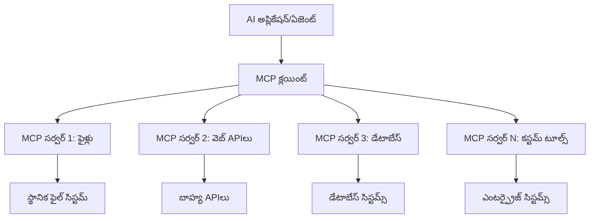
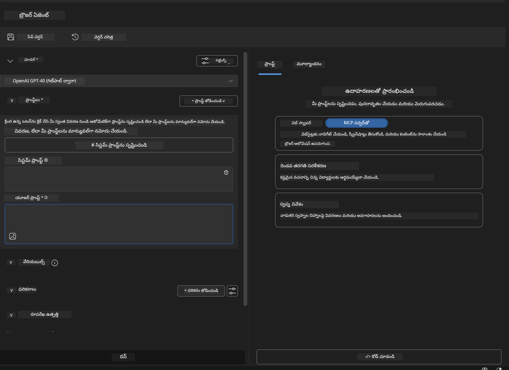
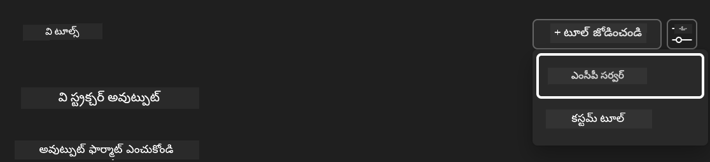
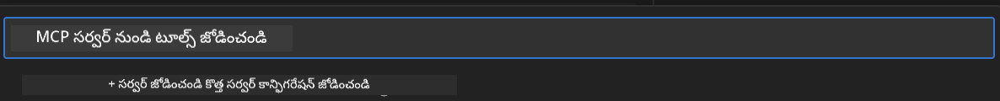
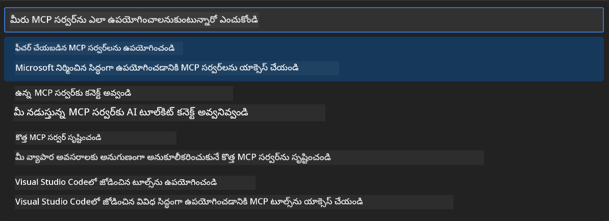
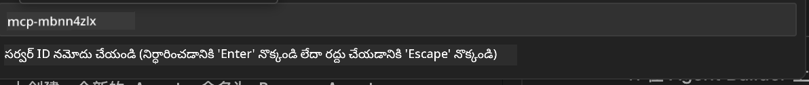
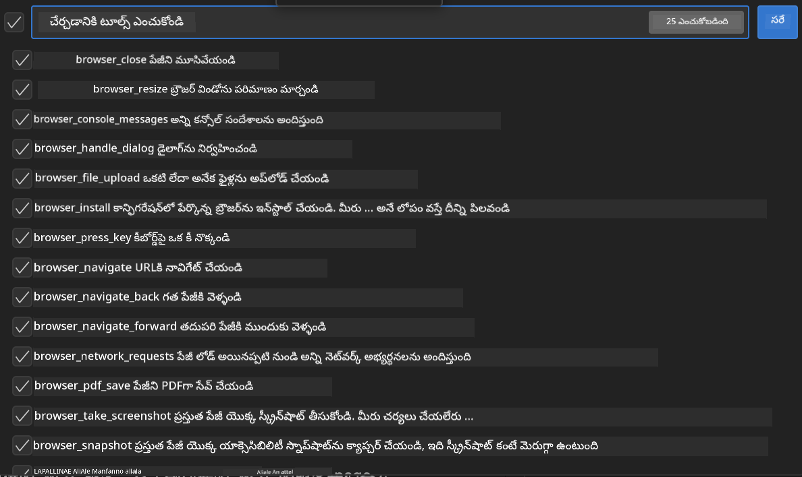
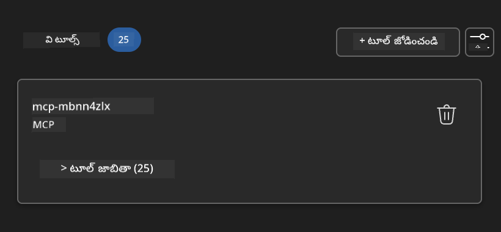

<!--
CO_OP_TRANSLATOR_METADATA:
{
  "original_hash": "a22b7dd11cd7690f99f9195877cafdc3",
  "translation_date": "2025-12-11T16:56:01+00:00",
  "source_file": "10-StreamliningAIWorkflowsBuildingAnMCPServerWithAIToolkit/lab2/README.md",
  "language_code": "te"
}
-->
# 🌐 మాడ్యూల్ 2: AI టూల్‌కిట్ ఫండమెంటల్స్‌తో MCP

[]()
[]()
[]()

## 📋 నేర్చుకునే లక్ష్యాలు

ఈ మాడ్యూల్ ముగిసే వరకు, మీరు చేయగలుగుతారు:
- ✅ మోడల్ కాంటెక్స్ట్ ప్రోటోకాల్ (MCP) నిర్మాణం మరియు లాభాలను అర్థం చేసుకోవడం
- ✅ మైక్రోసాఫ్ట్ MCP సర్వర్ ఎకోసిస్టమ్‌ను అన్వేషించడం
- ✅ MCP సర్వర్లను AI టూల్‌కిట్ ఏజెంట్ బిల్డర్‌తో సమగ్రపరచడం
- ✅ Playwright MCP ఉపయోగించి ఒక ఫంక్షనల్ బ్రౌజర్ ఆటోమేషన్ ఏజెంట్‌ను నిర్మించడం
- ✅ మీ ఏజెంట్లలో MCP టూల్స్‌ను కాన్ఫిగర్ చేసి పరీక్షించడం
- ✅ ఉత్పత్తి ఉపయోగానికి MCP-పవర్డ్ ఏజెంట్లను ఎగుమతి చేసి అమలు చేయడం

## 🎯 మాడ్యూల్ 1 పై ఆధారపడి

మాడ్యూల్ 1లో, మేము AI టూల్‌కిట్ ప్రాథమికాలను నేర్చుకుని మా మొదటి Python ఏజెంట్‌ను సృష్టించుకున్నాము. ఇప్పుడు మేము మీ ఏజెంట్లను విప్లవాత్మకమైన **మోడల్ కాంటెక్స్ట్ ప్రోటోకాల్ (MCP)** ద్వారా బాహ్య టూల్స్ మరియు సేవలతో కనెక్ట్ చేసి **సూపర్‌చార్జ్** చేయబోతున్నాము.

ఇది ఒక ప్రాథమిక క్యాల్క్యులేటర్ నుండి పూర్తి కంప్యూటర్‌కు అప్‌గ్రేడ్ చేయడం లాంటిది - మీ AI ఏజెంట్లు ఈ సామర్థ్యాలను పొందతాయి:
- 🌐 వెబ్‌సైట్లను బ్రౌజ్ చేసి ఇంటరాక్ట్ చేయడం
- 📁 ఫైళ్లను యాక్సెస్ చేసి మానిప్యులేట్ చేయడం
- 🔧 ఎంటర్ప్రైజ్ సిస్టమ్స్‌తో సమగ్రపరచడం
- 📊 APIs నుండి రియల్-టైమ్ డేటాను ప్రాసెస్ చేయడం

## 🧠 మోడల్ కాంటెక్స్ట్ ప్రోటోకాల్ (MCP) అర్థం చేసుకోవడం

### 🔍 MCP అంటే ఏమిటి?

మోడల్ కాంటెక్స్ట్ ప్రోటోకాల్ (MCP) అనేది **"AI అప్లికేషన్ల కోసం USB-C"** - ఇది విప్లవాత్మకమైన ఓపెన్ స్టాండర్డ్, ఇది లార్జ్ లాంగ్వేజ్ మోడల్స్ (LLMs) ను బాహ్య టూల్స్, డేటా సోర్సులు మరియు సేవలతో కనెక్ట్ చేస్తుంది. USB-C ఒకే యూనివర్సల్ కనెక్టర్ అందించడం ద్వారా కేబుల్ గందరగోళాన్ని తొలగించినట్లే, MCP ఒకే ప్రామాణిక ప్రోటోకాల్‌తో AI ఇంటిగ్రేషన్ క్లిష్టతను తొలగిస్తుంది.

### 🎯 MCP పరిష్కరించే సమస్య

**MCP ముందు:**
- 🔧 ప్రతి టూల్ కోసం కస్టమ్ ఇంటిగ్రేషన్లు
- 🔄 ప్రొప్రైటరీ సొల్యూషన్లతో వెండర్ లాక్-ఇన్  
- 🔒 యాదృచ్ఛిక కనెక్షన్ల వల్ల భద్రతా లోపాలు
- ⏱️ ప్రాథమిక ఇంటిగ్రేషన్లకు నెలల అభివృద్ధి

**MCP తో:**
- ⚡ ప్లగ్-అండ్-ప్లే టూల్ ఇంటిగ్రేషన్
- 🔄 వెండర్-అగ్నోస్టిక్ ఆర్కిటెక్చర్
- 🛡️ బిల్ట్-ఇన్ భద్రతా ఉత్తమ పద్ధతులు
- 🚀 కొత్త సామర్థ్యాలను జోడించడానికి నిమిషాలు

### 🏗️ MCP ఆర్కిటెక్చర్ లోతైన అవగాహన

MCP ఒక **క్లయింట్-సర్వర్ ఆర్కిటెక్చర్**ను అనుసరిస్తుంది, ఇది ఒక సురక్షిత, స్కేలబుల్ ఎకోసిస్టమ్‌ను సృష్టిస్తుంది:


**🔧 ప్రధాన భాగాలు:**

| భాగం | పాత్ర | ఉదాహరణలు |
|-----------|------|----------|
| **MCP హోస్ట్లు** | MCP సేవలను వినియోగించే అప్లికేషన్లు | Claude Desktop, VS Code, AI Toolkit |
| **MCP క్లయింట్లు** | ప్రోటోకాల్ హ్యాండ్లర్లు (సర్వర్లతో 1:1) | హోస్ట్ అప్లికేషన్లలో బిల్ట్-ఇన్ |
| **MCP సర్వర్లు** | ప్రామాణిక ప్రోటోకాల్ ద్వారా సామర్థ్యాలను ప్రదర్శిస్తాయి | Playwright, Files, Azure, GitHub |
| **ట్రాన్స్‌పోర్ట్ లేయర్** | కమ్యూనికేషన్ పద్ధతులు | stdio, HTTP, WebSockets |


## 🏢 మైక్రోసాఫ్ట్ MCP సర్వర్ ఎకోసిస్టమ్

మైక్రోసాఫ్ట్ MCP ఎకోసిస్టమ్‌ను ఒక సమగ్ర ఎంటర్ప్రైజ్-గ్రేడ్ సర్వర్ల సూట్‌తో ముందంజలో ఉంది, ఇది వాస్తవ వ్యాపార అవసరాలను తీర్చుతుంది.

### 🌟 ప్రముఖ మైక్రోసాఫ్ట్ MCP సర్వర్లు

#### 1. ☁️ Azure MCP సర్వర్
**🔗 రిపాజిటరీ**: [azure/azure-mcp](https://github.com/azure/azure-mcp)
**🎯 ఉద్దేశ్యం**: AI సమగ్రతతో సమగ్ర Azure వనరుల నిర్వహణ

**✨ ముఖ్య లక్షణాలు:**
- డిక్లరేటివ్ ఇన్‌ఫ్రాస్ట్రక్చర్ ప్రొవిజనింగ్
- రియల్-టైమ్ వనరు మానిటరింగ్
- ఖర్చు ఆప్టిమైజేషన్ సిఫార్సులు
- భద్రతా అనుగుణత తనిఖీలు

**🚀 ఉపయోగాల సందర్భాలు:**
- AI సహాయంతో ఇన్‌ఫ్రాస్ట్రక్చర్-అస్-కోడ్
- ఆటోమేటెడ్ వనరు స్కేలింగ్
- క్లౌడ్ ఖర్చు ఆప్టిమైజేషన్
- DevOps వర్క్‌ఫ్లో ఆటోమేషన్

#### 2. 📊 Microsoft Dataverse MCP
**📚 డాక్యుమెంటేషన్**: [Microsoft Dataverse Integration](https://go.microsoft.com/fwlink/?linkid=2320176)
**🎯 ఉద్దేశ్యం**: వ్యాపార డేటాకు సహజ భాష ఇంటర్‌ఫేస్

**✨ ముఖ్య లక్షణాలు:**
- సహజ భాష డేటాబేస్ క్వెరీలు
- వ్యాపార కాంటెక్స్ట్ అర్థం చేసుకోవడం
- కస్టమ్ ప్రాంప్ట్ టెంప్లేట్లు
- ఎంటర్ప్రైజ్ డేటా గవర్నెన్స్

**🚀 ఉపయోగాల సందర్భాలు:**
- వ్యాపార బుద్ధిమత్తా రిపోర్టింగ్
- కస్టమర్ డేటా విశ్లేషణ
- సేల్స్ పైప్‌లైన్ అవగాహన
- అనుగుణత డేటా క్వెరీలు

#### 3. 🌐 Playwright MCP సర్వర్
**🔗 రిపాజిటరీ**: [microsoft/playwright-mcp](https://github.com/microsoft/playwright-mcp)
**🎯 ఉద్దేశ్యం**: బ్రౌజర్ ఆటోమేషన్ మరియు వెబ్ ఇంటరాక్షన్ సామర్థ్యాలు

**✨ ముఖ్య లక్షణాలు:**
- క్రాస్-బ్రౌజర్ ఆటోమేషన్ (Chrome, Firefox, Safari)
- తెలివైన ఎలిమెంట్ గుర్తింపు
- స్క్రీన్‌షాట్ మరియు PDF ఉత్పత్తి
- నెట్‌వర్క్ ట్రాఫిక్ మానిటరింగ్

**🚀 ఉపయోగాల సందర్భాలు:**
- ఆటోమేటెడ్ టెస్టింగ్ వర్క్‌ఫ్లోలు
- వెబ్ స్క్రాపింగ్ మరియు డేటా ఎక్స్‌ట్రాక్షన్
- UI/UX మానిటరింగ్
- పోటీ విశ్లేషణ ఆటోమేషన్

#### 4. 📁 Files MCP సర్వర్
**🔗 రిపాజిటరీ**: [microsoft/files-mcp-server](https://github.com/microsoft/files-mcp-server)
**🎯 ఉద్దేశ్యం**: తెలివైన ఫైల్ సిస్టమ్ ఆపరేషన్లు

**✨ ముఖ్య లక్షణాలు:**
- డిక్లరేటివ్ ఫైల్ నిర్వహణ
- కంటెంట్ సింక్రనైజేషన్
- వెర్షన్ కంట్రోల్ సమగ్రత
- మెటాడేటా ఎక్స్‌ట్రాక్షన్

**🚀 ఉపయోగాల సందర్భాలు:**
- డాక్యుమెంటేషన్ నిర్వహణ
- కోడ్ రిపాజిటరీ ఆర్గనైజేషన్
- కంటెంట్ ప్రచురణ వర్క్‌ఫ్లోలు
- డేటా పైప్‌లైన్ ఫైల్ హ్యాండ్లింగ్

#### 5. 📝 MarkItDown MCP సర్వర్
**🔗 రిపాజిటరీ**: [microsoft/markitdown](https://github.com/microsoft/markitdown)
**🎯 ఉద్దేశ్యం**: అధునాతన మార్క్డౌన్ ప్రాసెసింగ్ మరియు మానిప్యులేషన్

**✨ ముఖ్య లక్షణాలు:**
- రిచ్ మార్క్డౌన్ పార్సింగ్
- ఫార్మాట్ మార్పిడి (MD ↔ HTML ↔ PDF)
- కంటెంట్ నిర్మాణ విశ్లేషణ
- టెంప్లేట్ ప్రాసెసింగ్

**🚀 ఉపయోగాల సందర్భాలు:**
- సాంకేతిక డాక్యుమెంటేషన్ వర్క్‌ఫ్లోలు
- కంటెంట్ మేనేజ్‌మెంట్ సిస్టమ్స్
- రిపోర్ట్ ఉత్పత్తి
- జ్ఞాన బేస్ ఆటోమేషన్

#### 6. 📈 Clarity MCP సర్వర్
**📦 ప్యాకేజ్**: [@microsoft/clarity-mcp-server](https://www.npmjs.com/package/@microsoft/clarity-mcp-server)
**🎯 ఉద్దేశ్యం**: వెబ్ అనలిటిక్స్ మరియు యూజర్ ప్రవర్తన అవగాహన

**✨ ముఖ్య లక్షణాలు:**
- హీట్‌మ్యాప్ డేటా విశ్లేషణ
- యూజర్ సెషన్ రికార్డింగ్స్
- పనితీరు మెట్రిక్స్
- కన్వర్షన్ ఫన్నెల్ విశ్లేషణ

**🚀 ఉపయోగాల సందర్భాలు:**
- వెబ్‌సైట్ ఆప్టిమైజేషన్
- యూజర్ అనుభవ పరిశోధన
- A/B టెస్టింగ్ విశ్లేషణ
- వ్యాపార బుద్ధిమత్తా డాష్‌బోర్డులు

### 🌍 కమ్యూనిటీ ఎకోసిస్టమ్

మైక్రోసాఫ్ట్ సర్వర్లకు మించి, MCP ఎకోసిస్టమ్‌లో ఉన్నాయి:
- **🐙 GitHub MCP**: రిపాజిటరీ నిర్వహణ మరియు కోడ్ విశ్లేషణ
- **🗄️ డేటాబేస్ MCPలు**: PostgreSQL, MySQL, MongoDB సమగ్రతలు
- **☁️ క్లౌడ్ ప్రొవైడర్ MCPలు**: AWS, GCP, Digital Ocean టూల్స్
- **📧 కమ్యూనికేషన్ MCPలు**: Slack, Teams, ఇమెయిల్ సమగ్రతలు

## 🛠️ హ్యాండ్స్-ఆన్ ల్యాబ్: బ్రౌజర్ ఆటోమేషన్ ఏజెంట్ నిర్మాణం

**🎯 ప్రాజెక్ట్ లక్ష్యం**: Playwright MCP సర్వర్ ఉపయోగించి ఒక తెలివైన బ్రౌజర్ ఆటోమేషన్ ఏజెంట్‌ను సృష్టించడం, ఇది వెబ్‌సైట్లను నావిగేట్ చేసి, సమాచారం సేకరించి, సంక్లిష్ట వెబ్ ఇంటరాక్షన్లను నిర్వహించగలదు.

### 🚀 దశ 1: ఏజెంట్ ఫౌండేషన్ సెటప్

#### దశ 1: మీ ఏజెంట్‌ను ప్రారంభించండి
1. **AI టూల్‌కిట్ ఏజెంట్ బిల్డర్‌ను ఓపెన్ చేయండి**
2. **క్రొత్త ఏజెంట్ సృష్టించండి** ఈ కింది కాన్ఫిగరేషన్‌తో:
   - **పేరు**: `BrowserAgent`
   - **మోడల్**: GPT-4o ఎంచుకోండి




### 🔧 దశ 2: MCP ఇంటిగ్రేషన్ వర్క్‌ఫ్లో

#### దశ 3: MCP సర్వర్ ఇంటిగ్రేషన్ జోడించండి
1. **ఏజెంట్ బిల్డర్‌లో టూల్స్ సెక్షన్‌కు వెళ్లండి**
2. **"Add Tool" క్లిక్ చేసి ఇంటిగ్రేషన్ మెనూను తెరవండి**
3. **అందుబాటులో ఉన్న ఎంపికల నుండి "MCP Server" ఎంచుకోండి**



**🔍 టూల్ రకాల అర్థం:**
- **బిల్ట్-ఇన్ టూల్స్**: ముందుగా కాన్ఫిగర్ చేసిన AI టూల్‌కిట్ ఫంక్షన్లు
- **MCP సర్వర్లు**: బాహ్య సేవల సమగ్రతలు
- **కస్టమ్ APIs**: మీ స్వంత సేవ ఎండ్‌పాయింట్లు
- **ఫంక్షన్ కాలింగ్**: డైరెక్ట్ మోడల్ ఫంక్షన్ యాక్సెస్

#### దశ 4: MCP సర్వర్ ఎంపిక
1. **"MCP Server" ఎంపికను ఎంచుకుని కొనసాగండి**


2. **అందుబాటులో ఉన్న ఇంటిగ్రేషన్లను అన్వేషించడానికి MCP క్యాటలాగ్ బ్రౌజ్ చేయండి**



### 🎮 దశ 3: Playwright MCP కాన్ఫిగరేషన్

#### దశ 5: Playwright ఎంచుకుని కాన్ఫిగర్ చేయండి
1. **మైక్రోసాఫ్ట్ ధృవీకరించిన సర్వర్లను యాక్సెస్ చేయడానికి "Use Featured MCP Servers" క్లిక్ చేయండి**
2. **ఫీచర్ చేసిన జాబితాలో నుండి "Playwright" ఎంచుకోండి**
3. **డిఫాల్ట్ MCP IDని అంగీకరించండి లేదా మీ పరిసరానికి అనుగుణంగా కస్టమైజ్ చేయండి**



#### దశ 6: Playwright సామర్థ్యాలను ఎనేబుల్ చేయండి
**🔑 కీలక దశ**: గరిష్ట ఫంక్షనాలిటీ కోసం అందుబాటులో ఉన్న అన్ని Playwright పద్ధతులను ఎంచుకోండి



**🛠️ అవసరమైన Playwright టూల్స్:**
- **నావిగేషన్**: `goto`, `goBack`, `goForward`, `reload`
- **ఇంటరాక్షన్**: `click`, `fill`, `press`, `hover`, `drag`
- **ఎక్స్‌ట్రాక్షన్**: `textContent`, `innerHTML`, `getAttribute`
- **వాలిడేషన్**: `isVisible`, `isEnabled`, `waitForSelector`
- **క్యాప్చర్**: `screenshot`, `pdf`, `video`
- **నెట్‌వర్క్**: `setExtraHTTPHeaders`, `route`, `waitForResponse`

#### దశ 7: ఇంటిగ్రేషన్ విజయాన్ని ధృవీకరించండి
**✅ విజయ సూచికలు:**
- ఏజెంట్ బిల్డర్ ఇంటర్‌ఫేస్‌లో అన్ని టూల్స్ కనిపిస్తాయి
- ఇంటిగ్రేషన్ ప్యానెల్‌లో ఎటువంటి లోపాలు లేవు
- Playwright సర్వర్ స్థితి "Connected" చూపిస్తుంది



**🔧 సాధారణ సమస్యల పరిష్కారం:**
- **కనెక్షన్ విఫలం**: ఇంటర్నెట్ కనెక్టివిటీ మరియు ఫైర్వాల్ సెట్టింగ్స్ తనిఖీ చేయండి
- **టూల్స్ లేమి**: సెటప్ సమయంలో అన్ని సామర్థ్యాలు ఎంచుకున్నాయో చూసుకోండి
- **అనుమతి లోపాలు**: VS Codeకి అవసరమైన సిస్టమ్ అనుమతులు ఉన్నాయో ధృవీకరించండి

### 🎯 దశ 4: అధునాతన ప్రాంప్ట్ ఇంజనీరింగ్

#### దశ 8: తెలివైన సిస్టమ్ ప్రాంప్ట్‌లను డిజైన్ చేయండి
Playwright యొక్క పూర్తి సామర్థ్యాలను ఉపయోగించే సొఫిస్టికేటెడ్ ప్రాంప్ట్‌లను సృష్టించండి:

```markdown
# Web Automation Expert System Prompt

## Core Identity
You are an advanced web automation specialist with deep expertise in browser automation, web scraping, and user experience analysis. You have access to Playwright tools for comprehensive browser control.

## Capabilities & Approach
### Navigation Strategy
- Always start with screenshots to understand page layout
- Use semantic selectors (text content, labels) when possible
- Implement wait strategies for dynamic content
- Handle single-page applications (SPAs) effectively

### Error Handling
- Retry failed operations with exponential backoff
- Provide clear error descriptions and solutions
- Suggest alternative approaches when primary methods fail
- Always capture diagnostic screenshots on errors

### Data Extraction
- Extract structured data in JSON format when possible
- Provide confidence scores for extracted information
- Validate data completeness and accuracy
- Handle pagination and infinite scroll scenarios

### Reporting
- Include step-by-step execution logs
- Provide before/after screenshots for verification
- Suggest optimizations and alternative approaches
- Document any limitations or edge cases encountered

## Ethical Guidelines
- Respect robots.txt and rate limiting
- Avoid overloading target servers
- Only extract publicly available information
- Follow website terms of service
```

#### దశ 9: డైనమిక్ యూజర్ ప్రాంప్ట్‌లను సృష్టించండి
వివిధ సామర్థ్యాలను ప్రదర్శించే ప్రాంప్ట్‌లను డిజైన్ చేయండి:

**🌐 వెబ్ విశ్లేషణ ఉదాహరణ:**
```markdown
Navigate to github.com/kinfey and provide a comprehensive analysis including:
1. Repository structure and organization
2. Recent activity and contribution patterns  
3. Documentation quality assessment
4. Technology stack identification
5. Community engagement metrics
6. Notable projects and their purposes

Include screenshots at key steps and provide actionable insights.
```

 ఉపయోగించి అనువదించబడింది. మేము ఖచ్చితత్వానికి ప్రయత్నించినప్పటికీ, ఆటోమేటెడ్ అనువాదాల్లో పొరపాట్లు లేదా తప్పిదాలు ఉండవచ్చు. మూల పత్రం దాని స్వదేశీ భాషలో అధికారిక మూలంగా పరిగణించాలి. ముఖ్యమైన సమాచారానికి, ప్రొఫెషనల్ మానవ అనువాదం సిఫార్సు చేయబడుతుంది. ఈ అనువాదం వాడకంలో ఏర్పడిన ఏవైనా అపార్థాలు లేదా తప్పుదారితీసే అర్థాలు కోసం మేము బాధ్యత వహించము.
<!-- CO-OP TRANSLATOR DISCLAIMER END -->