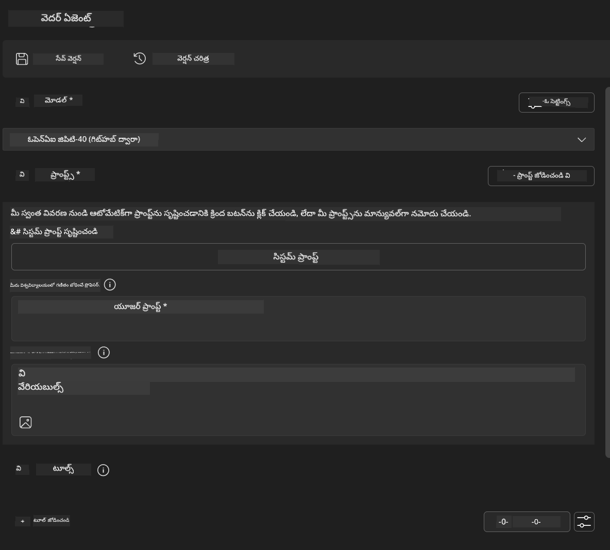
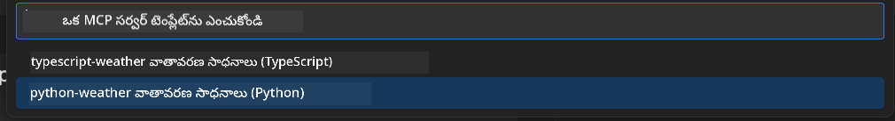
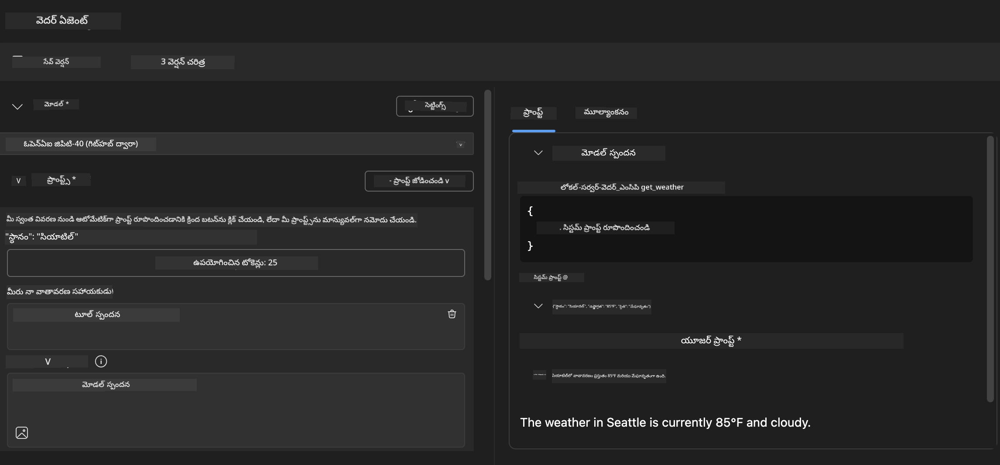
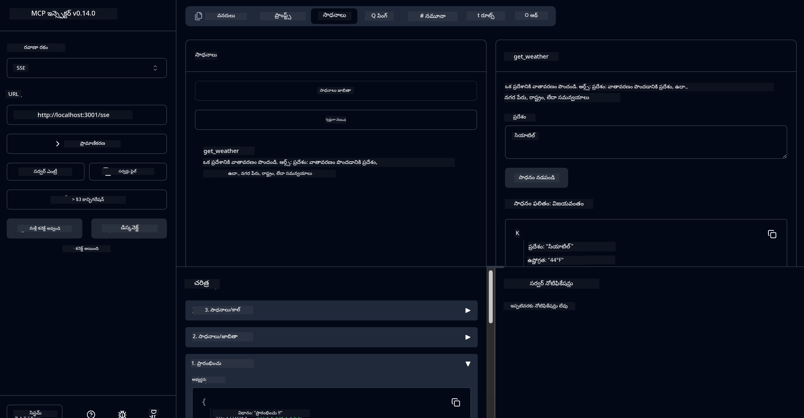

<!--
CO_OP_TRANSLATOR_METADATA:
{
  "original_hash": "dd8da3f75addcef453fe11f02a270217",
  "translation_date": "2025-12-11T16:48:17+00:00",
  "source_file": "10-StreamliningAIWorkflowsBuildingAnMCPServerWithAIToolkit/lab3/README.md",
  "language_code": "te"
}
-->
# 🔧 మాడ్యూల్ 3: AI టూల్‌కిట్‌తో అధునాతన MCP అభివృద్ధి


## 🎯 నేర్చుకునే లక్ష్యాలు

ఈ ప్రయోగశాల ముగింపులో, మీరు చేయగలుగుతారు:

- ✅ AI టూల్‌కిట్ ఉపయోగించి కస్టమ్ MCP సర్వర్లు సృష్టించడం
- ✅ తాజా MCP Python SDK (v1.9.3)ని కాన్ఫిగర్ చేసి ఉపయోగించడం
- ✅ డీబగ్గింగ్ కోసం MCP ఇన్స్పెక్టర్‌ను సెటప్ చేసి ఉపయోగించడం
- ✅ ఏజెంట్ బిల్డర్ మరియు ఇన్స్పెక్టర్ వాతావరణాల్లో MCP సర్వర్లను డీబగ్ చేయడం
- ✅ అధునాతన MCP సర్వర్ అభివృద్ధి వర్క్‌ఫ్లోలను అర్థం చేసుకోవడం

## 📋 ముందస్తు అవసరాలు

- ల్యాబ్ 2 (MCP ఫండమెంటల్స్) పూర్తి చేయడం
- AI టూల్‌కిట్ ఎక్స్‌టెన్షన్‌తో VS కోడ్
- Python 3.10+ వాతావరణం
- ఇన్స్పెక్టర్ సెటప్ కోసం Node.js మరియు npm

## 🏗️ మీరు నిర్మించబోయేది

ఈ ప్రయోగశాలలో, మీరు క్రింది అంశాలను ప్రదర్శించే **వెదర్ MCP సర్వర్**ను సృష్టిస్తారు:
- కస్టమ్ MCP సర్వర్ అమలు
- AI టూల్‌కిట్ ఏజెంట్ బిల్డర్‌తో ఇంటిగ్రేషన్
- ప్రొఫెషనల్ డీబగ్గింగ్ వర్క్‌ఫ్లోలు
- ఆధునిక MCP SDK ఉపయోగ నమూనాలు

---

## 🔧 ప్రధాన భాగాల అవలోకనం

### 🐍 MCP Python SDK
మోడల్ కాంటెక్స్ట్ ప్రోటోకాల్ Python SDK కస్టమ్ MCP సర్వర్లు నిర్మించడానికి పునాది అందిస్తుంది. మీరు 1.9.3 వెర్షన్‌ను మెరుగైన డీబగ్గింగ్ సామర్థ్యాలతో ఉపయోగిస్తారు.

### 🔍 MCP ఇన్స్పెక్టర్
శక్తివంతమైన డీబగ్గింగ్ సాధనం ఇది:
- రియల్-టైమ్ సర్వర్ మానిటరింగ్
- టూల్ ఎగ్జిక్యూషన్ విజువలైజేషన్
- నెట్‌వర్క్ అభ్యర్థన/ప్రతిస్పందన పరిశీలన
- ఇంటరాక్టివ్ టెస్టింగ్ వాతావరణం

---

## 📖 దశల వారీ అమలు

### దశ 1: ఏజెంట్ బిల్డర్‌లో WeatherAgent సృష్టించండి

1. AI టూల్‌కిట్ ఎక్స్‌టెన్షన్ ద్వారా VS కోడ్‌లో **ఏజెంట్ బిల్డర్ ప్రారంభించండి**
2. క్రింది కాన్ఫిగరేషన్‌తో **కొత్త ఏజెంట్ సృష్టించండి**:
   - ఏజెంట్ పేరు: `WeatherAgent`



### దశ 2: MCP సర్వర్ ప్రాజెక్ట్ ప్రారంభించండి

1. ఏజెంట్ బిల్డర్‌లో **Tools → Add Tool**కి వెళ్లండి
2. అందుబాటులో ఉన్న ఎంపికల నుండి **"MCP Server"** ఎంచుకోండి
3. **"Create A new MCP Server"** ఎంచుకోండి
4. **`python-weather` టెంప్లేట్ ఎంచుకోండి**
5. మీ సర్వర్‌కు పేరు పెట్టండి: `weather_mcp`



### దశ 3: ప్రాజెక్ట్‌ను తెరవండి మరియు పరిశీలించండి

1. VS కోడ్‌లో ఉత్పత్తి అయిన ప్రాజెక్ట్‌ను **తెరవండి**
2. ప్రాజెక్ట్ నిర్మాణాన్ని **సమీక్షించండి:**
   ```
   weather_mcp/
   ├── src/
   │   ├── __init__.py
   │   └── server.py
   ├── inspector/
   │   ├── package.json
   │   └── package-lock.json
   ├── .vscode/
   │   ├── launch.json
   │   └── tasks.json
   ├── pyproject.toml
   └── README.md
   ```

### దశ 4: తాజా MCP SDKకి అప్‌గ్రేడ్ చేయండి

> **🔍 ఎందుకు అప్‌గ్రేడ్ చేయాలి?** మెరుగైన ఫీచర్లు మరియు మెరుగైన డీబగ్గింగ్ సామర్థ్యాల కోసం తాజా MCP SDK (v1.9.3) మరియు ఇన్స్పెక్టర్ సర్వీస్ (0.14.0) ఉపయోగించాలనుకుంటున్నాము.

#### 4a. Python డిపెండెన్సీలను నవీకరించండి

**`pyproject.toml` సవరించండి:** [./code/weather_mcp/pyproject.toml](../../../../10-StreamliningAIWorkflowsBuildingAnMCPServerWithAIToolkit/lab3/code/weather_mcp/pyproject.toml) నవీకరించండి


#### 4b. ఇన్స్పెక్టర్ కాన్ఫిగరేషన్ నవీకరణ

**`inspector/package.json` సవరించండి:** [./code/weather_mcp/inspector/package.json](../../../../10-StreamliningAIWorkflowsBuildingAnMCPServerWithAIToolkit/lab3/code/weather_mcp/inspector/package.json) నవీకరించండి

#### 4c. ఇన్స్పెక్టర్ డిపెండెన్సీలను నవీకరించండి

**`inspector/package-lock.json` సవరించండి:** [./code/weather_mcp/inspector/package-lock.json](../../../../10-StreamliningAIWorkflowsBuildingAnMCPServerWithAIToolkit/lab3/code/weather_mcp/inspector/package-lock.json) నవీకరించండి

> **📝 గమనిక:** ఈ ఫైల్ విస్తృతమైన డిపెండెన్సీ నిర్వచనాలను కలిగి ఉంటుంది. క్రింద ప్రాథమిక నిర్మాణం ఉంది - పూర్తి కంటెంట్ సరైన డిపెండెన్సీ పరిష్కారాన్ని నిర్ధారిస్తుంది.


> **⚡ పూర్తి ప్యాకేజ్ లాక్:** పూర్తి package-lock.json సుమారు 3000 లైన్ల డిపెండెన్సీ నిర్వచనాలను కలిగి ఉంటుంది. పైది కీలక నిర్మాణాన్ని చూపిస్తుంది - పూర్తి డిపెండెన్సీ పరిష్కారం కోసం అందించిన ఫైల్ ఉపయోగించండి.

### దశ 5: VS కోడ్ డీబగ్గింగ్ కాన్ఫిగరేషన్

*గమనిక: సంబంధిత స్థానిక ఫైల్‌ను మార్చడానికి పేర్కొన్న మార్గంలో ఫైల్‌ను కాపీ చేయండి*

#### 5a. లాంచ్ కాన్ఫిగరేషన్ నవీకరణ

**`.vscode/launch.json` సవరించండి:**

```json
{
  "version": "0.2.0",
  "configurations": [
    {
      "name": "Attach to Local MCP",
      "type": "debugpy",
      "request": "attach",
      "connect": {
        "host": "localhost",
        "port": 5678
      },
      "presentation": {
        "hidden": true
      },
      "internalConsoleOptions": "neverOpen",
      "postDebugTask": "Terminate All Tasks"
    },
    {
      "name": "Launch Inspector (Edge)",
      "type": "msedge",
      "request": "launch",
      "url": "http://localhost:6274?timeout=60000&serverUrl=http://localhost:3001/sse#tools",
      "cascadeTerminateToConfigurations": [
        "Attach to Local MCP"
      ],
      "presentation": {
        "hidden": true
      },
      "internalConsoleOptions": "neverOpen"
    },
    {
      "name": "Launch Inspector (Chrome)",
      "type": "chrome",
      "request": "launch",
      "url": "http://localhost:6274?timeout=60000&serverUrl=http://localhost:3001/sse#tools",
      "cascadeTerminateToConfigurations": [
        "Attach to Local MCP"
      ],
      "presentation": {
        "hidden": true
      },
      "internalConsoleOptions": "neverOpen"
    }
  ],
  "compounds": [
    {
      "name": "Debug in Agent Builder",
      "configurations": [
        "Attach to Local MCP"
      ],
      "preLaunchTask": "Open Agent Builder",
    },
    {
      "name": "Debug in Inspector (Edge)",
      "configurations": [
        "Launch Inspector (Edge)",
        "Attach to Local MCP"
      ],
      "preLaunchTask": "Start MCP Inspector",
      "stopAll": true
    },
    {
      "name": "Debug in Inspector (Chrome)",
      "configurations": [
        "Launch Inspector (Chrome)",
        "Attach to Local MCP"
      ],
      "preLaunchTask": "Start MCP Inspector",
      "stopAll": true
    }
  ]
}
```

**`.vscode/tasks.json` సవరించండి:**

```
{
  "version": "2.0.0",
  "tasks": [
    {
      "label": "Start MCP Server",
      "type": "shell",
      "command": "python -m debugpy --listen 127.0.0.1:5678 src/__init__.py sse",
      "isBackground": true,
      "options": {
        "cwd": "${workspaceFolder}",
        "env": {
          "PORT": "3001"
        }
      },
      "problemMatcher": {
        "pattern": [
          {
            "regexp": "^.*$",
            "file": 0,
            "location": 1,
            "message": 2
          }
        ],
        "background": {
          "activeOnStart": true,
          "beginsPattern": ".*",
          "endsPattern": "Application startup complete|running"
        }
      }
    },
    {
      "label": "Start MCP Inspector",
      "type": "shell",
      "command": "npm run dev:inspector",
      "isBackground": true,
      "options": {
        "cwd": "${workspaceFolder}/inspector",
        "env": {
          "CLIENT_PORT": "6274",
          "SERVER_PORT": "6277",
        }
      },
      "problemMatcher": {
        "pattern": [
          {
            "regexp": "^.*$",
            "file": 0,
            "location": 1,
            "message": 2
          }
        ],
        "background": {
          "activeOnStart": true,
          "beginsPattern": "Starting MCP inspector",
          "endsPattern": "Proxy server listening on port"
        }
      },
      "dependsOn": [
        "Start MCP Server"
      ]
    },
    {
      "label": "Open Agent Builder",
      "type": "shell",
      "command": "echo ${input:openAgentBuilder}",
      "presentation": {
        "reveal": "never"
      },
      "dependsOn": [
        "Start MCP Server"
      ],
    },
    {
      "label": "Terminate All Tasks",
      "command": "echo ${input:terminate}",
      "type": "shell",
      "problemMatcher": []
    }
  ],
  "inputs": [
    {
      "id": "openAgentBuilder",
      "type": "command",
      "command": "ai-mlstudio.agentBuilder",
      "args": {
        "initialMCPs": [ "local-server-weather_mcp" ],
        "triggeredFrom": "vsc-tasks"
      }
    },
    {
      "id": "terminate",
      "type": "command",
      "command": "workbench.action.tasks.terminate",
      "args": "terminateAll"
    }
  ]
}
```


---

## 🚀 మీ MCP సర్వర్‌ను నడపడం మరియు పరీక్షించడం

### దశ 6: డిపెండెన్సీలను ఇన్‌స్టాల్ చేయండి

కాన్ఫిగరేషన్ మార్పులు చేసిన తర్వాత, క్రింది కమాండ్లను నడపండి:

**Python డిపెండెన్సీలను ఇన్‌స్టాల్ చేయండి:**
```bash
uv sync
```

**ఇన్స్పెక్టర్ డిపెండెన్సీలను ఇన్‌స్టాల్ చేయండి:**
```bash
cd inspector
npm install
```

### దశ 7: ఏజెంట్ బిల్డర్‌తో డీబగ్ చేయండి

1. **F5 నొక్కండి** లేదా **"Debug in Agent Builder"** కాన్ఫిగరేషన్ ఉపయోగించండి
2. డీబగ్ ప్యానెల్ నుండి **కాంపౌండ్ కాన్ఫిగరేషన్ ఎంచుకోండి**
3. **సర్వర్ ప్రారంభం కావడానికి మరియు ఏజెంట్ బిల్డర్ తెరవడానికి వేచి ఉండండి**
4. సహజ భాషా ప్రశ్నలతో మీ వెదర్ MCP సర్వర్‌ను **పరీక్షించండి**

ఈ విధంగా ఇన్‌పుట్ ప్రాంప్ట్ ఇవ్వండి

SYSTEM_PROMPT

```
You are my weather assistant
```

USER_PROMPT

```
How's the weather like in Seattle
```



### దశ 8: MCP ఇన్స్పెక్టర్‌తో డీబగ్ చేయండి

1. **"Debug in Inspector"** కాన్ఫిగరేషన్ (Edge లేదా Chrome) ఉపయోగించండి
2. `http://localhost:6274` వద్ద ఇన్స్పెక్టర్ ఇంటర్‌ఫేస్‌ను తెరవండి
3. ఇంటరాక్టివ్ టెస్టింగ్ వాతావరణాన్ని అన్వేషించండి:
   - అందుబాటులో ఉన్న టూల్స్ చూడండి
   - టూల్ ఎగ్జిక్యూషన్‌ను పరీక్షించండి
   - నెట్‌వర్క్ అభ్యర్థనలను మానిటర్ చేయండి
   - సర్వర్ ప్రతిస్పందనలను డీబగ్ చేయండి



---

## 🎯 ముఖ్యమైన నేర్చుకున్న ఫలితాలు

ఈ ప్రయోగశాల పూర్తి చేయడం ద్వారా, మీరు:

- [x] **AI టూల్‌కిట్ టెంప్లేట్లతో కస్టమ్ MCP సర్వర్ సృష్టించారు**
- [x] **తాజా MCP SDK (v1.9.3)కి అప్‌గ్రేడ్ అయ్యారు** మెరుగైన ఫంక్షనాలిటీ కోసం
- [x] **ఏజెంట్ బిల్డర్ మరియు ఇన్స్పెక్టర్ కోసం ప్రొఫెషనల్ డీబగ్గింగ్ వర్క్‌ఫ్లోలను కాన్ఫిగర్ చేసారు**
- [x] **ఇంటరాక్టివ్ సర్వర్ టెస్టింగ్ కోసం MCP ఇన్స్పెక్టర్‌ను సెటప్ చేసారు**
- [x] **MCP అభివృద్ధి కోసం VS కోడ్ డీబగ్గింగ్ కాన్ఫిగరేషన్లలో నైపుణ్యం సాధించారు**

## 🔧 అన్వేషించిన అధునాతన ఫీచర్లు

| ఫీచర్ | వివరణ | ఉపయోగం |
|---------|-------------|----------|
| **MCP Python SDK v1.9.3** | తాజా ప్రోటోకాల్ అమలు | ఆధునిక సర్వర్ అభివృద్ధి |
| **MCP ఇన్స్పెక్టర్ 0.14.0** | ఇంటరాక్టివ్ డీబగ్గింగ్ సాధనం | రియల్-టైమ్ సర్వర్ పరీక్ష |
| **VS కోడ్ డీబగ్గింగ్** | సమగ్ర అభివృద్ధి వాతావరణం | ప్రొఫెషనల్ డీబగ్గింగ్ వర్క్‌ఫ్లో |
| **ఏజెంట్ బిల్డర్ ఇంటిగ్రేషన్** | నేరుగా AI టూల్‌కిట్ కనెక్షన్ | ఎండ్-టు-ఎండ్ ఏజెంట్ పరీక్ష |

## 📚 అదనపు వనరులు

- [MCP Python SDK డాక్యుమెంటేషన్](https://modelcontextprotocol.io/docs/sdk/python)
- [AI టూల్‌కిట్ ఎక్స్‌టెన్షన్ గైడ్](https://code.visualstudio.com/docs/ai/ai-toolkit)
- [VS కోడ్ డీబగ్గింగ్ డాక్యుమెంటేషన్](https://code.visualstudio.com/docs/editor/debugging)
- [మోడల్ కాంటెక్స్ట్ ప్రోటోకాల్ స్పెసిఫికేషన్](https://modelcontextprotocol.io/docs/concepts/architecture)

---

**🎉 అభినందనలు!** మీరు విజయవంతంగా ల్యాబ్ 3 పూర్తి చేసారు మరియు ప్రొఫెషనల్ అభివృద్ధి వర్క్‌ఫ్లోలతో కస్టమ్ MCP సర్వర్లను సృష్టించగలుగుతారు, డీబగ్ చేయగలుగుతారు మరియు డిప్లాయ్ చేయగలుగుతారు.

### 🔜 తదుపరి మాడ్యూల్‌కు కొనసాగండి

మీ MCP నైపుణ్యాలను వాస్తవ ప్రపంచ అభివృద్ధి వర్క్‌ఫ్లోలో ఉపయోగించడానికి సిద్ధంగా ఉన్నారా? **[మాడ్యూల్ 4: ప్రాక్టికల్ MCP అభివృద్ధి - కస్టమ్ GitHub క్లోన్ సర్వర్](../lab4/README.md)**కి కొనసాగండి, అక్కడ మీరు:
- GitHub రిపాజిటరీ ఆపరేషన్లను ఆటోమేట్ చేసే ప్రొడక్షన్-రెడీ MCP సర్వర్‌ను నిర్మిస్తారు
- MCP ద్వారా GitHub రిపాజిటరీ క్లోనింగ్ ఫంక్షనాలిటీని అమలు చేస్తారు
- VS కోడ్ మరియు GitHub Copilot ఏజెంట్ మోడ్‌తో కస్టమ్ MCP సర్వర్లను ఇంటిగ్రేట్ చేస్తారు
- ప్రొడక్షన్ వాతావరణాల్లో కస్టమ్ MCP సర్వర్లను పరీక్షించి డిప్లాయ్ చేస్తారు
- డెవలపర్ల కోసం ప్రాక్టికల్ వర్క్‌ఫ్లో ఆటోమేషన్ నేర్చుకుంటారు

---

<!-- CO-OP TRANSLATOR DISCLAIMER START -->
**అస్పష్టత**:  
ఈ పత్రాన్ని AI అనువాద సేవ [Co-op Translator](https://github.com/Azure/co-op-translator) ఉపయోగించి అనువదించబడింది. మేము ఖచ్చితత్వానికి ప్రయత్నించినప్పటికీ, ఆటోమేటెడ్ అనువాదాల్లో పొరపాట్లు లేదా తప్పిదాలు ఉండవచ్చు. మూల పత్రం దాని స్వదేశీ భాషలోనే అధికారిక మూలంగా పరిగణించాలి. ముఖ్యమైన సమాచారానికి, ప్రొఫెషనల్ మానవ అనువాదం సిఫార్సు చేయబడుతుంది. ఈ అనువాదం వాడకంలో ఏర్పడిన ఏవైనా అపార్థాలు లేదా తప్పుదారితీసే అర్థాలు కోసం మేము బాధ్యత వహించము.
<!-- CO-OP TRANSLATOR DISCLAIMER END -->