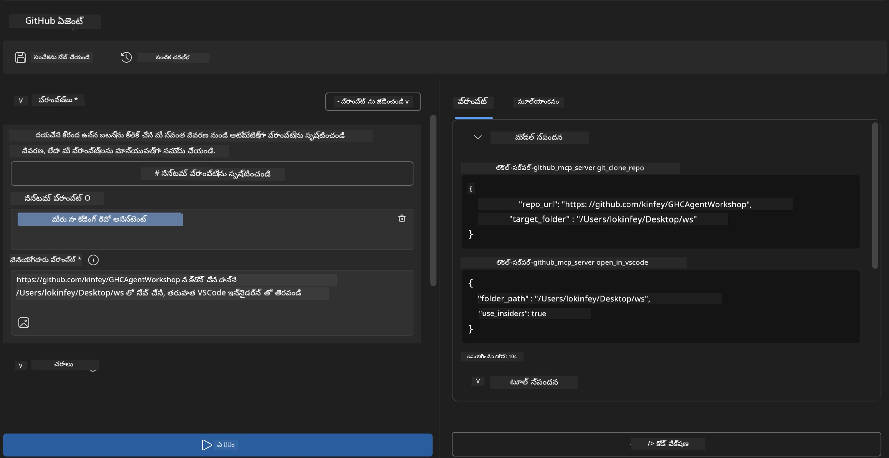
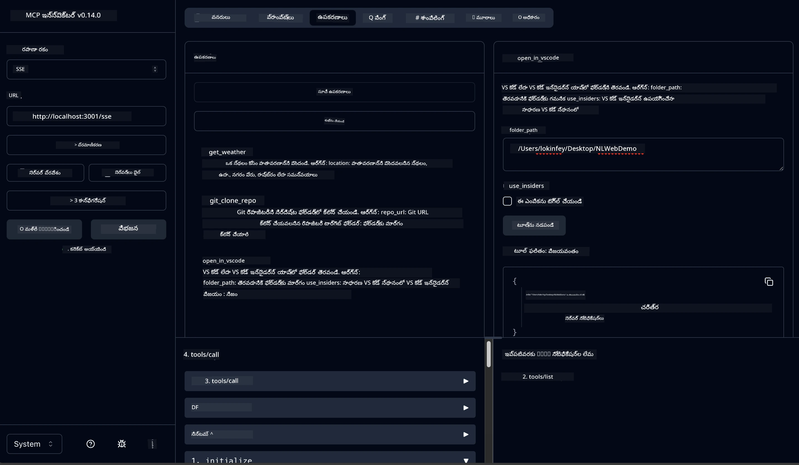

# 🐙 మాడ్యూల్ 4: ప్రాక్టికల్ MCP డెవలప్మెంట్ - కస్టమ్గా GitHub క్లోన్ సర్వర్


> **⚡ వేగవంతమైన ప్రారంభం:** కేవలం 30 నిమిషాల్లో GitHub రిపాజిటరీ క్లోనింగ్ మరియు VS కోడ్ ఇంటిగ్రేషన్ ఆటోమేటెడ్ చేసే ప్రొడక్షన్-రెడి MCP సర్వర్ ను నిర్మించండి!

## 🎯 నేర్చుకోవాల్సిన లక్ష్యాలు

ఈ ప్రయోగం చివరికి, మీరు చేయగలుగుతారు:

- ✅ రియల్-వరల్డ్ డెవలప్మెంట్ వర్క్‌ఫ్లోల కోసం కస్టమ్ MCP సర్వర్ సృష్టించడం
- ✅ MCP ద్వారా GitHub రిపాజిటరీ క్లోనింగ్ ఫంక్షనాలిటీ అమలు చేయడం
- ✅ కస్టమ్ MCP సర్వర్స్‌ను VS కోడ్ మరియు ఏజెంట్ బిల్డర్‌తో సమన్వయం చేయడం
- ✅ GitHub Copilot ఏజెంట్ మోడ్ ని కస్టమ్ MCP టూల్స్ తో ఉపయోగించడం
- ✅ ప్రొడక్షన్ వాతావరణాల్లో కస్టమ్ MCP సర్వర్స్ ను పరీక్షించి డిప్లాయ్ చేయడం

## 📋 ముందస్తు పరిస్థితులు

- లాబ్స్ 1-3 పూర్తి చేయడం (MCP మౌలికాలు మరియు అధునాతన డెవలప్మెంట్)
- GitHub Copilot సబ్‌స్క్రిప్షన్ ([ఉచిత సైన్ అప్ లభ్యం](https://github.com/github-copilot/signup))
- AI టూల్‌కిట్ మరియు GitHub Copilot ఎక్స్‌టెన్షన్లు ఉన్న VS కోడ్
- Git CLI ఇన్‌స్టాల్ చేసి కాన్ఫిగర్ చెయుట

## 🏗️ ప్రాజెక్ట్ అవలోకనం

### **రియల్-వరల్డ్ డెవలప్మెంట్ సవాల్**
డెవలపర్లు తరచుగా GitHub ఉపయోగించి రిపాజిటరీలను క్లోన్ చేసి వాటిని VS కోడ్ లేదా VS కోడ్ ఇన్‌సైడర్స్ లో తెరవడం చేస్తారు. ఈ మాన్యువల్ ప్రక్రియలో:

1. టెర్మినల్/కమాండ్ ప్రాంప్ట్ ఓపెన్ చేయడం
2. కావలసిన డైరెక్టరీకి వెళ్లడం
3. `git clone` కమాండ్ ను రన్ చేయడం
4. క్లోన్ అయిన డైరెక్టరీలో VS కోడ్ ఓపెన్ చేయడం

**మన MCP సొల్యూషన్ ఈ ప్రక్రియను ఒకే ఒక ఇంటెలిజెంట్ కమాండ్‌లోకి సరళీకరించింది!**

### **మీరు ఏమి నిర్మించబోతున్నారు**
**GitHub క్లోన్ MCP సర్వర్** (`git_mcp_server`) ఇది అందిస్తుంది:

| లక్షణం | వివరణ | లాభం |
|---------|-------------|---------|
| 🔄 **స్మార్ట్ రిపాజిటరీ క్లోనింగ్** | GitHub రిపోలను వాలిడేషన్ తో క్లోన్ చేయడం | ఆటోమేటెడ్ ఎర్రర్ చెకింగ్ |
| 📁 **ఇంటెలిజెంట్ డైరెక్టరీ మేనేజ్మెంట్** | డైరెక్టరీల సురక్షిత తనిఖీ మరియు సృష్టి | ఓవర్‌రైటింగ్ నివారణ |
| 🚀 **క్రాస్-ప్లాట్‌ఫారమ్ VS కోడ్ ఇంటిగ్రేషన్** | ప్రాజెక్ట్స్‌ను VS కోడ్/ఇన్‌సైడర్స్ లో ఓపెన్ చేయడం | seamless workflow మార్పు |
| 🛡️ **కఠినమైన ఎర్రర్ హ్యాండ్లింగ్** | నెట్‌వర్క్, అనుమతులు, పాత్ సమస్యలను హ్యాండిల్ చేయడం | ప్రొడక్షన్-సిద్ధ విశ్వసనీయత |

---

## 📖 దశల వారీ అమలు

### దశ 1: ఏజెంట్ బిల్డర్ లో GitHub ఏజెంట్ సృష్టించడం

1. AI టూల్‌కిట్ ఎక్స్‌టెన్షన్ ద్వారా **Agent Builder** ను ప్రారంభించండి
2. క్రింది కాన్ఫిగరేషన్‌తో **కొత్త ఏజెంట్** సృష్టించండి:
   ```
   Agent Name: GitHubAgent
   ```

3. **కస్టమ్ MCP సర్వర్ ప్రారంభించడం:**
   - **Tools** → **Add Tool** → **MCP Server**కి వెళ్లండి
   - **"Create A new MCP Server"** ఎంచుకోండి
   - గరిష్ట సరళీకరణకు **Python template** ఎంచుకోండి
   - **సర్వర్ పేరు:** `git_mcp_server`

### దశ 2: GitHub Copilot ఏజెంట్ మోడ్ సెట్‌చేయడం

1. VS కోడ్ లో **GitHub Copilot** ని ఓపెన్ చేయండి (Ctrl/Cmd + Shift + P → "GitHub Copilot: Open")
2. Copilot ఇంటర్‌ఫేస్ లో **Agent Model** ఎంచుకోండి
3. మెరుగైన విశ్లేషణ సామర్థ్యాల కోసం **Claude 3.7 మోడల్** ఎంచుకోండి
4. టూల్ యాక్సెస్ కొరకు **MCP ఇంటిగ్రేషన్** ఎనేబుల్ చేయండి

> **💡 ప్రొ టిప్:** Claude 3.7 డెవలప్మెంట్ వర్క్‌ఫ్లో మరియు ఎర్రర్ హ్యాండ్లింగ్ ప్యాటర్న్లను గాఢంగా అర్థం చేసుకోవడంలో మెరుగైనదిగా ఉంటుంది.

### దశ 3: కోర్ MCP సర్వర్ ఫంక్షనాలిటీ అమలు

**GitHub Copilot Agent Mode తో క్రింది వివరమైన ప్రాంప్ట్ ఉపయోగించండి:**

```
Create two MCP tools with the following comprehensive requirements:

🔧 TOOL A: clone_repository
Requirements:
- Clone any GitHub repository to a specified local folder
- Return the absolute path of the successfully cloned project
- Implement comprehensive validation:
  ✓ Check if target directory already exists (return error if exists)
  ✓ Validate GitHub URL format (https://github.com/user/repo)
  ✓ Verify git command availability (prompt installation if missing)
  ✓ Handle network connectivity issues
  ✓ Provide clear error messages for all failure scenarios

🚀 TOOL B: open_in_vscode
Requirements:
- Open specified folder in VS Code or VS Code Insiders
- Cross-platform compatibility (Windows/Linux/macOS)
- Use direct application launch (not terminal commands)
- Auto-detect available VS Code installations
- Handle cases where VS Code is not installed
- Provide user-friendly error messages

Additional Requirements:
- Follow MCP 1.9.3 best practices
- Include proper type hints and documentation
- Implement logging for debugging purposes
- Add input validation for all parameters
- Include comprehensive error handling
```

### దశ 4: మీ MCP సర్వర్ ను పరీక్షించండి

#### 4a. Agent Builder లో పరీక్షించండి

1. Agent Builder కోసం డీబగ్ కాన్ఫిగరేషన్ ప్రారంభించండి
2. క్రింది సిస్టమ్ ప్రాంప్ట్ తో మీ ఏజెంట్ను కాన్ఫిగర్ చేయండి:

```
SYSTEM_PROMPT:
You are my intelligent coding repository assistant. You help developers efficiently clone GitHub repositories and set up their development environment. Always provide clear feedback about operations and handle errors gracefully.
```

3. వాస్తవిక వినియోగదారు సన్నివేశాలతో పరీక్షించండి:

```
USER_PROMPT EXAMPLES:

Scenario : Basic Clone and Open
"Clone {Your GitHub Repo link such as https://github.com/kinfey/GHCAgentWorkshop
 } and save to {The global path you specify}, then open it with VS Code Insiders"
```



**అంచనా ఫలితాలు:**
- ✅ మార్గదర్శకాలు నిర్ధారితంగా సక్సెస్‌ఫుల్ క్లోనింగ్
- ✅ ఆటోమాటిక్ VS కోడ్ ప్రారంభం
- ✅ తప్పు ఉన్న సందర్భాల్లో స్పష్టమైన ఎర్రర్ సందేశాలు
- ✅ ఎడ్జ్ కేస్‌ల సరైన నిర్వహణ

#### 4b. MCP ఇన్స్పెక్టర్ లో పరీక్షించండి



---


**🎉 అభినందనలు!** మీరు విజయవంతంగా ప్రాక్టికల్, ప్రొడక్షన్-రెడి MCP సర్వర్‌ను సృష్టించారు, ఇది రియల్ డెవలప్మంట్ వర్క్‌ఫ్లో సమస్యలను పరిష్కరిస్తుంది. మీ కస్టమ్ GitHub క్లోన్ సర్వర్ MCP శక్తిని డెవలపర్ ప్రొడక్టివిటి ఆటోమేషన్ కోసం ఒక స్ఫుటంగా ప్రదర్శిస్తుంది.

### 🏆 సాధన విజయాలు:
- ✅ **MCP డెవలపర్** - కస్టమ్ MCP సర్వర్ సృష్టించి
- ✅ **వర్క్‌ఫ్లో ఆటోమేటర్** - డెవలప్మెంట్ ప్రక్రియలను సరళీకృతం చేశారు
- ✅ **ఇంటిగ్రేషన్ నిపుణుడు** - పలు డెవలప్మెంట్ టూల్స్ కనెక్ట్ చేశారు
- ✅ **ప్రొడక్షన్ సిద్ధం** - డిప్లాయిపయ్యగల పరిష్కారాలు నిర్మించారు

---

## 🎓 వర్క్‌షాప్ పూర్తి: Model Context Protocol తో మీ ప్రయాణం

**ప్రియమైన వర్క్‌షాప్ పాల్గొనేవారు,**

Model Context Protocol వర్క్‌షాప్ నాలుగు మాడ్యూల్స్ అన్నీ పూర్తిచేసినందుకు అభినందనలు! మీరు AI టూల్‌కిట్ మౌలిక భావనలనుంచి ప్రొడక్షన్-రెడి MCP సర్వర్స్ నిర్మించుకునే దాకా ప్రగతిపధంలో ఉన్నారు, ఇవి నిజ జీవిత డెవలప్మెంట్ సవాళ్లను పరిష్కరిస్తాయి.

### 🚀 మీ నేర్చుకున్న మార్గం సారాంశం:

**[మాడ్యూల్ 1](../lab1/README.md):** మీరు AI టూల్‌కిట్ మౌలికాల్లో కనుగొన్నారు, మోడల్ పరీక్షలు, మీ మొదటి AI ఏజెంట్ సృష్టించి.

**[మాడ్యూల్ 2](../lab2/README.md):** MCP ఆర్కిటెక్చర్ నేర్చుకున్నారు, Playwright MCPని ఇంటిగ్రేట్ చేసి, బ్రౌజర్ ఆటోమేషన్ ఏజెంట్ నిర్మించారు.

**[మాడ్యూల్ 3](../lab3/README.md):** వాతావరణ MCP సర్వర్ డెవలప్మెంట్ పై ప్రగతి సాధించి, డీబగింగ్ టూల్స్ పై పట్టు సాధించారు.

**[మాడ్యూల్ 4](../lab4/README.md):** ఇప్పుడు మీరు ప్రాక్టికల్ GitHub రిపాజిటరీ వర్క్‌ఫ్లో ఆటోమేషన్ టూల్ సృష్టించారు.

### 🌟 మీరు మాస్టర్ చేసుకున్నవి:

- ✅ **AI టూల్‌కిట్ ఎకోసిస్టమ్**: మోడల్స్, ఏజెంట్స్, ఇంటిగ్రేషన్ నమూనాలు
- ✅ **MCP ఆర్కిటెక్చర్**: క్లయింట్-సర్వర్ నిర్మాణం, ట్రాన్స్‌పోర్ట్ ప్రోటోకాళ్లు, సెక్యూరిటీ
- ✅ **డెవలపర్ టూల్స్**: ప్లేజ్రౌండ్ నుండి ఇన్స్పెక్టర్ వరకు, ప్రొడక్షన్ డిప్లాయ్మెంట్ వరకు
- ✅ **కస్టమ్ డెవలప్మెంట్**: MCP సర్వర్స్ నిర్మించడం, పరీక్షించడం, డిప్లాయ్ చేయడం
- ✅ **ప్రాక్టికల్ అప్లికేషన్స్**: AI తో నిజ జీవిత వర్క్‌ఫ్లో సవాళ్లను పరిష్కరించడం

### 🔮 మీ తదుపరి దశలు:

1. **మీ స్వంత MCP సర్వర్‌ని నిర్మించండి**: మీ ప్రత్యేక వర్క్‌ఫ్లోలను ఆటోమేటెడ్ చేయడానికి ఈ నైపుణ్యాలను వినియోగించండి
2. **MCP కమ్యూనిటీ లో చేరండి**: మీ సృష్టులను పంచుకోండి మరియు ఇతరులివరకు నేర్చుకోండి
3. **అధునాతన ఇంటిగ్రేషన్ పరిశీలించండి**: MCP సర్వర్స్ ని ఎంటర్‌ప్రైజ్ సిస్టమ్స్‌తో కనెక్ట్ చేయండి
4. **ఓపెన్ సోర్స్ కు సహాయం చెయ్యండి**: MCP టూలింగ్ మరియు డాక్యుమెంటేషన్లు మెరుగుపర్చడంలో సహాయం చేయండి

గమనించండి, ఈ వర్క్‌షాప్ కేవలం ప్రారంభమే. Model Context Protocol ఎకోసిస్టం వేగంగా అభివృద్ధి చెందుతోంది, మీరు ఇప్పుడు AI-పవర్డ్ డెవలప్మెంట్ టూల్స్ ముందు వరుసలో ఉండటానికి సిద్దంగా ఉన్నారు.

**మీ పాల్గొనడం మరియు నేర్చుకునే ధైర్యానికి ధన్యవాదాలు!**

ఈ వర్క్‌షాప్ మీ డెవలప్మెంట్ ప్రయాణంలో AI టూల్స్ తో ఎలా పని చేయాలో మార్పులు తేవడానికి కొత్త ఆలోచనలు ప్రేరేపించింది అని ఆశిస్తున్నాము.

**సంతోషంగా కోడింగ్ చేయండి!**

---

## తదుపరి ఏమి చేయాలి

మాడ్యూల్ 10 లోని అన్ని లాబ్స్ పూర్తి చేసినందుకు అభినందనలు!

- వెళ్ళండి: [మాడ్యూల్ 10 అవలోకనం](../README.md)
- కొనసాగించండి: [మాడ్యూల్ 11: MCP సర్వర్ హ్యాండ్స్-ఆన్ లాబ్స్](../../11-MCPServerHandsOnLabs/README.md)

---

<!-- CO-OP TRANSLATOR DISCLAIMER START -->
**అపుడవరం**:
ఈ దస్తావేజును AI అనువాద సేవ అయిన [Co-op Translator](https://github.com/Azure/co-op-translator) ఉపయోగించి అనువదించినది. మేము ఖచ్చితత్వానికి ప్రయత్నిస్తున్నప్పటికీ, ఆటోమేటెడ్ అనువాదాల్లో తప్పులు లేదా అకారణతలు ఉండవచ్చు. అసలు దస్తావేజు native భాషలో అనుకోవడం అత్యంత ప్రామాణిక మూలం. ముఖ్యమైన సమాచారానికి, వృత్తిపరమైన మానవ అనువాదం సిఫారసు చేయబడుతుంది. ఈ అనువాదం ఉపయోగంతో సంభవించే ఏవైనా తప్పుగా అర్థం చేసుకోవడం లేదా తప్పుడు అర్ధంకల్పనకు మేము బాధ్యత వేయము.
<!-- CO-OP TRANSLATOR DISCLAIMER END -->