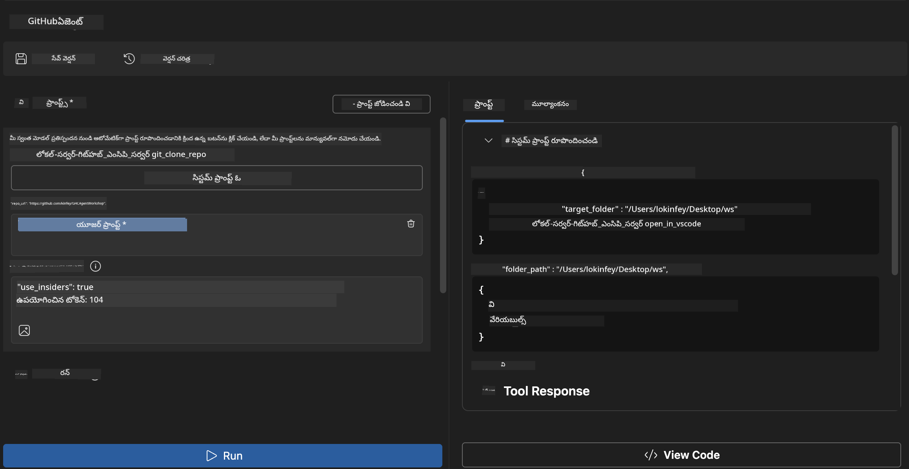
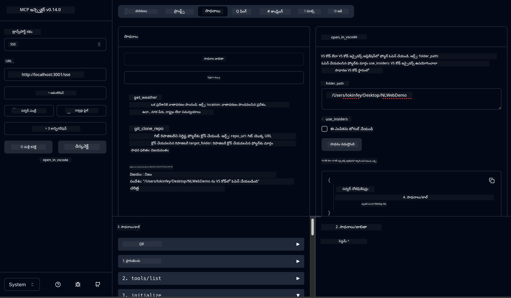

<!--
CO_OP_TRANSLATOR_METADATA:
{
  "original_hash": "f83bc722dc758efffd68667d6a1db470",
  "translation_date": "2025-12-11T16:51:45+00:00",
  "source_file": "10-StreamliningAIWorkflowsBuildingAnMCPServerWithAIToolkit/lab4/README.md",
  "language_code": "te"
}
-->
# 🐙 మాడ్యూల్ 4: ప్రాక్టికల్ MCP అభివృద్ధి - కస్టమ్ GitHub క్లోన్ సర్వర్


> **⚡ త్వరిత ప్రారంభం:** కేవలం 30 నిమిషాల్లో GitHub రిపాజిటరీ క్లోనింగ్ మరియు VS Code ఇంటిగ్రేషన్‌ను ఆటోమేటు చేసే ప్రొడక్షన్-రెడీ MCP సర్వర్‌ను నిర్మించండి!

## 🎯 నేర్చుకునే లక్ష్యాలు

ఈ ప్రయోగం ముగింపు వరకు, మీరు చేయగలుగుతారు:

- ✅ వాస్తవ ప్రపంచ అభివృద్ధి వర్క్‌ఫ్లోల కోసం కస్టమ్ MCP సర్వర్ సృష్టించడం
- ✅ MCP ద్వారా GitHub రిపాజిటరీ క్లోనింగ్ ఫంక్షనాలిటీ అమలు చేయడం
- ✅ కస్టమ్ MCP సర్వర్లను VS Code మరియు Agent Builder తో ఇంటిగ్రేట్ చేయడం
- ✅ GitHub Copilot Agent Mode ను కస్టమ్ MCP టూల్స్ తో ఉపయోగించడం
- ✅ ప్రొడక్షన్ వాతావరణాల్లో కస్టమ్ MCP సర్వర్లను పరీక్షించి డిప్లాయ్ చేయడం

## 📋 ముందస్తు అవసరాలు

- ల్యాబ్ 1-3 (MCP ప్రాథమికాలు మరియు అభివృద్ధి) పూర్తి చేయడం
- GitHub Copilot సబ్‌స్క్రిప్షన్ ([ఉచిత సైన్ అప్ అందుబాటులో ఉంది](https://github.com/github-copilot/signup))
- AI Toolkit మరియు GitHub Copilot ఎక్స్‌టెన్షన్లతో VS Code
- Git CLI ఇన్‌స్టాల్ చేసి కాన్ఫిగర్ చేయడం

## 🏗️ ప్రాజెక్ట్ అవలోకనం

### **వాస్తవ ప్రపంచ అభివృద్ధి సవాలు**
డెవలపర్లు తరచుగా GitHub నుండి రిపాజిటరీలను క్లోన్ చేసి వాటిని VS Code లేదా VS Code Insiders లో తెరవడం చేస్తారు. ఈ మాన్యువల్ ప్రక్రియలో:
1. టెర్మినల్/కమాండ్ ప్రాంప్ట్ తెరవడం
2. కావలసిన డైరెక్టరీకి వెళ్లడం
3. `git clone` కమాండ్ నడపడం
4. క్లోన్ చేసిన డైరెక్టరీలో VS Code తెరవడం

**మా MCP పరిష్కారం ఈ ప్రక్రియను ఒకే ఒక తెలివైన కమాండ్‌గా మార్చుతుంది!**

### **మీరు నిర్మించబోయేది**
**GitHub క్లోన్ MCP సర్వర్** (`git_mcp_server`) ఇది అందిస్తుంది:

| ఫీచర్ | వివరణ | లాభం |
|---------|-------------|---------|
| 🔄 **స్మార్ట్ రిపాజిటరీ క్లోనింగ్** | GitHub రిపోలను ధృవీకరణతో క్లోన్ చేయడం | ఆటోమేటెడ్ లోపాల తనిఖీ |
| 📁 **తెలివైన డైరెక్టరీ నిర్వహణ** | డైరెక్టరీలను సురక్షితంగా తనిఖీ చేసి సృష్టించడం | ఓవర్‌రైటింగ్ నివారణ |
| 🚀 **క్రాస్-ప్లాట్‌ఫారమ్ VS Code ఇంటిగ్రేషన్** | ప్రాజెక్టులను VS Code/Insiders లో తెరవడం | సజావుగా వర్క్‌ఫ్లో మార్పిడి |
| 🛡️ **బలమైన లోపాల నిర్వహణ** | నెట్‌వర్క్, అనుమతులు, మార్గ సమస్యలను నిర్వహించడం | ప్రొడక్షన్-రెడీ నమ్మకదారితనం |

---

## 📖 దశల వారీ అమలు

### దశ 1: Agent Builder లో GitHub ఏజెంట్ సృష్టించండి

1. AI Toolkit ఎక్స్‌టెన్షన్ ద్వారా **Agent Builder** ప్రారంభించండి
2. క్రింది కాన్ఫిగరేషన్‌తో **కొత్త ఏజెంట్ సృష్టించండి:**
   ```
   Agent Name: GitHubAgent
   ```

3. **కస్టమ్ MCP సర్వర్ ప్రారంభించండి:**
   - **Tools** → **Add Tool** → **MCP Server** కి వెళ్లండి
   - **"Create A new MCP Server"** ఎంచుకోండి
   - గరిష్ట సౌలభ్యం కోసం **Python టెంప్లేట్** ఎంచుకోండి
   - **సర్వర్ పేరు:** `git_mcp_server`

### దశ 2: GitHub Copilot Agent Mode ను కాన్ఫిగర్ చేయండి

1. VS Code లో GitHub Copilot తెరవండి (Ctrl/Cmd + Shift + P → "GitHub Copilot: Open")
2. Copilot ఇంటర్‌ఫేస్‌లో Agent Model ఎంచుకోండి
3. మెరుగైన తర్క సామర్థ్యాల కోసం **Claude 3.7 మోడల్** ఎంచుకోండి
4. టూల్ యాక్సెస్ కోసం MCP ఇంటిగ్రేషన్ ఎనేబుల్ చేయండి

> **💡 ప్రో టిప్:** Claude 3.7 అభివృద్ధి వర్క్‌ఫ్లోలు మరియు లోపాల నిర్వహణ నమూనాలపై మెరుగైన అవగాహన ఇస్తుంది.

### దశ 3: కోర్ MCP సర్వర్ ఫంక్షనాలిటీ అమలు చేయండి

**GitHub Copilot Agent Mode తో క్రింది వివరమైన ప్రాంప్ట్ ఉపయోగించండి:**

```
Create two MCP tools with the following comprehensive requirements:

🔧 TOOL A: clone_repository
Requirements:
- Clone any GitHub repository to a specified local folder
- Return the absolute path of the successfully cloned project
- Implement comprehensive validation:
  ✓ Check if target directory already exists (return error if exists)
  ✓ Validate GitHub URL format (https://github.com/user/repo)
  ✓ Verify git command availability (prompt installation if missing)
  ✓ Handle network connectivity issues
  ✓ Provide clear error messages for all failure scenarios

🚀 TOOL B: open_in_vscode
Requirements:
- Open specified folder in VS Code or VS Code Insiders
- Cross-platform compatibility (Windows/Linux/macOS)
- Use direct application launch (not terminal commands)
- Auto-detect available VS Code installations
- Handle cases where VS Code is not installed
- Provide user-friendly error messages

Additional Requirements:
- Follow MCP 1.9.3 best practices
- Include proper type hints and documentation
- Implement logging for debugging purposes
- Add input validation for all parameters
- Include comprehensive error handling
```

### దశ 4: మీ MCP సర్వర్‌ను పరీక్షించండి

#### 4a. Agent Builder లో పరీక్షించండి

1. Agent Builder కోసం డీబగ్ కాన్ఫిగరేషన్ ప్రారంభించండి
2. ఈ సిస్టమ్ ప్రాంప్ట్‌తో మీ ఏజెంట్‌ను కాన్ఫిగర్ చేయండి:

```
SYSTEM_PROMPT:
You are my intelligent coding repository assistant. You help developers efficiently clone GitHub repositories and set up their development environment. Always provide clear feedback about operations and handle errors gracefully.
```

3. వాస్తవిక వినియోగదారు పరిస్థితులతో పరీక్షించండి:

```
USER_PROMPT EXAMPLES:

Scenario : Basic Clone and Open
"Clone {Your GitHub Repo link such as https://github.com/kinfey/GHCAgentWorkshop
 } and save to {The global path you specify}, then open it with VS Code Insiders"
```



**అంచనా ఫలితాలు:**
- ✅ మార్గ ధృవీకరణతో విజయవంతమైన క్లోనింగ్
- ✅ ఆటోమేటిక్ VS Code ప్రారంభం
- ✅ చెల్లని పరిస్థితుల కోసం స్పష్టమైన లోప సందేశాలు
- ✅ ఎడ్జ్ కేసుల సరైన నిర్వహణ

#### 4b. MCP ఇన్స్పెక్టర్‌లో పరీక్షించండి




---


**🎉 అభినందనలు!** మీరు వాస్తవ అభివృద్ధి వర్క్‌ఫ్లో సవాళ్లను పరిష్కరించే ప్రాక్టికల్, ప్రొడక్షన్-రెడీ MCP సర్వర్‌ను విజయవంతంగా సృష్టించారు. మీ కస్టమ్ GitHub క్లోన్ సర్వర్ MCP శక్తిని ఉపయోగించి డెవలపర్ ఉత్పాదకతను ఆటోమేటు చేసి మెరుగుపరుస్తుంది.

### 🏆 సాధన సాధించబడింది:
- ✅ **MCP డెవలపర్** - కస్టమ్ MCP సర్వర్ సృష్టించారు
- ✅ **వర్క్‌ఫ్లో ఆటోమేటర్** - అభివృద్ధి ప్రక్రియలను సులభతరం చేశారు  
- ✅ **ఇంటిగ్రేషన్ నిపుణుడు** - అనేక అభివృద్ధి టూల్స్‌ను కనెక్ట్ చేశారు
- ✅ **ప్రొడక్షన్ రెడీ** - డిప్లాయ్ చేయదగిన పరిష్కారాలు నిర్మించారు

---

## 🎓 వర్క్‌షాప్ పూర్తి: Model Context Protocol తో మీ ప్రయాణం

**ప్రియమైన వర్క్‌షాప్ పాల్గొనేవారు,**

Model Context Protocol వర్క్‌షాప్ యొక్క అన్ని నాలుగు మాడ్యూల్స్ పూర్తి చేసినందుకు అభినందనలు! మీరు ప్రాథమిక AI Toolkit కాన్సెప్ట్‌లను అర్థం చేసుకోవడం నుండి వాస్తవ ప్రపంచ అభివృద్ధి సవాళ్లను పరిష్కరించే ప్రొడక్షన్-రెడీ MCP సర్వర్లను నిర్మించడం వరకు చాలా దూరం వచ్చారు.

### 🚀 మీ నేర్చుకునే మార్గం సారాంశం:

**[Module 1](../lab1/README.md)**: మీరు AI Toolkit ప్రాథమికాలు, మోడల్ పరీక్ష, మరియు మీ మొదటి AI ఏజెంట్ సృష్టించడం ప్రారంభించారు.

**[Module 2](../lab2/README.md)**: MCP ఆర్కిటెక్చర్ నేర్చుకున్నారు, Playwright MCP ఇంటిగ్రేట్ చేసి, మొదటి బ్రౌజర్ ఆటోమేషన్ ఏజెంట్ నిర్మించారు.

**[Module 3](../lab3/README.md)**: వాతావరణ MCP సర్వర్ అభివృద్ధి మరియు డీబగ్గింగ్ టూల్స్ లో నైపుణ్యం సాధించారు.

**[Module 4](../lab4/README.md)**: ఇప్పుడు మీరు వాస్తవ GitHub రిపాజిటరీ వర్క్‌ఫ్లో ఆటోమేషన్ టూల్ సృష్టించారు.

### 🌟 మీరు నేర్చుకున్నవి:

- ✅ **AI Toolkit ఎకోసిస్టమ్**: మోడల్స్, ఏజెంట్లు, ఇంటిగ్రేషన్ నమూనాలు
- ✅ **MCP ఆర్కిటెక్చర్**: క్లయింట్-సర్వర్ డిజైన్, ట్రాన్స్‌పోర్ట్ ప్రోటోకాల్స్, భద్రత
- ✅ **డెవలపర్ టూల్స్**: ప్లేగ్రౌండ్ నుండి ఇన్స్పెక్టర్ వరకు ప్రొడక్షన్ డిప్లాయ్‌మెంట్
- ✅ **కస్టమ్ అభివృద్ధి**: మీ స్వంత MCP సర్వర్లను నిర్మించడం, పరీక్షించడం, డిప్లాయ్ చేయడం
- ✅ **ప్రాక్టికల్ అప్లికేషన్స్**: AI తో వాస్తవ వర్క్‌ఫ్లో సవాళ్లను పరిష్కరించడం

### 🔮 మీ తదుపరి దశలు:

1. **మీ స్వంత MCP సర్వర్ నిర్మించండి**: ఈ నైపుణ్యాలను ఉపయోగించి మీ ప్రత్యేక వర్క్‌ఫ్లోలను ఆటోమేటు చేయండి
2. **MCP కమ్యూనిటీ లో చేరండి**: మీ సృష్టులను పంచుకోండి మరియు ఇతరుల నుండి నేర్చుకోండి
3. **అధునాతన ఇంటిగ్రేషన్ అన్వేషించండి**: MCP సర్వర్లను ఎంటర్ప్రైజ్ సిస్టమ్స్‌కు కనెక్ట్ చేయండి
4. **ఓపెన్ సోర్స్‌కు సహాయం చేయండి**: MCP టూలింగ్ మరియు డాక్యుమెంటేషన్ మెరుగుపరచడంలో సహాయం చేయండి

గమనించండి, ఈ వర్క్‌షాప్ కేవలం ప్రారంభం మాత్రమే. Model Context Protocol ఎకోసిస్టమ్ వేగంగా అభివృద్ధి చెందుతోంది, మరియు మీరు ఇప్పుడు AI ఆధారిత అభివృద్ధి టూల్స్ ముందు వరుసలో ఉండటానికి సిద్ధంగా ఉన్నారు.

**మీ పాల్గొనడం మరియు నేర్చుకోవడంలో చూపిన పట్టుదలకి ధన్యవాదాలు!**

ఈ వర్క్‌షాప్ మీ అభివృద్ధి ప్రయాణంలో AI టూల్స్‌తో ఎలా నిర్మించాలో మరియు పరస్పరం ఎలా చేయాలో మార్పులు తీసుకురావడానికి ఆలోచనలను ప్రేరేపించిందని ఆశిస్తున్నాము.

**సంతోషంగా కోడింగ్ చేయండి!**

---

---

<!-- CO-OP TRANSLATOR DISCLAIMER START -->
**అస్పష్టత**:  
ఈ పత్రాన్ని AI అనువాద సేవ [Co-op Translator](https://github.com/Azure/co-op-translator) ఉపయోగించి అనువదించబడింది. మేము ఖచ్చితత్వానికి ప్రయత్నించినప్పటికీ, ఆటోమేటెడ్ అనువాదాల్లో పొరపాట్లు లేదా తప్పిదాలు ఉండవచ్చు. మూల పత్రం దాని స్వదేశీ భాషలో అధికారిక మూలంగా పరిగణించాలి. ముఖ్యమైన సమాచారానికి, ప్రొఫెషనల్ మానవ అనువాదం సిఫార్సు చేయబడుతుంది. ఈ అనువాదం వాడకంలో ఏర్పడిన ఏవైనా అపార్థాలు లేదా తప్పుదారితీసే అర్థాలు కోసం మేము బాధ్యత వహించము.
<!-- CO-OP TRANSLATOR DISCLAIMER END -->