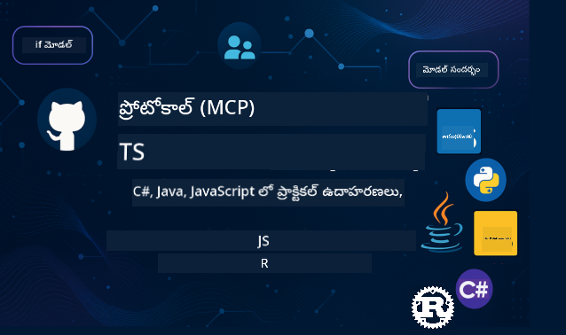

<!--
CO_OP_TRANSLATOR_METADATA:
{
  "original_hash": "db1c632975cfde89e42f01af57f7e4a8",
  "translation_date": "2025-12-11T09:04:42+00:00",
  "source_file": "README.md",
  "language_code": "te"
}
-->
 

ఈ వనరులను ఉపయోగించడం ప్రారంభించడానికి ఈ దశలను అనుసరించండి:
1. **రిపాజిటరీని ఫోర్క్ చేయండి**: క్లిక్ చేయండి 
2. **రిపాజిటరీని క్లోన్ చేయండి**:   `git clone https://github.com/microsoft/mcp-for-beginners.git`
3. **సందర్శించండి** 

### 🌐 బహుభాషా మద్దతు

#### GitHub యాక్షన్ ద్వారా మద్దతు (స్వయంచాలక & ఎప్పుడూ తాజా)

<!-- CO-OP TRANSLATOR LANGUAGES TABLE START -->
[Arabic](../ar/README.md) | [Bengali](../bn/README.md) | [Bulgarian](../bg/README.md) | [Burmese (Myanmar)](../my/README.md) | [Chinese (Simplified)](../zh/README.md) | [Chinese (Traditional, Hong Kong)](../hk/README.md) | [Chinese (Traditional, Macau)](../mo/README.md) | [Chinese (Traditional, Taiwan)](../tw/README.md) | [Croatian](../hr/README.md) | [Czech](../cs/README.md) | [Danish](../da/README.md) | [Dutch](../nl/README.md) | [Estonian](../et/README.md) | [Finnish](../fi/README.md) | [French](../fr/README.md) | [German](../de/README.md) | [Greek](../el/README.md) | [Hebrew](../he/README.md) | [Hindi](../hi/README.md) | [Hungarian](../hu/README.md) | [Indonesian](../id/README.md) | [Italian](../it/README.md) | [Japanese](../ja/README.md) | [Korean](../ko/README.md) | [Lithuanian](../lt/README.md) | [Malay](../ms/README.md) | [Marathi](../mr/README.md) | [Nepali](../ne/README.md) | [Norwegian](../no/README.md) | [Persian (Farsi)](../fa/README.md) | [Polish](../pl/README.md) | [Portuguese (Brazil)](../br/README.md) | [Portuguese (Portugal)](../pt/README.md) | [Punjabi (Gurmukhi)](../pa/README.md) | [Romanian](../ro/README.md) | [Russian](../ru/README.md) | [Serbian (Cyrillic)](../sr/README.md) | [Slovak](../sk/README.md) | [Slovenian](../sl/README.md) | [Spanish](../es/README.md) | [Swahili](../sw/README.md) | [Swedish](../sv/README.md) | [Tagalog (Filipino)](../tl/README.md) | [Tamil](../ta/README.md) | [Thai](../th/README.md) | [Turkish](../tr/README.md) | [Ukrainian](../uk/README.md) | [Urdu](../ur/README.md) | [Vietnamese](../vi/README.md)
<!-- CO-OP TRANSLATOR LANGUAGES TABLE END -->

# 🚀 మోడల్ కాంటెక్స్ట్ ప్రోటోకాల్ (MCP) ప్రారంభికుల కోసం పాఠ్యక్రమం

## **C#, Java, JavaScript, Rust, Python, మరియు TypeScript లో హ్యాండ్స్-ఆన్ కోడ్ ఉదాహరణలతో MCP నేర్చుకోండి**

## 🧠 మోడల్ కాంటెక్స్ట్ ప్రోటోకాల్ పాఠ్యక్రమం అవలోకనం
మోడల్ కాంటెక్స్ట్ ప్రోటోకాల్ లో మీ ప్రయాణానికి స్వాగతం! మీరు ఎప్పుడైనా AI అనువర్తనాలు వివిధ టూల్స్ మరియు సేవలతో ఎలా కమ్యూనికేట్ చేస్తాయో తెలుసుకోవాలనుకుంటే, మీరు ఇప్పుడు డెవలపర్లు తెలివైన సిస్టమ్స్ ఎలా నిర్మిస్తున్నారో మార్చేస్తున్న అందమైన పరిష్కారాన్ని కనుగొనబోతున్నారు.

MCP ని AI అనువర్తనాల కోసం యూనివర్సల్ ట్రాన్స్‌లేటర్ గా భావించండి - USB పోర్టులు మీ కంప్యూటర్ కు ఏ డివైస్ అయినా కనెక్ట్ చేయడానికి అనుమతిస్తాయిలా, MCP AI మోడల్స్ ని ఏ టూల్ లేదా సేవతో అయినా ఒక ప్రమాణీకృత విధానంలో కనెక్ట్ చేయడానికి అనుమతిస్తుంది. మీరు మీ మొదటి చాట్‌బాట్ ని నిర్మిస్తున్నారా లేదా సంక్లిష్ట AI వర్క్‌ఫ్లోలపై పని చేస్తున్నారా, MCP ని అర్థం చేసుకోవడం మీకు మరింత సామర్థ్యవంతమైన మరియు అనువైన అనువర్తనాలను సృష్టించడానికి శక్తిని ఇస్తుంది.

ఈ పాఠ్యక్రమం మీ నేర్చుకునే ప్రయాణానికి సహనం మరియు జాగ్రత్తతో రూపొందించబడింది. మీరు ఇప్పటికే అర్థం చేసుకున్న సులభమైన భావనలతో ప్రారంభించి, మీ ఇష్టమైన ప్రోగ్రామింగ్ భాషలో హ్యాండ్స్-ఆన్ ప్రాక్టీస్ ద్వారా మీ నైపుణ్యాలను క్రమంగా పెంచుకుంటారు. ప్రతి దశలో స్పష్టమైన వివరణలు, ప్రాక్టికల్ ఉదాహరణలు మరియు ప్రోత్సాహకరమైన మాటలు ఉంటాయి.

ఈ ప్రయాణం పూర్తయినప్పుడు, మీరు మీ స్వంత MCP సర్వర్లను నిర్మించడానికి, వాటిని ప్రముఖ AI ప్లాట్‌ఫారమ్‌లతో సమగ్రపరచడానికి, మరియు ఈ సాంకేతికత AI అభివృద్ధి భవిష్యత్తును ఎలా మార్చేస్తుందో అర్థం చేసుకోవడానికి ధైర్యం కలుగుతుంది. ఈ రోమాంచక ప్రయాణాన్ని కలిసి ప్రారంభిద్దాం!

### అధికారిక డాక్యుమెంటేషన్ మరియు స్పెసిఫికేషన్లు

మీ అర్థం పెరిగే కొద్దీ ఈ వనరులు మరింత విలువైనవి అవుతాయి, కానీ మీరు వెంటనే అన్నీ చదవాలని ఒత్తిడి పడకండి. మీకు ఎక్కువగా ఆసక్తి ఉన్న ప్రాంతాల నుండి ప్రారంభించండి!
- 📘 [MCP డాక్యుమెంటేషన్](https://modelcontextprotocol.io/) – ఇది మీకు దశల వారీ ట్యుటోరియల్స్ మరియు యూజర్ గైడ్‌ల కోసం ప్రధాన వనరు. డాక్యుమెంటేషన్ ప్రారంభికుల కోసం రాయబడింది, మీరు మీ స్వంత వేగంతో అనుసరించగల స్పష్టమైన ఉదాహరణలతో.
- 📜 [MCP స్పెసిఫికేషన్](https://modelcontextprotocol.io/docs/) – దీన్ని మీ సమగ్ర సూచిక మాన్యువల్ గా భావించండి. మీరు పాఠ్యక్రమం ద్వారా పని చేస్తూ, మీరు ప్రత్యేక వివరాలను చూడటానికి మరియు అధునాతన ఫీచర్లను అన్వేషించటానికి ఇక్కడికి తిరిగి వస్తారు.
- 📜 [మూల MCP స్పెసిఫికేషన్](https://spec.modelcontextprotocol.io/) – ఇది అధునాతన అమలులకు సహాయకమైన అదనపు సాంకేతిక వివరాలను కలిగి ఉంటుంది. మీరు అవసరం ఉన్నప్పుడు ఇది ఉంటుంది, కానీ మీరు ప్రారంభిస్తున్నప్పుడు దీని గురించి ఆందోళన చెందవద్దు.
- 🧑‍💻 [MCP GitHub రిపాజిటరీ](https://github.com/modelcontextprotocol) – ఇక్కడ మీరు SDKలు, టూల్స్, మరియు బహుభాషా ప్రోగ్రామింగ్ కోడ్ నమూనాలను కనుగొంటారు. ఇది ప్రాక్టికల్ ఉదాహరణల మరియు ఉపయోగించడానికి సిద్ధమైన భాగాల ఖజానా లాంటిది.
- 🌐 [MCP కమ్యూనిటీ](https://github.com/orgs/modelcontextprotocol/discussions) – MCP గురించి చర్చలలో ఇతర అభ్యాసకులు మరియు అనుభవజ్ఞులైన డెవలపర్లతో చేరండి. ఇది ప్రశ్నలు స్వాగతించబడే మరియు జ్ఞానం స్వేచ్ఛగా పంచుకునే మద్దతు సమాజం.

## నేర్చుకునే లక్ష్యాలు

ఈ పాఠ్యక్రమం చివరికి, మీరు మీ కొత్త నైపుణ్యాలపై ధైర్యంగా మరియు ఉత్సాహంగా ఉంటారు. మీరు సాధించబోయే విషయాలు ఇవి:

• **MCP ప్రాథమికాలను అర్థం చేసుకోండి**: మోడల్ కాంటెక్స్ట్ ప్రోటోకాల్ అంటే ఏమిటి మరియు ఇది AI అనువర్తనాలు ఎలా కలిసి పనిచేస్తున్నాయో విప్లవాత్మకంగా మార్చేస్తుందో మీరు అర్థం చేసుకుంటారు, సరైన ఉదాహరణలు మరియు అనాలజీలతో.

• **మీ మొదటి MCP సర్వర్ నిర్మించండి**: మీరు మీ ఇష్టమైన ప్రోగ్రామింగ్ భాషలో పనిచేసే MCP సర్వర్ ని సృష్టిస్తారు, సులభమైన ఉదాహరణలతో ప్రారంభించి దశల వారీగా మీ నైపుణ్యాలను పెంచుకుంటారు.

• **AI మోడల్స్ ని నిజమైన టూల్స్ తో కనెక్ట్ చేయండి**: AI మోడల్స్ మరియు వాస్తవ సేవల మధ్య గ్యాప్ ని ఎలా భర్తీ చేయాలో నేర్చుకుంటారు, మీ అనువర్తనాలకు శక్తివంతమైన కొత్త సామర్థ్యాలను ఇస్తారు.

• **భద్రత ఉత్తమ పద్ధతులను అమలు చేయండి**: మీ MCP అమలులను సురక్షితంగా ఉంచడం ఎలా అనేది అర్థం చేసుకుంటారు, మీ అనువర్తనాలు మరియు వినియోగదారులను రక్షిస్తారు.

• **ధైర్యంగా డిప్లాయ్ చేయండి**: అభివృద్ధి నుండి ఉత్పత్తి దశకు మీ MCP ప్రాజెక్టులను ఎలా తీసుకెళ్లాలో తెలుసుకుంటారు, వాస్తవ ప్రపంచంలో పనిచేసే ప్రాక్టికల్ డిప్లాయ్‌మెంట్ వ్యూహాలతో.

• **MCP కమ్యూనిటీ లో చేరండి**: AI అనువర్తన అభివృద్ధి భవిష్యత్తును ఆకారమిచ్చే అభివృద్ధి దారుల పెరుగుతున్న సమాజంలో భాగమవుతారు.

## అవసరమైన నేపథ్యం

MCP ప్రత్యేకాంశాలలోకి దిగేముందు, కొన్ని ప్రాథమిక భావనలతో మీరు సౌకర్యంగా ఉన్నారని నిర్ధారిద్దాం. మీరు ఈ ప్రాంతాలలో నిపుణులు కాకపోయినా ఆందోళన చెందవద్దు - మేము మీరు తెలుసుకోవలసిన ప్రతిదీ వివరించబోతున్నాము!

### ప్రోటోకాల్‌లు అర్థం చేసుకోవడం (ఆధారం)

ప్రోటోకాల్ అనేది సంభాషణకు నియమాల్లా భావించండి. మీరు ఒక స్నేహితుడిని కాల్ చేసినప్పుడు, మీరు ఇద్దరూ "హలో" అని పలకడం, మాట మార్చుకోవడం, మరియు ముగిసినప్పుడు "గుడ్‌బై" అని చెప్పడం తెలుసుకుంటారు. కంప్యూటర్ ప్రోగ్రాములు సమర్థవంతంగా కమ్యూనికేట్ కావడానికి ఇలాంటి నియమాలు అవసరం.

MCP ఒక ప్రోటోకాల్ - AI మోడల్స్ మరియు అనువర్తనాలు టూల్స్ మరియు సేవలతో ఉత్పాదక "సంభాషణలు" జరపడానికి సహాయపడే ఒప్పుకున్న నియమాల సమాహారం. మానవ సంభాషణను సులభతరం చేసే సంభాషణ నియమాల్లా, MCP AI అనువర్తన కమ్యూనికేషన్ ను మరింత నమ్మదగినది మరియు శక్తివంతమైనది చేస్తుంది.

### క్లయింట్-సర్వర్ సంబంధాలు (ప్రోగ్రాములు కలిసి ఎలా పనిచేస్తాయో)

మీరు ప్రతిరోజూ క్లయింట్-సర్వర్ సంబంధాలను ఉపయోగిస్తున్నారు! మీరు వెబ్ బ్రౌజర్ (క్లయింట్) ఉపయోగించి వెబ్‌సైట్ సందర్శించినప్పుడు, మీరు పేజీ కంటెంట్ పంపే వెబ్ సర్వర్ తో కనెక్ట్ అవుతారు. బ్రౌజర్ సమాచారం అడగడం ఎలా తెలుసుకుంటుంది, సర్వర్ ఎలా స్పందించాలో తెలుసుకుంటుంది.

MCP లో, ఇలాంటి సంబంధం ఉంటుంది: AI మోడల్స్ క్లయింట్లుగా పనిచేస్తాయి, సమాచారం లేదా చర్యలను అభ్యర్థిస్తాయి, MCP సర్వర్లు ఆ సామర్థ్యాలను అందిస్తాయి. ఇది AI అడగగల సహాయకుడు (సర్వర్) లాంటిది, ప్రత్యేక పనులు చేయమని అడగగలడు.

### ప్రమాణీకరణ ఎందుకు ముఖ్యం (విషయాలు కలిసి పనిచేయడం)

ప్రతి కార్ తయారీదారు వేరే ఆకారపు గ్యాస్ పంప్ ఉపయోగిస్తే ఎలా ఉంటుందో ఊహించండి - ప్రతి కారుకు వేరే అడాప్టర్ అవసరం! ప్రమాణీకరణ అంటే సాధారణ విధానాలపై ఒప్పుకోవడం, తద్వారా విషయాలు సులభంగా కలిసి పనిచేస్తాయి.

MCP AI అనువర్తనాలకు ఈ ప్రమాణీకరణను అందిస్తుంది. ప్రతి AI మోడల్ ప్రతి టూల్ తో పని చేయడానికి ప్రత్యేక కోడ్ అవసరం కాకుండా, MCP వారికి కమ్యూనికేట్ చేయడానికి యూనివర్సల్ మార్గాన్ని సృష్టిస్తుంది. దీని వల్ల డెవలపర్లు ఒకసారి టూల్స్ నిర్మించి, వాటిని అనేక AI సిస్టమ్స్ తో పని చేయించవచ్చు.

## 🧭 మీ నేర్చుకునే మార్గం అవలోకనం

మీ MCP ప్రయాణం మీ ధైర్యం మరియు నైపుణ్యాలను క్రమంగా పెంచే విధంగా జాగ్రత్తగా నిర్మించబడింది. ప్రతి దశ కొత్త భావనలను పరిచయం చేస్తూ, మీరు ఇప్పటికే నేర్చుకున్న వాటిని బలోపేతం చేస్తుంది.

### 🌱 ఆధార దశ: ప్రాథమికాలను అర్థం చేసుకోవడం (మాడ్యూల్స్ 0-2)

ఇక్కడే మీ సాహస యాత్ర ప్రారంభమవుతుంది! మేము MCP భావనలను పరిచయం చేస్తాము, పరిచయ అనాలజీలు మరియు సులభమైన ఉదాహరణలతో. మీరు MCP అంటే ఏమిటి, ఇది ఎందుకు ఉంది, మరియు AI అభివృద్ధి పెద్ద ప్రపంచంలో ఇది ఎలా సరిపోతుందో అర్థం చేసుకుంటారు.

• **మాడ్యూల్ 0 - MCP పరిచయం**: మేము MCP అంటే ఏమిటి మరియు ఇది ఆధునిక AI అనువర్తనాలకు ఎందుకు ముఖ్యమో అన్వేషిస్తాము. మీరు MCP వాస్తవ ప్రపంచంలో ఎలా పనిచేస్తుందో చూడగలరు మరియు డెవలపర్లు ఎదుర్కొనే సాధారణ సమస్యలను ఇది ఎలా పరిష్కరిస్తుందో అర్థం చేసుకుంటారు.

• **మాడ్యూల్ 1 - ప్రాథమిక భావనలు వివరించబడినవి**: ఇక్కడ మీరు MCP యొక్క అవసరమైన నిర్మాణ భాగాలను నేర్చుకుంటారు. ఈ భావనలు సహజంగా మరియు అర్థమయ్యేలా అనాలజీలు మరియు దృశ్య ఉదాహరణలు ఉపయోగిస్తాము.

• **మాడ్యూల్ 2 - MCP లో భద్రత**: భద్రత భయంకరంగా అనిపించవచ్చు, కానీ మేము MCP లో బిల్ట్-ఇన్ సేఫ్టీ ఫీచర్లు ఎలా ఉన్నాయో చూపిస్తాము మరియు మీ అనువర్తనాలను ప్రారంభం నుండి రక్షించే ఉత్తమ పద్ధతులను నేర్పిస్తాము.

### 🔨 నిర్మాణ దశ: మీ మొదటి అమలులను సృష్టించడం (మాడ్యూల్ 3)

ఇప్పుడు నిజమైన సరదా ప్రారంభమవుతుంది! మీరు వాస్తవ MCP సర్వర్లు మరియు క్లయింట్లను నిర్మించడంలో హ్యాండ్స్-ఆన్ అనుభవం పొందుతారు. ఆందోళన చెందవద్దు - మేము సులభంగా ప్రారంభించి ప్రతి దశలో మీకు మార్గనిర్దేశం చేస్తాము.

ఈ మాడ్యూల్ లో మీ ఇష్టమైన ప్రోగ్రామింగ్ భాషలో ప్రాక్టీస్ చేయడానికి అనేక హ్యాండ్స్-ఆన్ గైడ్లు ఉంటాయి. మీరు మీ మొదటి సర్వర్ ని సృష్టించి, దానికి కనెక్ట్ అయ్యే క్లయింట్ ని నిర్మించి, VS కోడ్ వంటి ప్రముఖ అభివ
చివరి దశ MCP కమ్యూనిటీకి చేరడం మరియు మీకు అత్యంత ఆసక్తి ఉన్న రంగాలలో ప్రత్యేకత సాధించడంపై కేంద్రీకృతమై ఉంది. మీరు ఓపెన్-సోర్స్ MCP ప్రాజెక్టులకు ఎలా సహకరించాలో, అధునాతన ప్రమాణీకరణ నమూనాలను ఎలా అమలు చేయాలో, మరియు సమగ్ర డేటాబేస్-ఇంటిగ్రేటెడ్ పరిష్కారాలను ఎలా నిర్మించాలో నేర్చుకుంటారు.

మాడ్యూల్ 11 ప్రత్యేకంగా ప్రస్తావించదగినది - ఇది 13-ల్యాబ్‌ల పూర్తి హ్యాండ్స్-ఆన్ లెర్నింగ్ పాథ్, ఇది PostgreSQL ఇంటిగ్రేషన్‌తో ప్రొడక్షన్-రెడీ MCP సర్వర్లను నిర్మించడం నేర్పిస్తుంది. ఇది మీరు నేర్చుకున్న ప్రతిదాన్ని కలిపే క్యాప్స్టోన్ ప్రాజెక్ట్ లాంటిది!

### 📚 పూర్తి పాఠ్యక్రమ నిర్మాణం

| మాడ్యూల్ | విషయం | వివరణ | లింక్ |
|--------|-------|-------------|------|
| **మాడ్యూల్ 1-3: ప్రాథమికాలు** | | | |
| 00 | MCP పరిచయం | మోడల్ కాంటెక్స్ట్ ప్రోటోకాల్ మరియు AI పైప్లైన్లలో దాని ప్రాముఖ్యత అవలోకనం | [ఇంకా చదవండి](./00-Introduction/README.md) |
| 01 | కోర్ కాన్సెప్ట్‌లు వివరించబడినవి | కోర్ MCP కాన్సెప్ట్‌ల లోతైన అన్వేషణ | [ఇంకా చదవండి](./01-CoreConcepts/README.md) |
| 02 | MCPలో భద్రత | భద్రతా ముప్పులు మరియు ఉత్తమ పద్ధతులు | [ఇంకా చదవండి](./02-Security/README.md) |
| 03 | MCPతో ప్రారంభించడం | పరిసరాల సెటప్, ప్రాథమిక సర్వర్లు/క్లయింట్లు, ఇంటిగ్రేషన్ | [ఇంకా చదవండి](./03-GettingStarted/README.md) |
| **మాడ్యూల్ 3: మీ మొదటి సర్వర్ & క్లయింట్ నిర్మాణం** | | | |
| 3.1 | మొదటి సర్వర్ | మీ మొదటి MCP సర్వర్ సృష్టించండి | [గైడ్](./03-GettingStarted/01-first-server/README.md) |
| 3.2 | మొదటి క్లయింట్ | ప్రాథమిక MCP క్లయింట్ అభివృద్ధి చేయండి | [గైడ్](./03-GettingStarted/02-client/README.md) |
| 3.3 | LLMతో క్లయింట్ | పెద్ద భాషా మోడల్స్‌ను ఇంటిగ్రేట్ చేయండి | [గైడ్](./03-GettingStarted/03-llm-client/README.md) |
| 3.4 | VS కోడ్ ఇంటిగ్రేషన్ | VS కోడ్‌లో MCP సర్వర్లను వినియోగించండి | [గైడ్](./03-GettingStarted/04-vscode/README.md) |
| 3.5 | stdio సర్వర్ | stdio ట్రాన్స్‌పోర్ట్ ఉపయోగించి సర్వర్లు సృష్టించండి | [గైడ్](./03-GettingStarted/05-stdio-server/README.md) |
| 3.6 | HTTP స్ట్రీమింగ్ | MCPలో HTTP స్ట్రీమింగ్ అమలు చేయండి | [గైడ్](./03-GettingStarted/06-http-streaming/README.md) |
| 3.7 | AI టూల్‌కిట్ | MCPతో AI టూల్‌కిట్ ఉపయోగించండి | [గైడ్](./03-GettingStarted/07-aitk/README.md) |
| 3.8 | పరీక్ష | మీ MCP సర్వర్ అమలును పరీక్షించండి | [గైడ్](./03-GettingStarted/08-testing/README.md) |
| 3.9 | డిప్లాయ్‌మెంట్ | MCP సర్వర్లను ప్రొడక్షన్‌కు పంపండి | [గైడ్](./03-GettingStarted/09-deployment/README.md) |
| 3.10 | అధునాతన సర్వర్ వినియోగం | అధునాతన ఫీచర్ వినియోగం మరియు మెరుగైన ఆర్కిటెక్చర్ కోసం అధునాతన సర్వర్లను ఉపయోగించండి | [గైడ్](./03-GettingStarted/10-advanced/README.md) |
| 3.11 | సింపుల్ ఆథ్ | ప్రారంభం నుండి ఆథ్ మరియు RBAC చూపించే అధ్యాయం | [గైడ్](./03-GettingStarted/11-simple-auth/README.md) |
| **మాడ్యూల్ 4-5: ప్రాక్టికల్ & అడ్వాన్స్డ్** | | | |
| 04 | ప్రాక్టికల్ అమలు | SDKలు, డీబగ్గింగ్, పరీక్ష, పునర్వినియోగ ప్రాంప్ట్ టెంప్లేట్లు | [ఇంకా చదవండి](./04-PracticalImplementation/README.md) |
| 05 | MCPలో అధునాతన విషయాలు | మల్టీ-మోడల్ AI, స్కేలింగ్, ఎంటర్ప్రైజ్ వినియోగం | [ఇంకా చదవండి](./05-AdvancedTopics/README.md) |
| 5.1 | Azure ఇంటిగ్రేషన్ | MCP Azureతో ఇంటిగ్రేషన్ | [గైడ్](./05-AdvancedTopics/mcp-integration/README.md) |
| 5.2 | మల్టీ-మోడాలిటీ | బహుముఖ మోడాలిటీలతో పని చేయడం | [గైడ్](./05-AdvancedTopics/mcp-multi-modality/README.md) |
| 5.3 | OAuth2 డెమో | OAuth2 ప్రమాణీకరణ అమలు | [గైడ్](./05-AdvancedTopics/mcp-oauth2-demo/README.md) |
| 5.4 | రూట్ కాంటెక్స్ట్‌లు | రూట్ కాంటెక్స్ట్‌లను అర్థం చేసుకోవడం మరియు అమలు చేయడం | [గైడ్](./05-AdvancedTopics/mcp-root-contexts/README.md) |
| 5.5 | రౌటింగ్ | MCP రౌటింగ్ వ్యూహాలు | [గైడ్](./05-AdvancedTopics/mcp-routing/README.md) |
| 5.6 | శాంప్లింగ్ | MCPలో శాంప్లింగ్ సాంకేతికతలు | [గైడ్](./05-AdvancedTopics/mcp-sampling/README.md) |
| 5.7 | స్కేలింగ్ | MCP అమలులను స్కేల్ చేయండి | [గైడ్](./05-AdvancedTopics/mcp-scaling/README.md) |
| 5.8 | భద్రత | అధునాతన భద్రతా పరిగణనలు | [గైడ్](./05-AdvancedTopics/mcp-security/README.md) |
| 5.9 | వెబ్ సెర్చ్ | వెబ్ సెర్చ్ సామర్థ్యాలను అమలు చేయండి | [గైడ్](./05-AdvancedTopics/web-search-mcp/README.md) |
| 5.10 | రియల్టైమ్ స్ట్రీమింగ్ | రియల్టైమ్ స్ట్రీమింగ్ ఫంక్షనాలిటీ నిర్మించండి | [గైడ్](./05-AdvancedTopics/mcp-realtimestreaming/README.md) |
| 5.11 | రియల్టైమ్ సెర్చ్ | రియల్టైమ్ సెర్చ్ అమలు చేయండి | [గైడ్](./05-AdvancedTopics/mcp-realtimesearch/README.md) |
| 5.12 | Entra ID ఆథ్ | Microsoft Entra IDతో ప్రమాణీకరణ | [గైడ్](./05-AdvancedTopics/mcp-security-entra/README.md) |
| 5.13 | ఫౌండ్రీ ఇంటిగ్రేషన్ | Azure AI Foundryతో ఇంటిగ్రేట్ చేయండి | [గైడ్](./05-AdvancedTopics/mcp-foundry-agent-integration/README.md) |
| 5.14 | కాంటెక్స్ట్ ఇంజనీరింగ్ | సమర్థవంతమైన కాంటెక్స్ట్ ఇంజనీరింగ్ సాంకేతికతలు | [గైడ్](./05-AdvancedTopics/mcp-contextengineering/README.md) |
| 5.15 | MCP కస్టమ్ ట్రాన్స్‌పోర్ట్ | కస్టమ్ ట్రాన్స్‌పోర్ట్ అమలులు | [గైడ్](./05-AdvancedTopics/mcp-transport/README.md) |
| **మాడ్యూల్ 6-10: కమ్యూనిటీ & ఉత్తమ పద్ధతులు** | | | |
| 06 | కమ్యూనిటీ కాంట్రిబ్యూషన్స్ | MCP ఎకోసిస్టమ్‌కు ఎలా సహకరించాలి | [గైడ్](./06-CommunityContributions/README.md) |
| 07 | ప్రారంభ దశ నుండి పొందిన అవగాహనలు | వాస్తవ ప్రపంచ అమలు కథనాలు | [గైడ్](./07-LessonsFromEarlyAdoption/README.md) |
| 08 | MCPకి ఉత్తమ పద్ధతులు | పనితీరు, ఫాల్ట్-టోలరెన్స్, రెసిలియెన్స్ | [గైడ్](./08-BestPractices/README.md) |
| 09 | MCP కేస్ స్టడీస్ | ప్రాక్టికల్ అమలు ఉదాహరణలు | [గైడ్](./09-CaseStudy/README.md) |
| 10 | హ్యాండ్స్-ఆన్ వర్క్‌షాప్ | AI టూల్‌కిట్‌తో MCP సర్వర్ నిర్మాణం | [ల్యాబ్](./10-StreamliningAIWorkflowsBuildingAnMCPServerWithAIToolkit/README.md) |
| **మాడ్యూల్ 11: MCP సర్వర్ హ్యాండ్స్ ఆన్ ల్యాబ్** | | | |
| 11 | MCP సర్వర్ డేటాబేస్ ఇంటిగ్రేషన్ | PostgreSQL ఇంటిగ్రేషన్ కోసం సమగ్ర 13-ల్యాబ్ హ్యాండ్స్-ఆన్ లెర్నింగ్ పాథ్ | [ల్యాబ్స్](./11-MCPServerHandsOnLabs/README.md) |
| 11.1 | పరిచయం | డేటాబేస్ ఇంటిగ్రేషన్ మరియు రిటైల్ అనలిటిక్స్ యూజ్ కేస్‌తో MCP అవలోకనం | [ల్యాబ్ 00](./11-MCPServerHandsOnLabs/00-Introduction/README.md) |
| 11.2 | కోర్ ఆర్కిటెక్చర్ | MCP సర్వర్ ఆర్కిటెక్చర్, డేటాబేస్ లేయర్లు, భద్రతా నమూనాలు అర్థం చేసుకోవడం | [ల్యాబ్ 01](./11-MCPServerHandsOnLabs/01-Architecture/README.md) |
| 11.3 | భద్రత & మల్టీ-టెనెన్సీ | రో లెవల్ సెక్యూరిటీ, ప్రమాణీకరణ, మల్టీ-టెనెంట్ డేటా యాక్సెస్ | [ల్యాబ్ 02](./11-MCPServerHandsOnLabs/02-Security/README.md) |
| 11.4 | పరిసర సెటప్ | డెవలప్‌మెంట్ పరిసరాల సెటప్, డాకర్, Azure వనరులు | [ల్యాబ్ 03](./11-MCPServerHandsOnLabs/03-Setup/README.md) |
| 11.5 | డేటాబేస్ డిజైన్ | PostgreSQL సెటప్, రిటైల్ స్కీమా డిజైన్, మరియు నమూనా డేటా | [ల్యాబ్ 04](./11-MCPServerHandsOnLabs/04-Database/README.md) |
| 11.6 | MCP సర్వర్ అమలు | డేటాబేస్ ఇంటిగ్రేషన్‌తో ఫాస్ట్MCP సర్వర్ నిర్మాణం | [ల్యాబ్ 05](./11-MCPServerHandsOnLabs/05-MCP-Server/README.md) |
| 11.7 | టూల్ అభివృద్ధి | డేటాబేస్ క్వెరీ టూల్స్ మరియు స్కీమా ఇంట్రోస్పెక్షన్ సృష్టించడం | [ల్యాబ్ 06](./11-MCPServerHandsOnLabs/06-Tools/README.md) |
| 11.8 | సెమాంటిక్ సెర్చ్ | Azure OpenAI మరియు pgvectorతో వెక్టర్ ఎంబెడ్డింగ్స్ అమలు | [ల్యాబ్ 07](./11-MCPServerHandsOnLabs/07-Semantic-Search/README.md) |
| 11.9 | పరీక్ష & డీబగ్గింగ్ | పరీక్షా వ్యూహాలు, డీబగ్గింగ్ టూల్స్, మరియు ధృవీకరణ పద్ధతులు | [ల్యాబ్ 08](./11-MCPServerHandsOnLabs/08-Testing/README.md) |
| 11.10 | VS కోడ్ ఇంటిగ్రేషన్ | VS కోడ్ MCP ఇంటిగ్రేషన్ మరియు AI చాట్ వినియోగం కాన్ఫిగర్ చేయడం | [ల్యాబ్ 09](./11-MCPServerHandsOnLabs/09-VS-Code/README.md) |
| 11.11 | డిప్లాయ్‌మెంట్ వ్యూహాలు | డాకర్ డిప్లాయ్‌మెంట్, Azure కంటైనర్ యాప్స్, మరియు స్కేలింగ్ పరిగణనలు | [ల్యాబ్ 10](./11-MCPServerHandsOnLabs/10-Deployment/README.md) |
| 11.12 | మానిటరింగ్ | అప్లికేషన్ ఇన్సైట్స్, లాగింగ్, పనితీరు మానిటరింగ్ | [ల్యాబ్ 11](./11-MCPServerHandsOnLabs/11-Monitoring/README.md) |
| 11.13 | ఉత్తమ పద్ధతులు | పనితీరు ఆప్టిమైజేషన్, భద్రత హార్డెనింగ్, మరియు ప్రొడక్షన్ సూచనలు | [ల్యాబ్ 12](./11-MCPServerHandsOnLabs/12-Best-Practices/README.md) |

### 💻 నమూనా కోడ్ ప్రాజెక్టులు

MCP నేర్చుకోవడంలో అత్యంత ఆసక్తికరమైన భాగాలలో ఒకటి మీ కోడ్ నైపుణ్యాలు క్రమంగా అభివృద్ధి చెందుతున్నట్లు చూడటం. మేము మా కోడ్ ఉదాహరణలను సులభంగా ప్రారంభించి, మీ అవగాహన పెరిగే కొద్దీ మరింత సాంకేతికంగా రూపొందించాము. ఇక్కడ మేము కాన్సెప్ట్‌లను ఎలా పరిచయం చేస్తున్నామో చూడండి - సులభంగా అర్థం చేసుకునే కానీ నిజమైన MCP సూత్రాలను ప్రదర్శించే కోడ్‌తో, మీరు ఈ కోడ్ ఏమి చేస్తుందో మాత్రమే కాకుండా, ఇది ఎందుకు ఈ విధంగా నిర్మించబడిందో మరియు పెద్ద MCP అప్లికేషన్లలో ఇది ఎలా సరిపోతుందో కూడా అర్థం చేసుకుంటారు.

#### ప్రాథమిక MCP క్యాల్క్యులేటర్ నమూనాలు

| భాష | వివరణ | లింక్ |
|----------|-------------|------|
| C# | MCP సర్వర్ ఉదాహరణ | [కోడ్ చూడండి](./03-GettingStarted/samples/csharp/README.md) |
| Java | MCP క్యాల్క్యులేటర్ | [కోడ్ చూడండి](./03-GettingStarted/samples/java/calculator/README.md) |
| JavaScript | MCP డెమో | [కోడ్ చూడండి](./03-GettingStarted/samples/javascript/README.md) |
| Python | MCP సర్వర్ | [కోడ్ చూడండి](../../03-GettingStarted/samples/python/mcp_calculator_server.py) |
| TypeScript | MCP ఉదాహరణ | [కోడ్ చూడండి](./03-GettingStarted/samples/typescript/README.md) |
| Rust | MCP ఉదాహరణ | [కోడ్ చూడండి](./03-GettingStarted/samples/rust/README.md) |

#### అధునాతన MCP అమలులు

| భాష | వివరణ | లింక్ |
|----------|-------------|------|
| C# | అధునాతన నమూనా | [కోడ్ చూడండి](./04-PracticalImplementation/samples/csharp/README.md) |
| Java with Spring | కంటైనర్ యాప్ ఉదాహరణ | [కోడ్ చూడండి](./04-PracticalImplementation/samples/java/containerapp/README.md) |
| JavaScript | అధునాతన నమూనా | [కోడ్ చూడండి](./04-PracticalImplementation/samples/javascript/README.md) |
| Python | సంక్లిష్ట అమలు | [కోడ్ చూడండి](../../04-PracticalImplementation/samples/python/READMEmd) |
| TypeScript | కంటైనర్ నమూనా | [కోడ్ చూడండి](./04-PracticalImplementation/samples/typescript/README.md) |

## 🎯 MCP నేర్చుకోవడానికి అవసరమైన ప్రాథమికాలు

ఈ పాఠ్యక్రమం నుండి గరిష్ట లాభం పొందడానికి, మీరు కలిగి ఉండాలి:

- కనీసం ఒక క్రింది భాషలలో ప్రోగ్రామింగ్ ప్రాథమిక జ్ఞానం: C#, Java, JavaScript, Python, లేదా TypeScript
- క్లయింట్-సర్వర్ మోడల్ మరియు APIల అర్థం
- REST మరియు HTTP కాన్సెప్ట్‌ల పరిచయం
- (ఐచ్ఛికం) AI/ML కాన్సెప్ట్‌ల నేపథ్యం

- మద్దతు కోసం మా కమ్యూనిటీ చర్చల్లో చేరడం

## 📚 అధ్యయన గైడ్ & వనరులు

ఈ రిపోజిటరీలో మీరు సమర్థవంతంగా నావిగేట్ చేసి నేర్చుకోవడానికి అనేక వనరులు ఉన్నాయి:

### అధ్యయన గైడ్

సమగ్ర [అధ్యయన గైడ్](./study_guide.md) అందుబాటులో ఉంది, ఇది ఈ రిపోజిటరీని సమర్థవంతంగా నావిగేట్ చేయడంలో సహాయపడుతుంది. ఈ విజువల్ పాఠ్యక్రమ మ్యాప్ అన్ని విషయాలు ఎలా అనుసంధానమవుతాయో చూపిస్తుంది మరియు నమూనా ప్రాజెక్టులను ఎలా సమర్థవంతంగా ఉపయోగించాలో మార్గదర్శనం అందిస్తుంది. మీరు పెద్ద చిత్రాన్ని చూడాలని ఇష్టపడే విజువల్ లెర్నర్ అయితే ఇది ప్రత్యేకంగా ఉపయోగకరం.

గైడ్‌లో ఉన్నాయి:
- అన్ని
మీరు మా ఈవెంట్ పేజీపై రిజిస్టర్ చేసుకుని MCP Dev Days చూడవచ్చు: https://aka.ms/mcpdevdays.

#### [రోజు 1: MCP ఉత్పాదకత, DevTools, & కమ్యూనిటీ:](https://developer.microsoft.com/en-us/reactor/series/S-1563/)

ఇది MCPని వారి డెవలపర్ వర్క్‌ఫ్లోలో ఉపయోగించడానికి డెవలపర్లను శక్తివంతం చేయడం మరియు అద్భుతమైన MCP కమ్యూనిటీని జరుపుకోవడం గురించి. మేము ఆర్కేడ్, బ్లాక్, ఒక్టా, మరియు నీయాన్ వంటి కమ్యూనిటీ సభ్యులు మరియు భాగస్వాములతో కలిసి మైక్రోసాఫ్ట్‌తో కలిసి ఓపెన్, విస్తరించదగిన MCP ఎకోసిస్టమ్‌ను ఎలా రూపొందిస్తున్నారో చూడబోతున్నాము. VS కోడ్, విజువల్ స్టూడియో, GitHub కోపైలట్, మరియు ప్రాచుర్యం పొందిన కమ్యూనిటీ టూల్స్ పై వాస్తవ ప్రపంచ డెమోలు
ప్రాక్టికల్, సందర్భానుసార dev వర్క్‌ఫ్లోలు
కమ్యూనిటీ ఆధారిత సెషన్లు మరియు అవగాహనలు
మీరు MCPతో కొత్తగా ప్రారంభించినవారైనా లేదా ఇప్పటికే దానితో నిర్మిస్తున్నవారైనా, రోజు 1 ప్రేరణ మరియు అమలు చేయదగిన సూచనలతో వేదికను సెట్ చేస్తుంది.

#### [రోజు 2: నమ్మకంతో MCP సర్వర్లను నిర్మించండి](https://developer.microsoft.com/en-us/reactor/series/S-1563/)

ఇది MCP బిల్డర్ల కోసం. మేము MCP సర్వర్లను సృష్టించడం మరియు MCPని మీ AI వర్క్‌ఫ్లోలలో ఏకీకృతం చేయడం కోసం అమలు వ్యూహాలు మరియు ఉత్తమ పద్ధతులలో లోతుగా వెళ్తాము.

#### అంశాలు:

- MCP సర్వర్లను నిర్మించడం మరియు వాటిని ఏజెంట్ అనుభవాలలో ఏకీకృతం చేయడం
- ప్రాంప్ట్-ఆధారిత అభివృద్ధి
- భద్రత ఉత్తమ పద్ధతులు
- ఫంక్షన్స్, ACA, మరియు API మేనేజ్‌మెంట్ వంటి నిర్మాణ బ్లాక్స్ ఉపయోగించడం
- రిజిస్ట్రీ సరిపోలిక మరియు టూలింగ్ (1P + 3P)

మీరు డెవలపర్, టూల్ బిల్డర్, లేదా AI ఉత్పత్తి వ్యూహకర్త అయితే, ఈ రోజు మీరు స్కేలబుల్, సురక్షిత, మరియు భవిష్యత్తుకు సిద్ధమైన MCP పరిష్కారాలను నిర్మించడానికి అవసరమైన అవగాహనలతో నిండినది.

### MCP బూట్ క్యాంప్ ఆగస్టు 2025
MCP సర్వర్లను ఎలా సృష్టించాలో, VS కోడ్‌తో ఎలా ఏకీకృతం చేసుకోవాలో, మరియు Azureపై ప్రొఫెషనల్‌గా ఎలా డిప్లాయ్ చేసుకోవాలో గాఢమైన వీడియో సెషన్లలో నేర్చుకోండి, ఇది MCP ఫర్ బిగినర్స్ పాఠ్యాంశం ఆధారంగా ఉంటుంది. ప్రధాన కంపెనీలు ఇప్పటికే ఉపయోగిస్తున్న సాంకేతికతలో ప్రాక్టికల్ నైపుణ్యాలతో బయటకు రండి.

#### [➡️డిమాండ్‌పై MCP బూట్‌క్యాంప్ చూడండి | ఇంగ్లీష్](https://developer.microsoft.com/en-us/reactor/series/s-1568/)
#### [➡️డిమాండ్‌పై MCP బూట్‌క్యాంప్ చూడండి | బ్రెజిల్](https://developer.microsoft.com/en-us/reactor/series/S-1566/)
#### [➡️డిమాండ్‌పై MCP బూట్‌క్యాంప్ చూడండి | స్పానిష్](https://developer.microsoft.com/en-us/reactor/series/S-1567/)

### C# తో MCP నేర్చుకుందాం - ట్యుటోరియల్ సిరీస్
మోడల్ కాంటెక్స్ట్ ప్రోటోకాల్ (MCP) గురించి నేర్చుకుందాం, ఇది AI మోడల్స్ మరియు క్లయింట్ అప్లికేషన్ల మధ్య పరస్పర చర్యలను ప్రమాణీకరించడానికి రూపొందించిన ఆధునిక ఫ్రేమ్‌వర్క్. ఈ ప్రారంభ స్నేహపూర్వక సెషన్ ద్వారా, మేము మీకు MCPని పరిచయం చేస్తాము మరియు మీ మొదటి MCP సర్వర్‌ను సృష్టించడంలో మార్గనిర్దేశం చేస్తాము.
#### C#: [https://aka.ms/letslearnmcp-csharp](https://aka.ms/letslearnmcp-csharp)
#### Java: [https://aka.ms/letslearnmcp-java](https://aka.ms/letslearnmcp-java)
#### JavaScript: [https://aka.ms/letslearnmcp-javascript](https://aka.ms/letslearnmcp-javascript)
#### Python: [https://aka.ms/letslearnmcp-python](https://aka.ms/letslearnmcp-python)

## 🎓 మీ MCP ప్రయాణం ప్రారంభమవుతుంది

అభినందనలు! మీరు ప్రోగ్రామింగ్ సామర్థ్యాలను విస్తరించే మరియు AI అభివృద్ధి యొక్క ఆధునికతకు మీను కనెక్ట్ చేసే ఒక ఉత్సాహభరితమైన ప్రయాణంలో మొదటి అడుగు వేసారు.

### మీరు ఇప్పటికే సాధించినది

ఈ పరిచయాన్ని చదవడం ద్వారా, మీరు ఇప్పటికే మీ MCP జ్ఞాన పునాది నిర్మించడం ప్రారంభించారు. MCP అంటే ఏమిటి, ఇది ఎందుకు ముఖ్యం, మరియు ఈ పాఠ్యాంశం మీ అభ్యాస ప్రయాణాన్ని ఎలా మద్దతు ఇస్తుందో మీరు అర్థం చేసుకున్నారు. ఇది ఒక ముఖ్యమైన సాధన మరియు ఈ ముఖ్య సాంకేతికతలో మీ నైపుణ్యాల ప్రారంభం.

### ముందున్న సాహస యాత్ర

మాడ్యూల్స్ ద్వారా మీరు ముందుకు పోతున్నప్పుడు, ప్రతి నిపుణుడు ఒకప్పుడు ప్రారంభికుడే అని గుర్తుంచుకోండి. ఇప్పుడు క్లిష్టంగా అనిపించే భావనలు మీరు సాధన చేసి వాటిని వర్తింపజేసినప్పుడు సహజంగా మారతాయి. ప్రతి చిన్న అడుగు శక్తివంతమైన సామర్థ్యాల వైపు నిర్మాణం చేస్తుంది, ఇవి మీ అభివృద్ధి కెరీర్ అంతటా మీకు సేవ చేస్తాయి.

### మీ మద్దతు నెట్‌వర్క్

మీరు MCPపై ఆసక్తి ఉన్న అభ్యాసకులు మరియు నిపుణుల సమాజంలో చేరుతున్నారు, వారు ఇతరుల విజయానికి సహాయం చేయడానికి ఉత్సాహంగా ఉన్నారు. మీరు కోడింగ్ సవాలు ఎదుర్కొంటున్నారా లేదా ఒక విజయాన్ని పంచుకోవడానికి ఉత్సాహంగా ఉన్నారా, కమ్యూనిటీ మీ ప్రయాణానికి మద్దతు ఇస్తుంది.

మీరు చిక్కుకున్నట్లయితే లేదా AI యాప్స్ నిర్మించడంపై ఏవైనా ప్రశ్నలు ఉంటే, MCP గురించి చర్చలలో ఇతర అభ్యాసకులు మరియు అనుభవజ్ఞుల డెవలపర్లతో చేరండి. ఇది ప్రశ్నలు స్వాగతించబడే మరియు జ్ఞానం స్వేచ్ఛగా పంచుకునే మద్దతు సమాజం.

మీకు ఉత్పత్తి అభిప్రాయం లేదా నిర్మాణ సమయంలో లోపాలు ఉంటే సందర్శించండి:

### ప్రారంభించడానికి సిద్ధంగా ఉన్నారా?

మీ MCP సాహస యాత్ర ఇప్పుడు ప్రారంభమవుతుంది! మీ మొదటి హ్యాండ్స్-ఆన్ MCP అనుభవాలకు మాడ్యూల్ 0తో ప్రారంభించండి, లేదా మీరు ఏమి నిర్మించబోతున్నారో చూడటానికి నమూనా ప్రాజెక్టులను అన్వేషించండి. గుర్తుంచుకోండి - ప్రతి నిపుణుడు మీరు ఇప్పుడు ఉన్న స్థలంలోనే ప్రారంభించాడు, మరియు సహనం మరియు సాధనతో మీరు సాధించగలిగే దానిపై ఆశ్చర్యపోతారు.

మోడల్ కాంటెక్స్ట్ ప్రోటోకాల్ అభివృద్ధి ప్రపంచానికి స్వాగతం. మనం కలిసి ఏదైనా అద్భుతమైనది నిర్మిద్దాం!

## 🤝 అభ్యాస కమ్యూనిటీకి సహకారం

ఈ పాఠ్యాంశం మీలాంటి అభ్యాసకుల సహకారంతో మరింత బలపడుతుంది! మీరు టైపోను సరిచేస్తున్నారా, స్పష్టమైన వివరణను సూచిస్తున్నారా, లేదా కొత్త ఉదాహరణను జోడిస్తున్నారా, మీ సహకారం ఇతర ప్రారంభికులకు విజయవంతం కావడంలో సహాయపడుతుంది.

కోడ్ నమూనాలు అందించిన Microsoft విలువైన ప్రొఫెషనల్ [శివం గోయల్](https://www.linkedin.com/in/shivam2003/) కు ధన్యవాదాలు.

సహకార ప్రక్రియ ఆహ్వానకరమైనది మరియు మద్దతు ఇచ్చే విధంగా రూపొందించబడింది. చాలా సహకారాలకు Contributor License Agreement (CLA) అవసరం, కానీ ఆటోమేటెడ్ టూల్స్ మీకు సులభంగా దారితీస్తాయి.

## 📜 ఓపెన్ సోర్స్ అభ్యాసం

ఈ మొత్తం పాఠ్యాంశం MIT [LICENSE](../../LICENSE) కింద అందుబాటులో ఉంది, అంటే మీరు దీన్ని ఉపయోగించవచ్చు, మార్చవచ్చు, మరియు స్వేచ్ఛగా పంచుకోవచ్చు. ఇది MCP జ్ఞానాన్ని ప్రపంచవ్యాప్తంగా డెవలపర్లకు అందుబాటులో ఉంచాలనే మా లక్ష్యాన్ని మద్దతు ఇస్తుంది.

## 🤝 సహకార మార్గదర్శకాలు

ఈ ప్రాజెక్ట్ సహకారాలు మరియు సూచనలను స్వాగతిస్తుంది. చాలా సహకారాలకు మీరు Contributor License Agreement (CLA) కు అంగీకరించాలి, ఇది మీరు మీ సహకారాన్ని ఉపయోగించడానికి హక్కులు కలిగి ఉన్నారని మరియు వాటిని మాకు ఇచ్చినట్లు ప్రకటిస్తుంది. వివరాలకు <https://cla.opensource.microsoft.com> ను సందర్శించండి.

మీరు పుల్ రిక్వెస్ట్ సమర్పించినప్పుడు, CLA బాట్ ఆటోమేటిక్‌గా మీరు CLA అందించాల్సిన అవసరం ఉందో లేదో నిర్ణయించి PRను సరైన విధంగా అలంకరించును (ఉదా: స్థితి తనిఖీ, వ్యాఖ్య). బాట్ ఇచ్చే సూచనలను అనుసరించండి. మా CLA ఉపయోగించే అన్ని రిపోస్‌లో మీరు ఈ ప్రక్రియను ఒక్కసారి మాత్రమే చేయాలి.

ఈ ప్రాజెక్ట్ [Microsoft ఓపెన్ సోర్స్ కోడ్ ఆఫ్ కండక్ట్](https://opensource.microsoft.com/codeofconduct/) ను అనుసరిస్తుంది.
మరింత సమాచారం కోసం [Code of Conduct FAQ](https://opensource.microsoft.com/codeofconduct/faq/) చూడండి లేదా ఏవైనా అదనపు ప్రశ్నలు లేదా వ్యాఖ్యల కోసం [opencode@microsoft.com](mailto:opencode@microsoft.com) ను సంప్రదించండి.

---

*మీ MCP ప్రయాణాన్ని ప్రారంభించడానికి సిద్ధంగా ఉన్నారా? [Module 00 - MCPకి పరిచయం](./00-Introduction/README.md) తో ప్రారంభించి మోడల్ కాంటెక్స్ట్ ప్రోటోకాల్ అభివృద్ధి ప్రపంచంలో మీ మొదటి అడుగులు వేయండి!*

## 🎒 ఇతర కోర్సులు
మా బృందం ఇతర కోర్సులను ఉత్పత్తి చేస్తుంది! చూడండి:

<!-- CO-OP TRANSLATOR OTHER COURSES START -->
### Azure / ఎడ్జ్ / MCP / ఏజెంట్లు

---

### జనరేటివ్ AI సిరీస్

[-9333EA?style=for-the-badge&labelColor=E5E7EB&color=9333EA)](https://github.com/microsoft/Generative-AI-for-beginners-dotnet?WT.mc_id=academic-105485-koreyst)
[-C084FC?style=for-the-badge&labelColor=E5E7EB&color=C084FC)](https://github.com/microsoft/generative-ai-for-beginners-java?WT.mc_id=academic-105485-koreyst)
[-E879F9?style=for-the-badge&labelColor=E5E7EB&color=E879F9)](https://github.com/microsoft/generative-ai-with-javascript?WT.mc_id=academic-105485-koreyst)

---

### కోర్ లెర్నింగ్

---

### కోపైలట్ సిరీస్

<!-- CO-OP TRANSLATOR OTHER COURSES END -->

---

<!-- CO-OP TRANSLATOR DISCLAIMER START -->
**అస్పష్టత**:  
ఈ పత్రాన్ని AI అనువాద సేవ [Co-op Translator](https://github.com/Azure/co-op-translator) ఉపయోగించి అనువదించబడింది. మేము ఖచ్చితత్వానికి ప్రయత్నించినప్పటికీ, ఆటోమేటెడ్ అనువాదాల్లో పొరపాట్లు లేదా తప్పిదాలు ఉండవచ్చు. అసలు పత్రం దాని స్వదేశీ భాషలోనే అధికారిక మూలంగా పరిగణించాలి. ముఖ్యమైన సమాచారానికి, ప్రొఫెషనల్ మానవ అనువాదం చేయించుకోవడం మంచిది. ఈ అనువాదం వలన కలిగే ఏవైనా అపార్థాలు లేదా తప్పుదారుల బాధ్యత మేము తీసుకోము.
<!-- CO-OP TRANSLATOR DISCLAIMER END -->