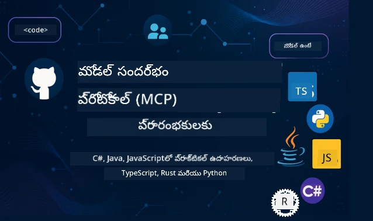

 

[](https://GitHub.com/microsoft/mcp-for-beginners/graphs/contributors)
[](https://GitHub.com/microsoft/mcp-for-beginners/issues)
[](https://GitHub.com/microsoft/mcp-for-beginners/pulls)
[](http://makeapullrequest.com)

[](https://GitHub.com/microsoft/mcp-for-beginners/watchers)
[](https://GitHub.com/microsoft/mcp-for-beginners/fork)
[](https://GitHub.com/microsoft/mcp-for-beginners/stargazers)


[](https://discord.gg/nTYy5BXMWG)

ఈ వనరులను ఉపయోగించడం ప్రారంభించడానికి ఈ దశలను అనుసరించండి:
1. **రిపోజిటరీని ఫోర్క్ చేయండి**: క్లిక్ చేయండి [](https://GitHub.com/microsoft/mcp-for-beginners/fork)
2. **రిపోజిటరీని క్లోన్ చేయండి**:   `git clone https://github.com/microsoft/mcp-for-beginners.git`
3. **చేరండి** [](https://discord.gg/nTYy5BXMWG)


### 🌐 బహుభాషా మద్దతు

#### GitHub యాక్షన్ ద్వారా మద్దతు (ఆటోమేటెడ్ & ఎల్లప్పుడూ తాజా)

<!-- CO-OP TRANSLATOR LANGUAGES TABLE START -->
[Arabic](../ar/README.md) | [Bengali](../bn/README.md) | [Bulgarian](../bg/README.md) | [Burmese (Myanmar)](../my/README.md) | [Chinese (Simplified)](../zh-CN/README.md) | [Chinese (Traditional, Hong Kong)](../zh-HK/README.md) | [Chinese (Traditional, Macau)](../zh-MO/README.md) | [Chinese (Traditional, Taiwan)](../zh-TW/README.md) | [Croatian](../hr/README.md) | [Czech](../cs/README.md) | [Danish](../da/README.md) | [Dutch](../nl/README.md) | [Estonian](../et/README.md) | [Finnish](../fi/README.md) | [French](../fr/README.md) | [German](../de/README.md) | [Greek](../el/README.md) | [Hebrew](../he/README.md) | [Hindi](../hi/README.md) | [Hungarian](../hu/README.md) | [Indonesian](../id/README.md) | [Italian](../it/README.md) | [Japanese](../ja/README.md) | [Kannada](../kn/README.md) | [Korean](../ko/README.md) | [Lithuanian](../lt/README.md) | [Malay](../ms/README.md) | [Malayalam](../ml/README.md) | [Marathi](../mr/README.md) | [Nepali](../ne/README.md) | [Nigerian Pidgin](../pcm/README.md) | [Norwegian](../no/README.md) | [Persian (Farsi)](../fa/README.md) | [Polish](../pl/README.md) | [Portuguese (Brazil)](../pt-BR/README.md) | [Portuguese (Portugal)](../pt-PT/README.md) | [Punjabi (Gurmukhi)](../pa/README.md) | [Romanian](../ro/README.md) | [Russian](../ru/README.md) | [Serbian (Cyrillic)](../sr/README.md) | [Slovak](../sk/README.md) | [Slovenian](../sl/README.md) | [Spanish](../es/README.md) | [Swahili](../sw/README.md) | [Swedish](../sv/README.md) | [Tagalog (Filipino)](../tl/README.md) | [Tamil](../ta/README.md) | [Telugu](./README.md) | [Thai](../th/README.md) | [Turkish](../tr/README.md) | [Ukrainian](../uk/README.md) | [Urdu](../ur/README.md) | [Vietnamese](../vi/README.md)

> **స్థానికంగా క్లోన్ చేయాలనుకుంటున్నారా?**
>
> ఈ రిపోజిటరీ 50+ భాషల అనువాదాలను కలిగి ఉండటం వలన డౌన్లోడ్ పరిమాణం పెరుగుతుంది. అనువాదాలు లేకుండా క్లోన్ చేయడానికి, స్పార్స్ చెకౌట్ ఉపయోగించండి:
>
> **Bash / macOS / Linux:**
> ```bash
> git clone --filter=blob:none --sparse https://github.com/microsoft/mcp-for-beginners.git
> cd mcp-for-beginners
> git sparse-checkout set --no-cone '/*' '!translations' '!translated_images'
> ```
>
> **CMD (Windows):**
> ```cmd
> git clone --filter=blob:none --sparse https://github.com/microsoft/mcp-for-beginners.git
> cd mcp-for-beginners
> git sparse-checkout set --no-cone "/*" "!translations" "!translated_images"
> ```
>
> ఇది మీరు కోర్సును పూర్తి చేయడానికి అవసరమైనదన్నీ, చాలా వేగంగా డౌన్లోడ్ చేసుకోవడానికి సహాయపడుతుంది.
<!-- CO-OP TRANSLATOR LANGUAGES TABLE END -->

# 🚀 మోడల్ కాంటెక్ట్ ప్రోటోకాల్ (MCP) ప్రారంభకుల కోసం సిలబస్

## **C#, Java, JavaScript, Rust, Python, మరియు TypeScript లో హ్యాండ్స్-ఆన్ కోడ్ ఉదాహరణలతో MCP నేర్చుకోండి**

## 🧠 మోడల్ కాంటెక్ట్ ప్రోటోకాల్ సిలబస్ అవలోకనం
మీ మోడల్ కాంటెక్ట్ ప్రోటోకాల్ ప్రయాణానికి స్వాగతం! మీరు ఎప్పుడైనా wondered చూపినట్లయితే AI అప్లికేషన్లు ఎలా వేర్వేరు టూల్స్ మరియు సేవలతో కమ్యూనికేట్ చేస్తాయో, మీరు ఇప్పుడు తెలుసుకునే అద్భుతమైన పరిష్కారం - ఇది డెవలపర్లు ఇంటెలిజెంట్ సిస్టమ్‌లను నిర్మించే విధానాన్ని మారుస్తోంది.

MCP ని AI అప్లికేషన్ల కోసం యూనివర్సల్ ట్రాన్స్లేటర్ గా భావించండి - USB పోర్టులు మీరు ఏ డివైస్ అయినా మీ కంప్యూటర్ కు కనెక్ట్ చేయడానికి ఇస్తాయన్నట్లే, MCP AI మోడల్స్ ని ఏ టూల్ లేదా సేవ అయినా స్టాండర్డైజ్డ్ విధంగా కనెక్ట్ అయ్యేందుకు వీలు కలిగిస్తుంది. మీరు మీ మొదటి చాట్‌బాట్ ని తయారుచుకుంటున్నా లేదా క్లిష్టమైన AI వర్క్‌ఫ్లోలపై పని చేస్తున్నా, MCP గురించి అవగాహన కలిగి ఉండటం ద్వారా మీరు మరింత శక్తివంతమైన మరియు అనుకూల అప్లికేషన్లను సృష్టించగలుగుతారు.

ఈ సిలబస్ మీ అభ్యాస ప్రయాణానికి సహనంతో మరియు జాగ్రత్తతో రూపొందించబడింది. మేము మీరు ఇప్పటికే తెలిసిన సరళమైన భావనలతో ప్రారంభించి, మీ నిష్పత్తికి అనుగుణంగా మీరు ఇష్టపడే ప్రోగ్రామింగ్ భాషలో ప్రాక్టికల్ ప్రాక్టీసు ద్వారా మీ నైపుణ్యాలను మెరుగుపరుస్తాము. ప్రతి దశ మధుర వివరణలు, ప్రాయోగిక ఉదాహరణలు మరియు ప్రయాణం అంతటా ఉత్తేజకరమైన ప్రోత్సాహాలతో నిండి ఉంటుంది.

ఈ ప్రయాణాన్ని పూర్తి చేసినప్పుడు, మీ దగ్గర మీ స్వంత MCP సర్వర్లను నిర్మించుకునే, ప్రముఖ AI ప్లాట్‌ఫారమ్‌లతో వాటిని ఇంటిగ్రేట్ చేసుకునే మరియు AI అభివృద్ధి భవిష్యత్తును ఎలా మారుస్తుందో అర్థం చేసుకునే ధైర్యం మరియు నైపుణ్యం ఉంటుంది. ఈ ఉత్తేజకరమైన అడ్వెంచర్ ని కలసి ప్రారంభిద్దాం!

### అధికారిక డాక్యుమెంటేషన్ మరియు స్పెసిఫికేషన్స్

ఈ సిలబస్ తాజా స్థిరమైన విడుదల అయిన **MCP స్పెసిఫికేషన్ 2025-11-25** కు అనుగుణంగా రూపొందించినది. MCP స్పెసిఫికేషన్ తేదీ ఆధారిత వెర్షనింగ్ (YYYY-MM-DD ఫార్మాట్) ఉపయోగిస్తుంది, ఇది స్పష్టమైన ప్రోటోకాల్ వెర్షన్ ట్రాకింగ్ ను అందిస్తుంది.

ఈ వనరులు మీ అవగాహన పెరిగిన కొద్దీ మరింత విలువైనవిగా మారతాయి, కానీ మీరు వెంటనే అన్ని వివరాలు చదవాల్సిన ఒత్తిడి ఉండకూడదు. మీకు ఎక్కువగా ఆసక్తి ఉన్న ప్రాంతాల నుండి ప్రారంభించండి!
- 📘 [MCP డాక్యుమెంటేషన్](https://modelcontextprotocol.io/) – ఇది మీకు దశల వారీ ట్యుటోరియల్స్ మరియు వినియోగదారుల మార్గదర్శకాలకు మార్గదర్శకంగా ఉంటుంది. డాక్యుమెంటేషన్ ప్రారంభకుల దృష్టితో రాసినది, అందులో స్పష్టమైన ఉదాహరణలు మీకు ఈ కోర్సును మీ స్వంత వేగంతో అనుసరించడానికి సహాయపడుతుంది.
- 📜 [MCP స్పెసిఫికేషన్](https://modelcontextprotocol.io/specification/2025-11-25) – దీన్ని మీ సమగ్ర సూచన పుస్తకంగా భావించండి. సిలబస్ లో మీరు పనిచేసేటప్పుడు, మీరు ఇక్కడికి తిరిగి వచ్చి ప్రత్యేక వివరాలు చూడవచ్చు మరియు ఆడ్వాన్స్డ్ ఫీచర్స్ ను అన్వేషించవచ్చు.
- 📜 [MCP స్పెసిఫికేషన్ వెర్షనింగ్](https://modelcontextprotocol.io/specification/versioning) – ఇది ప్రోటోకాల్ వెర్షన్ చరిత్ర గురించి సమాచారం మరియు MCP ఎలా తేదీ ఆధారిత వెర్షనింగ్ (YYYY-MM-DD ఫార్మాట్) ఉపయోగిస్తుందో వివరిస్తుంది.
- 🧑‍💻 [MCP GitHub రిపోజిటరీ](https://github.com/modelcontextprotocol) – ఇక్కడ మీరు SDKలు, టూల్స్ మరియు అనేక ప్రోగ్రామింగ్ భాషలలో కోడ్ సాంపిల్స్ ను కనుగొనవచ్చు. ఇది ప్రాయోగిక ఉదాహరణలు మరియు సిద్ధంగా ఉండే భాగాల భారీ కొలువు లాంటిది.
- 🌐 [MCP కమ్యూనిటీ](https://github.com/orgs/modelcontextprotocol/discussions) – MCP గురించి చర్చలలో ఇతర అభ్యసనార్తులు మరియు అనుభవజ్ఞులైన డెవలపర్లతో చేరండి. ఇది ఒక సానుభూతి కలిగిన కమ్యూనిటీ, ఇక్కడ ప్రశ్నలకు స్వాగతం ఉండి జ్ఞానం స్వేచ్ఛగా పంచుకుంటారు.
  
## నేర్చుకోవడంలో లక్ష్యాలు

ఈ సిలబస్ ముగిసినప్పుడు, మీ కొత్త సామర్థ్యాలపై మీరు ధైర్యంగా మరియు ఉల్లాసంగా ఉంటారు. మీరు సాధించబడియున్నవి:

• **MCP పునాది విషయాలు అర్థం చేసుకోండి**: మోడల్ కాంటెక్ట్ ప్రోటోకాల్ అంటే ఏమిటి మరియు ఇది AI అప్లికేషన్లు ఎలా కలిసి పని చేయుతున్నాయో విప్లవాత్మకంగా మార్చిందో మీరు గ్రహిస్తారు, సరళమైన ప్రత్యామ్నాయాలు మరియు ఉదాహరణలతో సహా.

• **మీ మొదటి MCP సర్వర్ ను సృష్టించండి**: మీ ఇష్టమైన ప్రోగ్రామింగ్ భాషలో ప్రాక్టికల్ ఉదాహరణలతో ప్రారంభించి, దశల వారీగా మీ నైపుణ్యాలను అభివృద్ధి చేయడం ద్వారా పనిచేసే MCP సర్వర్ ను సృష్టిస్తారు.

• **AI మోడల్స్ ను నిజమైన టూల్స్ తో కనెక్ట్ చేయండి**: AI మోడల్స్ మరియు అసలు సేవల మధ్య విభేదాన్ని ఎలా సమర్థవంతంగా జతచేయాలో మీరు నేర్చుకుంటారు, మీ అప్లికేషన్లకు శక్తివంతమైన కొత్త సామర్థ్యాలు ఇస్తూ.

• **భద్రత ఉత్తమ పద్ధతులు అమలు చేయండి**: మీరు మీ MCP అమలు సురక్షితంగా ఉంచడానికి ఎలా చేయాలో అర్థం చేసుకుంటారు, అలా మీ అప్లికేషన్లు మరియు వినియోగదారులను రక్షించడానికి.

• **ధైర్యంగా ప్రదర్శించండి**: అభివృద్ధి నుండి ప్రొడక్షన్ వరకు MCP ప్రాజెక్టులను తీసుకెళ్లడానికి, నిజమైన ప్రపంచంలో పనిచేసే ప్రాయోగిక డిప్లాయ్‌మెంట్ వ్యూహాలను మీరు తెలుసుకుంటారు.

• **MCP కమ్యూనిటీలో చేరండి**: AI అప్లికేషన్ అభివృద్ధి యొక్క భవిష్యత్తును సంకల్పించే అభివృద్ధిపరుల పెరుగుతో కూడుకున్న వృద్ధిచెందుతున్న సమాజ సభ్యులుగా మీరు మారిపోతారు. 

## అవసరమైన నేపథ్యం

MCP వివరాలు తెలియకముందు, మీకు కొన్ని ప్రాథమిక భావనలు సులభంగా అర్థమయ్యేలా చూసుకుందాం. మీరు ఈ ప్రాంతాలలో నిపుణులు కాకపోయినా చింతించాల్సిన అవసరం లేదు - మేము అవసరమైన అన్ని విషయాలను మీకు సహజంగా వివరిస్తూ వెళ్తాము!

### ప్రోటోకాల్స్ అవగాహన (ఆధారం)

ప్రోటోకాల్ను సంభాషణ నియమాలుగా భావించండి. మీరు ఫ్రెండ్‌ను కాల్ చేసినప్పుడు, ప్రతి ఒక్కరు సమాధానంలో "హలో" అంటారు, మాట మార్చుకుంటారు, మరియు ముగిసేప్పుడు "గుడ్‌బై" అంటారు. కంప్యూటర్ ప్రోగ్రామ్‌లకు కూడా సమర్థవంతంగా కమ్యూనికేట్ చేసుకోవడానికి ఇలాంటి నియమాలు అవసరమవుతాయి.

MCP ఒక ప్రోటోకాల్ - AI మోడల్స్ మరియు అప్లికేషన్లు టూల్స్ మరియు సేవలతో కలిసి సమర్థవంతమైన "సంభాషణలు" జరపడానికి అంగీకరించిన నియమాల సమూహం. మనుషుల సంభాషణలు మరింత సాఫీగా జరగడానికి ఉన్న నియమాల్లా, MCP ఉండటం వల్ల AI అప్లికేషన్ కమ్యూనికేషన్ మరింత విశ్వసనీయమైనది మరియు శక్తివంతమైనది అవుతుంది.

### క్లయింట్-సర్వర్ సంబంధాలు (ప్రోగ్రామ్స్ ఎలా కలిసి పనిచేస్తాయో)

మీరెప్పుడో ప్రత్త్యక్షంగా లేదా పరోక్షంగా క్లయింట్-సర్వర్ సంబంధాలను ఉపయోగిస్తున్నారు! మీరు వెబ్ బ్రౌజర్ (క్లయింట్) ద్వారా వెబ్‌సైట్ సందర్శిస్తే, మీరు వెబ్ సర్వర్‌తో కనెక్ట్ అయ్యి పేజీ కంటెంట్ అందుకుంటారు. బ్రౌజర్ ఎలా సమాచారం అడగాలో తెలుసుకొని, సర్వర్ ఎలా సమాధానం ఇవ్వాలో తెలుసుకోగలదు.

MCPలో కూడా అంతే సంబంధం ఉంటుంది: AI మోడల్స్ క్లయింట్‌లా ఉంటుంది, అవి సమాచారం లేదా చర్యలు అడుగుతాయి, MCP సర్వర్లు ఆ సామర్థ్యాలను అందిస్తాయి. ఈ విధంగా AI కి సహాయకుడు (సర్వర్) ఉన్నట్లే, చెప్పిన పనులు చేయమని అడగగలడని అనుకోవచ్చు.

### స్టాండర్డైజేషన్ ఎందుకు ముఖ్యం (విషయాలు కలిసి పనిచేయాలంటే)

ప్రతి కార్ల తయారీదారు వేర్వేరు ఆకారంలో గ్యాస్ పాంప్‌లను ఉపయోగిస్తే - మీరు ప్రతి కారునికీ వేరు అడాప్టర్ అవసరం అవుతుంది! స్టాండర్డైజేషన్ అంటే అన్ని కలిసి సులభంగా పనిచేయడానికి సాధారణ విధానాలపై ఒప్పందం చెయ్యడం.

MCP AI అప్లికేషన్ల కోసం ఈ స్టాండర్డైజేషన్ అందిస్తుంది. ప్రతి AI మోడల్ ప్రతి టూల్ తో పని చేయడానికి ప్రత్యేక కోడ్ ఉపయోగించాల్సిన అవసరం లేకుండా, MCP ఒక యూనివర్సల్ కమ్యూనికేషన్ విధానాన్ని సృష్టిస్తుంది. దీని వల్ల డెవలపర్లు ఒకసారి టూల్ ను తయారు చేసి అనేక AI సిస్టమ్స్ తో వినియోగించుకోవచ్చు.

## 🧭 మీ అభ్యాస మార్గం అవలోకనం

మీ MCP ప్రయాణం జాగ్రత్తగా నిర్మించబడి, మీ ఉత్తమత మరియు నైపుణ్యాలను దశల వారీగా మెరుగుపరుచుకునేందుకు రూపొందించబడింది. ప్రతి దశలో కొత్త భావనలు పరిచయం చేయబడి, ఇప్పటికే నేర్చుకున్న విషయాలను బలోపేతం చేస్తాయి.

### 🌱 మూలధనం దశ: ప్రాథమికాలు అర్థం చేసుకోవడం (మాడ్యూల్స్ 0-2)

ఇక్కడ మీ సాహస యాత్ర ప్రారంభమవుతుంది! మేము మీకు MCP భావనలను సాదా ప్రత్యామ్నాయాలు మరియు సరళమైన ఉదాహరణలతో పరిచయం చేస్తాము. మీరు MCP అంటే ఏమిటి, అది ఎందుకు ఉందొ, AI అభివృద్ధి ప్రపంచంలో అది ఎలా సరిపోతుందో అర్థం చేసుకుంటారు.

• **మాడ్యూల్ 0 - MCP పరిచయం**: మేము MCP ఏమిటి, ఆధునిక AI అప్లికేషన్ల కోసం ఇది ఎందుకు ముఖ్యమో అన్వేషిస్తాము. మీరు MCP ని యథార్థ ప్రపంచంలో ఎలా ఉపయోగిస్తున్నారు అనేది చూసి, డెవలపర్ల ఎదుర్కొంటున్న సాధారణ సవాళ్లను MCP ఎలా పరిష్కరిస్తుందో అర్థమవుతుంది.

• **మాడ్యూల్ 1 - ప్రాథమిక భావనలు వివరించడం**: ఇక్కడ మీరు MCP బేసిక్ నిర్మాణ కంకాల గురించి నేర్చుకొంటారు. ఈ భావనలు సహజంగా అర్థంకానివిగా ఉండేందుకు అనేక ప్రత్యామ్నాయాలు మరియు దృష్టాంతాలతో వివరించబడతాయి.

• **మాడ్యూల్ 2 - MCPలో భద్రత**: భద్రత కొంత భయంకరంగా అనిపించవచ్చు, కానీ మేము MCPలో సురక్షిత ఫీచర్లు ఉనటంచేస్తుందని మరియు మీ అప్లికేషన్లను మొదటి దశ నుండి రక్షించే ఉత్తమ పద్ధతులు ఏమిటో చూపిస్తాము.

### 🔨 నిర్మాణ దశ: మీ మొదటి అమలు (మాడ్యూల్ 3)

ఇప్పుడు నిజంగా సరదా ప్రారంభమవుతుంది! మీరు ప్రాక్టికల్ గా MCP సర్వర్లు మరియు క్లయింట్లను తయారుచేసే అనుభవాన్ని పొందుతారు. భయం వద్దు - మేము సాదాగల, పిటికెలోపుటి వరకు ప్రతీ దశలో మీకు మార్గనిర్దేశం చేస్తాము.
ఈ మోడ్యూల్‌లో మీరు మీ ఇష్టమైన ప్రోగ్రామింగ్ భాషలో ప్రాక్టీస్ చేసే అనేక హ్యాండ్స్-ఆన్ గైడ్‌లు ఉన్నాయి. మీరు మీ మొదటి సర్వర్‌ను సృష్టించి, దానితో కనెక్ట్ అయ్యేందుకు క్లయింట్‌ను నిర్మించి, అలాగే VS కోడ్ వంటి ప్రాచుర్యం పొందిన అభివృద్ధి సాధనాలతో కూడా సమ్మిళితం చేయవచ్చు.

ప్రతి గైడ్ పూర్తి కోడ్ ఉదాహరణలు, సమస్యలు పరిష్కరించే సూత్రాలు, మరియు ప్రత్యేక డిజైన్ ఎంపికలను ఎందుకు చేస్తామో వివరణలను కలిగి ఉంటుంది. ఈ దశ యొక్క చివరికి, మీరు గర్వపడదగిన పని చేసే MCP అమలు‌లను కలిగి ఉంటారు!

### 🚀 పెరుగుతున్న దశ: అధిక స్థాయి సూత్రాలు మరియు వాస్తవ ప్రపంచ అన్వయాలు (మోడ్యూల్స్ 4-5)

మూలాధారాలను నేర్చుకున్న తరువాత, మీరు మరింత సాంకేతిక MCP ఫీచర్‌లను అన్వేషించడానికి సిద్ధంగా ఉంటారు. మేము ప్రాక్టికల్ అమలు వ్యూహాలు, డీబగ్గింగ్ సాంకేతికతలు, మరియు మల్టీ-మోడ్ AI సమ్మేళన వంటి అధునాతన అంశాలను కవర్ చేస్తాము.

మీ MCP అమలు‌లను ప్రొడక్షన్ ఉపయోగానికి స్కేలు చేయడం మరియు Azure వంటి క్లౌడ్ ప్లాట్‌ఫారమ్‌లతో సమ్మిళితం చేయడం కూడా మీరు నేర్చుకుంటారు. ఈ మోడ్యూల్స్ వ్యాప్తిలో మీరు వాస్తవ ప్రపంచ డిమాండ్లను నిర్వహించగల MCP సొల్యూషన్‌లను నిర్మించడానికి సిద్ధం చేస్తాయి.

### 🌟 మాస్టరీ దశ: సమూహం మరియు ప్రత్యేకత (మోడ్యూల్స్ 6-11)

చివరి దశ MCP సమూహంలో చేరడం మరియు మీకు అత్యంత ఆసక్తి ఉన్న ప్రాంతాలలో ప్రత్యేకత పొందడంపై కేంద్రీకరించబడింది. మీరు రూపాయింపులు, అధునాతన ప్రమాణీకరణ నమూనాలు అమలు చేయడం, మరియు సమగ్ర డేటాబేస్ సమ్మిళిత పరిష్కారాలను నిర్మించడం నేర్చుకుంటారు.

మోడ్యూల్ 11 ప్రత్యేకంగా చెప్పాలి - ఇది 13-ల్యాబ్‌ల పూర్తి హ్యాండ్స్-ఆన్ నేర్చుకునే మార్గం, ఇది PostgreSQL సమ్మిళనంతో ప్రొడక్షన్-సిద్ధ MCP సర్వర్‌లను నిర్మించడం నేర్పుతుంది. ఇది మీరు నేర్చుకున్న ప్రతిదానిని కేంద్రీకరించే కాప్స్టోన్ ప్రాజెక్ట్‌లాగా ఉంటుంది!

### 📚 పూర్తి పాఠ్యాంశ నిర్మాణం

| మోడ్యూల్ | విషయం | వివరణ | లింక్ |
|--------|-------|-------------|------|
| **మోడ్యూల్ 0-3: మూలాలు** | | | |
| 00 | MCP పరిచయం | మోడల్ కాంటెక్స్ట్ ప్రోటోకాల్ యొక్క అవలోకనం మరియు AI పైప్లైన్లలో దాని ప్రాముఖ్యత | [ఇంకా చదవండి](./00-Introduction/README.md) |
| 01 | కోర్ సూత్రాలు వివరించబడ్డాయి | కోర్ MCP సూత్రాల లోతైన అన్వేషణ | [ఇంకా చదవండి](./01-CoreConcepts/README.md) |
| 02 | MCPలో భద్రత | భద్రతా ముప్పులు మరియు ఉత్తమ పద్ధతులు | [ఇంకా చదవండి](./02-Security/README.md) |
| 03 | MCP తో ప్రారంభం | పర్యావరణ సెటప్, ప్రాథమిక సర్వర్లు/క్లయింట్లు, సమ్మేళనం | [ఇంకా చదవండి](./03-GettingStarted/README.md) |
| **మోడ్యూల్ 3: మీ మొదటి సర్వర్ & క్లయింట్ నిర్మాణం** | | | |
| 3.1 | మొదటి సర్వర్ | మీ మొదటి MCP సర్వర్‌ను సృష్టించండి | [గైడ్](./03-GettingStarted/01-first-server/README.md) |
| 3.2 | మొదటి క్లయింట్ | ప్రాథమిక MCP క్లయింట్‌ను అభివృద్ధి చేయండి | [గైడ్](./03-GettingStarted/02-client/README.md) |
| 3.3 | LLMతో క్లయింట్ | పెద్ద భాషా నమూనాలతో సమ్మిళితం చేయండి | [గైడ్](./03-GettingStarted/03-llm-client/README.md) |
| 3.4 | VS కోడ్ సమ్మిళనం | MCP సర్వర్‌లను VS కోడ్‌లో వినియోగించండి | [గైడ్](./03-GettingStarted/04-vscode/README.md) |
| 3.5 | stdio సర్వర్ | stdio ట్రాన్స్‌పోర్ట్ ఉపయోగించి సర్వర్లను సృష్టించండి | [గైడ్](./03-GettingStarted/05-stdio-server/README.md) |
| 3.6 | HTTP స్ట్రీమింగ్ | MCPలో HTTP స్ట్రీమింగ్ అమలు చేయండి | [గైడ్](./03-GettingStarted/06-http-streaming/README.md) |
| 3.7 | AI టూల్‌కిట్ | MCPతో AI టూల్‌కిట్‌ను ఉపయోగించండి | [గైడ్](./03-GettingStarted/07-aitk/README.md) |
| 3.8 | పరీక్షలు | మీ MCP సర్వర్ అమలును పరీక్షించండి | [గైడ్](./03-GettingStarted/08-testing/README.md) |
| 3.9 | ప్రదర్శన | MCP సర్వర్‌లను ప్రొడక్షన్‌కు పంపండి | [గైడ్](./03-GettingStarted/09-deployment/README.md) |
| 3.10 | అధునాతన సర్వర్ ఉపయోగం | అధునాతన ఫీచర్ వినియోగానికి మరియు మెరుగైన నిర్మాణానికి అధునాతన సర్వర్‌లను ఉపయోగించండి | [గైడ్](./03-GettingStarted/10-advanced/README.md) |
| 3.11 | సరళ అనుమతి | ప్రారంభం నుండి అనుమతి మరియు RBAC చూపించే అధ్యాయం | [గైడ్](./03-GettingStarted/11-simple-auth/README.md) |
| 3.12 | MCP అతిథులు | Claude డెస్క్‌టాప్, కర్సర్, క్లైన్ మరియు ఇతర MCP అతిథులను కాన్ఫిగర్ చేయండి | [గైడ్](./03-GettingStarted/12-mcp-hosts/README.md) |
| 3.13 | MCP ఇన్స్పెక్టర్ | ఇన్స్పెక్టర్ సాధనంతో MCP సర్వర్‌లను డీబగ్ మరియు పరీక్షించండి | [గైడ్](./03-GettingStarted/13-mcp-inspector/README.md) |
| **మోడ్యూల్ 4-5: ప్రాక్టికల్ & అధునాతన** | | | |
| 04 | ప్రాక్టికల్ అమలు | SDKలు, డీబగ్గింగ్, పరీక్షలు, పునః వినియోగయోగ్యం ప్రాంప్ట్ టెంప్లేట్లు | [ఇంకా చదవండి](./04-PracticalImplementation/README.md) |
| 4.1 | పేజినేషన్ | కర్సర్ ఆధారిత పేజినేషన్‌తో పెద్ద ఫలితాలను నిర్వహించండి | [గైడ్](./04-PracticalImplementation/pagination/README.md) |
| 05 | MCPలో అధునాతన అంశాలు | మల్టీ-మోడ్ AI, స్కేలింగ్, సంస్థల ఉపయోగం | [ఇంకా చదవండి](./05-AdvancedTopics/README.md) |
| 5.1 | Azure సమ్మేళనం | MCPని Azureతో సమ్మిళితం చేయడం | [గైడ్](./05-AdvancedTopics/mcp-integration/README.md) |
| 5.2 | బహుముఖత | బహుముఖాల తో పనిచేయడం | [గైడ్](./05-AdvancedTopics/mcp-multi-modality/README.md) |
| 5.3 | OAuth2 డెమో | OAuth2 ప్రమాణీకరణను అమలు చేయండి | [గైడ్](./05-AdvancedTopics/mcp-oauth2-demo/README.md) |
| 5.4 | రూట్ కాంటెక్ట్లు | రూట్ కాంటెక్ట్లను అర్థం చేసుకుని అమలు చేయండి | [గైడ్](./05-AdvancedTopics/mcp-root-contexts/README.md) |
| 5.5 | రౌటింగ్ | MCP రౌటింగ్ వ్యూహాలు | [గైడ్](./05-AdvancedTopics/mcp-routing/README.md) |
| 5.6 | శాంప్లింగ్ | MCPలో శాంప్లింగ్ సాంకేతికతలు | [గైడ్](./05-AdvancedTopics/mcp-sampling/README.md) |
| 5.7 | స్కేలింగ్ | MCP అమలు‌లను స్కేలు చేయండి | [గైడ్](./05-AdvancedTopics/mcp-scaling/README.md) |
| 5.8 | భద్రత | అధునాతన భద్రతా పరిగణనలు | [గైడ్](./05-AdvancedTopics/mcp-security/README.md) |
| 5.9 | వెబ్ శోధన | వెబ్ శోధన సామర్థ్యాలను అమలు చేయండి | [గైడ్](./05-AdvancedTopics/web-search-mcp/README.md) |
| 5.10 | రియల్టైమ్ స్ట్రీమింగ్ | రియల్టైమ్ స్ట్రీమింగ్ సౌకర్యాన్ని నిర్మించండి | [గైడ్](./05-AdvancedTopics/mcp-realtimestreaming/README.md) |
| 5.11 | రియల్టైమ్ శోధన | రియల్టైమ్ శోధన అమలు చేయండి | [గైడ్](./05-AdvancedTopics/mcp-realtimesearch/README.md) |
| 5.12 | Entra ID అనుమతి | Microsoft Entra IDతో ప్రమాణీకరణ | [గైడ్](./05-AdvancedTopics/mcp-security-entra/README.md) |
| 5.13 | ఫౌండ్రీ సమ్మిళనం | Azure AI Foundryతో సమ్మిళనం | [గైడ్](./05-AdvancedTopics/mcp-foundry-agent-integration/README.md) |
| 5.14 | కాంటెక్ట్ ఇంజనీరింగ్ | సమర్థవంతమైన కాంటెక్ట్ ఇంజనీరింగ్ పద్ధతులు | [గైడ్](./05-AdvancedTopics/mcp-contextengineering/README.md) |
| 5.15 | MCP కస్టమ్ ట్రాన్స్‌పోర్ట్ | కస్టమ్ ట్రాన్స్‌పోర్ట్ అమలు‌లు | [గైడ్](./05-AdvancedTopics/mcp-transport/README.md) |
| 5.16 | ప్రోటోకాల్ ఫీచర్‌లు | ప్రగతి నోటిఫికేషన్లు, రద్దు, వనరు టెంప్లేట్లు | [గైడ్](./05-AdvancedTopics/mcp-protocol-features/README.md) |
| **మోడ్యూల్ 6-10: సమూహం & ఉత్తమ పద్ధతులు** | | | |
| 06 | సమూహ సహకారాలు | MCP ఎకోసిస్టమ్‌కు ఎలా సహకరించాలో | [గైడ్](./06-CommunityContributions/README.md) |
| 07 | ప్రారంభ దశ అనుభవాలు | వాస్తవ ప్రపంచ అమలు కథనాలు | [గైడ్](./07-LessonsfromEarlyAdoption/README.md) |
| 08 | MCPకి ఉత్తమ పద్ధతులు | వ్యవహార సామర్థ్యం, లోప నిరోధకత, ప్రతిస్పందన | [గైడ్](./08-BestPractices/README.md) |
| 09 | MCP కేసు అధ్యయనాలు | ప్రాక్టికల్ అమలు ఉదాహరణలు | [గైడ్](./09-CaseStudy/README.md) |
| 10 | హ్యాండ్స్-ఆన్ వర్క్‌షాప్ | AI టూల్‌కిట్‌తో MCP సర్వర్ నిర్మాణం | [ల్యాబ్](./10-StreamliningAIWorkflowsBuildingAnMCPServerWithAIToolkit/README.md) |
| **మోడ్యూల్ 11: MCP సర్వర్ హ్యాండ్స్ ఆన్ ల్యాబ్** | | | |
| 11 | MCP సర్వర్ డేటాబేస్ సమ్మిళన | PostgreSQL సమ్మిళనంతో పూర్తి 13-ల్యాబ్ హ్యాండ్స్ ఆన్ నేర్చుకునే మార్గం | [ల్యాబ్స్](./11-MCPServerHandsOnLabs/README.md) |
| 11.1 | పరిచయం | డేటాబేస్ సమ్మిళనంతో MCP అవలోకనం మరియు రీటైల్ అనలిటిక్స్ ఉపయోగ కేసు | [ల్యాబ్ 00](./11-MCPServerHandsOnLabs/00-Introduction/README.md) |
| 11.2 | ప్రధాన నిర్మాణం | MCP సర్వర్ నిర్మాణం, డేటాబేస్ లేయర్లు, మరియు భద్రతా నమూనాల అవగాహన | [ల్యాబ్ 01](./11-MCPServerHandsOnLabs/01-Architecture/README.md) |
| 11.3 | భద్రత & బహుముఖి యజమాన్యం | రో లెవల్ సెక్యూరిటీ, ప్రమాణీకరణ, మరియు బహు-యజమాని డేటా యాక్సెస్ | [ల్యాబ్ 02](./11-MCPServerHandsOnLabs/02-Security/README.md) |
| 11.4 | పర్యావరణ సెటప్ | అభివృద్ధి పర్యావరణం, డోకర్, Azure వనరులను సెటప్ చేయడం | [ల్యాబ్ 03](./11-MCPServerHandsOnLabs/03-Setup/README.md) |
| 11.5 | డేటాబేస్ డిజైన్ | PostgreSQL సెటప్, రీటైల్ స్కీమా రూపకల్పన, మరియు నమూనా డేటా | [ల్యాబ్ 04](./11-MCPServerHandsOnLabs/04-Database/README.md) |
| 11.6 | MCP సర్వర్ అమలు | డేటాబేస్ సమ్మిళనతో FastMCP సర్వర్ నిర్మాణం | [ల్యాబ్ 05](./11-MCPServerHandsOnLabs/05-MCP-Server/README.md) |
| 11.7 | సాధన అభివృద్ధి | డేటాబేస్ క్వెరి సాధనాలు మరియు స్కీమా ఇంట్రోస్పెక్షన్ సృష్టించడం | [ల్యాబ్ 06](./11-MCPServerHandsOnLabs/06-Tools/README.md) |
| 11.8 | సెమెന്റిక్ శోధన | Azure OpenAI మరియు pgvectorతో వెక్టర్ ఎంబెడ్డింగ్స్ అమలు చేయడం | [ల్యాబ్ 07](./11-MCPServerHandsOnLabs/07-Semantic-Search/README.md) |
| 11.9 | పరీక్షలు & డీబగ్గింగ్ | పరీక్షా వ్యూహాలు, డీబగ్గింగ్ సాధనాలు, మరియు ధృవీకరణ పద్ధతులు | [ల్యాబ్ 08](./11-MCPServerHandsOnLabs/08-Testing/README.md) |
| 11.10 | VS కోడ్ సమ్మిళనం | VS కోడ్ MCP సమ్మిళనం మరియు AI చాట్ వినియోగ సర్దుబాటు | [ల్యాబ్ 09](./11-MCPServerHandsOnLabs/09-VS-Code/README.md) |
| 11.11 | ప్రదర్శన వ్యూహాలు | డోకర్ ప్రదర్శన, Azure కంటెయినర్ యాప్స్, మరియు స్కేలింగ్ పరిగణనలు | [ల్యాబ్ 10](./11-MCPServerHandsOnLabs/10-Deployment/README.md) |
| 11.12 | మానిటరింగ్ | అనువర్తన అవగాహన, లాగింగ్, పనితీరు పరిశీలన | [ల్యాబ్ 11](./11-MCPServerHandsOnLabs/11-Monitoring/README.md) |
| 11.13 | ఉత్తమ పద్ధతులు | పనితీరు ఆప్టిమైజేషన్, భద్రతా కఠినత, మరియు ప్రొడక్షన్ సూచనలు | [ల్యాబ్ 12](./11-MCPServerHandsOnLabs/12-Best-Practices/README.md) |

### 💻 నమూనా కోడ్ ప్రాజెక్టులు

MCP నేర్చుకునే అత్యంత ఆహ్లాదకరమైన భాగాలలో ఒకటి మీ కోడ్ నైపుణ్యాలు సున్నితంగా అభివృద్ధి చెందట్లే. మా కోడ్ ఉదాహరణలు సులభంగా మొదలుకుని, మీ అవగాహన పెరుగుతున్న కొద్దీ మరింత సాంకేతికంగా తయారు చేయబడ్డాయి. ఇక్కడ కథనాలను పరిచయం చేసే విధానం ఇలా ఉంటుంది - సులభంగా అర్థమయ్యే కానీ MCP సూత్రాలను యథార్థంగా చూపే కోడ్‌తో, మీరు ఈ కోడ్ ఏమిటి చేస్తుందో మాత్రమే కాదు, ఎందుకు అలాంటి నిర్మాణంతో ఉందో, మరియు పెద్ద MCP అనువర్తనాలలో ఎలా సరిపోతుందో కూడా అర్థం చేసుకుంటారు.

#### ప్రాథమిక MCP క్యాల్క్యులేటర్ నమూనాలు

| భాష | వివరణ | లింక్ |
|----------|-------------|------|
| C# | MCP సర్వర్ ఉదాహరణ | [కోడ్ చూడండి](./03-GettingStarted/samples/csharp/README.md) |
| Java | MCP క్యాల్క్యులేటర్ | [కోడ్ చూడండి](./03-GettingStarted/samples/java/calculator/README.md) |
| JavaScript | MCP ప్రదర్శన | [కోడ్ చూడండి](./03-GettingStarted/samples/javascript/README.md) |
| Python | MCP సర్వర్ | [కోడ్ చూడండి](../../03-GettingStarted/samples/python/mcp_calculator_server.py) |
| TypeScript | MCP ఉదాహరణ | [కోడ్ చూడండి](./03-GettingStarted/samples/typescript/README.md) |
| Rust | MCP ఉదాహరణ | [కోడ్ చూడండి](./03-GettingStarted/samples/rust/README.md) |

#### అధునాతన MCP అమలు

| భాష | వివరణ | లింక్ |
|----------|-------------|------|
| C# | అధునాతన నమూనా | [కోడ్ చూడండి](./04-PracticalImplementation/samples/csharp/README.md) |
| Java with Spring | కంటెయినర్ యాప్ ఉదాహరణ | [కోడ్ చూడండి](./04-PracticalImplementation/samples/java/containerapp/README.md) |
| JavaScript | అధునాతన నమూనా | [కోడ్ చూడండి](./04-PracticalImplementation/samples/javascript/README.md) |
| Python | సంక్లిష్ట అమలు | [కోడ్ చూడండి](./04-PracticalImplementation/samples/python/README.md) |
| TypeScript | కంటెయినర్ నమూనా | [కోడ్ చూడండి](./04-PracticalImplementation/samples/typescript/README.md) |


## 🎯 MCP నేర్చుకోవడానికి అవసరమైన అంశాలు

ఈ పాఠ్యాంశం నుంచి గరిష్ట లాభం పొందడానికి మీరు ఈ క్రింది అంశాలు తెలుసుకోవాలి:

- కనీసం ఈ క్రింది భాషలలో ఒకటిలో ప్రోగ్రామింగ్ ప్రాథమిక జ్ఞానం: C#, Java, JavaScript, Python, లేదా TypeScript  
- క్లయింట్-సర్వర్ మోడల్ మరియు APIల అర్థం  
- REST మరియు HTTP సూత్రాల పరిచయం  
- (ఐచ్ఛికం) AI/ML సూత్రాల నేపథ్యం  

- మద్దతు కోసం మా సమూహ చర్చల్లో పాల్గొనడం  

## 📚 అధ్యయన గైడ్ & వనరులు

ఈ రిపాజిటరీలో మీరు సులభంగా దిశనిర్దేశం చేసుకుని సమర్థవంతంగా నేర్చుకునేందుకు అనేక వనరులు ఉన్నాయి:

### అధ్యయన గైడ్
ఈ రిపాజిటరీని సమర్థవంతంగా నావిగేట్ చేయడానికి సవిస్తృతమైన [స్టడీ గైడ్](./study_guide.md) అందుబాటులో ఉంది. ఈ విజువల్ పాఠ్య కోర్సు మ్యాప్ అన్ని విషయాలు ఎలా కనెక్ట్ అవుతున్నాయి మరియు నమూనా ప్రాజెక్టులను సమర్థవంతంగా ఎలా ఉపయోగించాలో మార్గదర్శనం చేస్తుంది. మీరు భారీ చిత్రాన్ని చూడడం ఇష్టపడే విజువల్ లెర్నర్ అయితే ఇది విశేషంగా సహాయకారిగా ఉంటుంది.

గైడ్‌లో ఇవి ఉన్నాయి:
- అన్ని కవరైన విషయాలను చూపించే విజువల్ పాఠ్య కోర్సు మ్యాప్
- ప్రతి రిపాజిటరీ విభాగం యొక్క విస్తృత విశ్లేషణ
- నమూనా ప్రాజెక్టులను ఉపయోగించే సూచనలు
- వివిధ నైపుణ్య స్థాయిల కోసం సిఫార్సు చేయబడిన అభ్యాస మార్గాలు
- మీ నేర్చుకోవడంలో సహాయపడే అదనపు వనరులు

### మార్పుల చర్చ

మేము పాఠ్యక్రమ సామగ్రిపై జరిగిన అన్ని ముఖ్యమైన నవీకరణలను ట్రాక్ చేసే విస్తృత [మార్పుల చర్చ](./changelog.md)ని నిర్వహిస్తోంది, అందువల్ల మీరు తాజా మెరుగుదలలు మరియు జోడింపులతోతో అనుబంధంగా ఉంటారు.
- కొత్త విషయాల జోడింపులు
- నిర్మాణాత్మక మార్పులు
- ఫీచర్ మెరుగుదలలు
- డాక్యుమెంటేషన్ సవరణలు

## 🛠️ ఈ పాఠ్యక్రమాన్ని సమర్థవంతంగా ఎలా ఉపయోగించాలి

ఈ గైడ్ లో ప్రతి పాఠం లో ఉంటుంది:

1. MCP భావనల స్పష్టమైన వివరణలు  
2. బహుభాషలులో ప్రత్యక్ష కోడ్ ఉదాహరణలు  
3. నిజమైన MCP అనువర్తనాలను నిర్మించే వ్యాయామాలు  
4. అధునాతన అభ్యాసకుల కోసం అదనపు వనరులు

### మనము C#తో MCP నేర్చుకుందాం - ట్యుటోరియల్ సిరీస్
మోడల్ కాన్‌టెక్స్ట్ ప్రోటోకాల్ (MCP) గురించి నేర్చుకుందాం, ఇది AI మోడల్స్ మరియు క్లయింట్ అనువర్తనాల మధ్య పరస్పర చర్యలకు ప్రమాణీకృత రూపం ఇవ్వడానికి రూపొంది ఉన్న ఆధునిక ఫ్రేమ్‌వర్క్. ఈ ప్రారంభ దశలో మేము MCPని పరిచయం చేసి మీ మొదటి MCP సర్వర్ సృష్టించే దిశగా మార్గనిర్దేశం చేస్తాము.
#### C#: [https://aka.ms/letslearnmcp-csharp](https://aka.ms/letslearnmcp-csharp)
#### Java: [https://aka.ms/letslearnmcp-java](https://aka.ms/letslearnmcp-java)
#### JavaScript: [https://aka.ms/letslearnmcp-javascript](https://aka.ms/letslearnmcp-javascript)
#### Python: [https://aka.ms/letslearnmcp-python](https://aka.ms/letslearnmcp-python)

## 🎓 మీ MCP ప్రయాణం ప్రారంభమవుతోంది

అభినందనలు! మీరు ప్రోగ్రామింగ్ సామర్థ్యాలను విస్తరించే మరియు AI అభివృద్ధిలో నూతన అంచులను చేరుకునే ఉత్సాహభరితమైన ప్రయాణంలో మొదటి అడుగు వేసారు.

### మీరు ఇప్పటికే సాధించినవి

ఈ పరిచయాన్ని చదివి మీరు ఇప్పటికే మీ MCP జ్ఞానాధారాన్ని నిర్మించటం ప్రారంభించారు. MCP ఏమిటి, అది ఎందుకు ముఖ్యం మరియు ఈ పాఠ్యక్రమం మీ నేర్చుకుందిని ఎలా మద్దతు ఇస్తుంది అనేది మీరు అర్థం చేసుకున్నారు. ఇది గొప్ప విజయము మరియు ఈ ప్రాముఖ్యమైన సాంకేతికతలో మీ నైపుణ్య ప్రారంభం.

### ముందుకు సాగే యాత్ర

మాడ్యూళ్స్ ద్వారా మీరు అభ్యాసం చేసే కొద్దీ ప్రతి నిపుణుడు ఒక సమయంలో ప్రారంభ స్థాయి వారు మాత్రమేనని గుర్తుంచుకోండి. ఇప్పుడు క్లిష్టంగా అనిపించే భావనలు మీరు ఆచరణలో పెట్టే కొద్దీ సులభంగా అవుతాయి. ప్రతి చిన్న అడుగు శక్తివంతమైన సామర్థ్యాల వైపు ముందడుగు వేస్తుంది, ఇవి మీ అభివృద్ధి కెరీర్ మొత్తం మీకు ఉపయోగపడతాయి.

### మీ మద్దతు నెట్‌వర్క్

మీరొక MCPకు ప్రీతిపడ్డ అభ్యాసకుల మరియు నిపుణుల సంఘంతో చేరుతున్నారు, వారు ఇతరుల విజయాన్ని చూడాలని కోరుకునే వారు. మీరు కోడింగ్ సవాలులో చిక్కుకుని ఉంటే లేదా ఒక గొప్ప సాంకేతిక ఆవిష్కరణ పంచుకోవాలని ఉత్సాహంగా ఉంటే కూడా, సంఘం మీ ప్రయాణానికి మద్దతు ఇస్తుంది.

మీరు చిక్కుకున్నప్పుడు లేదా AI యాప్లను నిర్మించడంలో ఏవైనా ప్రశ్నలు ఉంటే ఇతర అభ్యాసకులు మరియు అనుభవజ్ఞులైన డెవలపర్లతో MCP గురించి చర్చల్లో చేరండి. ఇది ప్రశ్నలను స్వాగతించే మరియు జ్ఞానాన్ని స్వేచ్ఛగా పంచుకునే మద్దతుగా ఉన్న సమాజం.

[](https://discord.gg/nTYy5BXMWG)

పురడిగార్హోణాలు లేదా బిల్డ్ సమయంలో లోపాలు ఉన్నపోతే ఇక్కడ సందర్శించండి:

[](https://aka.ms/foundry/forum)

### ప్రారంభించేందుకు సిద్ధంగా ఉన్నారా?

మీ MCP యాత్ర ఇప్పుడు ప్రారంభమవుతోంది! మొదటి చేతమీద MCP అనుభవాలలోకి దూకేందుకు Module 0 తో మొదలెట్టండి, లేదా మీరు నిర్మించబోతున్నది ఏమిటి అని చూడటానికి నమూనా ప్రాజెక్టులను అన్వేషించండి. గుర్తుంచుకోండి - ప్రతి నిపుణుడు మీరు ఉన్న స్థలంలోనే ప్రారంభించారు, మరియు సహనం మరియు అభ్యాసంతో మీరు సాధించగలిగేది చూసి ఆశ్చర్యపడతారు.

Model Context Protocol అభివృద్ధి ప్రపంచానికి స్వాగతం. మనము కలిసి అద్భుతమైనదాన్ని నిర్మిద్దాం!

## 🤝 అభ్యాస సంఘానికి సహకారం

ఈ పాఠ్యక్రమం మీరు వంటి అభ్యాసకుల నుండి వచ్చే సహకారాలతో మరింత బలమెరుగుతుంది! మీరు తప్పు దిద్దితే, స్పష్టమైన వివరణ సూచిస్తే లేదా కొత్త ఉదాహరణ చేర్చితే, మీ సహకారం ఇతర ప్రారంభదశల అభ్యాసకులకు విజయం సాధించడంలో సహాయపడుతుంది.

కోడ్ నమూనాలు అందించిన Microsoft విలువైన నిపుణుడు [Shivam Goyal](https://www.linkedin.com/in/shivam2003/) కు ధన్యవాదాలు.

ఈ సహకార ప్రక్రియ ఆహ్లాదకరంగా మరియు మద్దతుగా ఉండే విధంగా రూపొంది ఉంది. చాలా సహకారాలకు Contributor License Agreement (CLA) అవసరం అవుతుంది, కానీ ఆటోమేటిక్ టూల్స్ ప్రక్రియను సజావుగా మీరు పూర్తి చేయడానికి మార్గనిర్దేశం చేస్తాయి.

## 📜 ఓపెన్ సోర్స్ అభ్యాసం

ఈ మొత్తం పాఠ్యక్రమం MIT [LICENSE](../../LICENSE) కింద అందుబాటులో ఉంది, అంటే మీరు దీన్ని ఉపయోగించవచ్చు, సవరించవచ్చు మరియు స్వేచ్ఛగా పంచుకోవచ్చు. ఇది MCP జ్ఞానాన్ని అన్ని ప్రోగ్రామర్లకు అందుబాటులో చేయాలనే మిషన్‌ను మద్దతు ఇస్తుంది.

## 🤝 సహకార మార్గదర్శకాలు

ఈ ప్రాజెక్ట్ సహకారాలు మరియు సూచనలను స్వీకరిస్తుంది. చాలా సహకారాలకు మీరు Contributor License Agreement (CLA) కి అనుమతి ఇవ్వాలని మరియు మీరు అందించిన సహకారం పై హక్కులను మాకు ఇచ్చారని ప్రకటించాలి. వివరాల కోసం <https://cla.opensource.microsoft.com> ని సందర్శించండి.

మీరు పుల్ రిక్వెస్ట్ సమర్పించినప్పుడు, CLA బాట్ స్వయంచాలకంగా మీరు CLA అందించాల్సిన అవసరం ఉందా లేదా అని నిర్ధారించుకుని PR ను సరైన రీతిలో అలంకరించే (ఉదా. స్థితి పరిశీలన, వ్యాఖ్య) యత్నిస్తుంది. బాట్ ఇచ్చే సూచనలను అనుసరించండి. ఇవన్నీ మీకు ఒకసారి మాత్రమే చేయవలసి ఉంటుంది అన్ని రిపాజిటరీల పరిధిలో మేము CLA ఉపయోగిస్తున్నప్పుడు.

ఈ ప్రాజెక్ట్ [Microsoft Open Source Code of Conduct](https://opensource.microsoft.com/codeofconduct/) ను స్వీకరించి ఉంది. మరింత సమాచారం కోసం [Code of Conduct FAQ](https://opensource.microsoft.com/codeofconduct/faq/) చూడండి లేదా ఏవైనా అదనపు ప్రశ్నలు లేదా వ్యాఖ్యలకు [opencode@microsoft.com](mailto:opencode@microsoft.com) కి సంప్రదించండి.

---

*మీ MCP ప్రయాణాన్ని ప్రారంభించడానికి సిద్ధంగా ఉన్నారా? [Module 00 - MCP పరిచయము](./00-Introduction/README.md) తో మొదలుపెట్టి Model Context Protocol అభివృద్ధి ప్రపంచంలో మీ మొదటి అడుగులు వేయండి!*


## 🎒 ఇతర కోర్సుల జాబితా
మా జట్టు మరిన్ని కోర్సులను తయారు చేస్తోంది! ఇవి చూడండి:

<!-- CO-OP TRANSLATOR OTHER COURSES START -->
### లాంగ్ చైన్
[](https://aka.ms/langchain4j-for-beginners)
[](https://aka.ms/langchainjs-for-beginners?WT.mc_id=m365-94501-dwahlin)
[](https://github.com/microsoft/langchain-for-beginners?WT.mc_id=m365-94501-dwahlin)
---

### Azure / ఎడ్జ్ / MCP / ఏజెంట్స్
[](https://github.com/microsoft/AZD-for-beginners?WT.mc_id=academic-105485-koreyst)
[](https://github.com/microsoft/edgeai-for-beginners?WT.mc_id=academic-105485-koreyst)
[](https://github.com/microsoft/mcp-for-beginners?WT.mc_id=academic-105485-koreyst)
[](https://github.com/microsoft/ai-agents-for-beginners?WT.mc_id=academic-105485-koreyst)

---
 
### జనరేటివ్ AI సిరీస్
[](https://github.com/microsoft/generative-ai-for-beginners?WT.mc_id=academic-105485-koreyst)
[-9333EA?style=for-the-badge&labelColor=E5E7EB&color=9333EA)](https://github.com/microsoft/Generative-AI-for-beginners-dotnet?WT.mc_id=academic-105485-koreyst)
[-C084FC?style=for-the-badge&labelColor=E5E7EB&color=C084FC)](https://github.com/microsoft/generative-ai-for-beginners-java?WT.mc_id=academic-105485-koreyst)
[-E879F9?style=for-the-badge&labelColor=E5E7EB&color=E879F9)](https://github.com/microsoft/generative-ai-with-javascript?WT.mc_id=academic-105485-koreyst)

---
 
### కోర్ లెర్నింగ్
[](https://aka.ms/ml-beginners?WT.mc_id=academic-105485-koreyst)
[](https://aka.ms/datascience-beginners?WT.mc_id=academic-105485-koreyst)
[](https://aka.ms/ai-beginners?WT.mc_id=academic-105485-koreyst)
[](https://github.com/microsoft/Security-101?WT.mc_id=academic-96948-sayoung)
[](https://aka.ms/webdev-beginners?WT.mc_id=academic-105485-koreyst)
[](https://aka.ms/iot-beginners?WT.mc_id=academic-105485-koreyst)
[](https://github.com/microsoft/xr-development-for-beginners?WT.mc_id=academic-105485-koreyst)

---
 
### కోపిలట్ సిరీస్
[](https://aka.ms/GitHubCopilotAI?WT.mc_id=academic-105485-koreyst)
[](https://github.com/microsoft/mastering-github-copilot-for-dotnet-csharp-developers?WT.mc_id=academic-105485-koreyst)
[](https://github.com/microsoft/CopilotAdventures?WT.mc_id=academic-105485-koreyst)
<!-- CO-OP TRANSLATOR OTHER COURSES END -->

---

<!-- CO-OP TRANSLATOR DISCLAIMER START -->
**అస్పష్టత**:  
ఈ పత్రాన్ని AI అనువాద సేవ [Co-op Translator](https://github.com/Azure/co-op-translator) ఉపయోగించి అనువదించబడినది. మనం ఖచ్చితత్వం కోసం ప్రయత్నించినప్పటికీ, ఆటోమేటెడ్ అనువాదాలలో లోపాలు లేదా పొరపాట్లు ఉండవచ్చు. మౌలిక పత్రం దాని స్వదేశ భాషలో ఉన్నట్లు అధికారిక మూలం గా భావించాలి. ముఖ్యమైన సమాచారానికి ప్రత్యేక నైపుణ్యం కలిగిన మానవ అనువాదం పొందడం మంచిది. ఈ అనువాదం వాడకం వల్ల వచ్చే ఏదైనా అవగాహన లోపాలు లేదా తప్పు అర్థం చేసుకునే పరిస్థితులకు మేము బాధ్యత వహించము.
<!-- CO-OP TRANSLATOR DISCLAIMER END -->