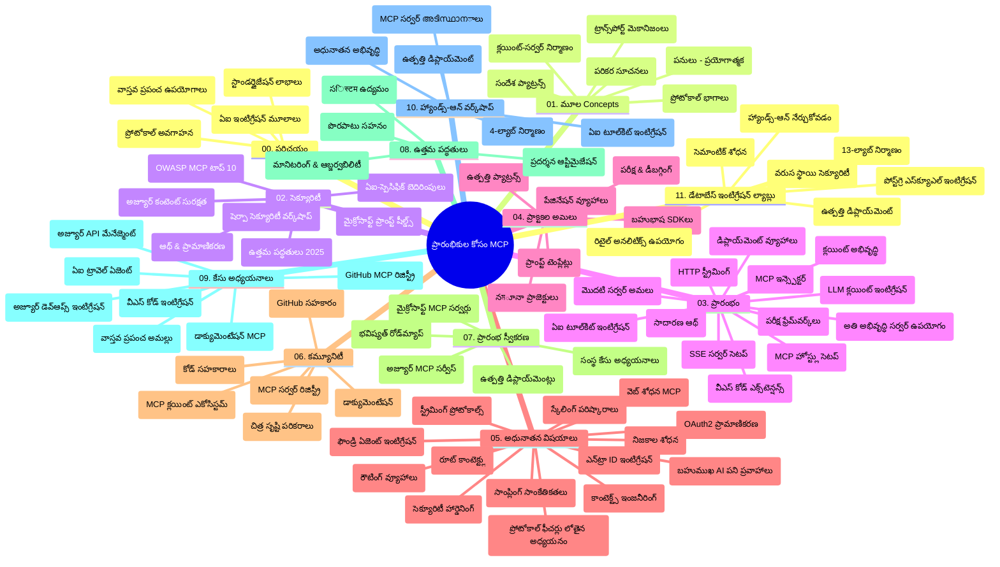

# ప్రారంభికుల కోసం మోడల్ కాంటెక్స్ట్ ప్రోటోకాల (MCP) - అధ్యయన గైడ్

ఈ అధ్యయన గైడ్ "ప్రారంభికుల కోసం మోడల్ కాంటెక్స్ట్ ప్రోటోకాల (MCP)" మహా నిఘంటువు నిర్మాణం మరియు విషయాలపై ఒక సమగ్ర అవగాహన అందిస్తుంది. ఈ గై드를 ఉపయోగించి రిపోజిటరీని సమర్థంగా నావిగేట్ చేసి అందుబాటులో ఉన్న వనరుల నుండి గరిష్ట లాభం పొందండి.

## రిపోజిటరీ రూపరేఖ

మోడల్ కాంటెక్స్ట్ ప్రోటోకాల (MCP) అనేది AI మోడల్స్ మరియు క్లయింట్ అనువర్తనాల మధ్య పరస్పర చర్యల కోసం ఒక ప్రమాణీకృత ఫ్రేమ్‌వర్క్. ప్రాథమికంగా Anthropic ద్వారా సృష్టించబడింది, MCP ను ఇప్పటికీ అధికారిక GitHub సంస్థ ద్వారా విస్తృత MCP కమ్యూనిటీ నిర్వహించుతోంది. ఈ రిపోజిటరీ C#, Java, JavaScript, Python, మరియు TypeScript లో రూపొందించిన హ్యాండ్-ఆన్ కోడ్ ఉదాహరణలతో కూడిన సమగ్ర పాఠ్యক্রমాన్ని అందిస్తుంది, ఇది AI అభివృద్ధిపరులు, వ్యవస్థ రూపకర్తలు, సాఫ్ట్‌వేర్ ఇంజనీర్లకు ఉద్దేశించబడినది.

## విజువల్ పాఠ్యමා పటము

## రిపోజిటరీ నిర్మాణం

రిపోజిటరీ యెల్లెవెన్ ప్రధాన విభాగాలలో ఏర్పాటైంది, వీటిలో MCP యొక్క విభిన్న అంశాలపై ఫోకస్ ఉంది:

1. **పరిచయం (00-Introduction/)**
   - మోడల్ కాంటెక్స్ట్ ప్రోటోకాల అవగాహన
   - AI పైప్లైన్లలో ప్రమాణీకరణ ముఖ్యమైన కారణాలు
   - ప్రక్టికల్ ఉపయోగ కేసులు మరియు ప్రయోజనాలు

2. **ప్రధాన సూత్రాలు (01-CoreConcepts/)**
   - క్లయింట్-సర్వర్ వాస్తవిక నిర్మాణం
   - ప్రోటోకాల ప్రధాన భాగాలు
   - MCP లో మెసేజింగ్ నమూనాలు

3. **భద్రత (02-Security/)**
   - MCP ఆధారిత వ్యవస్థలలో భద్రతా ముప్పులు
   - అమలు భద్రతకు ఉత్తమ ఆచరణలు
   - ధృవీకరణ మరియు అనుమతి విధానాలు
   - **సమగ్ర భద్రతా డాక్యుమెంటేషన్**:
     - MCP భద్రత ఉత్తమ ఆచరణలు 2025
     - Azure కంటెంట్ సేఫ్టీ అమలు గైడ్
     - MCP భద్రతా నియంత్రణలు మరియు సాంకేతికాలు
     - MCP ఉత్తమ ఆచరణలు త్వరిత సూచన
   - **ప్రధాన భద్రతా అంశాలు**:
     - ప్రాంప్ట్ ఇంజెక్షన్ మరియు టూల్ విషపాయక దాడులు
     - సెషన్ హైజాకింగ్ మరియు కన్‌ఫ్యూజ్డ్ డెప్యూటీ సమస్యలు
     - టోకెన్ పాస్త్రూ తక్కువ భద్రత
     - అధిక అనుమతులు మరియు యాక్సెస్ నియంత్రణ
     - AI భాగాలకు సరఫరా గొలుసు భద్రత
     - Microsoft ప్రాంప్ట్ షీల్డ్స్ ఇంటిగ్రేషన్

4. **ప్రారంభించడం (03-GettingStarted/)**
   - వాతావరణ సెట్ అప్ మరియు కాన్ఫిగరేషన్
   - ప్రాథమిక MCP సర్వర్లను మరియు క్లయింట్లను సృష్టించడం
   - ఉన్న అనువర్తనాలతో ఇంటిగ్రేషన్
   - విభాగాలు కలదు:
     - మొట్టమొదటి సర్వర్ అమలు
     - క్లయింట్ అభివృద్ధి
     - LLM క్లయింట్ ఇంటిగ్రేషన్
     - VS కోడ్ ఇంటిగ్రేషన్
     - సర్వర్-సెంట్స్ ఈవెంట్స్ (SSE) సర్వర్
     - అభివృద్ధి చెందిన సర్వర్ వాడకం
     - HTTP స్ట్రీమింగ్
     - AI టూల్కిట్ ఇంటిగ్రేషన్
     - పరీక్షా వ్యూహాలు
     - ప్రదర్శన మార్గదర్శకాలు

5. **వ్యవహారిక అమలు (04-PracticalImplementation/)**
   - వివిధ ప్రోగ్రామింగ్ భాషల్లో SDKలు వాడకం
   - డీ బగ్గింగ్, పరీక్ష మరియు ప్రమాణీకరణ పద్ధతులు
   - తిరిగి ఉపయోగించదగిన ప్రాంప్ట్ ఆంగ్లోలు మరియు పనివిధానాలు రూపొందించడం
   - అమలు ఉదాహరణలతో నమూనా ప్రాజెక్టులు

6. **అధునాతన అంశాలు (05-AdvancedTopics/)**
   - కాంటెక్స్ట్ ఇంజనీరింగ్ పద్ధతులు
   - ఫౌన్డ్రీ ఏజెంట్ ఇంటిగ్రేషన్
   - బహు మోడల్ AI పనివిధానాలు
   - OAuth2 ధృవీకరణ డెమోలు
   - రియల్-టైమ్ శోధన సామర్థ్యాలు
   - రియల్-టైమ్ స్ట్రీమింగ్
   - రూట్ కాంటెక్స్ట్ అమలు
   - రౌటింగ్ వ్యూహాలు
   - శాంప్లింగ్ సాంకేతికాలు
   - స్కేలింగ్ పద్ధతులు
   - భద్రత సూత్రాలు
   - ఎంట్రా ID భద్రతా ఇంటిగ్రేషన్
   - వెబ్ శోధన ఇంటిగ్రేషన్

7. **కమ్యూనిటీ భాగస్వామ్యం (06-CommunityContributions/)**
   - కోడ్ మరియు డాక్యుమెంటేషన్ లో భాగస్వామ్యం ఎలా చేయాలి
   - GitHub ద్వారా సహకారం
   - కమ్యూనిటీ ఆధారిత మార్పులు మరియు స్పందనలు
   - వివిధ MCP క్లయింట్లు వాడటం (Claude డెస్క్‌టాప్, Cline, VSCode)
   - ప్రముఖ MCP సర్వర్లతో పని చేయడం, చిత్ర జనరేషన్ సహా

8. **ప్రారంభ గ్రహణం నుంచి పాఠాలు (07-LessonsfromEarlyAdoption/)**
   - వాస్తవ ప్రపంచ అమలులు మరియు విజయకథలు
   - MCP ఆధారిత పరిష్కారాలు నిర్మించడం మరియు ప్రవేశపెట్టడం
   - ధోరణులు మరియు భవిష్యత్ రోడ్‌మ్యాప్
   - **Microsoft MCP సర్వర్లు గైడ్**: 10 ప్రొడక్షన్-రెడీ Microsoft MCP సర్వర్ల సమగ్ర గైడ్:
     - Microsoft Learn Docs MCP సర్వర్
     - Azure MCP సర్వర్ (15+ ప్రత్యేక కనెక్టర్లు)
     - GitHub MCP సర్వర్
     - Azure DevOps MCP సర్వర్
     - MarkItDown MCP సర్వర్
     - SQL సర్వర్ MCP సర్వర్
     - Playwright MCP సర్వర్
     - Dev Box MCP సర్వర్
     - Azure AI Foundry MCP సర్వర్
     - Microsoft 365 ఏజెంట్స్ టూల్‌కిట్ MCP సర్వర్

9. **ఉత్తమ ఆచरणలు (08-BestPractices/)**
   - ప్రదర్శన సర్దుబాటు మరియు ఆప్టిమైజేషన్
   - దోష నిరోధక MCP వ్యవస్థల డిజైన్
   - పరీక్ష మరియు ధృఢత్వ వ్యూహాలు

10. **కేసు అధ్యయనాలు (09-CaseStudy/)**
    - MCP వెర్సటైల్ అంశాలని వివిధ సందర్భాలలో చూపించే **ఏడు సమగ్ర కేసు అధ్యయనాలు**:
    - **Azure AI ట్రావెల్ ఏజెంట్స్**: Azure OpenAI మరియు AI Search తో బహుళ ఏజెంట్ మేళవింపు
    - **Azure DevOps ఇంటిగ్రేషన్**: YouTube డేటా నవీకరణలతో వర్క్‌ఫ్లో ఆటోమేషన్
    - **రియల్-టైమ్ డాక్యుమెంటేషన్ పొందడం**: HTTP స్ట్రీమింగ్ తో Python కన్సోల్ క్లయింట్
    - **ఇంటరాక్టివ్ స్టడీ ప్లాన్ జనరేటర్**: Chainlit వెబ్ యాప్ సంభాషణాత్మక AI తో
    - **ఇన్-ఎడిటర్ డాక్యుమెంటేషన్**: VS కోడ్ లో GitHub Copilot వర్క్‌ఫ్లోలతో ఇంటిగ్రేషన్
    - **Azure API మేనేజ్‌మెంట్**: ఎంటర్‌ప్రైజ్ API ఇంటిగ్రేషన్ MCP సర్వర్ సృష్టితో
    - **GitHub MCP రిజిస్ట్రి**: ఎకోసిస్టమ్ అభివృద్ధి మరియు ఏజెంటిక్ ఇంటిగ్రేషన్ ప్లాట్‌ఫామ్
    - ఎంటర్‌ప్రైజ్ ఇంటిగ్రేషన్, డెవలపర్ ఉత్పత్తి, మరియు ఎకోసిస్టమ్ అభివృద్ధిపై అమలు ఉదాహరణలు

11. **హ్యాండ్-ఆన్ వర్క్‌షాప్ (10-StreamliningAIWorkflowsBuildingAnMCPServerWithAIToolkit/)**
    - MCP ను AI టూల్‌కిట్ తో కలిపిన సమగ్ర హ్యాండ్-ఆన్ వర్క్‌షాప్
    - AI మోడల్స్ మరియు వాస్తవ ప్రపంచ టూల్స్ మధ్య తెలివైన అనువర్తనాలు నిర్మించడం
    - ప్రాథమికాలు, కస్టమ్ సర్వర్ అభివృద్ధి, మరియు ఉత్పత్తి ప్రవేశపెట్టే వ్యూహాలపై ప్రాక్టికల్ మాడ్యూల్స్
    - **ల్యాబ్ నిర్మాణం**:
      - ల్యాబ్ 1: MCP సర్వర్ ప్రాథమికాలు
      - ల్యాబ్ 2: అభివృద్ధి చెందిన MCP సర్వర్ అభివృద్ధి
      - ల్యాబ్ 3: AI టూల్‌కిట్ ఇంటిగ్రేషన్
      - ల్యాబ్ 4: ఉత్పత్తి ప్రవేశపెట్టడం మరియు స్కేలింగ్
    - దశ తరగతి ఆధారిత విద్యా విధానం

12. **MCP సర్వర్ డేటాబేస్ ఇంటిగ్రేషన్ ల్యాబ్స్ (11-MCPServerHandsOnLabs/)**
    - PostgreSQL ఇంటిగ్రేషన్ తో ప్రొడక్షన్-రెడీ MCP సర్వర్ల నిర్మాణానికి సమగ్ర 13-ల్యాబ్ విద్యా మార్గం
    - Zava రీటైల్ ఉపయోగ కేసుతో వాస్తవ ప్రపంచ రీటైల్ అనలిటిక్స్ అమలు
    - రో లెవల్ సెక్యూరిటీ (RLS), సెమాంటిక్ సర్చ్, బహు-పంచాయితీ డేటా యాక్సెస్ వంటి ఎంటర్‌ప్రైజ్ గ్రేడ్ నమూనాలు
    - **పూర్తీ ల్యాబ్ నిర్మాణం**:
      - **ల్యాబ్స్ 00-03: ప్రాథమికాలు** - పరిచయం, వాస్తవిక రూపకల్పన, భద్రత, వాతావరణ సెట్ అప్
      - **ల్యాబ్స్ 04-06: MCP సర్వర్ నిర్మాణం** - డేటాబేస్ డిజైన్, MCP సర్వర్ అమలు, టూల్ అభివృద్ధి
      - **ల్యాబ్స్ 07-09: అధునాతన లక్షణాలు** - సెమాంటిక్ సర్చ్, పరీక్ష & డీ బగ్గింగ్, VS కోడ్ ఇంటిగ్రేషన్
      - **ల్యాబ్స్ 10-12: ఉత్పత్తి & ఉత్తమ ఆచరణలు** - సెటప్, మానిటరింగ్, ఆప్టిమైజేషన్
    - **ఉపయోగించిన సాంకేతికతలు**: FastMCP ఫ్రేమ్‌వర్క్, PostgreSQL, Azure OpenAI, Azure కంటైనర్ యాప్స్, అప్లికేషన్ ఇన్‌సైట్స్
    - **అధ్యయన ఫలితాలు**: ప్రొడక్షన్-రెడీ MCP సర్వర్లు, డేటాబేస్ ఇంటిగ్రేషన్ నమూనాలు, AI ఆధారిత అనలిటిక్స్, ఎంటర్ ప్రైజ్ భద్రత

## అదనపు వనరులు

రిపోజిటరీ సహాయక వనరుల్ని కలిగి ఉంది:

- **ఇమేజ్‌ల ఫోల్డర్**: పాఠ్యక్రమంలో ఉపయోగించిన చిత్రాలు మరియు సమగ్రణలు
- **అనువాదాలు**: బహుభాషా మద్దతుతో డాక్యుమెంటేషన్ ఆటోమేటెడ్ అనువాదాలు
- **అధికార MCP వనరులు**:
  - [MCP డాక్యుమెంటేషన్](https://modelcontextprotocol.io/)
  - [MCP స్పెసిఫికేషన్](https://spec.modelcontextprotocol.io/)
  - [MCP GitHub రిపోజిటరీ](https://github.com/modelcontextprotocol)

## ఈ రిపోజిటరీని ఎలా ఉపయోగించాలి

1. **క్రమబద్ధమైన అభ్యాసం**: చాప్టర్లను క్రమంగా (00 నుండి 11 వరకు) అనుసరించండి ఒక నిర్మిత అభ్యాస అనుభవం కోసం.
2. **భాష-ప్రత్యేక దృష్టి**: మీరు ఇష్టపడే ప్రోగ్రామింగ్ భాషలో ఉదాహరణలు ఉన్న డైరెక్టరీలను అన్వేషించండి.
3. **వ్యవహారిక అమలు**: "Getting Started" విభాగంతో మీ వాతావరణాన్ని సెట్ అప్ చేసి మీ మొట్టమొదటి MCP సర్వర్ మరియు క్లయింట్‌ను సృష్టించండి.
4. **అధునాతన అన్వేషణ**: ప్రాథమికాలు తెలుసుకున్నాక, అధునాతన అంశాలలో లోతుగా ప్రవేశించి మీ జ్ఞానాన్ని విస్తరించండి.
5. **కమ్యూనిటీ నిమగ్నత**: GitHub చర్చలు మరియు Discord ఛానెల్స్ ద్వారా MCP కమ్యూనిటీలో చేరి నిపుణులు మరియు సహ-డెవలపర్లతో కనెక్ట్ అవ్వండి.

## MCP క్లయింట్లు మరియు టూల్స్

పాఠ్యక్రమం క్రింది MCP క్లయింట్లు మరియు టూల్స్ ను కవర్ చేస్తుంది:

1. **అధికారిక క్లయింట్లు**:
   - Visual Studio Code 
   - MCP Visual Studio Code లొ
   - Claude డెస్క్‌టాప్
   - Claude VSCode లో
   - Claude API

2. **కమ్యూనిటీ క్లయింట్లు**:
   - Cline (టెర్మినల్ ఆధారిత)
   - Cursor (కోడ్ ఎడిటర్)
   - ChatMCP
   - Windsurf

3. **MCP నిర్వహణ టూల్స్**:
   - MCP CLI
   - MCP మేనేజర్
   - MCP లింకర్
   - MCP రౌటర్

## ప్రముఖ MCP సర్వర్లు

రిపోజిటరీ వివిధ MCP సర్వర్లను పరిచయం చేస్తుంది, వాటిలో:

1. **అధికారిక Microsoft MCP సర్వర్లు**:
   - Microsoft Learn Docs MCP సర్వర్
   - Azure MCP సర్వర్ (15+ ప్రత్యేక కనెక్టర్లు)
   - GitHub MCP సర్వర్
   - Azure DevOps MCP సర్వర్
   - MarkItDown MCP సర్వర్
   - SQL సర్వర్ MCP సర్వర్
   - Playwright MCP సర్వర్
   - Dev Box MCP సర్వర్
   - Azure AI Foundry MCP సర్వర్
   - Microsoft 365 ఏజెంట్స్ టూల్‌కిట్ MCP సర్వర్

2. **అధికారిక రిఫరెన్స్ సర్వర్లు**:
   - ఫైల్సిస్టమ్
   - ఫెచ్
   - మెమరీ
   - సీక్వెన్షియల్ థింకింగ్

3. **చిత్ర జనరేషన్**:
   - Azure OpenAI DALL-E 3
   - స్టేబుల్ డిఫ్యూషన్ WebUI
   - రెప్లికేట్

4. **అభివృద్ధి టూల్స్**:
   - Git MCP
   - టెర్మినల్ కంట్రోల్
   - కోడ్ అసిస్టెంట్

5. **ప్రత్యేక సర్వర్లు**:
   - Salesforce
   - Microsoft Teams
   - Jira & Confluence

## భాగస్వామ్యం

ఈ రిపోజిటరీ కమ్యూనిటీ నుండి భాగస్వామ్యాలను స్వాగతిస్తుంది. MCP ఎకోసిస్టమ్ కు సమర్థవంతంగా ఎలా భాగస్వామ్యం చేయాలో గైడ్ కోసం కమ్యూనిటీ భాగస్వామ్యం విభాగాన్ని చూడండి.

----

*ఈ అధ్యయన గైడ్ చివరిసారి నవీకరణ ఫిబ్రవరి 5, 2026 న జరిగింది, తాజా MCP స్పెసిఫికేషన్ 2025-11-25 ను ప్రతిబింబిస్తూ, ఆ తేదీకి రిపోజిటరీ సమగ్రతను అందిస్తుంది. ఆ తేదీ తర్వాత రిపోజిటరీ విషయం నవీకరించబడవచ్చు.*

---

<!-- CO-OP TRANSLATOR DISCLAIMER START -->
**విడుదల ప్రకటన**:  
ఈ పత్రాన్ని AI అనువాద సేవ [Co-op Translator](https://github.com/Azure/co-op-translator) ద్వారా అనువదించారు. మేము సరైనదగ్గ ఆన్వేషణకు యత్నిస్తున్నప్పటికీ, ఆటోమేటెడ్ అనువాదాలలో పొరపాట్లు లేదా తప్పిదాలు ఉండవచ్చును. మూల పత్రం దాని స్వదేశ భాషలోనే అధికారిక మూలంగా పరిగణించవలసినది. ముఖ్యమైన సమాచారం కోసం, వృత్తిపరమైన మానవ అనువాదం అవసరం. ఈ అనువాదాన్ని ఉపయోగించినందున వచ్చిన ఏభాగమైన అవగాహనలో లోపాలు లేదా తప్పుడు అర్ధాలు వల్ల మేము బాధ్యత తీసుకోవట్లేదు.
<!-- CO-OP TRANSLATOR DISCLAIMER END -->