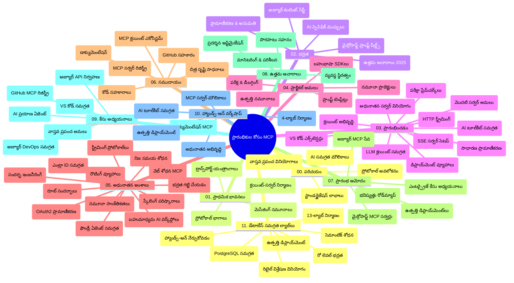

<!--
CO_OP_TRANSLATOR_METADATA:
{
  "original_hash": "af27b0acfae6caa134d9701453884df8",
  "translation_date": "2025-12-11T09:32:02+00:00",
  "source_file": "study_guide.md",
  "language_code": "te"
}
-->
# మోడల్ కాంటెక్స్ట్ ప్రోటోకాల్ (MCP) ప్రారంభికుల కోసం - అధ్యయన గైడ్

ఈ అధ్యయన గైడ్ "మోడల్ కాంటెక్స్ట్ ప్రోటోకాల్ (MCP) ప్రారంభికుల కోసం" పాఠ్యాంశం యొక్క రిపాజిటరీ నిర్మాణం మరియు విషయాల సమీక్షను అందిస్తుంది. రిపాజిటరీని సమర్థవంతంగా నావిగేట్ చేయడానికి మరియు అందుబాటులో ఉన్న వనరులను గరిష్టంగా ఉపయోగించుకోవడానికి ఈ గైడ్ ఉపయోగించండి.

## రిపాజిటరీ అవలోకనం

మోడల్ కాంటెక్స్ట్ ప్రోటోకాల్ (MCP) అనేది AI మోడల్స్ మరియు క్లయింట్ అప్లికేషన్ల మధ్య పరస్పర చర్యలకు ఒక ప్రమాణీకృత ఫ్రేమ్‌వర్క్. మొదట Anthropic ద్వారా సృష్టించబడిన MCP ఇప్పుడు అధికారిక GitHub సంస్థ ద్వారా విస్తృత MCP కమ్యూనిటీ ద్వారా నిర్వహించబడుతుంది. ఈ రిపాజిటరీ AI డెవలపర్లు, సిస్టమ్ ఆర్కిటెక్ట్స్ మరియు సాఫ్ట్‌వేర్ ఇంజనీర్ల కోసం రూపొందించిన C#, Java, JavaScript, Python, మరియు TypeScript లో హ్యాండ్స్-ఆన్ కోడ్ ఉదాహరణలతో సమగ్ర పాఠ్యాంశాన్ని అందిస్తుంది.

## విజువల్ పాఠ్యాంశ మ్యాప్

## రిపాజిటరీ నిర్మాణం

రిపాజిటరీ పదకొండు ప్రధాన విభాగాలుగా ఏర్పాటు చేయబడింది, ప్రతి ఒక్కటి MCP యొక్క వేర్వేరు అంశాలపై దృష్టి సారిస్తుంది:

1. **పరిచయం (00-Introduction/)**
   - మోడల్ కాంటెక్స్ట్ ప్రోటోకాల్ అవలోకనం
   - AI పైప్లైన్లలో ప్రమాణీకరణ ఎందుకు ముఖ్యం
   - ప్రాక్టికల్ ఉపయోగాలు మరియు లాభాలు

2. **ప్రధాన భావనలు (01-CoreConcepts/)**
   - క్లయింట్-సర్వర్ ఆర్కిటెక్చర్
   - కీలక ప్రోటోకాల్ భాగాలు
   - MCP లో మెసేజింగ్ నమూనాలు

3. **భద్రత (02-Security/)**
   - MCP ఆధారిత సిస్టమ్స్ లో భద్రతా ముప్పులు
   - అమలు భద్రత కోసం ఉత్తమ పద్ధతులు
   - ప్రామాణీకరణ మరియు అనుమతుల వ్యూహాలు
   - **సమగ్ర భద్రతా డాక్యుమెంటేషన్**:
     - MCP భద్రత ఉత్తమ పద్ధతులు 2025
     - Azure కంటెంట్ సేఫ్టీ అమలు గైడ్
     - MCP భద్రత నియంత్రణలు మరియు సాంకేతికతలు
     - MCP ఉత్తమ పద్ధతులు తక్షణ సూచిక
   - **కీలక భద్రతా అంశాలు**:
     - ప్రాంప్ట్ ఇంజెక్షన్ మరియు టూల్ విషపూరణ దాడులు
     - సెషన్ హైజాకింగ్ మరియు గందరగోళ డిప్యూటీ సమస్యలు
     - టోకెన్ పాస్త్రూ లోపాలు
     - అధిక అనుమతులు మరియు యాక్సెస్ నియంత్రణ
     - AI భాగాల సరఫరా గొలుసు భద్రత
     - Microsoft ప్రాంప్ట్ షీల్డ్స్ ఇంటిగ్రేషన్

4. **ప్రారంభం (03-GettingStarted/)**
   - పరిసరాల సెటప్ మరియు కాన్ఫిగరేషన్
   - ప్రాథమిక MCP సర్వర్లు మరియు క్లయింట్ల సృష్టి
   - ఉన్న అప్లికేషన్లతో ఇంటిగ్రేషన్
   - ఈ విభాగంలో ఉన్నాయి:
     - మొదటి సర్వర్ అమలు
     - క్లయింట్ అభివృద్ధి
     - LLM క్లయింట్ ఇంటిగ్రేషన్
     - VS కోడ్ ఇంటిగ్రేషన్
     - సర్వర్-సెంట్ ఈవెంట్స్ (SSE) సర్వర్
     - అధునాతన సర్వర్ వినియోగం
     - HTTP స్ట్రీమింగ్
     - AI టూల్‌కిట్ ఇంటిగ్రేషన్
     - పరీక్షా వ్యూహాలు
     - డిప్లాయ్‌మెంట్ మార్గదర్శకాలు

5. **ప్రాక్టికల్ అమలు (04-PracticalImplementation/)**
   - వివిధ ప్రోగ్రామింగ్ భాషలలో SDK ల వినియోగం
   - డీబగ్గింగ్, పరీక్షలు, మరియు ధృవీకరణ సాంకేతికతలు
   - పునర్వినియోగపరచదగిన ప్రాంప్ట్ టెంప్లేట్లు మరియు వర్క్‌ఫ్లోలు రూపొందించడం
   - అమలు ఉదాహరణలతో నమూనా ప్రాజెక్టులు

6. **అధునాతన అంశాలు (05-AdvancedTopics/)**
   - కాంటెక్స్ట్ ఇంజనీరింగ్ సాంకేతికతలు
   - ఫౌండ్రీ ఏజెంట్ ఇంటిగ్రేషన్
   - బహుముఖ AI వర్క్‌ఫ్లోలు
   - OAuth2 ప్రామాణీకరణ డెమోలు
   - రియల్-టైమ్ సెర్చ్ సామర్థ్యాలు
   - రియల్-టైమ్ స్ట్రీమింగ్
   - రూట్ కాంటెక్స్ట్ అమలు
   - రౌటింగ్ వ్యూహాలు
   - శాంప్లింగ్ సాంకేతికతలు
   - స్కేలింగ్ విధానాలు
   - భద్రతా పరిగణనలు
   - Entra ID భద్రతా ఇంటిగ్రేషన్
   - వెబ్ సెర్చ్ ఇంటిగ్రేషన్

7. **కమ్యూనిటీ కాంట్రిబ్యూషన్స్ (06-CommunityContributions/)**
   - కోడ్ మరియు డాక్యుమెంటేషన్ లో ఎలా సహకరించాలి
   - GitHub ద్వారా సహకారం
   - కమ్యూనిటీ ఆధారిత మెరుగుదలలు మరియు అభిప్రాయాలు
   - వివిధ MCP క్లయింట్ల వినియోగం (Claude Desktop, Cline, VSCode)
   - ఇమేజ్ జనరేషన్ సహా ప్రముఖ MCP సర్వర్లతో పని

8. **ప్రారంభ దశ నుండి పాఠాలు (07-LessonsfromEarlyAdoption/)**
   - వాస్తవ ప్రపంచ అమలు మరియు విజయ కథలు
   - MCP ఆధారిత పరిష్కారాల నిర్మాణం మరియు డిప్లాయ్‌మెంట్
   - ధోరణులు మరియు భవిష్యత్ రోడ్‌మ్యాప్
   - **Microsoft MCP సర్వర్లు గైడ్**: 10 ప్రొడక్షన్-రెడీ Microsoft MCP సర్వర్ల సమగ్ర గైడ్, అందులో:
     - Microsoft Learn Docs MCP సర్వర్
     - Azure MCP సర్వర్ (15+ ప్రత్యేక కనెక్టర్లు)
     - GitHub MCP సర్వర్
     - Azure DevOps MCP సర్వర్
     - MarkItDown MCP సర్వర్
     - SQL Server MCP సర్వర్
     - Playwright MCP సర్వర్
     - Dev Box MCP సర్వర్
     - Azure AI Foundry MCP సర్వర్
     - Microsoft 365 Agents Toolkit MCP సర్వర్

9. **ఉత్తమ పద్ధతులు (08-BestPractices/)**
   - పనితీరు ట్యూనింగ్ మరియు ఆప్టిమైజేషన్
   - ఫాల్ట్-టోలరెంట్ MCP సిస్టమ్స్ డిజైన్
   - పరీక్షలు మరియు ప్రతిఘటన వ్యూహాలు

10. **కేస్ స్టడీస్ (09-CaseStudy/)**
    - MCP బహుముఖతను వివిధ సందర్భాలలో చూపించే **ఏడు సమగ్ర కేస్ స్టడీస్**:
    - **Azure AI ట్రావెల్ ఏజెంట్స్**: Azure OpenAI మరియు AI సెర్చ్ తో బహుళ ఏజెంట్ ఆర్కెస్ట్రేషన్
    - **Azure DevOps ఇంటిగ్రేషన్**: YouTube డేటా నవీకరణలతో వర్క్‌ఫ్లో ప్రాసెస్ ఆటోమేషన్
    - **రియల్-టైమ్ డాక్యుమెంటేషన్ రిట్రీవల్**: స్ట్రీమింగ్ HTTP తో Python కన్సోల్ క్లయింట్
    - **ఇంటరాక్టివ్ స్టడీ ప్లాన్ జనరేటర్**: Chainlit వెబ్ యాప్ సంభాషణాత్మక AI తో
    - **ఇన్-ఎడిటర్ డాక్యుమెంటేషన్**: VS కోడ్ ఇంటిగ్రేషన్ GitHub Copilot వర్క్‌ఫ్లోలతో
    - **Azure API మేనేజ్‌మెంట్**: MCP సర్వర్ సృష్టితో ఎంటర్‌ప్రైజ్ API ఇంటిగ్రేషన్
    - **GitHub MCP రిజిస్ట్రీ**: ఎకోసిస్టమ్ అభివృద్ధి మరియు ఏజెంటిక్ ఇంటిగ్రేషన్ ప్లాట్‌ఫారమ్
    - ఎంటర్‌ప్రైజ్ ఇంటిగ్రేషన్, డెవలపర్ ఉత్పాదకత, మరియు ఎకోసిస్టమ్ అభివృద్ధి విస్తృత అమలు ఉదాహరణలు

11. **హ్యాండ్స్-ఆన్ వర్క్‌షాప్ (10-StreamliningAIWorkflowsBuildingAnMCPServerWithAIToolkit/)**
    - MCP మరియు AI టూల్‌కిట్ కలిపిన సమగ్ర హ్యాండ్స్-ఆన్ వర్క్‌షాప్
    - AI మోడల్స్ మరియు వాస్తవ ప్రపంచ టూల్స్ మధ్య బుద్ధిమంతమైన అప్లికేషన్లు నిర్మాణం
    - ప్రాథమికాలు, కస్టమ్ సర్వర్ అభివృద్ధి, మరియు ప్రొడక్షన్ డిప్లాయ్‌మెంట్ వ్యూహాలను కవర్ చేసే ప్రాక్టికల్ మాడ్యూల్స్
    - **ల్యాబ్ నిర్మాణం**:
      - ల్యాబ్ 1: MCP సర్వర్ ప్రాథమికాలు
      - ల్యాబ్ 2: అధునాతన MCP సర్వర్ అభివృద్ధి
      - ల్యాబ్ 3: AI టూల్‌కిట్ ఇంటిగ్రేషన్
      - ల్యాబ్ 4: ప్రొడక్షన్ డిప్లాయ్‌మెంట్ మరియు స్కేలింగ్
    - దశల వారీ సూచనలతో ల్యాబ్ ఆధారిత అభ్యాసం

12. **MCP సర్వర్ డేటాబేస్ ఇంటిగ్రేషన్ ల్యాబ్స్ (11-MCPServerHandsOnLabs/)**
    - ప్రొడక్షన్-రెడీ MCP సర్వర్లు PostgreSQL ఇంటిగ్రేషన్ తో నిర్మించడానికి **సమగ్ర 13-ల్యాబ్ అభ్యాస మార్గం**
    - Zava రిటైల్ ఉపయోగ కేసుతో వాస్తవ ప్రపంచ రిటైల్ అనలిటిక్స్ అమలు
    - ఎంటర్‌ప్రైజ్-గ్రేడ్ నమూనాలు, అందులో రో లెవల్ సెక్యూరిటీ (RLS), సెమాంటిక్ సెర్చ్, మరియు బహుళ-టెనెంట్ డేటా యాక్సెస్
    - **పూర్తి ల్యాబ్ నిర్మాణం**:
      - **ల్యాబ్స్ 00-03: పునాది** - పరిచయం, ఆర్కిటెక్చర్, భద్రత, పరిసరాల సెటప్
      - **ల్యాబ్స్ 04-06: MCP సర్వర్ నిర్మాణం** - డేటాబేస్ డిజైన్, MCP సర్వర్ అమలు, టూల్ అభివృద్ధి
      - **ల్యాబ్స్ 07-09: అధునాతన ఫీచర్లు** - సెమాంటిక్ సెర్చ్, పరీక్షలు & డీబగ్గింగ్, VS కోడ్ ఇంటిగ్రేషన్
      - **ల్యాబ్స్ 10-12: ప్రొడక్షన్ & ఉత్తమ పద్ధతులు** - డిప్లాయ్‌మెంట్, మానిటరింగ్, ఆప్టిమైజేషన్
    - **సాంకేతికతలు**: FastMCP ఫ్రేమ్‌వర్క్, PostgreSQL, Azure OpenAI, Azure కంటైనర్ యాప్స్, అప్లికేషన్ ఇన్సైట్స్
    - **అభ్యాస ఫలితాలు**: ప్రొడక్షన్-రెడీ MCP సర్వర్లు, డేటాబేస్ ఇంటిగ్రేషన్ నమూనాలు, AI ఆధారిత అనలిటిక్స్, ఎంటర్‌ప్రైజ్ భద్రత

## అదనపు వనరులు

రిపాజిటరీలో సహాయక వనరులు ఉన్నాయి:

- **Images ఫోల్డర్**: పాఠ్యాంశం అంతటా ఉపయోగించిన డయాగ్రామ్లు మరియు చిత్రాలు
- **అనువాదాలు**: డాక్యుమెంటేషన్ యొక్క బహుభాషా మద్దతు మరియు ఆటోమేటెడ్ అనువాదాలు
- **అధికారిక MCP వనరులు**:
  - [MCP డాక్యుమెంటేషన్](https://modelcontextprotocol.io/)
  - [MCP స్పెసిఫికేషన్](https://spec.modelcontextprotocol.io/)
  - [MCP GitHub రిపాజిటరీ](https://github.com/modelcontextprotocol)

## ఈ రిపాజిటరీని ఎలా ఉపయోగించాలి

1. **క్రమబద్ధమైన అభ్యాసం**: 00 నుండి 11 వరకు అధ్యాయాలను క్రమంగా అనుసరించండి.
2. **భాషా-ప్రత్యేక దృష్టి**: మీరు ఆసక్తి ఉన్న ప్రోగ్రామింగ్ భాషలో అమలు కోసం నమూనా డైరెక్టరీలను అన్వేషించండి.
3. **ప్రాక్టికల్ అమలు**: "Getting Started" విభాగంతో ప్రారంభించి మీ పరిసరాలను సెటప్ చేసి మొదటి MCP సర్వర్ మరియు క్లయింట్ సృష్టించండి.
4. **అధునాతన అన్వేషణ**: ప్రాథమికాలు అర్థమయ్యాక, మీ జ్ఞానాన్ని విస్తరించడానికి అధునాతన అంశాలలోకి దిగండి.
5. **కమ్యూనిటీ పాల్గొనడం**: MCP కమ్యూనిటీతో GitHub చర్చలు మరియు Discord ఛానల్స్ ద్వారా చేరండి, నిపుణులు మరియు ఇతర డెవలపర్లతో కనెక్ట్ అవ్వండి.

## MCP క్లయింట్లు మరియు టూల్స్

పాఠ్యాంశం వివిధ MCP క్లయింట్లు మరియు టూల్స్ ను కవర్ చేస్తుంది:

1. **అధికారిక క్లయింట్లు**:
   - Visual Studio Code
   - MCP Visual Studio Code లో
   - Claude Desktop
   - VSCode లో Claude
   - Claude API

2. **కమ్యూనిటీ క్లయింట్లు**:
   - Cline (టెర్మినల్ ఆధారిత)
   - Cursor (కోడ్ ఎడిటర్)
   - ChatMCP
   - Windsurf

3. **MCP మేనేజ్‌మెంట్ టూల్స్**:
   - MCP CLI
   - MCP మేనేజర్
   - MCP లింకర్
   - MCP రౌటర్

## ప్రముఖ MCP సర్వర్లు

రిపాజిటరీ వివిధ MCP సర్వర్లను పరిచయం చేస్తుంది, అందులో:

1. **అధికారిక Microsoft MCP సర్వర్లు**:
   - Microsoft Learn Docs MCP సర్వర్
   - Azure MCP సర్వర్ (15+ ప్రత్యేక కనెక్టర్లు)
   - GitHub MCP సర్వర్
   - Azure DevOps MCP సర్వర్
   - MarkItDown MCP సర్వర్
   - SQL Server MCP సర్వర్
   - Playwright MCP సర్వర్
   - Dev Box MCP సర్వర్
   - Azure AI Foundry MCP సర్వర్
   - Microsoft 365 Agents Toolkit MCP సర్వర్

2. **అధికారిక రిఫరెన్స్ సర్వర్లు**:
   - ఫైల్‌సిస్టమ్
   - Fetch
   - మెమరీ
   - సీక్వెన్షియల్ థింకింగ్

3. **ఇమేజ్ జనరేషన్**:
   - Azure OpenAI DALL-E 3
   - Stable Diffusion WebUI
   - Replicate

4. **అభివృద్ధి టూల్స్**:
   - Git MCP
   - టెర్మినల్ కంట్రోల్
   - కోడ్ అసిస్టెంట్

5. **ప్రత్యేక సర్వర్లు**:
   - Salesforce
   - Microsoft Teams
   - Jira & Confluence

## సహకారం

ఈ రిపాజిటరీ కమ్యూనిటీ నుండి సహకారాలను స్వాగతిస్తుంది. MCP ఎకోసిస్టమ్‌కు సమర్థవంతంగా ఎలా సహకరించాలో గైడ్ కోసం కమ్యూనిటీ కాంట్రిబ్యూషన్స్ విభాగాన్ని చూడండి.

----

*ఈ అధ్యయన గైడ్ 2025 అక్టోబర్ 6న నవీకరించబడింది మరియు ఆ తేదీ నాటికి రిపాజిటరీ యొక్క సమీక్షను అందిస్తుంది. ఆ తేదీ తర్వాత రిపాజిటరీ విషయం నవీకరించబడవచ్చు.*

---

<!-- CO-OP TRANSLATOR DISCLAIMER START -->
**అస్పష్టత**:  
ఈ పత్రాన్ని AI అనువాద సేవ [Co-op Translator](https://github.com/Azure/co-op-translator) ఉపయోగించి అనువదించబడింది. మేము ఖచ్చితత్వానికి ప్రయత్నించినప్పటికీ, ఆటోమేటెడ్ అనువాదాల్లో పొరపాట్లు లేదా తప్పిదాలు ఉండవచ్చు. మూల పత్రం దాని స్వదేశీ భాషలో అధికారిక మూలంగా పరిగణించాలి. ముఖ్యమైన సమాచారానికి, ప్రొఫెషనల్ మానవ అనువాదం సిఫార్సు చేయబడుతుంది. ఈ అనువాదం వాడకం వల్ల కలిగే ఏవైనా అపార్థాలు లేదా తప్పుదారితీసే అర్థాలు కోసం మేము బాధ్యత వహించము.
<!-- CO-OP TRANSLATOR DISCLAIMER END -->