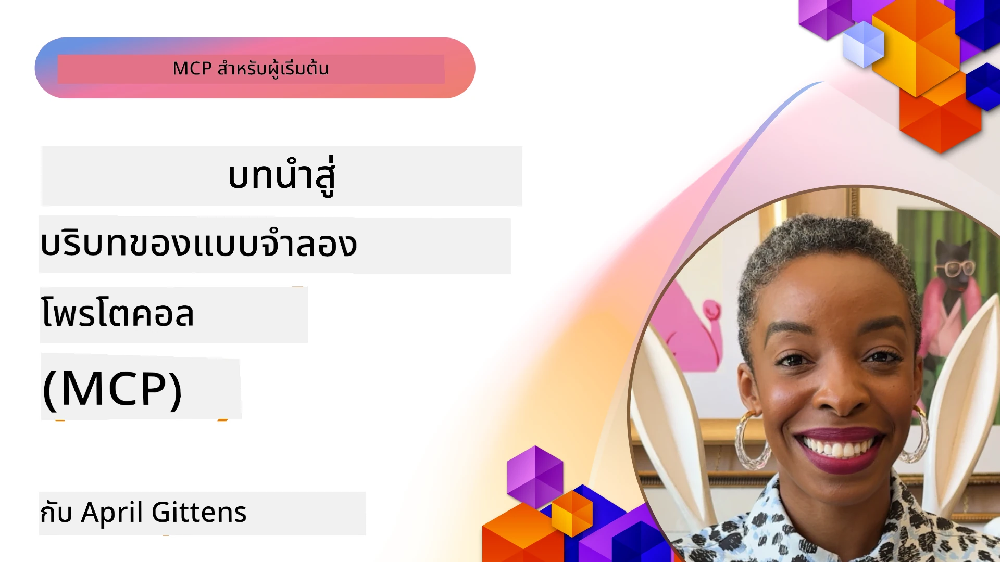
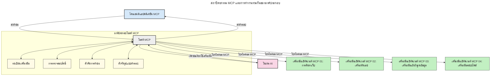

# บทนำสู่โปรโตคอลบริบทของโมเดล (MCP): ทำไมจึงสำคัญสำหรับแอปพลิเคชัน AI ที่ปรับขนาดได้

[](https://youtu.be/agBbdiOPLQA)

_(คลิกที่ภาพด้านบนเพื่อดูวิดีโอบทเรียนนี้)_

แอปพลิเคชัน AI สร้างสรรค์เป็นก้าวที่ดีเพราะมักจะให้ผู้ใช้โต้ตอบกับแอปโดยใช้คำสั่งภาษาธรรมชาติ อย่างไรก็ตาม เมื่อมีการลงทุนเวลาและทรัพยากรมากขึ้นในแอปเหล่านี้ คุณต้องแน่ใจว่าสามารถผสานฟังก์ชันและทรัพยากรต่าง ๆ ได้ง่ายในลักษณะที่ขยายอย่างง่ายดาย แอปของคุณสามารถรองรับมากกว่าหนึ่งโมเดลที่ใช้ และจัดการกับความซับซ้อนของโมเดลต่าง ๆ ได้ กล่าวโดยสั้น การสร้างแอป Gen AI เริ่มต้นง่าย แต่เมื่อขยายตัวและซับซ้อนขึ้น คุณจะต้องเริ่มกำหนดสถาปัตยกรรมและมักจะต้องพึ่งพามาตรฐานเพื่อให้มั่นใจว่าแอปของคุณสร้างขึ้นอย่างสอดคล้องกัน นี่คือจุดที่ MCP เข้ามาจัดระเบียบและให้มาตรฐาน

---

## **🔍 โปรโตคอลบริบทของโมเดล (MCP) คืออะไร?**

**โปรโตคอลบริบทของโมเดล (MCP)** คือ **อินเทอร์เฟซมาตรฐานเปิด** ที่อนุญาตให้โมเดลภาษาขนาดใหญ่ (LLMs) โต้ตอบกับเครื่องมือภายนอก, API, และแหล่งข้อมูลได้อย่างไร้รอยต่อ มันให้สถาปัตยกรรมที่สม่ำเสมอเพื่อเพิ่มความสามารถของโมเดล AI นอกเหนือจากข้อมูลฝึกฝน ช่วยให้ระบบ AI มีความชาญฉลาด, ปรับขนาดได้, และตอบสนองได้ดีขึ้น

---

## **🎯 ทำไมการมีมาตรฐานใน AI จึงสำคัญ**

เมื่อแอปพลิเคชัน AI สร้างสรรค์มีความซับซ้อนมากขึ้น จำเป็นต้องนำมาตรฐานมาใช้เพื่อให้มั่นใจใน **การปรับขนาด, การขยายความสามารถ, การบำรุงรักษา,** และ **หลีกเลี่ยงการล็อกกับผู้ขาย** MCP ตอบสนองความต้องการเหล่านี้โดย:

- รวมการเชื่อมต่อโมเดลกับเครื่องมือให้เป็นหนึ่งเดียว
- ลดโซลูชันที่ปรับแต่งเฉพาะและเปราะบาง
- อนุญาตให้ใช้หลายโมเดลจากผู้ขายต่าง ๆ ร่วมกันในระบบนิเวศเดียว

**หมายเหตุ:** แม้ MCP จะเรียกตัวเองว่าเป็นมาตรฐานเปิด แต่ไม่มีแผนที่จะทำให้ MCP เป็นมาตรฐานผ่านองค์กรมาตรฐานที่มีอยู่ เช่น IEEE, IETF, W3C, ISO หรือองค์กรมาตรฐานอื่นใด

---

## **📚 วัตถุประสงค์การเรียนรู้**

เมื่ออ่านบทความนี้จบ คุณจะสามารถ:

- นิยาม **โปรโตคอลบริบทของโมเดล (MCP)** และกรณีการใช้งานของมัน
- เข้าใจวิธีที่ MCP มาตรฐานการสื่อสารระหว่างโมเดลกับเครื่องมือ
- ระบุส่วนประกอบหลักของสถาปัตยกรรม MCP
- สำรวจแอปพลิเคชันจริงของ MCP ในบริบทองค์กรและการพัฒนา

---

## **💡 ทำไมโปรโตคอลบริบทของโมเดล (MCP) จึงเป็นการเปลี่ยนเกม**

### **🔗 MCP แก้ปัญหาการแตกกระจายในการโต้ตอบ AI**

ก่อน MCP การรวมโมเดลเข้ากับเครื่องมือจำเป็นต้องใช้:

- โค้ดเฉพาะสำหรับคู่เครื่องมือ-โมเดลแต่ละคู่
- API ที่ไม่เป็นมาตรฐานสำหรับแต่ละผู้ขาย
- การขัดจังหวะบ่อยครั้งเนื่องจากการอัปเดต
- ความสามารถในการปรับขนาดที่ต่ำเมื่อมีเครื่องมือเพิ่มขึ้น

### **✅ ประโยชน์ของการมาตรฐาน MCP**

| **ประโยชน์**              | **คำอธิบาย**                                                               |
|--------------------------|-----------------------------------------------------------------------------|
| ความสามารถในการทำงานร่วมกัน | LLMs ทำงานร่วมกับเครื่องมือจากผู้ขายต่าง ๆ ได้อย่างไร้รอยต่อ                |
| ความสม่ำเสมอ              | พฤติกรรมเป็นหนึ่งเดียวทั้งบนแพลตฟอร์มและเครื่องมือต่าง ๆ                |
| การนำกลับมาใช้ใหม่        | เครื่องมือที่สร้างครั้งเดียวสามารถใช้ในหลายโครงการและระบบ                  |
| เร่งการพัฒนา              | ลดเวลาพัฒนาด้วยการใช้อินเทอร์เฟซสแตนด์ดาร์ดแบบเสียบแล้วใช้ได้ทันที           |

---

## **🧱 ภาพรวมสถาปัตยกรรม MCP ระดับสูง**

MCP ใช้ **โมเดลไคลเอนต์-เซิร์ฟเวอร์** โดย:

- **MCP Hosts** รันโมเดล AI
- **MCP Clients** เริ่มการร้องขอ
- **MCP Servers** ให้บริบท, เครื่องมือ และความสามารถ

### **ส่วนประกอบหลัก:**

- **Resources** – ข้อมูลแบบคงที่หรือแบบไดนามิกสำหรับโมเดล  
- **Prompts** – เวิร์กโฟลว์ที่กำหนดไว้ล่วงหน้าสำหรับการสร้างแบบมีการแนะนำ  
- **Tools** – ฟังก์ชันที่ใช้งานได้ เช่น การค้นหา, การคำนวณ  
- **Sampling** – พฤติกรรมแบบเอกซ์เพรสซีฟผ่านการโต้ตอบซ้ำ  
- **Elicitation** – คำร้องขอที่เซิร์ฟเวอร์เป็นผู้เริ่มต้นเพื่อรับข้อมูลจากผู้ใช้
- **Roots** – ขอบเขตระบบไฟล์สำหรับการควบคุมการเข้าถึงเซิร์ฟเวอร์

### **สถาปัตยกรรมโปรโตคอล:**

MCP ใช้สถาปัตยกรรมสองชั้น:
- **Data Layer**: การสื่อสารแบบ JSON-RPC 2.0 พร้อมการจัดการวงจรชีวิตและ primitives
- **Transport Layer**: ช่องทางการสื่อสาร STDIO (ภายในเครื่อง) และ Streamable HTTP พร้อม SSE (ระยะไกล)

---

## วิธีการทำงานของเซิร์ฟเวอร์ MCP

เซิร์ฟเวอร์ MCP ทำงานดังนี้:

- **กระบวนการร้องขอ**:
    1. การร้องขอถูกเริ่มโดยผู้ใช้สุดท้ายหรือซอฟต์แวร์ที่ทำงานแทน
    2. **MCP Client** ส่งคำร้องไปยัง **MCP Host** ซึ่งจัดการรันไทม์โมเดล AI
    3. **โมเดล AI** รับคำสั่งผู้ใช้และอาจร้องขอการเข้าถึงเครื่องมือหรือข้อมูลภายนอกผ่านการเรียกเครื่องมือหนึ่งหรือมากกว่า
    4. **MCP Host** ไม่ใช่โมเดลโดยตรง ติดต่อกับ **MCP Server(s)** ที่เหมาะสมโดยใช้โปรโตคอลมาตรฐาน
- **ฟังก์ชันของ MCP Host**:
    - **Tool Registry**: บำรุงรักษาคุณสมบัติของเครื่องมือและความสามารถ
    - **Authentication**: ยืนยันสิทธิ์เข้าถึงเครื่องมือ
    - **Request Handler**: ประมวลผลคำร้องขอเครื่องมือจากโมเดล
    - **Response Formatter**: จัดรูปแบบผลลัพธ์จากเครื่องมือให้อยู่ในรูปแบบที่โมเดลเข้าใจ
- **การทำงานของ MCP Server**:
    - **MCP Host** ส่งต่อเรียกเครื่องมือไปยังหนึ่งหรือมากกว่า **MCP Servers** ซึ่งแต่ละเครื่องเปิดเผยฟังก์ชันพิเศษ เช่น การค้นหา, การคำนวณ, การสืบค้นฐานข้อมูล
    - **MCP Servers** ดำเนินการของตนและส่งกลับผลลัพธ์ไปยัง **MCP Host** ในรูปแบบที่สม่ำเสมอ
    - **MCP Host** จัดรูปแบบและส่งต่อนั้นไปยัง **โมเดล AI**
- **การตอบกลับคำขอเสร็จสิ้น**:
    - **โมเดล AI** รวมผลลัพธ์จากเครื่องมือในคำตอบสุดท้าย
    - **MCP Host** ส่งคำตอบนี้กลับไปยัง **MCP Client** ที่ส่งมอบให้ผู้ใช้สุดท้ายหรือซอฟต์แวร์ผู้เรียก


## 👨‍💻 วิธีสร้างเซิร์ฟเวอร์ MCP (พร้อมตัวอย่าง)

เซิร์ฟเวอร์ MCP ช่วยขยายความสามารถของ LLM โดยการให้ข้อมูลและฟังก์ชันการใช้งาน

พร้อมทดสอบหรือยัง? นี่คือ SDK และตัวอย่างสำหรับการสร้างเซิร์ฟเวอร์ MCP ง่าย ๆ ในภาษาและสแตกต่าง ๆ:

- **Python SDK**: https://github.com/modelcontextprotocol/python-sdk

- **TypeScript SDK**: https://github.com/modelcontextprotocol/typescript-sdk

- **Java SDK**: https://github.com/modelcontextprotocol/java-sdk

- **C#/.NET SDK**: https://github.com/modelcontextprotocol/csharp-sdk


## 🌍 กรณีใช้งานจริงของ MCP

MCP ทำให้สามารถสร้างแอปพลิเคชันหลากหลายขยายความสามารถของ AI ได้:

| **แอปพลิเคชัน**                | **คำอธิบาย**                                                               |
|------------------------------|-----------------------------------------------------------------------------|
| การบูรณาการข้อมูลองค์กร        | เชื่อมต่อ LLMs กับฐานข้อมูล, CRM หรือเครื่องมือภายใน                        |
| ระบบ AI ที่เป็นตัวแทน          | เปิดใช้งานตัวแทนอิสระที่เข้าถึงเครื่องมือและเวิร์กโฟลว์การตัดสินใจ          |
| แอปมัลติโมดัล                  | ผสมผสานเครื่องมือข้อความ, รูปภาพ และเสียงในแอป AI เดียวกัน                 |
| การรวมข้อมูลแบบเรียลไทม์       | นำข้อมูลสดเข้ามาในโต้ตอบ AI เพื่อผลลัพธ์ที่แม่นยำและเป็นปัจจุบัน               |


### 🧠 MCP = มาตรฐานสากลสำหรับการโต้ตอบ AI

โปรโตคอลบริบทของโมเดล (MCP) ทำหน้าที่เป็นมาตรฐานสากลสำหรับการโต้ตอบ AI คล้ายกับวิธีที่ USB-C มาตรฐานการเชื่อมต่อทางกายภาพสำหรับอุปกรณ์ ในโลกของ AI MCP ให้ อินเทอร์เฟซที่สม่ำเสมอ ทำให้โมเดล (ไคลเอนต์) สามารถผสานรวมกับเครื่องมือภายนอกและผู้ให้บริการข้อมูล (เซิร์ฟเวอร์) ได้อย่างไร้รอยต่อ นี่ทำให้ไม่ต้องใช้โปรโตคอลแบบต่าง ๆ และเฉพาะสำหรับแต่ละ API หรือแหล่งข้อมูล

ภายใต้ MCP เครื่องมือที่เข้ากันได้กับ MCP (เรียกว่า MCP server) จะทำตามมาตรฐานร่วมกัน เซิร์ฟเวอร์เหล่านี้สามารถแสดงรายการเครื่องมือหรือการกระทำที่มี และดำเนินการตามเมื่อได้รับคำขอจากตัวแทน AI แพลตฟอร์มตัวแทน AI ที่รองรับ MCP สามารถค้นหาเครื่องมือจากเซิร์ฟเวอร์และเรียกใช้งานผ่านโปรโตคอลมาตรฐานนี้ได้

### 💡 ช่วยให้เข้าถึงความรู้ได้ง่ายขึ้น

นอกเหนือจากการเสนอเครื่องมือ MCP ยังช่วยให้เข้าถึงความรู้ได้อีกด้วย มันอนุญาตให้แอปพลิเคชันจัดเตรียมบริบทให้กับโมเดลภาษาขนาดใหญ่ (LLMs) โดยเชื่อมโยงพวกมันกับแหล่งข้อมูลต่าง ๆ ตัวอย่างเช่น MCP server อาจแทนที่คลังเอกสารของบริษัท ทำให้นายหน้าสามารถเข้าถึงข้อมูลที่เกี่ยวข้องได้ตามคำร้องขอ เซิร์ฟเวอร์อีกตัวอาจจัดการการกระทำเฉพาะ เช่น ส่งอีเมลหรืออัปเดตบันทึก จากมุมมองของตัวแทน สิ่งเหล่านี้เป็นเพียงเครื่องมือที่ใช้—บางเครื่องมือส่งข้อมูล (บริบทความรู้) ขณะที่บางเครื่องมือทำการกระทำ MCP บริหารจัดการทั้งสองอย่างอย่างมีประสิทธิภาพ

ตัวแทนที่เชื่อมต่อกับ MCP server จะเรียนรู้ความสามารถและข้อมูลที่เข้าถึงได้ของเซิร์ฟเวอร์นั้นโดยอัตโนมัติผ่านรูปแบบมาตรฐาน การทำให้เป็นมาตรฐานนี้ช่วยให้เครื่องมือพร้อมใช้งานแบบไดนามิก เช่น การเพิ่ม MCP server ใหม่ลงในระบบตัวแทนทำให้ฟังก์ชันของเซิร์ฟเวอร์นั้นสามารถใช้ได้ทันทีโดยไม่ต้องปรับแต่งคำสั่งของตัวแทนเพิ่มเติม

การผสานรวมที่เป็นระเบียบนี้สอดคล้องกับโฟลว์ที่แสดงในแผนภาพต่อไปนี้ โดยเซิร์ฟเวอร์ให้ทั้งเครื่องมือและความรู้ เพื่อให้ระบบทำงานร่วมกันได้อย่างต่อเนื่อง

### 👉 ตัวอย่าง: โซลูชันตัวแทนที่ปรับขนาดได้

```mermaid
---
title: โซลูชันเอเจนต์ที่ปรับขนาดได้ด้วย MCP
description: แผนภาพแสดงให้เห็นว่าผู้ใช้มีปฏิสัมพันธ์กับ LLM ที่เชื่อมต่อกับเซิร์ฟเวอร์ MCP หลายตัว โดยแต่ละเซิร์ฟเวอร์ให้ความรู้และเครื่องมือ สร้างสถาปัตยกรรมระบบ AI ที่ปรับขนาดได้
---
graph TD
    User -->|Prompt| LLM
    LLM -->|Response| User
    LLM -->|MCP| ServerA
    LLM -->|MCP| ServerB
    ServerA -->|Universal connector| ServerB
    ServerA --> KnowledgeA
    ServerA --> ToolsA
    ServerB --> KnowledgeB
    ServerB --> ToolsB

    subgraph Server A
        KnowledgeA[ความรู้]
        ToolsA[เครื่องมือ]
    end

    subgraph Server B
        KnowledgeB[ความรู้]
        ToolsB[เครื่องมือ]
    end
``` เชื่อมต่อสากลเปิดให้ MCP servers สื่อสารและแชร์ความสามารถซึ่งกันและกัน ช่วยให้ ServerA มอบหมายงานให้ ServerB หรืิอเข้าถึงเครื่องมือและความรู้ของมัน นี่คือการรวมเครื่องมือและข้อมูลข้ามเซิร์ฟเวอร์ สนับสนุนสถาปัตยกรรมตัวแทนที่ปรับขนาดและโมดูลาร์ เนื่องจาก MCP มาตรฐานการเปิดเผยเครื่องมือ ตัวแทนจึงสามารถค้นหาและส่งคำร้องขอระหว่างเซิร์ฟเวอร์ได้แบบไดนามิกโดยไม่ต้องผูกโค้ดเข้ากับระบบ

การรวมเครื่องมือและข้อมูล: เครื่องมือและข้อมูลสามารถเข้าถึงได้ข้ามเซิร์ฟเวอร์ ทำให้สถาปัตยกรรมตัวแทนที่ปรับขนาดและโมดูลาร์ง่ายขึ้น

### 🔄 สถานการณ์ MCP ขั้นสูงพร้อมการผสาน LLM ฝั่งไคลเอนต์

นอกสถาปัตยกรรม MCP เบื้องต้น ยังมีสถานการณ์ขั้นสูงที่ทั้งไคลเอนต์และเซิร์ฟเวอร์มี LLM ทำให้เกิดการโต้ตอบที่ซับซ้อนมากขึ้น ในแผนภาพต่อไปนี้ **Client App** อาจเป็น IDE ที่มีเครื่องมือ MCP หลายตัวพร้อมใช้งานสำหรับ LLM:

```mermaid
---
title: สถานการณ์ MCP ขั้นสูงพร้อมการรวม LLM ฝั่งไคลเอนต์-เซิร์ฟเวอร์
description: แผนภาพลำดับขั้นตอนที่แสดงไหล่การโต้ตอบอย่างละเอียดระหว่างผู้ใช้ แอปไคลเอนต์ LLM ไคลเอนต์ เซิร์ฟเวอร์ MCP หลายตัว และ LLM ฝั่งเซิร์ฟเวอร์ แสดงกระบวนการค้นหาเครื่องมือ การโต้ตอบผู้ใช้ การเรียกใช้เครื่องมือโดยตรง และขั้นตอนการเจรจาคุณลักษณะ
---
sequenceDiagram
    autonumber
    actor User as 👤 ผู้ใช้
    participant ClientApp as 🖥️ แอปไคลเอนต์
    participant ClientLLM as 🧠 LLM ฝั่งไคลเอนต์
    participant Server1 as 🔧 เซิร์ฟเวอร์ MCP 1
    participant Server2 as 📚 เซิร์ฟเวอร์ MCP 2
    participant ServerLLM as 🤖 LLM ฝั่งเซิร์ฟเวอร์
    
    %% Discovery Phase
    rect rgb(220, 240, 255)
        Note over ClientApp, Server2: ขั้นตอนการค้นหาเครื่องมือ
        ClientApp->>+Server1: ขอเครื่องมือ/ทรัพยากรที่มี
        Server1-->>-ClientApp: ส่งคืนรายการเครื่องมือ (JSON)
        ClientApp->>+Server2: ขอเครื่องมือ/ทรัพยากรที่มี
        Server2-->>-ClientApp: ส่งคืนรายการเครื่องมือ (JSON)
        Note right of ClientApp: จัดเก็บแคตตาล็อก<br/>เครื่องมือรวมที่เครื่อง
    end
    
    %% User Interaction
    rect rgb(255, 240, 220)
        Note over User, ClientLLM: ขั้นตอนการโต้ตอบผู้ใช้
        User->>+ClientApp: ป้อนคำสั่งภาษาธรรมชาติ
        ClientApp->>+ClientLLM: ส่งต่อคำสั่ง + แคตตาล็อกเครื่องมือ
        ClientLLM->>-ClientLLM: วิเคราะห์คำสั่ง & เลือกเครื่องมือ
    end
    
    %% Scenario A: Direct Tool Calling
    alt Direct Tool Calling
        rect rgb(220, 255, 220)
            Note over ClientApp, Server1: สถานการณ์ A: การเรียกใช้เครื่องมือโดยตรง
            ClientLLM->>+ClientApp: ขอให้เรียกใช้เครื่องมือ
            ClientApp->>+Server1: ดำเนินการเครื่องมือเฉพาะ
            Server1-->>-ClientApp: ส่งคืนผลลัพธ์
            ClientApp->>+ClientLLM: ประมวลผลผลลัพธ์
            ClientLLM-->>-ClientApp: สร้างคำตอบ
            ClientApp-->>-User: แสดงคำตอบสุดท้าย
        end
    
    %% Scenario B: Feature Negotiation (VS Code style)
    else Feature Negotiation (VS Code style)
        rect rgb(255, 220, 220)
            Note over ClientApp, ServerLLM: สถานการณ์ B: การเจรจาคุณลักษณะ
            ClientLLM->>+ClientApp: ระบุความสามารถที่ต้องการ
            ClientApp->>+Server2: เจรจาคุณลักษณะ/ความสามารถ
            Server2->>+ServerLLM: ขอข้อมูลบริบทเพิ่มเติม
            ServerLLM-->>-Server2: ให้ข้อมูลบริบท
            Server2-->>-ClientApp: ส่งคืนคุณลักษณะที่มี
            ClientApp->>+Server2: เรียกใช้เครื่องมือที่เจรจาแล้ว
            Server2-->>-ClientApp: ส่งคืนผลลัพธ์
            ClientApp->>+ClientLLM: ประมวลผลผลลัพธ์
            ClientLLM-->>-ClientApp: สร้างคำตอบ
            ClientApp-->>-User: แสดงคำตอบสุดท้าย
        end
    end
```
## 🔐 ประโยชน์เชิงปฏิบัติของ MCP

ประโยชน์เชิงปฏิบัติจาก MCP มีดังนี้:

- **ข้อมูลปัจจุบัน**: โมเดลสามารถเข้าถึงข้อมูลล่าสุดเกินกว่าข้อมูลที่ฝึกมา
- **การขยายความสามารถ**: โมเดลสามารถใช้เครื่องมือเฉพาะสำหรับงานที่ไม่ได้ฝึกมาก่อน
- **ลดความคลาดเคลื่อน**: แหล่งข้อมูลภายนอกช่วยสร้างข้อมูลที่ถูกต้องจริง
- **ความเป็นส่วนตัว**: ข้อมูลที่ละเอียดอ่อนเก็บไว้ในสภาพแวดล้อมที่ปลอดภัยแทนที่จะฝังในคำสั่ง

## 📌 ข้อคิดสำคัญ

นี่คือข้อคิดสำคัญในการใช้ MCP:

- **MCP** มาตรฐานการโต้ตอบของโมเดล AI กับเครื่องมือและข้อมูล
- ส่งเสริม **การขยายตัว, ความสม่ำเสมอ, และการทำงานร่วมกัน**
- MCP ช่วย **ลดเวลาในการพัฒนา, ปรับปรุงความน่าเชื่อถือ, และขยายความสามารถของโมเดล**
- สถาปัตยกรรมไคลเอนต์-เซิร์ฟเวอร์ช่วยให้แอป AI มีความยืดหยุ่นและขยายคุณสมบัติได้ง่าย

## 🧠 แบบฝึกหัด

คิดเกี่ยวกับแอป AI ที่คุณสนใจสร้าง

- มี **เครื่องมือหรือข้อมูลภายนอก** ใดที่จะช่วยเพิ่มความสามารถบ้าง?
- MCP จะช่วยให้การผสานรวม **ง่ายขึ้นและน่าเชื่อถือขึ้นอย่างไร?**

## แหล่งข้อมูลเพิ่มเติม

- [MCP GitHub Repository](https://github.com/modelcontextprotocol)


## ขั้นตอนถัดไป

ถัดไป: [บทที่ 1: แนวคิดหลัก](../01-CoreConcepts/README.md)

---

<!-- CO-OP TRANSLATOR DISCLAIMER START -->
**ข้อจำกัดความรับผิดชอบ**:  
เอกสารนี้ได้ถูกแปลโดยใช้บริการแปลภาษาด้วย AI [Co-op Translator](https://github.com/Azure/co-op-translator) แม้เราจะพยายามให้ความถูกต้องสูงสุด แต่โปรดทราบว่าการแปลอัตโนมัติอาจมีข้อผิดพลาดหรือความไม่ถูกต้องได้ เอกสารต้นฉบับในภาษาต้นฉบับของเอกสารนั้นควรถูกพิจารณาเป็นแหล่งข้อมูลที่ถูกต้อง สำหรับข้อมูลที่สำคัญ ควรใช้การแปลโดยมนุษย์มืออาชีพ เราไม่รับผิดชอบต่อความเข้าใจผิดหรือการตีความผิดที่เกิดจากการใช้การแปลนี้
<!-- CO-OP TRANSLATOR DISCLAIMER END -->