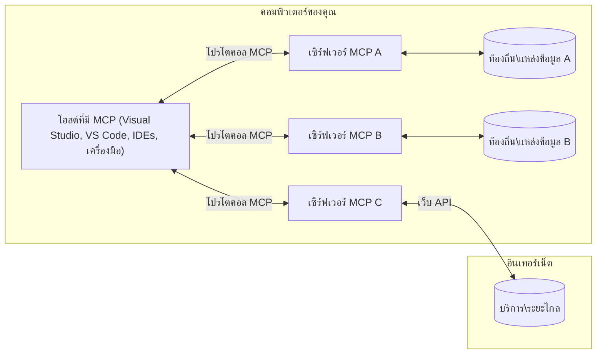

# MCP Core Concepts: การเรียนรู้โปรโตคอลบริบทของโมเดลสำหรับการผสานรวม AI

[](https://youtu.be/earDzWGtE84)

_(คลิกภาพด้านบนเพื่อดูวิดีโอของบทเรียนนี้)_

[Model Context Protocol (MCP)](https://github.com/modelcontextprotocol) คือกรอบการทำงานมาตรฐานที่ทรงพลังซึ่งเพิ่มประสิทธิภาพการสื่อสารระหว่าง Large Language Models (LLMs) และเครื่องมือ แอปพลิเคชัน และแหล่งข้อมูลภายนอก  
คู่มือนี้จะนำคุณผ่านแนวคิดหลักของ MCP คุณจะได้เรียนรู้เกี่ยวกับสถาปัตยกรรมแบบไคลเอนต์-เซิร์ฟเวอร์ ส่วนประกอบสำคัญ กลไกการสื่อสาร และแนวทางปฏิบัติที่ดีที่สุดสำหรับการใช้งาน

- **ความยินยอมของผู้ใช้ที่ชัดเจน**: การเข้าถึงข้อมูลและการดำเนินการทั้งหมดต้องได้รับการอนุมัติจากผู้ใช้ล่วงหน้าชัดเจน ผู้ใช้ต้องเข้าใจอย่างชัดเจนว่าข้อมูลใดที่จะถูกเข้าถึงและจะดำเนินการอะไรบ้าง โดยมีการควบคุมสิทธิ์และการอนุญาตอย่างละเอียด  

- **การปกป้องความเป็นส่วนตัวของข้อมูล**: ข้อมูลของผู้ใช้จะถูกเปิดเผยเฉพาะเมื่อได้รับความยินยอมอย่างชัดแจ้งและต้องได้รับการป้องกันด้วยระบบควบคุมการเข้าถึงที่เข้มงวดตลอดวงจรชีวิตของการโต้ตอบ ส่วนการใช้งานต้องป้องกันการส่งข้อมูลโดยไม่ได้รับอนุญาตและรักษาข้อจำกัดความเป็นส่วนตัวอย่างเคร่งครัด  

- **ความปลอดภัยในการเรียกใช้งานเครื่องมือ**: ทุกครั้งที่เรียกใช้เครื่องมือต้องได้รับความยินยอมจากผู้ใช้อย่างชัดเจน โดยผู้ใช้ต้องเข้าใจฟังก์ชัน พารามิเตอร์ และผลกระทบที่อาจเกิดขึ้นอย่างชัดเจน ขอบเขตความปลอดภัยที่แข็งแกร่งต้องป้องกันการใช้งานเครื่องมือที่ไม่ได้ตั้งใจ, ไม่ปลอดภัย หรือเป็นอันตราย  

- **ความปลอดภัยชั้นการขนส่ง**: ช่องทางการสื่อสารทั้งหมดควรใช้การเข้ารหัสและกลไกการพิสูจน์ตัวตนที่เหมาะสม การเชื่อมต่อระยะไกลต้องใช้โปรโตคอลการขนส่งที่ปลอดภัยและการจัดการข้อมูลประจำตัวที่ถูกต้อง  

#### แนวทางการใช้งาน:

- **การจัดการสิทธิ์**: ใช้ระบบสิทธิ์ที่ละเอียดเพื่อให้ผู้ใช้สามารถควบคุมเซิร์ฟเวอร์ เครื่องมือ และทรัพยากรที่เข้าถึงได้  
- **การพิสูจน์และอนุญาต**: ใช้วิธีการพิสูจน์ตัวตนที่ปลอดภัย (OAuth, API keys) พร้อมการจัดการโทเค็นและการหมดอายุอย่างเหมาะสม  
- **การตรวจสอบข้อมูลนำเข้า**: ตรวจสอบพารามิเตอร์และข้อมูลทั้งหมดตามโครงสร้างที่กำหนดเพื่อป้องกันการโจมตีแบบ Injection  
- **การบันทึกการตรวจสอบ**: เก็บบันทึกการทำงานทั้งหมดอย่างครบถ้วนเพื่อตรวจสอบความปลอดภัยและปฏิบัติตามข้อกำหนด  

## ภาพรวม

บทเรียนนี้สำรวจสถาปัตยกรรมพื้นฐานและส่วนประกอบที่ประกอบกันเป็นระบบนิเวศของ Model Context Protocol (MCP) คุณจะได้เรียนรู้เกี่ยวกับสถาปัตยกรรมแบบไคลเอนต์-เซิร์ฟเวอร์ ส่วนประกอบหลัก และกลไกการสื่อสารที่ขับเคลื่อนการโต้ตอบของ MCP

## วัตถุประสงค์การเรียนรู้หลัก

เมื่อสิ้นสุดบทเรียนนี้ คุณจะ:

- เข้าใจสถาปัตยกรรมไคลเอนต์-เซิร์ฟเวอร์ของ MCP  
- ระบุบทบาทและหน้าที่ของ Hosts, Clients และ Servers  
- วิเคราะห์คุณสมบัติหลักที่ทำให้ MCP เป็นเลเยอร์การผสานรวมที่ยืดหยุ่น  
- เรียนรู้วิธีการไหลของข้อมูลภายในระบบนิเวศ MCP  
- ได้รับข้อมูลเชิงปฏิบัติผ่านตัวอย่างโค้ดใน .NET, Java, Python และ JavaScript  

## สถาปัตยกรรม MCP: มุมมองเชิงลึก

ระบบนิเวศ MCP สร้างขึ้นบนโมเดลไคลเอนต์-เซิร์ฟเวอร์ โครงสร้างแบบโมดูลนี้ช่วยให้แอปพลิเคชัน AI สามารถโต้ตอบกับเครื่องมือ ฐานข้อมูล API และทรัพยากรเชิงบริบทได้อย่างมีประสิทธิภาพ มาแยกรายละเอียดสถาปัตยกรรมนี้เป็นส่วนประกอบหลักกัน

แก่นแท้ของ MCP เป็นสถาปัตยกรรมแบบไคลเอนต์-เซิร์ฟเวอร์ โดยที่แอปพลิเคชันโฮสต์สามารถเชื่อมต่อกับเซิร์ฟเวอร์หลายตัวได้:


- **MCP Hosts**: โปรแกรมเช่น VSCode, Claude Desktop, IDEs หรือเครื่องมือ AI ที่ต้องการเข้าถึงข้อมูลผ่าน MCP  
- **MCP Clients**: โปรโตคอลไคลเอนต์ที่รักษาการเชื่อมต่อแบบ 1:1 กับเซิร์ฟเวอร์  
- **MCP Servers**: โปรแกรมน้ำหนักเบาที่เปิดเผยความสามารถเฉพาะผ่าน Model Context Protocol ที่เป็นมาตรฐาน  
- **แหล่งข้อมูลภายในเครื่อง**: ไฟล์ ฐานข้อมูล และบริการในเครื่องของคุณที่ MCP servers สามารถเข้าถึงได้อย่างปลอดภัย  
- **บริการระยะไกล**: ระบบภายนอกที่เข้าถึงได้ทางอินเทอร์เน็ตซึ่ง MCP servers สามารถเชื่อมต่อผ่าน API  

โปรโตคอล MCP เป็นมาตรฐานที่พัฒนาอย่างต่อเนื่องโดยใช้เวอร์ชันจากวันที่ (รูปแบบ YYYY-MM-DD) เวอร์ชันโปรโตคอลปัจจุบันคือ **2025-11-25** คุณสามารถดูการอัปเดตล่าสุดได้ที่ [เอกสารโปรโตคอล](https://modelcontextprotocol.io/specification/2025-11-25/)  

### 1. Hosts

ใน Model Context Protocol (MCP), **Hosts** คือแอปพลิเคชัน AI ที่ทำหน้าที่เป็นอินเทอร์เฟซหลักที่ผู้ใช้โต้ตอบกับโปรโตคอล Hosts ประสานงานและบริหารจัดการการเชื่อมต่อกับ MCP servers หลายตัวโดยสร้าง MCP clients เฉพาะสำหรับแต่ละการเชื่อมต่อเซิร์ฟเวอร์ ตัวอย่าง Hosts ได้แก่:

- **แอปพลิเคชัน AI**: Claude Desktop, Visual Studio Code, Claude Code  
- **สภาพแวดล้อมการพัฒนา**: IDEs และโปรแกรมแก้ไขโค้ดที่รวม MCP  
- **แอปพลิเคชันที่กำหนดเอง**: ตัวแทนและเครื่องมือ AI ที่สร้างขึ้นตามวัตถุประสงค์  

**Hosts** เป็นแอปพลิเคชันที่ประสานงานการโต้ตอบกับโมเดล AI โดยพวกเขา:

- **จัดการโมเดล AI**: เรียกใช้หรือโต้ตอบกับ LLMs เพื่อสร้างคำตอบและจัดลำดับงาน AI  
- **จัดการการเชื่อมต่อไคลเอนต์**: สร้างและรักษา MCP client หนึ่งตัวต่อการเชื่อมต่อ MCP server หนึ่งตัว  
- **ควบคุมส่วนติดต่อผู้ใช้**: จัดการลำดับการสนทนา การโต้ตอบของผู้ใช้ และการแสดงผลคำตอบ  
- **บังคับใช้ความปลอดภัย**: ควบคุมสิทธิ์ ข้อจำกัดด้านความปลอดภัย และการพิสูจน์ตัวตน  
- **จัดการความยินยอมของผู้ใช้**: ดูแลการอนุมัติการแชร์ข้อมูลและการใช้งานเครื่องมือโดยผู้ใช้  

### 2. Clients

**Clients** เป็นส่วนประกอบสำคัญที่รักษาการเชื่อมต่อแบบหนึ่งต่อหนึ่งระหว่าง Hosts กับ MCP servers แต่ละ MCP client ถูกสร้างโดย Host เพื่อเชื่อมต่อกับ MCP server เฉพาะ ช่วยให้การสื่อสารเป็นระบบและปลอดภัย ไคลเอนต์หลายตัวช่วยให้ Hosts เชื่อมต่อกับเซิร์ฟเวอร์หลายตัวพร้อมกันได้

**Clients** คือส่วนเชื่อมต่อภายในแอปพลิเคชันโฮสต์ โดยพวกเขา:

- **การสื่อสารโปรโตคอล**: ส่งคำขอ JSON-RPC 2.0 ไปยังเซิร์ฟเวอร์พร้อมกับพรอมต์และคำแนะนำ  
- **การเจรจาความสามารถ**: เจรจาการสนับสนุนฟีเจอร์และเวอร์ชันโปรโตคอลกับเซิร์ฟเวอร์ในขั้นเริ่มต้น  
- **การเรียกใช้งานเครื่องมือ**: จัดการคำขอเรียกใช้งานเครื่องมือจากโมเดลและประมวลผลคำตอบ  
- **อัปเดตแบบเรียลไทม์**: จัดการการแจ้งเตือนและอัปเดตแบบเรียลไทม์จากเซิร์ฟเวอร์  
- **การประมวลผลคำตอบ**: ประมวลผลและจัดรูปแบบคำตอบของเซิร์ฟเวอร์เพื่อแสดงให้ผู้ใช้เห็น  

### 3. Servers

**Servers** คือโปรแกรมที่ให้บริบท เครื่องมือ และความสามารถแก่ MCP clients สามารถทำงานได้ทั้งภายในเครื่อง (เครื่องเดียวกับ Host) หรือระยะไกล (บนแพลตฟอร์มภายนอก) รับผิดชอบในการจัดการคำขอของไคลเอนต์และให้คำตอบที่มีโครงสร้าง เซิร์ฟเวอร์เปิดเผยฟังก์ชันเฉพาะผ่าน Model Context Protocol ที่เป็นมาตรฐาน  

**Servers** คือบริการที่ให้บริบทและความสามารถ โดยพวกเขา:

- **การลงทะเบียนฟีเจอร์**: ลงทะเบียนและเปิดเผยพริมิทีฟที่มี (ทรัพยากร, พรอมต์, เครื่องมือ) ให้ไคลเอนต์  
- **การประมวลผลคำขอ**: รับและดำเนินการเรียกใช้เครื่องมือ, คำขอทรัพยากร และคำขอพรอมต์จากไคลเอนต์  
- **การจัดหาบริบท**: ให้ข้อมูลบริบทและข้อมูลเสริมเพื่อเพิ่มคุณภาพคำตอบของโมเดล  
- **การจัดการสถานะ**: รักษาสถานะเซสชันและจัดการโต้ตอบที่ต้องเก็บสถานะเมื่อจำเป็น  
- **การแจ้งเตือนแบบเรียลไทม์**: ส่งการแจ้งเตือนเกี่ยวกับการเปลี่ยนแปลงความสามารถและอัปเดตให้ไคลเอนต์ที่เชื่อมต่อ  

เซิร์ฟเวอร์สามารถพัฒนาโดยใครก็ได้เพื่อขยายความสามารถของโมเดลด้วยฟังก์ชันเฉพาะ และรองรับทั้งการใช้งานในเครื่องและจากระยะไกล  

### 4. Server Primitives

เซิร์ฟเวอร์ใน Model Context Protocol (MCP) มีพริมิทีฟหลักสามประเภทที่กำหนดโครงสร้างพื้นฐานสำหรับการโต้ตอบที่หลากหลายระหว่างไคลเอนต์, โฮสต์ และโมเดลภาษา พริมิทีฟเหล่านี้ระบุประเภทของข้อมูลเชิงบริบทและการกระทำที่มีให้ผ่านโปรโตคอล

เซิร์ฟเวอร์ MCP สามารถเปิดเผยพริมิทีฟหลักทั้งสามนี้ในรูปแบบใดรูปแบบหนึ่งหรือผสมกันก็ได้:

#### แหล่งข้อมูล (Resources)

**Resources** คือแหล่งข้อมูลที่ให้ข้อมูลบริบทแก่แอปพลิเคชัน AI แสดงถึงเนื้อหาที่คงที่หรือตามการเปลี่ยนแปลงซึ่งช่วยเสริมความเข้าใจและการตัดสินใจของโมเดล:

- **ข้อมูลบริบท**: ข้อมูลและบริบทที่มีโครงสร้างสำหรับโมเดล AI  
- **ฐานความรู้**: ที่เก็บเอกสาร บทความ คู่มือ และงานวิจัย  
- **แหล่งข้อมูลภายในเครื่อง**: ไฟล์ ฐานข้อมูล และข้อมูลระบบภายใน  
- **ข้อมูลภายนอก**: การตอบกลับ API, บริการเว็บ และข้อมูลระบบระยะไกล  
- **เนื้อหาไดนามิก**: ข้อมูลแบบเรียลไทม์ที่ปรับตามสถานการณ์ภายนอก  

Resources ถูกระบุด้วย URI และรองรับการค้นหาผ่าน `resources/list` และการดึงข้อมูลผ่าน `resources/read`:

```text
file://documents/project-spec.md
database://production/users/schema
api://weather/current
```
  
#### พรอมต์ (Prompts)

**Prompts** คือเทมเพลตที่ใช้ซ้ำได้ช่วยโครงสร้างการโต้ตอบกับโมเดลภาษา ให้รูปแบบการโต้ตอบมาตรฐานและลำดับการทำงานแบบมีแม่แบบ:

- **การโต้ตอบแบบเทมเพลต**: ข้อความและการเริ่มต้นสนทนาที่ได้โครงสร้างล่วงหน้า  
- **เทมเพลตสำหรับลำดับการทำงาน**: ลำดับมาตรฐานสำหรับงานและการโต้ตอบทั่วไป  
- **ตัวอย่างแบบ few-shot**: เทมเพลตโดยใช้ตัวอย่างเพื่อสอนโมเดล  
- **พรอมต์ระบบ**: พรอมต์พื้นฐานที่กำหนดพฤติกรรมและบริบทของโมเดล  
- **เทมเพลตไดนามิก**: พรอมต์ที่ปรับพารามิเตอร์ให้เข้ากับบริบทเฉพาะ  

พรอมต์รองรับการแทนค่าตัวแปรและสามารถค้นหาได้ผ่าน `prompts/list` และดึงข้อมูลผ่าน `prompts/get`:

```markdown
Generate a {{task_type}} for {{product}} targeting {{audience}} with the following requirements: {{requirements}}
```
  
#### เครื่องมือ (Tools)

**Tools** คือฟังก์ชันที่สามารถเรียกใช้งานได้ซึ่งโมเดล AI ใช้เพื่อทำงานเฉพาะเจาะจง เปรียบเสมือน “กริยา” ของระบบนิเวศ MCP ทำให้โมเดลโต้ตอบกับระบบภายนอกได้:

- **ฟังก์ชันที่เรียกใช้ได้จริง**: การดำเนินการแยกเป็นหมวดหมู่ที่โมเดลสามารถเรียกใช้พร้อมพารามิเตอร์เฉพาะ  
- **การผสานรวมกับระบบภายนอก**: การเรียก API, การค้นฐานข้อมูล, การจัดการไฟล์, การคำนวณ  
- **เอกลักษณ์เฉพาะ**: แต่ละเครื่องมือมีชื่อ คำอธิบาย และโครงสร้างพารามิเตอร์ที่ชัดเจน  
- **I/O ที่มีโครงสร้าง**: เครื่องมือรับพารามิเตอร์ที่ตรวจสอบความถูกต้องแล้วและส่งคืนคำตอบที่มีโครงสร้างและมีชนิดข้อมูล  
- **ความสามารถในการปฏิบัติจริง**: ทำให้โมเดลสามารถดำเนินการจริงและได้รับข้อมูลสด  

Tools ถูกกำหนดด้วย JSON Schema สำหรับตรวจสอบพารามิเตอร์และค้นหาผ่าน `tools/list` และเรียกใช้งานผ่าน `tools/call` เครื่องมือยังสามารถรวม **ไอคอน** เป็นข้อมูลเมตาเพิ่มเติมเพื่อการแสดงผล UI ที่ดียิ่งขึ้น

**คำอธิบายเครื่องมือ**: เครื่องมือรองรับคำอธิบายพฤติกรรม (เช่น `readOnlyHint`, `destructiveHint`) ที่บอกเครื่องมือว่าเป็นเครื่องมืออ่านอย่างเดียวหรือทำลายข้อมูล ช่วยให้ไคลเอนต์ตัดสินใจเรียกใช้เครื่องมือได้อย่างมีข้อมูล

ตัวอย่างการกำหนดเครื่องมือ:

```typescript
server.tool(
  "search_products", 
  {
    query: z.string().describe("Search query for products"),
    category: z.string().optional().describe("Product category filter"),
    max_results: z.number().default(10).describe("Maximum results to return")
  }, 
  async (params) => {
    // ดำเนินการค้นหาและส่งคืนผลลัพธ์ที่มีโครงสร้าง
    return await productService.search(params);
  }
);
```
  
## Client Primitives

ใน Model Context Protocol (MCP), **clients** สามารถเปิดเผยพริมิทีฟที่ช่วยให้เซิร์ฟเวอร์ร้องขอความสามารถเพิ่มเติมจากแอปพลิเคชันโฮสต์ พริมิทีฟฝั่งไคลเอนต์เหล่านี้ช่วยให้เซิร์ฟเวอร์มีการโต้ตอบที่ลึกซึ้งและเข้าถึงความสามารถของโมเดล AI และการโต้ตอบของผู้ใช้ได้  

### การสร้างตัวอย่าง (Sampling)

**Sampling** ช่วยให้เซิร์ฟเวอร์ร้องขอการเติมข้อมูลจากโมเดลภาษาในแอป AI ของไคลเอนต์ พริมิทีฟนี้ทำให้เซิร์ฟเวอร์เข้าถึงความสามารถของ LLM ได้โดยไม่ต้องนำ SDK โมเดลของตนเองมาใช้:

- **การเข้าถึงแบบอิสระจากโมเดล**: เซิร์ฟเวอร์สามารถร้องขอการเติมข้อมูลโดยไม่ต้องรวม SDK หรือจัดการการเข้าถึงโมเดล  
- **AI ที่เริ่มโดยเซิร์ฟเวอร์**: ให้เซิร์ฟเวอร์สามารถสร้างเนื้อหาโดยอัตโนมัติผ่านโมเดล AI ของไคลเอนต์  
- **การโต้ตอบ LLM แบบเรียกซ้ำซ้อน**: รองรับสถานการณ์ซับซ้อนที่เซิร์ฟเวอร์ต้องการความช่วยเหลือจาก AI ในการประมวลผล  
- **การสร้างเนื้อหาแบบไดนามิก**: ให้เซิร์ฟเวอร์สร้างคำตอบแบบบริบทโดยใช้โมเดลของโฮสต์  
- **รองรับการเรียกเครื่องมือ**: เซิร์ฟเวอร์สามารถรวมพารามิเตอร์ `tools` และ `toolChoice` เพื่อให้โมเดลของไคลเอนต์เรียกใช้งานเครื่องมือในระหว่างการสร้างตัวอย่างได้  

Sampling เริ่มต้นผ่านวิธี `sampling/complete` ที่เซิร์ฟเวอร์ส่งคำขอเติมข้อมูลไปยังไคลเอนต์  

### ราก (Roots)

**Roots** ให้วิธีมาตรฐานสำหรับไคลเอนต์เปิดเผยขอบเขตของระบบไฟล์แก่เซิร์ฟเวอร์ ช่วยให้เซิร์ฟเวอร์เข้าใจว่าไดเรกทอรีและไฟล์ใดที่สามารถเข้าถึงได้:

- **ขอบเขตของระบบไฟล์**: กำหนดขอบเขตการทำงานของเซิร์ฟเวอร์ภายในระบบไฟล์  
- **การควบคุมการเข้าถึง**: ช่วยให้เซิร์ฟเวอร์เข้าใจว่าไดเรกทอรีและไฟล์ใดที่ได้รับอนุญาตให้เข้าถึง  
- **อัปเดตแบบไดนามิก**: ไคลเอนต์สามารถแจ้งเซิร์ฟเวอร์เมื่อรายการรากมีการเปลี่ยนแปลง  
- **การระบุด้วย URI**: รากใช้ URI ในรูปแบบ `file://` เพื่อระบุไดเรกทอรีและไฟล์ที่สามารถเข้าถึงได้  

Roots ค้นหาผ่านวิธี `roots/list` และไคลเอนต์ส่ง `notifications/roots/list_changed` เมื่อรากเปลี่ยนแปลง  

### การขอข้อมูล (Elicitation)

**Elicitation** ช่วยให้เซิร์ฟเวอร์ร้องขอข้อมูลเพิ่มเติมหรือการยืนยันจากผู้ใช้ผ่านอินเทอร์เฟซของไคลเอนต์:

- **คำขอป้อนข้อมูลจากผู้ใช้**: เซิร์ฟเวอร์สามารถขอข้อมูลเพิ่มเมื่อต้องการสำหรับการเรียกใช้เครื่องมือ  
- **กล่องโต้ตอบเพื่อขอยืนยัน**: ขออนุมัติจากผู้ใช้สำหรับการดำเนินการที่มีความอ่อนไหวหรือสำคัญ  
- **ลำดับการทำงานแบบโต้ตอบ**: ช่วยให้เซิร์ฟเวอร์สร้างโต้ตอบแบบทีละขั้นตอนกับผู้ใช้  
- **การเก็บพารามิเตอร์แบบไดนามิก**: รวบรวมพารามิเตอร์ที่ขาดหายหรือเป็นทางเลือกในระหว่างการใช้งานเครื่องมือ  

คำขอ elicitation ทำผ่านวิธี `elicitation/request` เพื่อเก็บข้อมูลผ่านอินเทอร์เฟซไคลเอนต์  

**การขอข้อมูลแบบ URL mode**: เซิร์ฟเวอร์สามารถร้องขอโต้ตอบผ่าน URL เพื่อส่งผู้ใช้ไปยังเว็บเพจภายนอกสำหรับการพิสูจน์ตัวตน, การยืนยัน, หรือการกรอกข้อมูล  

### การบันทึก (Logging)

**Logging** ช่วยให้เซิร์ฟเวอร์ส่งข้อความบันทึกที่มีโครงสร้างไปยังไคลเอนต์เพื่อการดีบัก การตรวจสอบ และการมองเห็นการดำเนินงาน:

- **รองรับการดีบัก**: ให้เซิร์ฟเวอร์ส่งบันทึกรายละเอียดการทำงานเพื่อแก้ไขปัญหา  
- **การตรวจสอบการปฏิบัติการ**: ส่งข้อมูลอัปเดตสถานะและประสิทธิภาพไปยังไคลเอนต์  
- **รายงานข้อผิดพลาด**: ให้ข้อมูลบริบทข้อผิดพลาดและข้อมูลวินิจฉัยอย่างละเอียด  
- **บันทึกตรวจสอบ**: สร้างบันทึกครบถ้วนของการดำเนินงานและการตัดสินใจของเซิร์ฟเวอร์  

ข้อความบันทึกส่งไปยังไคลเอนต์เพื่อสร้างความโปร่งใสในการทำงานของเซิร์ฟเวอร์และช่วยการดีบัก  

## การไหลของข้อมูลใน MCP

Model Context Protocol (MCP) กำหนดการไหลของข้อมูลที่มีโครงสร้างระหว่างโฮสต์ ไคลเอนต์ เซิร์ฟเวอร์ และโมเดล การเข้าใจเส้นทางนี้ช่วยให้เข้าใจว่าคำขอของผู้ใช้ถูกประมวลผลอย่างไรและเครื่องมือภายนอกรวมเข้ากับคำตอบของโมเดลได้อย่างไร  

- **โฮสต์เริ่มต้นการเชื่อมต่อ**  
  แอปพลิเคชันโฮสต์ (เช่น IDE หรืออินเทอร์เฟซแชท) จะสร้างการเชื่อมต่อกับ MCP server โดยปกติผ่าน STDIO, WebSocket หรือช่องทางสนับสนุนอื่น ๆ  

- **การเจรจาความสามารถ**  
  ไคลเอนต์ (ฝังอยู่ในโฮสต์) และเซิร์ฟเวอร์แลกเปลี่ยนข้อมูลเกี่ยวกับฟีเจอร์ เครื่องมือ แหล่งข้อมูล และเวอร์ชันโปรโตคอลที่สนับสนุน เพื่อให้แน่ใจว่าทั้งสองฝ่ายเข้าใจทุกความสามารถที่มีสำหรับเซสชันนั้น  

- **คำขอของผู้ใช้**  
  ผู้ใช้โต้ตอบกับโฮสต์ (เช่น ป้อนพรอมต์หรือคำสั่ง) โฮสต์รวบรวมอินพุตนี้และส่งต่อไปยังไคลเอนต์เพื่อดำเนินการ  

- **การใช้แหล่งข้อมูลหรือเครื่องมือ**  
  - ไคลเอนต์อาจร้องขอบริบทหรือแหล่งข้อมูลเพิ่มเติมจากเซิร์ฟเวอร์ (เช่น ไฟล์, รายการฐานข้อมูล, หรือบทความในฐานความรู้) เพื่อเสริมความเข้าใจของโมเดล  
  - หากโมเดลกำหนดว่าต้องใช้เครื่องมือ (เช่น เพื่อดึงข้อมูล, ทำการคำนวณ หรือเรียก API) ไคลเอนต์จะส่งคำขอเรียกใช้งานเครื่องมือไปยังเซิร์ฟเวอร์ พร้อมระบุชื่อเครื่องมือและพารามิเตอร์  

- **การประมวลผลโดยเซิร์ฟเวอร์**  
เซิร์ฟเวอร์จะรับคำขอทรัพยากรหรือตัวช่วย ดำเนินการที่จำเป็น (เช่น การรันฟังก์ชัน, การค้นหาข้อมูลในฐานข้อมูล หรือการดึงไฟล์) และส่งผลลัพธ์กลับไปยังลูกค้าในรูปแบบที่มีโครงสร้าง

- **การสร้างการตอบสนอง**  
  ลูกค้าจะรวมการตอบสนองของเซิร์ฟเวอร์ (ข้อมูลทรัพยากร, ผลลัพธ์จากเครื่องมือ ฯลฯ) เข้ากับปฏิสัมพันธ์ของโมเดลที่กำลังดำเนินอยู่ โมเดลจะใช้ข้อมูลนี้เพื่อสร้างการตอบสนองที่ครบถ้วนและเกี่ยวข้องกับบริบท

- **การนำเสนอผลลัพธ์**  
  โฮสต์จะได้รับผลลัพธ์สุดท้ายจากลูกค้าและนำเสนอแก่ผู้ใช้ ซึ่งมักจะรวมทั้งข้อความที่โมเดลสร้างขึ้นและผลลัพธ์จากการเรียกเครื่องมือหรือตรวจสอบทรัพยากร

ขั้นตอนนี้ช่วยให้ MCP สามารถสนับสนุนแอปพลิเคชัน AI ที่ล้ำหน้า, โต้ตอบได้ และมีบริบท โดยเชื่อมต่อโมเดลกับเครื่องมือภายนอกและแหล่งข้อมูลได้อย่างราบรื่น

## สถาปัตยกรรมและชั้นของโปรโตคอล

MCP ประกอบด้วยสองชั้นสถาปัตยกรรมที่แตกต่างกันซึ่งทำงานร่วมกันเพื่อจัดให้มีกรอบการสื่อสารที่สมบูรณ์:

### ชั้นข้อมูล

**ชั้นข้อมูล** ใช้โปรโตคอล MCP หลักโดยใช้ **JSON-RPC 2.0** เป็นพื้นฐาน ชั้นนี้กำหนดโครงสร้างข้อความ, ความหมาย และรูปแบบการโต้ตอบ:

#### องค์ประกอบหลัก:

- **โปรโตคอล JSON-RPC 2.0**: การสื่อสารทั้งหมดใช้รูปแบบข้อความมาตรฐาน JSON-RPC 2.0 สำหรับการเรียกวิธีการ, การตอบกลับ และการแจ้งเตือน
- **การจัดการวงจรชีวิต**: ดูแลการเริ่มต้นการเชื่อมต่อ, การเจรจาความสามารถ และการสิ้นสุดเซสชันระหว่างลูกค้าและเซิร์ฟเวอร์
- **Server Primitives**: อนุญาตให้เซิร์ฟเวอร์จัดหาฟังก์ชันหลักผ่านเครื่องมือ, ทรัพยากร และคำขอ
- **Client Primitives**: อนุญาตให้เซิร์ฟเวอร์ร้องขอการสุ่มตัวอย่างจาก LLMs, ดึงข้อมูลจากผู้ใช้ และส่งข้อความบันทึก
- **การแจ้งเตือนแบบเรียลไทม์**: รองรับการแจ้งเตือนแบบอะซิงโครนัสสำหรับการอัปเดตแบบไดนามิกโดยไม่ต้องสอบถามซ้ำ

#### คุณสมบัติสำคัญ:

- **การเจรจารุ่นโปรโตคอล**: ใช้การกำหนดเวอร์ชันตามวันที่ (YYYY-MM-DD) เพื่อรับรองความเข้ากันได้
- **การค้นพบความสามารถ**: ลูกค้าและเซิร์ฟเวอร์แลกเปลี่ยนข้อมูลฟีเจอร์ที่รองรับในระหว่างการเริ่มต้น
- **เซสชันแบบมีสถานะ**: รักษาสถานะการเชื่อมต่อข้ามหลายปฏิสัมพันธ์เพื่อความต่อเนื่องของบริบท

### ชั้นส่งข้อมูล

**ชั้นส่งข้อมูล** จัดการช่องทางการสื่อสาร, การกำหนดกรอบข้อความ และการตรวจสอบตัวตนระหว่างผู้เข้าร่วม MCP:

#### กลไกการส่งข้อมูลที่รองรับ:

1. **STDIO Transport**:
   - ใช้สตรีมอินพุต/เอาต์พุตมาตรฐานสำหรับการสื่อสารเครื่่องโดยตรง
   - เหมาะสำหรับกระบวนการภายในเครื่องเดียวกันโดยไม่มีภาระเครือข่าย
   - ใช้งานทั่วไปสำหรับการดำเนินการเซิร์ฟเวอร์ MCP ในเครื่องท้องถิ่น

2. **Streamable HTTP Transport**:
   - ใช้ HTTP POST สำหรับข้อความจากลูกค้าไปเซิร์ฟเวอร์  
   - ตัวเลือก Server-Sent Events (SSE) สำหรับสตรีมข้อมูลเซิร์ฟเวอร์ไปยังลูกค้า
   - สนับสนุนการสื่อสารกับเซิร์ฟเวอร์ระยะไกลผ่านเครือข่าย
   - รองรับการตรวจสอบตัวตนตามมาตรฐาน HTTP (เช่น โทเค็น bearer, API keys, เฮดเดอร์แบบกำหนดเอง)
   - MCP แนะนำให้ใช้ OAuth สำหรับการตรวจสอบตัวตนด้วยโทเค็นที่ปลอดภัย

#### การแยกนามธรรมของการส่งข้อมูล:

ชั้นส่งข้อมูลจะซ่อนรายละเอียดการสื่อสารจากชั้นข้อมูล ทำให้รูปแบบข้อความ JSON-RPC 2.0 เดียวกันสามารถใช้กับกลไกการส่งข้อมูลทั้งหมดได้ การแยกนามธรรมนี้ช่วยให้ง่ายต่อการสลับระหว่างเซิร์ฟเวอร์ท้องถิ่นและระยะไกลได้อย่างราบรื่น

### ข้อควรระวังด้านความปลอดภัย

การใช้งาน MCP ต้องปฏิบัติตามหลักการความปลอดภัยสำคัญหลายประการเพื่อให้มั่นใจว่าการโต้ตอบทั้งหมดในโปรโตคอลเป็นไปอย่างปลอดภัย น่าเชื่อถือ และมั่นคง:

- **ความยินยอมและการควบคุมของผู้ใช้**: ผู้ใช้ต้องให้ความยินยอมโดยชัดแจ้งก่อนเข้าถึงข้อมูลหรือดำเนินการใด ๆ ควรมีการควบคุมที่ชัดเจนเกี่ยวกับข้อมูลที่แชร์และการอนุญาตที่ได้รับ พร้อมด้วยอินเทอร์เฟซที่ใช้งานง่ายสำหรับการตรวจสอบและอนุมัติ

- **ความเป็นส่วนตัวของข้อมูล**: ข้อมูลผู้ใช้ควรถูกเปิดเผยเฉพาะเมื่อได้รับความยินยอมอย่างชัดเจนและต้องได้รับการปกป้องด้วยการควบคุมการเข้าถึงที่เหมาะสม การใช้งาน MCP ต้องป้องกันการส่งข้อมูลโดยไม่ได้รับอนุญาตและรักษาความเป็นส่วนตัวในทุกการโต้ตอบ

- **ความปลอดภัยของเครื่องมือ**: ก่อนเรียกใช้เครื่องมือใด ๆ ต้องได้รับความยินยอมจากผู้ใช้อย่างชัดเจน ผู้ใช้ควรเข้าใจฟังก์ชันของแต่ละเครื่องมืออย่างชัดเจน และต้องมีขอบเขตความปลอดภัยที่เข้มงวดเพื่อป้องกันการเรียกใช้เครื่องมือที่ไม่ตั้งใจหรือไม่ปลอดภัย

ด้วยการปฏิบัติตามหลักความปลอดภัยเหล่านี้ MCP จึงสามารถรักษาความไว้วางใจของผู้ใช้, ความเป็นส่วนตัว และความปลอดภัยในทุกการโต้ตอบในโปรโตคอล พร้อมทั้งสนับสนุนการบูรณาการ AI ที่ทรงพลัง

## ตัวอย่างโค้ด: องค์ประกอบสำคัญ

ด้านล่างเป็นตัวอย่างโค้ดในหลายภาษายอดนิยมที่แสดงวิธีการใช้องค์ประกอบเซิร์ฟเวอร์ MCP และเครื่องมือหลัก

### ตัวอย่าง .NET: การสร้างเซิร์ฟเวอร์ MCP แบบง่ายพร้อมเครื่องมือ

นี่คือตัวอย่างโค้ด .NET ที่ใช้แสดงวิธีการสร้างเซิร์ฟเวอร์ MCP อย่างง่ายพร้อมเครื่องมือที่กำหนดเอง ตัวอย่างนี้แสดงวิธีการกำหนดและลงทะเบียนเครื่องมือ, การจัดการคำขอ และการเชื่อมต่อเซิร์ฟเวอร์ด้วยโปรโตคอล Model Context

```csharp
using System;
using System.Threading.Tasks;
using ModelContextProtocol.Server;
using ModelContextProtocol.Server.Transport;
using ModelContextProtocol.Server.Tools;

public class WeatherServer
{
    public static async Task Main(string[] args)
    {
        // Create an MCP server
        var server = new McpServer(
            name: "Weather MCP Server",
            version: "1.0.0"
        );
        
        // Register our custom weather tool
        server.AddTool<string, WeatherData>("weatherTool", 
            description: "Gets current weather for a location",
            execute: async (location) => {
                // Call weather API (simplified)
                var weatherData = await GetWeatherDataAsync(location);
                return weatherData;
            });
        
        // Connect the server using stdio transport
        var transport = new StdioServerTransport();
        await server.ConnectAsync(transport);
        
        Console.WriteLine("Weather MCP Server started");
        
        // Keep the server running until process is terminated
        await Task.Delay(-1);
    }
    
    private static async Task<WeatherData> GetWeatherDataAsync(string location)
    {
        // This would normally call a weather API
        // Simplified for demonstration
        await Task.Delay(100); // Simulate API call
        return new WeatherData { 
            Temperature = 72.5,
            Conditions = "Sunny",
            Location = location
        };
    }
}

public class WeatherData
{
    public double Temperature { get; set; }
    public string Conditions { get; set; }
    public string Location { get; set; }
}
```

### ตัวอย่าง Java: องค์ประกอบเซิร์ฟเวอร์ MCP

ตัวอย่างนี้แสดงการลงทะเบียนเซิร์ฟเวอร์ MCP และเครื่องมือเหมือนกับตัวอย่าง .NET ข้างต้น แต่พัฒนาในภาษา Java

```java
import io.modelcontextprotocol.server.McpServer;
import io.modelcontextprotocol.server.McpToolDefinition;
import io.modelcontextprotocol.server.transport.StdioServerTransport;
import io.modelcontextprotocol.server.tool.ToolExecutionContext;
import io.modelcontextprotocol.server.tool.ToolResponse;

public class WeatherMcpServer {
    public static void main(String[] args) throws Exception {
        // สร้างเซิร์ฟเวอร์ MCP
        McpServer server = McpServer.builder()
            .name("Weather MCP Server")
            .version("1.0.0")
            .build();
            
        // ลงทะเบียนเครื่องมือสภาพอากาศ
        server.registerTool(McpToolDefinition.builder("weatherTool")
            .description("Gets current weather for a location")
            .parameter("location", String.class)
            .execute((ToolExecutionContext ctx) -> {
                String location = ctx.getParameter("location", String.class);
                
                // ดึงข้อมูลสภาพอากาศ (แบบง่าย)
                WeatherData data = getWeatherData(location);
                
                // คืนค่าตอบกลับที่จัดรูปแบบแล้ว
                return ToolResponse.content(
                    String.format("Temperature: %.1f°F, Conditions: %s, Location: %s", 
                    data.getTemperature(), 
                    data.getConditions(), 
                    data.getLocation())
                );
            })
            .build());
        
        // เชื่อมต่อเซิร์ฟเวอร์โดยใช้การขนส่ง stdio
        try (StdioServerTransport transport = new StdioServerTransport()) {
            server.connect(transport);
            System.out.println("Weather MCP Server started");
            // ให้เซิร์ฟเวอร์ทำงานจนกว่ากระบวนการจะสิ้นสุด
            Thread.currentThread().join();
        }
    }
    
    private static WeatherData getWeatherData(String location) {
        // การใช้งานจริงจะเรียก API สภาพอากาศ
        // ทำให้ง่ายขึ้นเพื่อวัตถุประสงค์ของตัวอย่าง
        return new WeatherData(72.5, "Sunny", location);
    }
}

class WeatherData {
    private double temperature;
    private String conditions;
    private String location;
    
    public WeatherData(double temperature, String conditions, String location) {
        this.temperature = temperature;
        this.conditions = conditions;
        this.location = location;
    }
    
    public double getTemperature() {
        return temperature;
    }
    
    public String getConditions() {
        return conditions;
    }
    
    public String getLocation() {
        return location;
    }
}
```

### ตัวอย่าง Python: การสร้างเซิร์ฟเวอร์ MCP

ตัวอย่างนี้ใช้ fastmcp กรุณาติดตั้งก่อนใช้งาน:

```python
pip install fastmcp
```
Code Sample:

```python
#!/usr/bin/env python3
import asyncio
from fastmcp import FastMCP
from fastmcp.transports.stdio import serve_stdio

# สร้างเซิร์ฟเวอร์ FastMCP
mcp = FastMCP(
    name="Weather MCP Server",
    version="1.0.0"
)

@mcp.tool()
def get_weather(location: str) -> dict:
    """Gets current weather for a location."""
    return {
        "temperature": 72.5,
        "conditions": "Sunny",
        "location": location
    }

# วิธีการทางเลือกโดยใช้คลาส
class WeatherTools:
    @mcp.tool()
    def forecast(self, location: str, days: int = 1) -> dict:
        """Gets weather forecast for a location for the specified number of days."""
        return {
            "location": location,
            "forecast": [
                {"day": i+1, "temperature": 70 + i, "conditions": "Partly Cloudy"}
                for i in range(days)
            ]
        }

# ลงทะเบียนเครื่องมือของคลาส
weather_tools = WeatherTools()

# เริ่มต้นเซิร์ฟเวอร์
if __name__ == "__main__":
    asyncio.run(serve_stdio(mcp))
```

### ตัวอย่าง JavaScript: การสร้างเซิร์ฟเวอร์ MCP

ตัวอย่างนี้แสดงการสร้างเซิร์ฟเวอร์ MCP ใน JavaScript และวิธีการลงทะเบียนเครื่องมือสองตัวที่เกี่ยวกับสภาพอากาศ

```javascript
// ใช้ SDK ของโปรโตคอล Model Context อย่างเป็นทางการ
import { McpServer } from "@modelcontextprotocol/sdk/server/mcp.js";
import { StdioServerTransport } from "@modelcontextprotocol/sdk/server/stdio.js";
import { z } from "zod"; // สำหรับการตรวจสอบพารามิเตอร์

// สร้างเซิร์ฟเวอร์ MCP
const server = new McpServer({
  name: "Weather MCP Server",
  version: "1.0.0"
});

// กำหนดเครื่องมือสภาพอากาศ
server.tool(
  "weatherTool",
  {
    location: z.string().describe("The location to get weather for")
  },
  async ({ location }) => {
    // โดยปกติจะเรียกใช้ API สภาพอากาศ
    // ทำให้ง่ายขึ้นเพื่อการสาธิต
    const weatherData = await getWeatherData(location);
    
    return {
      content: [
        { 
          type: "text", 
          text: `Temperature: ${weatherData.temperature}°F, Conditions: ${weatherData.conditions}, Location: ${weatherData.location}` 
        }
      ]
    };
  }
);

// กำหนดเครื่องมือพยากรณ์
server.tool(
  "forecastTool",
  {
    location: z.string(),
    days: z.number().default(3).describe("Number of days for forecast")
  },
  async ({ location, days }) => {
    // โดยปกติจะเรียกใช้ API สภาพอากาศ
    // ทำให้ง่ายขึ้นเพื่อการสาธิต
    const forecast = await getForecastData(location, days);
    
    return {
      content: [
        { 
          type: "text", 
          text: `${days}-day forecast for ${location}: ${JSON.stringify(forecast)}` 
        }
      ]
    };
  }
);

// ฟังก์ชันช่วยเหลือ
async function getWeatherData(location) {
  // จำลองการเรียก API
  return {
    temperature: 72.5,
    conditions: "Sunny",
    location: location
  };
}

async function getForecastData(location, days) {
  // จำลองการเรียก API
  return Array.from({ length: days }, (_, i) => ({
    day: i + 1,
    temperature: 70 + Math.floor(Math.random() * 10),
    conditions: i % 2 === 0 ? "Sunny" : "Partly Cloudy"
  }));
}

// เชื่อมต่อเซิร์ฟเวอร์โดยใช้การขนส่ง stdio
const transport = new StdioServerTransport();
server.connect(transport).catch(console.error);

console.log("Weather MCP Server started");
```

ตัวอย่าง JavaScript นี้แสดงวิธีการสร้างลูกค้า MCP ที่เชื่อมต่อกับเซิร์ฟเวอร์ ส่ง prompt และประมวลผลการตอบสนอง รวมถึงการเรียกใช้เครื่องมือที่เกิดขึ้นทั้งหมด

## ความปลอดภัยและการอนุญาต

MCP มีแนวคิดและกลไกในตัวหลายอย่างสำหรับการจัดการความปลอดภัยและการอนุญาตตลอดโปรโตคอล:

1. **การควบคุมสิทธิ์เครื่องมือ**  
  ลูกค้าสามารถระบุเครื่องมือที่โมเดลได้รับอนุญาตให้ใช้ในระหว่างเซสชันนี้เท่านั้น เพื่อให้แน่ใจว่าเครื่องมือที่ไม่ได้รับอนุญาตจะไม่สามารถเข้าถึงได้ ลดความเสี่ยงของการดำเนินการที่ไม่ตั้งใจหรือไม่ปลอดภัย การตั้งค่าสิทธิ์สามารถปรับได้ตามความชอบของผู้ใช้, นโยบายองค์กร หรือบริบทของปฏิสัมพันธ์

2. **การตรวจสอบตัวตน**  
  เซิร์ฟเวอร์อาจกำหนดให้ต้องมีการตรวจสอบตัวตนก่อนเข้าถึงเครื่องมือ ทรัพยากร หรือการดำเนินการที่ละเอียดอ่อน ซึ่งอาจใช้ API keys, OAuth tokens หรือมาตรการอื่น ๆ การตรวจสอบตัวตนที่เหมาะสมช่วยให้เฉพาะลูกค้าและผู้ใช้ที่เชื่อถือได้เท่านั้นที่สามารถเรียกใช้ความสามารถของเซิร์ฟเวอร์ได้

3. **การตรวจสอบความถูกต้อง**  
  มีการบังคับตรวจสอบพารามิเตอร์สำหรับการเรียกใช้เครื่องมือทั้งหมด เครื่องมือแต่ละตัวกำหนดชนิด, รูปแบบ และข้อจำกัดของพารามิเตอร์ที่คาดหวัง และเซิร์ฟเวอร์จะตรวจสอบคำขอที่เข้ามาตามนั้น ป้องกันการป้อนข้อมูลที่ผิดรูปแบบหรือเป็นอันตราย นอกจากนี้ยังช่วยรักษาความสมบูรณ์ของการดำเนินการ

4. **การจำกัดอัตรา**  
  เพื่อป้องกันการใช้งานที่ไม่เหมาะสมและเพื่อการใช้งานทรัพยากรเซิร์ฟเวอร์อย่างเป็นธรรม เซิร์ฟเวอร์ MCP สามารถใช้การจำกัดอัตราการเรียกเครื่องมือและเข้าถึงทรัพยากรได้ ขอบเขตการจำกัดสามารถกำหนดได้ต่อผู้ใช้ ต่อเซสชัน หรือในระดับทั่วทั้งระบบ ช่วยป้องกันการโจมตีแบบปฏิเสธการให้บริการหรือการใช้ทรัพยากรมากเกินไป

โดยการรวมกลไกเหล่านี้ MCP จึงให้ฐานความปลอดภัยที่มั่นคงสำหรับการบูรณาการโมเดลภาษาเข้ากับเครื่องมือและแหล่งข้อมูลภายนอก พร้อมทั้งให้ผู้ใช้และนักพัฒนาควบคุมการเข้าถึงและการใช้งานอย่างละเอียด

## ข้อความโปรโตคอลและการไหลของการสื่อสาร

การสื่อสาร MCP ใช้ข้อความแบบ **JSON-RPC 2.0** ที่มีโครงสร้างเพื่อสนับสนุนการโต้ตอบที่ชัดเจนและเชื่อถือได้ระหว่างโฮสต์, ลูกค้า และเซิร์ฟเวอร์ โปรโตคอลกำหนดรูปแบบข้อความเฉพาะสำหรับการดำเนินการประเภทต่าง ๆ:

### ประเภทข้อความหลัก:

#### **ข้อความการเริ่มต้น**
- คำขอ **`initialize`**: สร้างการเชื่อมต่อและเจรจารุ่นโปรโตคอลและความสามารถ
- การตอบสนอง **`initialize`**: ยืนยันฟีเจอร์ที่รองรับและข้อมูลเซิร์ฟเวอร์  
- **`notifications/initialized`**: ส่งสัญญาณว่าสิ้นสุดการเริ่มต้นและเซสชันพร้อมใช้งาน

#### **ข้อความการค้นพบ**
- คำขอ **`tools/list`**: ค้นหาเครื่องมือที่พร้อมใช้งานจากเซิร์ฟเวอร์
- คำขอ **`resources/list`**: แสดงรายการทรัพยากร (แหล่งข้อมูล)
- คำขอ **`prompts/list`**: ดึงเทมเพลต prompt ที่พร้อมใช้

#### **ข้อความการดำเนินการ**  
- คำขอ **`tools/call`**: เรียกใช้เครื่องมือเฉพาะด้วยพารามิเตอร์ที่ให้มา
- คำขอ **`resources/read`**: ดึงข้อมูลจากทรัพยากรเฉพาะ
- คำขอ **`prompts/get`**: ดึงเทมเพลต prompt พร้อมพารามิเตอร์ทางเลือก

#### **ข้อความฝั่งลูกค้า**
- คำขอ **`sampling/complete`**: เซิร์ฟเวอร์ขอผลลัพธ์ LLM จากลูกค้า
- **`elicitation/request`**: เซิร์ฟเวอร์ร้องขอข้อมูลจากผู้ใช้ผ่านอินเทอร์เฟซลูกค้า
- ข้อความบันทึก: เซิร์ฟเวอร์ส่งข้อความบันทึกที่มีโครงสร้างถึงลูกค้า

#### **ข้อความแจ้งเตือน**
- **`notifications/tools/list_changed`**: เซิร์ฟเวอร์แจ้งลูกค้าเกี่ยวกับการเปลี่ยนแปลงเครื่องมือ
- **`notifications/resources/list_changed`**: เซิร์ฟเวอร์แจ้งลูกค้าเกี่ยวกับการเปลี่ยนแปลงทรัพยากร  
- **`notifications/prompts/list_changed`**: เซิร์ฟเวอร์แจ้งลูกค้าเกี่ยวกับการเปลี่ยนแปลง prompt

### โครงสร้างข้อความ:

ข้อความ MCP ทั้งหมดใช้รูปแบบ JSON-RPC 2.0 ได้แก่:
- **ข้อความคำขอ**: มี `id`, `method` และ `params` (ถ้ามี)
- **ข้อความตอบกลับ**: มี `id` และมี `result` หรือ `error`  
- **ข้อความแจ้งเตือน**: มี `method` และ `params` (ถ้ามี) ไม่มี `id` และไม่ต้องตอบกลับ

การสื่อสารที่มีโครงสร้างนี้ช่วยให้การโต้ตอบมีความน่าเชื่อถือ, สามารถตรวจสอบได้ และขยายต่อได้ รองรับสถานการณ์ขั้นสูง เช่น การอัปเดตแบบเรียลไทม์, การเชื่อมต่อเครื่องมือ และการจัดการข้อผิดพลาดอย่างมั่นคง

### งาน (ทดลอง)

**งาน** เป็นฟีเจอร์ทดลองที่จัดเตรียมห่อหุ้มการดำเนินการที่ยืดหยุ่นช่วยให้ดึงผลลัพธ์และติดตามสถานะของคำขอ MCP ได้อย่างทนทาน:

- **การดำเนินการระยะยาว**: ติดตามการคำนวณหนัก, การทำงานอัตโนมัติของเวิร์กโฟลว์ และการประมวลผลแบบกลุ่ม
- **ผลลัพธ์แบบเลื่อนเวลา**: สอบถามสถานะงานและดึงผลลัพธ์เมื่อการดำเนินการเสร็จสิ้น
- **การติดตามสถานะ**: เฝ้าติดตามความคืบหน้าของงานผ่านสถานะวงจรชีวิตที่กำหนดไว้
- **การดำเนินการหลายขั้นตอน**: รองรับเวิร์กโฟลว์ซับซ้อนที่ครอบคลุมหลายปฏิสัมพันธ์

งานจะห่อหุ้มคำขอ MCP มาตรฐานเพื่อสนับสนุนรูปแบบการดำเนินการแบบอะซิงโครนัสสำหรับงานที่ไม่สามารถเสร็จในทันที

## ข้อสรุปสำคัญ

- **สถาปัตยกรรม**: MCP ใช้สถาปัตยกรรมลูกค้า-เซิร์ฟเวอร์ที่โฮสต์จัดการการเชื่อมต่อหลายลูกค้ากับเซิร์ฟเวอร์
- **ผู้เข้าร่วม**: ระบบประกอบด้วยโฮสต์ (แอป AI), ลูกค้า (ตัวเชื่อมโปรโตคอล), และเซิร์ฟเวอร์ (ผู้ให้บริการฟังก์ชัน)
- **กลไกส่งข้อมูล**: รองรับการสื่อสารผ่าน STDIO (ภายในเครื่อง) และ Streamable HTTP พร้อม SSE (ระยะไกล)
- **Primitive หลัก**: เซิร์ฟเวอร์เปิดเผยเครื่องมือ (ฟังก์ชันที่รันได้), ทรัพยากร (แหล่งข้อมูล), และ prompt (เทมเพลต)
- **Primitive ฝั่งลูกค้า**: เซิร์ฟเวอร์สามารถร้องขอการสุ่มตัวอย่าง (LLM completion พร้อมสนับสนุนเครื่องมือ), การดึงข้อมูล (รวมโหมด URL), ขอบเขตระบบแฟ้ม และการบันทึก
- **ฟีเจอร์ทดลอง**: งานช่วยห่อหุ้มสำหรับการดำเนินการระยะยาว
- **ฐานโปรโตคอล**: สร้างบน JSON-RPC 2.0 พร้อมเวอร์ชันตามวันที่ (ปัจจุบัน: 2025-11-25)
- **ความสามารถแบบเรียลไทม์**: รองรับการแจ้งเตือนสำหรับการอัปเดตไดนามิกและการซิงโครไนซ์แบบเรียลไทม์
- **เน้นความปลอดภัย**: มีความยินยอมของผู้ใช้อย่างชัดแจ้ง, ปกป้องความเป็นส่วนตัวข้อมูล และการส่งข้อมูลที่ปลอดภัยเป็นข้อกำหนดหลัก

## แบบฝึกหัด

ออกแบบเครื่องมือ MCP ง่าย ๆ ที่จะมีประโยชน์ในโดเมนของคุณ กำหนด:
1. ชื่อของเครื่องมือ
2. พารามิเตอร์ที่เครื่องมือจะรับ
3. ผลลัพธ์ที่เครื่องมือจะส่งกลับ
4. วิธีที่โมเดลอาจใช้เครื่องมือนี้เพื่อแก้ปัญหาของผู้ใช้


---

## ต่อไป

ต่อไป: [บทที่ 2: ความปลอดภัย](../02-Security/README.md)

---

<!-- CO-OP TRANSLATOR DISCLAIMER START -->
**ข้อจำกัดความรับผิดชอบ**:
เอกสารฉบับนี้ได้รับการแปลโดยใช้บริการแปลภาษาด้วย AI [Co-op Translator](https://github.com/Azure/co-op-translator) แม้เราจะพยายามให้ความถูกต้องสูงสุด โปรดทราบว่าการแปลโดยอัตโนมัติอาจมีข้อผิดพลาดหรือความไม่แม่นยำ เอกสารต้นฉบับในภาษาต้นทางถือเป็นแหล่งข้อมูลที่เชื่อถือได้ที่สุด สำหรับข้อมูลที่มีความสำคัญ ควรใช้บริการแปลโดยมนุษย์มืออาชีพ เราไม่รับผิดชอบต่อความเข้าใจผิดหรือการตีความที่ผิดพลาดที่เกิดจากการใช้การแปลนี้
<!-- CO-OP TRANSLATOR DISCLAIMER END -->