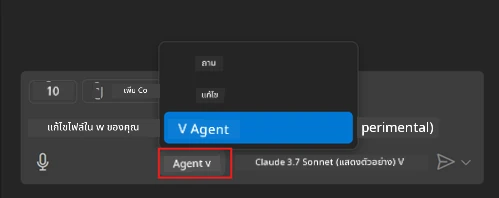
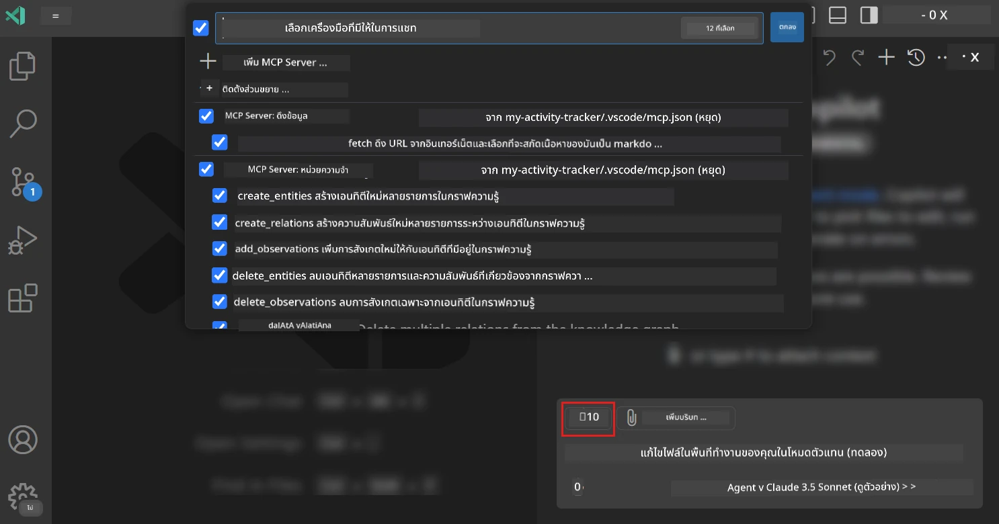
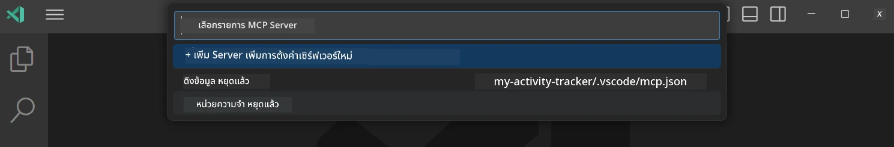
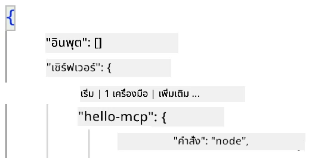
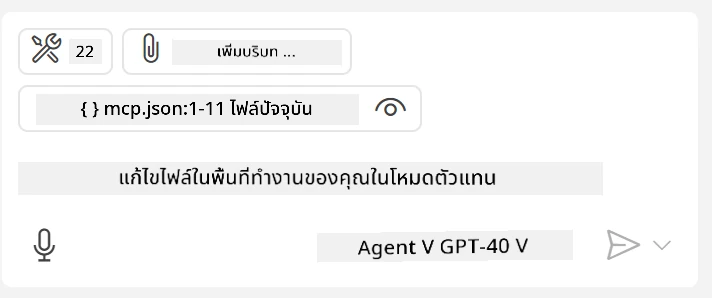

# การใช้งานเซิร์ฟเวอร์ในโหมด Agent ของ GitHub Copilot

Visual Studio Code และ GitHub Copilot สามารถทำหน้าที่เป็นไคลเอนต์และใช้งาน MCP Server ได้ คุณอาจสงสัยว่าทำไมเราถึงต้องการทำเช่นนั้น? เพราะว่าฟีเจอร์ใดๆ ที่ MCP Server มีสามารถใช้งานได้จากใน IDE ของคุณ ลองจินตนาการว่าคุณเพิ่ม MCP Server ของ GitHub ตัวอย่างเช่น คุณจะสามารถควบคุม GitHub ผ่านคำสั่งที่ใช้ภาษาธรรมชาติแทนการพิมพ์คำสั่งเฉพาะในเทอร์มินัล หรืออะไรก็ตามที่สามารถปรับปรุงประสบการณ์การพัฒนาของคุณได้ ทั้งหมดนี้ควบคุมด้วยภาษาธรรมชาติ คุณเริ่มเห็นข้อดีแล้วใช่ไหม?

## ภาพรวม

บทเรียนนี้ครอบคลุมวิธีการใช้ Visual Studio Code และโหมด Agent ของ GitHub Copilot เป็นไคลเอนต์สำหรับ MCP Server

## วัตถุประสงค์การเรียนรู้

เมื่อจบบทเรียนนี้ คุณจะสามารถ:

- ใช้งาน MCP Server ผ่าน Visual Studio Code
- ใช้ความสามารถต่างๆ เช่น เครื่องมือผ่าน GitHub Copilot
- ตั้งค่า Visual Studio Code เพื่อค้นหาและจัดการ MCP Server ของคุณ

## การใช้งาน

คุณสามารถควบคุม MCP Server ของคุณได้สองวิธี:

- ผ่านส่วนติดต่อผู้ใช้ คุณจะได้เห็นวิธีการนี้ในบทถัดไป
- ผ่านเทอร์มินัล คุณสามารถควบคุมสิ่งต่างๆ จากเทอร์มินัลโดยใช้คำสั่ง `code`:

  ในการเพิ่ม MCP Server ไปยังโปรไฟล์ผู้ใช้ของคุณ ให้ใช้ตัวเลือกบรรทัดคำสั่ง --add-mcp และระบุการตั้งค่าเซิร์ฟเวอร์ JSON ในรูปแบบ {\"name\":\"server-name\",\"command\":...}.

  ```
  code --add-mcp "{\"name\":\"my-server\",\"command\": \"uvx\",\"args\": [\"mcp-server-fetch\"]}"
  ```

### ภาพหน้าจอ





เรามาพูดถึงวิธีการใช้ส่วนติดต่อผู้ใช้ในหัวข้อถัดไป

## วิธีการ

นี่คือวิธีการที่เราต้องดำเนินการในภาพรวม:

- ตั้งค่าไฟล์เพื่อค้นหา MCP Server ของเรา
- เริ่มต้น/เชื่อมต่อกับเซิร์ฟเวอร์เพื่อให้มันแสดงรายการความสามารถของมัน
- ใช้ความสามารถเหล่านั้นผ่านส่วนติดต่อ GitHub Copilot Chat

ดีมาก ตอนนี้เราเข้าใจขั้นตอนแล้ว ลองใช้ MCP Server ผ่าน Visual Studio Code ผ่านการฝึกหัดกัน

## การฝึกหัด: การใช้งานเซิร์ฟเวอร์

ในแบบฝึกหัดนี้ เราจะตั้งค่า Visual Studio Code เพื่อค้นหา MCP Server ของคุณเพื่อให้สามารถใช้งานได้ผ่านส่วนติดต่อ GitHub Copilot Chat

### -0- ขั้นตอนเตรียมการ เปิดใช้งานการค้นหา MCP Server

คุณอาจต้องเปิดใช้งานการค้นหา MCP Server

1. ไปที่ `File -> Preferences -> Settings` ใน Visual Studio Code

1. ค้นหา "MCP" และเปิดใช้งาน `chat.mcp.discovery.enabled` ในไฟล์ settings.json

### -1- สร้างไฟล์ config

เริ่มต้นด้วยการสร้างไฟล์ config ในโฟลเดอร์โปรเจกต์ของคุณ คุณจะต้องสร้างไฟล์ชื่อ MCP.json และวางไว้ในโฟลเดอร์ชื่อ .vscode ไฟล์ควรมีลักษณะดังนี้:

```text
.vscode
|-- mcp.json
```

ต่อไป เรามาดูวิธีการเพิ่มรายการเซิร์ฟเวอร์

### -2- ตั้งค่าเซิร์ฟเวอร์

เพิ่มเนื้อหาต่อไปนี้ลงใน *mcp.json*:

```json
{
    "inputs": [],
    "servers": {
       "hello-mcp": {
           "command": "node",
           "args": [
               "build/index.js"
           ]
       }
    }
}
```

ตัวอย่างด้านบนเป็นวิธีง่ายๆ ในการเริ่มเซิร์ฟเวอร์ที่เขียนด้วย Node.js สำหรับ runtime อื่นๆ ให้ระบุคำสั่งที่เหมาะสมสำหรับการเริ่มเซิร์ฟเวอร์โดยใช้ `command` และ `args`

### -3- เริ่มเซิร์ฟเวอร์

เมื่อคุณเพิ่มรายการแล้ว ให้เริ่มเซิร์ฟเวอร์:

1. ค้นหารายการของคุณใน *mcp.json* และตรวจสอบให้แน่ใจว่าคุณพบไอคอน "play":

    

1. คลิกไอคอน "play" คุณควรเห็นไอคอนเครื่องมือใน GitHub Copilot Chat เพิ่มจำนวนเครื่องมือที่พร้อมใช้งาน หากคุณคลิกที่ไอคอนเครื่องมือดังกล่าว คุณจะเห็นรายการเครื่องมือที่ลงทะเบียนไว้ คุณสามารถเลือก/ยกเลิกการเลือกแต่ละเครื่องมือขึ้นอยู่กับว่าคุณต้องการให้ GitHub Copilot ใช้เป็นบริบทหรือไม่:

  

1. ในการใช้งานเครื่องมือ ให้พิมพ์คำสั่งที่คุณรู้ว่าจะตรงกับคำอธิบายของเครื่องมือ เช่น คำสั่ง "add 22 to 1":

  

  คุณควรเห็นคำตอบว่า 23

## งานที่มอบหมาย

ลองเพิ่มรายการเซิร์ฟเวอร์ลงในไฟล์ *mcp.json* ของคุณและตรวจสอบให้แน่ใจว่าคุณสามารถเริ่ม/หยุดเซิร์ฟเวอร์ได้ ตรวจสอบให้แน่ใจว่าคุณสามารถสื่อสารกับเครื่องมือบนเซิร์ฟเวอร์ของคุณผ่านส่วนติดต่อ GitHub Copilot Chat

## วิธีแก้ไข

[วิธีแก้ไข](./solution/README.md)

## สิ่งที่ควรจดจำ

สิ่งที่ควรจดจำจากบทนี้คือ:

- Visual Studio Code เป็นไคลเอนต์ที่ยอดเยี่ยมที่ช่วยให้คุณใช้งาน MCP Server และเครื่องมือของมันได้หลายตัว
- ส่วนติดต่อ GitHub Copilot Chat คือวิธีที่คุณโต้ตอบกับเซิร์ฟเวอร์
- คุณสามารถขอข้อมูลจากผู้ใช้ เช่น คีย์ API ที่สามารถส่งต่อไปยัง MCP Server เมื่อกำหนดค่าเซิร์ฟเวอร์ในไฟล์ *mcp.json*

## ตัวอย่าง

- [Java Calculator](../samples/java/calculator/README.md)
- [.Net Calculator](../../../../03-GettingStarted/samples/csharp)
- [JavaScript Calculator](../samples/javascript/README.md)
- [TypeScript Calculator](../samples/typescript/README.md)
- [Python Calculator](../../../../03-GettingStarted/samples/python)

## แหล่งข้อมูลเพิ่มเติม

- [เอกสาร Visual Studio](https://code.visualstudio.com/docs/copilot/chat/mcp-servers)

## สิ่งที่จะเรียนรู้ต่อไป

- ต่อไป: [การสร้างเซิร์ฟเวอร์แบบ stdio](../05-stdio-server/README.md)

---

**ข้อจำกัดความรับผิดชอบ**:  
เอกสารนี้ได้รับการแปลโดยใช้บริการแปลภาษา AI [Co-op Translator](https://github.com/Azure/co-op-translator) แม้ว่าเราจะพยายามให้การแปลมีความถูกต้อง แต่โปรดทราบว่าการแปลโดยอัตโนมัติอาจมีข้อผิดพลาดหรือความไม่ถูกต้อง เอกสารต้นฉบับในภาษาดั้งเดิมควรถือเป็นแหล่งข้อมูลที่เชื่อถือได้ สำหรับข้อมูลที่สำคัญ ขอแนะนำให้ใช้บริการแปลภาษามืออาชีพ เราไม่รับผิดชอบต่อความเข้าใจผิดหรือการตีความผิดที่เกิดจากการใช้การแปลนี้