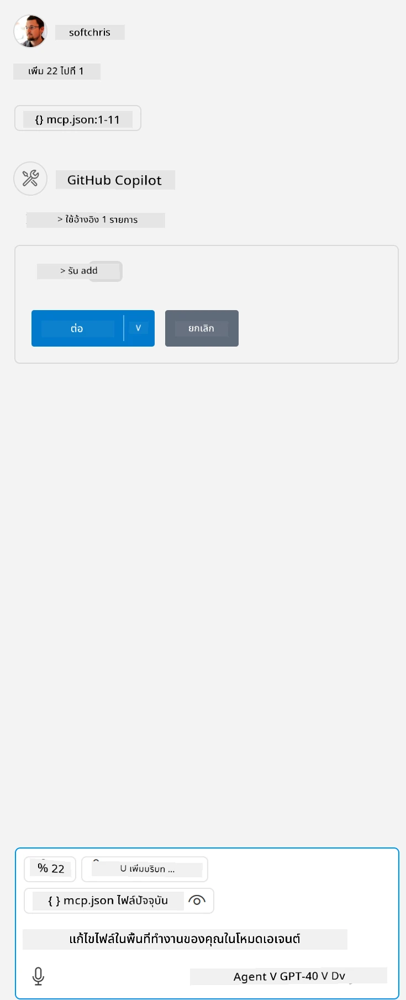

ซึ่งสอดคล้องกับการรันคำสั่งแบบนี้: `node build/index.js`

- เปลี่ยน entry ของเซิร์ฟเวอร์นี้ให้ตรงกับตำแหน่งไฟล์เซิร์ฟเวอร์ของคุณ หรือให้เหมาะสมกับคำสั่งที่ต้องใช้ในการเริ่มต้นเซิร์ฟเวอร์ ขึ้นอยู่กับ runtime และตำแหน่งเซิร์ฟเวอร์ที่คุณเลือก

## ใช้งานฟีเจอร์ในเซิร์ฟเวอร์

- คลิกไอคอน `play` หลังจากที่คุณเพิ่ม *mcp.json* ลงในโฟลเดอร์ *./vscode*

    สังเกตว่าไอคอนเครื่องมือจะเปลี่ยนไปเพื่อแสดงจำนวนเครื่องมือที่พร้อมใช้งาน ไอคอนเครื่องมือนี้จะอยู่เหนือช่องแชทใน GitHub Copilot

## รันเครื่องมือ

- พิมพ์คำสั่งในหน้าต่างแชทที่ตรงกับคำอธิบายของเครื่องมือ เช่น เพื่อเรียกใช้เครื่องมือ `add` ให้พิมพ์ข้อความประมาณว่า "add 3 to 20"

    คุณจะเห็นเครื่องมือแสดงขึ้นเหนือกล่องข้อความแชท เพื่อให้คุณเลือกใช้งานเครื่องมือนั้นตามภาพนี้:

    

    การเลือกเครื่องมือจะได้ผลลัพธ์เป็นตัวเลขแสดงว่า "23" หากคำสั่งของคุณเหมือนตัวอย่างที่กล่าวมา

**ข้อจำกัดความรับผิดชอบ**:  
เอกสารนี้ได้รับการแปลโดยใช้บริการแปลภาษาอัตโนมัติ [Co-op Translator](https://github.com/Azure/co-op-translator) แม้เราจะพยายามให้ความถูกต้องสูงสุด แต่โปรดทราบว่าการแปลอัตโนมัติอาจมีข้อผิดพลาดหรือความไม่ถูกต้อง เอกสารต้นฉบับในภาษาต้นทางถือเป็นแหล่งข้อมูลที่เชื่อถือได้ สำหรับข้อมูลที่สำคัญ ขอแนะนำให้ใช้บริการแปลโดยผู้เชี่ยวชาญมนุษย์ เราไม่รับผิดชอบต่อความเข้าใจผิดหรือการตีความผิดใด ๆ ที่เกิดจากการใช้การแปลนี้