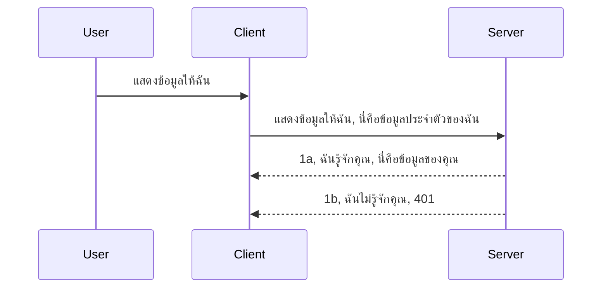

# การตรวจสอบสิทธิ์แบบง่าย

MCP SDKs รองรับการใช้ OAuth 2.1 ซึ่งถ้าพูดตามตรงมันเป็นกระบวนการที่ค่อนข้างซับซ้อนเกี่ยวข้องกับแนวคิดอย่างเซิร์ฟเวอร์ตรวจสอบสิทธิ์, เซิร์ฟเวอร์ทรัพยากร, การส่งข้อมูลรับรอง, การรับรหัส, แลกรหัสเป็นโทเค็นแบบ bearer จนสามารถดึงข้อมูลทรัพยากรได้ในที่สุด หากคุณไม่คุ้นเคยกับ OAuth ซึ่งเป็นสิ่งที่ดีมากที่ควรนำมาใช้ มันเป็นความคิดที่ดีที่จะเริ่มจากการตรวจสอบสิทธิ์ระดับพื้นฐานและก้าวไปสู่ความปลอดภัยที่ดีขึ้นเรื่อยๆ นั่นเป็นเหตุผลที่บทนี้มีอยู่ เพื่อสร้างพัฒนาการให้คุณไปสู่วิธีตรวจสอบสิทธิ์ขั้นสูงกว่า

## การตรวจสอบสิทธิ์ หมายความว่าอะไร?

การตรวจสอบสิทธิ์เป็นคำย่อของ authentication และ authorization แนวคิดคือเราต้องทำสองสิ่ง:

- **Authentication** คือกระบวนการในการหาว่าเราจะยอมให้ใครบางคนเข้าบ้านของเราได้หรือไม่ ว่าคนคนนั้นมีสิทธิ์ที่จะ "อยู่ที่นี่" หรือมีการเข้าถึงไปยังเซิร์ฟเวอร์ทรัพยากรซึ่งเป็นที่ที่ฟีเจอร์ของ MCP Server ของเราอยู่
- **Authorization** คือกระบวนการตรวจสอบว่าผู้ใช้ควรจะเข้าถึงทรัพยากรเฉพาะที่พวกเขาขอหรือไม่ เช่น คำสั่งซื้อเหล่านี้ หรือผลิตภัณฑ์เหล่านี้ หรือว่าพวกเขาจะได้รับอนุญาตให้แค่ดูเนื้อหาแต่ไม่สามารถลบได้ เป็นตัวอย่างหนึ่ง

## ข้อมูลรับรอง: วิธีที่เราบอกระบบว่าเราเป็นใคร

นักพัฒนาเว็บส่วนใหญ่เริ่มคิดในแง่ของการให้ข้อมูลรับรองกับเซิร์ฟเวอร์ โดยปกติจะเป็นความลับที่บอกว่าพวกเขาได้รับอนุญาตให้เข้าที่นี่หรือไม่ ("Authentication") ข้อมูลรับรองนี้มักจะเป็นเวอร์ชันที่เข้ารหัส base64 ของชื่อผู้ใช้และรหัสผ่าน หรือเป็น API key ที่ระบุผู้ใช้เฉพาะเจาะจง

ซึ่งกระบวนการนี้เกี่ยวข้องกับการส่งผ่านทาง header ชื่อว่า "Authorization" ตามนี้:

```json
{ "Authorization": "secret123" }
```

ซึ่งโดยปกตินี้ถูกเรียกว่า basic authentication วิธีการทำงานโดยรวมจะเป็นดังนี้:


ตอนนี้ที่เราเข้าใจวิธีการทำงานในแง่ของ flow แล้ว เราจะทำการใช้งานอย่างไร? เซิร์ฟเวอร์เว็บส่วนใหญ่จะมีแนวคิดที่เรียกว่า middleware, คือโค้ดส่วนหนึ่งที่ทำงานเป็นส่วนหนึ่งของคำขอซึ่งสามารถตรวจสอบข้อมูลรับรองได้ และถ้าข้อมูลรับรองถูกต้อง จะอนุญาตให้คำขอผ่านไปได้ หากคำขอไม่ได้มีข้อมูลรับรองที่ถูกต้อง จะเกิดข้อผิดพลาดในการตรวจสอบสิทธิ์ ลองดูวิธีการนำไปใช้งาน:

**Python**

```python
class AuthMiddleware(BaseHTTPMiddleware):
    async def dispatch(self, request, call_next):

        has_header = request.headers.get("Authorization")
        if not has_header:
            print("-> Missing Authorization header!")
            return Response(status_code=401, content="Unauthorized")

        if not valid_token(has_header):
            print("-> Invalid token!")
            return Response(status_code=403, content="Forbidden")

        print("Valid token, proceeding...")
       
        response = await call_next(request)
        # เพิ่มหัวข้อของลูกค้าหรือเปลี่ยนแปลงในคำตอบในบางวิธี
        return response


starlette_app.add_middleware(CustomHeaderMiddleware)
```

ในนี้เรามี:

- สร้าง middleware ชื่อ `AuthMiddleware` ที่มีเมธอด `dispatch` ซึ่งจะถูกเรียกโดยเว็บเซิร์ฟเวอร์
- เพิ่ม middleware เข้าไปยังเว็บเซิร์ฟเวอร์:

    ```python
    starlette_app.add_middleware(AuthMiddleware)
    ```

- เขียนตรรกะสำหรับตรวจสอบว่ามี header Authorization หรือไม่ และความลับที่ส่งมานั้นถูกต้องหรือไม่:

    ```python
    has_header = request.headers.get("Authorization")
    if not has_header:
        print("-> Missing Authorization header!")
        return Response(status_code=401, content="Unauthorized")

    if not valid_token(has_header):
        print("-> Invalid token!")
        return Response(status_code=403, content="Forbidden")
    ```

    หากมีความลับและถูกต้อง เราจะอนุญาตให้คำขอผ่านด้วยการเรียก `call_next` และส่งผลลัพธ์กลับ

    ```python
    response = await call_next(request)
    # เพิ่มหัวเรื่องลูกค้าหรือเปลี่ยนแปลงการตอบกลับในบางวิธี
    return response
    ```

การทำงานคือ ถ้ามีการรับคำขอเว็บไปยังเซิร์ฟเวอร์ middleware จะถูกเรียกและจากการใช้งานของมันจะอนุญาตให้คำขอผ่านไปหรือส่งกลับข้อผิดพลาดซึ่งบ่งชี้ว่าไคลเอนต์ไม่ได้รับอนุญาตให้ดำเนินการต่อ

**TypeScript**

ที่นี่เราสร้าง middleware ด้วยเฟรมเวิร์กยอดนิยม Express และดักจับคำขอก่อนจะไปถึง MCP Server นี่คือโค้ดสำหรับสิ่งนั้น:

```typescript
function isValid(secret) {
    return secret === "secret123";
}

app.use((req, res, next) => {
    // 1. มีหัวข้อ Authorization หรือไม่?
    if(!req.headers["Authorization"]) {
        res.status(401).send('Unauthorized');
    }
    
    let token = req.headers["Authorization"];

    // 2. ตรวจสอบความถูกต้อง
    if(!isValid(token)) {
        res.status(403).send('Forbidden');
    }

   
    console.log('Middleware executed');
    // 3. ส่งคำขอต่อไปยังขั้นตอนถัดไปในกระบวนการคำขอ.
    next();
});
```

ในโค้ดนี้เราทำ:

1. ตรวจสอบว่ามี header Authorization อยู่หรือไม่ ถ้าไม่มีก็ส่งข้อผิดพลาด 401
2. ตรวจสอบว่าสิทธิ์/โทเค็นถูกต้องหรือไม่ ถ้าไม่ถูกต้องส่งข้อผิดพลาด 403
3. สุดท้ายส่งคำขอต่อไปใน pipeline และส่งคืนทรัพยากรที่ร้องขอ

## แบบฝึกหัด: การใช้งานการตรวจสอบสิทธิ์

มารับความรู้ของเราแล้วลองใช้งานดู นี่คือแผน:

เซิร์ฟเวอร์

- สร้างเว็บเซิร์ฟเวอร์และอินสแตนซ์ MCP
- นำ middleware ไปใช้งานกับเซิร์ฟเวอร์

ไคลเอนต์

- ส่งคำขอเว็บพร้อมข้อมูลรับรอง ผ่าน header

### -1- สร้างเว็บเซิร์ฟเวอร์และอินสแตนซ์ MCP

ในขั้นตอนแรก เราต้องสร้างอินสแตนซ์เว็บเซิร์ฟเวอร์และ MCP Server

**Python**

ที่นี่เราสร้างอินสแตนซ์ MCP Server, สร้างเว็บแอป starlette และโฮสต์ด้วย uvicorn

```python
# กำลังสร้างเซิร์ฟเวอร์ MCP

app = FastMCP(
    name="MCP Resource Server",
    instructions="Resource Server that validates tokens via Authorization Server introspection",
    host=settings["host"],
    port=settings["port"],
    debug=True
)

# กำลังสร้างแอปเว็บ starlette
starlette_app = app.streamable_http_app()

# ให้บริการแอปผ่าน uvicorn
async def run(starlette_app):
    import uvicorn
    config = uvicorn.Config(
            starlette_app,
            host=app.settings.host,
            port=app.settings.port,
            log_level=app.settings.log_level.lower(),
        )
    server = uvicorn.Server(config)
    await server.serve()

run(starlette_app)
```

ในโค้ดนี้เราทำ:

- สร้าง MCP Server
- สร้างเว็บแอป starlette จาก MCP Server ด้วย `app.streamable_http_app()`
- โฮสต์และให้บริการเว็บแอปโดยใช้ uvicorn ด้วย `server.serve()`

**TypeScript**

ที่นี่เราสร้างอินสแตนซ์ MCP Server

```typescript
const server = new McpServer({
      name: "example-server",
      version: "1.0.0"
    });

    // ... ตั้งค่าทรัพยากรเซิร์ฟเวอร์ เครื่องมือ และพร้อมท์ ...
```

การสร้าง MCP Server นี้จะต้องเกิดขึ้นภายในการกำหนดเส้นทาง POST /mcp ดังนั้นเราจะย้ายโค้ดด้านบนไปดังนี้:

```typescript
import express from "express";
import { randomUUID } from "node:crypto";
import { McpServer } from "@modelcontextprotocol/sdk/server/mcp.js";
import { StreamableHTTPServerTransport } from "@modelcontextprotocol/sdk/server/streamableHttp.js";
import { isInitializeRequest } from "@modelcontextprotocol/sdk/types.js"

const app = express();
app.use(express.json());

// แผนที่เพื่อเก็บการขนส่งตามรหัสเซสชัน
const transports: { [sessionId: string]: StreamableHTTPServerTransport } = {};

// จัดการคำขอ POST สำหรับการสื่อสารจากไคลเอนต์ถึงเซิร์ฟเวอร์
app.post('/mcp', async (req, res) => {
  // ตรวจสอบรหัสเซสชันที่มีอยู่
  const sessionId = req.headers['mcp-session-id'] as string | undefined;
  let transport: StreamableHTTPServerTransport;

  if (sessionId && transports[sessionId]) {
    // ใช้การขนส่งที่มีอยู่ซ้ำ
    transport = transports[sessionId];
  } else if (!sessionId && isInitializeRequest(req.body)) {
    // คำขอเริ่มต้นใหม่
    transport = new StreamableHTTPServerTransport({
      sessionIdGenerator: () => randomUUID(),
      onsessioninitialized: (sessionId) => {
        // เก็บการขนส่งตามรหัสเซสชัน
        transports[sessionId] = transport;
      },
      // การป้องกัน DNS rebinding ถูกปิดใช้งานโดยเริ่มต้นเพื่อความเข้ากันได้ย้อนหลัง หากคุณรันเซิร์ฟเวอร์นี้
      // ในเครื่อง ให้ตรวจสอบการตั้งค่า:
      // enableDnsRebindingProtection: true,
      // allowedHosts: ['127.0.0.1'],
    });

    // ทำความสะอาดการขนส่งเมื่อปิด
    transport.onclose = () => {
      if (transport.sessionId) {
        delete transports[transport.sessionId];
      }
    };
    const server = new McpServer({
      name: "example-server",
      version: "1.0.0"
    });

    // ... ตั้งค่าทรัพยากรเซิร์ฟเวอร์ เครื่องมือ และพรอมต์ ...

    // เชื่อมต่อกับเซิร์ฟเวอร์ MCP
    await server.connect(transport);
  } else {
    // คำขอไม่ถูกต้อง
    res.status(400).json({
      jsonrpc: '2.0',
      error: {
        code: -32000,
        message: 'Bad Request: No valid session ID provided',
      },
      id: null,
    });
    return;
  }

  // จัดการคำขอ
  await transport.handleRequest(req, res, req.body);
});

// ตัวจัดการที่สามารถใช้ซ้ำสำหรับคำขอ GET และ DELETE
const handleSessionRequest = async (req: express.Request, res: express.Response) => {
  const sessionId = req.headers['mcp-session-id'] as string | undefined;
  if (!sessionId || !transports[sessionId]) {
    res.status(400).send('Invalid or missing session ID');
    return;
  }
  
  const transport = transports[sessionId];
  await transport.handleRequest(req, res);
};

// จัดการคำขอ GET สำหรับการแจ้งเตือนจากเซิร์ฟเวอร์ไปยังไคลเอนต์ผ่าน SSE
app.get('/mcp', handleSessionRequest);

// จัดการคำขอ DELETE สำหรับการยุติการเซสชัน
app.delete('/mcp', handleSessionRequest);

app.listen(3000);
```

ตอนนี้จะเห็นว่าโค้ดสร้าง MCP Server ถูกย้ายไปใน `app.post("/mcp")`

จากนั้นเรามาต่อในขั้นตอนถัดไปเพื่อสร้าง middleware สำหรับตรวจสอบความถูกต้องของข้อมูลรับรองที่เข้ามา

### -2- นำ middleware ไปใช้งานกับเซิร์ฟเวอร์

ต่อไปเป็นส่วนของ middleware เราจะสร้าง middleware ที่ตรวจหาข้อมูลรับรองใน header `Authorization` และตรวจสอบความถูกต้อง หากได้รับการยอมรับ คำขอจะดำเนินการต่อไป (เช่น แสดงรายการเครื่องมือ, อ่านทรัพยากร หรือฟังก์ชัน MCP อื่นที่ไคลเอนต์ร้องขอ)

**Python**

เพื่อสร้าง middleware เราต้องสร้างคลาสที่สืบทอดจาก `BaseHTTPMiddleware` มีสองส่วนที่น่าสนใจ:

- คำขอ `request` ที่เราจะอ่านข้อมูล header
- `call_next` callback ที่เราต้องเรียกหากไคลเอนต์ส่งข้อมูลรับรองที่เรายอมรับ

ก่อนอื่นเราต้องจัดการกรณีที่ header `Authorization` ขาดหายไป:

```python
has_header = request.headers.get("Authorization")

# ไม่มีหัวเรื่อง, ล้มเหลวด้วย 401, มิฉะนั้นไปต่อ.
if not has_header:
    print("-> Missing Authorization header!")
    return Response(status_code=401, content="Unauthorized")
```

ที่นี่เราจะส่งข้อความ 401 unauthorized เพราะไคลเอนต์ล้มเหลวในการตรวจสอบสิทธิ์

ถัดมา หากส่งข้อมูลรับรองมา เราต้องตรวจสอบความถูกต้องดังนี้:

```python
 if not valid_token(has_header):
    print("-> Invalid token!")
    return Response(status_code=403, content="Forbidden")
```

สังเกตว่าที่นี่ส่งข้อความ 403 forbidden มาด้วย มาดู middleware แบบเต็มที่ใช้งานทุกอย่างที่พูดถึงข้างต้น:

```python
class AuthMiddleware(BaseHTTPMiddleware):
    async def dispatch(self, request, call_next):

        has_header = request.headers.get("Authorization")
        if not has_header:
            print("-> Missing Authorization header!")
            return Response(status_code=401, content="Unauthorized")

        if not valid_token(has_header):
            print("-> Invalid token!")
            return Response(status_code=403, content="Forbidden")

        print("Valid token, proceeding...")
        print(f"-> Received {request.method} {request.url}")
        response = await call_next(request)
        response.headers['Custom'] = 'Example'
        return response

```

ดีมาก แต่ฟังก์ชัน `valid_token` ล่ะ? นี่คือฟังก์ชันด้านล่าง:
:

```python
# อย่าใช้ในงานจริง - พัฒนามันด้วย !!
def valid_token(token: str) -> bool:
    # ลบคำขึ้นต้น "Bearer "
    if token.startswith("Bearer "):
        token = token[7:]
        return token == "secret-token"
    return False
```

แน่นอนว่าควรปรับปรุงให้ดีขึ้น

สำคัญ: คุณไม่ควรเก็บความลับแบบนี้ในโค้ด ควรดึงค่าที่เปรียบเทียบมาจากแหล่งข้อมูลหรือ IDP (ผู้ให้บริการระบุตัวตน) หรือดีไปกว่านั้นให้ IDP ตรวจสอบแทน

**TypeScript**

ในการใช้งานกับ Express เราต้องเรียกใช้เมธอด `use` ที่รับฟังก์ชัน middleware

เราต้อง:

- ตรวจสอบ request เพื่อตรวจดู credential ที่อยู่ใน `Authorization`
- ตรวจสอบข้อมูลรับรอง และถ้าใช้ได้ก็ปล่อยให้คำขอต่อไปทำงานและดำเนินการตามคำขอ MCP ที่ไคลเอนต์ส่งมา (เช่น แสดงรายการเครื่องมือ, อ่านทรัพยากร หรืออื่น ๆ ที่เกี่ยวกับ MCP)

ที่นี่เราตรวจสอบว่า header `Authorization` มีหรือไม่ ถ้าไม่มี เราจะหยุดไม่ให้คำขอไหลผ่าน:

```typescript
if(!req.headers["authorization"]) {
    res.status(401).send('Unauthorized');
    return;
}
```

ถ้า header ไม่ถูกส่งมาเลย จะส่งกลับ 401

ถัดไปตรวจสอบข้อมูลรับรองว่าถูกต้องหรือไม่ ถ้าไม่ ใช้อีกข้อความที่แตกต่างกันเล็กน้อยหยุดคำขอ:

```typescript
if(!isValid(token)) {
    res.status(403).send('Forbidden');
    return;
} 
```

สังเกตว่าเราได้รับข้อผิดพลาด 403

นี่คือโค้ดเต็ม:

```typescript
app.use((req, res, next) => {
    console.log('Request received:', req.method, req.url, req.headers);
    console.log('Headers:', req.headers["authorization"]);
    if(!req.headers["authorization"]) {
        res.status(401).send('Unauthorized');
        return;
    }
    
    let token = req.headers["authorization"];

    if(!isValid(token)) {
        res.status(403).send('Forbidden');
        return;
    }  

    console.log('Middleware executed');
    next();
});
```

เราได้ตั้งค่าเว็บเซิร์ฟเวอร์ให้รับ middleware เพื่อเช็คข้อมูลรับรองที่ไคลเอนต์หวังว่าจะส่งมา แล้วไคลเอนต์เองล่ะ?

### -3- ส่งคำขอเว็บพร้อมข้อมูลรับรองผ่าน header

เราต้องแน่ใจว่าไคลเอนต์ส่งข้อมูลรับรองผ่าน header ด้วย เพราะเราจะใช้ MCP client ในการทำ เราต้องหาวิธีทำเช่นนั้น

**Python**

สำหรับไคลเอนต์ เราต้องส่ง header ที่มีข้อมูลรับรอง ดังนี้:

```python
# อย่าเขียนค่าคงที่ไว้ตรงๆ ควรเก็บอย่างน้อยในตัวแปรสภาพแวดล้อมหรือที่เก็บข้อมูลที่ปลอดภัยกว่า
token = "secret-token"

async with streamablehttp_client(
        url = f"http://localhost:{port}/mcp",
        headers = {"Authorization": f"Bearer {token}"}
    ) as (
        read_stream,
        write_stream,
        session_callback,
    ):
        async with ClientSession(
            read_stream,
            write_stream
        ) as session:
            await session.initialize()
      
            # งานที่ต้องทำ เช่น สิ่งที่ต้องการให้ทำในไคลเอนต์ เช่น แสดงรายการเครื่องมือ เรียกใช้เครื่องมือ เป็นต้น
```

สังเกตว่าเราเติม `headers` ด้วย `headers = {"Authorization": f"Bearer {token}"}`

**TypeScript**

เราจะแก้ปัญหานี้ในสองขั้นตอน:

1. สร้างวัตถุกำหนดค่า (configuration object) ที่มีข้อมูลรับรองของเรา
2. ส่งวัตถุกำหนดค่านี้ให้กับ transport

```typescript

// อย่ากำหนดค่าตายตัวแบบที่แสดงที่นี่ อย่างน้อยควรมีเป็นตัวแปรสภาพแวดล้อมและใช้สิ่งอย่าง dotenv (ในโหมดพัฒนา)
let token = "secret123"

// กำหนดอ็อบเจ็กต์ตัวเลือกการขนส่งของไคลเอนต์
let options: StreamableHTTPClientTransportOptions = {
  sessionId: sessionId,
  requestInit: {
    headers: {
      "Authorization": "secret123"
    }
  }
};

// ส่งอ็อบเจ็กต์ตัวเลือกไปยังตัวขนส่ง
async function main() {
   const transport = new StreamableHTTPClientTransport(
      new URL(serverUrl),
      options
   );
```

เห็นไหมว่าเราต้องสร้างตัวแปร `options` และใส่ headers ไว้ใน property `requestInit`

สำคัญ: แล้วเราจะพัฒนาได้อย่างไรต่อ? ในทางปฏิบัติ การส่งข้อมูลรับรองแบบนี้ค่อนข้างเสี่ยงถ้าไม่มีอย่างน้อย HTTPS แม้กระทั่ง HTTPS ข้อมูลรับรองสามารถถูกขโมยได้ ดังนั้นคุณจะต้องมีระบบที่สามารถเพิกถอนโทเค็นได้อย่างง่ายดายและเพิ่มการตรวจสอบอื่น ๆ เช่น มาจากที่ไหนในโลกนี้, คำขอเกิดขึ้นบ่อยเกินไปหรือไม่ (พฤติกรรมแบบ bot), โดยสรุปมีข้อกังวลมากมาย

อย่างไรก็ตาม สำหรับ API ง่าย ๆ ที่คุณไม่ต้องการให้ใครก็ได้เรียก API ของคุณโดยไม่ผ่านการตรวจสอบสิทธิ์ และสิ่งที่มีอยู่ตอนนี้ถือว่าเป็นจุดเริ่มต้นที่ดี

เมื่อพูดถึงเรื่องนี้ มาลองแข็งแรงให้ความปลอดภัยมากขึ้นด้วยการใช้รูปแบบมาตรฐานอย่าง JSON Web Token หรือรู้จักกันในชื่อ JWT หรือ "JOT" tokens

## JSON Web Tokens, JWT

ดังนั้น เรากำลังพยายามปรับปรุงสิ่งต่างๆ จากการส่งข้อมูลรับรองที่เรียบง่าย สิ่งที่ได้รับการปรับปรุงทันทีเมื่อใช้ JWT คืออะไร?

- **การปรับปรุงความปลอดภัย** ใน basic auth คุณส่งชื่อผู้ใช้และรหัสผ่านเป็น token base64 (หรือส่ง API key) ซ้ำแล้วซ้ำเล่า ซึ่งเพิ่มความเสี่ยง ส่วน JWT คุณส่งชื่อผู้ใช้และรหัสผ่านแล้วได้รับโทเค็นกลับ ซึ่งโทเค็นนี้มีการกำหนดเวลาหมดอายุ JWT ช่วยให้ใช้การควบคุมการเข้าถึงระดับละเอียดได้ง่ายโดยใช้บทบาท (roles), ขอบเขต (scopes) และสิทธิ์ (permissions)
- **ความเป็น stateless และการขยายตัวได้** JWT เป็นโทเค็นที่เก็บข้อมูลผู้ใช้ทั้งหมดภายในตัวเอง จึงไม่ต้องจัดเก็บ session ในฝั่งเซิร์ฟเวอร์ และสามารถตรวจสอบโทเค็นได้ที่ฝั่งไคลเอนต์
- **การทำงานร่วมกันและ federation** JWT เป็นศูนย์กลางของ Open ID Connect และใช้กับผู้ให้บริการระบุตัวตนที่รู้จักเช่น Entra ID, Google Identity และ Auth0 ยังช่วยให้สามารถใช้ single sign-on และอื่น ๆ ทำให้เหมาะกับระดับองค์กร
- **ความยืดหยุ่นและโมดูลาร์** JWT ยังใช้ได้กับ API Gateways เช่น Azure API Management, NGINX และอื่น ๆ รองรับสถานการณ์การตรวจสอบสิทธิ์ และการสื่อสารจากเซิร์ฟเวอร์ถึงเซิร์ฟเวอร์ รวมถึงกรณีการแอบอ้างและมอบหมายสิทธิ์
- **ประสิทธิภาพและการแคช** JWT สามารถถูกแคชหลังจากถอดรหัสแล้ว ซึ่งช่วยลดความจำเป็นในการแยกวิเคราะห์ (parsing) ช่วยกับแอปที่มีการใช้งานสูงเพิ่มปริมาณข้อมูลผ่านและลดภาระบนโครงสร้างพื้นฐานที่เลือกใช้
- **ฟีเจอร์ขั้นสูง** รองรับการ introspection (ตรวจสอบความถูกต้องที่เซิร์ฟเวอร์) และ revocation (ทำให้โทเค็นไม่ถูกต้อง)

ด้วยประโยชน์ทั้งหมดนี้ มาดูกันว่าคุณจะพัฒนาการใช้งานของคุณไปอีกระดับได้อย่างไร

## เปลี่ยน basic auth เป็น JWT

ดังนั้น การเปลี่ยนแปลงหลักที่เราต้องทำคือ:

- **เรียนรู้วิธีสร้างโทเค็น JWT** และทำให้พร้อมสำหรับส่งจากไคลเอนต์ไปยังเซิร์ฟเวอร์
- **ตรวจสอบความถูกต้องของโทเค็น JWT** และถ้าใช้ได้ ให้ไคลเอนต์เข้าถึงทรัพยากรของเรา
- **จัดเก็บโทเค็นอย่างปลอดภัย** วิธีการจัดเก็บโทเค็นนี้
- **ปกป้องเส้นทาง (routes)** เราต้องปกป้องเส้นทาง เช่น กรณีเราต้องปกป้องเส้นทางและฟีเจอร์ MCP เฉพาะเจาะจง
- **เพิ่ม refresh tokens** ต้องสร้างโทเค็นที่หมดอายุสั้นและ refresh tokens ที่มีอายุยาวกว่าใช้รับโทเค็นใหม่ถ้าหมดอายุ และควรมี endpoint สำหรับ refresh และกลยุทธ์การหมุนเวียน

### -1- สร้างโทเค็น JWT

ก่อนอื่น โทเค็น JWT มีส่วนประกอบดังนี้:

- **header** กำหนดอัลกอริทึมและประเภทโทเค็น
- **payload** ข้อความอ้างสิทธิ์ (claims) เช่น sub (ผู้ใช้หรือหน่วยงานที่โทเค็นแทน ในสถานการณ์ auth โดยปกติคือ userid), exp (เวลาหมดอายุ), role (บทบาท)
- **signature** ลงนามด้วยความลับหรือกุญแจส่วนตัว

สำหรับสิ่งนี้ เราต้องสร้าง header, payload และโทเค็นที่เข้ารหัส

**Python**

```python

import jwt
import jwt
from jwt.exceptions import ExpiredSignatureError, InvalidTokenError
import datetime

# กุญแจลับที่ใช้ลงนาม JWT
secret_key = 'your-secret-key'

header = {
    "alg": "HS256",
    "typ": "JWT"
}

# ข้อมูลผู้ใช้และคำร้องสิทธิ์พร้อมเวลาหมดอายุ
payload = {
    "sub": "1234567890",               # หัวข้อ (รหัสผู้ใช้)
    "name": "User Userson",                # คำร้องสิทธิ์ที่กำหนดเอง
    "admin": True,                     # คำร้องสิทธิ์ที่กำหนดเอง
    "iat": datetime.datetime.utcnow(),# ออกเมื่อ
    "exp": datetime.datetime.utcnow() + datetime.timedelta(hours=1)  # หมดอายุ
}

# เข้ารหัสมัน
encoded_jwt = jwt.encode(payload, secret_key, algorithm="HS256", headers=header)
```

ในโค้ดนี้เราทำ:

- กำหนด header ใช้ HS256 เป็นอัลกอริทึมและระบุประเภทเป็น JWT
- สร้าง payload ที่มี subject หรือ user id, username, บทบาท, เวลาที่ออกและเวลาหมดอายุ เพื่อใช้งานในส่วนที่มีเวลาจำกัดที่เรากล่าวถึงไปแล้ว

**TypeScript**

เราจะต้องใช้ไลบรารีที่ช่วยสร้างโทเค็น JWT

Dependencies

```sh

npm install jsonwebtoken
npm install --save-dev @types/jsonwebtoken
```

เมื่อมีพร้อมแล้ว มาสร้าง header, payload และจากนั้นสร้างโทเค็นที่เข้ารหัส

```typescript
import jwt from 'jsonwebtoken';

const secretKey = 'your-secret-key'; // ใช้ตัวแปรสภาพแวดล้อมในสภาพแวดล้อมการผลิต

// กำหนดข้อมูลเพย์โหลด
const payload = {
  sub: '1234567890',
  name: 'User usersson',
  admin: true,
  iat: Math.floor(Date.now() / 1000), // ออกให้เมื่อ
  exp: Math.floor(Date.now() / 1000) + 60 * 60 // หมดอายุใน 1 ชั่วโมง
};

// กำหนดหัวเรื่อง (ไม่บังคับ, jsonwebtoken ตั้งค่าดีฟอลต์)
const header = {
  alg: 'HS256',
  typ: 'JWT'
};

// สร้างโทเค็น
const token = jwt.sign(payload, secretKey, {
  algorithm: 'HS256',
  header: header
});

console.log('JWT:', token);
```

โทเค็นนี้:

- ลงนามด้วย HS256
- มีอายุ 1 ชั่วโมง
- มี claims เช่น sub, name, admin, iat, และ exp

### -2- ตรวจสอบความถูกต้องของโทเค็น

เรายังต้องตรวจสอบโทเค็นด้วย ซึ่งควรทำที่เซิร์ฟเวอร์เพื่อให้มั่นใจว่าโทเค็นที่ไคลเอนต์ส่งมานั้นถูกต้อง มีหลายการตรวจสอบที่เราควรทำ ตั้งแต่ตรวจโครงสร้างถึงความถูกต้อง และคุณควรเพิ่มการตรวจสอบอื่น ๆ เช่นว่าผู้ใช้มีอยู่ในระบบหรือไม่ และอื่นๆ

เพื่อยืนยันโทเค็น เราต้องถอดรหัสเพื่ออ่านข้อมูลแล้วเริ่มตรวจสอบความถูกต้อง:

**Python**

```python

# ถอดรหัสและตรวจสอบ JWT
try:
    decoded = jwt.decode(token, secret_key, algorithms=["HS256"])
    print("✅ Token is valid.")
    print("Decoded claims:")
    for key, value in decoded.items():
        print(f"  {key}: {value}")
except ExpiredSignatureError:
    print("❌ Token has expired.")
except InvalidTokenError as e:
    print(f"❌ Invalid token: {e}")

```

ในโค้ดนี้เราเรียก `jwt.decode` โดยส่งโทเค็น, คีย์ลับ และอัลกอริทึมที่เลือกไว้เข้าไป สังเกตว่าเราใช้ try-catch เพราะถ้า validation ผิดพลาดจะเกิดข้อผิดพลาดขึ้น

**TypeScript**

ที่นี่เราต้องเรียก `jwt.verify` เพื่อรับโทเค็นที่ถอดรหัสแล้วซึ่งเราจะวิเคราะห์ต่อ หากเรียกนี้ล้มเหลว หมายความว่าโครงสร้างโทเค็นไม่ถูกต้องหรือไม่ถูกต้องอีกต่อไป

```typescript

try {
  const decoded = jwt.verify(token, secretKey);
  console.log('Decoded Payload:', decoded);
} catch (err) {
  console.error('Token verification failed:', err);
}
```

หมายเหตุ: ตามที่กล่าวไว้ก่อนหน้านี้ คุณควรทำการตรวจสอบเพิ่มเติมเพื่อให้แน่ใจว่าโทเค็นนี้ชี้ไปยังผู้ใช้ในระบบและตรวจสอบว่าผู้ใช้มีสิทธิ์ที่อ้างถึงจริง ๆ
ต่อไป มาดูการควบคุมการเข้าถึงตามบทบาท ซึ่งเรียกอีกอย่างว่า RBAC

## การเพิ่มการควบคุมการเข้าถึงตามบทบาท

แนวคิดคือเราต้องการแสดงให้เห็นว่าบทบาทต่าง ๆ มีสิทธิ์ที่แตกต่างกัน ตัวอย่างเช่น เราสมมติว่าแอดมินสามารถทำทุกอย่างได้ และผู้ใช้ทั่วไปสามารถอ่าน/เขียนได้ และผู้เยี่ยมชมสามารถอ่านได้เท่านั้น ดังนั้นนี่คือตัวอย่างระดับสิทธิ์:

- Admin.Write 
- User.Read
- Guest.Read

มาดูกันว่าเราสามารถนำการควบคุมนี้มาใช้ด้วย middleware อย่างไร Middleware สามารถเพิ่มได้ทั้งต่อเส้นทางเดียวและทุกเส้นทาง

**Python**

```python
from starlette.middleware.base import BaseHTTPMiddleware
from starlette.responses import JSONResponse
import jwt

# อย่าใส่ความลับไว้ในโค้ดแบบนี้ ใช้เพื่อการสาธิตเท่านั้น อ่านค่าจากแหล่งที่ปลอดภัย
SECRET_KEY = "your-secret-key" # ใส่สิ่งนี้ในตัวแปรสภาพแวดล้อม
REQUIRED_PERMISSION = "User.Read"

class JWTPermissionMiddleware(BaseHTTPMiddleware):
    async def dispatch(self, request, call_next):
        auth_header = request.headers.get("Authorization")
        if not auth_header or not auth_header.startswith("Bearer "):
            return JSONResponse({"error": "Missing or invalid Authorization header"}, status_code=401)

        token = auth_header.split(" ")[1]
        try:
            decoded = jwt.decode(token, SECRET_KEY, algorithms=["HS256"])
        except jwt.ExpiredSignatureError:
            return JSONResponse({"error": "Token expired"}, status_code=401)
        except jwt.InvalidTokenError:
            return JSONResponse({"error": "Invalid token"}, status_code=401)

        permissions = decoded.get("permissions", [])
        if REQUIRED_PERMISSION not in permissions:
            return JSONResponse({"error": "Permission denied"}, status_code=403)

        request.state.user = decoded
        return await call_next(request)


```

มีหลายวิธีในการเพิ่ม middleware ดังเช่นตัวอย่างด้านล่างนี้:

```python

# ทางเลือก 1: เพิ่ม middleware ขณะสร้างแอป starlette
middleware = [
    Middleware(JWTPermissionMiddleware)
]

app = Starlette(routes=routes, middleware=middleware)

# ทางเลือก 2: เพิ่ม middleware หลังจากแอป starlette ได้ถูกสร้างขึ้นแล้ว
starlette_app.add_middleware(JWTPermissionMiddleware)

# ทางเลือก 3: เพิ่ม middleware ต่อเส้นทาง
routes = [
    Route(
        "/mcp",
        endpoint=..., # ตัวจัดการ
        middleware=[Middleware(JWTPermissionMiddleware)]
    )
]
```

**TypeScript**

เราสามารถใช้ `app.use` และ middleware ที่จะรันสำหรับคำขอทั้งหมด

```typescript
app.use((req, res, next) => {
    console.log('Request received:', req.method, req.url, req.headers);
    console.log('Headers:', req.headers["authorization"]);

    // 1. ตรวจสอบว่ามีการส่งส่วนหัวการอนุญาตหรือไม่

    if(!req.headers["authorization"]) {
        res.status(401).send('Unauthorized');
        return;
    }
    
    let token = req.headers["authorization"];

    // 2. ตรวจสอบว่าโทเค็นถูกต้องหรือไม่
    if(!isValid(token)) {
        res.status(403).send('Forbidden');
        return;
    }  

    // 3. ตรวจสอบว่าผู้ใช้โทเค็นมีอยู่ในระบบของเราหรือไม่
    if(!isExistingUser(token)) {
        res.status(403).send('Forbidden');
        console.log("User does not exist");
        return;
    }
    console.log("User exists");

    // 4. ยืนยันว่าโทเค็นมีสิทธิ์ที่ถูกต้องหรือไม่
    if(!hasScopes(token, ["User.Read"])){
        res.status(403).send('Forbidden - insufficient scopes');
    }

    console.log("User has required scopes");

    console.log('Middleware executed');
    next();
});

```

มีหลายสิ่งที่เราสามารถปล่อยให้ middleware ของเราและที่ middleware ควรทำ ได้แก่:

1. ตรวจสอบว่ามี authorization header หรือไม่
2. ตรวจสอบว่า token ถูกต้องหรือไม่ เราเรียก `isValid` ซึ่งเป็นเมธอดที่เราสร้างขึ้นเพื่อตรวจสอบความถูกต้องและความสมบูรณ์ของ JWT token
3. ตรวจสอบว่าผู้ใช้มีอยู่ในระบบของเราหรือไม่ ซึ่งเราควรตรวจสอบในขั้นตอนนี้

   ```typescript
    // ผู้ใช้ในฐานข้อมูล
   const users = [
     "user1",
     "User usersson",
   ]

   function isExistingUser(token) {
     let decodedToken = verifyToken(token);

     // งานที่ต้องทำ, ตรวจสอบว่าผู้ใช้มีอยู่ในฐานข้อมูลหรือไม่
     return users.includes(decodedToken?.name || "");
   }
   ```

   ด้านบน เราได้สร้าง `users` list อย่างง่าย ๆ ขึ้นมา ซึ่งควรจะอยู่ในฐานข้อมูลอย่างแน่นอน

4. นอกจากนี้ เราควรตรวจสอบด้วยว่า token มีสิทธิ์ที่เหมาะสมหรือไม่

   ```typescript
   if(!hasScopes(token, ["User.Read"])){
        res.status(403).send('Forbidden - insufficient scopes');
   }
   ```

   โค้ดข้างบนใน middleware นี้ เราตรวจสอบว่า token มีสิทธิ์ User.Read หรือไม่ หากไม่มีเราจะส่งข้อผิดพลาด 403 ด้านล่างคือเมธอดช่วยเหลือ `hasScopes`

   ```typescript
   function hasScopes(scope: string, requiredScopes: string[]) {
     let decodedToken = verifyToken(scope);
    return requiredScopes.every(scope => decodedToken?.scopes.includes(scope));
  }
   ```

Have a think which additional checks you should be doing, but these are the absolute minimum of checks you should be doing.

Using Express as a web framework is a common choice. There are helpers library when you use JWT so you can write less code.

- `express-jwt`, helper library that provides a middleware that helps decode your token.
- `express-jwt-permissions`, this provides a middleware `guard` that helps check if a certain permission is on the token.

Here's what these libraries can look like when used:

```typescript
const express = require('express');
const jwt = require('express-jwt');
const guard = require('express-jwt-permissions')();

const app = express();
const secretKey = 'your-secret-key'; // put this in env variable

// Decode JWT and attach to req.user
app.use(jwt({ secret: secretKey, algorithms: ['HS256'] }));

// Check for User.Read permission
app.use(guard.check('User.Read'));

// multiple permissions
// app.use(guard.check(['User.Read', 'Admin.Access']));

app.get('/protected', (req, res) => {
  res.json({ message: `Welcome ${req.user.name}` });
});

// Error handler
app.use((err, req, res, next) => {
  if (err.code === 'permission_denied') {
    return res.status(403).send('Forbidden');
  }
  next(err);
});

```

ตอนนี้คุณเห็นแล้วว่า middleware สามารถใช้สำหรับทั้งการตรวจสอบสิทธิ์ (authentication) และการอนุญาต (authorization) แล้ว MCP ล่ะ มันเปลี่ยนวิธีการทำ auth อย่างไร? มาหาคำตอบในส่วนถัดไปกัน

### -3- เพิ่ม RBAC ให้ MCP

คุณได้เห็นว่าจนถึงตอนนี้คุณสามารถเพิ่ม RBAC ผ่าน middleware ได้ แต่สำหรับ MCP ไม่มีวิธีง่าย ๆ ในการเพิ่ม RBAC สำหรับแต่ละฟีเจอร์ของ MCP แล้วเราจะทำอย่างไร? เราก็แค่เพิ่มโค้ดแบบนี้ที่ตรวจสอบในกรณีนี้ว่าลูกค้าสามารถเรียกใช้เครื่องมือเฉพาะได้หรือไม่:

คุณมีทางเลือกหลายวิธีในการทำ RBAC ต่อฟีเจอร์ นี่คือตัวอย่างบางส่วน:

- เพิ่มการตรวจสอบสำหรับแต่ละเครื่องมือ, แหล่งข้อมูล, prompt ที่คุณต้องการตรวจสอบระดับสิทธิ์

   **python**

   ```python
   @tool()
   def delete_product(id: int):
      try:
          check_permissions(role="Admin.Write", request)
      catch:
        pass # ลูกค้าไม่ผ่านการตรวจสอบสิทธิ์, พบข้อผิดพลาดการตรวจสอบสิทธิ์
   ```

   **typescript**

   ```typescript
   server.registerTool(
    "delete-product",
    {
      title: Delete a product",
      description: "Deletes a product",
      inputSchema: { id: z.number() }
    },
    async ({ id }) => {
      
      try {
        checkPermissions("Admin.Write", request);
        // ต้องทำ, ส่ง id ไปยัง productService และ remote entry
      } catch(Exception e) {
        console.log("Authorization error, you're not allowed");  
      }

      return {
        content: [{ type: "text", text: `Deletected product with id ${id}` }]
      };
    }
   );
   ```


- ใช้วิธีการเซิร์ฟเวอร์ขั้นสูงและตัวจัดการคำขอเพื่อลดจำนวนจุดที่ต้องตรวจสอบสิทธิ์

   **Python**

   ```python
   
   tool_permission = {
      "create_product": ["User.Write", "Admin.Write"],
      "delete_product": ["Admin.Write"]
   }

   def has_permission(user_permissions, required_permissions) -> bool:
      # user_permissions: รายการสิทธิ์ที่ผู้ใช้มี
      # required_permissions: รายการสิทธิ์ที่จำเป็นสำหรับเครื่องมือ
      return any(perm in user_permissions for perm in required_permissions)

   @server.call_tool()
   async def handle_call_tool(
     name: str, arguments: dict[str, str] | None
   ) -> list[types.TextContent]:
    # สมมติว่า request.user.permissions เป็นรายการสิทธิ์สำหรับผู้ใช้
     user_permissions = request.user.permissions
     required_permissions = tool_permission.get(name, [])
     if not has_permission(user_permissions, required_permissions):
        # แจ้งข้อผิดพลาด "คุณไม่มีสิทธิ์เรียกใช้เครื่องมือ {name}"
        raise Exception(f"You don't have permission to call tool {name}")
     # ดำเนินการต่อและเรียกใช้เครื่องมือ
     # ...
   ```   
   

   **TypeScript**

   ```typescript
   function hasPermission(userPermissions: string[], requiredPermissions: string[]): boolean {
       if (!Array.isArray(userPermissions) || !Array.isArray(requiredPermissions)) return false;
       // คืนค่า true หากผู้ใช้มีสิทธิ์ที่จำเป็นอย่างน้อยหนึ่งรายการ
       
       return requiredPermissions.some(perm => userPermissions.includes(perm));
   }
  
   server.setRequestHandler(CallToolRequestSchema, async (request) => {
      const { params: { name } } = request;
  
      let permissions = request.user.permissions;
  
      if (!hasPermission(permissions, toolPermissions[name])) {
         return new Error(`You don't have permission to call ${name}`);
      }
  
      // ดำเนินการต่อ..
   });
   ```

   หมายเหตุ คุณจะต้องตรวจสอบให้แน่ใจว่า middleware ของคุณกำหนด token ที่ถอดรหัสแล้วไปยังสมบัติ user ของคำขอเพื่อให้โค้ดข้างบนนี้ทำได้ง่าย

### สรุป

ตอนนี้ที่เราได้พูดถึงวิธีเพิ่มการสนับสนุน RBAC โดยทั่วไปและสำหรับ MCP โดยเฉพาะแล้ว ถึงเวลาที่คุณจะลองนำไปใช้งานด้านความปลอดภัยด้วยตัวเองเพื่อให้แน่ใจว่าคุณเข้าใจแนวคิดที่นำเสนอ

## การบ้าน 1: สร้างเซิร์ฟเวอร์ mcp และไคลเอนต์ mcp โดยใช้การตรวจสอบสิทธิ์แบบพื้นฐาน

ที่นี่คุณจะนำสิ่งที่คุณได้เรียนรู้ในเรื่องการส่งข้อมูลรับรองผ่าน header

## โซลูชัน 1

[Solution 1](./code/basic/README.md)

## การบ้าน 2: อัปเกรดโซลูชันจากการบ้าน 1 ให้ใช้ JWT

เอาโซลูชันแรกมา แต่ครั้งนี้เราจะพัฒนาให้ดีขึ้น

แทนที่จะใช้ Basic Auth เรามาใช้ JWT กัน

## โซลูชัน 2

[Solution 2](./solution/jwt-solution/README.md)

## ความท้าทาย

เพิ่ม RBAC ต่อเครื่องมือที่เรากล่าวถึงในส่วน "Add RBAC to MCP"

## สรุป

หวังว่าคุณจะได้เรียนรู้มากมายในบทนี้ ตั้งแต่ไม่มีความปลอดภัยเลย ไปจนถึงความปลอดภัยพื้นฐาน และ JWT รวมถึงวิธีการเพิ่มลงใน MCP

เราสร้างพื้นฐานที่มั่นคงด้วย JWT แบบกำหนดเอง แต่เมื่อขยายระบบ เราจะเคลื่อนเข้าสู่โมเดลตัวตนตามมาตรฐาน การนำ IdP อย่าง Entra หรือ Keycloak มาใช้ช่วยให้เราสามารถถ่ายโอนงานการออก token, การตรวจสอบ และการจัดการ lifecycle ให้กับแพลตฟอร์มที่เชื่อถือได้ — ทำให้เราสามารถมุ่งเน้นไปที่ตรรกะแอปและประสบการณ์ผู้ใช้ได้

สำหรับเรื่องนี้ เรามีบทเรียน [ขั้นสูงเกี่ยวกับ Entra](../../05-AdvancedTopics/mcp-security-entra/README.md)

## ต่อไปคือ

- ถัดไป: [การตั้งค่า MCP Hosts](../12-mcp-hosts/README.md)

---

<!-- CO-OP TRANSLATOR DISCLAIMER START -->
**ข้อจำกัดความรับผิดชอบ**:  
เอกสารนี้ได้รับการแปลโดยใช้บริการแปลภาษาอัตโนมัติ [Co-op Translator](https://github.com/Azure/co-op-translator) แม้เราจะพยายามให้ความถูกต้องอย่างดีที่สุด แต่โปรดทราบว่าการแปลอัตโนมัติอาจมีข้อผิดพลาดหรือความไม่ถูกต้อง เอกสารต้นฉบับในภาษาต้นทางถือเป็นแหล่งข้อมูลที่ถูกต้องและเชื่อถือได้ สำหรับข้อมูลที่สำคัญ ขอแนะนำให้ใช้บริการแปลโดยนักแปลมืออาชีพ เราไม่รับผิดชอบต่อความเข้าใจผิดหรือการแปลความหมายผิดพลาดที่เกิดขึ้นจากการใช้การแปลนี้
<!-- CO-OP TRANSLATOR DISCLAIMER END -->