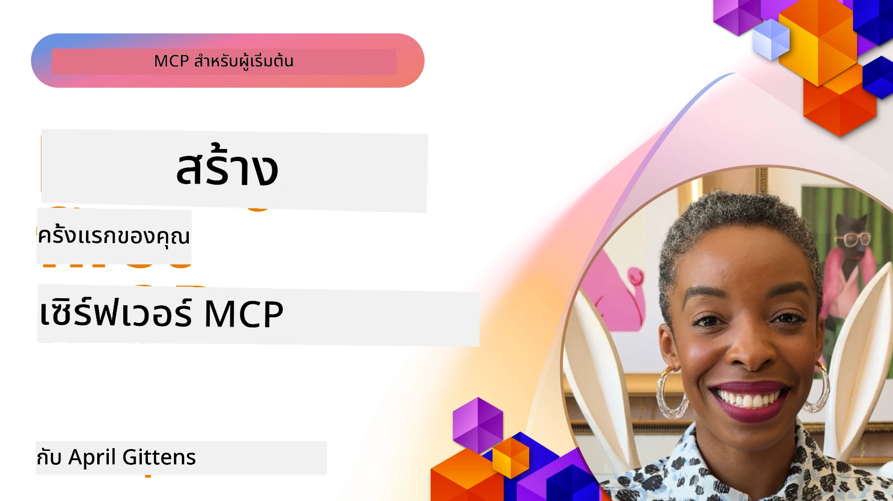

## Getting Started  

_(คลิกที่รูปภาพด้านบนเพื่อดูวิดีโอของบทเรียนนี้)_

ส่วนนี้ประกอบด้วยบทเรียนหลายบท:

- **1 Your first server**, ในบทเรียนแรกนี้ คุณจะได้เรียนรู้วิธีสร้างเซิร์ฟเวอร์ตัวแรกของคุณและตรวจสอบมันด้วยเครื่องมือ inspector ซึ่งเป็นวิธีที่มีค่ามากในการทดสอบและดีบักเซิร์ฟเวอร์ของคุณ, [ไปยังบทเรียน](01-first-server/README.md)

- **2 Client**, ในบทเรียนนี้ คุณจะได้เรียนรู้วิธีเขียนไคลเอนต์ที่สามารถเชื่อมต่อกับเซิร์ฟเวอร์ของคุณ, [ไปยังบทเรียน](02-client/README.md)

- **3 Client with LLM**, วิธีที่ดียิ่งขึ้นในการเขียนไคลเอนต์คือโดยการเพิ่ม LLM ให้กับมันเพื่อให้สามารถ "เจรจา" กับเซิร์ฟเวอร์ของคุณเกี่ยวกับสิ่งที่จะทำ, [ไปยังบทเรียน](03-llm-client/README.md)

- **4 Consuming a server GitHub Copilot Agent mode in Visual Studio Code**. ที่นี่ เราจะดูการรัน MCP Server ของเราจากภายใน Visual Studio Code, [ไปยังบทเรียน](04-vscode/README.md)

- **5 stdio Transport Server** stdio transport เป็นมาตรฐานที่แนะนำสำหรับการสื่อสาร MCP แบบเซิร์ฟเวอร์ถึงไคลเอนต์ในเครื่อง, ซึ่งให้การสื่อสารย่อยกระบวนการที่ปลอดภัยพร้อมการแยกกระบวนการในตัว [ไปยังบทเรียน](05-stdio-server/README.md)

- **6 HTTP Streaming with MCP (Streamable HTTP)**. เรียนรู้เกี่ยวกับการสื่อสาร HTTP Streaming แบบทันสมัย (วิธีการที่แนะนำสำหรับ MCP เซิร์ฟเวอร์ระยะไกลตาม [MCP Specification 2025-11-25](https://spec.modelcontextprotocol.io/specification/2025-11-25/basic/transports/#streamable-http)), การแจ้งเตือนความคืบหน้า, และวิธีการสร้าง MCP เซิร์ฟเวอร์และไคลเอนต์แบบเรียลไทม์ที่ขยายตัวได้โดยใช้ Streamable HTTP. [ไปยังบทเรียน](06-http-streaming/README.md)

- **7 Utilising AI Toolkit for VSCode** เพื่อใช้และทดสอบ MCP Clients และ Servers ของคุณ [ไปยังบทเรียน](07-aitk/README.md)

- **8 Testing**. ที่นี่เราจะเน้นเป็นพิเศษถึงวิธีการทดสอบเซิร์ฟเวอร์และไคลเอนต์ของเราในหลายๆ วิธี, [ไปยังบทเรียน](08-testing/README.md)

- **9 Deployment**. บทนี้จะดูวิธีต่าง ๆ ในการปรับใช้โซลูชั่น MCP ของคุณ, [ไปยังบทเรียน](09-deployment/README.md)

- **10 Advanced server usage**. บทนี้ครอบคลุมการใช้งานเซิร์ฟเวอร์ขั้นสูง, [ไปยังบทเรียน](./10-advanced/README.md)

- **11 Auth**. บทนี้ครอบคลุมวิธีการเพิ่มการพิสูจน์ตัวตนที่ง่าย ตั้งแต่ Basic Auth ไปจนถึงการใช้ JWT และ RBAC. คุณควรเริ่มต้นที่นี่แล้วจึงไปยังหัวข้อขั้นสูงในบทที่ 5 และดำเนินการเพิ่มความปลอดภัยตามคำแนะนำในบทที่ 2, [ไปยังบทเรียน](./11-simple-auth/README.md)

- **12 MCP Hosts**. กำหนดค่าและใช้ไคลเอนต์โฮสต์ MCP ที่ได้รับความนิยม ได้แก่ Claude Desktop, Cursor, Cline, และ Windsurf. เรียนรู้เกี่ยวกับประเภทการสื่อสารและการแก้ไขปัญหา, [ไปยังบทเรียน](./12-mcp-hosts/README.md)

- **13 MCP Inspector**. ดีบักและทดสอบ MCP servers ของคุณแบบโต้ตอบโดยใช้เครื่องมือ MCP Inspector. เรียนรู้เครื่องมือ, แหล่งข้อมูล, และข้อความโปรโตคอลสำหรับแก้ไขปัญหา, [ไปยังบทเรียน](./13-mcp-inspector/README.md)

โปรโตคอล Model Context (MCP) คือโปรโตคอลเปิดที่มาตรฐานการให้บริบทของแอปพลิเคชันแก่ LLMs คิดว่า MCP เหมือนพอร์ต USB-C สำหรับแอปพลิเคชัน AI — มันให้วิธีมาตรฐานในการเชื่อมต่อโมเดล AI กับแหล่งข้อมูลและเครื่องมือต่างๆ

## Learning Objectives

เมื่อจบบทเรียนนี้ คุณจะสามารถ:

- ตั้งค่าสภาพแวดล้อมการพัฒนาสำหรับ MCP ใน C#, Java, Python, TypeScript และ JavaScript
- สร้างและปรับใช้เซิร์ฟเวอร์ MCP พื้นฐานที่มีฟีเจอร์เฉพาะ (ทรัพยากร, คำสั่ง, และเครื่องมือ)
- สร้างแอปพลิเคชันโฮสต์ที่เชื่อมต่อกับเซิร์ฟเวอร์ MCP
- ทดสอบและดีบักการดำเนินการ MCP
- เข้าใจปัญหาที่มักเกิดขึ้นในการตั้งค่าและวิธีแก้ไข
- เชื่อมต่อการดำเนินการ MCP ของคุณกับบริการ LLM ที่ได้รับความนิยม

## Setting Up Your MCP Environment

ก่อนที่คุณจะเริ่มทำงานกับ MCP สิ่งสำคัญคือต้องเตรียมสภาพแวดล้อมการพัฒนาและเข้าใจกระบวนการทำงานพื้นฐาน ส่วนนี้จะนำคุณผ่านขั้นตอนการตั้งค่าเริ่มต้นเพื่อให้คุณเริ่มต้นกับ MCP ได้อย่างราบรื่น

### Prerequisites

ก่อนที่จะเริ่มพัฒนา MCP ให้แน่ใจว่าคุณมี:

- **Development Environment**: สำหรับภาษาที่คุณเลือก (C#, Java, Python, TypeScript หรือ JavaScript)
- **IDE/Editor**: Visual Studio, Visual Studio Code, IntelliJ, Eclipse, PyCharm หรือโปรแกรมแก้ไขโค้ดสมัยใหม่อื่นๆ
- **Package Managers**: NuGet, Maven/Gradle, pip หรือ npm/yarn
- **API Keys**: สำหรับบริการ AI ที่คุณมีแผนจะใช้ในแอปพลิเคชันโฮสต์ของคุณ

### Official SDKs

ในบทต่อไปคุณจะเห็นโซลูชันที่สร้างขึ้นโดยใช้ Python, TypeScript, Java และ .NET นี่คือ SDK ที่ได้รับการรองรับอย่างเป็นทางการทั้งหมด

MCP ให้ SDK อย่างเป็นทางการสำหรับหลายภาษา (สอดคล้องกับ [MCP Specification 2025-11-25](https://spec.modelcontextprotocol.io/specification/2025-11-25/)):
- [C# SDK](https://github.com/modelcontextprotocol/csharp-sdk) - ดูแลร่วมกับ Microsoft
- [Java SDK](https://github.com/modelcontextprotocol/java-sdk) - ดูแลร่วมกับ Spring AI
- [TypeScript SDK](https://github.com/modelcontextprotocol/typescript-sdk) - การใช้งาน TypeScript อย่างเป็นทางการ
- [Python SDK](https://github.com/modelcontextprotocol/python-sdk) - การใช้งาน Python อย่างเป็นทางการ (FastMCP)
- [Kotlin SDK](https://github.com/modelcontextprotocol/kotlin-sdk) - การใช้งาน Kotlin อย่างเป็นทางการ
- [Swift SDK](https://github.com/modelcontextprotocol/swift-sdk) - ดูแลร่วมกับ Loopwork AI
- [Rust SDK](https://github.com/modelcontextprotocol/rust-sdk) - การใช้งาน Rust อย่างเป็นทางการ
- [Go SDK](https://github.com/modelcontextprotocol/go-sdk) - การใช้งาน Go อย่างเป็นทางการ

## Key Takeaways

- การตั้งค่าสภาพแวดล้อมการพัฒนา MCP นั้นตรงไปตรงมาด้วย SDK เฉพาะภาษาต่าง ๆ
- การสร้างเซิร์ฟเวอร์ MCP เกี่ยวข้องกับการสร้างและลงทะเบียนเครื่องมือโดยมีสคีมาอย่างชัดเจน
- ไคลเอนต์ MCP เชื่อมต่อกับเซิร์ฟเวอร์และโมเดลเพื่อใช้ความสามารถขยายเพิ่มเติม
- การทดสอบและดีบักถือเป็นสิ่งจำเป็นสำหรับการดำเนินการ MCP ที่เชื่อถือได้
- ตัวเลือกในการปรับใช้มีตั้งแต่การพัฒนาในเครื่องจนถึงโซลูชั่นบนคลาวด์

## Practicing

เรามีตัวอย่างชุดหนึ่งที่เสริมการฝึกปฏิบัติที่คุณจะเห็นในทุกบทในส่วนนี้ นอกจากนี้แต่ละบทยังมีแบบฝึกหัดและภารกิจของตนเองด้วย

- [Java Calculator](./samples/java/calculator/README.md)
- [.Net Calculator](../../../03-GettingStarted/samples/csharp)
- [JavaScript Calculator](./samples/javascript/README.md)
- [TypeScript Calculator](./samples/typescript/README.md)
- [Python Calculator](../../../03-GettingStarted/samples/python)

## Additional Resources

- [Build Agents using Model Context Protocol on Azure](https://learn.microsoft.com/azure/developer/ai/intro-agents-mcp)
- [Remote MCP with Azure Container Apps (Node.js/TypeScript/JavaScript)](https://learn.microsoft.com/samples/azure-samples/mcp-container-ts/mcp-container-ts/)
- [.NET OpenAI MCP Agent](https://learn.microsoft.com/samples/azure-samples/openai-mcp-agent-dotnet/openai-mcp-agent-dotnet/)

## What's next

เริ่มต้นด้วยบทเรียนแรก: [Creating your first MCP Server](01-first-server/README.md)

เมื่อคุณเสร็จสิ้นโมดูลนี้แล้ว ให้ดำเนินการต่อไปที่: [Module 4: Practical Implementation](../04-PracticalImplementation/README.md)

---

<!-- CO-OP TRANSLATOR DISCLAIMER START -->
**ข้อจำกัดความรับผิดชอบ**:  
เอกสารนี้ได้รับการแปลโดยใช้บริการแปลภาษาอัตโนมัติ [Co-op Translator](https://github.com/Azure/co-op-translator) แม้ว่าจะพยายามให้ความถูกต้อง แต่โปรดทราบว่าการแปลอัตโนมัติอาจมีข้อผิดพลาดหรือความไม่ถูกต้อง เอกสารต้นฉบับในภาษาต้นทางควรถูกพิจารณาเป็นแหล่งข้อมูลที่เชื่อถือได้ สำหรับข้อมูลที่สำคัญ ควรใช้การแปลโดยผู้เชี่ยวชาญมืออาชีพ เราไม่รับผิดชอบต่อความเข้าใจผิดหรือการตีความผิดใด ๆ ที่เกิดจากการใช้การแปลนี้
<!-- CO-OP TRANSLATOR DISCLAIMER END -->