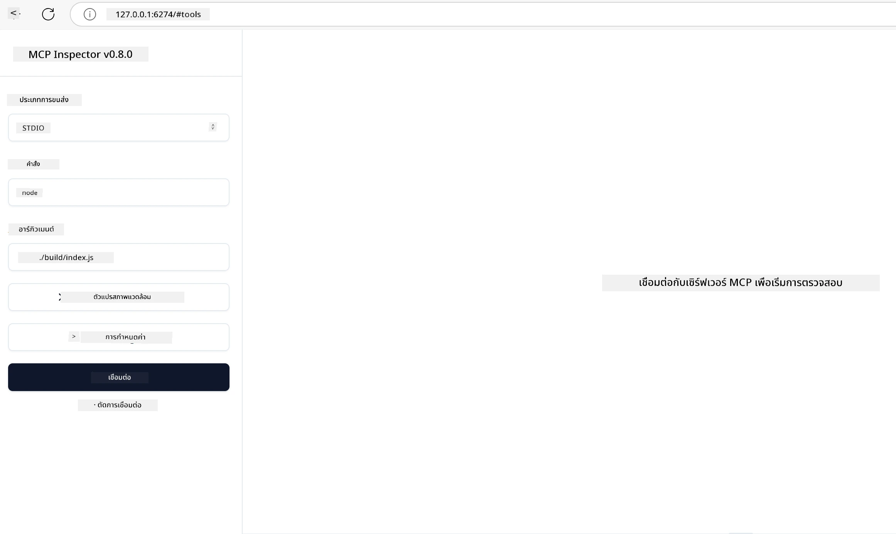

# การใช้งานจริง

[](https://youtu.be/vCN9-mKBDfQ)

_(คลิกที่ภาพด้านบนเพื่อดูวิดีโอบทเรียนนี้)_

การใช้งานจริงคือจุดที่พลังของ Model Context Protocol (MCP) กลายเป็นสิ่งที่จับต้องได้ แม้ว่าการเข้าใจทฤษฎีและสถาปัตยกรรมเบื้องหลัง MCP จะสำคัญ แต่คุณค่าที่แท้จริงจะเกิดขึ้นเมื่อคุณนำแนวคิดเหล่านี้ไปใช้ในการสร้าง ทดสอบ และปรับใช้โซลูชันที่แก้ปัญหาในโลกแห่งความเป็นจริง บทนี้เชื่อมช่องว่างระหว่างความรู้เชิงแนวคิดกับการพัฒนาจริง โดยจะนำทางคุณผ่านกระบวนการในการนำแอปพลิเคชันที่ใช้ MCP มาขับเคลื่อนชีวิตจริง

ไม่ว่าคุณจะพัฒนาผู้ช่วยอัจฉริยะ, ผสาน AI เข้ากับเวิร์กโฟลว์ธุรกิจ หรือสร้างเครื่องมือที่กำหนดเองสำหรับการประมวลผลข้อมูล MCP มีพื้นฐานที่ยืดหยุ่น การออกแบบที่ไม่ขึ้นกับภาษาโปรแกรม และ SDK อย่างเป็นทางการสำหรับภาษายอดนิยมทำให้ MCP เข้าถึงได้สำหรับนักพัฒนาทุกประเภท ด้วยการใช้ SDK เหล่านี้ คุณสามารถสร้างต้นแบบได้อย่างรวดเร็ว ทดลองใช้ และขยายโซลูชันของคุณข้ามแพลตฟอร์มและสภาพแวดล้อมต่าง ๆ

ในส่วนต่อไปนี้ คุณจะพบตัวอย่างใช้งานจริง โค้ดตัวอย่าง และกลยุทธ์การปรับใช้ที่แสดงวิธีการใช้งาน MCP ใน C#, Java กับ Spring, TypeScript, JavaScript และ Python คุณยังจะได้เรียนรู้วิธีการดีบักและทดสอบเซิร์ฟเวอร์ MCP, การจัดการ API และการปรับใช้โซลูชันไปยังคลาวด์โดยใช้ Azure แหล่งข้อมูลแบบลงมือทำเหล่านี้ถูกออกแบบมาเพื่อเร่งการเรียนรู้ของคุณและช่วยให้คุณสร้างแอป MCP ที่มั่นคงพร้อมใช้งานในระบบจริงอย่างมั่นใจ

## ภาพรวม

บทเรียนนี้เน้นด้านการใช้งานจริงของ MCP ในหลากหลายภาษาโปรแกรม เราจะสำรวจวิธีใช้ SDK MCP ใน C#, Java กับ Spring, TypeScript, JavaScript และ Python เพื่อสร้างแอปพลิเคชันที่มั่นคง ดีบักและทดสอบเซิร์ฟเวอร์ MCP และสร้างทรัพยากร, prompts และเครื่องมือที่นำกลับมาใช้ใหม่ได้

## วัตถุประสงค์การเรียนรู้

เมื่อจบบทเรียนนี้ คุณจะสามารถ:

- ใช้งานโซลูชัน MCP โดยใช้ SDK อย่างเป็นทางการในภาษาต่าง ๆ
- ดีบักและทดสอบเซิร์ฟเวอร์ MCP อย่างมีระบบ
- สร้างและใช้ฟีเจอร์ของเซิร์ฟเวอร์ (ทรัพยากร, prompts และเครื่องมือ)
- ออกแบบเวิร์กโฟลว์ MCP ที่มีประสิทธิภาพสำหรับงานที่ซับซ้อน
- ปรับแต่งการใช้งาน MCP เพื่อประสิทธิภาพและความน่าเชื่อถือ

## แหล่ง SDK อย่างเป็นทางการ

Model Context Protocol มี SDK อย่างเป็นทางการสำหรับหลายภาษา (สอดคล้องกับ [MCP Specification 2025-11-25](https://spec.modelcontextprotocol.io/specification/2025-11-25/)):

- [C# SDK](https://github.com/modelcontextprotocol/csharp-sdk)
- [Java กับ Spring SDK](https://github.com/modelcontextprotocol/java-sdk) **หมายเหตุ:** ต้องการ dependency กับ [Project Reactor](https://projectreactor.io) (ดู [ประเด็นอภิปรายข้อ 246](https://github.com/orgs/modelcontextprotocol/discussions/246))
- [TypeScript SDK](https://github.com/modelcontextprotocol/typescript-sdk)
- [Python SDK](https://github.com/modelcontextprotocol/python-sdk)
- [Kotlin SDK](https://github.com/modelcontextprotocol/kotlin-sdk)
- [Go SDK](https://github.com/modelcontextprotocol/go-sdk)

## การใช้งาน MCP SDK

ส่วนนี้ให้ตัวอย่างใช้งานจริงของ MCP ในหลายภาษาโปรแกรม คุณจะพบโค้ดตัวอย่างในไดเรกทอรี `samples` จัดเรียงตามภาษา

### ตัวอย่างที่มีให้

ที่เก็บนี้รวม [ตัวอย่างการใช้งาน](../../../04-PracticalImplementation/samples) ในภาษาต่อไปนี้:

- [C#](./samples/csharp/README.md)
- [Java กับ Spring](./samples/java/containerapp/README.md)
- [TypeScript](./samples/typescript/README.md)
- [JavaScript](./samples/javascript/README.md)
- [Python](./samples/python/README.md)

แต่ละตัวอย่างแสดงแนวคิดหลักของ MCP และรูปแบบการใช้งานสำหรับภาษานั้น ๆ และระบบนิเวศที่เกี่ยวข้อง

### คู่มือการใช้งานจริง

คู่มือเพิ่มเติมสำหรับการใช้งาน MCP อย่างจริงจัง:

- [การแบ่งหน้าและชุดผลลัพธ์ขนาดใหญ่](./pagination/README.md) - จัดการการแบ่งหน้าที่ใช้ cursor สำหรับเครื่องมือ, ทรัพยากร และชุดข้อมูลขนาดใหญ่

## ฟีเจอร์หลักของเซิร์ฟเวอร์

เซิร์ฟเวอร์ MCP สามารถใช้งานฟีเจอร์ใดก็ได้ต่อไปนี้:

### ทรัพยากร

ทรัพยากรให้บริบทและข้อมูลที่ผู้ใช้หรือโมเดล AI ใช้ได้:

- คลังเอกสาร
- ฐานความรู้
- แหล่งข้อมูลที่มีโครงสร้าง
- ระบบไฟล์

### Prompts

Prompts คือเทมเพลตข้อความและเวิร์กโฟลว์สำหรับผู้ใช้:

- แบบสนทนาที่กำหนดล่วงหน้า
- รูปแบบการมีปฏิสัมพันธ์ที่แนะนำ
- โครงสร้างบทสนทนาพิเศษ

### เครื่องมือ

เครื่องมือคือฟังก์ชันที่โมเดล AI สามารถเรียกใช้:

- เครื่องมือประมวลผลข้อมูล
- การผสานรวม API ภายนอก
- ความสามารถในการคำนวณ
- ฟังก์ชันการค้นหา

## ตัวอย่างการใช้งาน: การใช้งาน C#

ที่เก็บ SDK อย่างเป็นทางการของ C# มีตัวอย่างการใช้งาน MCP หลายตัวอย่างที่แสดงแง่มุมต่าง ๆ ของ MCP:

- **ไคลเอนต์ MCP พื้นฐาน**: ตัวอย่างง่ายๆ ที่แสดงวิธีสร้างไคลเอนต์ MCP และเรียกใช้เครื่องมือ
- **เซิร์ฟเวอร์ MCP พื้นฐาน**: การใช้งานเซิร์ฟเวอร์ที่เรียบง่ายพร้อมการลงทะเบียนเครื่องมือขั้นพื้นฐาน
- **เซิร์ฟเวอร์ MCP ขั้นสูง**: เซิร์ฟเวอร์ที่เต็มคุณสมบัติพร้อมการลงทะเบียนเครื่องมือ การตรวจสอบสิทธิ์ และการจัดการข้อผิดพลาด
- **การผสานรวม ASP.NET**: ตัวอย่างที่แสดงการผสานรวมกับ ASP.NET Core
- **รูปแบบการใช้งานเครื่องมือ**: รูปแบบต่าง ๆ สำหรับการใช้งานเครื่องมือระดับความซับซ้อนต่าง ๆ

SDK MCP สำหรับ C# ยังอยู่ในช่วงพรีวิวและ API อาจมีการเปลี่ยนแปลง เราจะอัปเดตบล็อกนี้อย่างต่อเนื่องตามการพัฒนาของ SDK

### ฟีเจอร์หลัก

- [C# MCP Nuget ModelContextProtocol](https://www.nuget.org/packages/ModelContextProtocol)
- การสร้าง [เซิร์ฟเวอร์ MCP แรกของคุณ](https://devblogs.microsoft.com/dotnet/build-a-model-context-protocol-mcp-server-in-csharp/).

สำหรับตัวอย่างการใช้งาน C# แบบสมบูรณ์ เยี่ยมชม [ที่เก็บตัวอย่าง SDK C# อย่างเป็นทางการ](https://github.com/modelcontextprotocol/csharp-sdk)

## ตัวอย่างการใช้งาน: การใช้งาน Java กับ Spring

SDK Java กับ Spring มีตัวเลือกการใช้งาน MCP ที่แข็งแกร่ง พร้อมฟีเจอร์ที่เหมาะกับองค์กร

### ฟีเจอร์หลัก

- การผสานรวมกับ Spring Framework
- ความปลอดภัยประเภทข้อมูลที่เข้มงวด
- การสนับสนุนการเขียนโปรแกรม Reactive
- การจัดการข้อผิดพลาดอย่างครบถ้วน

สำหรับตัวอย่างการใช้งาน Java กับ Spring แบบสมบูรณ์ ดูที่ [ตัวอย่าง Java กับ Spring](samples/java/containerapp/README.md) ในไดเรกทอรีตัวอย่าง

## ตัวอย่างการใช้งาน: การใช้งาน JavaScript

SDK JavaScript ให้วิธีการใช้งาน MCP ที่เบาและยืดหยุ่น

### ฟีเจอร์หลัก

- รองรับ Node.js และเบราว์เซอร์
- API แบบ Promise
- ผสานรวมง่ายกับ Express และเฟรมเวิร์กอื่น ๆ
- รองรับ WebSocket สำหรับสตรีมมิ่ง

สำหรับตัวอย่างการใช้งาน JavaScript แบบสมบูรณ์ ดูที่ [ตัวอย่าง JavaScript](samples/javascript/README.md) ในไดเรกทอรีตัวอย่าง

## ตัวอย่างการใช้งาน: การใช้งาน Python

SDK Python มอบแนวทางการใช้งาน MCP ที่เน้นความเป็น Pythonic พร้อมการผสานรวมที่ยอดเยี่ยมกับเฟรมเวิร์ก ML

### ฟีเจอร์หลัก

- รองรับ async/await ด้วย asyncio
- การผสานรวม FastAPI
- การลงทะเบียนเครื่องมือที่เรียบง่าย
- การผสานรวมเนทีฟกับไลบรารี ML ยอดนิยม

สำหรับตัวอย่างการใช้งาน Python แบบสมบูรณ์ ดูที่ [ตัวอย่าง Python](samples/python/README.md) ในไดเรกทอรีตัวอย่าง

## การจัดการ API

Azure API Management เป็นคำตอบที่ดีสำหรับวิธีการรักษาความปลอดภัยเซิร์ฟเวอร์ MCP แนวคิดคือการวางอินสแตนซ์ Azure API Management ไว้หน้าของเซิร์ฟเวอร์ MCP ของคุณและให้จัดการฟีเจอร์ต่าง ๆ ที่คุณน่าจะต้องการ เช่น:

- การจำกัดความถี่
- การจัดการโทเค็น
- การเฝ้าติดตาม
- การปรับสมดุลโหลด
- ความปลอดภัย

### ตัวอย่าง Azure

นี่คือตัวอย่าง Azure ที่ทำตามแนวทางนี้อย่างครบถ้วน คือ [การสร้างเซิร์ฟเวอร์ MCP และรักษาความปลอดภัยด้วย Azure API Management](https://github.com/Azure-Samples/remote-mcp-apim-functions-python)

ดูว่ากระบวนการ authorization เกิดขึ้นอย่างไรในภาพด้านล่างนี้:


ในภาพด้านบนมีการดำเนินการดังนี้:

- การตรวจสอบสิทธิ์/การอนุญาตดำเนินการโดยใช้ Microsoft Entra
- Azure API Management ทำหน้าที่เป็นเกตเวย์และใช้โพลิซีเพื่อควบคุมและจัดการทราฟฟิก
- Azure Monitor บันทึกคำขอทั้งหมดเพื่อการวิเคราะห์เพิ่มเติม

#### กระบวนการ authorization

มาดูรายละเอียดกระบวนการ authorization กัน:


#### สเปคการอนุญาต MCP

เรียนรู้เพิ่มเติมเกี่ยวกับ [สเปคการอนุญาต MCP](https://spec.modelcontextprotocol.io/specification/2025-11-25/basic/authorization/)

## ปรับใช้ Remote MCP Server ไปยัง Azure

มาดูกันว่าสามารถปรับใช้ตัวอย่างที่กล่าวถึงก่อนหน้านี้ได้หรือไม่:

1. โคลนรีโพ

    ```bash
    git clone https://github.com/Azure-Samples/remote-mcp-apim-functions-python.git
    cd remote-mcp-apim-functions-python
    ```

1. ลงทะเบียน resource provider `Microsoft.App`

   - หากคุณใช้ Azure CLI ให้รัน `az provider register --namespace Microsoft.App --wait`
   - หากใช้ Azure PowerShell ให้รัน `Register-AzResourceProvider -ProviderNamespace Microsoft.App` จากนั้นรัน `(Get-AzResourceProvider -ProviderNamespace Microsoft.App).RegistrationState` หลังจากนั้นสักพักเพื่อตรวจสอบว่าการลงทะเบียนเสร็จสมบูรณ์หรือไม่

1. รันคำสั่ง [azd](https://aka.ms/azd) นี้เพื่อจัดเตรียมบริการจัดการ API, แอปฟังก์ชัน (พร้อมโค้ด) และทรัพยากร Azure ที่จำเป็นทั้งหมด

    ```shell
    azd up
    ```

    คำสั่งนี้ควรปรับใช้ทรัพยากรบนคลาวด์ใน Azure ทั้งหมด

### ทดสอบเซิร์ฟเวอร์ของคุณด้วย MCP Inspector

1. ใน **หน้าต่างเทอร์มินัลใหม่** ให้ติดตั้งและรัน MCP Inspector

    ```shell
    npx @modelcontextprotocol/inspector
    ```

    คุณควรเห็นอินเทอร์เฟซคล้ายกับ:

    

1. กด CTRL คลิกเพื่อโหลดเว็บแอป MCP Inspector จาก URL ที่แอปแสดง (เช่น [http://127.0.0.1:6274/#resources](http://127.0.0.1:6274/#resources))
1. ตั้งค่าประเภทการส่งข้อมูลเป็น `SSE`
1. ตั้งค่า URL เป็นจุดสิ้นสุด API Management SSE ของคุณที่แสดงหลังจากรัน `azd up` แล้ว **เชื่อมต่อ**:

    ```shell
    https://<apim-servicename-from-azd-output>.azure-api.net/mcp/sse
    ```

1. **รายการเครื่องมือ** คลิกที่เครื่องมือและ **รันเครื่องมือ**

หากทุกขั้นตอนทำงานได้ คุณควรเชื่อมต่อกับเซิร์ฟเวอร์ MCP ได้และสามารถเรียกใช้เครื่องมือได้

## เซิร์ฟเวอร์ MCP สำหรับ Azure

[Remote-mcp-functions](https://github.com/Azure-Samples/remote-mcp-functions-dotnet): ชุดรีโพที่เป็นเทมเพลตสตาร์ทเตอร์สำหรับสร้างและปรับใช้เซิร์ฟเวอร์ MCP ระยะไกลที่กำหนดเองโดยใช้ Azure Functions กับ Python, C# .NET หรือ Node/TypeScript

ตัวอย่างเหล่านี้ให้โซลูชันครบถ้วนที่ช่วยให้นักพัฒนาสามารถ:

- สร้างและรันในเครื่อง: พัฒนาและดีบักเซิร์ฟเวอร์ MCP บนเครื่องท้องถิ่น
- ปรับใช้ไปยัง Azure: ปรับใช้บนคลาวด์ได้ง่ายด้วยคำสั่ง azd up เพียงคำสั่งเดียว
- เชื่อมต่อจากคลไคลเอนต์: เชื่อมต่อกับเซิร์ฟเวอร์ MCP จากไคลเอนต์ต่าง ๆ รวมถึงโหมด Copilot Agent ของ VS Code และเครื่องมือ MCP Inspector

### ฟีเจอร์หลัก

- ความปลอดภัยโดยออกแบบ: เซิร์ฟเวอร์ MCP ปลอดภัยด้วยคีย์และ HTTPS
- ตัวเลือกการตรวจสอบสิทธิ์: รองรับ OAuth ด้วยระบบตรวจสอบสิทธิ์ในตัวและ/หรือ API Management
- การแยกเครือข่าย: รองรับการแยกเครือข่ายด้วย Azure Virtual Network (VNET)
- สถาปัตยกรรม Serverless: ใช้ Azure Functions สำหรับการประมวลผลแบบสเกลได้ตามเหตุการณ์
- การพัฒนาในเครื่อง: รองรับการพัฒนาและดีบักอย่างครบถ้วนในเครื่อง
- การปรับใช้ที่ง่าย: กระบวนการปรับใช้ที่รวดเร็วไปยัง Azure

ที่เก็บรวมไฟล์กำหนดค่าที่จำเป็นทั้งหมด โค้ดต้นทาง และคำจำกัดความสถาปัตยกรรม เพื่อเริ่มต้นใช้งานเซิร์ฟเวอร์ MCP สำหรับใช้งานจริงได้อย่างรวดเร็ว

- [Azure Remote MCP Functions Python](https://github.com/Azure-Samples/remote-mcp-functions-python) - ตัวอย่างการใช้งาน MCP ด้วย Azure Functions กับ Python

- [Azure Remote MCP Functions .NET](https://github.com/Azure-Samples/remote-mcp-functions-dotnet) - ตัวอย่างการใช้งาน MCP ด้วย Azure Functions กับ C# .NET

- [Azure Remote MCP Functions Node/Typescript](https://github.com/Azure-Samples/remote-mcp-functions-typescript) - ตัวอย่างการใช้งาน MCP ด้วย Azure Functions กับ Node/TypeScript

## สรุปข้อสำคัญ

- SDK MCP ให้เครื่องมือเฉพาะภาษาสำหรับการใช้งานโซลูชัน MCP ที่มั่นคง
- กระบวนการดีบักและทดสอบสำคัญสำหรับแอป MCP ที่น่าเชื่อถือ
- เทมเพลต prompt ที่นำกลับมาใช้ใหม่ได้ช่วยให้ปฏิสัมพันธ์กับ AI สม่ำเสมอ
- เวิร์กโฟลว์ที่ออกแบบดีช่วยจัดการงานซับซ้อนได้ด้วยเครื่องมือหลายตัว
- การใช้งาน MCP ต้องคำนึงถึงความปลอดภัย ประสิทธิภาพ และการจัดการข้อผิดพลาด

## แบบฝึกหัด

ออกแบบเวิร์กโฟลว์ MCP ที่ใช้งานได้จริงซึ่งแก้ไขปัญหาในโลกจริงของโดเมนคุณ:

1. ระบุเครื่องมือ 3-4 ตัวที่มีประโยชน์สำหรับแก้ปัญหานี้
2. สร้างไดอะแกรมเวิร์กโฟลว์แสดงการทำงานร่วมกันของเครื่องมือเหล่านี้
3. นำเครื่องมือหนึ่งตัวมาติดตั้งใช้งานเวอร์ชันพื้นฐานโดยใช้ภาษาที่คุณถนัด
4. สร้างเทมเพลต prompt ที่ช่วยให้โมเดลใช้เครื่องมือของคุณอย่างมีประสิทธิภาพ

## แหล่งข้อมูลเพิ่มเติม

---

## ต่อไป

ถัดไป: [หัวข้อขั้นสูง](../05-AdvancedTopics/README.md)

---

<!-- CO-OP TRANSLATOR DISCLAIMER START -->
**ข้อจำกัดความรับผิดชอบ**:
เอกสารนี้ได้รับการแปลโดยใช้บริการแปลภาษา AI [Co-op Translator](https://github.com/Azure/co-op-translator) แม้เราจะพยายามให้ความถูกต้องสูงสุด โปรดทราบว่าการแปลโดยอัตโนมัติอาจมีข้อผิดพลาดหรือความไม่ถูกต้อง เอกสารต้นฉบับในภาษาต้นทางควรถูกพิจารณาเป็นแหล่งข้อมูลที่เชื่อถือได้ สำหรับข้อมูลที่มีความสำคัญ ขอแนะนำให้ใช้บริการแปลโดยมนุษย์มืออาชีพ เราไม่รับผิดชอบต่อความเข้าใจผิดหรือการตีความผิดที่เกิดขึ้นจากการใช้การแปลนี้
<!-- CO-OP TRANSLATOR DISCLAIMER END -->