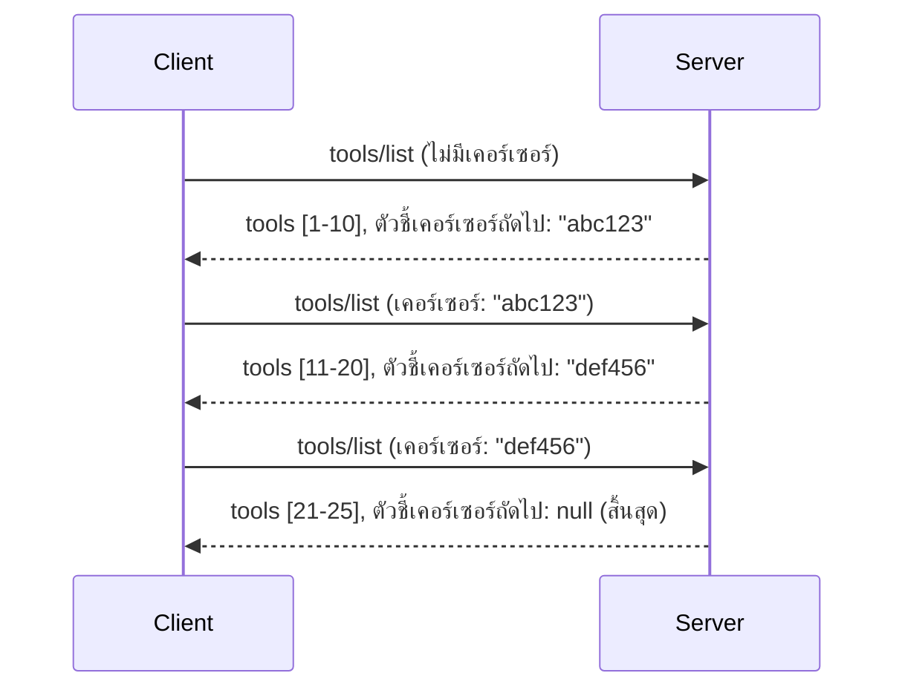

# การแบ่งหน้าผลลัพธ์และชุดผลลัพธ์ขนาดใหญ่ใน MCP

เมื่อเซิร์ฟเวอร์ MCP ของคุณจัดการกับชุดข้อมูลขนาดใหญ่—ไม่ว่าจะเป็นการแสดงรายการไฟล์นับพัน รายการฐานข้อมูล หรือผลลัพธ์การค้นหา—คุณจำเป็นต้องใช้การแบ่งหน้าเพื่อจัดการหน่วยความจำอย่างมีประสิทธิภาพและมอบประสบการณ์ผู้ใช้ที่ตอบสนองได้รวดเร็ว ไกด์นี้อธิบายวิธีการใช้งานและการนำการแบ่งหน้าไปใช้ใน MCP

## ทำไมการแบ่งหน้าถึงสำคัญ

หากไม่ใช้การแบ่งหน้า การตอบสนองขนาดใหญ่สามารถทำให้เกิด:

- **หน่วยความจำหมด** — โหลดเรคคอร์ดนับล้านพร้อมกัน
- **เวลาตอบสนองช้า** — ผู้ใช้ต้องรอขณะที่ข้อมูลทั้งหมดกำลังโหลด
- **ข้อผิดพลาดหมดเวลารอ** — คำขอเกินขีดจำกัดเวลารอ
- **ประสิทธิภาพ AI แย่ลง** — LLMs มีปัญหาเมื่อต้องรับมือกับบริบทขนาดใหญ่

MCP ใช้ **การแบ่งหน้าด้วยเคอร์เซอร์** สำหรับการเลื่อนดูชุดผลลัพธ์ที่เชื่อถือได้และสม่ำเสมอ

---

## การแบ่งหน้าของ MCP ทำงานอย่างไร

### แนวคิดเคอร์เซอร์

**เคอร์เซอร์** คือสตริงที่ไม่สามารถมองเห็นรายละเอียดภายใน ที่ระบุตำแหน่งของคุณในชุดผลลัพธ์ คิดเหมือนบุ๊กมาร์กในหนังสือเล่มยาว


### การแบ่งหน้าในเมธอด MCP

เมธอด MCP เหล่านี้สนับสนุนการแบ่งหน้า:

| เมธอด | ผลลัพธ์ | รองรับเคอร์เซอร์ |
|--------|---------|----------------|
| `tools/list` | คำนิยามเครื่องมือ | ✅ |
| `resources/list` | คำนิยามทรัพยากร | ✅ |
| `prompts/list` | คำนิยามพรอมต์ | ✅ |
| `resources/templates/list` | เทมเพลตทรัพยากร | ✅ |

---

## การนำไปใช้บนเซิร์ฟเวอร์

### Python (FastMCP)

```python
from mcp.server import Server
from mcp.types import Tool, ListToolsResult
import math

app = Server("paginated-server")

# ชุดข้อมูลขนาดใหญ่ที่จำลองขึ้น
ALL_TOOLS = [
    Tool(name=f"tool_{i}", description=f"Tool number {i}", inputSchema={})
    for i in range(100)
]

PAGE_SIZE = 10

@app.list_tools()
async def list_tools(cursor: str | None = None) -> ListToolsResult:
    """List tools with pagination support."""
    
    # ถอดรหัสเคอร์เซอร์เพื่อรับดัชนีเริ่มต้น
    start_index = 0
    if cursor:
        try:
            start_index = int(cursor)
        except ValueError:
            start_index = 0
    
    # รับหน้าของผลลัพธ์
    end_index = min(start_index + PAGE_SIZE, len(ALL_TOOLS))
    page_tools = ALL_TOOLS[start_index:end_index]
    
    # คำนวณเคอร์เซอร์ถัดไป
    next_cursor = None
    if end_index < len(ALL_TOOLS):
        next_cursor = str(end_index)
    
    return ListToolsResult(
        tools=page_tools,
        nextCursor=next_cursor
    )
```

### TypeScript

```typescript
import { Server } from "@modelcontextprotocol/sdk/server/index.js";
import { ListToolsResultSchema } from "@modelcontextprotocol/sdk/types.js";

const server = new Server({
  name: "paginated-server",
  version: "1.0.0"
});

// ชุดข้อมูลขนาดใหญ่ที่จำลองขึ้น
const ALL_TOOLS = Array.from({ length: 100 }, (_, i) => ({
  name: `tool_${i}`,
  description: `Tool number ${i}`,
  inputSchema: { type: "object", properties: {} }
}));

const PAGE_SIZE = 10;

server.setRequestHandler(ListToolsResultSchema, async (request) => {
  // ถอดรหัสเคอร์เซอร์
  let startIndex = 0;
  if (request.params?.cursor) {
    startIndex = parseInt(request.params.cursor, 10) || 0;
  }
  
  // รับหน้าผลลัพธ์
  const endIndex = Math.min(startIndex + PAGE_SIZE, ALL_TOOLS.length);
  const pageTools = ALL_TOOLS.slice(startIndex, endIndex);
  
  // คำนวณเคอร์เซอร์ถัดไป
  const nextCursor = endIndex < ALL_TOOLS.length ? String(endIndex) : undefined;
  
  return {
    tools: pageTools,
    nextCursor
  };
});
```

### Java (Spring MCP)

```java
@Service
public class PaginatedToolService {
    
    private static final int PAGE_SIZE = 10;
    private final List<Tool> allTools;
    
    public PaginatedToolService() {
        // เริ่มต้นชุดข้อมูลขนาดใหญ่
        this.allTools = IntStream.range(0, 100)
            .mapToObj(i -> new Tool("tool_" + i, "Tool number " + i, Map.of()))
            .collect(Collectors.toList());
    }
    
    @McpMethod("tools/list")
    public ListToolsResult listTools(@Param("cursor") String cursor) {
        // ถอดรหัสเคอร์เซอร์
        int startIndex = 0;
        if (cursor != null && !cursor.isEmpty()) {
            try {
                startIndex = Integer.parseInt(cursor);
            } catch (NumberFormatException e) {
                startIndex = 0;
            }
        }
        
        // รับหน้าของผลลัพธ์
        int endIndex = Math.min(startIndex + PAGE_SIZE, allTools.size());
        List<Tool> pageTools = allTools.subList(startIndex, endIndex);
        
        // คำนวณเคอร์เซอร์ถัดไป
        String nextCursor = endIndex < allTools.size() ? String.valueOf(endIndex) : null;
        
        return new ListToolsResult(pageTools, nextCursor);
    }
}
```

---

## การนำไปใช้บนไคลเอนต์

### ไคลเอนต์ Python

```python
from mcp import ClientSession

async def get_all_tools(session: ClientSession) -> list:
    """Fetch all tools using pagination."""
    all_tools = []
    cursor = None
    
    while True:
        result = await session.list_tools(cursor=cursor)
        all_tools.extend(result.tools)
        
        if result.nextCursor is None:
            break
        cursor = result.nextCursor
    
    return all_tools

# วิธีใช้
async with client_session as session:
    tools = await get_all_tools(session)
    print(f"Found {len(tools)} tools")
```

### ไคลเอนต์ TypeScript

```typescript
import { Client } from "@modelcontextprotocol/sdk/client/index.js";

async function getAllTools(client: Client): Promise<Tool[]> {
  const allTools: Tool[] = [];
  let cursor: string | undefined = undefined;
  
  do {
    const result = await client.listTools({ cursor });
    allTools.push(...result.tools);
    cursor = result.nextCursor;
  } while (cursor);
  
  return allTools;
}

// การใช้งาน
const tools = await getAllTools(client);
console.log(`Found ${tools.length} tools`);
```

### รูปแบบการโหลดแบบ Lazy

สำหรับชุดข้อมูลขนาดใหญ่มาก ให้โหลดหน้าเมื่อจำเป็น:

```python
class PaginatedToolIterator:
    """Lazily iterate through paginated tools."""
    
    def __init__(self, session: ClientSession):
        self.session = session
        self.cursor = None
        self.buffer = []
        self.exhausted = False
    
    async def __anext__(self):
        # คืนค่าจากบัฟเฟอร์ถ้ามี
        if self.buffer:
            return self.buffer.pop(0)
        
        # ตรวจสอบว่าเราได้ใช้หน้าทั้งหมดหมดแล้วหรือยัง
        if self.exhausted:
            raise StopAsyncIteration
        
        # ดึงหน้าถัดไป
        result = await self.session.list_tools(cursor=self.cursor)
        self.buffer = list(result.tools)
        self.cursor = result.nextCursor
        
        if self.cursor is None:
            self.exhausted = True
        
        if not self.buffer:
            raise StopAsyncIteration
        
        return self.buffer.pop(0)
    
    def __aiter__(self):
        return self

# การใช้งาน - ประหยัดหน่วยความจำสำหรับชุดข้อมูลขนาดใหญ่
async for tool in PaginatedToolIterator(session):
    process_tool(tool)
```

---

## การแบ่งหน้าสำหรับทรัพยากร

ทรัพยากรมักจะต้องแบ่งหน้าสำหรับไดเรกทอรีหรือชุดข้อมูลขนาดใหญ่:

```python
from mcp.server import Server
from mcp.types import Resource, ListResourcesResult
import os

app = Server("file-server")

@app.list_resources()
async def list_resources(cursor: str | None = None) -> ListResourcesResult:
    """List files in directory with pagination."""
    
    directory = "/data/files"
    all_files = sorted(os.listdir(directory))
    
    # ถอดรหัสเคอร์เซอร์ (ดัชนีไฟล์)
    start_index = int(cursor) if cursor else 0
    page_size = 20
    end_index = min(start_index + page_size, len(all_files))
    
    # สร้างรายการทรัพยากรสำหรับหน้านี้
    resources = []
    for filename in all_files[start_index:end_index]:
        filepath = os.path.join(directory, filename)
        resources.append(Resource(
            uri=f"file://{filepath}",
            name=filename,
            mimeType="application/octet-stream"
        ))
    
    # คำนวณเคอร์เซอร์ถัดไป
    next_cursor = str(end_index) if end_index < len(all_files) else None
    
    return ListResourcesResult(
        resources=resources,
        nextCursor=next_cursor
    )
```

---

## กลยุทธ์การออกแบบเคอร์เซอร์

### กลยุทธ์ที่ 1: แบบอิงดัชนี (ง่าย)

```python
# ตัวชี้เป็นเพียงดัชนี
cursor = "50"  # เริ่มที่รายการที่ 50
```

**ข้อดี:** ง่าย ไม่ต้องเก็บสถานะ  
**ข้อเสีย:** ผลลัพธ์อาจเปลี่ยนแปลงได้ถ้ามีการเพิ่ม/ลบรายการ  

### กลยุทธ์ที่ 2: แบบอิง ID (เสถียร)

```python
# เคอร์เซอร์คือ ID ล่าสุดที่เห็น
cursor = "item_abc123"  # เริ่มหลังจากรายการนี้
```

**ข้อดี:** เสถียรแม้ข้อมูลจะเปลี่ยนแปลง  
**ข้อเสีย:** ต้องมี ID ที่เรียงลำดับ  

### กลยุทธ์ที่ 3: เข้ารหัสสถานะ (ซับซ้อน)

```python
import base64
import json

def encode_cursor(state: dict) -> str:
    return base64.b64encode(json.dumps(state).encode()).decode()

def decode_cursor(cursor: str) -> dict:
    return json.loads(base64.b64decode(cursor).decode())

# เคอร์เซอร์มีหลายฟิลด์สถานะ
cursor = encode_cursor({
    "offset": 50,
    "filter": "active",
    "sort": "name"
})
```

**ข้อดี:** สามารถเข้ารหัสสถานะซับซ้อนได้  
**ข้อเสีย:** ซับซ้อนกว่า สตริงเคอร์เซอร์มีขนาดใหญ่ขึ้น  

---

## แนวทางปฏิบัติที่ดีที่สุด

### 1. เลือกขนาดหน้าที่เหมาะสม

```python
# พิจารณาขนาดข้อมูล
PAGE_SIZE_SMALL_ITEMS = 100   # เมตาดาต้าง่ายๆ
PAGE_SIZE_MEDIUM_ITEMS = 20   # วัตถุที่ซับซ้อนมากขึ้น
PAGE_SIZE_LARGE_ITEMS = 5     # เนื้อหาที่ซับซ้อน
```

### 2. จัดการเคอร์เซอร์ที่ไม่ถูกต้องอย่างราบรื่น

```python
@app.list_tools()
async def list_tools(cursor: str | None = None) -> ListToolsResult:
    try:
        start_index = int(cursor) if cursor else 0
        if start_index < 0 or start_index >= len(ALL_TOOLS):
            start_index = 0  # รีเซ็ตไปยังจุดเริ่มต้น
    except (ValueError, TypeError):
        start_index = 0  # ตัวชี้ตำแหน่งไม่ถูกต้อง, เริ่มใหม่
    # ...
```

### 3. รวมจำนวนทั้งหมด (ไม่บังคับ)

```python
return ListToolsResult(
    tools=page_tools,
    nextCursor=next_cursor,
    # การใช้งานบางส่วนรวมถึงผลรวมสำหรับความคืบหน้าของ UI
    _meta={"total": len(ALL_TOOLS)}
)
```

### 4. ทดสอบกรณีขอบ

```python
async def test_pagination():
    # ชุดผลลัพธ์ว่างเปล่า
    result = await session.list_tools()
    assert result.tools == []
    assert result.nextCursor is None
    
    # หน้าหนึ่งหน้า
    result = await session.list_tools()
    assert len(result.tools) <= PAGE_SIZE
    
    # ตัวชี้ตำแหน่งไม่ถูกต้อง
    result = await session.list_tools(cursor="invalid")
    assert result.tools  # ควรส่งคืนหน้าที่หนึ่ง
```

---

## จุดที่มักทำผิด

### ❌ ส่งคืนผลลัพธ์ทั้งหมดแล้วแบ่งหน้าฝั่งไคลเอนต์

```python
# แย่: โหลดทุกอย่างเข้าไปในหน่วยความจำ
@app.list_tools()
async def list_tools() -> ListToolsResult:
    all_tools = load_all_tools()  # 1 ล้านเครื่องมือ!
    return ListToolsResult(tools=all_tools)
```

### ✅ แบ่งหน้าที่แหล่งข้อมูล

```python
# ดี: โหลดเฉพาะสิ่งที่จำเป็นเท่านั้น
@app.list_tools()
async def list_tools(cursor: str | None = None) -> ListToolsResult:
    offset = int(cursor) if cursor else 0
    tools = await db.query_tools(offset=offset, limit=PAGE_SIZE)
    return ListToolsResult(tools=tools, nextCursor=...)
```

---

## สิ่งถัดไป

- [โมดูล 5.14 - วิศวกรรมบริบท](../../05-AdvancedTopics/mcp-contextengineering/README.md)
- [โมดูล 8 - แนวทางปฏิบัติที่ดีที่สุด](../../08-BestPractices/README.md)
- [3.8 - การทดสอบเซิร์ฟเวอร์ MCP ของคุณ](../../03-GettingStarted/08-testing/README.md)

---

## แหล่งข้อมูลเพิ่มเติม

- [ข้อกำหนด MCP - การแบ่งหน้า](https://spec.modelcontextprotocol.io/specification/2025-11-25/)
- [อธิบายการแบ่งหน้าด้วยเคอร์เซอร์](https://slack.engineering/evolving-api-pagination-at-slack/)
- [การทดสอบการแบ่งหน้าของ Python SDK](https://github.com/modelcontextprotocol/python-sdk/blob/main/tests/client/test_list_methods_cursor.py)

---

<!-- CO-OP TRANSLATOR DISCLAIMER START -->
**ข้อจำกัดความรับผิดชอบ**:  
เอกสารนี้ได้รับการแปลโดยใช้บริการแปลภาษา AI [Co-op Translator](https://github.com/Azure/co-op-translator) แม้ว่าเราจะพยายามให้มีความถูกต้องสูงสุด โปรดทราบว่าการแปลโดยอัตโนมัติอาจมีข้อผิดพลาดหรือความคลาดเคลื่อนได้ เอกสารต้นฉบับในภาษาต้นทางควรถูกพิจารณาเป็นแหล่งข้อมูลที่ถูกต้อง สำหรับข้อมูลที่สำคัญ ขอแนะนำให้ใช้บริการแปลโดยมนุษย์ผู้เชี่ยวชาญ เราจะไม่รับผิดชอบต่อความเข้าใจผิดหรือการตีความผิดที่เกิดขึ้นจากการใช้การแปลนี้
<!-- CO-OP TRANSLATOR DISCLAIMER END -->