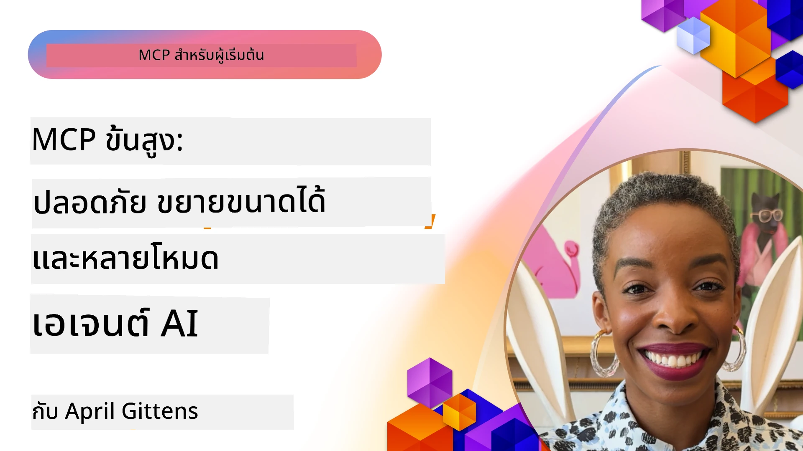

# หัวข้อขั้นสูงใน MCP

_(คลิกที่รูปภาพด้านบนเพื่อดูวิดีโอของบทเรียนนี้)_

บทนี้ครอบคลุมหัวข้อขั้นสูงใน การใช้งานโปรโตคอลบริบทของโมเดล (Model Context Protocol - MCP) รวมถึงการบูรณาการมัลติโมดอล ความสามารถในการปรับขนาด แนวทางปฏิบัติที่ดีที่สุดด้านความปลอดภัย และการรวมกับองค์กร หัวข้อเหล่านี้สำคัญสำหรับการสร้างแอป MCP ที่แข็งแกร่งและพร้อมสำหรับการใช้งานในระบบจริงที่ตอบสนองความต้องการของระบบ AI สมัยใหม่

## ภาพรวม

บทเรียนนี้สำรวจแนวคิดขั้นสูงในการประยุกต์ใช้โปรโตคอลบริบทของโมเดล เน้นที่การบูรณาการมัลติโมดอล ความสามารถในการปรับขนาด แนวทางปฏิบัติที่ดีที่สุดด้านความปลอดภัย และการรวมกับองค์กร หัวข้อเหล่านี้เป็นสิ่งจำเป็นสำหรับการสร้างแอป MCP ระดับการผลิตที่สามารถจัดการกับข้อกำหนดที่ซับซ้อนในสภาพแวดล้อมองค์กร

## วัตถุประสงค์การเรียนรู้

เมื่อจบบทเรียนนี้ คุณจะสามารถ:

- นำความสามารถมัลติโมดอลมาใช้ภายในกรอบงาน MCP
- ออกแบบสถาปัตยกรรม MCP ที่ปรับขนาดได้สำหรับสถานการณ์ที่มีความต้องการสูง
- นำแนวทางปฏิบัติที่ดีที่สุดด้านความปลอดภัยที่สอดคล้องกับหลักการด้านความปลอดภัยของ MCP มาใช้
- รวม MCP กับระบบและกรอบงาน AI ขององค์กร
- ปรับแต่งประสิทธิภาพและความน่าเชื่อถือในสภาพแวดล้อมการผลิต

## บทเรียนและโปรเจกต์ตัวอย่าง

| ลิงก์ | ชื่อเรื่อง | คำอธิบาย |
|------|-------|-------------|
| [5.1 Integration with Azure](./mcp-integration/README.md) | รวมกับ Azure | เรียนรู้วิธีรวม MCP Server ของคุณบน Azure |
| [5.2 Multi modal sample](./mcp-multi-modality/README.md) | ตัวอย่าง MCP มัลติโมดอล | ตัวอย่างสำหรับเสียง รูปภาพ และการตอบสนองมัลติโมดอล |
| [5.3 MCP OAuth2 sample](../../../05-AdvancedTopics/mcp-oauth2-demo) | ตัวอย่าง MCP OAuth2 | แอป Spring Boot ขั้นต่ำแสดง OAuth2 กับ MCP ทั้งในฐานะเซิร์ฟเวอร์ยืนยันตัวตนและเซิร์ฟเวอร์ทรัพยากร แสดงการออกโทเค็นที่ปลอดภัย จุดสิ้นสุดที่ได้รับการป้องกัน การปรับใช้ Azure Container Apps และการรวมการจัดการ API |
| [5.4 Root Contexts](./mcp-root-contexts/README.md) | บริบทราก | เรียนรู้เพิ่มเติมเกี่ยวกับบริบทรากและวิธีการใช้งาน |
| [5.5 Routing](./mcp-routing/README.md) | การกำหนดเส้นทาง | เรียนรู้ประเภทต่าง ๆ ของการกำหนดเส้นทาง |
| [5.6 Sampling](./mcp-sampling/README.md) | การสุ่มตัวอย่าง | เรียนรู้วิธีใช้การสุ่มตัวอย่าง |
| [5.7 Scaling](./mcp-scaling/README.md) | การปรับขนาด | เรียนรู้เกี่ยวกับการปรับขนาด |
| [5.8 Security](./mcp-security/README.md) | ความปลอดภัย | ปกป้อง MCP Server ของคุณ |
| [5.9 Web Search sample](./web-search-mcp/README.md) | การค้นหาเว็บ MCP | เซิร์ฟเวอร์และไคลเอนต์ Python MCP รวมกับ SerpAPI สำหรับการค้นหาเว็บ ข่าว สินค้า และถามตอบแบบเรียลไทม์ แสดงการจัดการเครื่องมือหลายอย่าง การรวม API ภายนอก และการจัดการข้อผิดพลาดที่แข็งแกร่ง |
| [5.10 Realtime Streaming](./mcp-realtimestreaming/README.md) | การสตรีม | การสตรีมข้อมูลเรียลไทม์เป็นสิ่งจำเป็นในโลกยุคข้อมูลซึ่งธุรกิจและแอปพลิเคชันต้องการเข้าถึงข้อมูลทันทีเพื่อการตัดสินใจที่รวดเร็ว |
| [5.11 Realtime Web Search](./mcp-realtimesearch/README.md) | การค้นหาเว็บ | การค้นหาเว็บเรียลไทม์ MCP เปลี่ยนการค้นหาเว็บเรียลไทม์โดยให้วิธีการมาตรฐานในการจัดการบริบทใน AI โมเดล เครื่องมือค้นหา และแอปพลิเคชัน |
| [5.12  Entra ID Authentication for Model Context Protocol Servers](./mcp-security-entra/README.md) | การยืนยันตัวตน Entra ID | Microsoft Entra ID ให้โซลูชันการจัดการตัวตนและการเข้าถึงบนคลาวด์ที่แข็งแกร่ง ช่วยให้แน่ใจว่าเฉพาะผู้ใช้และแอปที่ได้รับอนุญาตเท่านั้นที่สามารถโต้ตอบกับ MCP เซิร์ฟเวอร์ของคุณได้ |
| [5.13 Azure AI Foundry Agent Integration](./mcp-foundry-agent-integration/README.md) | การรวม Azure AI Foundry | เรียนรู้วิธีรวมโปรโตคอลบริบทของโมเดลกับ Azure AI Foundry agents เพื่อเปิดใช้งานการจัดเครื่องมือที่ทรงพลังและความสามารถ AI ในองค์กรด้วยการเชื่อมต่อแหล่งข้อมูลภายนอกที่เป็นมาตรฐาน |
| [5.14 Context Engineering](./mcp-contextengineering/README.md) | วิศวกรรมบริบท | โอกาสในอนาคตของเทคนิควิศวกรรมบริบทสำหรับเซิร์ฟเวอร์ MCP รวมถึงการเพิ่มประสิทธิภาพบริบท การจัดการบริบทแบบไดนามิก และกลยุทธ์การออกแบบ prompt อย่างมีประสิทธิภาพภายในกรอบ MCP |
| [5.15 MCP Custom Transport](./mcp-transport/README.md) | การขนส่งแบบกำหนดเอง | เรียนรู้วิธีการใช้งานกลไกการขนส่งแบบกำหนดเองสำหรับสถานการณ์การสื่อสาร MCP แบบเฉพาะ |
| [5.16 Protocol Features Deep Dive](./mcp-protocol-features/README.md) | คุณลักษณะโปรโตคอล | เชี่ยวชาญคุณสมบัติโปรโตคอลขั้นสูงรวมถึงการแจ้งเตือนความคืบหน้า การยกเลิกคำขอ เทมเพลททรัพยากร และรูปแบบการจัดการข้อผิดพลาด |

> **ใหม่ใน MCP Specification 2025-11-25**: สเปคขณะนี้รองรับฟีเจอร์ทดลองสำหรับ **งาน (Tasks)** (การดำเนินงานระยะยาวที่มีการติดตามความคืบหน้า), **คำอธิบายเครื่องมือ (Tool Annotations)** (เมตาดาต้าเกี่ยวกับพฤติกรรมของเครื่องมือเพื่อความปลอดภัย), **การกระตุ้นโหมด URL (URL Mode Elicitation)** (การร้องขอเนื้อหา URL เฉพาะจากไคลเอนต์), และการปรับปรุง **Roots** (สำหรับการจัดการบริบทในพื้นที่ทำงาน) ดู [บันทึกการเปลี่ยนแปลงสเปค MCP](https://spec.modelcontextprotocol.io/) สำหรับรายละเอียดทั้งหมด

## เอกสารอ้างอิงเพิ่มเติม

สำหรับข้อมูลล่าสุดเกี่ยวกับหัวข้อขั้นสูงของ MCP ให้ดูที่:
- [เอกสาร MCP](https://modelcontextprotocol.io/)
- [MCP Specification (2025-11-25)](https://spec.modelcontextprotocol.io/specification/2025-11-25/)
- [ที่เก็บ GitHub](https://github.com/modelcontextprotocol)
- [OWASP MCP Top 10](https://microsoft.github.io/mcp-azure-security-guide/mcp/) - ความเสี่ยงด้านความปลอดภัยและแนวทางแก้ไข
- [การประชุมเชิงปฏิบัติการ MCP Security Summit (Sherpa)](https://azure-samples.github.io/sherpa/) - การฝึกอบรมความปลอดภัยเชิงปฏิบัติการ

## สิ่งสำคัญที่ควรจดจำ

- การใช้งาน MCP มัลติโมดอลช่วยขยายความสามารถของ AI ให้เกินกว่าการประมวลผลข้อความ
- ความสามารถในการปรับขนาดจำเป็นสำหรับการปรับใช้ในองค์กร และสามารถจัดการได้ผ่านการปรับขนาดแนวนอนและแนวตั้ง
- มาตรการความปลอดภัยที่ครอบคลุมช่วยปกป้องข้อมูลและรับประกันการควบคุมการเข้าถึงอย่างเหมาะสม
- การรวมกับแพลตฟอร์มอย่าง Azure OpenAI และ Microsoft AI Foundry ช่วยเพิ่มความสามารถของ MCP
- การใช้งาน MCP ขั้นสูงได้รับประโยชน์จากสถาปัตยกรรมที่ปรับแต่งและการจัดการทรัพยากรอย่างระมัดระวัง

## แบบฝึกหัด

ออกแบบการใช้งาน MCP ระดับองค์กรสำหรับกรณีการใช้งานเฉพาะ:

1. ระบุข้อกำหนดมัลติโมดอลสำหรับกรณีใช้งานของคุณ
2. ร่างการควบคุมความปลอดภัยที่จำเป็นในการปกป้องข้อมูลที่มีความละเอียดอ่อน
3. ออกแบบสถาปัตยกรรมที่สามารถปรับขนาดได้เพื่อตอบสนองภาระงานที่หลากหลาย
4. วางแผนจุดเชื่อมต่อการรวมกับระบบ AI ขององค์กร
5. จดบันทึกปัญหาคอขวดด้านประสิทธิภาพที่อาจเกิดขึ้นและกลยุทธ์การบรรเทาปัญหา

## แหล่งข้อมูลเพิ่มเติม

- [เอกสาร Azure OpenAI](https://learn.microsoft.com/en-us/azure/ai-services/openai/)
- [เอกสาร Microsoft AI Foundry](https://learn.microsoft.com/en-us/ai-services/)

---

## ถัดไป

สำรวจบทเรียนในโมดูลนี้เริ่มต้นที่: [5.1 MCP Integration](./mcp-integration/README.md)

เมื่อคุณทำโมดูลนี้เสร็จแล้ว ให้ดำเนินการต่อไปที่: [โมดูล 6: ชุมชนและการมีส่วนร่วม](../06-CommunityContributions/README.md)

---

<!-- CO-OP TRANSLATOR DISCLAIMER START -->
**ข้อจำกัดความรับผิดชอบ**:
เอกสารฉบับนี้ได้รับการแปลโดยใช้บริการแปลภาษาอัตโนมัติ [Co-op Translator](https://github.com/Azure/co-op-translator) แม้ว่าเราจะพยายามให้ความถูกต้องสูงสุด แต่โปรดทราบว่าการแปลโดยอัตโนมัติอาจมีข้อผิดพลาดหรือความไม่แม่นยำ เอกสารต้นฉบับในภาษาต้นฉบับถือเป็นแหล่งข้อมูลที่เชื่อถือได้ สำหรับข้อมูลที่สำคัญ ขอแนะนำให้ใช้การแปลโดยมืออาชีพที่เป็นมนุษย์ เราไม่รับผิดชอบต่อความเข้าใจผิดหรือการแปลความหมายผิดที่เกิดขึ้นจากการใช้การแปลนี้
<!-- CO-OP TRANSLATOR DISCLAIMER END -->