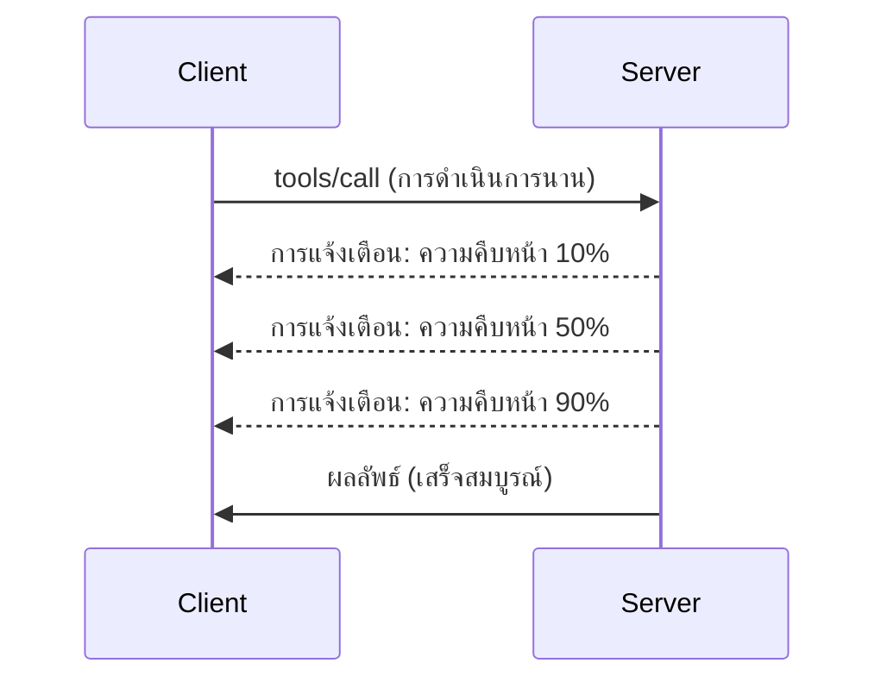

# การเจาะลึกคุณสมบัติของโปรโตคอล MCP

คู่มือนี้สำรวจคุณสมบัติขั้นสูงของโปรโตคอล MCP ที่เกินกว่าการจัดการเครื่องมือและทรัพยากรพื้นฐาน การเข้าใจคุณสมบัติเหล่านี้ช่วยให้คุณสร้างเซิร์ฟเวอร์ MCP ที่แข็งแกร่ง ใช้งานง่าย และพร้อมสำหรับการใช้งานในระดับโปรดักชันมากขึ้น

## คุณสมบัติที่ครอบคลุม

1. **การแจ้งเตือนความคืบหน้า** - รายงานความคืบหน้าสำหรับการดำเนินการที่ใช้เวลานาน  
2. **การยกเลิกคำขอ** - อนุญาตให้ลูกค้ายกเลิกคำขอที่กำลังดำเนินการ  
3. **แม่แบบทรัพยากร** - URI ทรัพยากรแบบไดนามิกพร้อมพารามิเตอร์  
4. **เหตุการณ์วงจรชีวิตเซิร์ฟเวอร์** - การเริ่มต้นและปิดเซิร์ฟเวอร์อย่างถูกต้อง  
5. **การควบคุมการบันทึก** - การกำหนดค่าการบันทึกฝั่งเซิร์ฟเวอร์  
6. **รูปแบบการจัดการข้อผิดพลาด** - การตอบกลับข้อผิดพลาดที่สอดคล้องกัน  

---

## 1. การแจ้งเตือนความคืบหน้า

สำหรับการดำเนินการที่ใช้เวลา (การประมวลผลข้อมูล การดาวน์โหลดไฟล์ การเรียกใช้ API) การแจ้งเตือนความคืบหน้าจะช่วยให้ผู้ใช้รับทราบสถานะ

### วิธีทำงาน


### การใช้งานใน Python

```python
from mcp.server import Server, NotificationOptions
from mcp.types import ProgressNotification
import asyncio

app = Server("progress-server")

@app.tool()
async def process_large_file(file_path: str, ctx) -> str:
    """Process a large file with progress updates."""
    
    # รับขนาดไฟล์สำหรับการคำนวณความคืบหน้า
    file_size = os.path.getsize(file_path)
    processed = 0
    
    with open(file_path, 'rb') as f:
        while chunk := f.read(8192):
            # ประมวลผลชิ้นส่วน
            await process_chunk(chunk)
            processed += len(chunk)
            
            # ส่งการแจ้งเตือนความคืบหน้า
            progress = (processed / file_size) * 100
            await ctx.send_notification(
                ProgressNotification(
                    progressToken=ctx.request_id,
                    progress=progress,
                    total=100,
                    message=f"Processing: {progress:.1f}%"
                )
            )
    
    return f"Processed {file_size} bytes"

@app.tool()
async def batch_operation(items: list[str], ctx) -> str:
    """Process multiple items with progress."""
    
    results = []
    total = len(items)
    
    for i, item in enumerate(items):
        result = await process_item(item)
        results.append(result)
        
        # รายงานความคืบหน้าหลังจากแต่ละรายการ
        await ctx.send_notification(
            ProgressNotification(
                progressToken=ctx.request_id,
                progress=i + 1,
                total=total,
                message=f"Processed {i + 1}/{total}: {item}"
            )
        )
    
    return f"Completed {total} items"
```

### การใช้งานใน TypeScript

```typescript
import { Server } from "@modelcontextprotocol/sdk/server/index.js";

server.setRequestHandler(CallToolSchema, async (request, extra) => {
  const { name, arguments: args } = request.params;
  
  if (name === "process_data") {
    const items = args.items as string[];
    const results = [];
    
    for (let i = 0; i < items.length; i++) {
      const result = await processItem(items[i]);
      results.push(result);
      
      // ส่งการแจ้งเตือนความคืบหน้า
      await extra.sendNotification({
        method: "notifications/progress",
        params: {
          progressToken: request.id,
          progress: i + 1,
          total: items.length,
          message: `Processing item ${i + 1}/${items.length}`
        }
      });
    }
    
    return { content: [{ type: "text", text: JSON.stringify(results) }] };
  }
});
```

### การจัดการฝั่งลูกค้า (Python)

```python
async def handle_progress(notification):
    """Handle progress notifications from server."""
    params = notification.params
    print(f"Progress: {params.progress}/{params.total} - {params.message}")

# ลงทะเบียนตัวจัดการ
session.on_notification("notifications/progress", handle_progress)

# เรียกใช้เครื่องมือ (การอัปเดตความคืบหน้าจะมาทางตัวจัดการ)
result = await session.call_tool("process_large_file", {"file_path": "/data/large.csv"})
```

---

## 2. การยกเลิกคำขอ

อนุญาตให้ลูกค้ายกเลิกคำขอที่ไม่จำเป็นต้องใช้แล้วหรือใช้เวลานานเกินไป

### การใช้งานใน Python

```python
from mcp.server import Server
from mcp.types import CancelledError
import asyncio

app = Server("cancellable-server")

@app.tool()
async def long_running_search(query: str, ctx) -> str:
    """Search that can be cancelled."""
    
    results = []
    
    try:
        for page in range(100):  # ค้นหาผ่านหลายหน้า
            # ตรวจสอบว่ามีการร้องขอยกเลิกหรือไม่
            if ctx.is_cancelled:
                raise CancelledError("Search cancelled by user")
            
            # จำลองการค้นหาหน้า
            page_results = await search_page(query, page)
            results.extend(page_results)
            
            # หน่วงเวลาสั้น ๆ เพื่อให้ตรวจสอบการยกเลิกได้
            await asyncio.sleep(0.1)
            
    except CancelledError:
        # ส่งคืนผลลัพธ์บางส่วน
        return f"Cancelled. Found {len(results)} results before cancellation."
    
    return f"Found {len(results)} total results"

@app.tool()
async def download_file(url: str, ctx) -> str:
    """Download with cancellation support."""
    
    async with aiohttp.ClientSession() as session:
        async with session.get(url) as response:
            total_size = int(response.headers.get('content-length', 0))
            downloaded = 0
            chunks = []
            
            async for chunk in response.content.iter_chunked(8192):
                if ctx.is_cancelled:
                    return f"Download cancelled at {downloaded}/{total_size} bytes"
                
                chunks.append(chunk)
                downloaded += len(chunk)
            
            return f"Downloaded {downloaded} bytes"
```

### การใช้งานบริบทการยกเลิก

```python
class CancellableContext:
    """Context object that tracks cancellation state."""
    
    def __init__(self, request_id: str):
        self.request_id = request_id
        self._cancelled = asyncio.Event()
        self._cancel_reason = None
    
    @property
    def is_cancelled(self) -> bool:
        return self._cancelled.is_set()
    
    def cancel(self, reason: str = "Cancelled"):
        self._cancel_reason = reason
        self._cancelled.set()
    
    async def check_cancelled(self):
        """Raise if cancelled, otherwise continue."""
        if self.is_cancelled:
            raise CancelledError(self._cancel_reason)
    
    async def sleep_or_cancel(self, seconds: float):
        """Sleep that can be interrupted by cancellation."""
        try:
            await asyncio.wait_for(
                self._cancelled.wait(),
                timeout=seconds
            )
            raise CancelledError(self._cancel_reason)
        except asyncio.TimeoutError:
            pass  # หมดเวลาปกติ ดำเนินการต่อ
```

### การยกเลิกฝั่งลูกค้า

```python
import asyncio

async def search_with_timeout(session, query, timeout=30):
    """Search with automatic cancellation on timeout."""
    
    task = asyncio.create_task(
        session.call_tool("long_running_search", {"query": query})
    )
    
    try:
        result = await asyncio.wait_for(task, timeout=timeout)
        return result
    except asyncio.TimeoutError:
        # ขอการยกเลิก
        await session.send_notification({
            "method": "notifications/cancelled",
            "params": {"requestId": task.request_id, "reason": "Timeout"}
        })
        return "Search timed out"
```

---

## 3. แม่แบบทรัพยากร

แม่แบบทรัพยากรช่วยให้การสร้าง URI แบบไดนามิกด้วยพารามิเตอร์ ซึ่งมีประโยชน์สำหรับ API และฐานข้อมูล

### การกำหนดแม่แบบ

```python
from mcp.server import Server
from mcp.types import ResourceTemplate

app = Server("template-server")

@app.list_resource_templates()
async def list_templates() -> list[ResourceTemplate]:
    """Return available resource templates."""
    return [
        ResourceTemplate(
            uriTemplate="db://users/{user_id}",
            name="User Profile",
            description="Fetch user profile by ID",
            mimeType="application/json"
        ),
        ResourceTemplate(
            uriTemplate="api://weather/{city}/{date}",
            name="Weather Data",
            description="Historical weather for city and date",
            mimeType="application/json"
        ),
        ResourceTemplate(
            uriTemplate="file://{path}",
            name="File Content",
            description="Read file at given path",
            mimeType="text/plain"
        )
    ]

@app.read_resource()
async def read_resource(uri: str) -> str:
    """Read resource, expanding template parameters."""
    
    # วิเคราะห์ URI เพื่อดึงพารามิเตอร์ออกมา
    if uri.startswith("db://users/"):
        user_id = uri.split("/")[-1]
        return await fetch_user(user_id)
    
    elif uri.startswith("api://weather/"):
        parts = uri.replace("api://weather/", "").split("/")
        city, date = parts[0], parts[1]
        return await fetch_weather(city, date)
    
    elif uri.startswith("file://"):
        path = uri.replace("file://", "")
        return await read_file(path)
    
    raise ValueError(f"Unknown resource URI: {uri}")
```

### การใช้งานใน TypeScript

```typescript
server.setRequestHandler(ListResourceTemplatesSchema, async () => {
  return {
    resourceTemplates: [
      {
        uriTemplate: "github://repos/{owner}/{repo}/issues/{issue_number}",
        name: "GitHub Issue",
        description: "Fetch a specific GitHub issue",
        mimeType: "application/json"
      },
      {
        uriTemplate: "db://tables/{table}/rows/{id}",
        name: "Database Row",
        description: "Fetch a row from a database table",
        mimeType: "application/json"
      }
    ]
  };
});

server.setRequestHandler(ReadResourceSchema, async (request) => {
  const uri = request.params.uri;
  
  // แยกวิเคราะห์ URI ของปัญหา GitHub
  const githubMatch = uri.match(/^github:\/\/repos\/([^/]+)\/([^/]+)\/issues\/(\d+)$/);
  if (githubMatch) {
    const [_, owner, repo, issueNumber] = githubMatch;
    const issue = await fetchGitHubIssue(owner, repo, parseInt(issueNumber));
    return {
      contents: [{
        uri,
        mimeType: "application/json",
        text: JSON.stringify(issue, null, 2)
      }]
    };
  }
  
  throw new Error(`Unknown resource URI: ${uri}`);
});
```

---

## 4. เหตุการณ์วงจรชีวิตเซิร์ฟเวอร์

การจัดการการเริ่มต้นและปิดเซิร์ฟเวอร์อย่างเหมาะสมช่วยให้การจัดการทรัพยากรเป็นระเบียบ

### การจัดการวงจรชีวิตใน Python

```python
from mcp.server import Server
from contextlib import asynccontextmanager

app = Server("lifecycle-server")

# สถานะที่ใช้ร่วมกัน
db_connection = None
cache = None

@asynccontextmanager
async def lifespan(server: Server):
    """Manage server lifecycle."""
    global db_connection, cache
    
    # การเริ่มต้น
    print("🚀 Server starting...")
    db_connection = await create_database_connection()
    cache = await create_cache_client()
    print("✅ Resources initialized")
    
    yield  # เซิร์ฟเวอร์ทำงานที่นี่
    
    # ปิดระบบ
    print("🛑 Server shutting down...")
    await db_connection.close()
    await cache.close()
    print("✅ Resources cleaned up")

app = Server("lifecycle-server", lifespan=lifespan)

@app.tool()
async def query_database(sql: str) -> str:
    """Use the shared database connection."""
    result = await db_connection.execute(sql)
    return str(result)
```

### วงจรชีวิตใน TypeScript

```typescript
import { Server } from "@modelcontextprotocol/sdk/server/index.js";

class ManagedServer {
  private server: Server;
  private dbConnection: DatabaseConnection | null = null;
  
  constructor() {
    this.server = new Server({
      name: "lifecycle-server",
      version: "1.0.0"
    });
    
    this.setupHandlers();
  }
  
  async start() {
    // เริ่มต้นทรัพยากร
    console.log("🚀 Server starting...");
    this.dbConnection = await createDatabaseConnection();
    console.log("✅ Database connected");
    
    // เริ่มเซิร์ฟเวอร์
    await this.server.connect(transport);
  }
  
  async stop() {
    // ทำความสะอาดทรัพยากร
    console.log("🛑 Server shutting down...");
    if (this.dbConnection) {
      await this.dbConnection.close();
    }
    await this.server.close();
    console.log("✅ Cleanup complete");
  }
  
  private setupHandlers() {
    this.server.setRequestHandler(CallToolSchema, async (request) => {
      // ใช้ this.dbConnection อย่างปลอดภัย
      // ...
    });
  }
}

// การใช้งานพร้อมการปิดอย่างนุ่มนวล
const server = new ManagedServer();

process.on('SIGINT', async () => {
  await server.stop();
  process.exit(0);
});

await server.start();
```

---

## 5. การควบคุมการบันทึก

MCP รองรับระดับการบันทึกทางฝั่งเซิร์ฟเวอร์ที่ลูกค้าสามารถควบคุมได้

### การใช้งานระดับการบันทึก

```python
from mcp.server import Server
from mcp.types import LoggingLevel
import logging

app = Server("logging-server")

# แมประดับ MCP ไปยังระดับการล็อกของ Python
LEVEL_MAP = {
    LoggingLevel.DEBUG: logging.DEBUG,
    LoggingLevel.INFO: logging.INFO,
    LoggingLevel.WARNING: logging.WARNING,
    LoggingLevel.ERROR: logging.ERROR,
}

logger = logging.getLogger("mcp-server")

@app.set_logging_level()
async def set_logging_level(level: LoggingLevel) -> None:
    """Handle client request to change logging level."""
    python_level = LEVEL_MAP.get(level, logging.INFO)
    logger.setLevel(python_level)
    logger.info(f"Logging level set to {level}")

@app.tool()
async def debug_operation(data: str) -> str:
    """Tool with various logging levels."""
    logger.debug(f"Processing data: {data}")
    
    try:
        result = process(data)
        logger.info(f"Successfully processed: {result}")
        return result
    except Exception as e:
        logger.error(f"Processing failed: {e}")
        raise
```

### ส่งข้อความบันทึกไปยังลูกค้า

```python
@app.tool()
async def complex_operation(input: str, ctx) -> str:
    """Operation that logs to client."""
    
    # ส่งการแจ้งเตือนบันทึกไปยังลูกค้า
    await ctx.send_log(
        level="info",
        message=f"Starting complex operation with input: {input}"
    )
    
    # กำลังทำงาน...
    result = await do_work(input)
    
    await ctx.send_log(
        level="debug",
        message=f"Operation complete, result size: {len(result)}"
    )
    
    return result
```

---

## 6. รูปแบบการจัดการข้อผิดพลาด

การจัดการข้อผิดพลาดที่สอดคล้องกันช่วยปรับปรุงการดีบักและประสบการณ์ผู้ใช้

### รหัสข้อผิดพลาดของ MCP

```python
from mcp.types import McpError, ErrorCode

class ToolError(McpError):
    """Base class for tool errors."""
    pass

class ValidationError(ToolError):
    """Invalid input parameters."""
    def __init__(self, message: str):
        super().__init__(ErrorCode.INVALID_PARAMS, message)

class NotFoundError(ToolError):
    """Requested resource not found."""
    def __init__(self, resource: str):
        super().__init__(ErrorCode.INVALID_REQUEST, f"Not found: {resource}")

class PermissionError(ToolError):
    """Access denied."""
    def __init__(self, action: str):
        super().__init__(ErrorCode.INVALID_REQUEST, f"Permission denied: {action}")

class InternalError(ToolError):
    """Internal server error."""
    def __init__(self, message: str):
        super().__init__(ErrorCode.INTERNAL_ERROR, message)
```

### การตอบกลับข้อผิดพลาดแบบมีโครงสร้าง

```python
@app.tool()
async def safe_operation(input: str) -> str:
    """Tool with comprehensive error handling."""
    
    # ตรวจสอบความถูกต้องของข้อมูลนำเข้า
    if not input:
        raise ValidationError("Input cannot be empty")
    
    if len(input) > 10000:
        raise ValidationError(f"Input too large: {len(input)} chars (max 10000)")
    
    try:
        # ตรวจสอบสิทธิ์
        if not await check_permission(input):
            raise PermissionError(f"read {input}")
        
        # ดำเนินการ
        result = await perform_operation(input)
        
        if result is None:
            raise NotFoundError(input)
        
        return result
        
    except ConnectionError as e:
        raise InternalError(f"Database connection failed: {e}")
    except TimeoutError as e:
        raise InternalError(f"Operation timed out: {e}")
    except Exception as e:
        # บันทึกข้อผิดพลาดที่ไม่คาดคิด
        logger.exception(f"Unexpected error in safe_operation")
        raise InternalError(f"Unexpected error: {type(e).__name__}")
```

### การจัดการข้อผิดพลาดใน TypeScript

```typescript
import { McpError, ErrorCode } from "@modelcontextprotocol/sdk/types.js";

function validateInput(data: unknown): asserts data is ValidInput {
  if (typeof data !== "object" || data === null) {
    throw new McpError(
      ErrorCode.InvalidParams,
      "Input must be an object"
    );
  }
  // การตรวจสอบเพิ่มเติม...
}

server.setRequestHandler(CallToolSchema, async (request) => {
  try {
    validateInput(request.params.arguments);
    
    const result = await performOperation(request.params.arguments);
    
    return {
      content: [{ type: "text", text: JSON.stringify(result) }]
    };
    
  } catch (error) {
    if (error instanceof McpError) {
      throw error;  // เป็นข้อผิดพลาดของ MCP อยู่แล้ว
    }
    
    // แปลงข้อผิดพลาดอื่นๆ
    if (error instanceof NotFoundError) {
      throw new McpError(ErrorCode.InvalidRequest, error.message);
    }
    
    // ข้อผิดพลาดที่ไม่รู้จัก
    console.error("Unexpected error:", error);
    throw new McpError(
      ErrorCode.InternalError,
      "An unexpected error occurred"
    );
  }
});
```

---

## คุณสมบัติทดลอง (MCP 2025-11-25)

คุณสมบัติเหล่านี้ถูกกำหนดให้เป็นคุณสมบัติทดลองในสเปค

### งาน (การดำเนินการที่ใช้เวลานาน)

```python
# งานช่วยให้ติดตามการทำงานระยะยาวพร้อมสถานะได้
@app.task()
async def training_task(model_id: str, data_path: str, ctx) -> str:
    """Long-running ML training task."""
    
    # รายงานงานเริ่มต้น
    await ctx.report_status("running", "Initializing training...")
    
    # วนลูปการฝึกอบรม
    for epoch in range(100):
        await train_epoch(model_id, data_path, epoch)
        await ctx.report_status(
            "running",
            f"Training epoch {epoch + 1}/100",
            progress=epoch + 1,
            total=100
        )
    
    await ctx.report_status("completed", "Training finished")
    return f"Model {model_id} trained successfully"
```

### การคอมเมนต์เครื่องมือ

```python
# คำอธิบายประกอบให้ข้อมูลเมตาเกี่ยวกับพฤติกรรมของเครื่องมือ
@app.tool(
    annotations={
        "destructive": False,      # ไม่แก้ไขข้อมูล
        "idempotent": True,        # ปลอดภัยต่อการลองใหม่
        "timeout_seconds": 30,     # ระยะเวลาสูงสุดที่คาดไว้
        "requires_approval": False # ไม่ต้องการการอนุมัติจากผู้ใช้
    }
)
async def safe_query(query: str) -> str:
    """A read-only database query tool."""
    return await execute_read_query(query)
```

---

## ต่อไปคืออะไร

- [โมดูล 8 - แนวทางปฏิบัติที่ดีที่สุด](../../08-BestPractices/README.md)  
- [5.14 - วิศวกรรมบริบท](../mcp-contextengineering/README.md)  
- [บันทึกการเปลี่ยนแปลงสเปค MCP](https://spec.modelcontextprotocol.io/)  

---

## แหล่งข้อมูลเพิ่มเติม

- [สเปค MCP 2025-11-25](https://spec.modelcontextprotocol.io/specification/2025-11-25/)  
- [รหัสข้อผิดพลาด JSON-RPC 2.0](https://www.jsonrpc.org/specification#error_object)  
- [ตัวอย่าง Python SDK](https://github.com/modelcontextprotocol/python-sdk/tree/main/examples)  
- [ตัวอย่าง TypeScript SDK](https://github.com/modelcontextprotocol/typescript-sdk/tree/main/examples)

---

<!-- CO-OP TRANSLATOR DISCLAIMER START -->
**ข้อจำกัดความรับผิดชอบ**:  
เอกสารนี้ได้รับการแปลโดยใช้บริการแปลภาษาด้วย AI [Co-op Translator](https://github.com/Azure/co-op-translator) แม้เราจะพยายามให้ความถูกต้องสูงสุด แต่โปรดทราบว่าการแปลอัตโนมัติอาจมีข้อผิดพลาดหรือความไม่ถูกต้อง เอกสารต้นฉบับในภาษาดั้งเดิมควรถูกพิจารณาเป็นแหล่งข้อมูลที่เชื่อถือได้ สำหรับข้อมูลที่สำคัญ ควรใช้บริการแปลโดยผู้เชี่ยวชาญมนุษย์ เราไม่รับผิดชอบต่อความเข้าใจผิดหรือการตีความที่ผิดพลาดใด ๆ ที่เกิดขึ้นจากการใช้การแปลนี้
<!-- CO-OP TRANSLATOR DISCLAIMER END -->