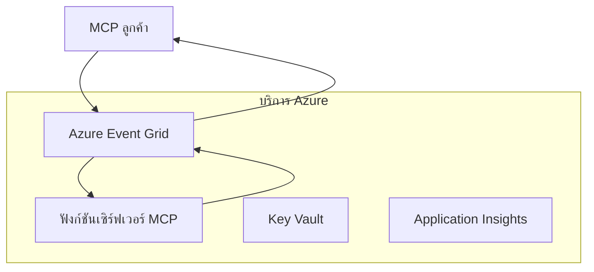
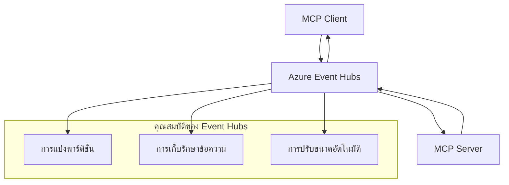

# MCP Custom Transports - คู่มือการใช้งานขั้นสูง

โปรโตคอล Model Context (MCP) มอบความยืดหยุ่นในกลไกการขนส่ง โดยอนุญาตให้มีการใช้งานแบบกำหนดเองสำหรับสภาพแวดล้อมองค์กรเฉพาะ คู่มือขั้นสูงนี้สำรวจการใช้งานขนส่งแบบกำหนดเองโดยใช้ Azure Event Grid และ Azure Event Hubs เป็นตัวอย่างเชิงปฏิบัติสำหรับการสร้างโซลูชัน MCP ที่ปรับขนาดได้และเนทีฟบนคลาวด์

## บทนำ

ในขณะที่การขนส่งมาตรฐานของ MCP (stdio และ HTTP streaming) รองรับการใช้งานส่วนใหญ่ สภาพแวดล้อมองค์กรมักต้องการกลไกการขนส่งเฉพาะเพื่อเพิ่มความสามารถในการปรับขนาด ความน่าเชื่อถือ และการผสานรวมกับโครงสร้างพื้นฐานคลาวด์ที่มีอยู่ การขนส่งแบบกำหนดเองช่วยให้ MCP ใช้ประโยชน์จากบริการส่งข้อความเนทีฟบนคลาวด์สำหรับการสื่อสารแบบอะซิงโครนัส สถาปัตยกรรมขับเคลื่อนด้วยเหตุการณ์ และการประมวลผลแบบกระจาย

บทเรียนนี้สำรวจการใช้งานขนส่งขั้นสูงโดยอิงตามข้อกำหนด MCP ล่าสุด (2025-11-25) บริการส่งข้อความของ Azure และรูปแบบการผสานรวมองค์กรที่ได้รับการยอมรับ

### **สถาปัตยกรรมการขนส่ง MCP**

**จากข้อกำหนด MCP (2025-11-25):**

- **การขนส่งมาตรฐาน**: stdio (แนะนำ), HTTP streaming (สำหรับสถานการณ์ระยะไกล)
- **การขนส่งแบบกำหนดเอง**: การขนส่งใด ๆ ที่ใช้งานโปรโตคอลแลกเปลี่ยนข้อความ MCP
- **รูปแบบข้อความ**: JSON-RPC 2.0 พร้อมส่วนขยายเฉพาะ MCP
- **การสื่อสารสองทาง**: ต้องการการสื่อสารแบบเต็มดูเพล็กซ์สำหรับการแจ้งเตือนและการตอบกลับ

## วัตถุประสงค์การเรียนรู้

เมื่อจบบทเรียนขั้นสูงนี้ คุณจะสามารถ:

- **เข้าใจข้อกำหนดการขนส่งแบบกำหนดเอง**: ใช้งานโปรโตคอล MCP บนชั้นการขนส่งใด ๆ ในขณะที่รักษาความสอดคล้อง
- **สร้างการขนส่ง Azure Event Grid**: สร้างเซิร์ฟเวอร์ MCP ขับเคลื่อนด้วยเหตุการณ์โดยใช้ Azure Event Grid สำหรับการปรับขนาดแบบไม่มีเซิร์ฟเวอร์
- **ใช้งานการขนส่ง Azure Event Hubs**: ออกแบบโซลูชัน MCP ที่มีอัตราการส่งข้อมูลสูงโดยใช้ Azure Event Hubs สำหรับการสตรีมแบบเรียลไทม์
- **ประยุกต์ใช้รูปแบบองค์กร**: ผสานรวมการขนส่งแบบกำหนดเองกับโครงสร้างพื้นฐานและโมเดลความปลอดภัยของ Azure ที่มีอยู่
- **จัดการความน่าเชื่อถือของการขนส่ง**: ใช้งานความทนทานของข้อความ การจัดลำดับ และการจัดการข้อผิดพลาดสำหรับสถานการณ์องค์กร
- **เพิ่มประสิทธิภาพการทำงาน**: ออกแบบโซลูชันการขนส่งสำหรับความต้องการด้านขนาด ความหน่วง และอัตราการส่งข้อมูล

## **ข้อกำหนดการขนส่ง**

### **ข้อกำหนดหลักจากข้อกำหนด MCP (2025-11-25):**

```yaml
Message Protocol:
  format: "JSON-RPC 2.0 with MCP extensions"
  bidirectional: "Full duplex communication required"
  ordering: "Message ordering must be preserved per session"
  
Transport Layer:
  reliability: "Transport MUST handle connection failures gracefully"
  security: "Transport MUST support secure communication"
  identification: "Each session MUST have unique identifier"
  
Custom Transport:
  compliance: "MUST implement complete MCP message exchange"
  extensibility: "MAY add transport-specific features"
  interoperability: "MUST maintain protocol compatibility"
```

## **การใช้งานการขนส่ง Azure Event Grid**

Azure Event Grid ให้บริการเส้นทางเหตุการณ์แบบไม่มีเซิร์ฟเวอร์ที่เหมาะสำหรับสถาปัตยกรรม MCP ขับเคลื่อนด้วยเหตุการณ์ การใช้งานนี้แสดงวิธีการสร้างระบบ MCP ที่ปรับขนาดได้และเชื่อมโยงแบบหลวม ๆ

### **ภาพรวมสถาปัตยกรรม**


### **การใช้งาน C# - การขนส่ง Event Grid**

```csharp
using Azure.Messaging.EventGrid;
using Microsoft.Extensions.Azure;
using System.Text.Json;

public class EventGridMcpTransport : IMcpTransport
{
    private readonly EventGridPublisherClient _publisher;
    private readonly string _topicEndpoint;
    private readonly string _clientId;
    
    public EventGridMcpTransport(string topicEndpoint, string accessKey, string clientId)
    {
        _publisher = new EventGridPublisherClient(
            new Uri(topicEndpoint), 
            new AzureKeyCredential(accessKey));
        _topicEndpoint = topicEndpoint;
        _clientId = clientId;
    }
    
    public async Task SendMessageAsync(McpMessage message)
    {
        var eventGridEvent = new EventGridEvent(
            subject: $"mcp/{_clientId}",
            eventType: "MCP.MessageReceived",
            dataVersion: "1.0",
            data: JsonSerializer.Serialize(message))
        {
            Id = Guid.NewGuid().ToString(),
            EventTime = DateTimeOffset.UtcNow
        };
        
        await _publisher.SendEventAsync(eventGridEvent);
    }
    
    public async Task<McpMessage> ReceiveMessageAsync(CancellationToken cancellationToken)
    {
        // Event Grid is push-based, so implement webhook receiver
        // This would typically be handled by Azure Functions trigger
        throw new NotImplementedException("Use EventGridTrigger in Azure Functions");
    }
}

// Azure Function for receiving Event Grid events
[FunctionName("McpEventGridReceiver")]
public async Task<IActionResult> HandleEventGridMessage(
    [EventGridTrigger] EventGridEvent eventGridEvent,
    ILogger log)
{
    try
    {
        var mcpMessage = JsonSerializer.Deserialize<McpMessage>(
            eventGridEvent.Data.ToString());
        
        // Process MCP message
        var response = await _mcpServer.ProcessMessageAsync(mcpMessage);
        
        // Send response back via Event Grid
        await _transport.SendMessageAsync(response);
        
        return new OkResult();
    }
    catch (Exception ex)
    {
        log.LogError(ex, "Error processing Event Grid MCP message");
        return new BadRequestResult();
    }
}
```

### **การใช้งาน TypeScript - การขนส่ง Event Grid**

```typescript
import { EventGridPublisherClient, AzureKeyCredential } from "@azure/eventgrid";
import { McpTransport, McpMessage } from "./mcp-types";

export class EventGridMcpTransport implements McpTransport {
    private publisher: EventGridPublisherClient;
    private clientId: string;
    
    constructor(
        private topicEndpoint: string,
        private accessKey: string,
        clientId: string
    ) {
        this.publisher = new EventGridPublisherClient(
            topicEndpoint,
            new AzureKeyCredential(accessKey)
        );
        this.clientId = clientId;
    }
    
    async sendMessage(message: McpMessage): Promise<void> {
        const event = {
            id: crypto.randomUUID(),
            source: `mcp-client-${this.clientId}`,
            type: "MCP.MessageReceived",
            time: new Date(),
            data: message
        };
        
        await this.publisher.sendEvents([event]);
    }
    
    // การรับข้อมูลแบบขับเคลื่อนด้วยเหตุการณ์ผ่าน Azure Functions
    onMessage(handler: (message: McpMessage) => Promise<void>): void {
        // การใช้งานจะใช้ Azure Functions Event Grid trigger
        // นี่คืออินเทอร์เฟซเชิงแนวคิดสำหรับตัวรับ webhook
    }
}

// การใช้งาน Azure Functions
import { app, InvocationContext, EventGridEvent } from "@azure/functions";

app.eventGrid("mcpEventGridHandler", {
    handler: async (event: EventGridEvent, context: InvocationContext) => {
        try {
            const mcpMessage = event.data as McpMessage;
            
            // ประมวลผลข้อความ MCP
            const response = await mcpServer.processMessage(mcpMessage);
            
            // ส่งการตอบกลับผ่าน Event Grid
            await transport.sendMessage(response);
            
        } catch (error) {
            context.error("Error processing MCP message:", error);
            throw error;
        }
    }
});
```

### **การใช้งาน Python - การขนส่ง Event Grid**

```python
from azure.eventgrid import EventGridPublisherClient, EventGridEvent
from azure.core.credentials import AzureKeyCredential
import asyncio
import json
from typing import Callable, Optional
import uuid
from datetime import datetime

class EventGridMcpTransport:
    def __init__(self, topic_endpoint: str, access_key: str, client_id: str):
        self.client = EventGridPublisherClient(
            topic_endpoint, 
            AzureKeyCredential(access_key)
        )
        self.client_id = client_id
        self.message_handler: Optional[Callable] = None
    
    async def send_message(self, message: dict) -> None:
        """Send MCP message via Event Grid"""
        event = EventGridEvent(
            data=message,
            subject=f"mcp/{self.client_id}",
            event_type="MCP.MessageReceived",
            data_version="1.0"
        )
        
        await self.client.send(event)
    
    def on_message(self, handler: Callable[[dict], None]) -> None:
        """Register message handler for incoming events"""
        self.message_handler = handler

# การใช้งาน Azure Functions
import azure.functions as func
import logging

def main(event: func.EventGridEvent) -> None:
    """Azure Functions Event Grid trigger for MCP messages"""
    try:
        # แยกวิเคราะห์ข้อความ MCP จากเหตุการณ์ Event Grid
        mcp_message = json.loads(event.get_body().decode('utf-8'))
        
        # ประมวลผลข้อความ MCP
        response = process_mcp_message(mcp_message)
        
        # ส่งการตอบกลับผ่าน Event Grid
        # (การใช้งานจะสร้างไคลเอนต์ Event Grid ใหม่)
        
    except Exception as e:
        logging.error(f"Error processing MCP Event Grid message: {e}")
        raise
```

## **การใช้งานการขนส่ง Azure Event Hubs**

Azure Event Hubs ให้ความสามารถในการสตรีมแบบเรียลไทม์ที่มีอัตราการส่งข้อมูลสูงสำหรับสถานการณ์ MCP ที่ต้องการความหน่วงต่ำและปริมาณข้อความสูง

### **ภาพรวมสถาปัตยกรรม**


### **การใช้งาน C# - การขนส่ง Event Hubs**

```csharp
using Azure.Messaging.EventHubs;
using Azure.Messaging.EventHubs.Producer;
using Azure.Messaging.EventHubs.Consumer;
using System.Text;

public class EventHubsMcpTransport : IMcpTransport, IDisposable
{
    private readonly EventHubProducerClient _producer;
    private readonly EventHubConsumerClient _consumer;
    private readonly string _consumerGroup;
    private readonly CancellationTokenSource _cancellationTokenSource;
    
    public EventHubsMcpTransport(
        string connectionString, 
        string eventHubName,
        string consumerGroup = "$Default")
    {
        _producer = new EventHubProducerClient(connectionString, eventHubName);
        _consumer = new EventHubConsumerClient(
            consumerGroup, 
            connectionString, 
            eventHubName);
        _consumerGroup = consumerGroup;
        _cancellationTokenSource = new CancellationTokenSource();
    }
    
    public async Task SendMessageAsync(McpMessage message)
    {
        var messageBody = JsonSerializer.Serialize(message);
        var eventData = new EventData(Encoding.UTF8.GetBytes(messageBody));
        
        // Add MCP-specific properties
        eventData.Properties.Add("MessageType", message.Method ?? "response");
        eventData.Properties.Add("MessageId", message.Id);
        eventData.Properties.Add("Timestamp", DateTimeOffset.UtcNow);
        
        await _producer.SendAsync(new[] { eventData });
    }
    
    public async Task StartReceivingAsync(
        Func<McpMessage, Task> messageHandler)
    {
        await foreach (PartitionEvent partitionEvent in _consumer.ReadEventsAsync(
            _cancellationTokenSource.Token))
        {
            try
            {
                var messageBody = Encoding.UTF8.GetString(
                    partitionEvent.Data.EventBody.ToArray());
                var mcpMessage = JsonSerializer.Deserialize<McpMessage>(messageBody);
                
                await messageHandler(mcpMessage);
            }
            catch (Exception ex)
            {
                // Handle deserialization or processing errors
                Console.WriteLine($"Error processing message: {ex.Message}");
            }
        }
    }
    
    public void Dispose()
    {
        _cancellationTokenSource?.Cancel();
        _producer?.DisposeAsync().AsTask().Wait();
        _consumer?.DisposeAsync().AsTask().Wait();
        _cancellationTokenSource?.Dispose();
    }
}
```

### **การใช้งาน TypeScript - การขนส่ง Event Hubs**

```typescript
import { 
    EventHubProducerClient, 
    EventHubConsumerClient, 
    EventData 
} from "@azure/event-hubs";

export class EventHubsMcpTransport implements McpTransport {
    private producer: EventHubProducerClient;
    private consumer: EventHubConsumerClient;
    private isReceiving = false;
    
    constructor(
        private connectionString: string,
        private eventHubName: string,
        private consumerGroup: string = "$Default"
    ) {
        this.producer = new EventHubProducerClient(
            connectionString, 
            eventHubName
        );
        this.consumer = new EventHubConsumerClient(
            consumerGroup,
            connectionString,
            eventHubName
        );
    }
    
    async sendMessage(message: McpMessage): Promise<void> {
        const eventData: EventData = {
            body: JSON.stringify(message),
            properties: {
                messageType: message.method || "response",
                messageId: message.id,
                timestamp: new Date().toISOString()
            }
        };
        
        await this.producer.sendBatch([eventData]);
    }
    
    async startReceiving(
        messageHandler: (message: McpMessage) => Promise<void>
    ): Promise<void> {
        if (this.isReceiving) return;
        
        this.isReceiving = true;
        
        const subscription = this.consumer.subscribe({
            processEvents: async (events, context) => {
                for (const event of events) {
                    try {
                        const messageBody = event.body as string;
                        const mcpMessage: McpMessage = JSON.parse(messageBody);
                        
                        await messageHandler(mcpMessage);
                        
                        // อัปเดตจุดตรวจสอบสำหรับการส่งอย่างน้อยหนึ่งครั้ง
                        await context.updateCheckpoint(event);
                    } catch (error) {
                        console.error("Error processing Event Hubs message:", error);
                    }
                }
            },
            processError: async (err, context) => {
                console.error("Event Hubs error:", err);
            }
        });
    }
    
    async close(): Promise<void> {
        this.isReceiving = false;
        await this.producer.close();
        await this.consumer.close();
    }
}
```

### **การใช้งาน Python - การขนส่ง Event Hubs**

```python
from azure.eventhub import EventHubProducerClient, EventHubConsumerClient
from azure.eventhub import EventData
import json
import asyncio
from typing import Callable, Dict, Any
import logging

class EventHubsMcpTransport:
    def __init__(
        self, 
        connection_string: str, 
        eventhub_name: str,
        consumer_group: str = "$Default"
    ):
        self.producer = EventHubProducerClient.from_connection_string(
            connection_string, 
            eventhub_name=eventhub_name
        )
        self.consumer = EventHubConsumerClient.from_connection_string(
            connection_string,
            consumer_group=consumer_group,
            eventhub_name=eventhub_name
        )
        self.is_receiving = False
    
    async def send_message(self, message: Dict[str, Any]) -> None:
        """Send MCP message via Event Hubs"""
        event_data = EventData(json.dumps(message))
        
        # เพิ่มคุณสมบัติเฉพาะของ MCP
        event_data.properties = {
            "messageType": message.get("method", "response"),
            "messageId": message.get("id"),
            "timestamp": "2025-01-14T10:30:00Z"  # ใช้เวลาจริง
        }
        
        async with self.producer:
            event_data_batch = await self.producer.create_batch()
            event_data_batch.add(event_data)
            await self.producer.send_batch(event_data_batch)
    
    async def start_receiving(
        self, 
        message_handler: Callable[[Dict[str, Any]], None]
    ) -> None:
        """Start receiving MCP messages from Event Hubs"""
        if self.is_receiving:
            return
        
        self.is_receiving = True
        
        async with self.consumer:
            await self.consumer.receive(
                on_event=self._on_event_received(message_handler),
                starting_position="-1"  # เริ่มจากต้น
            )
    
    def _on_event_received(self, handler: Callable):
        """Internal event handler wrapper"""
        async def handle_event(partition_context, event):
            try:
                # แยกวิเคราะห์ข้อความ MCP จากเหตุการณ์ Event Hubs
                message_body = event.body_as_str(encoding='UTF-8')
                mcp_message = json.loads(message_body)
                
                # ประมวลผลข้อความ MCP
                await handler(mcp_message)
                
                # อัปเดตจุดตรวจสอบสำหรับการส่งอย่างน้อยหนึ่งครั้ง
                await partition_context.update_checkpoint(event)
                
            except Exception as e:
                logging.error(f"Error processing Event Hubs message: {e}")
        
        return handle_event
    
    async def close(self) -> None:
        """Clean up transport resources"""
        self.is_receiving = False
        await self.producer.close()
        await self.consumer.close()
```

## **รูปแบบการขนส่งขั้นสูง**

### **ความทนทานและความน่าเชื่อถือของข้อความ**

```csharp
// Implementing message durability with retry logic
public class ReliableTransportWrapper : IMcpTransport
{
    private readonly IMcpTransport _innerTransport;
    private readonly RetryPolicy _retryPolicy;
    
    public async Task SendMessageAsync(McpMessage message)
    {
        await _retryPolicy.ExecuteAsync(async () =>
        {
            try
            {
                await _innerTransport.SendMessageAsync(message);
            }
            catch (TransportException ex) when (ex.IsRetryable)
            {
                // Log and retry
                throw;
            }
        });
    }
}
```

### **การผสานรวมความปลอดภัยของการขนส่ง**

```csharp
// Integrating Azure Key Vault for transport security
public class SecureTransportFactory
{
    private readonly SecretClient _keyVaultClient;
    
    public async Task<IMcpTransport> CreateEventGridTransportAsync()
    {
        var accessKey = await _keyVaultClient.GetSecretAsync("EventGridAccessKey");
        var topicEndpoint = await _keyVaultClient.GetSecretAsync("EventGridTopic");
        
        return new EventGridMcpTransport(
            topicEndpoint.Value.Value,
            accessKey.Value.Value,
            Environment.MachineName
        );
    }
}
```

### **การตรวจสอบและการสังเกตการณ์การขนส่ง**

```csharp
// Adding telemetry to custom transports
public class ObservableTransport : IMcpTransport
{
    private readonly IMcpTransport _transport;
    private readonly ILogger _logger;
    private readonly TelemetryClient _telemetryClient;
    
    public async Task SendMessageAsync(McpMessage message)
    {
        using var activity = Activity.StartActivity("MCP.Transport.Send");
        activity?.SetTag("transport.type", "EventGrid");
        activity?.SetTag("message.method", message.Method);
        
        var stopwatch = Stopwatch.StartNew();
        
        try
        {
            await _transport.SendMessageAsync(message);
            
            _telemetryClient.TrackDependency(
                "EventGrid",
                "SendMessage",
                DateTime.UtcNow.Subtract(stopwatch.Elapsed),
                stopwatch.Elapsed,
                true
            );
        }
        catch (Exception ex)
        {
            _telemetryClient.TrackException(ex);
            throw;
        }
    }
}
```

## **สถานการณ์การผสานรวมองค์กร**

### **สถานการณ์ที่ 1: การประมวลผล MCP แบบกระจาย**

ใช้ Azure Event Grid สำหรับแจกจ่ายคำขอ MCP ไปยังโหนดประมวลผลหลายตัว:

```yaml
Architecture:
  - MCP Client sends requests to Event Grid topic
  - Multiple Azure Functions subscribe to process different tool types
  - Results aggregated and returned via separate response topic
  
Benefits:
  - Horizontal scaling based on message volume
  - Fault tolerance through redundant processors
  - Cost optimization with serverless compute
```

### **สถานการณ์ที่ 2: การสตรีม MCP แบบเรียลไทม์**

ใช้ Azure Event Hubs สำหรับการโต้ตอบ MCP ความถี่สูง:

```yaml
Architecture:
  - MCP Client streams continuous requests via Event Hubs
  - Stream Analytics processes and routes messages
  - Multiple consumers handle different aspect of processing
  
Benefits:
  - Low latency for real-time scenarios
  - High throughput for batch processing
  - Built-in partitioning for parallel processing
```

### **สถานการณ์ที่ 3: สถาปัตยกรรมการขนส่งแบบไฮบริด**

รวมการขนส่งหลายแบบสำหรับกรณีการใช้งานต่าง ๆ:

```csharp
public class HybridMcpTransport : IMcpTransport
{
    private readonly IMcpTransport _realtimeTransport; // Event Hubs
    private readonly IMcpTransport _batchTransport;    // Event Grid
    private readonly IMcpTransport _fallbackTransport; // HTTP Streaming
    
    public async Task SendMessageAsync(McpMessage message)
    {
        // Route based on message characteristics
        var transport = message.Method switch
        {
            "tools/call" when IsRealtime(message) => _realtimeTransport,
            "resources/read" when IsBatch(message) => _batchTransport,
            _ => _fallbackTransport
        };
        
        await transport.SendMessageAsync(message);
    }
}
```

## **การเพิ่มประสิทธิภาพการทำงาน**

### **การจัดกลุ่มข้อความสำหรับ Event Grid**

```csharp
public class BatchingEventGridTransport : IMcpTransport
{
    private readonly List<McpMessage> _messageBuffer = new();
    private readonly Timer _flushTimer;
    private const int MaxBatchSize = 100;
    
    public async Task SendMessageAsync(McpMessage message)
    {
        lock (_messageBuffer)
        {
            _messageBuffer.Add(message);
            
            if (_messageBuffer.Count >= MaxBatchSize)
            {
                _ = Task.Run(FlushMessages);
            }
        }
    }
    
    private async Task FlushMessages()
    {
        List<McpMessage> toSend;
        lock (_messageBuffer)
        {
            toSend = new List<McpMessage>(_messageBuffer);
            _messageBuffer.Clear();
        }
        
        if (toSend.Any())
        {
            var events = toSend.Select(CreateEventGridEvent);
            await _publisher.SendEventsAsync(events);
        }
    }
}
```

### **กลยุทธ์การแบ่งพาร์ติชันสำหรับ Event Hubs**

```csharp
public class PartitionedEventHubsTransport : IMcpTransport
{
    public async Task SendMessageAsync(McpMessage message)
    {
        // Partition by client ID for session affinity
        var partitionKey = ExtractClientId(message);
        
        var eventData = new EventData(JsonSerializer.SerializeToUtf8Bytes(message))
        {
            PartitionKey = partitionKey
        };
        
        await _producer.SendAsync(new[] { eventData });
    }
}
```

## **การทดสอบการขนส่งแบบกำหนดเอง**

### **การทดสอบหน่วยด้วย Test Doubles**

```csharp
[Test]
public async Task EventGridTransport_SendMessage_PublishesCorrectEvent()
{
    // Arrange
    var mockPublisher = new Mock<EventGridPublisherClient>();
    var transport = new EventGridMcpTransport(mockPublisher.Object);
    var message = new McpMessage { Method = "tools/list", Id = "test-123" };
    
    // Act
    await transport.SendMessageAsync(message);
    
    // Assert
    mockPublisher.Verify(
        x => x.SendEventAsync(
            It.Is<EventGridEvent>(e => 
                e.EventType == "MCP.MessageReceived" &&
                e.Subject == "mcp/test-client"
            )
        ),
        Times.Once
    );
}
```

### **การทดสอบการผสานรวมด้วย Azure Test Containers**

```csharp
[Test]
public async Task EventHubsTransport_IntegrationTest()
{
    // Using Testcontainers for integration testing
    var eventHubsContainer = new EventHubsContainer()
        .WithEventHub("test-hub");
    
    await eventHubsContainer.StartAsync();
    
    var transport = new EventHubsMcpTransport(
        eventHubsContainer.GetConnectionString(),
        "test-hub"
    );
    
    // Test message round-trip
    var sentMessage = new McpMessage { Method = "test", Id = "123" };
    McpMessage receivedMessage = null;
    
    await transport.StartReceivingAsync(msg => {
        receivedMessage = msg;
        return Task.CompletedTask;
    });
    
    await transport.SendMessageAsync(sentMessage);
    await Task.Delay(1000); // Allow for message processing
    
    Assert.That(receivedMessage?.Id, Is.EqualTo("123"));
}
```

## **แนวทางปฏิบัติที่ดีที่สุดและคำแนะนำ**

### **หลักการออกแบบการขนส่ง**

1. **ความสามารถในการทำซ้ำได้ (Idempotency)**: ตรวจสอบให้แน่ใจว่าการประมวลผลข้อความสามารถทำซ้ำได้เพื่อจัดการกับข้อความซ้ำ
2. **การจัดการข้อผิดพลาด**: ใช้งานการจัดการข้อผิดพลาดอย่างครอบคลุมและคิวจดหมายตาย
3. **การตรวจสอบ**: เพิ่มเทเลเมทรีและการตรวจสุขภาพอย่างละเอียด
4. **ความปลอดภัย**: ใช้ managed identities และการเข้าถึงแบบน้อยที่สุด
5. **ประสิทธิภาพ**: ออกแบบตามความต้องการเฉพาะของคุณในเรื่องความหน่วงและอัตราการส่งข้อมูล

### **คำแนะนำเฉพาะ Azure**

1. **ใช้ Managed Identity**: หลีกเลี่ยงการใช้สตริงการเชื่อมต่อในสภาพแวดล้อมการผลิต
2. **ใช้งาน Circuit Breakers**: ป้องกันการหยุดชะงักของบริการ Azure
3. **ตรวจสอบค่าใช้จ่าย**: ติดตามปริมาณข้อความและค่าใช้จ่ายในการประมวลผล
4. **วางแผนสำหรับการปรับขนาด**: ออกแบบกลยุทธ์การแบ่งพาร์ติชันและการปรับขนาดตั้งแต่เนิ่น ๆ
5. **ทดสอบอย่างละเอียด**: ใช้ Azure DevTest Labs สำหรับการทดสอบอย่างครอบคลุม

## **บทสรุป**

การขนส่ง MCP แบบกำหนดเองช่วยให้เกิดสถานการณ์องค์กรที่ทรงพลังโดยใช้บริการส่งข้อความของ Azure โดยการใช้งานการขนส่ง Event Grid หรือ Event Hubs คุณสามารถสร้างโซลูชัน MCP ที่ปรับขนาดได้และน่าเชื่อถือซึ่งผสานรวมกับโครงสร้างพื้นฐาน Azure ที่มีอยู่ได้อย่างราบรื่น

ตัวอย่างที่ให้ไว้แสดงรูปแบบที่พร้อมสำหรับการผลิตสำหรับการใช้งานการขนส่งแบบกำหนดเองในขณะที่รักษาความสอดคล้องกับโปรโตคอล MCP และแนวทางปฏิบัติที่ดีที่สุดของ Azure

## **แหล่งข้อมูลเพิ่มเติม**

- [MCP Specification 2025-06-18](https://spec.modelcontextprotocol.io/specification/2025-06-18/)
- [เอกสาร Azure Event Grid](https://docs.microsoft.com/azure/event-grid/)
- [เอกสาร Azure Event Hubs](https://docs.microsoft.com/azure/event-hubs/)
- [Azure Functions Event Grid Trigger](https://docs.microsoft.com/azure/azure-functions/functions-bindings-event-grid)
- [Azure SDK for .NET](https://github.com/Azure/azure-sdk-for-net)
- [Azure SDK for TypeScript](https://github.com/Azure/azure-sdk-for-js)
- [Azure SDK for Python](https://github.com/Azure/azure-sdk-for-python)

---

> *คู่มือนี้เน้นรูปแบบการใช้งานเชิงปฏิบัติสำหรับระบบ MCP ในการผลิต โปรดตรวจสอบการใช้งานการขนส่งกับข้อกำหนดเฉพาะของคุณและขีดจำกัดของบริการ Azure เสมอ*
> **มาตรฐานปัจจุบัน**: คู่มือนี้สะท้อนข้อกำหนดการขนส่งและรูปแบบการขนส่งขั้นสูงสำหรับสภาพแวดล้อมองค์กรตาม [MCP Specification 2025-06-18](https://spec.modelcontextprotocol.io/specification/2025-06-18/)


## ต่อไปคืออะไร
- [6. Community Contributions](../../06-CommunityContributions/README.md)

---

<!-- CO-OP TRANSLATOR DISCLAIMER START -->
**ข้อจำกัดความรับผิดชอบ**:  
เอกสารนี้ได้รับการแปลโดยใช้บริการแปลภาษาอัตโนมัติ [Co-op Translator](https://github.com/Azure/co-op-translator) แม้เราจะพยายามให้ความถูกต้องสูงสุด แต่โปรดทราบว่าการแปลอัตโนมัติอาจมีข้อผิดพลาดหรือความไม่ถูกต้อง เอกสารต้นฉบับในภาษาต้นทางถือเป็นแหล่งข้อมูลที่เชื่อถือได้ สำหรับข้อมูลที่สำคัญ ขอแนะนำให้ใช้บริการแปลโดยผู้เชี่ยวชาญมนุษย์ เราไม่รับผิดชอบต่อความเข้าใจผิดหรือการตีความผิดใด ๆ ที่เกิดจากการใช้การแปลนี้
<!-- CO-OP TRANSLATOR DISCLAIMER END -->