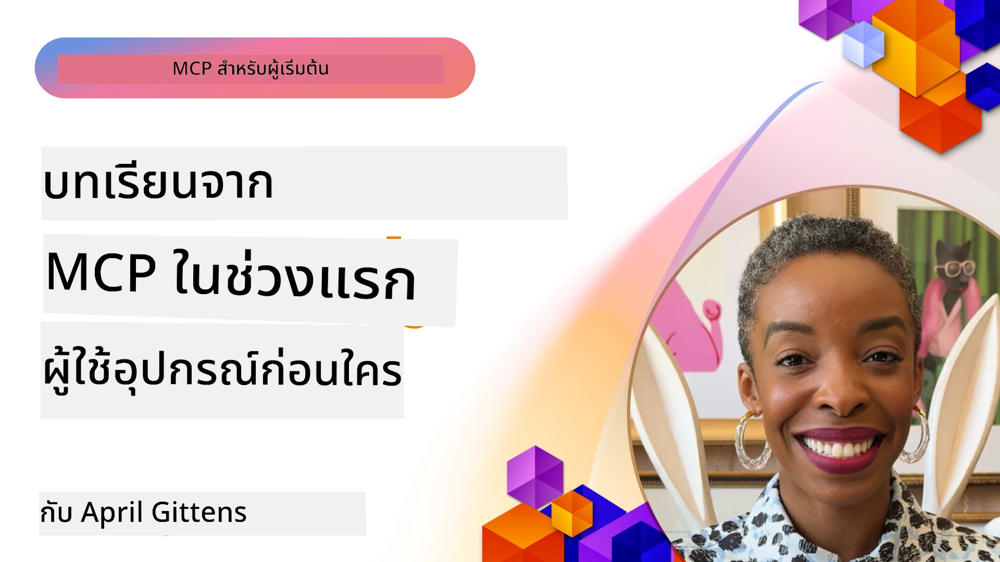

# 🌟 บทเรียนจากผู้ใช้งานรายแรก

[](https://youtu.be/jds7dSmNptE)

_(คลิกภาพข้างบนเพื่อดูวิดีโอบทเรียนนี้)_

## 🎯 โมดูลนี้ครอบคลุมอะไร

โมดูลนี้สำรวจว่าองค์กรและนักพัฒนาจริงๆ ใช้ประโยชน์จาก Model Context Protocol (MCP) อย่างไรในการแก้ไขปัญหาที่แท้จริงและกระตุ้นนวัตกรรม ผ่านกรณีศึกษาละเอียด โครงการลงมือปฏิบัติ และตัวอย่างใช้งานจริง คุณจะค้นพบว่า MCP ช่วยให้การรวม AI ที่ปลอดภัย ปรับขนาดได้ เชื่อมต่อโมเดลภาษาขนาดใหญ่ เครื่องมือ และข้อมูลองค์กรได้อย่างไร

### 📚 ดู MCP ในการทำงาน

ต้องการดูหลักการเหล่านี้นำไปใช้กับเครื่องมือที่พร้อมใช้จริงไหม? ลองดู [**10 Microsoft MCP Servers ที่เปลี่ยนแปลงประสิทธิภาพนักพัฒนา**](microsoft-mcp-servers.md) ซึ่งแสดงเซิร์ฟเวอร์ MCP ของ Microsoft ที่ใช้งานจริงที่คุณสามารถใช้ได้วันนี้

## ภาพรวม

บทเรียนนี้สำรวจว่าผู้ใช้งานรายแรกใช้ประโยชน์จาก Model Context Protocol (MCP) อย่างไรเพื่อแก้ปัญหาในโลกจริงและกระตุ้นนวัตกรรมในหลายอุตสาหกรรม ผ่านกรณีศึกษาละเอียดและโครงการลงมือทำ คุณจะเห็นว่า MCP ช่วยให้การรวม AI ที่ได้มาตรฐาน ปลอดภัย และปรับขนาดได้เชื่อมต่อโมเดลภาษาขนาดใหญ่ เครื่องมือ และข้อมูลองค์กรในกรอบการทำงานเดียวกัน คุณจะได้รับประสบการณ์จริงในการออกแบบและสร้างโซลูชันที่ใช้ MCP เรียนรู้รูปแบบการใช้งานที่พิสูจน์แล้ว และค้นพบแนวปฏิบัติที่ดีที่สุดสำหรับการใช้งาน MCP ในสภาพแวดล้อมการผลิต บทเรียนยังเน้นแนวโน้มใหม่ ทิศทางอนาคต และแหล่งข้อมูลโอเพ่นซอร์สเพื่อช่วยให้คุณอยู่แถวหน้าของเทคโนโลยี MCP และระบบนิเวศที่กำลังพัฒนา

## วัตถุประสงค์การเรียนรู้

- วิเคราะห์การใช้งาน MCP ในโลกจริงในหลายอุตสาหกรรม
- ออกแบบและสร้างแอปพลิเคชันที่สมบูรณ์โดยใช้ MCP
- สำรวจแนวโน้มใหม่และทิศทางอนาคตในเทคโนโลยี MCP
- นำแนวปฏิบัติที่ดีที่สุดไปใช้ในสถานการณ์พัฒนาจริง

## การใช้งาน MCP ในโลกจริง

### กรณีศึกษา 1: ระบบอัตโนมัติฝ่ายสนับสนุนลูกค้าองค์กร

บริษัทข้ามชาตินำโซลูชัน MCP มาใช้เพื่อให้การโต้ตอบ AI ในระบบฝ่ายสนับสนุนลูกค้านั้นได้มาตรฐานเดียวกัน ซึ่งช่วยให้พวกเขา:

- สร้างอินเทอร์เฟซรวมสำหรับผู้ให้บริการ LLM หลายราย
- รักษาการจัดการพรอมต์ให้สม่ำเสมอในทุกแผนก
- ใช้มาตรการความปลอดภัยและการปฏิบัติตามกฎระเบียบอย่างเข้มงวด
- สลับใช้โมเดล AI ต่างๆ ได้อย่างง่ายดายตามความต้องการเฉพาะ

**การใช้งานทางเทคนิค:**

```python
# การใช้งานเซิร์ฟเวอร์ MCP ด้วย Python สำหรับการสนับสนุนลูกค้า
import logging
import asyncio
from modelcontextprotocol import create_server, ServerConfig
from modelcontextprotocol.server import MCPServer
from modelcontextprotocol.transports import create_http_transport
from modelcontextprotocol.resources import ResourceDefinition
from modelcontextprotocol.prompts import PromptDefinition
from modelcontextprotocol.tool import ToolDefinition

# กำหนดค่าการบันทึก
logging.basicConfig(level=logging.INFO)

async def main():
    # สร้างการกำหนดค่าเซิร์ฟเวอร์
    config = ServerConfig(
        name="Enterprise Customer Support Server",
        version="1.0.0",
        description="MCP server for handling customer support inquiries"
    )
    
    # เริ่มต้นเซิร์ฟเวอร์ MCP
    server = create_server(config)
    
    # ลงทะเบียนแหล่งข้อมูลฐานความรู้
    server.resources.register(
        ResourceDefinition(
            name="customer_kb",
            description="Customer knowledge base documentation"
        ),
        lambda params: get_customer_documentation(params)
    )
    
    # ลงทะเบียนแม่แบบคำสั่ง
    server.prompts.register(
        PromptDefinition(
            name="support_template",
            description="Templates for customer support responses"
        ),
        lambda params: get_support_templates(params)
    )
    
    # ลงทะเบียนเครื่องมือสนับสนุน
    server.tools.register(
        ToolDefinition(
            name="ticketing",
            description="Create and update support tickets"
        ),
        handle_ticketing_operations
    )
    
    # เริ่มเซิร์ฟเวอร์ด้วยการขนส่ง HTTP
    transport = create_http_transport(port=8080)
    await server.run(transport)

if __name__ == "__main__":
    asyncio.run(main())
```
  
**ผลลัพธ์:** ลดต้นทุนโมเดลลง 30%, ปรับปรุงความสม่ำเสมอของการตอบกลับ 45% และเพิ่มประสิทธิภาพในการปฏิบัติตามมาตรฐานทั่วโลก

### กรณีศึกษา 2: ผู้ช่วยวินิจฉัยทางการแพทย์

ผู้ให้บริการด้านสุขภาพพัฒนาโครงสร้างพื้นฐาน MCP เพื่อรวมโมเดล AI ทางการแพทย์เชิงเฉพาะหลายตัว ในขณะที่รักษาความลับข้อมูลผู้ป่วยอย่างเข้มงวด:

- สลับใช้โมเดลแพทย์ทั่วไปและผู้เชี่ยวชาญได้อย่างไร้รอยต่อ
- ควบคุมความเป็นส่วนตัวและบันทึกการตรวจสอบอย่างเข้มงวด
- ผสานรวมกับระบบบันทึกสุขภาพอิเล็กทรอนิกส์ (EHR) ที่มีอยู่
- พรอมต์วิศวกรรมที่สอดคล้องกับศัพท์ทางการแพทย์

**การใช้งานทางเทคนิค:**

```csharp
// C# MCP host application implementation in healthcare application
using Microsoft.Extensions.DependencyInjection;
using ModelContextProtocol.SDK.Client;
using ModelContextProtocol.SDK.Security;
using ModelContextProtocol.SDK.Resources;

public class DiagnosticAssistant
{
    private readonly MCPHostClient _mcpClient;
    private readonly PatientContext _patientContext;
    
    public DiagnosticAssistant(PatientContext patientContext)
    {
        _patientContext = patientContext;
        
        // Configure MCP client with healthcare-specific settings
        var clientOptions = new ClientOptions
        {
            Name = "Healthcare Diagnostic Assistant",
            Version = "1.0.0",
            Security = new SecurityOptions
            {
                Encryption = EncryptionLevel.Medical,
                AuditEnabled = true
            }
        };
        
        _mcpClient = new MCPHostClientBuilder()
            .WithOptions(clientOptions)
            .WithTransport(new HttpTransport("https://healthcare-mcp.example.org"))
            .WithAuthentication(new HIPAACompliantAuthProvider())
            .Build();
    }
    
    public async Task<DiagnosticSuggestion> GetDiagnosticAssistance(
        string symptoms, string patientHistory)
    {
        // Create request with appropriate resources and tool access
        var resourceRequest = new ResourceRequest
        {
            Name = "patient_records",
            Parameters = new Dictionary<string, object>
            {
                ["patientId"] = _patientContext.PatientId,
                ["requestingProvider"] = _patientContext.ProviderId
            }
        };
        
        // Request diagnostic assistance using appropriate prompt
        var response = await _mcpClient.SendPromptRequestAsync(
            promptName: "diagnostic_assistance",
            parameters: new Dictionary<string, object>
            {
                ["symptoms"] = symptoms,
                patientHistory = patientHistory,
                relevantGuidelines = _patientContext.GetRelevantGuidelines()
            });
            
        return DiagnosticSuggestion.FromMCPResponse(response);
    }
}
```
  
**ผลลัพธ์:** เสนอคำแนะนำวินิจฉัยที่ดีขึ้นสำหรับแพทย์ พร้อมรักษาความสอดคล้องในการปฏิบัติ HIPAA และลดการสลับบริบทระหว่างระบบอย่างมีนัยสำคัญ

### กรณีศึกษา 3: การวิเคราะห์ความเสี่ยงบริการทางการเงิน

สถาบันการเงินนำ MCP มาใช้เพื่อให้กระบวนการวิเคราะห์ความเสี่ยงของพวกเขามีมาตรฐานเดียวกันในหลายแผนก:

- สร้างอินเทอร์เฟซรวมสำหรับโมเดลความเสี่ยงเครดิต การตรวจจับการฉ้อโกง และความเสี่ยงการลงทุน
- ใช้มาตรการควบคุมการเข้าถึงและการเวอร์ชันโมเดลอย่างเข้มงวด
- ตรวจสอบการแนะนำ AI ทุกตัวอย่างละเอียด
- รักษาการจัดรูปแบบข้อมูลให้สม่ำเสมอในระบบที่หลากหลาย

**การใช้งานทางเทคนิค:**

```java
// เซิร์ฟเวอร์ MCP ของ Java สำหรับการประเมินความเสี่ยงทางการเงิน
import org.mcp.server.*;
import org.mcp.security.*;

public class FinancialRiskMCPServer {
    public static void main(String[] args) {
        // สร้างเซิร์ฟเวอร์ MCP พร้อมคุณสมบัติการปฏิบัติตามข้อกำหนดทางการเงิน
        MCPServer server = new MCPServerBuilder()
            .withModelProviders(
                new ModelProvider("risk-assessment-primary", new AzureOpenAIProvider()),
                new ModelProvider("risk-assessment-audit", new LocalLlamaProvider())
            )
            .withPromptTemplateDirectory("./compliance/templates")
            .withAccessControls(new SOCCompliantAccessControl())
            .withDataEncryption(EncryptionStandard.FINANCIAL_GRADE)
            .withVersionControl(true)
            .withAuditLogging(new DatabaseAuditLogger())
            .build();
            
        server.addRequestValidator(new FinancialDataValidator());
        server.addResponseFilter(new PII_RedactionFilter());
        
        server.start(9000);
        
        System.out.println("Financial Risk MCP Server running on port 9000");
    }
}
```
  
**ผลลัพธ์:** เพิ่มประสิทธิภาพการปฏิบัติตามข้อกำหนดกฎระเบียบ, เร็วขึ้น 40% ในรอบการนำโมเดลไปใช้ และปรับปรุงความสม่ำเสมอในการประเมินความเสี่ยงข้ามแผนก

### กรณีศึกษา 4: Microsoft Playwright MCP Server สำหรับการทำงานอัตโนมัติเบราว์เซอร์

Microsoft พัฒนา [Playwright MCP server](https://github.com/microsoft/playwright-mcp) เพื่อให้การทำงานอัตโนมัติในเบราว์เซอร์ผ่าน Model Context Protocol เป็นไปอย่างปลอดภัยและได้มาตรฐาน เซิร์ฟเวอร์ที่พร้อมใช้งานจริงนี้ช่วยให้เอเจนต์ AI และ LLM สามารถโต้ตอบกับเว็บเบราว์เซอร์ได้อย่างควบคุม ตรวจสอบ และขยายได้ — รองรับกรณีการใช้งาน เช่น การทดสอบเว็บอัตโนมัติ, การดึงข้อมูล และเวิร์กโฟลว์แบบครบวงจร

> **🎯 เครื่องมือพร้อมใช้จริง**
> 
> กรณีศึกษานี้แสดงเซิร์ฟเวอร์ MCP จริงที่คุณสามารถใช้ได้วันนี้! เรียนรู้เพิ่มเติมเกี่ยวกับ Playwright MCP Server และเซิร์ฟเวอร์ Microsoft MCP อีก 9 ตัวใน [**Microsoft MCP Servers Guide**](microsoft-mcp-servers.md#8--playwright-mcp-server)

**คุณสมบัติสำคัญ:**  
- เปิดเผยฟังก์ชันการทำงานอัตโนมัติเบราว์เซอร์ (นำทาง, กรอกแบบฟอร์ม, จับภาพหน้าจอ ฯลฯ) ในฐานะเครื่องมือ MCP  
- ใช้มาตรการควบคุมเข้มงวดและการแยกการทำงาน (sandboxing) เพื่อป้องกันการกระทำที่ไม่ได้รับอนุญาต  
- ให้บันทึกตรวจสอบรายละเอียดสำหรับทุกการโต้ตอบกับเบราว์เซอร์  
- รองรับการผสานรวมกับ Azure OpenAI และผู้ให้บริการ LLM รายอื่นสำหรับการอัตโนมัติที่ขับเคลื่อนโดยเอเจนต์  
- ขับเคลื่อน GitHub Copilot’s Coding Agent ด้วยความสามารถการท่องเว็บ  

**การใช้งานทางเทคนิค:**

```typescript
// TypeScript: ลงทะเบียนเครื่องมืออัตโนมัติของเบราว์เซอร์ Playwright ในเซิร์ฟเวอร์ MCP
import { createServer, ToolDefinition } from 'modelcontextprotocol';
import { launch } from 'playwright';

const server = createServer({
  name: 'Playwright MCP Server',
  version: '1.0.0',
  description: 'MCP server for browser automation using Playwright'
});

// ลงทะเบียนเครื่องมือสำหรับการนำทางไปยัง URL และจับภาพหน้าจอ
server.tools.register(
  new ToolDefinition({
    name: 'navigate_and_screenshot',
    description: 'Navigate to a URL and capture a screenshot',
    parameters: {
      url: { type: 'string', description: 'The URL to visit' }
    }
  }),
  async ({ url }) => {
    const browser = await launch();
    const page = await browser.newPage();
    await page.goto(url);
    const screenshot = await page.screenshot();
    await browser.close();
    return { screenshot };
  }
);

// เริ่มเซิร์ฟเวอร์ MCP
server.listen(8080);
```
  
**ผลลัพธ์:**  

- เปิดใช้งานการทำงานอัตโนมัติเบราว์เซอร์ที่ปลอดภัยและเป็นโปรแกรมสำหรับเอเจนต์ AI และ LLM  
- ลดความพยายามในการทดสอบด้วยมือและปรับปรุงความครอบคลุมการทดสอบเว็บ  
- ให้กรอบการทำงานที่นำกลับมาใช้ใหม่และขยายได้สำหรับบูรณาการเครื่องมือบนเบราว์เซอร์ในสภาพแวดล้อมองค์กร  
- ขับเคลื่อนความสามารถการท่องเว็บของ GitHub Copilot  

**เอกสารอ้างอิง:**  

- [Playwright MCP Server GitHub Repository](https://github.com/microsoft/playwright-mcp)  
- [Microsoft AI and Automation Solutions](https://azure.microsoft.com/en-us/products/ai-services/)

### กรณีศึกษา 5: Azure MCP – Model Context Protocol ระดับองค์กรในรูปแบบบริการ

Azure MCP Server ([https://aka.ms/azmcp](https://aka.ms/azmcp)) คือการใช้งาน MCP ระดับองค์กรที่จัดการโดย Microsoft ออกแบบมาเพื่อมอบความสามารถเซิร์ฟเวอร์ MCP ที่ปรับขนาดได้ ปลอดภัย และปฏิบัติตามข้อกำหนดในรูปแบบบริการคลาวด์ Azure MCP ช่วยให้องค์กรสามารถปรับใช้ จัดการ และผสานรวมเซิร์ฟเวอร์ MCP กับบริการ AI, ข้อมูล และความปลอดภัยของ Azure ได้อย่างรวดเร็ว ลดภาระการดำเนินงานและเร่งการนำ AI มาใช้

> **🎯 เครื่องมือพร้อมใช้จริง**
> 
> นี่คือเซิร์ฟเวอร์ MCP จริงที่คุณสามารถใช้ได้วันนี้! เรียนรู้เพิ่มเติมเกี่ยวกับ Azure AI Foundry MCP Server ใน [**Microsoft MCP Servers Guide**](microsoft-mcp-servers.md).

- โฮสติ้งเซิร์ฟเวอร์ MCP จัดการเต็มรูปแบบพร้อมฟีเจอร์สเกลอัตโนมัติ, การตรวจสอบ และความปลอดภัยในตัว  
- ผสานรวมเนทีฟกับ Azure OpenAI, Azure AI Search และบริการ Azure อื่นๆ  
- การพิสูจน์ตัวตนและอนุญาตระดับองค์กรผ่าน Microsoft Entra ID  
- รองรับเครื่องมือเฉพาะ, เทมเพลตพรอมต์ และคอนเน็กเตอร์ทรัพยากร  
- ปฏิบัติตามข้อกำหนดด้านความปลอดภัยและกฎระเบียบระดับองค์กร  

**การใช้งานทางเทคนิค:**

```yaml
# Example: Azure MCP server deployment configuration (YAML)
apiVersion: mcp.microsoft.com/v1
kind: McpServer
metadata:
  name: enterprise-mcp-server
spec:
  modelProviders:
    - name: azure-openai
      type: AzureOpenAI
      endpoint: https://<your-openai-resource>.openai.azure.com/
      apiKeySecret: <your-azure-keyvault-secret>
  tools:
    - name: document_search
      type: AzureAISearch
      endpoint: https://<your-search-resource>.search.windows.net/
      apiKeySecret: <your-azure-keyvault-secret>
  authentication:
    type: EntraID
    tenantId: <your-tenant-id>
  monitoring:
    enabled: true
    logAnalyticsWorkspace: <your-log-analytics-id>
```
  
**ผลลัพธ์:**  
- ลดเวลาสู่คุณค่าสำหรับโครงการ AI ระดับองค์กรด้วยการจัดเตรียมแพลตฟอร์มเซิร์ฟเวอร์ MCP ที่ใช้งานได้ทันทีและสอดคล้อง  
- ทำให้การผสานรวม LLMs, เครื่องมือ และแหล่งข้อมูลองค์กรง่ายขึ้น  
- เพิ่มความปลอดภัย การสังเกตการณ์ และประสิทธิภาพการดำเนินงานสำหรับงาน MCP  
- ปรับปรุงคุณภาพโค้ดด้วยแนวทางปฏิบัติที่ดีที่สุดของ Azure SDK และรูปแบบการพิสูจน์ตัวตนปัจจุบัน  

**เอกสารอ้างอิง:**  
- [Azure MCP Documentation](https://aka.ms/azmcp)  
- [Azure MCP Server GitHub Repository](https://github.com/Azure/azure-mcp)  
- [Azure AI Services](https://azure.microsoft.com/en-us/products/ai-services/)  
- [Microsoft MCP Center](https://mcp.azure.com)

## กรณีศึกษา 6: NLWeb  
MCP (Model Context Protocol) เป็นโพรโตคอลที่เกิดใหม่สำหรับแชทบ็อตและผู้ช่วย AI ในการโต้ตอบกับเครื่องมือ ทุกอินสแตนซ์ของ NLWeb ยังเป็นเซิร์ฟเวอร์ MCP ซึ่งรองรับเมธอดหลักหนึ่งคือ ask ใช้สำหรับถามเว็บไซต์ด้วยภาษาธรรมชาติ คำตอบที่ส่งกลับใช้สคีมา.org ซึ่งเป็นพจนานุกรมที่ใช้กันอย่างกว้างขวางในการอธิบายข้อมูลเว็บ แบบหลวมๆ ก็คือ MCP คือ NLWeb เช่นเดียวกับ Http ต่อ HTML NLWeb ผสานโพรโตคอล รูปแบบ Schema.org และโค้ดตัวอย่างช่วยให้เว็บไซต์สามารถสร้างจุดเชื่อมต่อเหล่านี้ได้อย่างรวดเร็ว เพื่อช่วยทั้งมนุษย์ผ่านอินเทอร์เฟซสนทนาและเครื่องจักรผ่านการโต้ตอบเอเจนต์ต่อเอเจนต์ในภาษาธรรมชาติ

NLWeb มีสองส่วนประกอบหลัก  
- โพรโตคอล เริ่มต้นง่ายสำหรับการเชื่อมต่อกับไซต์ด้วยภาษาธรรมชาติและรูปแบบตอบกลับโดยใช้ json และ schema.org ดูเอกสาร REST API สำหรับรายละเอียดเพิ่มเติม  
- การใช้งานที่ตรงไปตรงมาของ (1) ที่ใช้มาร์กอัปที่มีอยู่สำหรับไซต์ที่สามารถย่อยเป็นรายการไอเท็ม (ผลิตภัณฑ์, สูตรอาหาร, สถานที่ท่องเที่ยว, รีวิว ฯลฯ) พร้อมด้วยชุดวิดเจ็ต UI ที่ช่วยให้เว็บไซต์ให้บริการอินเทอร์เฟซสนทนาแก่เนื้อหาของพวกเขาได้ง่าย ดูเอกสาร Life of a chat query สำหรับรายละเอียดการทำงานเพิ่มเติม  

**เอกสารอ้างอิง:**  
- [Azure MCP Documentation](https://aka.ms/azmcp)  
- [NLWeb](https://github.com/microsoft/NlWeb)

### กรณีศึกษา 7: Azure AI Foundry MCP Server – การผสานรวมเอเจนต์ AI ระดับองค์กร

เซิร์ฟเวอร์ Azure AI Foundry MCP แสดงให้เห็นว่า MCP ถูกใช้เพื่อจัดระเบียบและจัดการเอเจนต์ AI และเวิร์กโฟลว์ในสภาพแวดล้อมองค์กรอย่างไร ผ่านการผสานรวม MCP กับ Azure AI Foundry องค์กรสามารถทำให้อินเทอร์แอคชันของเอเจนต์มีมาตรฐาน ใช้ประโยชน์จากการจัดการเวิร์กโฟลว์ของ Foundry และรับรองการติดตั้งที่ปลอดภัยและปรับขนาดได้

> **🎯 เครื่องมือพร้อมใช้จริง**
> 
> นี่คือเซิร์ฟเวอร์ MCP จริงที่คุณสามารถใช้ได้วันนี้! เรียนรู้เพิ่มเติมเกี่ยวกับ Azure AI Foundry MCP Server ใน [**Microsoft MCP Servers Guide**](microsoft-mcp-servers.md#9--azure-ai-foundry-mcp-server)

**คุณสมบัติสำคัญ:**  
- การเข้าถึงระบบนิเวศ AI ของ Azure อย่างครบถ้วน รวมถึงแคตตาล็อกโมเดลและการจัดการการติดตั้ง  
- การจัดทำดัชนีความรู้ด้วย Azure AI Search สำหรับแอปพลิเคชัน RAG  
- เครื่องมือประเมินประสิทธิภาพและการรับรองคุณภาพโมเดล AI  
- การผสานรวมกับ Azure AI Foundry Catalog และ Labs สำหรับโมเดลวิจัยล้ำสมัย  
- ความสามารถในการจัดการและประเมินเอเจนต์สำหรับสถานการณ์การผลิต  

**ผลลัพธ์:**  
- การสร้างต้นแบบรวดเร็วและการตรวจสอบเวิร์กโฟลว์เอเจนต์ AI อย่างแข็งแกร่ง  
- การผสานรวมอย่างไร้รอยต่อกับบริการ AI ของ Azure สำหรับสถานการณ์ขั้นสูง  
- อินเทอร์เฟซรวมสำหรับการสร้าง ติดตั้ง และตรวจสอบสายงานเอเจนต์  
- ปรับปรุงความปลอดภัย การปฏิบัติตามกฎระเบียบ และประสิทธิภาพในการดำเนินงานสำหรับองค์กร  
- เร่งการนำ AI มาใช้ในขณะที่ยังคงควบคุมกระบวนการที่ซับซ้อนที่ขับเคลื่อนโดยเอเจนต์

**เอกสารอ้างอิง:**  
- [Azure AI Foundry MCP Server GitHub Repository](https://github.com/azure-ai-foundry/mcp-foundry)  
- [การผสานรวม Azure AI Agents กับ MCP (Microsoft Foundry Blog)](https://devblogs.microsoft.com/foundry/integrating-azure-ai-agents-mcp/)

### กรณีศึกษา 8: Foundry MCP Playground – การทดลองและต้นแบบ

Foundry MCP Playground เสนอสภาพแวดล้อมพร้อมใช้สำหรับทดลองกับเซิร์ฟเวอร์ MCP และการผสานรวม Azure AI Foundry นักพัฒนาสามารถสร้างต้นแบบ ทดสอบ และประเมินโมเดล AI และเวิร์กโฟลว์เอเจนต์โดยใช้ทรัพยากรจาก Azure AI Foundry Catalog และ Labs สนามเด็กเล่นนี้ช่วยให้การตั้งค่ารวดเร็ว มีโปรเจกต์ตัวอย่าง และสนับสนุนการพัฒนาร่วม ทำให้สามารถสำรวจแนวปฏิบัติที่ดีที่สุดและสถานการณ์ใหม่ๆ ได้อย่างง่ายดายและมีภาระน้อย เหมาะอย่างยิ่งสำหรับทีมที่ต้องการตรวจสอบไอเดีย แชร์การทดลอง และเร่งการเรียนรู้โดยไม่ต้องใช้โครงสร้างพื้นฐานที่ซับซ้อน ด้วยการลดอุปสรรค ทำให้สนามเด็กเล่นนี้ช่วยส่งเสริมนวัตกรรมและการมีส่วนร่วมของชุมชนในระบบนิเวศ MCP และ Azure AI Foundry

**เอกสารอ้างอิง:**  

- [Foundry MCP Playground GitHub Repository](https://github.com/azure-ai-foundry/foundry-mcp-playground)

### กรณีศึกษา 9: Microsoft Learn Docs MCP Server – การเข้าถึงเอกสารด้วย AI

Microsoft Learn Docs MCP Server เป็นบริการโฮสต์บนคลาวด์ที่มอบผู้ช่วย AI การเข้าถึงเอกสาร Microsoft อย่างเป็นทางการแบบเรียลไทม์ผ่าน Model Context Protocol เซิร์ฟเวอร์ที่พร้อมใช้งานจริงนี้เชื่อมต่อกับระบบนิเวศ Microsoft Learn อย่างครอบคลุม และรองรับการค้นหาเชิงความหมายผ่านแหล่งข้อมูลทางการของ Microsoft ทั้งหมด

> **🎯 เครื่องมือพร้อมใช้จริง**
> 
> นี่คือเซิร์ฟเวอร์ MCP จริงที่คุณสามารถใช้ได้วันนี้! เรียนรู้เพิ่มเติมเกี่ยวกับ Microsoft Learn Docs MCP Server ใน [**Microsoft MCP Servers Guide**](microsoft-mcp-servers.md#1--microsoft-learn-docs-mcp-server)

**คุณสมบัติสำคัญ:**  
- เข้าถึงเอกสาร Microsoft อย่างเป็นทางการ, เอกสาร Azure และเอกสาร Microsoft 365 แบบเรียลไทม์  
- ความสามารถค้นหาความหมายขั้นสูงที่เข้าใจบริบทและเจตนา  
- ข้อมูลเป็นปัจจุบันเสมอเพราะเนื้อหา Microsoft Learn ถูกเผยแพร่แบบสดๆ  
- ครอบคลุมทั่ว Microsoft Learn, เอกสาร Azure และแหล่งข้อมูล Microsoft 365  
- คืนข้อมูลได้สูงสุด 10 ชุดเนื้อหาคุณภาพพร้อมหัวข้อบทความและ URL  

**เหตุผลว่าทำไมถึงสำคัญ:**  
- แก้ไขปัญหาความรู้ AI ล้าสมัยเกี่ยวกับเทคโนโลยี Microsoft  
- ทำให้ผู้ช่วย AI เข้าถึงฟีเจอร์ล่าสุดของ .NET, C#, Azure และ Microsoft 365  
- ให้ข้อมูลที่เชื่อถือได้จากเจ้าของต้นฉบับสำหรับการสร้างโค้ดที่ถูกต้อง  
- จำเป็นสำหรับนักพัฒนาที่ทำงานกับเทคโนโลยี Microsoft ที่เปลี่ยนแปลงเร็ว  

**ผลลัพธ์:**  
- ปรับปรุงความถูกต้องของโค้ดที่ AI สร้างสำหรับเทคโนโลยี Microsoft อย่างมาก  
- ลดเวลาที่ใช้ค้นหาเอกสารและแนวปฏิบัติที่ดีที่สุด  
- เพิ่มประสิทธิภาพนักพัฒนาด้วยการดึงข้อมูลเอกสารที่รู้บริบท  
- ผสานรวมกับเวิร์กโฟลว์การพัฒนาอย่างไร้รอยต่อโดยไม่ต้องออกจาก IDE  

**เอกสารอ้างอิง:**  
- [Microsoft Learn Docs MCP Server GitHub Repository](https://github.com/MicrosoftDocs/mcp)  
- [Microsoft Learn Documentation](https://learn.microsoft.com/)

## โครงการลงมือปฏิบัติ

### โครงการ 1: สร้างเซิร์ฟเวอร์ MCP หลายผู้ให้บริการ

**วัตถุประสงค์:** สร้างเซิร์ฟเวอร์ MCP ที่สามารถส่งคำขอไปยังผู้ให้บริการโมเดล AI หลายรายตามเกณฑ์เฉพาะ

**ข้อกำหนด:**

- รองรับผู้ให้บริการโมเดลอย่างน้อยสามราย (เช่น OpenAI, Anthropic, โมเดลในเครื่อง)  
- ใช้กลไกการส่งเส้นทางตามเมตาดาต้าของคำขอ  
- สร้างระบบกำหนดค่าจัดการข้อมูลรับรองผู้ให้บริการ  
- เพิ่มระบบแคชเพื่อเพิ่มประสิทธิภาพและลดค่าใช้จ่าย  
- สร้างแดชบอร์ดง่ายๆ สำหรับติดตามการใช้งาน  

**ขั้นตอนการใช้งาน:**

1. ตั้งค่าโครงสร้างพื้นฐานเซิร์ฟเวอร์ MCP ขั้นพื้นฐาน  
2. พัฒนาอะแดปเตอร์สำหรับผู้ให้บริการแต่ละราย  
3. สร้างตรรกะการส่งเส้นทางตามคุณลักษณะคำขอ  
4. เพิ่มกลไกแคชสำหรับคำขอบ่อย  
5. พัฒนาแดชบอร์ดติดตาม  
6. ทดสอบด้วยรูปแบบคำขอหลากหลาย  

**เทคโนโลยี:** เลือกใช้ Python (.NET/Java/Python ตามที่คุณถนัด), Redis สำหรับแคช และเฟรมเวิร์กเว็บง่ายๆ สำหรับแดชบอร์ด

### โครงการ 2: ระบบจัดการพรอมต์ระดับองค์กร
**Objective:** พัฒนาระบบที่ใช้ MCP สำหรับการจัดการ การเวอร์ชัน และการปรับใช้แม่แบบคำสั่ง (prompt templates) ทั่วองค์กร

**Requirements:**

- สร้างที่เก็บข้อมูลศูนย์กลางสำหรับแม่แบบคำสั่ง
- ใช้งานระบบเวอร์ชันและเวิร์กโฟลว์การอนุมัติ
- สร้างความสามารถในการทดสอบแม่แบบด้วยข้อมูลตัวอย่าง
- พัฒนาการควบคุมการเข้าถึงตามบทบาท
- สร้าง API สำหรับการดึงข้อมูลและปรับใช้แม่แบบ

**Implementation Steps:**

1. ออกแบบโครงสร้างฐานข้อมูลสำหรับการจัดเก็บแม่แบบ
2. สร้าง API หลักสำหรับการดำเนินการ CRUD ของแม่แบบ
3. นำระบบเวอร์ชันมาใช้งาน
4. สร้างเวิร์กโฟลว์การอนุมัติ
5. พัฒนาเฟรมเวิร์กสำหรับการทดสอบ
6. สร้างอินเทอร์เฟซเว็บง่ายๆ สำหรับการจัดการ
7. รวมเข้ากับเซิร์ฟเวอร์ MCP

**Technologies:** เลือกใช้เฟรมเวิร์กแบ็กเอนด์, ฐานข้อมูล SQL หรือ NoSQL, และเฟรมเวิร์กฟรอนต์เอนด์สำหรับอินเทอร์เฟซการจัดการตามต้องการ

### โครงการที่ 3: แพลตฟอร์มการสร้างเนื้อหาโดยใช้ MCP

**Objective:** สร้างแพลตฟอร์มการสร้างเนื้อหาที่ใช้ MCP เพื่อให้ผลลัพธ์มีความสม่ำเสมอในหลายรูปแบบเนื้อหา

**Requirements:**

- รองรับรูปแบบเนื้อหาหลายประเภท (บทความบล็อก, โซเชียลมีเดีย, คำโฆษณา)
- นำการสร้างโดยแม่แบบมาใช้พร้อมตัวเลือกกำหนดเอง
- สร้างระบบตรวจทานและฟีดแบ็กเนื้อหา
- ติดตามตัวชี้วัดประสิทธิภาพของเนื้อหา
- รองรับการเวอร์ชันและการปรับปรุงเนื้อหา

**Implementation Steps:**

1. ตั้งค่าโครงสร้างพื้นฐาน MCP client
2. สร้างแม่แบบสำหรับประเภทเนื้อหาต่างๆ
3. สร้างสายงานการสร้างเนื้อหา
4. นำระบบตรวจทานมาใช้
5. พัฒนาระบบติดตามตัวชี้วัด
6. สร้างอินเทอร์เฟซผู้ใช้สำหรับการจัดการแม่แบบและการสร้างเนื้อหา

**Technologies:** ภาษาโปรแกรมที่คุณชื่นชอบ, เฟรมเวิร์กเว็บ และระบบฐานข้อมูล

## ทิศทางในอนาคตของเทคโนโลยี MCP

### แนวโน้มที่เกิดขึ้นใหม่

1. **MCP แบบมัลติโหมด**
   - ขยาย MCP เพื่อสร้างมาตรฐานการโต้ตอบกับโมเดลภาพ, เสียง และวิดีโอ
   - พัฒนาความสามารถการให้เหตุผลข้ามโหมด
   - รูปแบบคำสั่งมาตรฐานสำหรับแต่ละโหมด

2. **โครงสร้างพื้นฐาน MCP แบบฟีดเดอเรต**
   - เครือข่าย MCP ที่กระจายตัว สามารถแชร์ทรัพยากรระหว่างองค์กร
   - โปรโตคอลมาตรฐานสำหรับการแชร์โมเดลอย่างปลอดภัย
   - เทคนิคการประมวลผลที่รักษาความเป็นส่วนตัว

3. **ตลาด MCP**
   - ระบบนิเวศสำหรับแบ่งปันและสร้างรายได้จากแม่แบบและปลั๊กอิน MCP
   - กระบวนการประกันคุณภาพและการรับรอง
   - การรวมเข้ากับตลาดโมเดล

4. **MCP สำหรับการประมวลผลที่ Edge**
   - การปรับมาตรฐาน MCP สำหรับอุปกรณ์ edge ที่มีทรัพยากรจำกัด
   - โปรโตคอลที่ปรับแต่งเพื่อสภาพแวดล้อมแบนด์วิดท์ต่ำ
   - การใช้งาน MCP เฉพาะสำหรับระบบนิเวศ IoT

5. **กรอบการกำกับดูแล**
   - การพัฒนาส่วนขยาย MCP สำหรับความสอดคล้องกับข้อบังคับ
   - ร่องรอยการตรวจสอบมาตรฐานและอินเทอร์เฟซการอธิบายได้
   - การบูรณาการกับกรอบการกำกับดูแล AI ที่เกิดขึ้นใหม่

### โซลูชัน MCP จาก Microsoft

Microsoft และ Azure ได้พัฒนาที่เก็บโอเพนซอร์สหลายแห่งเพื่อช่วยนักพัฒนาในการใช้ MCP ในสถานการณ์ต่างๆ:

#### องค์กร Microsoft

1. [playwright-mcp](https://github.com/microsoft/playwright-mcp) - เซิร์ฟเวอร์ Playwright MCP สำหรับการอัตโนมัติและทดสอบเบราว์เซอร์
2. [files-mcp-server](https://github.com/microsoft/files-mcp-server) - การใช้งานเซิร์ฟเวอร์ OneDrive MCP สำหรับการทดสอบในเครื่องและการร่วมมือจากชุมชน
3. [NLWeb](https://github.com/microsoft/NlWeb) - NLWeb คือชุดโปรโตคอลเปิดและเครื่องมือโอเพนซอร์สที่เกี่ยวข้อง โดยเน้นการสร้างเลเยอร์ฐานสำหรับ AI Web

#### องค์กร Azure-Samples

1. [mcp](https://github.com/Azure-Samples/mcp) - ลิงก์ไปยังตัวอย่าง, เครื่องมือ, และทรัพยากรสำหรับสร้างและรวม MCP เซิร์ฟเวอร์บน Azure ด้วยหลายภาษา
2. [mcp-auth-servers](https://github.com/Azure-Samples/mcp-auth-servers) - เซิร์ฟเวอร์อ้างอิง MCP แสดงการยืนยันตัวตนตามสเปค Model Context Protocol ปัจจุบัน
3. [remote-mcp-functions](https://github.com/Azure-Samples/remote-mcp-functions) - หน้าแสดงการใช้งาน Remote MCP Server บน Azure Functions พร้อมลิงก์ไปยังรีโปเฉพาะภาษาต่างๆ
4. [remote-mcp-functions-python](https://github.com/Azure-Samples/remote-mcp-functions-python) - เทมเพลต Quickstart สำหรับสร้างและปรับใช้ Remote MCP Servers ด้วย Azure Functions และ Python
5. [remote-mcp-functions-dotnet](https://github.com/Azure-Samples/remote-mcp-functions-dotnet) - เทมเพลต Quickstart สำหรับสร้างและปรับใช้ Remote MCP Servers ด้วย Azure Functions และ .NET/C#
6. [remote-mcp-functions-typescript](https://github.com/Azure-Samples/remote-mcp-functions-typescript) - เทมเพลต Quickstart สำหรับสร้างและปรับใช้ Remote MCP Servers ด้วย Azure Functions และ TypeScript
7. [remote-mcp-apim-functions-python](https://github.com/Azure-Samples/remote-mcp-apim-functions-python) - Azure API Management เป็น AI Gateway ไปยัง Remote MCP servers ด้วย Python
8. [AI-Gateway](https://github.com/Azure-Samples/AI-Gateway) - APIM ❤️ ประสบการณ์ AI รวมความสามารถ MCP โดยบูรณาการกับ Azure OpenAI และ AI Foundry

ที่เก็บข้อมูลเหล่านี้มีตัวอย่างการใช้งาน, แม่แบบ, และทรัพยากรสำหรับทำงานกับ Model Context Protocol ในหลายภาษาโปรแกรมและบริการ Azure ครอบคลุมกรณีการใช้งานตั้งแต่การใช้งานเซิร์ฟเวอร์เบื้องต้นจนถึงการยืนยันตัวตน, การปรับใช้บนคลาวด์, และการบูรณาการองค์กร

#### โฟลเดอร์ทรัพยากร MCP

[ไดเรกทอรีทรัพยากร MCP](https://github.com/microsoft/mcp/tree/main/Resources) ในรีโป MCP อย่างเป็นทางการของ Microsoft เป็นชุดสะสมที่คัดสรรของตัวอย่างทรัพยากร, แม่แบบ prompt, และนิยามเครื่องมือสำหรับใช้กับเซิร์ฟเวอร์ Model Context Protocol ไดเรกทอรีนี้ถูกออกแบบมาเพื่อช่วยนักพัฒนาเริ่มต้นกับ MCP ได้อย่างรวดเร็วโดยให้บล็อกที่นำกลับมาใช้ใหม่ได้และตัวอย่างแนวปฏิบัติที่ดีที่สุดสำหรับ:

- **แม่แบบ Prompt:** แม่แบบพร้อมใช้งานสำหรับงานและสถานการณ์ AI ทั่วไป ที่สามารถปรับใช้กับการใช้งานเซิร์ฟเวอร์ MCP ของคุณเอง
- **นิยามเครื่องมือ:** สคีมาและเมตาดาต้าของเครื่องมือตัวอย่างเพื่อสร้างมาตรฐานการรวมและเรียกใช้เครื่องมือผ่านเซิร์ฟเวอร์ MCP หลายแห่ง
- **ตัวอย่างทรัพยากร:** นิยามทรัพยากรตัวอย่างสำหรับเชื่อมต่อกับแหล่งข้อมูล, API, และบริการภายนอกภายในโครงสร้าง MCP
- **ตัวอย่างอ้างอิง:** ตัวอย่างการใช้งานจริงที่แสดงวิธีการจัดโครงสร้างและจัดระเบียบทรัพยากร, prompt, และเครื่องมือในโครงการ MCP จริง

ทรัพยากรเหล่านี้ช่วยเร่งการพัฒนา ส่งเสริมการมาตรฐาน และช่วยให้มั่นใจในแนวปฏิบัติที่ดีที่สุดเมื่อสร้างและปรับใช้โซลูชันที่ใช้ MCP

#### โฟลเดอร์ทรัพยากร MCP

- [ทรัพยากร MCP (ตัวอย่าง prompt, เครื่องมือ และนิยามทรัพยากร)](https://github.com/microsoft/mcp/tree/main/Resources)

### โอกาสการวิจัย

- เทคนิคการเพิ่มประสิทธิภาพ prompt อย่างมีประสิทธิผลภายในกรอบ MCP
- รูปแบบความปลอดภัยสำหรับการใช้งาน MCP แบบหลายผู้เช่า
- การวัดประสิทธิภาพข้ามการใช้งาน MCP ต่างๆ
- วิธีการตรวจสอบความถูกต้องแบบเป็นทางการสำหรับเซิร์ฟเวอร์ MCP

## สรุป

Model Context Protocol (MCP) กำลังก่อรูปแบบอนาคตของการรวม AI ที่เป็นมาตรฐาน ปลอดภัย และเชื่อมต่อกันได้ในอุตสาหกรรมต่างๆ ผ่านกรณีศึกษาต่างๆ และโครงการลงมือทำในบทเรียนนี้ คุณได้เห็นว่าผู้ใช้งานรายแรก—รวมถึง Microsoft และ Azure—ใช้ MCP เพื่อแก้ปัญหาในโลกจริง เร่งการนำ AI มาใช้ และรับรองความปลอดภัย การปฏิบัติตามข้อกำหนด และความสามารถในการขยายตัว วิธีการแบบโมดูลาร์ของ MCP ช่วยให้องค์กรเชื่อมต่อโมเดลภาษาขนาดใหญ่, เครื่องมือ, และข้อมูลองค์กรในกรอบเดียวที่ตรวจสอบได้ ขณะที่ MCP ยังคงพัฒนา การมีส่วนร่วมกับชุมชน, การสำรวจทรัพยากรโอเพนซอร์ส, และการใช้แนวปฏิบัติที่ดีที่สุดจะเป็นกุญแจสำคัญในการสร้างโซลูชัน AI ที่แข็งแกร่งและพร้อมสำหรับอนาคต

## แหล่งข้อมูลเพิ่มเติม

- [MCP Foundry GitHub Repository](https://github.com/azure-ai-foundry/mcp-foundry)
- [Foundry MCP Playground](https://github.com/azure-ai-foundry/foundry-mcp-playground)
- [Integrating Azure AI Agents with MCP (Microsoft Foundry Blog)](https://devblogs.microsoft.com/foundry/integrating-azure-ai-agents-mcp/)
- [MCP GitHub Repository (Microsoft)](https://github.com/microsoft/mcp)
- [MCP Resources Directory (Sample Prompts, Tools, and Resource Definitions)](https://github.com/microsoft/mcp/tree/main/Resources)
- [MCP Community & Documentation](https://modelcontextprotocol.io/introduction)
- [MCP Specification (2025-11-25)](https://spec.modelcontextprotocol.io/specification/2025-11-25/)
- [Azure MCP Documentation](https://aka.ms/azmcp)
- [OWASP MCP Top 10](https://microsoft.github.io/mcp-azure-security-guide/mcp/) - แนวทางปฏิบัติด้านความปลอดภัยที่ดีที่สุด
- [Playwright MCP Server GitHub Repository](https://github.com/microsoft/playwright-mcp)
- [Files MCP Server (OneDrive)](https://github.com/microsoft/files-mcp-server)
- [Azure-Samples MCP](https://github.com/Azure-Samples/mcp)
- [MCP Auth Servers (Azure-Samples)](https://github.com/Azure-Samples/mcp-auth-servers)
- [Remote MCP Functions (Azure-Samples)](https://github.com/Azure-Samples/remote-mcp-functions)
- [Remote MCP Functions Python (Azure-Samples)](https://github.com/Azure-Samples/remote-mcp-functions-python)
- [Remote MCP Functions .NET (Azure-Samples)](https://github.com/Azure-Samples/remote-mcp-functions-dotnet)
- [Remote MCP Functions TypeScript (Azure-Samples)](https://github.com/Azure-Samples/remote-mcp-functions-typescript)
- [Remote MCP APIM Functions Python (Azure-Samples)](https://github.com/Azure-Samples/remote-mcp-apim-functions-python)
- [AI-Gateway (Azure-Samples)](https://github.com/Azure-Samples/AI-Gateway)
- [Microsoft AI and Automation Solutions](https://azure.microsoft.com/en-us/products/ai-services/)

## แบบฝึกหัด

1. วิเคราะห์หนึ่งในกรณีศึกษาและเสนอแนวทางการใช้งานทางเลือกหนึ่ง
2. เลือกหนึ่งในแนวคิดโครงการและสร้างข้อกำหนดทางเทคนิคอย่างละเอียด
3. ศึกษาอุตสาหกรรมที่ไม่ได้กล่าวถึงในกรณีศึกษาและสรุปว่าการใช้ MCP จะจัดการกับความท้าทายเฉพาะของอุตสาหกรรมนั้นอย่างไร
4. สำรวจหนึ่งในทิศทางในอนาคตและสร้างแนวคิดส่วนขยาย MCP ใหม่เพื่อรองรับทิศทางนั้น

## ต่อไป

สำรวจเพิ่มเติม: [Microsoft MCP Servers](./microsoft-mcp-servers.md)

ดำเนินการต่อที่: [Module 8: Best Practices](../08-BestPractices/README.md)

---

<!-- CO-OP TRANSLATOR DISCLAIMER START -->
**ข้อจำกัดความรับผิดชอบ**:
เอกสารฉบับนี้ได้รับการแปลโดยใช้บริการแปลอัตโนมัติ [Co-op Translator](https://github.com/Azure/co-op-translator) แม้ว่าเราจะพยายามให้มีความถูกต้อง โปรดทราบว่าการแปลอัตโนมัติอาจมีข้อผิดพลาดหรือความไม่ถูกต้อง เอกสารต้นฉบับในภาษาต้นทางถือเป็นแหล่งข้อมูลที่ถูกต้องและควรยึดถือ สำหรับข้อมูลสำคัญ ขอแนะนำให้ใช้การแปลโดยนักแปลมืออาชีพ เราจะไม่รับผิดชอบต่อความเข้าใจผิดหรือการตีความที่ผิดพลาดที่เกิดจากการใช้การแปลนี้
<!-- CO-OP TRANSLATOR DISCLAIMER END -->