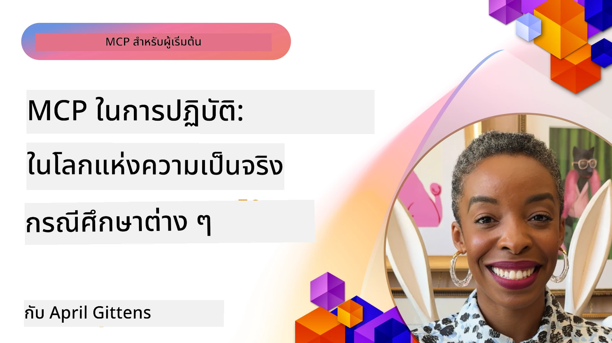

# MCP ในการปฏิบัติ: กรณีศึกษาจากโลกจริง

_(คลิกที่ภาพด้านบนเพื่อดูวิดีโอของบทเรียนนี้)_

โปรโตคอลบริบทโมเดล (Model Context Protocol - MCP) กำลังเปลี่ยนแปลงวิธีที่แอปพลิเคชัน AI โต้ตอบกับข้อมูล เครื่องมือ และบริการ ส่วนนี้นำเสนอกรณีศึกษาจากโลกจริงที่แสดงให้เห็นถึงการประยุกต์ใช้งาน MCP ในสถานการณ์องค์กรต่าง ๆ

## ภาพรวม

ส่วนนี้แสดงตัวอย่างที่เป็นรูปธรรมของการใช้งาน MCP โดยเน้นว่าองค์กรต่าง ๆ ได้นำโปรโตคอลนี้มาใช้เพื่อแก้ไขความท้าทายทางธุรกิจที่ซับซ้อนได้อย่างไร จากการศึกษากรณีเหล่านี้ คุณจะได้รับข้อมูลเชิงลึกเกี่ยวกับความยืดหยุ่น ความสามารถในการปรับขนาด และประโยชน์ในทางปฏิบัติของ MCP ในสถานการณ์จริง

## วัตถุประสงค์การเรียนรู้หลัก

โดยการศึกษากรณีเหล่านี้ คุณจะได้:

- เข้าใจวิธีการใช้ MCP เพื่อแก้ไขปัญหาธุรกิจเฉพาะ
- เรียนรู้เกี่ยวกับรูปแบบการผสานรวมและแนวทางสถาปัตยกรรมที่หลากหลาย
- รับรู้แนวทางปฏิบัติที่ดีที่สุดสำหรับการนำ MCP ไปใช้ในสภาพแวดล้อมองค์กร
- ได้รับข้อมูลเชิงลึกเกี่ยวกับความท้าทายและแนวทางแก้ไขที่พบในการใช้งานจริง
- ระบุโอกาสในการนำรูปแบบที่คล้ายกันไปใช้ในโครงการของคุณเอง

## กรณีศึกษาที่โดดเด่น

### 1. [ตัวแทนท่องเที่ยว AI ของ Azure – ตัวอย่างการอ้างอิง](./travelagentsample.md)

กรณีศึกษานี้ตรวจสอบโซลูชันอ้างอิงที่ครอบคลุมของ Microsoft ซึ่งแสดงวิธีการสร้างแอปพลิเคชันวางแผนการเดินทางที่ใช้ AI หลายตัวแทนด้วย MCP, Azure OpenAI และ Azure AI Search โครงการนี้แสดงให้เห็น:

- การประสานงานหลายตัวแทนผ่าน MCP
- การผสานรวมข้อมูลองค์กรด้วย Azure AI Search
- สถาปัตยกรรมที่ปลอดภัยและปรับขยายได้โดยใช้บริการ Azure
- การขยายเครื่องมือด้วยส่วนประกอบ MCP ที่นำกลับมาใช้ได้ใหม่
- ประสบการณ์ผู้ใช้แบบสนทนาขับเคลื่อนโดย Azure OpenAI

รายละเอียดสถาปัตยกรรมและการดำเนินการให้ข้อมูลเชิงลึกที่มีค่าในการสร้างระบบหลายตัวแทนที่ซับซ้อนโดยใช้ MCP เป็นชั้นการประสานงาน

### 2. [อัปเดตรายการ Azure DevOps จากข้อมูล YouTube](./UpdateADOItemsFromYT.md)

กรณีศึกษานี้แสดงการประยุกต์ใช้งาน MCP ในการอัตโนมัติกระบวนการทำงานจริง แสดงให้เห็นว่าเครื่องมือ MCP สามารถใช้เพื่อ:

- ดึงข้อมูลจากแพลตฟอร์มออนไลน์ (YouTube)
- อัปเดตรายการงานในระบบ Azure DevOps
- สร้างเวิร์กโฟลว์อัตโนมัติที่ทำซ้ำได้
- ผสานรวมข้อมูลข้ามระบบที่แตกต่างกัน

ตัวอย่างนี้แสดงให้เห็นว่าแม้การใช้งาน MCP ที่ค่อนข้างง่ายก็สามารถเพิ่มประสิทธิภาพได้มากโดยการอัตโนมัติในงานประจำและปรับปรุงความสอดคล้องของข้อมูลในระบบต่าง ๆ

### 3. [ดึงเอกสารแบบเรียลไทม์ด้วย MCP](./docs-mcp/README.md)

กรณีศึกษานี้แนะนำวิธีเชื่อมต่อไคลเอนต์คอนโซล Python กับเซิร์ฟเวอร์ Model Context Protocol (MCP) เพื่อดึงและบันทึกเอกสาร Microsoft ที่มีบริบทแบบเรียลไทม์ คุณจะได้เรียนรู้วิธี:

- เชื่อมต่อกับเซิร์ฟเวอร์ MCP ด้วยไคลเอนต์ Python และ SDK MCP ทางการ
- ใช้ไคลเอนต์ HTTP แบบสตรีมมิ่งเพื่อดึงข้อมูลแบบเรียลไทม์อย่างมีประสิทธิภาพ
- เรียกใช้เครื่องมือเอกสารบนเซิร์ฟเวอร์และบันทึกการตอบสนองตรงไปยังคอนโซล
- ผสานรวมเอกสาร Microsoft ที่เป็นปัจจุบันเข้ากับเวิร์กโฟลว์โดยไม่ต้องออกจากเทอร์มินัล

บทนี้รวมทั้งงานปฏิบัติ ตัวอย่างโค้ดพื้นฐาน และลิงก์ไปยังทรัพยากรเพิ่มเติมเพื่อการเรียนรู้ที่ลึกขึ้น ดูคำแนะนำฉบับเต็มและโค้ดในบทที่ลิงก์เพื่อเข้าใจว่า MCP สามารถเปลี่ยนแปลงการเข้าถึงเอกสารและประสิทธิภาพการทำงานของนักพัฒนาในสภาพแวดล้อมคอนโซลได้อย่างไร

### 4. [เว็บแอปสร้างแผนการศึกษาที่โต้ตอบได้ด้วย MCP](./docs-mcp/README.md)

กรณีศึกษานี้แสดงวิธีสร้างแอปเว็บโต้ตอบโดยใช้ Chainlit และ Model Context Protocol (MCP) เพื่อสร้างแผนการศึกษาแบบส่วนบุคคลสำหรับหัวข้อใดก็ได้ ผู้ใช้สามารถระบุหัวข้อ (เช่น "ใบรับรอง AI-900") และระยะเวลาการศึกษา (เช่น 8 สัปดาห์) แล้วแอปจะให้รายละเอียดเนื้อหาแนะนำสำหรับแต่ละสัปดาห์ Chainlit เปิดใช้งานอินเทอร์เฟซแชทแบบสนทนา ทำให้ประสบการณ์น่าสนใจและปรับได้

- เว็บแอปแบบสนทนาขับเคลื่อนโดย Chainlit
- คำสั่งที่ผู้ใช้กำหนดสำหรับหัวข้อและระยะเวลา
- เนื้อหาแนะนำรายสัปดาห์โดยใช้ MCP
- การตอบสนองแบบปรับได้และเรียลไทม์ในอินเทอร์เฟซแชท

โครงการนี้แสดงให้เห็นว่า AI การสนทนาและ MCP สามารถรวมกันเพื่อสร้างเครื่องมือการศึกษาแบบไดนามิกและขับเคลื่อนโดยผู้ใช้ในสภาพแวดล้อมเว็บสมัยใหม่

### 5. [เอกสารในตัวแก้ไขด้วย MCP Server ใน VS Code](./docs-mcp/README.md)

กรณีศึกษานี้แสดงวิธีดึง Microsoft Learn Docs เข้าสู่สภาพแวดล้อม VS Code ของคุณโดยตรงโดยใช้ MCP server — ไม่ต้องสลับแท็บเบราว์เซอร์อีกต่อไป! คุณจะเห็นวิธี:

- ค้นหาและอ่านเอกสารใน VS Code ทันทีโดยใช้แผง MCP หรือแผงคำสั่ง
- อ้างอิงเอกสารและแทรกลิงก์โดยตรงใน README หรือไฟล์ markdown หลักสูตรของคุณ
- ใช้ GitHub Copilot และ MCP ร่วมกันเพื่อเวิร์กโฟลว์เอกสารและโค้ดที่ขับเคลื่อนด้วย AI อย่างราบรื่น
- ตรวจสอบและปรับปรุงเอกสารของคุณด้วยข้อเสนอแนะแบบเรียลไทม์และความถูกต้องที่ได้รับจาก Microsoft
- ผสานรวม MCP กับเวิร์กโฟลว์ GitHub เพื่อการตรวจสอบเอกสารอย่างต่อเนื่อง

การดำเนินการรวมถึง:

- ตัวอย่างการตั้งค่า `.vscode/mcp.json` สำหรับการติดตั้งง่าย
- การสาธิตผ่านภาพหน้าจอของประสบการณ์ในตัวแก้ไข
- เคล็ดลับการรวม Copilot และ MCP เพื่อประสิทธิภาพสูงสุด

สถานการณ์นี้เหมาะสำหรับผู้เขียนหลักสูตร นักเขียนเอกสาร และนักพัฒนาที่ต้องการมุ่งเน้นในตัวแก้ไขขณะทำงานกับเอกสาร Copilot และเครื่องมือตรวจสอบทั้งหมดที่ขับเคลื่อนโดย MCP

### 6. [การสร้าง APIM MCP Server](./apimsample.md)

กรณีศึกษานี้มีคำแนะนำทีละขั้นตอนเกี่ยวกับวิธีการสร้างเซิร์ฟเวอร์ MCP โดยใช้ Azure API Management (APIM) โดยครอบคลุม:

- การตั้งค่าเซิร์ฟเวอร์ MCP ใน Azure API Management
- การเปิดเผยการดำเนินการ API เป็นเครื่องมือ MCP
- การกำหนดนโยบายสำหรับการจำกัดอัตราและความปลอดภัย
- การทดสอบเซิร์ฟเวอร์ MCP โดยใช้ Visual Studio Code และ GitHub Copilot

ตัวอย่างนี้แสดงวิธีใช้ความสามารถของ Azure เพื่อสร้างเซิร์ฟเวอร์ MCP ที่แข็งแกร่งซึ่งสามารถใช้งานในแอปพลิเคชันต่าง ๆ เพื่อเพิ่มการผสานรวมระบบ AI กับ API ในองค์กร

### 7. [GitHub MCP Registry — เร่งการผสานรวมระบบ Agentic](https://github.com/mcp)

กรณีศึกษานี้ตรวจสอบว่า GitHub MCP Registry ซึ่งเปิดตัวในเดือนกันยายน 2025 แก้ไขปัญหาสำคัญในระบบนิเวศ AI อย่างไร: การค้นหาและปรับใช้เซิร์ฟเวอร์ Model Context Protocol (MCP) ที่แยกกระจาย

#### ภาพรวม
**MCP Registry** แก้ไขปัญหาการกระจายตัวของเซิร์ฟเวอร์ MCP ที่กระจัดกระจายอยู่ในรีโพสิตอรีและรีจิสตรีก่อนหน้านี้ ซึ่งทำให้การผสานรวมช้าลงและเกิดข้อผิดพลาด เซิร์ฟเวอร์เหล่านี้ช่วยให้ตัวแทน AI สามารถโต้ตอบกับระบบภายนอกเช่น API ฐานข้อมูล และแหล่งข้อมูลเอกสารได้

#### ปัญหา
นักพัฒนาที่สร้างเวิร์กโฟลว์แบบ agentic เผชิญกับความท้าทายหลายประการ:
- **การค้นหาเซิร์ฟเวอร์ MCP ที่ไม่ดี** ในแพลตฟอร์มต่าง ๆ
- **คำถามการตั้งค่าซ้ำซ้อน** ที่กระจัดกระจายตามฟอรัมและเอกสาร
- **ความเสี่ยงด้านความปลอดภัย** จากแหล่งที่มาไม่ผ่านการตรวจสอบและไม่น่าเชื่อถือ
- **ขาดมาตรฐาน** ในคุณภาพและความเข้ากันได้ของเซิร์ฟเวอร์

#### สถาปัตยกรรมโซลูชัน
GitHub MCP Registry รวมศูนย์เซิร์ฟเวอร์ MCP ที่เชื่อถือได้ พร้อมคุณสมบัติสำคัญ:
- **ติดตั้งด้วยคลิกเดียว** ผ่าน VS Code เพื่อการตั้งค่าง่าย
- **การคัดกรองสัญญาณเทียบกับเสียงรบกวน** โดยดูจากดาว กิจกรรม และการรับรองชุมชน
- **ผสานรวมโดยตรง** กับ GitHub Copilot และเครื่องมือที่รองรับ MCP อื่น ๆ
- **โมเดลการมีส่วนร่วมแบบเปิด** ที่เปิดโอกาสให้ชุมชนและพันธมิตรองค์กรร่วมกันพัฒนา

#### ผลกระทบทางธุรกิจ
รีจิสตรีนี้ส่งมอบการปรับปรุงได้วัดผล:
- **การเริ่มต้นใช้งานที่เร็วขึ้น** สำหรับนักพัฒนาที่ใช้เครื่องมืออย่าง Microsoft Learn MCP Server ที่สตรีมเอกสารทางการเข้าสู่ตัวแทนโดยตรง
- **ประสิทธิภาพที่ดีขึ้น** ผ่านเซิร์ฟเวอร์เฉพาะเช่น `github-mcp-server` ที่ช่วยให้ทำงานอัตโนมัติใน GitHub ด้วยภาษาธรรมชาติ (สร้าง PR, รัน CI ใหม่, สแกนโค้ด)
- **ความน่าเชื่อถือในระบบนิเวศที่แข็งแกร่งขึ้น** ด้วยการคัดกรองและมาตรฐานการกำหนดค่าที่โปร่งใส

#### คุณค่าทางกลยุทธ์
สำหรับผู้เชี่ยวชาญด้านการจัดการวงจรชีวิตตัวแทนและเวิร์กโฟลว์ที่ทำซ้ำได้ MCP Registry ให้:
- **ความสามารถในการปรับใช้ตัวแทนแบบโมดูลาร์** ด้วยส่วนประกอบมาตรฐาน
- **พายไลน์การประเมินผลที่ได้รับการสนับสนุนจากรีจิสตรี** สำหรับการทดสอบและการตรวจสอบที่สม่ำเสมอ
- **ความสามารถในการทำงานร่วมกันข้ามเครื่องมือ** เพื่อผสานรวมอย่างราบรื่นในแพลตฟอร์ม AI ต่าง ๆ

กรณีศึกษานี้แสดงให้เห็นว่า MCP Registry ไม่ใช่แค่ไดเรกทอรี แต่เป็นแพลตฟอร์มพื้นฐานสำหรับการบูรณาการโมเดลและการปรับใช้ระบบ agentic ในระดับที่สามารถขยายได้ในโลกความจริง

## สรุป

กรณีศึกษาทั้งเจ็ดนี้แสดงให้เห็นถึงความยืดหยุ่นอันน่าทึ่งและการประยุกต์ใช้ในทางปฏิบัติของโปรโตคอล Model Context Protocol ในสถานการณ์โลกจริงที่หลากหลาย ตั้งแต่ระบบวางแผนการเดินทางหลายตัวแทนและการจัดการ API องค์กร ไปจนถึงเวิร์กโฟลว์เอกสารที่รวดเร็วและ GitHub MCP Registry ที่เปลี่ยนโฉม กรณีเหล่านี้แสดงให้เห็นว่า MCP ให้วิธีการมาตรฐานที่ขยายได้ในการเชื่อมต่อระบบ AI กับเครื่องมือ ข้อมูล และบริการที่จำเป็นเพื่อมอบคุณค่าที่ยอดเยี่ยม

กรณีศึกษาเหล่านี้ครอบคลุมมิติหลากหลายของการใช้งาน MCP:
- **การผสานรวมองค์กร**: การจัดการ Azure API และการอัตโนมัติ Azure DevOps
- **การประสานงานหลายตัวแทน**: การวางแผนการเดินทางโดยตัวแทน AI ที่ประสานงานกัน
- **ประสิทธิภาพนักพัฒนา**: การผสานรวมกับ VS Code และการเข้าถึงเอกสารแบบเรียลไทม์
- **การพัฒนาระบบนิเวศ**: GitHub MCP Registry ในฐานะแพลตฟอร์มพื้นฐาน
- **การประยุกต์ใช้ทางการศึกษา**: เครื่องมือสร้างแผนการศึกษาเชิงโต้ตอบและอินเทอร์เฟซแบบสนทนา

ผ่านการศึกษาการใช้งานเหล่านี้ คุณจะได้ข้อมูลสำคัญเกี่ยวกับ:
- **รูปแบบสถาปัตยกรรม** สำหรับขนาดและกรณีการใช้งานที่แตกต่างกัน
- **กลยุทธ์การใช้งาน** ที่สมดุลระหว่างฟังก์ชันและการดูแลรักษา
- **ข้อพิจารณาด้านความปลอดภัยและการปรับขยาย** สำหรับการใช้งานในสภาพแวดล้อมจริง
- **แนวทางปฏิบัติที่ดีที่สุด** สำหรับการพัฒนาเซิร์ฟเวอร์ MCP และการผสานรวมไคลเอนต์
- **วิธีคิดเชิงระบบนิเวศ** ในการสร้างโซลูชัน AI ที่เชื่อมโยงกัน

ตัวอย่างเหล่านี้พิสูจน์ว่า MCP ไม่ใช่เพียงกรอบทฤษฎี แต่เป็นโปรโตคอลที่พร้อมใช้ในผลิตภัณฑ์ที่ทำให้สามารถแก้ปัญหาธุรกิจซับซ้อนได้อย่างแท้จริง ไม่ว่าคุณจะสร้างเครื่องมืออัตโนมัติที่ง่ายหรือระบบหลายตัวแทนที่ซับซ้อน รูปแบบและแนวทางที่นำเสนอที่นี่ให้พื้นฐานที่มั่นคงสำหรับโครงการ MCP ของคุณเอง

## แหล่งข้อมูลเพิ่มเติม

- [รีโพสิตอรี Azure AI Travel Agents GitHub](https://github.com/Azure-Samples/azure-ai-travel-agents)
- [เครื่องมือ Azure DevOps MCP](https://github.com/microsoft/azure-devops-mcp)
- [เครื่องมือ Playwright MCP](https://github.com/microsoft/playwright-mcp)
- [Microsoft Docs MCP Server](https://github.com/MicrosoftDocs/mcp)
- [GitHub MCP Registry — เร่งการผสานรวมระบบ Agentic](https://github.com/mcp)
- [ตัวอย่างชุมชน MCP](https://github.com/microsoft/mcp)

## ต่อไป

- ก่อนหน้า: [โมดูล 8: แนวทางปฏิบัติที่ดีที่สุด](../08-BestPractices/README.md)
- ถัดไป: [โมดูล 10: การปรับเวิร์กโฟลว์ AI ให้เรียบง่าย: การสร้าง MCP Server ด้วย AI Toolkit](../10-StreamliningAIWorkflowsBuildingAnMCPServerWithAIToolkit/README.md)

---

<!-- CO-OP TRANSLATOR DISCLAIMER START -->
**ข้อจำกัดความรับผิดชอบ**: เอกสารนี้ได้ถูกแปลโดยใช้บริการแปลภาษาอัตโนมัติ [Co-op Translator](https://github.com/Azure/co-op-translator) แม้ว่าเราจะพยายามให้ความถูกต้อง แต่โปรดทราบว่าการแปลอัตโนมัติอาจมีข้อผิดพลาดหรือความคลาดเคลื่อนได้ เอกสารต้นฉบับในภาษาดั้งเดิมถือเป็นแหล่งข้อมูลที่เชื่อถือได้ หากเป็นข้อมูลที่สำคัญ ควรใช้บริการแปลโดยผู้เชี่ยวชาญมืออาชีพ เรายังไม่รับผิดชอบต่อความเข้าใจผิดหรือการตีความที่ผิดพลาดใดๆ ที่เกิดจากการใช้การแปลนี้
<!-- CO-OP TRANSLATOR DISCLAIMER END -->