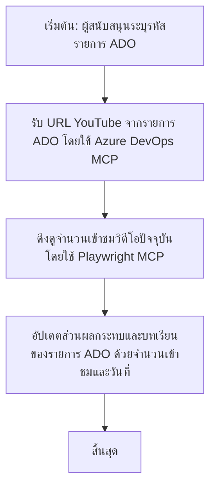

# กรณีศึกษา: การอัปเดตรายการ Azure DevOps จากข้อมูล YouTube ด้วย MCP

> **ข้อจำกัดความรับผิดชอบ:** มีเครื่องมือออนไลน์และรายงานที่มีอยู่แล้วซึ่งสามารถทำให้กระบวนการอัปเดตรายการ Azure DevOps ด้วยข้อมูลจากแพลตฟอร์มอย่าง YouTube เป็นแบบอัตโนมัติได้ สถานการณ์ต่อไปนี้ถูกจัดทำขึ้นเป็นตัวอย่างการใช้งานเพื่อแสดงให้เห็นว่าเครื่องมือ MCP สามารถนำไปใช้ในงานอัตโนมัติและการรวมระบบได้อย่างไร

## ภาพรวม

กรณีศึกษานี้แสดงตัวอย่างหนึ่งของการใช้ Model Context Protocol (MCP) และเครื่องมือของมันในการทำให้งานอัปเดตรายการงานของ Azure DevOps (ADO) ที่มีข้อมูลจากแพลตฟอร์มออนไลน์ เช่น YouTube เป็นแบบอัตโนมัติ สถานการณ์ที่อธิบายนี้เป็นเพียงตัวอย่างหนึ่งของความสามารถโดยรวมของเครื่องมือเหล่านี้ที่สามารถปรับใช้กับความต้องการอัตโนมัติในลักษณะเดียวกันได้หลายกรณี

ในตัวอย่างนี้ ผู้สนับสนุนติดตามเซสชันออนไลน์โดยใช้รายการ ADO ซึ่งแต่ละรายการมี URL ของวิดีโอ YouTube โดยการใช้เครื่องมือ MCP ผู้สนับสนุนสามารถทำให้รายการ ADO เป็นปัจจุบันด้วยข้อมูลเมตริกวิดีโอล่าสุด เช่น จำนวนการดูในรูปแบบที่ทำซ้ำและทำงานโดยอัตโนมัติ แนวทางนี้สามารถนำไปใช้ทั่วไปกับกรณีการใช้งานอื่นๆ ที่ต้องการรวมข้อมูลจากแหล่งออนไลน์เข้าสู่ ADO หรือระบบอื่นๆ

## สถานการณ์

ผู้สนับสนุนมีหน้าที่ติดตามผลกระทบของเซสชันออนไลน์และการมีส่วนร่วมของชุมชน โดยเซสชันแต่ละรายการจะถูกบันทึกเป็นรายการงาน ADO ในโปรเจกต์ 'DevRel' และรายการงานนั้นจะมีฟิลด์สำหรับ URL วิดีโอ YouTube เพื่อรายงานการเข้าถึงของเซสชันอย่างถูกต้อง ผู้สนับสนุนจำเป็นต้องอัปเดตรายการ ADO ด้วยจำนวนการดูวิดีโอล่าสุดและวันที่ข้อมูลนี้ถูกดึงมา

## เครื่องมือที่ใช้

- [Azure DevOps MCP](https://github.com/microsoft/azure-devops-mcp): ช่วยให้เข้าถึงและอัปเดตรายการงาน ADO ผ่าน MCP ได้โดยโปรแกรม
- [Playwright MCP](https://github.com/microsoft/playwright-mcp): ทำให้อัตโนมัติกิจกรรมบนเบราว์เซอร์เพื่อดึงข้อมูลสดจากเว็บเพจ เช่น สถิติวิดีโอ YouTube

## ขั้นตอนการทำงานทีละขั้นตอน

1. **ระบุรายการ ADO**: เริ่มต้นด้วยหมายเลข ID รายการงาน ADO (เช่น 1234) ในโปรเจกต์ 'DevRel'
2. **ดึง URL YouTube**: ใช้เครื่องมือ Azure DevOps MCP เพื่อดึง URL YouTube จากรายการงานนั้น
3. **ดึงจำนวนการดูวิดีโอ**: ใช้เครื่องมือ Playwright MCP เพื่อนำทางไปยัง URL YouTube และดึงจำนวนการดูปัจจุบัน
4. **อัปเดตรายการ ADO**: เขียนจำนวนการดูล่าสุดและวันที่ดึงข้อมูลลงในส่วน 'Impact and Learnings' ของรายการงาน ADO โดยใช้เครื่องมือ Azure DevOps MCP

## ตัวอย่างพรอมต์

```bash
- Work with the ADO Item ID: 1234
- The project is '2025-Awesome'
- Get the YouTube URL for the ADO item
- Use Playwright to get the current views from the YouTube video
- Update the ADO item with the current video views and the updated date of the information
```

## แผนภาพลำดับ Mermaid


## การดำเนินการทางเทคนิค

- **การจัดการ MCP**: งานนี้ถูกจัดการโดยเซิร์ฟเวอร์ MCP ซึ่งประสานงานการใช้ทั้งเครื่องมือ Azure DevOps MCP และ Playwright MCP
- **อัตโนมัติ**: กระบวนการนี้สามารถเริ่มต้นด้วยตนเองหรือตั้งเวลาให้ทำงานเป็นช่วงๆ เพื่อให้รายการ ADO เป็นปัจจุบันเสมอ
- **การขยายผล**: รูปแบบนี้สามารถขยายไปใช้อัปเดตรายการ ADO ด้วยเมตริกออนไลน์อื่นๆ (เช่น ไลค์ ความคิดเห็น) หรือจากแพลตฟอร์มอื่นๆ ได้

## ผลลัพธ์และผลกระทบ

- **ประสิทธิภาพ**: ลดความพยายามด้วยมือสำหรับผู้สนับสนุนโดยทำให้อัตโนมัติการดึงและอัปเดตเมตริกวิดีโอ
- **ความแม่นยำ**: ทำให้แน่ใจว่ารายการ ADO สะท้อนข้อมูลที่เป็นปัจจุบันที่สุดจากแหล่งข้อมูลออนไลน์
- **ความสามารถในการทำซ้ำ**: ให้เวิร์กโฟลว์ที่ใช้ซ้ำได้กับสถานการณ์ที่คล้ายกันที่เกี่ยวข้องกับแหล่งข้อมูลหรือเมตริกอื่นๆ

## อ้างอิง

- [Azure DevOps MCP](https://github.com/microsoft/azure-devops-mcp)
- [Playwright MCP](https://github.com/microsoft/playwright-mcp)
- [Model Context Protocol (MCP)](https://modelcontextprotocol.io/)

## ต่อไปคืออะไร

- กลับไปที่: [ภาพรวมกรณีศึกษา](./README.md)
- ถัดไป: [การดึงเอกสารแบบเรียลไทม์ด้วย MCP](./docs-mcp/README.md)

---

<!-- CO-OP TRANSLATOR DISCLAIMER START -->
**ข้อจำกัดความรับผิดชอบ**:  
เอกสารนี้ได้รับการแปลโดยใช้บริการแปลภาษาด้วย AI [Co-op Translator](https://github.com/Azure/co-op-translator) แม้เราจะพยายามให้ความถูกต้องสูงสุด แต่โปรดทราบว่าการแปลอัตโนมัติอาจมีข้อผิดพลาดหรือความไม่แม่นยำ เอกสารต้นฉบับในภาษาต้นทางควรถูกพิจารณาเป็นแหล่งข้อมูลที่เชื่อถือได้ สำหรับข้อมูลที่สำคัญ แนะนำให้ใช้บริการแปลโดยผู้เชี่ยวชาญด้านภาษามนุษย์ เราไม่รับผิดชอบต่อความเข้าใจผิดหรือการตีความผิดที่เกิดขึ้นจากการใช้การแปลนี้
<!-- CO-OP TRANSLATOR DISCLAIMER END -->